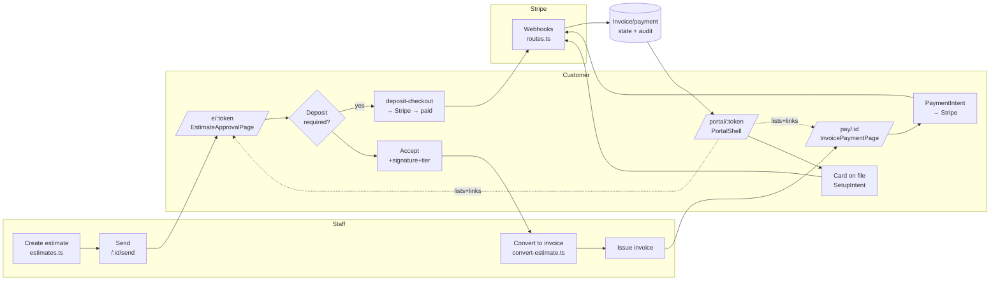

# chore: Verify the quote→invoice→payment→Stripe→customer-portal flow end-to-end and close confirmed gaps

**Created:** 2026-06-14
**Depth:** Deep
**Status:** plan

## Summary
The full "quote-to-cash" flow the request describes — estimate creation, customer
view/accept, conversion to invoice, customer payment, deposits, card-on-file, and a
token-authed customer portal — **already exists end-to-end** in `/packages` (backend
routes + schema + Stripe wiring + customer-facing React pages + tests). Direct file
inspection (not just agent summaries) confirmed this and falsified most of the
"missing" items an exploration pass had flagged. The real job is therefore **not to
build it** but to (A) *prove the assembled flow actually works at runtime* via a
verification campaign that hardens coverage and surfaces real defects, and (B) close
the small set of *confirmed* gaps (portal inline deposit/pay affordances, missing
mobile viewport specs for `/pay/:id` and `/portal/:token`, stale dead-comment hygiene).

## Problem Frame
The product owner asked to "ensure we have a good understanding of the job to be done"
for quote → invoice → payment + a customer portal connected to Stripe. The risk is not
absence of code — it is **false confidence in either direction**: assuming it's
missing (and rebuilding it, which would be wrong by construction), or assuming it works
without proof (the codebase's own history shows mocked-DB tests shipped nonexistent
columns — see `CLAUDE.md`). This plan resolves both by verifying the real flow against
a real database and browser, then fixing only what verification confirms is broken or
genuinely missing. Affected users: end customers (portal, accept, pay) and staff
(operate the flow with confidence it settles money correctly).

## What already exists (verified, do NOT rebuild)
- **Estimates:** `packages/api/src/routes/estimates.ts`, `packages/api/src/estimates/estimate.ts` — CRUD, AI `POST /suggest` (catalog-grounded), `/:id/send`, `/:id/convert-to-invoice`, `/:id/transition`. Schema migrations 020–023, 049 (view tokens), 128 (`accepted_selection`).
- **Invoices:** `packages/api/src/routes/invoices.ts`, `packages/api/src/invoices/invoice.ts`, `convert-estimate.ts`, `deposit-credit.ts`. Migrations 024–025, 050 (Stripe payment link cols).
- **Payments + Stripe:** `packages/api/src/invoices/payment.ts`, `packages/api/src/payments/{payment-service,stripe-payment-intent,stripe-payment-link,stripe-saved-card}.ts`, `packages/api/src/billing/{stripe-connect,subscription}.ts`. Migrations 026, 080, 083, 087.
- **Public/customer routes (token-auth, bypass `withTenantTransaction`):** `packages/api/src/routes/{public-estimates,public-invoices,public-payments,public-portal,portal}.ts`. Deposit checkout exists: `public-estimates.ts:73` → `getOrCreateDepositCheckoutUrl`. Card-on-file SetupIntent exists: `public-portal.ts:843`.
- **Portal session model + RLS:** `packages/api/src/portal/{portal-session,portal-service,portal-token-middleware}.ts`; `portal_sessions` table migrations 065 / 107; view-token lookup functions migration 119.
- **Webhooks:** `packages/api/src/webhooks/{routes,webhook-handler}.ts` — Stripe signature verify + idempotency dedup; handles `checkout.session.completed`, `payment_intent.succeeded`, `payment_intent.payment_failed`, `charge.dispute.created`, `charge.refunded`, `setup_intent.succeeded`, `account.updated`.
- **Money/billing:** `packages/api/src/shared/billing-engine.ts` (integer cents, `applyBps`, `calculateDocumentTotals`).
- **Customer web UI:** `packages/web/src/components/customer/{EstimateApprovalPage,InvoicePaymentPage}.tsx`; `packages/web/src/pages/portal/{PortalShell,PortalDashboard,PortalEstimateList,PortalInvoiceList,PortalJobList,PortalAgreementList,PortalBookAppointment,PortalPaymentMethods,PortalRequestService}.tsx`; client `packages/web/src/api/portal.ts`. Deposit handling lives in `EstimateApprovalPage.tsx:1001-1059` (gate Approve until `depositStatus==='paid'`; calls `POST /public/estimates/:token/deposit-checkout`).
- **Deposit rules settings:** `packages/web/src/components/settings/DepositRulesSheet.tsx` (strategy none/percentage/fixed, timing policy, threshold).

## Confirmed gaps (the only net-new work)
- **G1 — Portal lists have no inline deposit/pay affordance.** `PortalEstimateList.tsx` shows only a "View & respond" link to `/e/:token`; no deposit-required badge or "Pay deposit" CTA. `PortalInvoiceList.tsx` similarly links out rather than surfacing "Pay now"/amount due inline. (Flow still works via click-through; this is a UX completeness gap.)
- **G2 — Missing mobile viewport specs.** `e2e/` has `estimate-approval-mobile.spec.ts` and `booking-mobile.spec.ts` but **none for `/pay/:id` (`InvoicePaymentPage`) or `/portal/:token` (`PortalShell`)** — both are mobile-critical customer surfaces per `CLAUDE.md`.
- **G3 — Stale dead comment.** `public-portal.ts:85` says card-on-file is "When wired…" but the route immediately below (`:843`) *is* wired. Remove the misleading comment (code hygiene mandate).
- **G4 — Defects surfaced by the verification campaign (Phase A).** Unknown until U1–U5 run; remediated in U8.

## Requirements
- R1. Prove the happy-path chain (estimate → send → customer view → accept w/ signature + tier selection → convert → invoice → customer pay → webhook settle → portal reflects state) works against a real DB + real browser, with the proof committed as test coverage.
- R2. Prove the deposit sub-flow works: deposit required → checkout → paid → Approve unlocks → deposit credited on conversion, with correct timing-policy behavior and integer-cent math.
- R3. Prove Stripe payment + webhook settlement is correct and idempotent (intent success/failure, refund, dispute, card-on-file SetupIntent), including signature verification.
- R4. Prove customer/public surfaces are tenant-safe (no cross-tenant or cross-customer leakage) given they bypass `withTenantTransaction` and rely on token scoping + RLS.
- R5. Prove customer surfaces meet mobile contract (≥44px targets, no 320px overflow); add the missing viewport specs.
- R6. Close confirmed gaps G1 and G3; G2 is satisfied by R5's new specs.
- R7. Produce a written end-to-end flow map (the verified "understanding") and a defect punch-list as the durable artifact of the campaign.

## Key Technical Decisions
- **Verify-before-build, and treat verification output as committable test coverage.** Rationale: the request reads as greenfield but the code exists; the failure mode here is unproven assumptions, not missing features. Per `CLAUDE.md`, mocked-DB tests are not proof — so each verification unit's deliverable is a *real* (Docker-gated integration or Playwright) test that pins the behavior, plus a defect note. (Alternative: a pure manual QA pass — rejected: leaves no regression guard and repeats the entity-resolver mistake.)
- **Reuse existing suites; only add tests where coverage is mocked-only or absent.** Rationale: avoid duplicating `e2e/journeys/invoice-to-payment.spec.ts` et al.; spend effort on the seams those suites *don't* cross (deposit timing policy, portal inline affordances, public-surface isolation, `/pay` + `/portal` mobile).
- **Keep the customer-portal trust boundary central to verification (U4 is non-negotiable).** Rationale: public routes deliberately skip `withTenantTransaction` and scope manually by resolved `{tenantId, customerId}`; this is the single highest-risk seam for a customer portal and must be proven, not assumed.
- **G1 affordances link to the proven single-purpose pages, not a reimplementation.** Rationale: `/e/:token` and `/pay/:id` already handle accept/deposit/pay correctly and are tested; the portal should surface state + route to them, not duplicate Stripe logic. (Alternative: embed Stripe Elements directly in the portal list — rejected: duplicates a tested flow, widens the payment attack surface.)

## Scope Boundaries
**In scope:** runtime verification of the existing quote-to-cash + portal + Stripe flow; hardening/adding integration + e2e tests that pin the real chain; closing G1 (portal inline deposit/pay affordance), G2 (missing mobile specs), G3 (stale comment); remediating defects found during verification (U8); a written flow map + punch-list artifact.

**Non-goals:**
- Building any net-new estimate/invoice/payment/Stripe capability that already exists.
- Stripe Connect onboarding UX, SaaS subscription/billing-portal work (`billing/subscription.ts`) — separate tenant-billing concern, not customer quote-to-cash.
- Recurring/membership auto-billing engine changes (card-on-file *capture* is verified; the dunning/charge engine is out of scope).
- Multi-user household portal roles/permissions.
- Refund/void operator UI.

### Deferred to follow-up work
- Operator-facing refund/void UI (backend exists; no UI).
- Portal notification/reminder email templates for overdue invoices (worker exists; templates partial).
- Inline Stripe payment *inside* the portal (vs. click-through) if product later wants it.

## Repository invariants touched
- **Integer cents:** U2 explicitly asserts deposit/credit/total math stays in integer cents via `billing-engine` (`applyBps`); no float introduced.
- **UTC storage / tenant tz render:** U1/U5 assert customer-facing dates render in tenant timezone (`useTenantTimezone`), stored UTC.
- **tenant_id + RLS on every entity; audit on every mutation:** U4 proves public-surface tenant/customer scoping and `portal_sessions` RLS; U1–U3 assert customer actions (view/accept/pay/card-save) emit audit events with `actorRole: 'customer'`.
- **AI proposals Zod-validated, catalog-grounded, never auto-executed; human approval:** U1 confirms the AI estimate-suggest path still routes through the LLM gateway + `catalog-resolver.ts` (uncatalogued caps confidence) and that estimate acceptance/proposal execution honors the approval gate (no silent auto-execute).
- **Entity resolver / voice clarification:** not on the critical quote-to-cash path here; untouched (note only — do not regress).

## High-Level Technical Design

Phase A (U1–U5) walks every edge of this graph against a real DB/browser and pins it
with tests. Phase B (U6–U8) closes the dotted/again-marked gaps (portal affordances,
mobile specs, hygiene) and fixes whatever Phase A turns up.

## Implementation Units

### U1. Verify the happy-path quote-to-cash chain
- **Goal:** Prove and pin the golden chain: staff create → send → customer view (`/e/:token`) → accept (signature + tier selection persisted to `accepted_selection`) → convert to invoice → issue → customer pay (`/pay/:id`) → webhook settle → portal reflects paid.
- **Requirements:** R1, R7 (and confirms AI-suggest invariant).
- **Dependencies:** none.
- **Files (run/confirm, then extend where coverage is mocked-only):**
  - Run: `e2e/journeys/invoice-to-payment.spec.ts`, `e2e/journeys/estimate-approval-execution.spec.ts`, `e2e/journeys/signup-to-first-estimate.spec.ts`, `e2e/qa-matrix/golden-journey.spec.ts`, `e2e/qa-matrix/billing-journey.spec.ts`, `e2e/qa-matrix/public-portal.spec.ts`.
  - Integration: `packages/api/test/integration/{estimates,invoices,estimate-phases}.test.ts`.
  - Add if absent: a single Docker-gated integration test that asserts the *acceptance→conversion* seam carries `accepted_selection` tier choices into invoice line items — `packages/api/test/integration/quote-to-cash-chain.test.ts`.
- **Approach:** Execute suites against the Docker Postgres harness. For each chain edge, confirm there is at least one *non-mocked* assertion of the DB state transition (estimate `sent`→`accepted`; invoice `draft`→`open`→`paid`). Where only mocked-DB unit coverage exists, add the integration assertion. Record every failure in the punch-list (feeds U8). Do not fix here — verify and pin.
- **Patterns to follow:** `packages/api/test/integration/shared.ts` harness; existing `invoices.test.ts` structure.
- **Test scenarios:**
  - Happy path: create→send→accept→convert→issue→pay→paid, asserted at the DB.
  - Edge: accept with multiple tier options selected → exactly-one-per-group enforced (`billing-engine.validateLineItemSelection`); selection survives conversion.
  - Error/failure: accept an expired estimate (past `valid_until`) → rejected; pay an already-paid invoice → no double charge.
  - Integration: tier selection → invoice line items (the new pinned test).
  - DB-touching → Docker-gated integration test (above), not mocked-only.
- **Verification:** All listed suites green against real DB; the chain's state transitions are each asserted at the DB layer; punch-list of any failures recorded.

### U2. Verify the deposit sub-flow + integer-cent credit math
- **Goal:** Prove deposit-required estimates gate acceptance correctly and that paid deposits credit the converted invoice exactly, in integer cents, under both timing policies.
- **Requirements:** R2 (integer-cents invariant).
- **Dependencies:** U1.
- **Files:**
  - Run/confirm: `packages/api/test/integration/invoices.test.ts` (deposit credit), `packages/api/test/shared/billing-engine.test.ts`, `EstimateApprovalPage.deposit.test.tsx`.
  - Inspect: `packages/api/src/invoices/deposit-credit.ts`, `public-estimates.ts:73` (`getOrCreateDepositCheckoutUrl`), `DepositRulesSheet.tsx` (timing policy `after_approval` vs deposit-first).
  - Add if absent: integration test `packages/api/test/integration/deposit-credit-conversion.test.ts` pinning deposit-paid → credit-on-invoice with real rows.
- **Approach:** Confirm the Approve button stays disabled until `depositStatus==='paid'` under the deposit-first timing policy, and that conversion applies the deposit credit once and only once (idempotent, no negative totals, `Math.max(0, …)`), via `applyBps` for percentage strategy. Verify uncredited deposits remain on the job (not lost).
- **Patterns to follow:** `invoices/deposit-credit.ts` existing tests; `billing-engine` rounding tests.
- **Test scenarios:**
  - Happy path: 25% deposit on $500 job → `applyBps(50000, 2500)` = 12500 cents; pay → Approve unlocks → convert credits 12500 to invoice.
  - Edge: deposit already credited → second conversion is a no-op; fixed-amount strategy; threshold (`depositRequiredAboveCents`) boundary just under/over.
  - Error/failure: deposit checkout when Stripe unconfigured → graceful 503, Approve stays gated; rounding never produces fractional cents or negative total.
  - DB-touching → Docker-gated integration test (above).
- **Verification:** Deposit gate + single-credit behavior proven at the DB; all amounts integer cents; timing policies behave per `DepositRulesSheet`.

### U3. Verify Stripe payment + webhook settlement (idempotent, signed)
- **Goal:** Prove payment capture and asynchronous settlement are correct and idempotent across success, failure, refund, dispute, and card-on-file SetupIntent — with signature verification enforced.
- **Requirements:** R3.
- **Dependencies:** U1.
- **Files:**
  - Run/confirm: `packages/api/test/integration/{payments,webhooks,customer-payment-methods}.test.ts`, `packages/api/test/webhooks/stripe-payment-events.test.ts`, `packages/api/test/webhooks/durable-idempotency.test.ts`, `e2e/qa-matrix/payments-edge.spec.ts`.
  - Inspect: `webhooks/routes.ts`, `webhooks/webhook-handler.ts`, `payments/stripe-payment-intent.ts`, `payments/stripe-saved-card.ts`.
- **Approach:** Drive each Stripe event type through the webhook base with a valid and an invalid signature; assert idempotent dedup semantics (processed=dup; in-flight <30s=dup; stale/ failed=retryable). Assert invoice/payment rollups: `payment_intent.succeeded`→paid; `payment_failed`→no paid + reopen if previously paid; `charge.refunded`→decrement; `dispute.created`→reverse + reopen; `setup_intent.succeeded`→card persisted and surfaced by `GET /:token/payment-methods`.
- **Patterns to follow:** existing `webhooks/durable-idempotency.test.ts` concurrency cases.
- **Test scenarios:**
  - Happy path: PI succeeded → invoice paid, payment row `completed`, audit emitted.
  - Edge: duplicate webhook within 30s → single state change; PI created twice for same `(invoiceId, amount)` → one intent (idempotency key).
  - Error/failure: bad signature → 4xx, no state change; refund exceeding paid → over-refund guard; dispute after paid → reversed + invoice reopened.
  - Integration: SetupIntent → `setup_intent.succeeded` → card listed in portal.
  - DB-touching → existing Docker-gated suites (confirm real, extend if mocked-only).
- **Verification:** Every Stripe event maps to the correct money state, idempotently; unsigned/duplicate events cannot double-apply.

### U4. Verify tenant/customer isolation on public + portal surfaces
- **Goal:** Prove the customer-facing trust boundary: token-scoped public routes (which bypass `withTenantTransaction`) cannot read or mutate another tenant's or another customer's data, and `portal_sessions` RLS holds.
- **Requirements:** R4.
- **Dependencies:** none (can run parallel to U1–U3).
- **Files:**
  - Run/confirm: `packages/api/test/integration/{rls-tenant-isolation,tenant-isolation.leak,rls-runtime-audit}.test.ts`, `packages/api/test/db/portal-sessions-rls.test.ts`, `e2e/qa-matrix/isolation.spec.ts`.
  - Inspect: `portal/portal-token-middleware.ts`, `routes/{public-estimates,public-invoices,public-payments,public-portal}.ts` (manual `WHERE tenant_id=$ AND customer_id=$` scoping), migration 119 lookup functions, migration 107 portal RLS.
  - Add if absent: `packages/api/test/integration/public-surface-isolation.test.ts` — cross-tenant + cross-customer negative cases for each public route family.
- **Approach:** For each public route family, attempt access with (a) a valid token for customer A requesting customer B's estimate/invoice, (b) a token resolving to tenant X requesting tenant Y's entity — assert constant-ish 404/410 (no existence leak). Confirm view-token lookup runs through the RLS-safe SQL functions. Confirm rate limiting (60/min/token) and expired/revoked token → 401.
- **Patterns to follow:** `tenant-isolation.leak.test.ts` negative-assertion style; `public-payments.ts` "no leaking" 404 pattern.
- **Test scenarios:**
  - Happy path: token for customer A reads only A's estimates/invoices.
  - Edge: expired/revoked portal token → 401; archived customer → 410.
  - Error/failure: A's token + B's invoiceId → 404 (no leak); tenant-X token + tenant-Y view token → 404; malformed token shape → 401 before any query.
  - DB-touching → Docker-gated integration test (above) — this is the highest-risk seam; mocked DB is explicitly insufficient.
- **Verification:** No public route returns or mutates data outside its resolved `{tenantId, customerId}`; portal RLS denies cross-tenant reads at the DB.

### U5. Verify mobile contract for customer surfaces; identify viewport-spec gaps
- **Goal:** Prove the customer-facing pages meet the mobile contract (≥44px targets, no 320px horizontal overflow) and enumerate which surfaces lack viewport specs.
- **Requirements:** R5 (feeds G2/U7).
- **Dependencies:** none.
- **Files:**
  - Run/confirm: `e2e/estimate-approval-mobile.spec.ts`, `e2e/booking-mobile.spec.ts`, and jsdom contracts `EstimateApprovalPage.layout.test.tsx`, `BookingPage.layout.test.tsx`.
  - Inspect for coverage gaps: `InvoicePaymentPage.tsx` (`/pay/:id`), `PortalShell.tsx` + portal list pages (`/portal/:token`) — confirm **no** existing mobile viewport spec.
- **Approach:** Run existing mobile specs to confirm green. Audit `/pay/:id` and `/portal/:token` against the contract by inspection (tap-target classes `min-h-11`, grid `minmax(0,1fr)` + `min-w-0 break-words`, `tabular-nums` on money). Record the precise missing-spec list for U7 (expected: `/pay/:id`, `/portal/:token`).
- **Patterns to follow:** `e2e/estimate-approval-mobile.spec.ts` (320/390/1280 viewports; overflow + tap-height assertions).
- **Test scenarios:** (verification only here; new specs land in U7)
  - Happy path: existing estimate-approval + booking mobile specs pass at 320/390/1280.
  - Edge: long line-item descriptions wrap (no overflow) on the inspected pages.
  - Test expectation: this unit adds no test of its own — it confirms existing specs and produces the gap list consumed by U7.
- **Verification:** Existing mobile specs green; a concrete, file-named list of customer surfaces missing viewport coverage is produced.

### U6. Close G1 — surface deposit/pay affordances inline in the portal
- **Goal:** Make the portal a complete hub: show deposit-required/amount-due state on estimate and invoice cards with a direct "Pay deposit" / "Pay now" action, routing to the already-proven `/e/:token` and `/pay/:id` pages.
- **Requirements:** R6.
- **Dependencies:** U1, U2 (so the linked flows are confirmed correct first).
- **Files:**
  - `packages/web/src/pages/portal/PortalEstimateList.tsx` (add deposit badge + CTA when `depositRequiredCents>0 && depositStatus!=='paid'`).
  - `packages/web/src/pages/portal/PortalInvoiceList.tsx` (add amount-due + "Pay now" when payable).
  - `packages/web/src/api/portal.ts` (extend `PortalEstimate`/`PortalInvoice` shapes if `depositRequiredCents` / `depositStatus` / `amountDueCents` aren't already returned — confirm against `public-portal.ts` responses; extend the route projection only if missing).
  - Tests: `packages/web/src/pages/portal/__tests__/PortalEstimateList.test.tsx`, `PortalInvoiceList.test.tsx`.
- **Approach:** Read-only surfacing of existing state + a link; no Stripe logic in the portal. If the portal API projection lacks the deposit/amount-due fields, add them to the existing route handler's response mapping (and pin with the relevant integration test). Honor mobile contract (`min-h-11` CTA, no 320px overflow).
- **Patterns to follow:** existing `PortalEstimateList.tsx` card + `PortalCard` component; `formatPortalCents`.
- **Test scenarios:**
  - Happy path: estimate with unpaid deposit renders badge + "Pay deposit" linking to `/e/:token`; payable invoice renders amount due + "Pay now" → `/pay/:id`.
  - Edge: `depositStatus==='paid'` hides the deposit CTA; fully-paid invoice shows "Paid", no CTA.
  - Error/failure: missing/zero amounts render no CTA (no NaN/`$0.00` artifacts).
  - Integration: if route projection changed, a Docker-gated test asserts the new fields come from real rows.
- **Verification:** Customer can see and reach deposit/payment from the portal without prior knowledge of `/e` or `/pay`; jsdom tests assert CTA visibility logic.

### U7. Close G2 — add mobile viewport specs for `/pay/:id` and `/portal/:token`
- **Goal:** Add the missing Playwright viewport specs (and jsdom class contracts where absent) for the two uncovered customer surfaces identified in U5.
- **Requirements:** R5, R6.
- **Dependencies:** U5 (gap list), U6 (so new portal affordances are covered too).
- **Files:**
  - `e2e/invoice-payment-mobile.spec.ts` (new) — `/pay/:id` at 320/390/1280.
  - `e2e/portal-mobile.spec.ts` (new) — `/portal/:token` shell + list cards at 320/390/1280.
  - jsdom: `InvoicePaymentPage.layout.test.tsx` (new, if absent); portal list layout contracts if not covered by U6's tests.
- **Approach:** Mirror `e2e/estimate-approval-mobile.spec.ts` exactly (no horizontal overflow assertion, big-money cell within viewport, tap targets ≥44px). Stub Stripe Elements as needed for deterministic rendering (follow `InvoicePaymentPage.test.tsx` mocking).
- **Patterns to follow:** `e2e/estimate-approval-mobile.spec.ts`, `e2e/booking-mobile.spec.ts`.
- **Test scenarios:**
  - Happy path: both pages render at 320px with `scrollWidth-clientWidth<=0`.
  - Edge: total/amount-due money cell stays within 320px; primary CTAs height ≥44px.
  - Desktop regression: 1280px renders without overflow.
- **Verification:** New specs pass; `/pay/:id` and `/portal/:token` now have the same mobile guard as estimate-approval.

### U8. Remediate confirmed defects + dead-comment hygiene
- **Goal:** Fix the real defects U1–U5 surfaced (G4) and remove confirmed dead/stale code (G3).
- **Requirements:** R6, R7.
- **Dependencies:** U1, U2, U3, U4, U5.
- **Files:** determined by the punch-list; plus `packages/api/src/routes/public-portal.ts:85` (remove stale "When wired" comment now that `:843` is wired). Re-grep before deleting any stub to confirm it's truly unused (per `CLAUDE.md` hygiene rule).
- **Approach:** Each defect gets a failing test first (reproduce), then the fix, in the same commit. Pure-logic fixes get unit tests; DB-touching fixes get a Docker-gated integration test. If verification finds *no* defects, this unit reduces to G3 hygiene + recording "flow verified clean" in the artifact.
- **Patterns to follow:** existing test-first patterns in the relevant subsystem.
- **Test scenarios:**
  - Per defect: failing reproduction → passing after fix.
  - Hygiene: stale comment removed; `grep` confirms no remaining references to the "not wired" assumption.
  - Test expectation for the pure-hygiene portion: none beyond a green build — `reason: comment-only removal, behavior unchanged`.
- **Verification:** Punch-list closed or explicitly deferred with rationale; `cd packages/api && npx tsc --project tsconfig.build.json --noEmit` clean; full API + web test suites green.

## Risks & Dependencies
- **Stripe in tests:** verification must use Stripe test mode / mocked fetchers (the backend uses `fetch`-based wrappers, not the SDK) — confirm `STRIPE_SECRET_KEY`/`VITE_STRIPE_PUBLISHABLE_KEY` test values are wired in the e2e/integration harness; some flows degrade to 503 when unset (acceptable, assert that path too).
- **Docker-gated integration tests** require the pgvector image (pre-pull noted in session setup); U1/U2/U4 depend on it.
- **U4 is the highest-risk unit** — a leak here is a customer-data breach; do not down-scope it.
- **U6 may require a route projection change**; if so it crosses into backend and needs an integration test, slightly enlarging that unit.

## Open Questions (deferred to implementation)
- Exact field names returned by the portal estimate/invoice projections (`PortalEstimate`/`PortalInvoice`) vs. what G1 needs — confirm in `public-portal.ts` + `api/portal.ts` at implementation time; extend projection only if a needed field is absent.
- Whether any U1–U5 failures are true defects vs. test-harness gaps — triage during the campaign; only true defects enter U8.
- Whether the deposit timing-policy default (`after_approval`) matches product intent for the portal click-through path — confirm with product if U2 reveals ambiguity.

## Sources & Research
Grounded entirely in the canonical codebase (no external research needed — payments/Stripe/webhook/RLS patterns are mature and well-tested in-repo). Key verified anchors: `routes/{estimates,invoices,public-estimates,public-portal}.ts`, `EstimateApprovalPage.tsx:1001-1059`, `PortalEstimateList.tsx`, `PortalPaymentMethods.tsx`, `public-portal.ts:843` (SetupIntent) and `:85` (stale comment), `db/schema.ts` migrations 020–128, and the e2e/integration test inventories under `e2e/` and `packages/api/test/integration/`.
