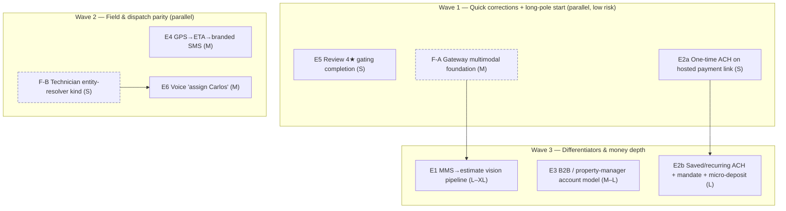

# feat: PRD-Parity Gap-Closure Roadmap (6 overclaimed features)

**Created:** 2026-06-14
**Depth:** Deep (roadmap — index over 6 epics; each epic gets its own `ce-plan` before execution)
**Status:** plan

## Summary
A code-verified roadmap to close the **6 places `docs/PRD-v3.md` §5/§6 marks "✅ Built" but the canonical code in `/packages` does not deliver**. Each gap is an epic with verified current state, PRD-anchored "done", dependencies, sizing, and a recommended build sequence. This document is the **decision artifact and index**; it deliberately stays at roadmap altitude — every epic is itself multi-unit and must be expanded into its own deep `ce-plan` before `ce-work` executes it.

## Problem Frame
The PRD presents the platform as feature-complete against Jobber parity (§5) and the full feature map (§6). A 2026-06-14 code-presence verification found six features the PRD claims as built that are missing or only partially wired. Two are flagged 🔴 (core/parity missing), four are 🟠 (foundations present, flow not completed). The day-in-the-life §1 explicitly names two of them as the "bad day" failure modes (line 122: *"Property manager account not recognized (B2B routing fails). MMS photo quote too generic."*). Closing these aligns shipped reality with the PRD and the locked decisions that depend on them (#6 supervisor-reviewed quotes, #10 B2B first-class, #11 plumbing MMS pack, #12 review monitoring).

This roadmap exists because the six gaps are mostly independent, each a substantial build (~26–37 implementation units total across all six). One mega-plan would be unexecutable; six blind plans would miss the shared foundations and sequencing. The roadmap lets us decide order and dependencies first, then spin a focused plan per epic.

## Requirements
Traceability — each requirement maps to a PRD claim being corrected:

- **R1 (E1, 🔴).** A customer/tech photo sent via MMS produces an AI-drafted estimate with line items, severity + confidence markers, grounded in the tenant catalog, routed through the supervisor and human approval. *(PRD §5 line 228; §6.4 Workflow B lines 350–354; §1 line 119/122; Decisions #6, #11)*
- **R2 (E2, 🔴).** Customers can pay an invoice by ACH (bank debit) via Stripe, originated by the platform — not merely detected on inbound webhooks. *(PRD §5 line 234 "Stripe automatic_payment_methods"; §6.5 line 392; §6.10 line 541)*
- **R3 (E3, 🟠).** Customers carry a richer account type (residential / commercial / property-manager) with parent→sub-account linkage and occupied-property flag, set on inbound recognition, driving differentiated routing. *(PRD §5 line 242; §6.6 lines 410–411, 421, 428–432; §6.1 line 293; Decision #10)*
- **R4 (E4, 🟠).** A technician going "on my way" (app/SMS/voice) computes a drive-time ETA from the latest GPS ping and sends a branded ETA SMS to the customer; predicted late arrival sends a proactive update. *(PRD §5 lines 222–223; §6.3 lines 328–329; §6.8 line 461; §6.9 line 505)*
- **R5 (E5, 🟠).** Post-job review requests gate by rating: ≥4★ → tenant Google link, <4★ → internal feedback only (never public) + owner alert. *(PRD §5 reviews row; §6.11 lines 560–565; Decision #12)*
- **R6 (E6, 🟠).** A spoken "assign Carlos to the Johnson job" resolves the technician by name and produces an appointment-level assignment proposal; ambiguity becomes a one-tap `voice_clarification`. *(PRD §5 line 221; §6.3 line 330; Decision D-007)*
- **R7 (cross-cutting).** Every epic honors the repo invariants (below) and ships with the test types CLAUDE.md mandates. No new proposal auto-executes (Decision #4 / D-004).

## Key Technical Decisions
- **The roadmap is an index, not an executable plan.** Each epic is multi-unit; run a dedicated `ce-plan` per epic immediately before its `ce-work`. *(Alternative: one giant plan — rejected; ~30 units across unrelated seams is unexecutable and unreviewable.)*
- **MMS vision is added *inside* the LLM gateway** (`packages/api/src/ai/gateway`), extending `LLMMessage` content to support image parts and teaching the provider adapter to translate them. *(D-005: "No module outside the gateway may import provider SDKs." Adding a vision SDK call inside the estimate task would violate this. Alternative: a side-channel vision client — rejected.)*
- **ACH ships via Stripe-hosted payment, in two stages.** Stage 2a: enable ACH on the existing hosted payment link / PaymentIntent (`automatic_payment_methods` already on — `packages/api/src/payments/stripe-payment-intent.ts`; webhook already maps `us_bank_account`→`bank_transfer`). Stage 2b: saved/recurring bank debit (SetupIntent `us_bank_account` + mandate + micro-deposit verification). *(D-009: no embedded checkout, minimize PCI. Alternative: embedded bank-entry fields — rejected, expands PCI/UX scope.)*
- **Voice "assign Carlos" needs a new entity-resolver kind `technician`.** The resolver today supports `customer | job | appointment | invoice | estimate | pending_proposal` (`packages/api/src/ai/resolution/entity-resolver.ts:23`) but not technician, so a spoken name can't resolve. Add `technician` + a `pg-entity-resolver` query; assignment targets the **appointment** (D-007), reusing the `voice_clarification` ambiguity path.
- **Review gating is *completed*, not built.** `packages/api/src/routes/public-feedback.ts:128` already returns the Google link only when `rating >= 4`. The work is the `<4` internal path (owner alert + digest line) and an explicit rate-then-route page, not a new gate. *(Avoids the CLAUDE.md "rebuild what exists" trap.)*
- **ETA reuses the wired travel-time provider.** `packages/api/src/scheduling/travel-time/factory.ts` (Google Distance Matrix → Haversine fallback) is already constructed in `app.ts`. The ETA worker mirrors `packages/api/src/workers/feedback-send.ts` and sends via existing consent/DNC-gated `customer-message-delivery.ts`.
- **B2B must resolve dead code, not pile onto it.** The `account_type` flag's only consumer (`property-type-detector.ts`) is unreachable (`extractVulnerabilitySignals()` is never called in the live flow). The B2B epic either wires that detector into triage or deletes the stub (re-grep first) per CLAUDE.md hygiene — it does not extend a dead path silently.
- **No auto-execution for any new AI action.** MMS estimates and voice assignments are proposals requiring human approval (D-004), even at high confidence; catalog-uncatalogued lines cap confidence below auto-approve per the resolver.

## Scope Boundaries
**In scope:** Correcting the 6 overclaimed features (R1–R6) to match the PRD claims, with shared foundations (gateway multimodal; technician resolution) sequenced explicitly. Producing a per-epic `ce-plan` is the immediate next step for whichever epic is picked first.

**Non-goals:**
- The "5 places reality is ahead of the PRD" (not supplied with this request; not actionable here).
- Rebuilding the **estimate lifecycle agent** — a separate roadmap already covers state machine / hosted view / accept-decline / invoice handoff (`docs/superpowers/agents/estimate/implementation-roadmap.md`). E1 feeds *drafts into* that flow; it does not re-implement it.
- Roadmap/§6 items explicitly deferred by the PRD: tips (P22), equipment registry (P24), QuickBooks sync (D-010), Yelp/Facebook review monitoring (§6.11 non-goal), full route optimization, multi-location/hierarchy beyond single-tenant sub-accounts, consumer financing.

### Deferred to follow-up work
- PDF/e-sign for estimates (already deferred in the estimate-agent roadmap — Phase 11).
- "Predicted late arrival" proactive re-ETA (R4 second clause) may split into E4 phase 2 if phase 1 (on-my-way ETA) is the V1 bar.
- Removing/relocating any other dead modules discovered while wiring (e.g. the unused `signal-extractor` path) — handle within the touching epic.

## Repository invariants touched
- **Integer cents** — E2 (ACH amounts; verified integer-cents throughout `payments/*`, keep it).
- **`tenant_id` + RLS** — E3 (new `customers` columns), E4 (ETA idempotency fields), E2b (`customer_payment_methods` bank/mandate columns). Mirror the migration-113 / migration-014 RLS pattern (`ENABLE` + `FORCE` + `tenant_isolation_*` policy).
- **Audit events on every mutation** — E6 (`appointment` assignment), E4 (ETA dispatch row), E2 (existing `payment.*` events extended with ACH reasons), E3 (customer hierarchy changes), E5 (feedback events).
- **LLM gateway** — E1 (multimodal added inside the gateway, D-005).
- **Zod proposals + human-approval gate** — E1 (draft_estimate from photo), E6 (assign_appointment). No auto-execute (D-004).
- **Catalog resolver** — E1 (photo-drafted line items priced via `catalog-resolver.ts`; uncatalogued lines capped at 0.85).
- **Entity resolver + one-tap `voice_clarification`** — E6 (new `technician` kind; ambiguity never a silent guess).

## High-Level Technical Design

Dependency + wave view (foundations dashed):

**Recommended sequence rationale:** Wave 1 corrects the two most self-contained overclaims fast (review gate completion; one-time ACH, which is near-config) **and** starts the single long pole (gateway multimodal) early so E1 isn't a cliff. Wave 2 finishes field/dispatch parity (small, reuses heavy existing infra). Wave 3 delivers the highest-risk/highest-value work — the flagship MMS differentiator, the B2B differentiator (which needs a product decision), and recurring ACH money-movement — when the team's patterns are warm.

**Alternative (differentiator-first):** pull E1 (vision estimate) and E3 (B2B) into Wave 1–2 if the strategic goal is to make the headline differentiators real before parity polish. Trade-off: front-loads the longest, riskiest builds and delays the cheap overclaim corrections. Recommended only if MMS-to-quote is the explicit top business priority.

## Implementation Units (Epics)

> Each epic below is roadmap-altitude. Sizing is T-shirt + rough unit count for the epic's own `ce-plan`. "Verified state" cites canonical paths confirmed on 2026-06-14. Per CLAUDE.md, every epic's detailed `ce-plan` must enumerate: unit-level test scenarios, explicit test file paths, and the mandated test types (pure→unit; voice/AI→handler tests w/ mocked gateway+repos; DB-touching→Docker-gated integration test in `packages/api/test/integration/`; mobile/public UI→jsdom class-contract + Playwright viewport).

### E1. MMS → AI image-analysis → draft estimate  🔴 (Differentiator, core missing)
- **Goal:** Photos arriving by MMS (and photos already on a job) drive an AI-drafted, catalog-grounded, supervisor-reviewed draft estimate with severity + confidence markers — PRD §6.4 Workflow B.
- **Requirements:** R1, R7.
- **Verified state:**
  - MMS ingest exists and attaches photos to **jobs** (not estimates): `packages/api/src/sms/tech-status/mms-ingest.ts` (audit `sms.mms_photos_ingested`), via `AttachmentService` + storage pipeline (P0-009 async split).
  - Estimate drafting is **text-only**: `packages/api/src/ai/tasks/estimate-task.ts` builds messages from transcript/context with no image input; prices grounded via `packages/api/src/ai/resolution/catalog-resolver.ts` (TAU_HIGH 0.85, uncatalogued cap 0.85); executes via `DraftEstimateExecutionHandler` (`packages/api/src/proposals/execution/handlers.ts:455`).
  - **Hard blocker:** the gateway is text-only — `LLMMessage.content: string` (`packages/api/src/ai/gateway/gateway.ts`); no image/multimodal field anywhere.
- **Dependencies:** **F-A (gateway multimodal)** — must land first. Soft: estimate-agent roadmap (downstream lifecycle).
- **Key files:** `packages/api/src/ai/gateway/{gateway.ts,providers.ts,router.ts}` (F-A); `packages/api/src/ai/tasks/estimate-task.ts` (vision intake + photo retrieval via attachments-by-entity); `packages/api/src/ai/resolution/catalog-resolver.ts` (add visual-evidence/visual-ambiguity confidence signals); `packages/api/src/sms/tech-status/mms-ingest.ts` (optional: enqueue a "photo received → offer draft" path); `packages/api/src/proposals/audit.ts` (stamp `visualEvidence: {jobId, attachmentIds}` on the proposal); supervisor pass per Decision #6.
- **Approach:** F-A extends `LLMMessage` to allow image parts (URL/base64) and teaches the active provider adapter to emit them; gate behind a capability flag so the text path is untouched. The estimate task, when a job has photos, fetches attachments, includes them in the vision request, and proceeds through the **existing** catalog-resolution + confidence + proposal + supervisor flow. Uncatalogued/visually-ambiguous lines force `draft` (human fills), never auto-approve (D-004).
- **Test focus:** gateway multimodal unit + provider-adapter translation tests; estimate-task handler tests with a **mocked vision gateway** asserting photo→line-items→catalog-resolution→confidence-cap; audit-linking assertion; supervisor-review invoked. No real provider calls in tests.
- **Size:** **L–XL** (~6–8 units). Long pole of the program.
- **Next step:** dedicated `ce-plan` (split F-A as its own early unit).

### E2. ACH payment origination  🔴 (Parity, missing)
- **Goal:** Originate ACH bank-debit payments for invoices via Stripe-hosted flow — PRD §5 line 234.
- **Requirements:** R2, R7 (integer cents).
- **Verified state:** Card PaymentIntents (`automatic_payment_methods[enabled]=true`), payment links, and saved cards (SetupIntent, off-session) all exist (`packages/api/src/payments/{stripe-payment-intent,stripe-payment-link,stripe-saved-card}.ts`). ACH is **detect-only**: `webhooks/routes.ts` maps `us_bank_account`/`ach_debit`/`acss_debit`→`bank_transfer`, reverses NSF (`payment_intent.payment_failed`→`reversePayment` reason `ach_return`), clears ACH refunds. **Missing origination:** no SetupIntent for `us_bank_account`, no mandate, no micro-deposit verification. `payment_method` enum already includes `bank_transfer`; money is integer-cents throughout.
- **Dependencies:** none for 2a; 2a → 2b.
- **Key files:** `packages/api/src/payments/stripe-payment-intent.ts` / `stripe-payment-link.ts` (2a: ensure ACH-eligible hosted flow + record); `packages/api/src/webhooks/routes.ts` (confirm `payment_intent.succeeded` records ACH; add `processing` handling); `packages/api/src/payments/stripe-saved-card.ts` + `pg-customer-payment-method.ts` + `db/schema.ts` (2b: `us_bank_account` SetupIntent, mandate + verification columns); `packages/api/src/payments/payment-service.ts` (ACH reason codes).
- **Approach:** **2a (S)** — verify/enable ACH on the existing hosted payment link/PaymentIntent (largely Stripe config + confirming webhook records `bank_transfer` for a real ACH PI, plus `processing` status copy on the portal). **2b (L)** — add saved/recurring ACH: SetupIntent `payment_method_types=['us_bank_account']`, mandate tracking, micro-deposit verification webhook + confirmation flow, off-session ACH charge returning `processing`. Honors D-009 (no embedded fields).
- **Test focus:** integration test against schema for new bank/mandate columns (Docker-gated); webhook handler unit tests for ACH `succeeded`/`processing`/`failed`/mandate events with **mocked Stripe**; integer-cents validation retained; audit `payment.*` events asserted.
- **Size:** **M–L** (2a ~2–3 units, 2b ~3–4 units). Highest correctness risk (money + verification).
- **Next step:** dedicated `ce-plan`; resolve open question on 2a-only vs 2a+2b for V1.

### E3. B2B / property-manager account model + recognition + routing  🟠 (Differentiator, partial — thinner than noted)
- **Goal:** First-class B2B accounts (residential/commercial/property-manager), parent→sub-account linkage, occupied-property flag, set on inbound recognition and driving differentiated routing — PRD §6.6 + Decision #10.
- **Requirements:** R3, R7.
- **Verified state:** `customers.account_type TEXT CHECK (… IN ('residential','b2b'))` (migration 113, `db/schema.ts:2905`); TS field `accountType`; Zod `z.enum(['residential','b2b']).optional()` (`packages/shared/src/contracts/customer.ts:42`). **Sole consumer is dead code:** `property-type-detector.ts` fires only via `extractVulnerabilitySignals()`, which is **never called** in the live flow (triage uses `gradeVulnerability()` LLM-only, no customer facts). **No inbound path sets `accountType`** (voice create handler omits it → NULL). **No** parent/sub-account, organization, or routing constructs exist.
- **Dependencies:** none hard. Product decision required (see Open Questions) — what "routing" does for a 1–3-truck ICP without violating Decision #15 (no added admin work).
- **Key files:** `packages/api/src/db/schema.ts` (new migration: expand `account_type`/add `account_role`, `parent_account_id UUID REFERENCES customers(id)`, occupied flag; indexes; RLS unchanged); `packages/api/src/customers/{customer.ts,pg-customer.ts}` + `packages/shared/src/contracts/customer.ts` (fields + `findSubAccounts`); `packages/api/src/proposals/contracts.ts` + `execution/create-customer-handler.ts` (set on create/update via approved proposal); `packages/api/src/ai/skills/identify-caller.ts` (recognition → set/verify account type, §6.6 line 431); resolve `property-type-detector.ts` dead code (wire into triage or delete stub).
- **Approach:** Additive migration mirroring migration-113 idempotent pattern; expand enum and add self-referential parent FK + occupied flag. Wire recognition so an inbound B2B claim is verified or surfaced as a confidence marker (Decision #5). Define "routing" minimally per the product decision (e.g., priority + occupied-property triage elevation), reusing the existing proposal/approval surface.
- **Test focus:** Docker-gated integration test pinning the new columns + sub-account query (CLAUDE.md: mocked-DB is insufficient — the resolver shipped with phantom columns once); contract round-trip unit tests; recognition handler test; if wiring the detector, a triage test proving it now fires.
- **Size:** **M–L** (~5–7 units).
- **Next step:** dedicated `ce-plan` after the routing-scope product decision.

### E4. GPS → ETA → branded "on my way" SMS  🟠 (Parity, partial)
- **Goal:** "On my way" computes a drive-time ETA from the latest ping and texts the customer a branded ETA; late-arrival prediction sends a proactive update — PRD §6.3 lines 328–329.
- **Requirements:** R4, R7.
- **Verified state:** GPS pings collected + stored (`packages/api/src/routes/technician-location.ts`, `packages/api/src/telemetry/technician-location-ping.ts`). Travel-time provider **already wired** (`packages/api/src/scheduling/travel-time/factory.ts`, used in `app.ts`). SMS + worker infra exist (`notifications/twilio-delivery-provider.ts`, `notifications/templates.ts`, consent/DNC-gated `notifications/customer-message-delivery.ts`, worker pattern `queues/queue.ts` + registry in `app.ts`, exemplar `workers/feedback-send.ts`). Service-location lat/lng present (`locations/location.ts`). **Missing:** ETA calc service, `renderTechnicianEtaSms`, ETA worker, the on-my-way trigger, and idempotency/status fields.
- **Dependencies:** none hard (optionally F-B to name the tech in the SMS — not blocking).
- **Key files:** new `packages/api/src/workers/technician-eta-worker.ts` (mirror `feedback-send.ts`); new ETA service (latest ping + location + travel-time → minutes); `packages/api/src/notifications/templates.ts` (`renderTechnicianEtaSms`); reuse `customer-message-delivery.ts`; `packages/api/src/db/schema.ts` (e.g. `appointments.technician_eta_sent_at`, `technician_status`); trigger endpoint/intent for "on my way" (app tap / SMS keyword / voice); register worker in `app.ts`.
- **Approach:** On "on my way", enqueue `technician_eta` for the appointment; worker loads appointment+location+latest ping, calls the travel-time provider, renders the branded template, sends via the consent/DNC path, writes a dispatch row, and stamps the idempotency field. Phase 2 (optional): periodic late-arrival re-ETA.
- **Test focus:** pure ETA-calc unit tests (ping + address + provider → minutes; stale-ping + missing-location edges); worker handler test with mocked SMS/provider asserting consent/DNC gating + idempotency; Docker-gated integration test for the new appointment columns.
- **Size:** **M** (~4–6 units).
- **Next step:** dedicated `ce-plan`; resolve the trigger-source open question.

### E5. Review request 4★ gating  🟠 (Parity, partial — mostly present)
- **Goal:** Rating ≥4 → tenant Google link; rating <4 → internal feedback only + owner alert — PRD §6.11 lines 560–565.
- **Requirements:** R5, R7.
- **Verified state:** `RequestFeedbackExecutionHandler` exists (`packages/api/src/proposals/execution/full-app-voice-handlers.ts:248`); registered (`handlers.ts:784`); feedback request/response with **numeric rating 1–5** captured (`packages/api/src/feedback/feedback-response.ts:21`); public submission **already gates** — `public-feedback.ts:128` returns `reviewUrls` (Google/Yelp from tenant settings) **only when `rating >= 4`**. Google monitoring + draft-response pipeline exist. **Missing:** the `<4` internal-only path beyond simply omitting links — owner alert + digest line; and an explicit rate-then-route page UX.
- **Dependencies:** none.
- **Key files:** `packages/api/src/routes/public-feedback.ts` (formalize the rate→route response; ensure `<4` is internal-only — already true); owner-alert/digest emission for low ratings (tie into existing end-of-day digest); `packages/web` feedback page (rate-then-route UX, mobile tap targets); tenant `googleReviewUrl` settings already present.
- **Approach:** Keep the existing ≥4 redirect; add a `<4` branch that records internal feedback, suppresses public links (already the behavior), and raises an owner alert + digest line. Tighten the public page into an explicit rating-first → conditional CTA flow.
- **Test focus:** route unit tests for both branches (≥4 returns link, <4 returns none + flags internal/alert); jsdom class-contract + Playwright viewport test for the feedback page (CLAUDE.md mobile rule: ≥44px targets, no 320px overflow).
- **Size:** **S** (~2–4 units). Smallest epic.
- **Next step:** dedicated `ce-plan`; confirm the `<4` alert destination (digest vs immediate owner SMS).

### E6. Voice "assign Carlos to the Johnson job"  🟠 (Parity, partial)
- **Goal:** A spoken assignment resolves the technician by name and produces an **appointment-level** assign proposal; ambiguity → one-tap `voice_clarification` — PRD §5 line 221.
- **Requirements:** R6, R7.
- **Verified state:** `reassign_appointment` intent + `ReassignAppointmentExecutionHandler` (`packages/api/src/proposals/execution/reassignment-handler.ts`, calls `notifyDispatchBoardChanged`) + dispatch board (`packages/api/src/dispatch/board-query.ts`, `board-notify.ts`) all exist. **Missing:** (a) an `assign_appointment` intent for unassigned/held appointments (`intent-classifier.ts` lists ~50 intents but not this); (b) **technician entity resolution** — `entity-resolver.ts:23` supports `customer|job|appointment|invoice|estimate|pending_proposal`, **not `technician`**, so "Carlos" cannot resolve on the voice path. Exemplar end-to-end skill to mirror: `reschedule_appointment` (intent → `voice-extended-tasks.ts RescheduleAppointmentTaskHandler` → execution handler).
- **Dependencies:** **F-B (technician resolver kind)** — fold in as the first unit of this epic.
- **Key files:** `packages/api/src/ai/resolution/{entity-resolver.ts,pg-entity-resolver.ts}` (add `technician` kind + pg_trgm query, threshold TAU_ENT 0.8); `packages/api/src/ai/orchestration/intent-classifier.ts` (register `assign_appointment` + prompt examples); `packages/api/src/workers/voice-action-router.ts` (intent→proposalType map + handler wiring + existing `emitClarification` for ambiguity); `packages/api/src/ai/tasks/voice-extended-tasks.ts` (new `AssignAppointmentTaskHandler`, mirror reassign); new `packages/api/src/proposals/contracts/assign.ts` (Zod) + `AssignAppointmentExecutionHandler` (assign-only, call `notifyDispatchBoardChanged`).
- **Approach:** Add `technician` resolution so the router annotates "Carlos"→tech-id (one match resolved; many → `voice_clarification`; none → review-UI pick). New `assign_appointment` skill drafts an appointment-level assign proposal (D-007); execution assigns + notifies the board + audits. Human-approved (D-004).
- **Test focus:** technician-resolver scoring unit tests + a Docker-gated integration test pinning the real technician/user columns the query reads (CLAUDE.md: the resolver previously shipped with phantom columns under a mocked Pool); assign task-handler test with mocked gateway/resolver (resolved / ambiguous→clarification / not-found); execution-handler test (assign + board notify + audit).
- **Size:** **M** (~4–5 units incl. F-B).
- **Next step:** dedicated `ce-plan`.

## Risks & Dependencies
- **Gateway multimodal (F-A) is on the shared LLM path.** Regression risk to every existing text task. Mitigate: capability-flagged, additive `LLMMessage` shape, provider-adapter unit tests, text path byte-for-byte unchanged when no image parts present.
- **ACH is money movement + verification.** Mandate revocation, micro-deposit timing, `processing` (not settled) states, NSF reversal interplay. Mitigate: 2a (one-time) first to validate plumbing; integration tests; reuse the proven reversal path.
- **B2B alters the high-traffic `customers` table** and depends on an undecided product definition of "routing." Mitigate: additive idempotent migration; resolve routing scope before planning; integration-test the columns.
- **CLAUDE.md dead-code rule:** E3 must wire-or-delete the `property-type-detector` stub; any epic that finds "built but never wired" modules must resolve them (re-grep usage first).
- **Two estimate systems exist** (`ai/tasks/estimate-*` legacy draft path vs `agents/estimate/*` lifecycle roadmap). E1 targets the wired draft path; coordinate so the photo-drafted estimate feeds the lifecycle agent, not a fork.

## Open Questions (resolve before / inside each epic's ce-plan)
- **E3 routing semantics:** For a 1–3-truck ICP, what does "property-manager routing / priority flow" concretely do (priority booking, dedicated dispatcher, occupied-property triage elevation) without adding owner admin work (Decision #15)?
- **E4 trigger source for V1:** app "On my way" tap vs SMS keyword vs voice vs auto-departure detection (PRD says "tap or say"). Which ships first; is late-arrival re-ETA in V1?
- **E1 vision specifics:** which gateway-routed vision model; cost/latency budget; the plumbing severity-marker taxonomy (§6.4 step 3 "severity markers").
- **E2 V1 bar:** one-time ACH on payment link only (2a) for V1, or include saved/recurring mandate (2b)?
- **E5 low-rating destination:** `<4` alert via end-of-day digest line, immediate owner SMS, or both?

## Sources & Research
- `docs/PRD-v3.md` — §3 Locked Decisions (lines 139–162), §5 parity map (211–262: claims at lines 221–223, 228, 234, 242), §6.4/6.5/6.6/6.11 workflows, §8 roadmap, §1 day-in-the-life (119/122).
- `docs/decisions.md` — D-003 (cents), D-004 (proposal-first, no auto-exec), D-005 (gateway/no provider SDK leakage), D-007 (appointment-level assignment), D-009 (no embedded checkout).
- `docs/superpowers/agents/estimate/implementation-roadmap.md` — adjacent estimate-lifecycle program (E1 feeds it; do not duplicate).
- Code verification (2026-06-14), six parallel scout passes + direct greps — canonical paths cited per epic above. No `docs/solutions/` learnings exist yet for these areas.
