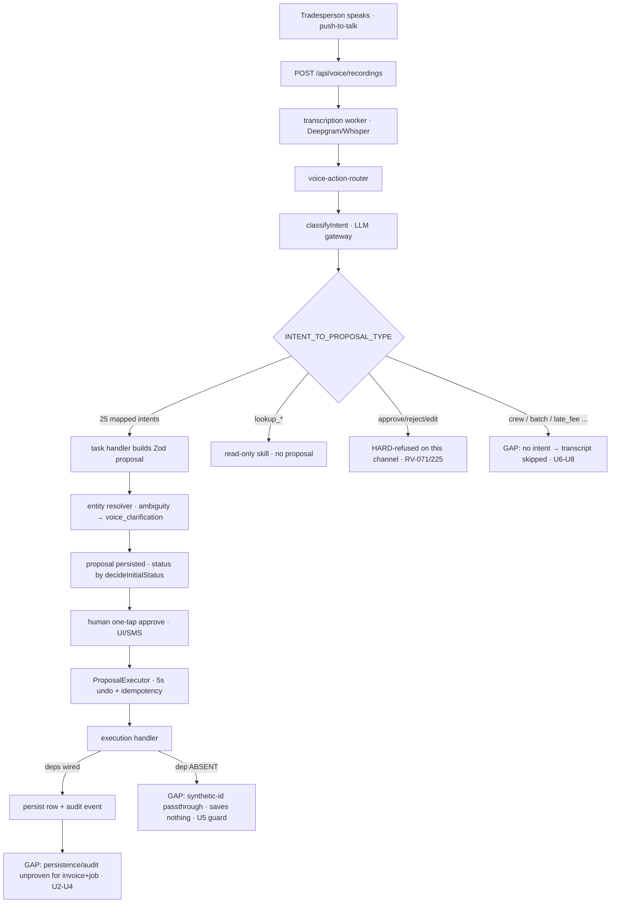

# feat: Voice-driven action pipeline — audit, persistence verification, and gap build-out

**Created:** 2026-06-14
**Depth:** Deep
**Status:** plan

## Summary
A tradesperson speaks an instruction ("invoice the Johnson job for $450", "book
Carlos Tuesday at 2", "open a job for Alvarez, no AC") and the system must turn
that into a typed proposal, get one-tap human approval, and then **actually
persist** the invoice / job / appointment with `tenant_id`, integer-cent money,
and an audit event. This plan (1) certifies that the persistence actually
happens for every voice-reachable action, (2) ships a durable, drift-tested
**voice action capability matrix** (the "what works / what doesn't" lists), and
(3) builds the highest-value actions that are *not yet speakable* even though
their execution machinery already exists.

The pipeline is far more complete than the docs suggest: **all 25
voice-reachable intents already have both a task handler (speech → proposal)
and an execution handler (approval → persisted entity)**, and production wires
real Postgres repos. The gaps are subtler and more dangerous than "missing
features": unproven persistence, silent dependency-degradation, and a set of
actions that have handlers but no voice on-ramp.

## Problem Frame
The owner-operator (Mike/Jenna in `docs/strategy/day-in-the-life.md`) runs the
business by voice + one-tap approval. Two failure modes are unacceptable and
currently **not guarded against**:

1. **"It looked like it worked but nothing saved."** Several execution handlers
   degrade to a synthetic-id passthrough when a dependency is absent — they
   return `{ success: true, resultEntityId: <synthetic> }` and persist nothing.
   Nothing asserts the production registry is fully wired, and no integration
   test proves `draft_invoice` / `create_job` actually land a row + audit event
   in real Postgres (only `create_appointment` and `create_customer` do). The
   audit emission on the create paths is best-effort and asserted by **no test**
   — a refactor that drops it passes green.
2. **"I told it to do X and nothing happened."** Some reasonable spoken actions
   (add a crew member, batch-invoice the day, apply a late fee, set up a deposit
   schedule) have fully built proposal types + execution handlers but **no
   classifier intent and no entry in `INTENT_TO_PROPOSAL_TYPE`**, so the
   transcript is silently skipped.

This plan makes the first class of failure *loud and tested*, and closes the
highest-value cases of the second class.

## Requirements
- **R1.** Prove, with Docker-gated integration tests against real Postgres, that
  a spoken `create_invoice` and `create_job` flow through approval → execution →
  a persisted row with correct columns, `tenant_id`, integer-cent totals, line
  items, and the matching `*.created` audit event.
- **R2.** Assert audit emission on all three create paths (invoice/job/
  appointment) so dropping it fails a test.
- **R3.** Turn silent dependency-degradation into a loud startup failure: when a
  Postgres pool is configured, every voice-reachable `ProposalType` must resolve
  to a handler whose required deps are wired (no synthetic-id passthrough in
  prod).
- **R4.** Produce a durable **voice action capability matrix** (known-to-work vs.
  not-yet-completable) that is generated from / checked against the code so it
  cannot silently drift.
- **R5.** Make the highest-value not-yet-speakable actions speakable
  (crew add/remove, batch invoice, collections: late fee / payment reminder /
  estimate nudge), reusing the existing proposal types + handlers.
- **R6.** Every new/changed unit ships its tests in the same commit; the
  production build (`tsc --project tsconfig.build.json`) stays green.

## Key Technical Decisions
- **Certify-then-build.** Wave A (audit + verification + wiring guard) lands
  before Wave B (new voice on-ramps). Rationale: the user's first ask is "make
  sure all is saved." Proving and guarding the existing 25 actions is higher
  value and lower risk than adding more actions on top of an unverified base.
- **The capability matrix is code-checked, not prose.** A contract test imports
  `SUPPORTED_INTENTS`, `INTENT_TO_PROPOSAL_TYPE`, the execution-registry keys,
  and `actionClassForProposalType`, and fails when the published matrix drifts
  from the code. Rationale: `docs/remaining-features.md` already rotted (it lists
  `emergency_dispatch` as missing; it shipped). A static doc will rot too; a
  test won't. (Alternative: hand-maintained doc — rejected, it always drifts.)
- **Wiring guard via a per-handler capability flag, not duplicated dep checks.**
  Each `ExecutionHandler` exposes whether it is running in degraded
  (synthetic-id) mode; the guard reads that, so the check can't fall out of sync
  with the handler's own dep logic. (Alternative: re-derive required deps in a
  separate manifest — rejected, two sources of truth diverge.)
- **New voice actions add the front half only.** Crew/batch/collections already
  have proposal types + Zod schemas + execution handlers + action-class entries.
  The build is classifier intent + entity extraction + `INTENT_TO_PROPOSAL_TYPE`
  + routing tests — no new migrations, no new handlers. Rationale: minimal blast
  radius; reuses settled patterns.
- **Do NOT build voice approve/reject/edit.** `approve_proposal` /
  `reject_proposal` / `edit_proposal` are hard-refused on the recorder channel
  by RV-071/225 and are post-launch per `docs/launch/voice-interaction-scope.md`
  (launch approves by screen/SMS tap). Building them contradicts a locked scope
  decision. Listed as an explicit non-goal.

## Scope Boundaries
**In scope:**
- Integration + audit tests certifying invoice/job/appointment persistence (R1, R2).
- Production execution-wiring guard + test (R3).
- The voice action capability matrix artifact + drift test (R4).
- New voice on-ramps for crew add/remove, batch invoice, and collections
  (late fee / payment reminder / estimate nudge), reusing existing handlers (R5).

**Non-goals:**
- Voice-based proposal approval/rejection/editing (post-launch; RV-071/225).
- Live mic / streaming STT / barge-in on the web client (post-launch per
  `voice-interaction-scope.md`).
- The telephony / customer-calling agent path (separate Phase 8 track).
- STT provider quality/latency work (Deepgram/Whisper already wired).

### Deferred to follow-up work
- `assign_technician` AI-ranked dispatch proposal by voice — needs a **new**
  proposal type + handler (parity roadmap **P25**), not just an on-ramp. Bigger;
  schedule after Wave B.
- `add_equipment` / equipment registry by voice (parity **P24**) — no type/handler yet.
- Auto-invoice on job completion (a worker trigger, not a spoken action;
  parity **P20 / C1**).
- Voice on-ramp for `review_response_proposal` and `create_booking` — not field
  voice actions (review-monitoring / customer-call FSM driven respectively).

## Repository invariants touched
- **Integer cents** — invoice/payment/late-fee assertions check `*_cents`
  columns and never compare floats; reuse `shared/billing-engine.ts`.
- **RLS / `tenant_id`** — every integration test includes a cross-tenant
  negative; the wiring guard does not weaken RLS.
- **Audit events** — R2 makes `invoice.created` / `job.created` /
  `appointment.created` emission a tested guarantee.
- **LLM gateway** — new intents are classified through the existing gateway
  `classify_intent` task; no direct provider calls.
- **Zod proposals + human-approval gate** — no new auto-execution; new actions
  inherit their action class (`money`/`comms`/`irreversible` never auto-approve
  via `decideInitialStatus`; capture-class only auto-approves under the
  autonomous-trust path that already exists).
- **Catalog resolver / entity resolver** — new on-ramps route free-text
  references (technician, invoice, estimate, customer) through the entity
  resolver; ambiguity → `voice_clarification`, never a silent guess. Invoice
  line prices stay catalog-grounded.

## High-Level Technical Design

The pipeline and where each gap sits:



**Voice action capability matrix (ground truth, 2026-06-14).** This is the
seed content for the U1 artifact; U1 makes it code-checked.

### A) Known to work — speech → proposal → approve → persisted (wired + prod-configured)
| Spoken example | Intent | ProposalType | Class | Execution handler | Persistence proof |
|---|---|---|---|---|---|
| "Invoice the Johnson job, $450 capacitor + labor" | `create_invoice` | `draft_invoice` | capture | `CreateInvoiceExecutionHandler` | ❌ mocked-only → **U2** |
| "Quote the Khan install, 3-ton condenser" | `draft_estimate` | `draft_estimate` | capture | `DraftEstimateExecutionHandler` | ❌ partial |
| "Book Carlos at the Garcia place Tue 2pm" | `create_appointment` | `create_appointment` | capture | `CreateAppointmentExecutionHandler` | ✅ `integration/appointments.test.ts` |
| "New customer Maria Alvarez, 480-555-0102" | `create_customer` | `create_customer` | capture | `CreateCustomerVoiceExecutionHandler` | ✅ `integration/voice-create-customer.test.ts` |
| "Open a job for Alvarez, no AC" | `create_job` | `create_job` | capture | `CreateJobExecutionHandler` | ❌ indirect-only → **U3** |
| "Add a $90 contactor to the Smith invoice" | `update_invoice` | `update_invoice` | capture | `UpdateInvoiceExecutionHandler` | ❌ |
| "Change the Khan quote to a 3-ton" | `update_estimate` | `update_estimate` | capture | `UpdateEstimateExecutionHandler` | ❌ |
| "Issue the Garcia invoice" | `issue_invoice` | `issue_invoice` | **money** | `IssueInvoiceExecutionHandler` | ❌ |
| "Move the Garcia job to Thursday 10" | `reschedule_appointment` | `reschedule_appointment` | capture | `RescheduleAppointmentExecutionHandler` | ❌ partial |
| "Cancel Tuesday's Garcia appointment" | `cancel_appointment` | `cancel_appointment` | **irreversible** | `CancelAppointmentExecutionHandler` | ❌ partial |
| "Put Carlos on the Garcia job instead of me" | `reassign_appointment` | `reassign_appointment` | capture | `ReassignAppointmentExecutionHandler` | ❌ |
| "Note on the Patel job: wants morning visits" | `add_note` | `add_note` | capture | `AddNoteExecutionHandler` | ❌ |
| "Send the Johnson invoice" | `send_invoice` | `send_invoice` | **comms** | `SendInvoiceExecutionHandler` | ❌ |
| "Send the Khan estimate" | `send_estimate` | `send_estimate` | **comms** | `SendEstimateExecutionHandler` | ❌ |
| "Mark the Smith invoice paid, $200 cash" | `record_payment` | `record_payment` | **money** | `RecordPaymentExecutionHandler` | ❌ |
| "Emergency, no heat at the Hayes place — page me" | `emergency_dispatch` | `emergency_dispatch` | **irreversible** | `EmergencyDispatchExecutionHandler` | ❌ |
| "Update Alvarez's phone number" | `update_customer` | `update_customer` | capture | `UpdateCustomerExecutionHandler` | ❌ |
| "Log a $60 parts expense on the Patel job" | `log_expense` | `log_expense` | capture | `LogExpenseExecutionHandler` | ❌ |
| "Convert the Greenfield lead to a customer" | `convert_lead` | `convert_lead` | capture | `ConvertLeadExecutionHandler` | ❌ |
| "Confirm the Garcia appointment" | `confirm_appointment` | `confirm_appointment` | capture | `ConfirmAppointmentExecutionHandler` | ❌ |
| "Mark the Wagner lead lost — went with a competitor" | `mark_lead_lost` | `mark_lead_lost` | capture | `MarkLeadLostExecutionHandler` | ❌ |
| "Add a service location for Greenfield, 12 Lakeshore" | `add_service_location` | `add_service_location` | capture | `AddServiceLocationExecutionHandler` | ❌ |
| "Clock 2 hours on the Patel job" | `log_time_entry` | `log_time_entry` | capture | `LogTimeEntryExecutionHandler` | ❌ |
| "Text the Garcia customer I'm 20 min late" | `notify_delay` | `notify_delay` | **comms** | `NotifyDelayExecutionHandler` | ❌ |
| "Ask the Smith customer for a review" | `request_feedback` | `request_feedback` | **comms** | `RequestFeedbackExecutionHandler` | ❌ |
| "Customer's upset about the bill" | `complaint` | `add_note` + `callback` | capture/comms | `_complaint` handler | ❌ |
| "Customer wants 20% off or they walk" | `negotiation` | `callback` | capture | `_negotiation` guardrail | ❌ (no mutation by design) |

> **Legend.** ✅ = Docker-gated integration test proves persist + audit.
> ❌ = wired and prod-configured but **persistence/audit not proven by an
> integration test** (works in code; could break silently under schema drift or
> a missing dep). "partial" = some handler/unit coverage exists but not the full
> approve→execute→persist→audit chain.

### B) Not yet completable from speech — handler exists, **no voice on-ramp** (build candidates)
| Spoken example a tradesperson would expect to work | ProposalType (built) | Class | Plan |
|---|---|---|---|
| "Add Carlos to the Garcia appointment" | `add_crew_member` | capture | **U6** |
| "Take Carlos off Tuesday's job" | `remove_crew_member` | capture | **U6** |
| "Invoice all my completed jobs from today" | `batch_invoice` | capture | **U7** |
| "Add a late fee to the overdue Smith invoice" | `apply_late_fee` | **money** | **U8** |
| "Send a payment reminder on the Smith invoice" | `send_payment_reminder` | **comms** | **U8** |
| "Nudge the Khan estimate again" | `send_estimate_nudge` | **comms** | **U8** |
| "Set up 50% deposit, 50% on completion for Garcia" | `create_invoice_schedule` | capture | Deferred (complex payload) |
| "Respond to that 1-star review" | `review_response_proposal` | comms | Deferred (not a field voice action) |
| "Book this caller for Thursday" | `create_booking` | capture | Deferred (customer-call FSM path) |

### C) Not completable from speech — **no proposal type/handler yet** (true white-space)
| Spoken example | Status | Reference |
|---|---|---|
| "Assign the closest certified tech to this job" | needs new type + handler + intent | parity **P25** (deferred) |
| "Add the Carrier unit I serviced in May to this customer" | needs new type + handler + intent | parity **P24** (deferred) |

### D) Classified but intentionally **gated** (not a gap — a locked decision)
| Spoken example | Intent | Behavior | Reason |
|---|---|---|---|
| "Approve that proposal" | `approve_proposal` | refused on recorder channel | RV-071; live-owner telephony only; post-launch |
| "Reject that" | `reject_proposal` | refused on recorder channel | RV-071 |
| "Change line two to 3-ton" (on a proposal) | `edit_proposal` | refused on recorder channel | RV-225 |

### E) Read-only voice queries (work today; not "actions")
`lookup_appointments`, `lookup_invoices`, `lookup_balance`, `lookup_jobs`,
`lookup_customer`, `lookup_estimates`, `lookup_availability`, `lookup_leads`,
`lookup_revenue`, `lookup_catalog`, `lookup_account_summary`,
`lookup_day_overview`, `lookup_digest`, `lookup_pending_items` — routed to skills,
never to a proposal (correct by design).

## Implementation Units

### U1. Voice action capability matrix — published + drift-tested
- **Goal:** Ship the durable "what works / what doesn't" artifact and a test that
  fails when it drifts from the code, so it can't rot like `remaining-features.md`.
- **Requirements:** R4.
- **Dependencies:** none (can land first; it documents current truth).
- **Files:**
  - `docs/reference/voice-action-catalog.md` (new) — the tables in the design
    section above, plus a machine-readable block (a fenced list of
    `intent → proposalType → actionClass → speakable?(yes/no) → persistenceProof`).
  - `packages/api/test/ai/voice-action-catalog.contract.test.ts` (new).
- **Approach:** The contract test imports `SUPPORTED_INTENTS` and
  `INTENT_TO_PROPOSAL_TYPE` (`packages/api/src/workers/voice-action-router.ts`),
  the registry keys from `createExecutionHandlerRegistry(...)`
  (`packages/api/src/proposals/execution/handlers.ts`), and
  `actionClassForProposalType` (`packages/api/src/proposals/proposal.ts`). It
  parses the machine-readable block from the markdown and asserts: every mapped
  voice intent appears in the doc with the correct proposal type + action class;
  every voice-reachable proposal type has a registered handler; every doc row
  marked "speakable" is actually in `INTENT_TO_PROPOSAL_TYPE` (or is the
  `_complaint`/`_negotiation` sentinel); no mapped intent is missing from the doc.
- **Patterns to follow:** `packages/api/test/decisions/decisions.test.ts`
  (a doc-pinned-to-code test that fails if the artifact and code disagree).
- **Test scenarios:**
  - Happy path: doc and code agree → test passes.
  - Drift: add a fake intent to the map without updating the doc → test fails
    with the offending intent named.
  - Drift: mark a row "speakable" that is not in the map → test fails.
  - Edge: `_complaint` / `_negotiation` sentinels and `lookup_*` exclusions are
    handled without false positives.
- **Verification:** The catalog file exists, lists all 25 voice actions + the
  not-yet/gated/read-only sections, and the contract test is green.

### U2. Integration test — `draft_invoice` approve → execute → persist → audit
- **Goal:** Prove a spoken invoice actually lands an `invoices` row + line items
  + `invoice.created` audit in real Postgres. This is the headline "is it saved?"
  gap and the user's #1 named entity.
- **Requirements:** R1, R2.
- **Dependencies:** none.
- **Files:** `packages/api/test/integration/draft-invoice-execution.test.ts` (new).
- **Approach:** Docker-gated (pgvector/pg16 testcontainer, the existing
  integration harness). Seed tenant + customer + job + settings via factories;
  build a `draft_invoice` proposal (reuse the invoice task handler output shape
  or a fixture payload); approve via `approveProposal`; run `ProposalExecutor`
  with the real Pg-backed registry; then assert directly against Postgres:
  `invoices` row has `tenant_id`, `job_id`, `invoice_number`, `status='draft'`,
  integer-cent `subtotal_cents/tax_cents/total_cents`; `invoice_line_items` rows
  present with correct `unit_price_cents`/`total_cents`; one `audit_events` row
  with `event_type='invoice.created'`, `entity_id=<invoice.id>`.
- **Patterns to follow:** `packages/api/test/integration/appointments.test.ts`
  (full approve→execute→persist), `packages/api/test/integration/voice-create-customer.test.ts`.
- **Test scenarios:**
  - Happy path: proposal → approve → execute → invoice + line items + audit persisted.
  - Money edges: zero-amount line, rounding boundary, large (>$100k) total — cents exact.
  - Tenant isolation: invoice created in tenant A is not readable under tenant B (RLS).
  - Idempotency: re-running the same execution (same idempotency key) does not double-create.
  - Failure path: missing `invoiceRepo` dep → handler must NOT silently report a
    persisted invoice (this is the behavior U5 will enforce repo-wide).
- **Verification:** `SELECT` against the container DB shows the invoice, its line
  items, and the audit event; cross-tenant read returns nothing.

### U3. Integration test — `create_job` persist + audit, and appointment audit assertion
- **Goal:** Close the remaining create-path proof gaps for the user's trio.
- **Requirements:** R1, R2.
- **Dependencies:** none.
- **Files:**
  - `packages/api/test/integration/create-job-execution.test.ts` (new).
  - `packages/api/test/integration/appointments.test.ts` (extend) — add an
    assertion that `appointment.created` audit is written on execute.
- **Approach:** Same harness as U2. For jobs: seed tenant + customer + location;
  `create_job` proposal → approve → execute; assert `jobs` row (`tenant_id`,
  `customer_id`, `location_id`, `job_number`, `status`) + `job.created` audit.
  For appointments: extend the existing passing test to assert the audit row
  (persistence is already proven there).
- **Patterns to follow:** U2; existing `appointments.test.ts`.
- **Test scenarios:**
  - Happy path (job): row + `job.created` audit persisted.
  - Tenant isolation negative (job).
  - Appointment: `appointment.created` audit asserted; dedup case emits exactly
    one (no second event on idempotent re-create — matches `wasDeduped` logic).
- **Verification:** Both create paths show row + audit in the container DB.

### U4. Audit-emission unit tests on the create paths
- **Goal:** Make "dropping the audit call" a failing test at the unit level (fast
  feedback, no container needed), complementing U2/U3.
- **Requirements:** R2.
- **Dependencies:** none.
- **Files (extend):**
  - `packages/api/test/invoices/invoice.test.ts`
  - `packages/api/test/jobs/job.test.ts`
  - `packages/api/test/appointments/appointment.test.ts`
- **Approach:** With an in-memory/mock `auditRepo` spy, assert `createInvoice` /
  `createJob` / `createAppointment` call `auditRepo.create` exactly once with the
  correct `eventType`, `entityType`, and `entityId`. Keep audit best-effort
  (failure-soft) but assert the call is made when `auditRepo` is present.
- **Patterns to follow:** existing create-path unit tests in the same files.
- **Test scenarios:**
  - Happy path: each create emits the correct audit event once.
  - Audit failure: when `auditRepo.create` rejects, the entity create still
    succeeds (failure-soft contract preserved) — assert no throw.
  - Dedup (appointment): idempotent re-create does not emit a second event.
- **Verification:** Removing the audit block in any create path turns a unit test red.

### U5. Production execution-wiring guard — kill silent persistence loss
- **Goal:** When a Postgres pool is configured, fail loudly at startup if any
  voice-reachable `ProposalType` resolves to a handler running in degraded
  (synthetic-id passthrough) mode. Converts R3's failure mode from silent to boot-blocking.
- **Requirements:** R3.
- **Dependencies:** U1 (reuses the "voice-reachable proposal types" derivation).
- **Files:**
  - `packages/api/src/proposals/execution/handlers.ts` — add a capability signal
    to `ExecutionHandler` (e.g. `isFullyWired(): boolean`, defaulting `true`;
    handlers that degrade return `false` when their required dep is absent).
  - `packages/api/src/proposals/execution/wiring-assertions.ts` (new) —
    `assertVoiceHandlersWired(registry, { poolConfigured })` returning the list
    of degraded voice-reachable types.
  - `packages/api/src/app.ts` — call the assertion right after
    `createExecutionHandlerRegistry(...)` (line ~1411); throw when
    `poolConfigured` and any voice-reachable type is degraded; log a structured
    warning in pool-less/dev mode.
  - `packages/api/test/proposals/execution/wiring-assertions.test.ts` (new).
- **Approach:** Derive the voice-reachable set from `INTENT_TO_PROPOSAL_TYPE`
  values plus the `_complaint`/`_negotiation` sentinels. For each, look up the
  registered handler and check `isFullyWired()`. The handler owns its own
  dep-presence logic, so the guard never re-derives required deps (single source
  of truth). Boot fails with a message naming each degraded type and its missing
  dep.
- **Patterns to follow:** the existing "config fails fast at startup" pattern
  (P0-006 secrets/config validation); the per-handler "degrades to passthrough
  when dep absent" comments already in `handlers.ts`.
- **Test scenarios:**
  - Full wiring → assertion passes, returns empty degraded list.
  - One voice-reachable handler degraded + `poolConfigured` → throws naming it.
  - Degraded handler in pool-less/dev → warns, does not throw.
  - A non-voice handler (e.g. `review_response_proposal`) degraded → does NOT
    block boot (only voice-reachable types are guarded).
- **Verification:** Booting the API with (say) `expenseRepo` unwired while a pool
  is configured fails with a clear "log_expense handler is degraded" error;
  full wiring boots clean.

### U6. Voice on-ramp — add / remove crew member on an appointment
- **Goal:** "Add Carlos to the Garcia appointment" / "take Carlos off Tuesday's
  job" → `add_crew_member` / `remove_crew_member` proposals. Handlers + types
  already exist; this is front-half only.
- **Requirements:** R5.
- **Dependencies:** U1, U5 (so the new on-ramps are caught by the guard + matrix).
- **Files:**
  - `packages/api/src/ai/orchestration/intent-classifier.ts` — add
    `add_crew_member` / `remove_crew_member` to `SUPPORTED_INTENTS` and the
    classifier system prompt; extract `{ technicianReference, appointmentReference }`.
  - `packages/api/src/workers/voice-action-router.ts` — add both to
    `INTENT_TO_PROPOSAL_TYPE`; route technician + appointment references through
    the entity resolver (ambiguous → `voice_clarification`).
  - `packages/api/test/ai/orchestration/intent-classifier.test.ts` (extend).
  - `packages/api/test/workers/voice-action-router.crew.test.ts` (new).
  - `docs/reference/voice-action-catalog.md` (move both rows B→A).
- **Approach:** Reuse the existing extended-task / direct-passthrough routing
  used by `reassign_appointment` (closest analog). No new proposal type, schema,
  handler, or migration. Action class stays `capture`.
- **Patterns to follow:** `reassign_appointment` wiring end-to-end; entity-resolver
  usage in `voice-action-router.ts` (`annotateResolvedEntities`).
- **Test scenarios:**
  - Classify: "add Carlos to the Garcia appointment" → `add_crew_member` with
    both references extracted (mocked gateway).
  - Route: resolved technician + appointment → `add_crew_member` proposal drafted
    in the correct initial status (capture-class).
  - Ambiguity: two technicians named "Carlos" → `voice_clarification`, no proposal.
  - Removal symmetry: "take Carlos off Tuesday's job" → `remove_crew_member`.
  - Drift: U1 contract test passes with the rows moved to section A.
- **Verification:** A crew add/remove transcript produces the right proposal;
  ambiguous tech → clarification; catalog/matrix test green.

### U7. Voice on-ramp — batch-invoice completed jobs
- **Goal:** "Invoice all my completed jobs from today" → `batch_invoice` proposal
  that fans out `draft_invoice` proposals on approval. Handler exists.
- **Requirements:** R5.
- **Dependencies:** U1, U5.
- **Files:**
  - `packages/api/src/ai/orchestration/intent-classifier.ts` — add `batch_invoice`
    intent + prompt; extract the selection window (e.g. `{ scope: 'completed_today' }`).
  - `packages/api/src/workers/voice-action-router.ts` — map intent → `batch_invoice`.
  - `packages/api/test/ai/orchestration/intent-classifier.test.ts` (extend).
  - `packages/api/test/workers/voice-action-router.batch-invoice.test.ts` (new).
  - `docs/reference/voice-action-catalog.md` (move row B→A).
- **Approach:** Front-half only. The `BatchInvoiceExecutionHandler` already fans
  out via `proposalRepo`; the on-ramp just needs to draft the `batch_invoice`
  proposal with the scope payload. Capture-class (mints drafts; moves no money;
  the fanned-out `draft_invoice`s remain individually approvable).
- **Patterns to follow:** existing `draft_invoice` on-ramp; `batch_invoice`
  schema in `proposals/contracts.ts`.
- **Test scenarios:**
  - Classify: "invoice all my completed jobs today" → `batch_invoice` with scope.
  - Route: drafts a `batch_invoice` proposal (not auto-approved).
  - Empty scope: no completed jobs → a clear "nothing to invoice" outcome, no
    empty proposal spam.
  - Drift: U1 contract test green.
- **Verification:** Transcript drafts a `batch_invoice` proposal carrying the
  scope; matrix test green.

### U8. Voice on-ramp — collections (late fee / payment reminder / estimate nudge)
- **Goal:** "Add a late fee to the Smith invoice", "send a payment reminder on
  the Smith invoice", "nudge the Khan estimate" → `apply_late_fee` /
  `send_payment_reminder` / `send_estimate_nudge`. Handlers exist; money/comms
  class → never auto-approve.
- **Requirements:** R5.
- **Dependencies:** U1, U5.
- **Files:**
  - `packages/api/src/ai/orchestration/intent-classifier.ts` — add the three
    intents + prompt; extract `{ invoiceReference }` / `{ estimateReference }`.
  - `packages/api/src/workers/voice-action-router.ts` — add the three
    `INTENT_TO_PROPOSAL_TYPE` entries; resolve invoice/estimate references via the
    entity resolver.
  - `packages/api/test/ai/orchestration/intent-classifier.test.ts` (extend).
  - `packages/api/test/workers/voice-action-router.collections.test.ts` (new).
  - `docs/reference/voice-action-catalog.md` (move three rows B→A).
- **Approach:** Front-half only. Confirm the action classes resolve as expected
  (`apply_late_fee`=money, the two sends=comms) so `decideInitialStatus` keeps
  them out of auto-approve regardless of trust tier.
- **Patterns to follow:** `send_invoice` / `record_payment` on-ramps; entity
  resolver for invoice/estimate references.
- **Test scenarios:**
  - Classify each of the three utterances → correct intent + reference.
  - Route: each drafts its proposal in a non-auto-approved status (assert via
    `actionClassForProposalType` + `decideInitialStatus`).
  - Ambiguity: "the Smith invoice" with two Smith invoices → `voice_clarification`.
  - Not-found: unknown invoice reference → clarification / pending reference, not
    a silent guess.
  - Drift: U1 contract test green.
- **Verification:** Each collections utterance drafts the right money/comms-class
  proposal that requires explicit approval; matrix test green.

## Risks & Dependencies
- **Testcontainer availability.** Integration tests (U2/U3) need the
  pgvector/pg16 image; the session pre-pull warned it may pull on first run. CI
  already runs the integration suite — confirm the image is cached there.
- **Capability-flag retrofit (U5).** Adding `isFullyWired()` touches every
  `ExecutionHandler`. Keep the default `true` and only override in the handlers
  that already document degraded behavior, to bound the blast radius.
- **Classifier prompt budget (U6–U8).** The system prompt is already ~826 lines;
  adding intents risks classification accuracy regressions. Mitigate with the
  existing intent-classifier eval/test set and per-intent unit cases; prefer
  deterministic phrase shortcuts where the router already supports them.
- **Sequencing.** U1 → U5 (guard reuses the voice-reachable derivation) → U6–U8
  (new on-ramps are then automatically covered by both the guard and the matrix
  test). U2–U4 are independent and can run in parallel with U1.

## Open Questions (deferred to implementation)
- Exact factory/fixture names for `draft_invoice` proposal payloads in the
  integration harness (resolve when writing U2 against the current factories).
- Whether `isFullyWired()` should live on the `ExecutionHandler` interface or a
  companion capability map — decide when reading the full handler base class.
- Final `scope` payload shape for `batch_invoice` voice selection
  ("completed today" vs. an explicit job list) — confirm against the existing
  `batchInvoicePayloadSchema`.
- Whether collections on-ramps (U8) should be gated behind a feature flag for a
  staged rollout, given they overlap with autonomous sweeps that already fire
  `send_payment_reminder` / `send_estimate_nudge`.

## Sources & Research
- Code (source of truth): `packages/api/src/workers/voice-action-router.ts`
  (`INTENT_TO_PROPOSAL_TYPE`, RV-071/225 gates), `packages/api/src/ai/orchestration/intent-classifier.ts`
  (`SUPPORTED_INTENTS`), `packages/api/src/proposals/execution/handlers.ts`
  (`createExecutionHandlerRegistry`), `packages/api/src/proposals/proposal.ts`
  (`actionClassForProposalType`, `decideInitialStatus`), `packages/api/src/app.ts`
  (production wiring, ~line 1411), `packages/api/src/db/schema.ts`.
- Docs: `docs/launch/voice-interaction-scope.md` (PTT launch; voice approval
  post-launch), `docs/PRD-execution-catalog.md` (five canonical E2E flows),
  `docs/strategy/parity-jobs-invoicing.md` (proposal three-place ritual;
  white-space P20–P27), `docs/strategy/day-in-the-life.md` (spoken phrases +
  trust model), `docs/decisions.md` (D-003 cents, D-004 no auto-execute, D-011
  SMS one-tap). Note: `docs/remaining-features.md` is stale and was not trusted.
```