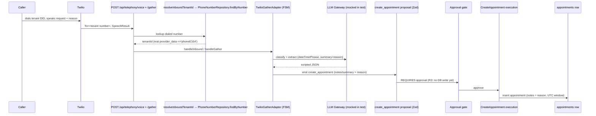

# feat: Prove inbound voice appointment-setting end-to-end + tradesperson phone-number picker

**Created:** 2026-06-14
**Depth:** Deep
**Status:** plan

## Summary
Two coupled deliverables. (1) **Prove** the inbound AI voice agent actually
books appointments end-to-end — a Docker-gated integration test that drives a
real inbound call from dialed-number routing through to a persisted
`appointments` row, plus a live-call runbook. (2) **Build** a tradesperson-facing
phone-number picker so a tenant can search available numbers by area code, pick
one, and claim/provision it during onboarding — replacing today's silent
auto-assign + retry. Along the way, close a real persistence gap so the caller's
spoken **reason for visit** reliably lands on the appointment.

## Problem Frame
The voice → appointment path is wired in code but has **no stitched end-to-end
proof**: the task handler, execution handler, and routing lookup are each
unit-tested in isolation, so we cannot currently demonstrate that "a caller dials
the tenant's number, says what they need, and an appointment with that reason
gets booked after approval." Separately, a tradesperson has **no control over
their phone number** — onboarding auto-provisions one number (retry-only, no
picker), which the user wants changed to an explicit search-and-pick flow.

Two findings from codebase research shape the work:
- **The VAPI inbound path does NOT create appointments today** — `handleVapiCallEvent`
  (`packages/api/src/integrations/vapi/webhook.ts`) only records `voice_sessions`
  and activation. The **Twilio Gather path** (`POST /api/telephony/voice` →
  `/api/telephony/gather` → `TwilioGatherAdapter` FSM) is the canonical
  appointment-setting path. The proof must certify the path real calls traverse.
- **The reason-for-visit can be silently dropped.** The LLM extracts `summary`
  ("the work requested"); the held-slot path maps `summary`→`notes`, but
  `CreateAppointmentExecutionHandler.execute` (`packages/api/src/proposals/execution/handlers.ts`)
  persists `payload.notes` only. A proposal carrying just `summary` loses the
  reason on the standard execution path.

## Requirements
- **R1.** Automated proof: an inbound call to a tenant's provisioned number routes
  to that tenant (dialed-number lookup) and, after human approval, yields a
  persisted `appointments` row with the correct UTC window. (request: "verify the
  agent takes inbound calls / sets appointments / prove it's working")
- **R2.** The caller's free-text **reason for visit** is captured from speech and
  persisted on the appointment (verified against the real DB column). (request:
  "dictating what those appointments would be made for")
- **R3.** The **human-approval gate** is provably enforced — no appointment is
  created until the proposal is approved (assert the negative). (invariant)
- **R4.** A tradesperson can **search available numbers by area code, pick one,
  and claim/provision it** (tenant-level) during onboarding; auto-assign becomes
  a fallback, not the default. (request: "ensure the tradesperson can select their
  phone number")
- **R5.** A **live sandbox runbook** lets a human place a real inbound call and
  observe the appointment + reason being created. (request: deliver "both")
- **R6.** Edge integrity: an ambiguous caller reference becomes a
  `voice_clarification` (never a silent guess); a picked number that is no longer
  purchasable surfaces a clean re-pick path, not a crash.

## Key Technical Decisions
- **Certify the Twilio Gather path, not VAPI.** It is the only inbound path that
  books appointments today. (Alternative: certify VAPI — rejected: it doesn't
  create appointments, so the proof would be vacuous. Certifying VAPI is filed as
  deferred follow-up.)
- **Picker searches on the master Twilio account; the worker still purchases under
  the tenant subaccount.** Available-number search is region/country-global and
  needs no subaccount, so the picker works before the subaccount exists; the
  existing worker keeps ownership of the actual (costly, hard-to-reverse) purchase.
  (Alternative: pre-create the subaccount just to search — rejected: adds latency
  and a partial-provision failure mode to a read-only search.)
- **Never let the client purchase.** The picker returns candidates and submits a
  chosen E.164; the server-side worker performs the purchase idempotently. Buying
  a DID costs money and is hard to reverse, so it stays behind the worker's
  crash-recovery (`listSubaccountPhoneNumbers`) guard.
- **Implement the dormant `searchAvailableNumbers()` interface** rather than adding
  a parallel function, and extract the inline search out of `purchasePhoneNumber()`
  so search and purchase share one code path. Per Code Hygiene, delete any stub/
  null stand-in once wired.
- **Persist reason at the execution seam as `notes ?? summary`** so the reason
  survives regardless of which field the proposal carries — single canonical
  column (`appointments.notes`), no schema change. (Alternative: add a dedicated
  `reason_for_visit` column — rejected for this scope: a migration is unnecessary
  when `notes` already holds it; filed as deferred if reporting needs a typed field.)
- **Tenant-level number (not per-technician).** Matches the chosen scope; inbound
  routing stays `dialed-number → tenant`.

## Scope Boundaries
**In scope:** Twilio available-number search endpoint; claim endpoint + worker
threading of a chosen number; PhoneStep picker UI; reason-for-visit persistence
fix; Docker-gated inbound→appointment integration test; routing-lookup integration
assertion; picker unit/route/e2e tests; live-call verification runbook.

**Non-goals:** per-technician number routing; post-onboarding number management in
settings; making the VAPI path create appointments; a first-class appointment-type
taxonomy; porting numbers / international numbers.

### Deferred to follow-up work
- Certify the VAPI inbound path once it actually books appointments.
- Intent-variant proof (reschedule / cancel / reassign over voice) — the keystone
  test centers on `create_appointment` + reason per the chosen scope.
- Settings-screen number management (change/release number after onboarding).
- Optional dedicated `reason_for_visit` column if typed reporting is needed later.

## Repository invariants touched
- **Human-approval gate / proposals never auto-executed** — R3 asserts the negative
  (no appointment before approval); the integration test approves through the real
  proposal flow.
- **Zod-validated proposals** — reuse `createAppointmentPayloadSchema`
  (`packages/api/src/proposals/contracts.ts`); new onboarding inputs get Zod schemas
  in `packages/api/src/onboarding/contracts.ts`.
- **Audit events on mutations** — the claim endpoint emits an audit event (mirror
  the existing retry audit in `packages/api/src/routes/onboarding.ts`).
- **tenant_id + RLS** — search/claim are owner-auth + tenant-scoped; inbound routing
  uses the documented `app.system_lookup` cross-tenant bypass (no tenant context on
  the webhook) — the integration test pins the real `tenant_integrations.provider_data->>'phoneE164'`
  column it depends on.
- **Times stored UTC, rendered in tenant tz** — the test asserts the persisted
  window is UTC and matches the tenant-timezone resolution.
- **LLM gateway** — voice extraction already routes through the gateway; tests mock
  the gateway (scripted JSON), adding no new LLM call sites.
- **Entity resolver / voice_clarification** — R6 asserts an ambiguous caller →
  `voice_clarification`, never a silent guess.
- **Integer cents / catalog resolver** — N/A (no money or line-item pricing in these
  paths; DID cost is not modeled here).

## High-Level Technical Design

Certified inbound proof path (the path real PSTN calls take):

Picker flow (onboarding): area-code input → `POST /api/onboarding/phone/available`
(master-account search) → render candidates → pick → `POST /api/onboarding/phone/claim`
(enqueue worker with chosen `phoneNumber`) → existing status polling → "Ready".

## Implementation Units

### U1. Twilio available-number search (extract + implement dormant interface)
- **Goal:** One reusable `searchAvailableNumbers({ accountSid, areaCode?, contains?, limit })`
  returning `Array<{ phoneNumber, locality?, region? }>`, replacing the inline search
  buried in `purchasePhoneNumber()`.
- **Requirements:** R4 (enabling).
- **Dependencies:** none.
- **Files:**
  - `packages/api/src/integrations/twilio/provisioning.ts` (implement the existing
    `searchAvailableNumbers` interface using the `twilioGet` helper; have
    `purchasePhoneNumber` call it instead of duplicating the fetch).
  - `packages/api/test/integrations/twilio/provisioning-search.test.ts` (create dir
    if missing).
- **Approach:** Reuse `AvailablePhoneNumbers/US/Local.json?VoiceEnabled=true&SmsEnabled=true&AreaCode=…`.
  Map Twilio fields → `{ phoneNumber, locality, region }`. Search uses **master**
  account creds (confirm exact env var names while implementing). Delete any stub/
  null implementation of the interface once wired (re-grep usage first).
- **Patterns to follow:** existing `twilioGet`/`twilioPost`/`basicAuth` helpers and the
  current inline search in `purchasePhoneNumber()` (`packages/api/src/integrations/twilio/provisioning.ts`).
- **Test scenarios:**
  - Happy path: areaCode `512` → mocked Twilio JSON → mapped candidate list (fetch stubbed).
  - Edge: empty `available_phone_numbers` → returns `[]` (no throw); `limit` respected.
  - Error: Twilio non-2xx → surfaced error (matches existing helper behavior).
- **Verification:** unit test green; `purchasePhoneNumber` still buys the first result
  when no specific number is requested (no behavior regression).

### U2. Search API endpoint — `POST /api/onboarding/phone/available`
- **Goal:** Tenant-scoped endpoint returning candidate numbers for an area code.
- **Requirements:** R4.
- **Dependencies:** U1.
- **Files:**
  - `packages/api/src/routes/onboarding.ts` (new route; owner-auth + `requireTenant`).
  - `packages/api/src/onboarding/contracts.ts` (Zod `phoneAvailableInputSchema = { areaCode: 3-digit string, limit?: 1..20 }`).
  - `packages/api/test/routes/onboarding-phone.route.test.ts` (create if missing;
    mirror `appointments.route.test.ts`).
- **Approach:** Validate area code (3 digits). Call `searchAvailableNumbers` with master
  creds. Return `{ numbers: [...] }`. Read-only — no audit event, no purchase.
- **Patterns to follow:** auth/tenant middleware and response shapes already used by the
  retry route in `packages/api/src/routes/onboarding.ts`.
- **Test scenarios:**
  - Happy path: valid areaCode → 200 with candidates (search mocked).
  - Validation: missing/!3-digit areaCode → 400.
  - Auth: no tenant / non-owner → 403.
- **Verification:** route test green.

### U3. Claim endpoint + worker threads a chosen number
- **Goal:** Let the UI submit a chosen E.164; the worker purchases that exact number.
- **Requirements:** R4, R6 (unavailable-number path).
- **Dependencies:** U1.
- **Files:**
  - `packages/api/src/routes/onboarding.ts` (`POST /api/onboarding/phone/claim`,
    Zod `{ phoneNumber: E.164 }`, enqueue `PROVISION_TWILIO_JOB_TYPE`, emit audit —
    mirror the retry audit).
  - `packages/api/src/workers/provision-twilio.ts` (add optional `phoneNumber` to
    `ProvisionTwilioPayload`; pass through to purchase).
  - `packages/api/src/integrations/twilio/provisioning.ts` (`purchasePhoneNumber`:
    when an explicit number is supplied, buy it directly and skip search; on
    "no longer available" Twilio error, throw a typed error the worker records as
    `failed` so the UI can re-pick).
  - `packages/api/src/onboarding/contracts.ts` (`phoneClaimInputSchema`).
  - `packages/api/test/workers/provision-twilio.test.ts` (create if missing).
  - `packages/api/test/routes/onboarding-phone.route.test.ts` (extend U2's file).
- **Approach:** Keep `retry` (region auto-pick) as the fallback; `claim` is the picker
  path. Preserve the worker's idempotent crash-recovery (`listSubaccountPhoneNumbers`)
  so a retry never double-buys. Purchase stays server-side only.
- **Patterns to follow:** the retry handler + worker provisioning sequence in
  `packages/api/src/workers/provision-twilio.ts`.
- **Test scenarios:**
  - Happy path: claim valid number → job enqueued with `phoneNumber` + audit emitted.
  - Worker: payload with `phoneNumber` → purchases that exact number (Twilio mocked),
    writes `provider_data.phoneE164`.
  - Error/R6: chosen number unavailable at purchase → worker sets `status='failed'` +
    `last_error`; does not crash; no partial double-buy on re-run.
  - Validation: non-E.164 `phoneNumber` → 400.
- **Verification:** route + worker tests green; `npx tsc --project tsconfig.build.json --noEmit` clean.

### U4. PhoneStep picker UI
- **Goal:** Add a "pick a number" state: area-code input → candidate list → pick → claim
  → existing in-progress/ready states.
- **Requirements:** R4.
- **Dependencies:** U2, U3.
- **Files:**
  - `packages/web/src/components/onboarding/v2/steps/PhoneStep.tsx` (new picker state
    before provisioning; keep "let the system choose" as a fallback button → existing
    retry path).
  - `packages/web/src/lib/apiClient.ts` (only if a typed helper is added; otherwise use
    `useApiClient()` directly).
  - `packages/web/src/components/onboarding/v2/steps/PhoneStep.test.tsx` (jsdom
    class-contract test).
  - `e2e/onboarding-phone-picker-mobile.spec.ts` (Playwright viewport spec).
- **Approach:** On `phone` step pending/`t0_requested`, render area-code input → call
  `/available` → list candidates → on pick call `/claim` → transition to the existing
  polling/ready UI. Reuse formatting/copy/forwarding UI already in PhoneStep.
- **Patterns to follow:** existing PhoneStep states + `useApiClient()`; mobile test
  pattern `e2e/estimate-approval-mobile.spec.ts`.
- **Test scenarios:**
  - jsdom: picker renders candidate rows; tap targets `min-h-11` (≥44px); no horizontal
    overflow at 320px; "Continue" disabled until a number is picked.
  - Playwright (mobile viewport): enter area code → candidates shown (network mocked) →
    pick → claim POST fired → in-progress state appears.
- **Verification:** jsdom + Playwright specs green; manual check that "let the system
  choose" fallback still works.

### U5. Persist reason-for-visit reliably
- **Goal:** Ensure the spoken reason lands on `appointments.notes` regardless of whether
  the proposal carries `notes` or `summary`.
- **Requirements:** R2.
- **Dependencies:** none (but pin the seam the Gather FSM actually uses — see Open Questions).
- **Files:**
  - `packages/api/src/proposals/execution/handlers.ts` (`CreateAppointmentExecutionHandler.execute`:
    persist `notes: payload.notes ?? payload.summary`).
  - `packages/api/src/ai/tasks/create-appointment-task.ts` (only if needed to set
    `notes` from the extracted summary on the proposal payload — confirm against the
    Gather FSM seam first).
  - `packages/api/test/proposals/execution/create-appointment-handler.test.ts` (extend).
- **Approach:** Minimal, single canonical column. Do not add a migration. Confirm which
  execution seam the inbound Gather FSM uses (`CreateAppointmentExecutionHandler` vs the
  adapter's own `executor.executeSideEffects`) and ensure the fix covers that seam.
- **Patterns to follow:** existing handler test fixtures + the held-slot mapping already
  present in `create-appointment-task.ts` (line ~493, `summary`→`notes`).
- **Test scenarios:**
  - Proposal with only `summary` → persisted appointment `notes` equals the summary.
  - Proposal with explicit `notes` → `notes` wins (no clobber by summary).
  - Neither present → `notes` is null/undefined (no error).
- **Verification:** unit test green; reason no longer dropped on the standard path.

### U6. Keystone integration test — inbound call → persisted appointment (Docker-gated)
- **Goal:** Prove R1–R3 against a real Postgres: dialed-number routing → reason captured
  → human approval gate → persisted appointment.
- **Requirements:** R1, R2, R3, R6.
- **Dependencies:** U5.
- **Files:**
  - `packages/api/test/integration/voice-inbound-appointment.test.ts` (new).
- **Approach:** Mirror `packages/api/test/integration/voice-create-customer.test.ts`'s
  harness (testcontainer + `createTestTenant` + in-memory/real repos + `ProposalExecutor`).
  Seed a tenant, a `tenant_integrations` row with a known `provider_data.phoneE164`, and a
  job. Drive the **real inbound Gather entrypoint** (`TwilioGatherAdapter` /
  `/api/telephony/gather`) with a **scripted/mocked LLM gateway** returning
  `{ dateTimePhrase, summary: "leaking water heater", confidence_score }`. Assert:
  (a) dialed-number lookup resolved the seeded tenant (pin the real `provider_data->>'phoneE164'`
  column); (b) a `create_appointment` proposal exists and **no** appointment row exists
  pre-approval; (c) after approval + execution, an `appointments` row exists with
  `notes` == the reason, UTC window matching tenant-tz resolution, `status='scheduled'`.
  Add a focused sub-test: ambiguous caller reference → `voice_clarification` (R6).
- **Patterns to follow:** `voice-create-customer.test.ts`, `onboarding-vapi.test.ts`,
  `global-setup.ts`/`shared.ts` (testcontainer + seeding); scripted-gateway pattern from
  `test/ai/agents/customer-calling/voice-cancel.test.ts`.
- **Test scenarios:** (this unit IS the proof)
  - Happy path: full inbound → approve → appointment with reason persisted (real DB).
  - Routing: `To=<seeded number>` resolves the seeded tenant; unknown number does not.
  - Negative (R3): before approval, zero appointment rows for the job.
  - Edge (R6): ambiguous caller → `voice_clarification`, no appointment.
  - DB-touching: runs against pgvector testcontainer; pins real columns (no mocked Pool).
- **Verification:** integration test green in PR CI (Docker-gated); demonstrably fails if
  routing, the approval gate, or reason persistence regress.

### U7. E2E picker spec + live-call verification runbook
- **Goal:** Deliver the "both" proof: an automated UI spec for the picker and a human
  runbook to verify a real inbound call books an appointment with its reason.
- **Requirements:** R4 (e2e), R5 (runbook).
- **Dependencies:** U4 (UI), U6 (the runbook references the certified path/assertions).
- **Files:**
  - `e2e/onboarding-phone-picker.spec.ts` (functional picker flow; may consolidate with
    U4's mobile spec).
  - `docs/runbooks/voice-inbound-appointment-verification.md` (create dir if missing).
- **Approach:** Runbook documents: prerequisites (test tenant, a number provisioned via the
  picker, required env/creds), the exact script to speak ("I need someone out Tuesday at
  2pm — my water heater is leaking"), where to watch the proposal appear, the approval
  step, and the DB/UI assertions (appointment exists, `notes` = reason, correct window).
  Note explicitly that Twilio **test credentials don't place real calls** — the live run
  needs real trial creds + a real DID, and that the certified path is **Twilio Gather**,
  not VAPI.
- **Patterns to follow:** `e2e/qa-matrix/*` harness + `e2e/qa-matrix/helpers/voice-flow.ts`;
  existing runbooks under `docs/superpowers/runbooks/`.
- **Test scenarios:**
  - e2e: picker flow drives `/available` + `/claim` (network mocked) and reaches the ready
    state.
  - Runbook: `Test expectation: none — human verification procedure`; correctness is proven
    by U6 in CI, the runbook covers the real-telephony leg CI can't.
- **Verification:** e2e spec green; runbook reviewed and followed once end-to-end against a
  sandbox number (evidence captured).

## Risks & Dependencies
- **VAPI vs Gather divergence.** The product appears to be migrating toward VAPI, but VAPI
  doesn't book appointments yet. This plan certifies the path that works (Gather); if the
  team expects VAPI to be "the" path, that's a separate build, not just a test.
- **Gather FSM execution seam.** The exact point where the FSM emits/executes the
  `create_appointment` proposal (its own `executor.executeSideEffects` vs the shared
  `CreateAppointmentExecutionHandler`) must be pinned before U5/U6 to ensure the reason fix
  and the assertions target the live code path.
- **Live telephony cannot run in CI.** R5 depends on real Twilio creds + a real number;
  treat the runbook as the proof for that leg and U6 as the proof for everything CI can run.
- **Purchasing real DIDs costs money / is hard to reverse.** Keep purchase server-side and
  idempotent; the picker only searches and submits a choice.

## Open Questions (deferred to implementation)
- Exact env var names for the **master** Twilio creds used by the search endpoint.
- The precise FSM seam that emits/executes `create_appointment` on the Gather path (decides
  where U5's fix lands and what U6 drives).
- Whether `voice-create-customer.test.ts` drives the Gather adapter or the in-app/router
  path — confirm and, if needed, drive the Gather entrypoint directly in U6 for fidelity.
- Final Twilio `AvailablePhoneNumbers` response fields to surface in the picker (locality vs
  region vs friendly name).

## Sources & Research
Codebase has solid in-repo patterns for Twilio provisioning, the proposal/approval flow, and
the Docker-gated integration harness — proceeding without external research. Load-bearing
files: `packages/api/src/integrations/twilio/provisioning.ts`,
`packages/api/src/workers/provision-twilio.ts`, `packages/api/src/routes/onboarding.ts`,
`packages/api/src/routes/telephony.ts`, `packages/api/src/telephony/twilio-adapter.ts`,
`packages/api/src/integrations/twilio/phone-number-repository.ts`,
`packages/api/src/proposals/execution/handlers.ts`,
`packages/api/src/ai/tasks/create-appointment-task.ts`,
`packages/api/test/integration/{global-setup.ts,shared.ts,voice-create-customer.test.ts,onboarding-vapi.test.ts}`,
`packages/web/src/components/onboarding/v2/steps/PhoneStep.tsx`,
`e2e/estimate-approval-mobile.spec.ts`.
