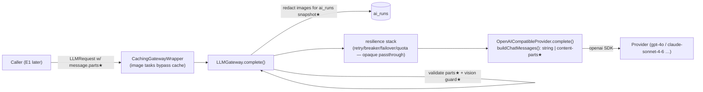

# feat: LLM Gateway Multimodal (Vision) Support — Foundation F-A

**Created:** 2026-06-14
**Depth:** Standard (bounded to `packages/api/src/ai/gateway` + the one provider adapter; ~4 units) — but on the **shared LLM critical path**, so backward-compat and the build gate are first-class.
**Status:** plan
**Parent:** `docs/plans/2026-06-14-001-feat-prd-gap-closure-roadmap-plan.md` → Foundation **F-A** (unblocks Epic **E1** MMS→estimate).

## Summary
Teach the LLM gateway to carry **images** in a request so a downstream task (E1) can send a customer/tech photo to a vision model and get back structured text. Today the gateway is text-only (`LLMMessage.content: string`). This plan adds an **additive, backward-compatible** image channel inside the gateway and its one sanctioned provider adapter, with three safety properties baked in: (1) image bytes are **redacted** before they hit the `ai_runs` audit snapshot, (2) a request carrying images **fails fast** if routed to a non-vision model, and (3) the existing text path is **byte-for-byte unchanged**. No estimate/vision *consumption* logic — that is E1.

## Problem Frame
E1 (the flagship MMS→estimate differentiator, PRD §6.4 Workflow B) cannot exist until the gateway can transport an image to the model. Per **D-005**, every LLM call routes through `packages/api/src/ai/gateway` and **no module outside the gateway may import a provider SDK** — so vision must be added *inside* the gateway, not bolted onto the estimate task. The gateway is also the shared path for ~20 task types (intent classification, proposals, onboarding extraction, supervisor annotation), so the change must not regress the text path or widen a pervasive type in a way that ripples across the codebase.

## Requirements
- **R1.** A caller can attach one or more images to a `user` message and have them delivered to the model through `LLMGateway.complete()` and the OpenAI-compatible adapter. *(Advances roadmap R1 / F-A.)*
- **R2.** The text-only path is unchanged — existing callers and the `content: string` contract keep compiling and behaving identically (verified by `tsc` + existing gateway tests staying green).
- **R3.** Image bytes never persist to the `ai_runs` `inputSnapshot` (PII + DB-bloat): they are redacted to a reference (mime + byte count + sha256). *(Honors the audit invariant without leaking customer property photos.)*
- **R4.** A request that carries images but resolves to a non-vision-capable model throws a clear `ValidationError` before dispatch (no silent text-model send, no opaque provider 400). The vision-capable model set is **configurable/env-driven**, never hardcoded to one model.
- **R5.** Only the existing single provider adapter (`ai/providers/openai-compatible.ts`) imports the provider SDK (D-005 preserved); image content is not cached as if deterministic.
- **R6.** New/changed pure logic ships with unit tests in the same commit (CLAUDE.md).

## Key Technical Decisions
- **Additive `parts?` field, NOT a widened `content` union (recommended).** Add `parts?: LLMContentPart[]` to `LLMMessage` and keep `content: string` as-is. The adapter assembles the final OpenAI `content` (string when no parts; `[{type:'text',text:content}, ...images]` when parts present) — the translation lives in the one adapter, exactly where D-005 puts it.
  - *Rationale:* `LLMMessage` is exported (`gateway/index.ts`) and read across ~20 task handlers. Widening `content` to `string | LLMContentPart[]` would force a codebase-wide audit of every `m.content` string-reader and risk compile breaks on a critical shared path, for no functional gain. The additive field is backward-compatible **by construction** and makes redaction (strip `parts`) and validation (well-typed optional array) trivial.
  - *Alternative considered — widen `content` to `string | LLMContentPart[]` (OpenAI-native shape):* rejected. More "native" and zero adapter translation (the SDK accepts the union directly), but the blast radius across existing `content` consumers and the shared-path risk outweigh the elegance. If a reviewer prefers it, it is a localized swap plus a `content`-reader audit unit — noted, not chosen.
- **Image transport format = OpenAI content-part (`{type:'image_url', image_url:{url, detail?}}`).** The adapter passes these to the `openai` SDK, which serializes them; OpenAI-compatible endpoints (incl. OpenRouter → Claude/gpt-4o) accept and translate them. `url` accepts both `https://…` and `data:image/…;base64,…`, so the gateway is agnostic to how E1 sources the image.
- **Image sourcing (URL vs base64 data-URL) is deferred to E1.** F-A accepts either in `image_url.url`. *(Rationale: private customer photos live in tenant-scoped storage; whether to pass a signed URL or a base64 data-URL is an E1 privacy/perf decision, not a gateway concern.)*
- **Vision-capability guard via a configurable model set.** Add `AI_VISION_CAPABLE_MODELS` (comma-separated, env) merged with sensible built-in defaults (current default vision models: `claude-sonnet-4-6`, `claude-haiku-4-5-20251001`, `gpt-4o`, `gpt-4o-mini`, plus their `*/`-namespaced OpenRouter forms). `complete()` checks the **resolved** model. *(Rationale: model ids are already env-driven via `config/ai-routing.ts`; capability must be too. Alternative — a per-tier `supportsVision` flag — rejected: the model, not the tier, determines capability and the tier→model map is env-overridable.)*
- **No automatic model upgrade for image requests in F-A.** E1's task (`draft_estimate`) already maps to the `complex` tier (`claude-sonnet-4-6`, vision-capable) in `config/ai-routing.ts:43`. The guard fails fast if a caller routes images to a text tier; auto-upgrading routing on image presence is **deferred** (could later extend `complexity-classifier.ts`). *(Keeps F-A minimal; avoids surprising model selection.)*

## Scope Boundaries
**In scope:** Multimodal request types + validation; the adapter translation; `ai_runs` snapshot redaction; the vision-capability guard + config; tests; an end-to-end gateway test (via `MockLLMProvider`) proving an image request flows through `complete()` untouched and redacted. Independently shippable with **no** E1 dependency.

**Non-goals:**
- Any estimate/photo-analysis logic, prompts, attachment retrieval, confidence/severity markers (all **E1**).
- Image sourcing/signing/storage decisions (E1).
- Multimodal *output* (image generation), audio/video parts.
- Auto-routing images to a vision model (deferred — see decisions).
- Embeddings (`createEmbedding` in the adapter is unrelated and untouched).

### Deferred to follow-up work
- **Dead-code check:** `packages/api/src/ai/gateway/providers.ts` (`StubProvider`, a *second* `OpenAICompatibleProvider`) + `registry.ts` (`createDefaultRegistry`) appear unused by `factory.ts` (which wires `ai/providers/openai-compatible.ts`). Re-grep usage; if dead, remove per CLAUDE.md hygiene — but **out of scope here** to keep F-A focused (and they don't affect the live path).
- Image-presence → `complexity-classifier.ts` 'complex' escalation (only if auto-upgrade is later wanted).

## Repository invariants touched
- **LLM gateway (D-005)** — all changes live inside `packages/api/src/ai/gateway` + the single adapter `ai/providers/openai-compatible.ts`; no new provider-SDK import anywhere else. ✔
- **Audit / `ai_runs`** — snapshot integrity preserved while **redacting** image bytes (R3); the best-effort, non-blocking ai_run write semantics are unchanged.
- **Human-approval / proposals / cents / RLS** — not touched (F-A is pre-proposal infrastructure; no DB schema, no money, no entities).

## High-Level Technical Design

Request flow (unchanged wrappers; new bits marked ★):

## Implementation Units

> Tests live under `packages/api/test/ai/...` (mirroring the existing `packages/api/test/ai/gateway/*.test.ts` layout — tests are **not** co-located with src). Test seam: `createMockLLMGateway()` / `MockLLMProvider` (`ai/providers/mock.ts`), whose `getCalls()` records the exact `LLMRequest` the provider received. Build gate for every unit: `cd packages/api && npx tsc --project tsconfig.build.json --noEmit`.

### U1. Multimodal message types + validation
- **Goal:** Define the image channel and validate it, without disturbing `content: string`.
- **Requirements:** R1, R2, R6.
- **Dependencies:** none.
- **Files:**
  - `packages/api/src/ai/gateway/gateway.ts` — add `LLMImageDetail = 'low'|'high'|'auto'`; `LLMContentPart` = `{ type:'text'; text:string } | { type:'image'; url:string; detail?:LLMImageDetail; mimeType?:string }`; add optional `parts?: LLMContentPart[]` to `LLMMessage`; extend `validateLLMRequest`.
  - `packages/api/src/ai/gateway/index.ts` — export `LLMContentPart`, `LLMImageDetail`.
  - `packages/api/test/ai/gateway/multimodal-validation.test.ts` (new).
- **Approach:** Keep `LLMMessage.content` required string (text or "" when only images). Validation rules: image parts allowed **only** on `role:'user'`; each image `url` non-empty and either `http(s)://…` or `data:<mime>;base64,…`; reject empty `parts` arrays and unknown part `type`. Internal `type:'image'` (not `'image_url'`) keeps our contract provider-neutral; the adapter maps to OpenAI's `image_url` (U2).
- **Patterns to follow:** existing `validateLLMRequest` accumulate-errors style (`gateway.ts:88`); export style in `gateway/index.ts`.
- **Test scenarios:**
  - Happy: user message with `content:'what work is needed?'` + one `https` image part → no errors. Text-only request (no `parts`) → unchanged, no errors.
  - Edge: `data:` URL accepted; `detail` optional; multiple image parts on one user message.
  - Error: image part on `system`/`assistant` role → error; empty `url` → error; empty `parts:[]` → error; unknown `type` → error.
  - `Test expectation:` pure validation unit tests; assert existing text-only requests still validate (R2).
- **Verification:** `tsc` build green (proves the additive field didn't ripple); new tests pass; existing `packages/api/test/ai/gateway/*` still green.

### U2. Adapter translation to OpenAI content parts
- **Goal:** The one sanctioned adapter emits string content when there are no parts, and an OpenAI `content`-part array when there are — via a **pure, testable** helper.
- **Requirements:** R1, R5.
- **Dependencies:** U1.
- **Files:**
  - `packages/api/src/ai/providers/openai-compatible.ts` — extract `buildChatMessages(messages: LLMMessage[]): ChatCompletionMessageParam[]` and use it in `complete()` (replacing the direct `messages: request.messages` pass at line 101).
  - `packages/api/test/ai/providers/openai-compatible-multimodal.test.ts` (new).
- **Approach:** For a message with no `parts` → `{ role, content }` (today's behavior, exact). With `parts` → `{ role, content: [ ...(content ? [{type:'text', text:content}] : []), ...parts.map(p => p.type==='image' ? { type:'image_url', image_url: { url: p.url, ...(p.detail?{detail:p.detail}:{}) } } : { type:'text', text:p.text }) ] }`. Confirm `openai` stays the **only** provider-SDK import in the repo outside this file (re-grep `from 'openai'`).
- **Patterns to follow:** the existing `complete()` shape (`ai/providers/openai-compatible.ts:92`); keep `response_format`, `temperature`, `max_tokens`, `signal` handling identical.
- **Test scenarios:**
  - Happy: no-parts message → helper returns `{role,content:string}` byte-identical to today (R2). Parts message → returns text part first, then `image_url` parts in order, `detail` passed through when set.
  - Edge: empty `content` + one image → array with only the image part (no empty text part). `data:` URL preserved verbatim.
  - `Test expectation:` pure-helper unit tests, **no network** (the SDK call itself is not exercised). DB: none — pure logic.
- **Verification:** helper tests pass; `tsc` green; grep confirms no new `openai`/provider-SDK import outside the adapter (D-005).

### U3. Redact image bytes from the `ai_runs` snapshot
- **Goal:** Image data never lands in `ai_runs.inputSnapshot` (PII + bloat); text + structure stay auditable.
- **Requirements:** R3.
- **Dependencies:** U1.
- **Files:**
  - `packages/api/src/ai/gateway/gateway.ts` — add pure `redactMessagesForSnapshot(messages)`; apply to the `inputSnapshot.messages` write in `complete()` (currently `gateway.ts:188`).
  - `packages/api/src/ai/gateway/cache.ts` — apply the same redaction in `writeAiRunForCacheHit` (`cache.ts:162`) for defense-in-depth (image tasks won't normally cache, but the snapshot write must never leak).
  - `packages/api/test/ai/gateway/snapshot-redaction.test.ts` (new).
- **Approach:** Replace each image part with `{ type:'image', redacted:true, mimeType, bytes:<len>, sha256:<hash-of-url-or-decoded-bytes> }`; leave text parts and `content` intact. Pure function over the messages array; no behavior change to the actual provider request (redaction is snapshot-only).
- **Patterns to follow:** best-effort ai_run write semantics already in `complete()` (must remain non-blocking).
- **Test scenarios:**
  - Happy: messages with a base64 `data:` image → snapshot contains no base64 substring; contains `redacted:true`, byte count, sha256; text content preserved.
  - Edge: `https` image url → url not stored raw (replaced by reference/hash); text-only messages → snapshot identical to today (R2).
  - `Test expectation:` pure unit tests asserting no image payload leaks into the snapshot object.
- **Verification:** tests prove no base64/image-url leakage; existing ai_run logging tests unaffected.

### U4. Vision-capability guard + config (+ cache safety + end-to-end mock test)
- **Goal:** Fail fast when images are routed to a non-vision model; keep image requests out of the deterministic cache; prove the whole path with a mock.
- **Requirements:** R4, R5.
- **Dependencies:** U1 (and benefits from U2/U3 landing first).
- **Files:**
  - `packages/api/src/config/ai-routing.ts` — add a `visionCapableModels` default set + read `AI_VISION_CAPABLE_MODELS` env (comma-split, merged); export an `isVisionCapableModel(model: string)` helper.
  - `packages/api/src/ai/gateway/gateway.ts` — in `complete()`, after `resolveRouting`, if any message has an image part and `!isVisionCapableModel(resolvedModel)` → throw `ValidationError('LLM request includes images but resolved model is not vision-capable', {...})`.
  - `packages/api/src/ai/gateway/cache.ts` — guard: if a request has image parts, bypass cache regardless of task type (defensive; image tasks aren't in `deterministicTaskTypes` today).
  - `packages/api/test/ai/gateway/vision-capability-guard.test.ts` (new).
- **Approach:** Guard reads the **resolved** model (post-routing/tenant-override), so it reflects what will actually be sent. End-to-end test: build a gateway via `createMockLLMGateway()`, set the resolved model to a vision-capable id, send an image request, assert `MockLLMProvider.getCalls()[0].messages[0].parts` arrived intact and the response returned; then assert a non-vision model id throws; then assert an image request is not served from cache.
- **Patterns to follow:** `ValidationError` usage in `complete()` (`gateway.ts:127`); `createMockLLMGateway` seam (`factory.ts:329`); cache bypass logic (`cache.ts:92`).
- **Test scenarios:**
  - Happy: image request + vision model → provider receives `parts`; response returned. Text request + any model → unchanged (R2).
  - Error: image request + non-vision model → `ValidationError` thrown **before** provider dispatch (assert provider `getCalls()` empty).
  - Edge: `AI_VISION_CAPABLE_MODELS` env adds a custom model id → guard passes for it; image request never cached (cache `getStats()` shows no hit/store for it).
  - `Test expectation:` unit + mock-gateway integration-style tests; **no real network**, **no DB**.
- **Verification:** guard tests pass; cache bypass proven; full `tsc` build green; the complete F-A suite (`packages/api/test/ai/**`) green.

## Risks & Dependencies
- **Shared-path regression (highest):** any change to `LLMMessage`/`complete()` touches every task type. Mitigated by the additive `parts?` decision (no `content` widening), keeping the no-parts adapter branch byte-identical, and gating every unit on `tsc --project tsconfig.build.json` + the existing gateway test suite staying green.
- **PII in audit:** customer property photos must not persist to `ai_runs` — U3 is a hard requirement, tested for zero leakage.
- **Provider/model drift:** the default vision-model list will age; it is env-overridable (`AI_VISION_CAPABLE_MODELS`) so ops can update without a deploy. The guard fails *closed* (throws) rather than sending blind.
- **Cost/latency (informational for E1):** vision calls are larger/slower; `maxTokens`/`deadlineMs`/breakers already apply unchanged. Not an F-A blocker.
- **Downstream:** E1 depends on this; F-A ships and tests standalone via the mock.

## Open Questions (resolve in implementation / with reviewer)
- Exact default membership of `visionCapableModels` (and whether to match by exact id vs family prefix). Lean: exact-id set of the current configured defaults + env override; revisit if model ids churn.
- Redaction reference shape — is `sha256` of the (decoded) bytes worth computing for `data:` URLs, or is `{mime, bytes}` enough for audit correlation? (Cheap; default to including sha256.)
- Confirm `ChatCompletionMessageParam` from the installed `openai` SDK version accepts the `image_url` content-part shape as typed (version check during U2; cast narrowly if the SDK's union needs it).

## Sources & Research
- Code (verified 2026-06-14): `packages/api/src/ai/gateway/{gateway.ts,factory.ts,cache.ts,router.ts,complexity-classifier.ts,routing-config.ts,index.ts}`; `packages/api/src/ai/providers/{openai-compatible.ts,mock.ts}`; `packages/api/src/config/ai-routing.ts`; `packages/api/src/ai/ai-run.ts`; test layout `packages/api/test/ai/gateway/*.test.ts`.
- Key facts: production adapter passes `request.messages` to the `openai` SDK (`ai/providers/openai-compatible.ts:101`), whose content type already supports parts; `complete()` writes `messages` verbatim to `ai_runs` (`gateway.ts:188`); `draft_estimate`→`complex`→`claude-sonnet-4-6` (`config/ai-routing.ts:43`); image task types are not in `DEFAULT_DETERMINISTIC_TASK_TYPES` (`factory.ts:164`).
- Constraints: **D-005** (gateway-only provider SDKs, OpenAI-compatible internal API) — `docs/decisions.md`; parent roadmap F-A — `docs/plans/2026-06-14-001-feat-prd-gap-closure-roadmap-plan.md`.
