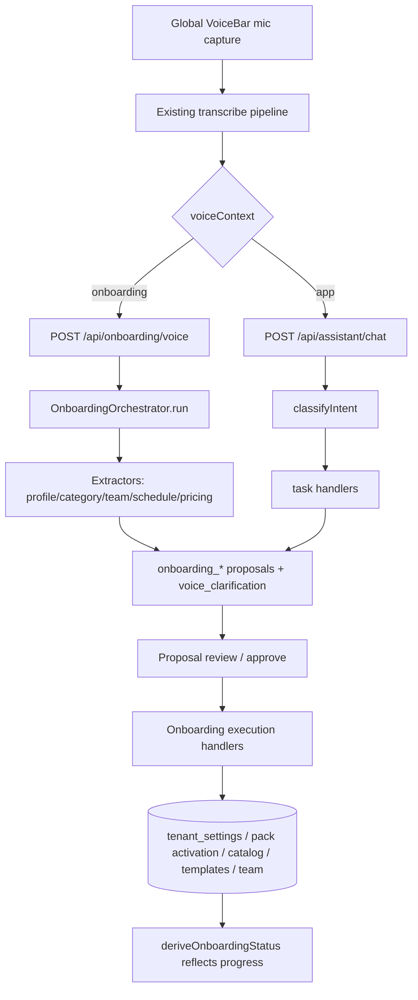

# feat: Voice-first onboarding + app-wide voice scaffold

**Created:** 2026-06-14
**Depth:** Deep
**Status:** plan

## Summary
Make onboarding completable end-to-end by voice — a new operator speaks
their business into existence ("I run Bob's HVAC, open 8 to 5 weekdays,
charge $120 an hour…") and the system extracts a business profile, hours,
vertical pack, pricing, and team into human-approved proposals that write
real tenant config. Then make voice the **primary** input affordance for
the rest of the app, with the existing forms/UI as fallback, by promoting
the voice surface to a global, route-aware scaffold and closing the
highest-value intent gaps. Architecture: wire the already-built (but
dormant) `OnboardingOrchestrator` behind a transcript endpoint and build
the missing execution handlers for the `onboarding_*` proposal types.

## Problem Frame
Today onboarding is **100% form-driven**: `OnboardingShell` →
`IdentityStep`/`PackStep`/… collect everything via typed inputs, and the
global `VoiceBar` is rendered only inside the main app `Shell` — it is
**absent from `/onboarding`**. So a new user has zero voice capability
until they finish onboarding, which directly contradicts the "voice-first
from onboarding onward" product intent.

Meanwhile a complete voice-driven onboarding engine already exists and is
**100% dormant**: `packages/api/src/ai/orchestration/onboarding.ts`
(`OnboardingOrchestrator`) plus 8 extractors under
`packages/api/src/ai/tasks/onboarding/` parse a transcript into
`onboarding_*` proposals — but nothing calls the orchestrator, no route
accepts a transcript, and **no execution handlers exist** for those
proposal types (verified against the registry in
`packages/api/src/proposals/execution/handlers.ts`). The Zod payload
contracts (`packages/api/src/proposals/contracts/onboarding.ts`) and
proposal types are real; the approve→execute path is the missing seam.

Post-onboarding voice DOES work, via a different path: `VoiceBar` →
`/assistant?q=` → `POST /api/assistant/chat` → `classifyIntent` → task
handlers → proposals. The intent classifier has **no** onboarding/settings
intents, and voice is presented as a secondary affordance, not the primary.

## Requirements
- R1. A new operator can complete the substantive onboarding data steps
  (business identity, hours, vertical pack, pricing seed, team) by
  speaking, without typing into forms.
- R2. Every voice-extracted change is a typed, Zod-validated,
  human-approved proposal — nothing auto-writes tenant config.
- R3. The onboarding wizard's derived status reflects voice-approved data
  exactly as if it were entered via the form (no parallel state).
- R4. Forms remain fully functional as fallback and as the edit surface
  for any field voice got wrong or didn't capture.
- R5. AI-drafted prices on the onboarding path are grounded in the catalog
  resolver; uncatalogued/low-confidence lines cap below auto-approve and
  ambiguity becomes a one-tap `voice_clarification` (never a silent guess).
- R6. The voice surface is present on **every** authenticated route,
  including `/onboarding`, and is the primary CTA with UI as fallback.
- R7. The voice surface is route-aware: it tells the operator what they can
  say on the current screen and routes the utterance to the right path
  (onboarding intake vs. assistant/action intents).
- R8. The highest-value post-onboarding actions each have working voice
  intent coverage; remaining gaps are enumerated as backlog, not silently
  dropped.
- R9. The dormant orchestrator/extractor code is either wired (preferred)
  or deleted — no new dead code, and existing dead code in this area is
  resolved as part of the work (CLAUDE.md hygiene).

## Key Technical Decisions
- **Wire the conversational `OnboardingOrchestrator` behind a new
  `POST /api/onboarding/voice` transcript endpoint** (user-selected) rather
  than adding discrete per-step settings intents to the classifier. Rationale:
  the orchestrator + 8 extractors + Zod payload contracts already exist and
  encode the multi-phase dependency order (profile → categories/team/schedule
  → pricing → templates); a per-step-intent approach would discard all of it
  and re-derive the same extraction logic inside the classifier. Alternative
  (per-step intents via the live assistant pipeline) rejected because it
  duplicates dormant assets and gives a worse "speak it all at once" UX.
- **The transcript is produced by the existing capture/transcribe pipeline**
  (`VoiceBar` mic → `/api/files/upload` → `POST /api/voice/recordings` →
  poll until transcribed), then POSTed to `/api/onboarding/voice`. Rationale:
  reuse the proven STT path; do not build a second audio pipeline.
- **Build the 5 missing execution handlers** (`onboarding_tenant_settings`,
  `onboarding_service_category`, `onboarding_estimate_template`,
  `onboarding_team_member`, `onboarding_schedule`) and register them in
  `createExecutionHandlerRegistry`. Rationale: approving an onboarding
  proposal must write real config; without executors the proposals are inert.
  These handlers map onto the SAME writes the form endpoints already use
  (tenant_settings upsert, `PackActivationRepository`/`seedPackDefaults`,
  catalog/template/team seeding) so derived status flips identically (R3).
- **Voice surface becomes a shared, route-aware component** lifted out of
  `Shell` into a layout wrapper that also wraps `OnboardingShell`. Rationale:
  R6 requires it on `/onboarding`; duplicating `VoiceBar` markup in two
  shells would drift. A `voiceContext` prop ("onboarding" vs "app") selects
  the dispatch target and the "you can say…" suggestions.
- **Onboarding voice routes to the orchestrator; app voice routes to the
  assistant/voice-action-router** — one surface, two destinations chosen by
  route context. Rationale: keeps a single mic UX while respecting that
  onboarding extraction and in-app action classification are different brains.
- **App-wide per-screen voice prompts ship as a reusable pattern + a bounded
  first rollout**, not a big-bang rewrite of every screen. Rationale: "voice
  everywhere" is real but unbounded; a reusable affordance + the top surfaces
  delivers the experience while the long tail follows the documented pattern.

## Scope Boundaries
**In scope:**
- Voice intake endpoint + orchestrator wiring + clarification handling.
- Execution handlers for all 5 `onboarding_*` proposal types + registry +
  app.ts dep wiring.
- Catalog grounding + ambiguity→clarification on the onboarding voice path.
- Onboarding voice-first UI (intake + proposal review, forms as fallback).
- Global route-aware voice surface across all authenticated routes.
- A reusable per-screen voice-prompt affordance + first rollout to the top
  post-onboarding surfaces (inbox/proposals, schedule, money).
- Intent-coverage audit + filling the top gaps; backlog for the rest.
- Verifying the existing form onboarding flow still works end-to-end.

**Non-goals:**
- Real-time streaming/duplex telephony onboarding (the inbound-call agent is
  a separate, already-shipped path; this is the in-app operator experience).
- Replacing or restyling the existing onboarding steps' visual design.
- New STT/TTS providers — reuse the existing transcription + `useTTS`/
  ElevenLabs stack.
- Per-screen voice prompts on every minor/admin screen (long tail deferred).

### Deferred to follow-up work
- Voice prompts on secondary screens (settings sub-pages, reports detail,
  admin) — apply the U7 pattern incrementally.
- Voice intents for the long tail of settings mutations beyond the top gaps
  identified in U6's audit.
- Wake-word / always-listening and barge-in — explicit opt-in feature later.

## Repository invariants touched
- **Integer cents:** pricing extraction + `onboarding_estimate_template`
  `defaultUnitPriceCents` and the catalog resolver all stay in integer cents.
- **UTC / tenant timezone:** `onboarding_schedule` writes `business_hours`
  as wall-clock `HH:MM` per the existing JSONB shape; any timestamps stored
  UTC. Hours render in the tenant timezone already collected in identity.
- **tenant_id + RLS:** every new endpoint is `requireAuth`+`requireTenant`;
  onboarding writes are owner-gated like the existing `/identity`,`/pack`.
- **Audit events:** each onboarding execution handler emits an audit event
  (mirroring the form endpoints) on the config write.
- **LLM gateway:** the orchestrator already takes `LLMGateway`; the endpoint
  passes the app's gateway — no direct provider calls.
- **Zod proposals + human approval:** reuses the existing `onboarding_*`
  Zod contracts; proposals land for approval, never auto-execute. Onboarding
  config changes are capture-class but still routed through approval.
- **Catalog resolver:** onboarding pricing/template line items resolve via
  `packages/api/src/ai/resolution/catalog-resolver.ts`; uncatalogued lines
  cap confidence below auto-approve (R5).
- **Entity resolver / one-tap clarification:** ambiguous extractions emit a
  `voice_clarification` proposal rather than guessing (R5).

## High-Level Technical Design

Two destinations behind one mic surface:

Key: onboarding-approved proposals write the **same** config the form
endpoints write, so `deriveOnboardingStatus` (`load-facts.ts` →
`derive-status.ts`) advances the wizard with no parallel progress state.

## Implementation Units

### U1. Onboarding voice intake endpoint (wire the orchestrator)
- **Goal:** Accept a transcript and run the dormant `OnboardingOrchestrator`,
  returning created `onboarding_*` proposal ids + any clarification needs.
- **Requirements:** R1, R2, R9 (partial).
- **Dependencies:** none.
- **Files:**
  - `packages/api/src/routes/onboarding.ts` (add `POST /api/onboarding/voice`)
  - `packages/api/src/ai/orchestration/onboarding.ts` (persist proposals: the
    orchestrator currently builds `Proposal` objects but the route must save
    them via `ProposalRepository` — add a repo param or persist in the route)
  - `packages/api/test/integration/onboarding-voice.test.ts` (new)
- **Approach:** New owner-gated route (`requireAuth`/`requireTenant`/owner
  check, mirroring `PUT /identity`). Body `{ transcript, conversationId? }`
  validated by a new Zod schema in `packages/api/src/onboarding/contracts.ts`.
  Instantiate `OnboardingOrchestrator(gateway)`; call `.run(tenantId, userId,
  transcript, conversationId)`; persist each returned proposal via the
  `proposalRepo` (the route already has access in `app.ts` wiring); return
  `{ proposalIds, needsClarification, clarificationQuestions }`. The transcript
  itself is produced client-side by the existing capture/transcribe flow (U4).
- **Patterns to follow:** owner-gating + audit + error handling in the
  existing `/identity` and `/pack` handlers; gateway access pattern in
  `createAssistantRouter`.
- **Test scenarios:**
  - Happy path: a rich transcript yields ≥1 persisted `onboarding_tenant_settings`
    proposal and category/schedule proposals as applicable.
  - Edge: empty/garbage transcript → no proposals, `needsClarification: true`.
  - Error: non-owner caller → 403; gateway failure → 5xx with error envelope,
    no partial proposal writes.
  - Integration (Docker-gated): proposals are actually persisted and readable
    by tenant; cross-tenant isolation holds.
- **Verification:** Speaking a business description via the endpoint creates
  approvable proposals visible to the owning tenant only.

### U2. Onboarding proposal execution handlers
- **Goal:** Approving an `onboarding_*` proposal writes real tenant config so
  the wizard advances (R3).
- **Requirements:** R2, R3, R9.
- **Dependencies:** U1 (produces the proposals to execute).
- **Files:**
  - `packages/api/src/proposals/execution/onboarding-handlers.ts` (new — 5
    handlers)
  - `packages/api/src/proposals/execution/handlers.ts` (register all 5 in
    `createExecutionHandlerRegistry`)
  - `packages/api/src/app.ts` (thread the needed repos/services into the
    registry deps)
  - `packages/api/test/integration/onboarding-proposal-execution.test.ts` (new)
- **Approach:** Map each payload onto the SAME writes the form endpoints use:
  - `onboarding_tenant_settings` → upsert `tenant_settings.business_name` and
    activate the `verticalPacks` via the existing `PackActivationRepository` +
    `seedPackDefaults` (same code `POST /pack` calls), so `packActivated`
    flips. Reuse the advisory-lock idempotency the pack route uses.
  - `onboarding_schedule` → translate `workingHours` (days[] + `startTime`/
    `endTime`) into the existing `business_hours` JSONB shape
    (`{day: {open, close}}`) and upsert. This is what `isIdentityDone` reads.
  - `onboarding_service_category` → seed/activate the category (mirror
    `seedPackDefaults` category seeding).
  - `onboarding_estimate_template` → persist the estimate template; line-item
    prices grounded via catalog resolver (see U3).
  - `onboarding_team_member` → create the team member record.
  Each handler emits an audit event and is idempotent (re-approve is a no-op).
  Note the **identity gap**: `isIdentityDone` also needs `jobBufferMinutes`
  and `hourlyRateCents`, which the settings payload doesn't carry — document
  that these come from pricing extraction (pricing → hourly rate) and a
  sensible buffer default, or remain a form-fallback field (R4). Pin the exact
  column writes with the integration test.
- **Patterns to follow:** existing handlers in `handlers.ts` (per-dep
  degraded passthrough when a repo is absent; `ExecutionResult` shape; audit
  emission); `seedPackDefaults` + `PackActivationRepository` usage in
  `routes/onboarding.ts` `POST /pack`.
- **Test scenarios:**
  - Happy path (integration, Docker-gated): approving each proposal type
    writes the expected columns/rows; `deriveOnboardingStatus` then reports
    the corresponding step `done`. **Pin real column names** (CLAUDE.md: the
    entity resolver shipped nonexistent columns under a mocked Pool).
  - Edge: re-approving the same proposal is idempotent (no duplicate pack
    activation, no duplicate team member).
  - Error: malformed payload that bypassed contract → handler returns
    `success:false` with a clear reason, no partial write.
  - Integration: settings + schedule approval together flips the `identity`
    step exactly as the form path does.
- **Verification:** Approve the voice-generated proposals end-to-end and watch
  `/api/onboarding/status` advance identically to the form path.

### U3. Catalog grounding + clarification on the onboarding voice path
- **Goal:** Onboarding pricing/templates obey the catalog-grounding and
  one-tap-clarification invariants (R5).
- **Requirements:** R5.
- **Dependencies:** U1 (path exists), U2 (template handler consumes results).
- **Files:**
  - `packages/api/src/ai/tasks/onboarding/template-assembler.ts` (route line
    items through `catalog-resolver.ts`; cap confidence on uncatalogued lines)
  - `packages/api/src/ai/tasks/onboarding/pricing-extractor.ts` (ensure
    integer-cents output; flag ambiguity)
  - `packages/api/src/ai/orchestration/onboarding.ts` (emit a
    `voice_clarification` proposal when an extractor reports
    `needsClarification` / ambiguity, instead of dropping it)
  - `packages/api/test/ai/tasks/onboarding/template-assembler.test.ts` (extend)
  - `packages/api/test/ai/orchestration/onboarding.test.ts` (extend)
- **Approach:** Before a template/pricing proposal is built, resolve each line
  description against the tenant catalog; exact/high match adopts the catalog
  price, ambiguous/none caps `confidenceScore` below the auto-approve
  threshold so it can never auto-execute, and genuinely ambiguous entity/price
  references produce a `voice_clarification` proposal (one-tap) rather than a
  silent guess.
- **Patterns to follow:** how the invoice/estimate task handlers call
  `catalog-resolver.ts`; how `voice-action-router` emits `voice_clarification`
  on ambiguity.
- **Test scenarios:**
  - Happy path: a line that matches the catalog adopts the catalog cents and
    keeps high confidence.
  - Edge: uncatalogued line → confidence capped below auto-approve threshold.
  - Error/ambiguity: two plausible catalog matches → `voice_clarification`
    proposal emitted; no priced proposal silently created.
- **Verification:** No onboarding pricing proposal auto-approves on an
  uncatalogued line; ambiguous references surface a one-tap clarification.

### U4. Onboarding voice-first UI (intake + review; forms as fallback)
- **Goal:** A new operator drives onboarding by speaking; forms remain the
  fallback/edit surface (R1, R4).
- **Requirements:** R1, R4, R6 (onboarding portion).
- **Dependencies:** U1 (endpoint), U2 (so approvals visibly advance steps).
- **Files:**
  - `packages/web/src/components/onboarding/v2/OnboardingShell.tsx` (render the
    voice surface; add a voice-first intake affordance)
  - `packages/web/src/components/onboarding/v2/steps/VoiceIntakeStep.tsx` (new
    — "Tell me about your business", mic capture, shows extracted proposals to
    review/approve, then routes the user into any still-incomplete form steps)
  - `packages/web/src/components/shared/VoiceBar.tsx` (accept a `voiceContext`
    + dispatch target so onboarding utterances POST to `/api/onboarding/voice`
    via the existing transcribe pipeline instead of navigating to `/assistant`)
  - `packages/web/src/components/onboarding/v2/VoiceIntakeStep.test.tsx` (new,
    jsdom)
  - `packages/web/e2e/onboarding-voice-mobile.spec.ts` (new, Playwright
    viewport — pattern: `e2e/estimate-approval-mobile.spec.ts`)
- **Approach:** Reuse `VoiceBar`'s capture→upload→transcribe states; on
  transcript, POST to `/api/onboarding/voice`, poll status, render the created
  proposals inline for one-tap approval (reuse the proposal card pattern). The
  existing step forms stay mounted and pre-filled from approved data so the
  operator can correct anything voice missed. Voice is the primary CTA; the
  forms are visibly available as "or fill it in".
- **Patterns to follow:** `VoiceBar` state machine; existing step components;
  the mobile tap-target + 320px contract tests required by CLAUDE.md.
- **Test scenarios:**
  - Happy path (jsdom): transcript → proposals listed → approve advances the
    step; class-contract test asserts ≥44px tap targets, no 320px overflow.
  - Edge: clarification-needed response renders the one-tap clarification.
  - Fallback: with voice unused, the form path still completes the step.
  - Integration (Playwright): mobile viewport, mic affordance reachable and
    forms usable as fallback.
- **Verification:** On `/onboarding`, speaking a business description visibly
  advances the wizard; typing still works.

### U5. Global route-aware voice surface
- **Goal:** The voice surface is present on every authenticated route incl.
  `/onboarding`, and knows which route it's on (R6, R7).
- **Requirements:** R6, R7.
- **Dependencies:** U4 (defines the onboarding `voiceContext` consumer).
- **Files:**
  - `packages/web/src/components/layout/Shell.tsx` (extract the `VoiceBar`
    mounting into a shared wrapper or hoist it so it's not Shell-exclusive)
  - `packages/web/src/routes.ts` (ensure the wrapper wraps both the app routes
    and `/onboarding`)
  - `packages/web/src/components/shared/VoiceBar.tsx` (derive `voiceContext`
    from the current route; default app context → assistant, onboarding route
    → onboarding endpoint)
  - `packages/web/src/components/shared/VoiceBar.test.tsx` (new/extend —
    asserts route→context→dispatch-target mapping)
- **Approach:** Introduce a thin layout component (or hoist `VoiceBar` to a
  route-layout element) so a single instance renders across the app and
  onboarding. Use `useLocation` to pick context; preserve the existing
  keyboard-shortcut activation handle.
- **Patterns to follow:** existing `Shell.tsx` VoiceBar placement and
  `VoiceBarHandle` imperative API; `react-router` layout routes already used
  in `routes.ts`.
- **Test scenarios:**
  - Happy path: on an app route the mic dispatches to assistant; on
    `/onboarding` it dispatches to the onboarding endpoint.
  - Edge: route change re-derives context without remounting/losing mic state.
  - Pure UI contract: tap targets ≥44px on mobile variant (jsdom).
- **Verification:** The mic is reachable on every authenticated screen and
  onboarding, routing correctly per screen.

### U6. Per-screen voice-prompt affordance + first rollout + intent audit
- **Goal:** Make voice the *primary* affordance with contextual "you can say…"
  prompts, and ensure the top post-onboarding actions actually work by voice;
  enumerate remaining gaps (R7, R8).
- **Requirements:** R7, R8.
- **Dependencies:** U5 (global surface to attach prompts to).
- **Files:**
  - `packages/web/src/components/shared/VoiceSuggestions.tsx` (new — renders
    route-scoped example utterances; reusable)
  - `packages/web/src/components/shared/voice-suggestions.config.ts` (new —
    per-route suggestion + which intents they map to; single source of truth)
  - First rollout call sites: inbox/proposals, schedule, money dashboards
    (attach `VoiceSuggestions`; exact files confirmed at implementation).
  - `packages/api/src/ai/orchestration/intent-classifier.ts` (add the top
    missing intents identified by the audit, if any are load-bearing for the
    rolled-out screens)
  - `docs/solutions/voice/voice-first-intent-coverage.md` (new — audit result:
    intent→handler coverage matrix + enumerated backlog gaps)
  - `packages/web/src/components/shared/VoiceSuggestions.test.tsx` (new)
  - `packages/api/test/ai/orchestration/intent-classifier.test.ts` (extend if
    intents added)
- **Approach:** Audit the live intent set (`intent-classifier.ts`) and the
  assistant route's handled intents against the app's primary actions; produce
  a coverage matrix. Ship a reusable suggestion affordance driven by a config
  keyed on route, attach it to the top three surfaces, and add only the
  highest-value missing intents (e.g. a settings/profile update intent) needed
  for those surfaces. The long tail is written to the backlog doc, not built.
- **Patterns to follow:** existing `useVoiceCommands` navigation matcher;
  assistant route intent handling; `docs/solutions/` frontmatter
  (`module`/`tags`/`problem_type`).
- **Test scenarios:**
  - Happy path: suggestions render per route from config; selecting/saying one
    routes to the expected intent.
  - Edge: a route with no configured suggestions degrades gracefully (no empty
    box).
  - Coverage: any newly added intent classifies its example utterances; the
    audit doc lists every primary action as covered or backlog (no silent gap).
- **Verification:** On the rolled-out screens the operator sees what to say,
  saying it performs the action, and the coverage doc accounts for every
  primary action.

### U7. Verify the existing form onboarding flow end-to-end
- **Goal:** Confirm (and fix if needed) that the form-based onboarding still
  works correctly, since voice is additive and must not regress it.
- **Requirements:** R4 (fallback integrity); the user's "working perfectly
  correctly" ask.
- **Dependencies:** U2, U5 (the changes most likely to affect form flow).
- **Files:**
  - `packages/api/test/integration/onboarding-status.test.ts` (extend if gaps)
  - `packages/api/test/integration/onboarding-identity.test.ts`,
    `onboarding-pack.test.ts` (extend if the shared writes changed)
  - any fix sites surfaced by verification (scoped at implementation time)
- **Approach:** Run the full form path (identity → pack → phone → billing →
  ai_check → test_call) against the integration suite and the wizard; confirm
  `deriveOnboardingStatus` transitions are intact after U2/U5 refactors. This
  unit is verification-first; code changes only if a regression or pre-existing
  defect is found (report it rather than silently "fixing" expected behavior).
- **Patterns to follow:** existing onboarding integration tests.
- **Test scenarios:**
  - Integration (Docker-gated): a fresh tenant completes every step via the
    form endpoints and reaches `isComplete: true`.
  - Regression: U2's shared writes (pack activation, business_hours) produce
    identical derived status whether driven by form or voice.
- **Verification:** Form-only onboarding reaches completion with no
  regression; any defect found is reported with evidence.

## Risks & Dependencies
- **Identity completeness gap:** voice extraction may not capture
  `jobBufferMinutes`/`hourlyRateCents`, which `isIdentityDone` requires —
  mitigated by pricing-derived rate + form fallback (U2/U4). Confirm at
  implementation whether to default the buffer.
- **Refactor blast radius:** hoisting `VoiceBar` out of `Shell` (U5) touches
  global layout — covered by U7 regression checks and the mobile contract test.
- **Orchestrator persistence seam:** the orchestrator builds proposals but
  doesn't persist them; U1 must persist via the repo without double-creating
  (idempotency on redelivery) — mirror the assistant route's create+promote.
- **Sequencing:** U1→U2 are the critical path (endpoint then executors);
  U3 hardens the path; U4→U5→U6 build the UX outward; U7 guards the fallback.

## Open Questions (deferred to implementation)
- Exact `proposalRepo`/services already threaded into `routes/onboarding.ts`
  vs. what must be added to `app.ts` for U2's registry deps.
- Whether `OnboardingOrchestrator.run` should take a `ProposalRepository`
  param or persistence stays in the route (U1) — decide when wiring.
- Final list of "top post-onboarding actions" + which (if any) intents are
  genuinely missing (produced by U6's audit, not guessable now).
- Whether a default `jobBufferMinutes` is acceptable or must stay form-only.
