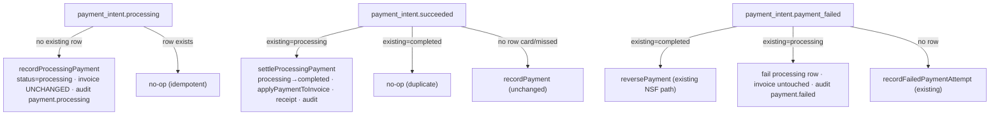

# feat: One-Time ACH Processing Lifecycle (E2a)

**Created:** 2026-06-14
**Depth:** Standard (4 units) — **high-risk: touches the shared payment/money path**.
**Status:** plan
**Parent:** `docs/plans/2026-06-14-001-feat-prd-gap-closure-roadmap-plan.md` → Wave 1 epic **E2** (stage **2a**).

## Summary
Make one-time ACH (bank-debit) a **first-class, owner-visible** payment on the existing hosted invoice flow. ACH eligibility and settlement already work (Stripe `automatic_payment_methods` + the existing `payment_intent.succeeded` handler), but the 1–4 business-day ACH **"processing" window is invisible**: `payment_intent.processing` is unhandled and the domain `PaymentStatus` lacks `'processing'`. This adds the processing→settled→failed lifecycle at the **payment level** (invoice stays `open` until funds clear), surfaces "ACH processing" to the owner and customer, and crucially makes `payment_intent.succeeded` **upgrade** an in-flight processing payment instead of recording a duplicate.

## Problem Frame
PRD §5/§6.5 claim ACH as built parity. Verification (2026-06-14): the PaymentIntent flow (`stripe-payment-intent.ts:80`) sets `automatic_payment_methods[enabled]=true`, so ACH is enabled by code (its appearance is a Stripe-Dashboard toggle, no code change). On settlement, `webhooks/routes.ts:1079` records the payment and marks the invoice paid; NSF returns reverse it. So **money correctness already holds**. The gap is **visibility**: when a customer pays by ACH, Stripe fires `payment_intent.processing` (unhandled → silent), the invoice shows `open` for days, and the owner — who runs the business from the digest/dashboard — has no signal that money is in-flight. This epic closes that window.

## Requirements
- **R1.** When an ACH payment enters processing, the system records a first-class `processing` payment (provider_reference set) **without** marking the invoice paid and **without** firing the receipt. *(PRD parity; owner visibility.)*
- **R2.** On settlement (`payment_intent.succeeded`), an existing `processing` payment is **upgraded to `completed`** (not duplicated), and only then are invoice balances/status updated and the receipt sent.
- **R3.** On failure before settlement, a `processing` payment transitions to `failed`; the invoice is untouched (it was never paid). Post-settlement NSF still reverses via the existing path.
- **R4.** The customer portal and the owner's invoice view show an "ACH processing (clears in 1–4 business days)" state while a processing payment is in flight.
- **R5.** The whole lifecycle is idempotent and order-tolerant (processing/succeeded/failed may arrive once, repeatedly, or out of order) and `recordPayment`'s behavior for the card path is **unchanged**.
- **R6.** Integer cents throughout; every transition emits an audit event; all queries tenant-scoped under RLS.

## Key Technical Decisions
- **Represent ACH-in-flight at the PAYMENT level (`status='processing'`), not a new invoice status.** The invoice stays `open` until settlement (correct — funds aren't cleared); the owner sees a processing *payment*. *(Alternative: add an `invoice.status='payment_processing'`. Rejected — the invoice status enum ripples across filters, money-dashboard, money-state, and many UI consumers; high blast radius for marginal gain. The payments table CHECK already permits `'processing'`, so no migration is needed.)*
- **Extract a shared `applyPaymentToInvoice(invoice, amountCents)` helper.** `recordPayment` (card/settled path) and the new `settleProcessingPayment` both use it, so the balance/status math is defined once and `recordPayment`'s external behavior is byte-identical for existing callers. *(Alternative: duplicate the math in the settle path. Rejected — drift risk on money code.)*
- **`payment_intent.succeeded` upgrades an existing `processing` row instead of creating a new payment.** This is the linchpin: today the handler only skips when an existing payment is `completed`; with a processing row present it would otherwise call `recordPayment` and **double-count**. The new branch (processing → settle) prevents that. *(This is why R1 cannot ship without R2 — they are one coherent change.)*
- **Processing neither marks the invoice paid nor fires the receipt; settlement does both.** ACH can still fail (NSF) before clearing.
- **Idempotency/order-tolerance via `findByProviderReference`.** Any event arriving first or repeating converges: processing→(create), succeeded→(upgrade or, if no row, record), failed→(fail row or record failed attempt). Layered on the webhook base (P0-014) event dedup.

## Scope Boundaries
**In scope:** `PaymentStatus` += `'processing'`; `recordProcessingPayment` + `settleProcessingPayment` + processing→failed transition (+ shared `applyPaymentToInvoice`); the three webhook branches (`payment_intent.processing` new; `succeeded` upgrade; `payment_failed` processing-clear); portal + owner "ACH processing" surfacing; unit + webhook + Docker-gated integration tests.

**Non-goals (defer to E2b / Wave 3):**
- Saved/recurring bank accounts, SetupIntent for `us_bank_account`, mandates, micro-deposit / Financial-Connections verification, any embedded bank-entry UI (D-009 keeps us Stripe-hosted).
- A new invoice lifecycle status; estimated-settle-date business-day math (show a static "1–4 business days" copy unless trivial).
- The legacy `stripe-payment-link.ts` Payment Link flow and `checkout.session.completed` (the live portal uses the PaymentIntent + PaymentElement; Checkout Sessions are card-only here).

### Deferred to follow-up work
- Owner digest line for "N ACH payments processing" (could fold into the E5 digest later).
- `estimatedSettleDate` computed field on the status endpoint.

## Repository invariants touched
- **Integer cents** — all amounts (`amount`, `amount_received`) are integer cents; reuse existing validation in `payment.ts`.
- **`tenant_id` + RLS** — all payment reads/writes via the tenant-scoped repo (`pg-payment.ts` `withTenant`/base).
- **Audit on every mutation** — new events `payment.processing` (record), `payment.completed`/`invoice.status_changed` (settle), `payment.failed` (processing-fail); mirror `payment-audit.ts` usage.
- **Webhook base (P0-014)** — new branch reuses the existing dedup/idempotency + `webhookRepo.updateStatus(...,'processed')` pattern.
- **No AI/proposals/catalog/entity-resolver/human-approval** — customer-initiated payment path, not an AI proposal.

## High-Level Technical Design

ACH event lifecycle (all keyed by PaymentIntent id = `providerReference`):

## Implementation Units

> DB-touching units require a Docker-gated integration test in `packages/api/test/integration/` (CLAUDE.md). Note: the sandbox can't pull the pgvector testcontainer image (rate-limited), so integration tests are written here and run in **PR CI** — unit + webhook tests are the local proof.

### U1. Payment domain: `processing` status + record/settle/fail transitions
- **Goal:** Domain support for an in-flight ACH payment that settles or fails without disturbing the card path.
- **Requirements:** R1, R2, R3, R5, R6.
- **Dependencies:** none.
- **Files:**
  - `packages/api/src/invoices/payment.ts` — add `'processing'` to `PaymentStatus` (DB CHECK already allows it — verify); extract pure `applyPaymentToInvoice(invoice, amountCents) → { amountPaidCents, amountDueCents, status }`; refactor `recordPayment` to use it (behavior identical); add `recordProcessingPayment(input,…)` (insert status `processing`, **no** invoice update, audit `payment.processing`, idempotent via `findByProviderReference`).
  - `packages/api/src/payments/payment-service.ts` — add `settleProcessingPayment(tenantId, providerReference,…)` (processing→`completed`, then `applyPaymentToInvoice` + receipt + audit `payment.completed`/`invoice.status_changed`) and `failProcessingPayment(tenantId, providerReference, reason,…)` (processing→`failed`, invoice untouched, audit `payment.failed`); mirror `reversePayment`.
  - `packages/api/src/invoices/payment.ts` / `pg-payment.ts` — add a `PaymentRepository` status-transition method if one isn't already present (reuse whatever `reversePayment` uses).
  - `packages/api/test/invoices/payment-ach-processing.test.ts` (new — unit, mocked repos).
  - `packages/api/test/integration/payments-ach-processing.test.ts` (new — Docker-gated; pins the `processing` round-trip + invoice-unchanged-until-settle against real columns).
- **Approach:** `applyPaymentToInvoice` centralizes the balance/status math (the lines currently inline at `payment.ts:247-255`). `recordProcessingPayment` records the row only. `settleProcessingPayment` loads the processing row, flips to `completed`, applies the invoice update, fires the receipt — i.e. the settled-money effects happen exactly once, at settlement. `failProcessingPayment` only flips the row. All transitions guard on the row's current status (idempotent).
- **Patterns to follow:** `recordPayment` (`payment.ts:200`), `reversePayment` (`payment-service.ts`), `payment-audit.ts` event helpers.
- **Test scenarios:**
  - Happy: record processing → invoice stays `open`, `amountDue` unchanged, audit `payment.processing`; settle → payment `completed`, invoice `paid`, receipt fired once, audit emitted.
  - Edge: settle when no processing row exists → falls through to `recordPayment` (card parity); double-settle is idempotent (second is a no-op); partial payment (processing < amountDue) settles to `partially_paid`.
  - Failure: processing → fail → payment `failed`, invoice untouched, audit `payment.failed`.
  - Card regression: `recordPayment` output identical before/after the `applyPaymentToInvoice` extraction (assert balances/status unchanged).
  - Integration (CI): processing row persists with `status='processing'`; invoice not paid; settle flips both; failed leaves invoice open.
- **Verification:** unit green locally; integration green in CI; `tsc --project tsconfig.build.json` clean.

### U2. Webhook lifecycle: processing handler + succeeded upgrade + failed clear
- **Goal:** Drive the U1 transitions from Stripe events, idempotently and order-tolerantly.
- **Requirements:** R1, R2, R3, R5.
- **Dependencies:** U1.
- **Files:**
  - `packages/api/src/webhooks/routes.ts` — add a `payment_intent.processing` branch (metadata extract + dedup + `recordProcessingPayment`); change the `payment_intent.succeeded` branch so an existing **`processing`** row routes to `settleProcessingPayment` (existing `completed` still skips; no row still `recordPayment`); add a **`processing` → `failProcessingPayment`** case to `payment_intent.payment_failed` (between the `completed`→reverse and no-row→`recordFailedPaymentAttempt` cases).
  - `packages/api/test/webhooks/stripe-ach-processing.test.ts` (new — handler tests with mocked Stripe payload + repos).
- **Approach:** Mirror the existing `payment_intent.succeeded` handler shape (`routes.ts:1079`): metadata guard, `findByProviderReference` dedup, repo-wired guard, `updateStatus(...,'processed')`, 200. The processing branch returns 200 even when metadata is missing (skip) so Stripe never retries.
- **Patterns to follow:** `payment_intent.succeeded` (`routes.ts:1079-1151`), `payment_intent.payment_failed` (`routes.ts:1162-1235`), `mapStripePaymentMethod`.
- **Test scenarios:**
  - processing event → records a `processing` payment; repeat event → no-op (dedup).
  - succeeded after processing → upgrades to `completed` (exactly one payment row; invoice paid). succeeded with no prior row → records completed (card parity unchanged).
  - failed after processing → row `failed`, invoice open. failed after completed → reverse (unchanged). failed with no row → failed attempt (unchanged).
  - Out-of-order: succeeded before processing → completed recorded; late processing → no-op.
  - Missing metadata on processing → 200 skip (no retry storm).
- **Verification:** handler tests green; no duplicate payment rows in any ordering; `tsc` clean.

### U3. Customer + owner "ACH processing" visibility
- **Goal:** Surface the in-flight ACH state to both the paying customer and the owner.
- **Requirements:** R4.
- **Dependencies:** U1 (a processing payment must be queryable).
- **Files:**
  - `packages/api/src/routes/public-payments.ts` — the status endpoint (`:166`) returns a `paymentProcessing: boolean` (true when a `processing` payment exists for the invoice).
  - `packages/web/src/components/customer/InvoicePaymentPage.tsx` — on load/poll, show the persistent "payment processing — your bank transfer clears in 1–4 business days" state when `paymentProcessing` is true (the submit-time `processing_async` copy already exists; this makes it survive reloads).
  - Owner invoice/payment view (locate in execution — the invoice-detail/payments-list component) — render a "Processing" badge on a processing payment row.
  - `packages/web/src/components/customer/InvoicePaymentPage.test.tsx` — extend; + a test for the owner badge component.
- **Approach:** Payment-level flag only (no invoice-status change). The poll already watches invoice status for the `paid` transition; add the `paymentProcessing` flag so a revisiting customer (and the owner) see the in-flight state.
- **Patterns to follow:** existing `processing_async` state + polling in `InvoicePaymentPage.tsx`; the status endpoint shape in `public-payments.ts`.
- **Test scenarios:**
  - Status endpoint returns `paymentProcessing: true` with a processing payment, `false` otherwise (unit/handler test, tenant-scoped).
  - Portal shows the processing copy when the flag is true; flips to "paid" when settlement lands (existing behavior).
  - Owner payment row shows a "Processing" badge for a `processing` payment; mobile contract preserved (≥44px) if the touched view is public/mobile.
- **Verification:** web tests green; status endpoint test green.

### U4. (verification gate, no new code) End-to-end + card-regression sweep
- **Goal:** Prove the lifecycle holds together and nothing on the card path regressed.
- **Requirements:** R5.
- **Dependencies:** U1–U3.
- **Files:** none (runs existing + new suites).
- **Approach:** Run the full payments/webhook/web suites; confirm existing card-payment and NSF-reversal tests still pass unchanged. Fold any gaps back into U1–U3.
- **Test scenarios:** `Test expectation: none new — this unit is the green-suite + code-review gate.`
- **Verification:** `tsc` (build) + `npm run lint` + `npm run test` (api) + web tests green; integration suite green in CI; `/code-review` clean.

## Risks & Dependencies
- **Core money path (highest).** `recordPayment` is shared by the card path, manual payments, and `checkout.session.completed`. Mitigation: extract `applyPaymentToInvoice` with `recordPayment` behavior held identical; explicit card-regression test (U1); deepening pass recommended before merge.
- **Double-record bug if the succeeded-upgrade is wrong.** The single most important correctness point; covered by U2 ordering tests (exactly one row across all event orderings).
- **Idempotency under Stripe retries / out-of-order delivery.** Mitigated by `findByProviderReference` guards + the webhook-base event dedup.
- **No migration expected** (payments CHECK already allows `processing`) — **verify** during U1; if the CHECK is missing `processing`, add an idempotent additive migration (mirrors migration-133 pattern) and a Docker-gated test.
- **Sequencing:** U1 → U2 → U3 → U4.

## Open Questions (deferred to implementation)
- Exact `PaymentRepository` method for a status transition (reuse `reversePayment`'s mechanism or add a small `updatePaymentStatus`).
- The owner invoice/payment UI file that renders payment rows (locate via grep in U3).
- Whether to compute a real `estimatedSettleDate` (business-day math) or ship static "1–4 business days" copy (lean static for 2a).
- Confirm `checkout.session.completed` needs no processing handling (portal uses PaymentIntent — expected yes, verify).

## Sources & Research
- Code verified 2026-06-14: `packages/api/src/payments/stripe-payment-intent.ts:80` (`automatic_payment_methods` — ACH enabled by code), `stripe-payment-link.ts` (legacy link flow, out of scope), `webhooks/routes.ts:1079-1235` (succeeded settles ACH; dedup only on `completed`; failed handles reverse vs failed-attempt; **no `payment_intent.processing` handler**), `invoices/payment.ts:200-255` (`recordPayment` always `completed`, marks invoice paid; `PaymentStatus` omits `processing` though the DB allows it), `payments/payment-service.ts` (`reversePayment`/`recordFailedPaymentAttempt` patterns), `routes/public-payments.ts:166` (status poll), `packages/web/src/components/customer/InvoicePaymentPage.tsx` (existing `processing_async` + polling).
- `docs/decisions.md` D-009 (Stripe-hosted, no embedded checkout, minimize PCI); PRD §5 line 234, §6.5 line 392.
- Parent roadmap E2 (2a vs 2b split). No `docs/solutions/` entries for this area.
