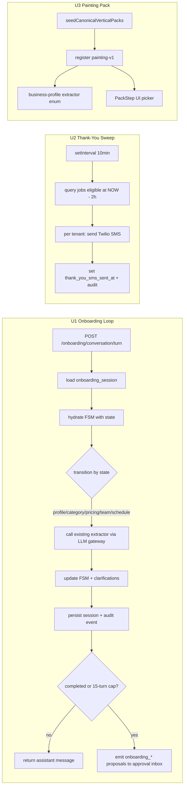

# feat: Close three PRD-vs-codebase gaps (onboarding loop, post-job thank-you SMS, painting pack)

**Created:** 2026-06-17
**Depth:** Standard
**Status:** plan

## Summary

The competitive analysis (Jobber/Avoca/Service OS, June 2026) claims three
capabilities the canonical product does not currently ship. This plan
closes all three as independently shippable units: a multi-turn
**Onboarding Agent** built on the existing stateless extractors plus the
customer-calling FSM pattern; an automatic **thank-you SMS** two hours
after `job.completed`, modeled on the Google Reviews sweep worker; and a
fourth **painting vertical pack** to match the PRD's HVAC/plumbing/painting
positioning. No unit modifies the proposal/audit/approval gate.

## Problem Frame

The audit of the June 2026 competitive PRD against `/packages` found 44 of
48 claims fully built. Three of the remaining four are concrete shipping
gaps (the fourth was an infra naming mismatch — "Inngest" in the doc,
db-backed durable queue in the code — which is documentation work, not
code). These three matter for different reasons:

- **Onboarding loop** is the PRD's headline differentiator in §6.3
  ("Onboarding Agent — conversational business setup, 10–15 exchanges")
  and is referenced in every competitive positioning row. Today the
  extractors run in a single batch over a monologue transcript; there
  is no turn-by-turn clarification, no session persistence, and the V2
  web onboarding is a form wizard — exactly the UX the PRD pitches
  *against*. Closing this gap is the difference between "we have
  onboarding code" and "we can demo the differentiator."
- **Thank-you SMS** is the closing beat of the §7.2 demo moment
  ("Johnson job is done" → invoice → thank-you → review). Templates and
  the `job_completion` trigger config exist; the 2hr delayed send does
  not.
- **Painting pack** is a published positioning claim
  (HVAC/plumbing/painting in §6.3 and the feature matrix). Codebase
  ships HVAC/plumbing/**electrical**. Either we add painting or we
  retract the claim — adding it is cheap and the pack architecture is
  already proven across three implementations.

## Requirements

- R1. A multi-turn onboarding conversation persists across HTTP requests
  for up to 15 exchanges per tenant, drives the existing five extractors
  with progressive clarification, and emits the existing five
  `onboarding_*` proposal types (never auto-executed). Session state is
  RLS-scoped and every turn is audit-logged.
- R2. Two hours after a job's `completed_at`, a thank-you SMS is sent to
  the job's customer exactly once, subject to a tenant-configurable flag
  (`thank_you_sms_enabled`, default `true`), with idempotency tracked on
  the job record and standard SMS opt-out / no-phone short-circuits.
- R3. A `painting-v1` canonical vertical pack with intake questions,
  terminology, objection scripts, and ≥7 service categories registers
  through `seedCanonicalVerticalPacks` and is selectable by the
  business-profile extractor and the onboarding pack-picker UI.

## Key Technical Decisions

- **Onboarding orchestration mirrors the customer-calling FSM, not
  Inngest.** The customer-calling agent
  (`packages/api/src/ai/agents/customer-calling/state-machine.ts` +
  `transitions.ts`) is the only proven multi-turn agent in the
  codebase: pure reducer `transition(state, event, ctx) → { nextState,
  ctx, sideEffects[] }`, with side effects returned as data for the
  caller to execute. Reusing this shape keeps the FSM testable in pure
  unit tests and matches an existing engineering pattern. *Alternative
  rejected:* a fresh imperative loop — adds a second concurrency model
  to maintain and contradicts the FSM precedent.
- **Sessions persist in a new `onboarding_session` table; FSM is hydrated
  per request.** A conversational onboarding can stretch across browser
  closes, voice ↔ chat handoffs, and resumed signups. In-memory state
  (what customer-calling uses for live calls) is the wrong fit. The
  table carries `transcript_turns JSONB`, `fsm_state TEXT`,
  `pending_clarifications JSONB`, `turn_count INT`, `tenant_id UUID` for
  RLS, and timestamps. *Alternative rejected:* attaching session blobs
  to `tenant_settings` — couples session lifecycle to tenant lifecycle
  and breaks resumability after onboarding completes.
- **Reuse the five existing extractors unchanged.** They are stateless
  `OnboardingExtractor<T>` implementations that take a transcript +
  prior-extraction context. The FSM treats them as side effects: dispatch
  → "call extractor X" → consume result → decide next state. This
  preserves every existing test and keeps the gateway-call surface
  identical. *Alternative rejected:* one big "conversational extractor"
  prompt — collapses the five clean confidence signals into one and
  defeats the dependency-ordered phase model that already works.
- **Bound the loop at 15 turns; on overflow, emit partial proposals plus
  a `manual_review_required` flag.** Matches the PRD's "10–15 exchange"
  claim, prevents runaway gateway spend on a stuck conversation, and
  preserves the human-approval gate (a partial onboarding still produces
  proposals an owner can edit/approve). *Alternative rejected:* hard
  failure at the cap — wastes whatever facts were captured.
- **Conversational web UI is a new step variant alongside the V2 form
  wizard, not a replacement.** The existing
  `packages/web/src/components/onboarding/v2/` steps (Identity, Pack,
  Phone, Billing, TestCall) are live and integrate Stripe + Twilio
  registration polling. Replacing them is out of scope for a gap-closure
  plan. Add `ConversationStep.tsx` as the first step of an opt-in
  "conversational" lane that backfills the V2 step state on completion.
  *Alternative rejected:* rip out V2 form wizard — far beyond this
  plan's scope and risks the Stripe/Twilio flows.
- **Thank-you SMS uses the same sweep pattern as `google-reviews.ts`,
  not a per-job scheduled timer.** Codebase has no per-message delayed
  scheduler; the sweep pattern is proven and runs alongside other
  workers in `app.ts` via `setInterval`. Sweep every 10 minutes,
  scanning `jobs WHERE completed_at IS NOT NULL AND
  thank_you_sms_sent_at IS NULL AND NOW() - completed_at >= INTERVAL
  '2 hours'`. Idempotency comes from the `thank_you_sms_sent_at` write
  on the job. *Alternative rejected:* Inngest/external scheduler —
  introduces a dependency the codebase consciously avoided (see audit
  finding on P0-009 durable queues).
- **Painting categories mirror electrical's 7-category structure**
  (`diagnostic | prep | interior | exterior | specialty | finishing |
  emergency`). Keeps the union types uniform and matches the
  PRD's "vertical templates with 40+ line items" via the same metadata
  shape that HVAC/plumbing/electrical use.

## Scope Boundaries

**In scope:**
- New `onboarding_session` table + migration + RLS policy.
- New onboarding FSM (states, transitions, threshold constants) and
  orchestrator that hydrates a session, dispatches one user turn, and
  persists the result.
- New `POST /api/onboarding/conversation/turn` endpoint + Zod request
  schema + audit-event emission per turn.
- New `ConversationStep.tsx` web component (text chat only) hooked into
  the V2 onboarding lane as an optional entry path.
- Thank-you SMS: `renderThankYouSms` template, migration adding
  `thank_you_sms_enabled` to `tenant_settings` and
  `thank_you_sms_sent_at` to `jobs`, sweep worker, worker-registry
  registration, `app.ts` interval setup, settings UI toggle.
- Painting pack: `painting.ts` pack module, type/enum additions, seeder
  update, business-profile-extractor enum update, web pack-picker copy,
  tests.

**Non-goals:**
- Voice-driven onboarding turns. Today's V2 has a TestCallStep but the
  conversational path is text-only; voice extends later once the loop
  is proven.
- Replaying or editing earlier turns. The artifact of an onboarding
  session is its emitted proposals — those are the editable surface.
- L1–L5 config-stack tagging on emitted proposals. The five
  `onboarding_*` proposal types already exist; layering them into the
  config stack is a separate workstream.
- Reordering or eliminating any V2 form steps.
- A new outbound SMS provider, opt-out registry change, or quiet-hours
  policy beyond what already applies to other transactional SMS.
- Marketing-style follow-up sequences (review-request, NPS surveys
  beyond the existing review_request job). Thank-you is one SMS, one
  time, per completed job.
- Internationalization of the thank-you template body beyond the
  existing `tn()` i18n catalog mechanics.
- Multi-language painting pack content. Painting ships in English
  alongside HVAC/plumbing/electrical.

### Deferred to follow-up work
- Voice channel for the onboarding loop (deferred — the FSM accepts
  utterances regardless of source, so the worker is reusable later).
- Conversational onboarding analytics dashboard (turn count
  distributions, drop-off, clarification rate) — log audit events now
  so the data exists when we build the view.
- A "PRD documentation reword" sweep on the competitive analysis
  document to rename Inngest references to "P0-009 durable queue"
  (separate doc-only work, not in this plan).

## Repository invariants touched

- **RLS / `tenant_id`** — New `onboarding_session` and the migrated
  `tenant_settings` / `jobs` columns all carry tenant scoping; RLS
  policies use the same `current_setting('app.current_tenant_id')::UUID`
  pattern already established for `tenant_settings`.
- **Audit events on mutations** — Every onboarding turn (user message +
  assistant message + FSM transition) and every thank-you SMS send emit
  a typed audit event via `AuditRepository.create`.
- **LLM gateway** — All onboarding extractor calls continue routing
  through `packages/api/src/ai/gateway/gateway.ts`; the orchestrator
  does not bypass it. No new gateway entry point.
- **Zod-validated typed proposals + human approval** — Onboarding still
  emits the existing five `onboarding_*` proposal types validated by
  `packages/api/src/proposals/contracts/onboarding.ts`. Nothing is
  auto-executed; the FSM's `completed` state hands proposals to the
  existing approval inbox.
- **Catalog resolver** — Pricing extractor output still flows through
  `catalog-resolver.ts` per existing wiring; painting pack template
  line items source the catalog the same way as other packs.
- **Entity resolver** — Not on the hot path here; onboarding sessions
  do not resolve customer/job entities by free-text.
- **Integer cents** — Pricing extractor already enforces this; thank-you
  SMS does not touch money. Migration adds no monetary columns.
- **UTC times** — `completed_at`, `thank_you_sms_sent_at`,
  `onboarding_session.created_at/updated_at` all stored UTC, rendered in
  tenant timezone where displayed.

## High-Level Technical Design

## Implementation Units

### U1. Onboarding Agent conversational loop

- **Goal:** Turn the stateless, single-transcript onboarding orchestrator
  into a persisted multi-turn FSM that drives the existing extractors
  with progressive clarification, bounded at 15 turns, emitting the
  existing `onboarding_*` proposals at completion.
- **Requirements:** R1
- **Dependencies:** none (extractors and proposal contracts already
  exist; this unit wires them into an FSM)
- **Files:**
  - `packages/api/src/db/schema.ts` — add `onboarding_session` table
    (`id UUID`, `tenant_id UUID NOT NULL`, `fsm_state TEXT NOT NULL`,
    `transcript_turns JSONB NOT NULL DEFAULT '[]'`,
    `pending_clarifications JSONB NOT NULL DEFAULT '[]'`,
    `turn_count INT NOT NULL DEFAULT 0`, `created_at TIMESTAMPTZ`,
    `updated_at TIMESTAMPTZ`, `completed_at TIMESTAMPTZ NULL`); RLS
    policy on `tenant_id`.
  - `packages/api/src/ai/agents/onboarding/state-machine.ts` — new FSM
    (`OnboardingState = 'profile_capture' | 'category_capture' |
    'pricing_capture' | 'team_capture' | 'schedule_capture' | 'review'
    | 'completed' | 'capped'`).
  - `packages/api/src/ai/agents/onboarding/transitions.ts` — pure
    reducer; one transition per state, returns
    `{ nextState, ctxPatch, sideEffects[] }` where side effects are
    `{ kind: 'call_extractor' | 'emit_message' | 'emit_proposal_batch'
    | 'request_clarification' }`.
  - `packages/api/src/ai/agents/onboarding/constants.ts` — thresholds
    (`MAX_TURNS = 15`, `MIN_EXTRACTION_CONFIDENCE = 0.7`,
    `MAX_CLARIFICATIONS_PER_STATE = 2`).
  - `packages/api/src/ai/orchestration/onboarding-conversation.ts` —
    new conversation orchestrator. Hydrates session, calls
    `transitions.transition()`, executes side effects (extractor +
    proposal-emission paths reuse `packages/api/src/ai/tasks/
    onboarding/*` and `packages/api/src/proposals/proposal.ts` as-is),
    persists session, emits audit events.
  - `packages/api/src/routes/onboarding-conversation.ts` — new endpoint
    `POST /api/onboarding/conversation/turn` with Zod request schema
    `{ tenantId, sessionId?, userMessage }` → `{ sessionId,
    assistantMessage, state, turnCount, completed,
    proposalBatchIds[] }`. Tenant guard reuses
    `withTenant` middleware.
  - `packages/api/src/db/onboarding-session-repository.ts` — new repo
    (`load`, `create`, `update`, `complete`) with RLS context binding.
  - `packages/api/src/ai/orchestration/onboarding.ts` — leave the
    existing single-transcript path untouched (used by V2 lane); export
    a shared `runExtractionPhase()` helper the FSM can reuse so
    extractor invocation logic isn't duplicated.
  - `packages/web/src/components/onboarding/v2/steps/
    ConversationStep.tsx` — new chat UI (textarea + bubble list) that
    posts each user message to the new endpoint and displays the
    assistant message. On `completed: true`, advances V2 lane to
    PhoneStep (skipping IdentityStep/PackStep since the conversation
    captured them).
  - `packages/web/src/components/onboarding/v2/OnboardingShell.tsx` —
    add an opt-in entry: "Chat with the setup agent" alongside the
    existing form-step entry.
  - `packages/api/test/ai/agents/onboarding/transitions.test.ts` —
    pure-FSM unit tests (Vitest, no DB).
  - `packages/api/test/ai/orchestration/onboarding-conversation.test.ts`
    — handler-level test with mocked gateway + repos.
  - `packages/api/test/integration/onboarding-conversation.test.ts` —
    Docker-gated integration test pinning the new table's columns + RLS
    + audit-event emission.
- **Approach:** Treat the FSM as data, the extractors as side effects.
  Per request: load session by `(tenant_id, session_id)` (create if
  null), append `userMessage` to `transcript_turns`, increment
  `turn_count`. Call `transition(currentState, { kind: 'user_turn',
  utterance }, ctx)`. Execute side effects in order: if
  `call_extractor`, route through the LLM gateway and feed the result
  back into a follow-on `transition({ kind: 'extraction_result',
  result }, ctx)`; if `request_clarification`, persist the question on
  `pending_clarifications` and emit the assistant message; if
  `emit_proposal_batch` at `completed`, hand off to existing
  proposal-emission code path. After the loop quiesces, persist new
  state + updated transcript, write one audit event per side effect
  with `{ tenantId, sessionId, kind, fromState, toState }`, return the
  assistant message to the client. If `turn_count == MAX_TURNS`,
  transition to `capped`, emit whatever proposals current extraction
  context supports plus an `onboarding_review_required` audit event,
  and surface that to the client UI.
- **Patterns to follow:**
  - FSM reducer + side-effects-as-data:
    `packages/api/src/ai/agents/customer-calling/state-machine.ts` and
    `transitions.ts` (mirror file layout, naming, threshold-constants
    file).
  - Gateway call shape: every existing extractor under
    `packages/api/src/ai/tasks/onboarding/*-extractor.ts`.
  - RLS-scoped repository: `packages/api/src/audit/audit.ts` and the
    existing `tenant_settings` access path.
  - Audit-event emission: `packages/api/src/audit/audit.ts` →
    `auditRepo.create({ kind: 'onboarding.turn', ... })`.
  - Proposal emission: keep the same code path as the existing
    orchestrator in `packages/api/src/ai/orchestration/onboarding.ts`
    so both lanes produce identical proposal payloads.
- **Test scenarios:**
  - Happy path (FSM unit): start in `profile_capture` → user utterance
    triggers `call_extractor` → extraction with confidence ≥ 0.7
    advances to `category_capture` → repeat through all five states →
    `review` → `completed` emits 5 proposal batches.
  - Edge (FSM unit): extractor confidence < 0.7 →
    `request_clarification` side effect is emitted with a state-specific
    question; subsequent turn either resolves (advance) or hits
    `MAX_CLARIFICATIONS_PER_STATE = 2` and advances anyway with a
    `low_confidence` flag on the proposal payload.
  - Edge (FSM unit): user utterance is irrelevant ("what's the
    weather") in any state → `request_clarification` reprompts; does
    not consume an extractor call.
  - Edge (FSM unit): cap reached at turn 15 → transitions to `capped`,
    emits partial proposals + `manual_review_required` audit event.
  - Edge (handler): session lookup with mismatched `tenant_id` →
    request rejected with 404 (RLS) and no session leaked.
  - Failure (handler): gateway returns malformed JSON twice in a row →
    side-effect handler logs, dispatches a synthetic
    `extraction_failed` event, FSM falls through to
    `request_clarification` with a recovery prompt.
  - Integration (Docker-gated): write a session, dispatch three turns,
    reload via repository → `transcript_turns` length is 3, audit
    events count is ≥ 3, RLS prevents reading from a second tenant
    context.
  - Web (jsdom): `ConversationStep.tsx` renders prior turns, disables
    send while a request is in flight, and advances the V2 lane on
    `completed: true`.
- **Verification:** A fresh tenant can complete onboarding in 8–12 chat
  turns; the approval inbox lists five `onboarding_*` proposal batches;
  `audit_events` has one row per turn; closing and reopening the
  browser resumes at the same FSM state.

### U2. Thank-you SMS 2 hours after `job.completed`

- **Goal:** Send exactly one thank-you SMS to a job's customer two
  hours after `completed_at`, subject to a tenant flag, with idempotent
  delivery tracked on the job row.
- **Requirements:** R2
- **Dependencies:** none
- **Files:**
  - `packages/api/src/db/schema.ts` — migration adding
    `tenant_settings.thank_you_sms_enabled BOOLEAN NOT NULL DEFAULT
    true` and `jobs.thank_you_sms_sent_at TIMESTAMPTZ NULL`. Index on
    `(thank_you_sms_sent_at, completed_at)` to keep the sweep query
    cheap.
  - `packages/api/src/notifications/templates.ts` — add
    `renderThankYouSms(ctx: ThankYouMessageContext): RenderedSms` and
    register an i18n key (e.g. `sms.thank_you.line1`) in the
    notifications catalog.
  - `packages/api/src/workers/thank-you-sms-worker.ts` — new sweep
    worker mirroring `google-reviews.ts`. Query eligible jobs
    (`completed_at IS NOT NULL AND thank_you_sms_sent_at IS NULL AND
    NOW() - completed_at >= INTERVAL '2 hours' AND tenant_settings.
    thank_you_sms_enabled = true`), iterate per tenant, render +
    send via the existing Twilio adapter, then `UPDATE jobs SET
    thank_you_sms_sent_at = NOW()` and emit a
    `notification.thank_you_sms.sent` audit event. Per-tenant
    try/catch isolation (P0-009 pattern).
  - `packages/api/src/workers/worker-registry.ts` — register the new
    worker type.
  - `packages/api/src/app.ts` — start the sweep via `setInterval(...,
    10 * 60 * 1000)` alongside the Google Reviews sweep.
  - `packages/web/src/components/settings/CommunicationSettings.tsx`
    (or the existing closest settings sheet — confirm at
    implementation time, see Open Questions) — add a toggle bound to
    `thank_you_sms_enabled`.
  - `packages/api/test/notifications/thank-you-template.test.ts` —
    pure render test.
  - `packages/api/test/workers/thank-you-sms-worker.test.ts` —
    handler-level test with mocked repo + Twilio adapter, covers
    eligibility logic and idempotency.
  - `packages/api/test/integration/thank-you-sms-worker.test.ts` —
    Docker-gated integration test pinning the new columns, the index,
    and the sweep query against real Postgres + RLS.
- **Approach:** Sweep runs every 10 minutes. Per tenant, the query
  short-circuits on the tenant flag. For each eligible job, look up
  the customer's primary SMS-capable phone and respect existing
  opt-out / quiet-hours policies that apply to other transactional
  SMS. Render via `renderThankYouSms`, send via the existing Twilio
  adapter, then write `thank_you_sms_sent_at`. The flag write happens
  *before* the SMS send is awaited only if we want at-most-once
  semantics; default to *after* a successful send (at-least-once) and
  rely on the unique constraint that `thank_you_sms_sent_at IS NULL`
  in the query to prevent retries from re-sending after a successful
  write. If Twilio returns a transient error, leave `sent_at` null
  and let the next sweep retry; if Twilio returns a permanent error
  (e.g. invalid phone), set `sent_at = NOW()` to suppress future
  attempts and emit a `notification.thank_you_sms.suppressed` audit
  event with the reason.
- **Patterns to follow:**
  - Sweep cadence + per-tenant isolation:
    `packages/api/src/workers/google-reviews.ts` (15-min sweep,
    cursor + backoff). Use the same idiom for the interval handle
    and shutdown.
  - SMS rendering: existing `renderEstimateSms` / `renderInvoiceSms`
    in `packages/api/src/notifications/templates.ts`.
  - Worker registration: existing `workerRegistry.register({ type,
    handle })` calls in `packages/api/src/app.ts`.
  - Idempotent timestamp gating: pattern from existing dunning
    scheduler (`packages/api/src/invoices/dunning-schedule.ts`) for
    "send once per milestone."
- **Test scenarios:**
  - Happy path: tenant flag on, completed_at = NOW − 3h,
    thank_you_sms_sent_at IS NULL → worker sends SMS, writes
    timestamp, emits audit event.
  - Edge: completed_at = NOW − 1h → not eligible, skipped silently.
  - Edge: tenant flag off → skipped, sent_at remains null.
  - Edge: customer phone missing → skipped + audit reason
    `no_phone`, sent_at set so we don't re-check forever.
  - Edge: customer opted out of SMS → skipped + audit reason
    `opted_out`, sent_at set.
  - Edge: idempotency — run worker twice in the same minute, only
    one SMS goes out (sent_at write gates the second pass).
  - Failure: Twilio returns 4xx (e.g. invalid number) → suppressed
    audit event, sent_at set, no retry.
  - Failure: Twilio returns 5xx → sent_at left null, next sweep
    retries; cap retries at N (mirror existing transient-retry policy
    or open a follow-up if absent).
  - Integration (Docker-gated): with a real `jobs` row plus
    `tenant_settings` row, the eligibility query returns exactly the
    matching job; an inserted RLS-bound tenant cannot read the other
    tenant's jobs.
- **Verification:** A job marked completed at 10:00 receives the SMS by
  12:10; toggling the settings flag off mid-day prevents the next
  sweep from sending; the audit log shows one `sent` event per job.

### U3. Painting vertical pack

- **Goal:** Ship `painting-v1` as a fourth canonical vertical pack with
  parity to electrical's structure (7 service categories + metadata),
  so the PRD's HVAC/plumbing/painting positioning maps to real
  templates the system can serve.
- **Requirements:** R3
- **Dependencies:** none
- **Files:**
  - `packages/api/src/shared/vertical-types.ts` — add `'painting'` to
    `VerticalType` and `VALID_VERTICAL_TYPES`; add
    `PaintingServiceCategory` (`'diagnostic' | 'prep' | 'interior' |
    'exterior' | 'specialty' | 'finishing' | 'emergency'`); add
    `PAINTING_SERVICE_CATEGORIES`; widen `ServiceCategory` union;
    extend the `getServiceCategories` switch.
  - `packages/api/src/verticals/packs/painting.ts` — new
    `createPaintingPack()` mirroring `electrical.ts` shape:
    terminology map ("Quote" vs. "Estimate" vs. "Bid" — paint shops
    typically say "Bid"), category descriptors, intake_questions
    (rooms / square footage / surface condition / sheen / lead-paint
    age cutoff), objection scripts, and ≥40 catalog line items
    (interior wall paint by sqft, ceiling, trim, prep labor, primer,
    caulk, drywall patch, baseboard, doors, exterior siding, fascia,
    deck stain, cabinet refinish, etc.).
  - `packages/api/src/shared/canonical-vertical-packs.ts` — add
    `registry.register(adaptToCanonical('painting-v1',
    createPaintingPack()))` to the seeding list.
  - `packages/api/src/ai/tasks/onboarding/business-profile-extractor.ts`
    — widen the `verticalPacks` enum / Zod schema from `['hvac',
    'plumbing', 'electrical']` to include `'painting'`; update the
    extractor's system prompt to recognize painting cues (rooms,
    sheens, exterior, brands).
  - `packages/web/src/components/onboarding/v2/steps/PackStep.tsx` —
    add the painting card to the pack-picker grid.
  - `packages/api/test/shared/canonical-vertical-packs.test.ts` — add
    a `painting-v1` seeding + metadata assertion mirroring the
    existing hvac/plumbing/electrical assertions (verifies
    terminology, categories, intake_questions, objection_scripts are
    present and `verticalType === 'painting'`).
  - `packages/api/test/verticals/painting-pack.test.ts` — new unit
    test asserting the pack carries ≥7 categories, ≥40 catalog line
    items, and that every line item's `amount_cents` is a
    non-negative integer.
- **Approach:** Pure-additive. The pack module is a single exported
  factory `createPaintingPack(): VerticalPack` whose shape is
  determined by the existing `VerticalPack` type. The type/enum widening
  is mechanical; the only judgment call is the seven categories and
  the line-item catalog. Source the line-item names + price ranges
  from the existing HVAC/plumbing/electrical catalogs' shape (label,
  unit, default_price_cents). No new resolver, no new gateway path —
  the catalog resolver already handles any registered vertical via
  the registry.
- **Patterns to follow:**
  - Pack module structure: `packages/api/src/verticals/packs/
    electrical.ts` (closest in category count, simplest shape).
  - Type/enum additions: existing `vertical-types.ts` (precedent for
    every extension already in-file).
  - Seeding: `packages/api/src/shared/canonical-vertical-packs.ts`
    (single-line `registry.register(...)` addition).
  - Tests: `packages/api/test/shared/canonical-vertical-packs.test.ts`
    (snapshot the existing `hvac-v1` test, swap names).
- **Test scenarios:**
  - Pack registration: `seedCanonicalVerticalPacks` registers
    `painting-v1`; `getServiceCategories('painting')` returns all 7
    enumerated categories.
  - Metadata: pack carries non-empty `terminology`, `categories`,
    `intake_questions`, `objection_scripts` (mirror existing hvac
    test).
  - Catalog: every line item has `amount_cents` integer ≥ 0, a stable
    `code`, and a non-empty `display_name`.
  - Extractor: business-profile-extractor unit test with "I paint
    houses, mostly interior, sometimes deck staining" → emitted
    `verticalPacks` includes `'painting'`.
  - Web (jsdom): `PackStep.tsx` renders the painting card with the
    correct copy and pack-id; clicking it persists `selected_pack =
    'painting-v1'`.
- **Verification:** `npx vitest run packages/api/test/shared/
  canonical-vertical-packs.test.ts` and the new `painting-pack.test.ts`
  pass; a fresh tenant choosing "Painting" in the onboarding pack
  picker has `painting-v1` activated and the estimate-template draft
  uses painting line items.

## Risks & Dependencies

- **U1 ↔ existing onboarding lane.** The single-transcript orchestrator
  at `packages/api/src/ai/orchestration/onboarding.ts` must stay
  callable; the FSM reuses a shared `runExtractionPhase()` helper so
  any future change to the extractor invocation logic happens in one
  place. If a refactor of that file is in flight elsewhere, sequence
  this unit after it lands.
- **U2 ↔ Twilio quiet-hours and opt-out.** Codebase has prior wiring
  for transactional SMS suppression (opt-out keywords, quiet hours);
  the worker must call the same suppression check before sending.
  Confirm the check's location at implementation time (see Open
  Questions); if absent, that's a separate fix, not a thank-you-SMS
  blocker.
- **U3 ↔ business-profile extractor enum.** Widening the Zod schema is
  a contract change; existing tests against the extractor will need
  the assertion list updated. Low risk, but flag in code review.
- **U1 schema migration interacts with RLS.** The `onboarding_session`
  table needs `tenant_id` indexed and an RLS policy referencing
  `app.current_tenant_id`. Mirror the policy from `tenant_settings`
  exactly to avoid divergence.

## Open Questions
*(Deferred to implementation — runtime/codebase details, not planning
forks.)*

- Exact location of the current SMS opt-out / quiet-hours suppression
  check that U2 must invoke (search at implementation start).
- Final settings-page file path for the U2 toggle: confirm whether
  `CommunicationSettings.tsx` exists or whether the toggle lands in an
  existing notification-settings panel.
- Whether the U1 audit-event kind values
  (`onboarding.turn.user_message`, `onboarding.turn.assistant_message`,
  `onboarding.turn.state_transition`) align with the existing audit-kind
  registry's naming pattern (defer to whatever pattern audit kinds
  already use elsewhere).
- Exact i18n key namespace for `renderThankYouSms` —
  `sms.thank_you.line1` is the proposed key but confirm against the
  existing catalog conventions at implementation time.
- Final painting category labels surfaced to the UI (the FSM uses the
  enum strings; user-facing labels may differ — e.g. `'prep'` vs.
  `'Surface Prep'`).

## Sources & Research

Research was anchored in the codebase only; the PRD provided the
positioning claims that the audit verified. External research not
load-bearing for this plan.
