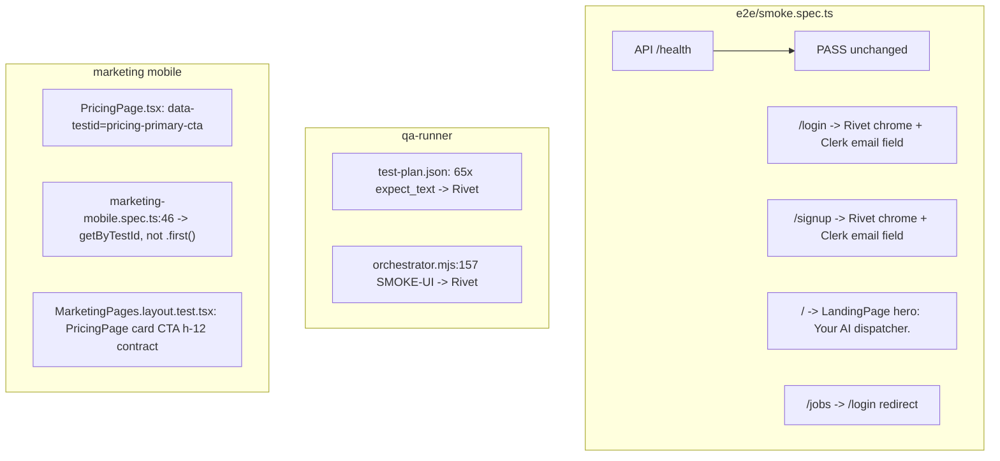

# fix: QA harness rebrand + marketing tap-target regression

**Created:** 2026-06-25
**Depth:** Standard
**Status:** plan

## Summary

Restore green QA smoke and infrastructure stages after the Rivet/ServiceOS
rebrand by updating stale **Fieldly** assertions in Playwright and the
qa-runner, aligning the signed-out `/` routing test with current
`ProtectedRoute` behavior, and fixing the marketing pricing-page glove-target
E2E failure (caused by the header CTA being matched before the pricing-card
CTA). Operator-only matrix/runbook execution is documented separately — no
code change unblocks secrets.

> **Verification note (2026-06-25):** Every factual claim below was checked
> against the working tree before this plan was written. Confirmed anchors:
> `qa-runner/config/test-plan.json` = 65 `Fieldly` entries; `e2e/smoke.spec.ts`
> lines 44/45/51 (Fieldly) + 54–57 (broken redirect test);
> `qa-runner/src/orchestrator.mjs:157` (`expect_text: 'Fieldly'`);
> `packages/web/src/components/auth/ProtectedRoute.tsx:26–29` (signed-out `/`
> renders `<LandingPage/>`, all other paths → `/login`);
> `MarketingHeader.tsx:35` (`<Button size="sm">Start free trial</Button>`, h-8);
> `PricingPage.tsx:100–113` (`<Button size="lg">Start free trial</Button>`,
> h-12, **no testid today**); `ui/button.tsx:27,29` (`sm: h-8`, `lg: h-12`);
> `LandingPage.tsx:57–58` (`<h1>Your AI dispatcher.</h1>`);
> `LoginPage.tsx:60,80` + `SignupPage.tsx:22,42` (render `Rivet` + `© 2026 Rivet`).

## Problem Frame

Post-rebrand QA runs report false failures. The deployed app correctly shows
**Rivet** chrome and a public **LandingPage** at `/`, but E2E smoke and the
qa-runner still assert **Fieldly**, and the smoke routing test still expects
`/` → `/login` (a redirect that `ProtectedRoute` deliberately no longer does
for the marketing root). Marketing mobile E2E fails because
`getByRole('link', { name: /start free trial/i }).first()` on `/pricing`
resolves the sticky header's `size="sm"` button (`h-8` = 32px) — which is
first in the DOM — instead of the pricing card's `size="lg"` button (`h-12` =
48px). CI and operators cannot trust harness results until these are corrected.

## Requirements

- **R1.** `npm run e2e:smoke` passes against Railway dev (`E2E_BASE_URL` set) —
  4/4 including API health, login, signup, and auth-routing behavior.
- **R2.** `npm run qa:run -- --stage infrastructure` passes UI checks when the
  API is healthy (every `expect_text` matches deployed login chrome).
- **R3.** `e2e/marketing-mobile.spec.ts` passes at 320px — the pricing primary
  CTA measures ≥44px tall, pinned to the pricing card (not the header).
- **R4.** `e2e/README.md` describes current auth routing and branding, not
  Fieldly.
- **R5.** Journey spec branding is updated so unskipping does not immediately
  fail on a stale assertion.
- **R6.** Operator runbook for full-matrix execution is discoverable from the
  plan (secrets checklist; no fake green without credentials).

## Key Technical Decisions

- **Assert app-owned chrome, not Clerk dashboard copy.** Login/signup pages
  render **Rivet** in header (`LoginPage.tsx:60`, `SignupPage.tsx:22`) and
  footer (`© 2026 Rivet`, lines 80 / 42). Clerk's widget title ("Sign in to
  ServiceOS") is configured in the Clerk dashboard and can change without a
  deploy, so smoke tests pin **Rivet** plus a *role-based* Clerk-mounted probe —
  never "Fieldly" or a hard-coded "ServiceOS" string. (Alternative: assert only
  Clerk roles — rejected; our chrome is the rebrand signal we control.)

- **Clerk mounted-signal: prefer a form control over the heading verb.** The
  source plan proposed `getByRole('heading', { name: /sign in/i })`. That works,
  but the heading verb is itself Clerk-rendered copy and is the most likely
  string to drift. Use a Clerk **form control** as the primary "widget mounted"
  assertion — `getByRole('textbox')` / `getByLabel(/email/i)` (the email field
  is present on both the sign-in and sign-up first step) — and treat the heading
  regex as an optional secondary check. Rationale: an input's presence proves
  the widget hydrated without coupling to localizable heading text. (Alternative:
  heading-only — accepted as fallback, but more brittle.)

- **Split the `/` redirect smoke test — do not revert `ProtectedRoute`.**
  `ProtectedRoute.tsx:26–29` is correct product behavior: signed-out `/` renders
  `<LandingPage/>`; every other protected path bounces to `/login`. Test the two
  behaviors separately. (Alternative: restore the `/` → `/login` redirect —
  rejected; it breaks the marketing funnel.)

- **Pricing CTA E2E: scope the locator, don't globally upsize header buttons.**
  Root cause is `.first()` matching `MarketingHeader.tsx:35`'s `size="sm"` link
  (32px) before `PricingPage.tsx`'s `size="lg"` card CTA (48px). Add
  `data-testid="pricing-primary-cta"` on the pricing-card `/signup` `<Link>`
  (`PricingPage.tsx:100–104`) and target it in E2E. (Alternative: bump all
  header CTAs to `min-h-11` — a valid a11y follow-up, but out of scope for a test
  that is specifically about the pricing card; deferred.)

- **qa-runner `expect_text: "Rivet"`.** `runUiCheck` (`qa-runner/src/tools.mjs`)
  does a case-insensitive HTML substring match; "Rivet" is present in the login
  page header HTML. Bulk-replace all **65** `Fieldly` entries in
  `qa-runner/config/test-plan.json` plus the single hardcoded smoke default at
  `qa-runner/src/orchestrator.mjs:157`.

- **Optional `data-testid` on auth chrome — deferred.** A
  `data-testid="auth-chrome-logo"` on the login/signup header span would make
  smoke selectors fully rebrand-proof, but the `Rivet` text assertion satisfies
  R1/R2 today; not required for this PR.

## Scope Boundaries

**In scope:** QA-001, QA-002, QA-006; `e2e/smoke.spec.ts`; `e2e/README.md`;
`qa-runner/config/test-plan.json`; `qa-runner/src/orchestrator.mjs`;
`e2e/journeys/signup-to-first-estimate.spec.ts`; `e2e/marketing-mobile.spec.ts`;
`packages/web/src/components/marketing/PricingPage.tsx`;
`packages/web/src/components/marketing/MarketingPages.layout.test.tsx` (pricing
card contract only).

**Non-goals:** Portal palette migration (QA-003); EstimateApprovalPage Fieldly
hardcode, still present at `packages/web/src/components/customer/EstimateApprovalPage.tsx`
(QA-004); U13 design-doc reconciliation (QA-005); contract-test comment hygiene
(QA-007); provisioning Railway secrets (QA-008); Stripe CLI install; full
`qa:runbook` execution in CI.

### Deferred to follow-up work

- QA-003/004/005/007 — customer-cluster palette + branding cleanup (separate plan).
- **Marketing palette:** `PricingPage`/`MarketingHeader`/auth pages still use the
  raw `slate-*` palette (e.g. `bg-slate-900`, `text-slate-900`). This PR adds a
  testid only; it does **not** rebrand marketing/auth color. Noted so a reviewer
  doesn't expect a recolor here.
- MarketingHeader mobile glove targets (`size="sm"` header CTAs remain 32px).
- `data-testid="auth-chrome-logo"` on auth pages if product wants rebrand-proof
  E2E long-term.
- CI wiring for `E2E_DB_URL_*` / `E2E_CLERK_HMAC_SECRET` repository secrets.

## Repository invariants touched

None of the canonical data/AI invariants apply — this is test-harness and
presentational marketing markup only. No money (integer cents), times/timezones,
`tenant_id`/RLS, audit events, LLM gateway, Zod proposals, catalog resolver,
entity resolver, or human-approval-gate code changes.

## High-Level Technical Design

## Implementation Units

### U1. E2E smoke — rebrand assertions + auth routing split

- **Goal:** R1, R4 (and the Playwright half of R2's "Rivet" string) — all four
  smoke tests pass against deployed dev.
- **Requirements:** R1, R4
- **Dependencies:** none
- **Files:**
  - `e2e/smoke.spec.ts` (modify)
  - `e2e/README.md` (modify — smoke section bullets)
- **Approach:**
  - **Login test (`smoke.spec.ts:38–47`):** Replace `getByText('Fieldly').first()`
    → `getByText('Rivet').first()` (keep `.first()` — "Rivet" also appears in the
    footer text node). Replace `getByText(/© 2026 Fieldly/)` →
    `getByText(/© 2026 Rivet/)`. Add a Clerk-mounted probe — prefer
    `getByRole('textbox').first()` (or `getByLabel(/email/i)`) `.toBeVisible()`;
    heading regex `getByRole('heading', { name: /sign in/i })` is an acceptable
    fallback. Keep the `consoleErrors`/`pageerror` guard.
  - **Signup test (`smoke.spec.ts:49–52`):** Replace `getByText('Fieldly').first()`
    → `getByText('Rivet').first()`; add the same Clerk-mounted probe (email
    textbox; heading `/sign up|create/i` as fallback).
  - **Routing (replace `smoke.spec.ts:54–57`):** Delete the single
    "protected route redirects to login" test (it asserts `/` → `/login`, which
    `ProtectedRoute.tsx:26–29` no longer does) and replace with two tests:
    1. `signed-out root shows the public landing page` — `goto('/')`,
       `await expect(page).toHaveURL(/\/$/)` (stays on root), assert
       `getByRole('heading', { name: /your ai dispatcher/i })` is visible
       (the `<h1>` at `LandingPage.tsx:58`).
    2. `signed-out app route redirects to login` — `goto('/jobs')`,
       `await expect(page).toHaveURL(/\/login/, { timeout: 10_000 })`.
  - Update `e2e/README.md` smoke bullets: Rivet branding; `/` = public landing;
    `/jobs` (any protected path) = login bounce.
- **Patterns to follow:** `e2e/estimate-approval-mobile.spec.ts` (Clerk gate via
  `E2E_BASE_URL`/`hasClerk`); `packages/web/src/components/auth/ProtectedRoute.tsx:26–29`
  (routing contract); `LoginPage.tsx` / `SignupPage.tsx` (Rivet chrome).
- **Test scenarios** (this unit *is* the test file):
  - Happy path: deployed dev — 4/4 smoke green with `E2E_BASE_URL` + `E2E_API_URL`
    set.
  - Edge: local run without `VITE_CLERK_PUBLISHABLE_KEY` — UI block still skips
    via the existing `test.skip(!hasClerk, …)` gate (lines 33–36, unchanged).
  - Error: page JS error on `/login` → `consoleErrors` non-empty (login test
    only, guard preserved).
- **Verification:** `E2E_BASE_URL=https://serviceosweb-development.up.railway.app E2E_API_URL=https://serviceosapi-development.up.railway.app npm run e2e:smoke`
  → 4 passed. Grep `e2e/smoke.spec.ts` for `Fieldly` → 0 matches.

### U2. QA runner — replace Fieldly UI expectations

- **Goal:** R2 — infrastructure-stage UI checks pass when the API is healthy.
- **Requirements:** R2
- **Dependencies:** U1 (shares the expected string "Rivet"; land in same PR)
- **Files:**
  - `qa-runner/config/test-plan.json` (modify — replace all 65
    `"expect_text": "Fieldly"` → `"Rivet"`)
  - `qa-runner/src/orchestrator.mjs` (modify line 157 —
    `check: { path: '/login', expect_text: 'Fieldly' }` → `'Rivet'`)
- **Approach:** Mechanical string replace. `runUiCheck` (`qa-runner/src/tools.mjs`)
  matches a case-insensitive substring in the fetched page HTML; the login page
  header contains "Rivet". Do **not** change `path: '/login'` — it remains the
  probe surface. API/health checks are untouched.
- **Patterns to follow:** existing `expect_text` usage in `test-plan.json`;
  `runUiCheck` substring logic in `qa-runner/src/tools.mjs`.
- **Test scenarios:**
  - Happy path: `BASE_URL=… API_URL=… npm run qa:run -- --stage infrastructure`
    → UI checks `pass`; DB checks may stay `blocked` without `DB_CHECK_COMMAND`
    (acceptable — see U5).
  - Edge: HTML-fallback path (Playwright unavailable) still finds "Rivet" in the
    served static HTML.
  - Test expectation: none beyond the runner's own report — this is config/string
    data, exercised by the `qa:run` verification below.
- **Verification:** infrastructure-stage report shows `ui_status: pass` for the
  INFRA UI checks; `npm run qa:report` summary shows infrastructure passing.
  Grep `qa-runner/` for `Fieldly` → 0 matches.

### U3. Journey spec — signup branding assertion

- **Goal:** R5 — the skipped journey does not fail on a stale branding string
  when Clerk creds are later supplied.
- **Requirements:** R5
- **Dependencies:** U1 (same assertion pattern)
- **Files:**
  - `e2e/journeys/signup-to-first-estimate.spec.ts` (modify — the single
    `Fieldly` assertion, ~line 46)
- **Approach:** Replace `getByText('Fieldly')` with the Rivet header assertion
  used in U1 (`getByText('Rivet').first()`). The journey remains
  `test.skip(...)` without Clerk testing creds — only the assertion string
  changes; no flow logic is touched.
- **Patterns to follow:** U1 login/signup assertions.
- **Test scenarios:**
  - Happy path: with Clerk testing creds, the signup-page step finds "Rivet"
    before filling the form.
  - Edge: skip path unchanged when `hasClerkTestingCreds()` is false.
  - Test expectation: covered by the spec itself; gated on creds.
- **Verification:** `rg Fieldly e2e/` (excluding `e2e/figma-export/`) returns
  zero matches across the canonical `e2e/` tree.

### U4. Marketing pricing CTA — glove-target E2E fix

- **Goal:** R3 — marketing mobile suite green at 320px, pinned to the pricing
  card CTA.
- **Requirements:** R3
- **Dependencies:** none (independent of U1–U3)
- **Files:**
  - `packages/web/src/components/marketing/PricingPage.tsx` (modify — add
    `data-testid="pricing-primary-cta"` to the `/signup` `<Link>` at lines
    100–104, the one wrapping the `size="lg"` card `<Button>`)
  - `e2e/marketing-mobile.spec.ts` (modify line 46 — the glove-target test:
    target `page.getByTestId('pricing-primary-cta')` instead of
    `page.getByRole('link', { name: /start free trial/i }).first()`)
  - `packages/web/src/components/marketing/MarketingPages.layout.test.tsx`
    (modify — add a jsdom test that renders `PricingPage` and asserts the
    `pricing-primary-cta` link is present and wraps an `h-12` button)
- **Approach:** The pricing card already uses `<Button size="lg">` (`h-12` = 48px
  ≥ 44px, confirmed at `button.tsx:29`). The failure is pure locator ambiguity:
  the sticky `MarketingHeader` renders an earlier `size="sm"` (h-8 = 32px)
  "Start free trial" link, so `.first()` selects it. Pin the E2E to the card via
  the new testid. Put the testid on the `<Link>` (the anchor is the `link`-role
  tap target the test measures); since the anchor's `mt-7` is *margin* (outside
  the box) and the inner button is `fullWidth` `h-12`, the anchor's bounding-box
  height equals the button's 48px. Extend the jsdom contract so this regresses
  without Playwright.
  - **jsdom test note:** the existing `h-12` contract at
    `MarketingPages.layout.test.tsx:39–46` renders the shared **`MarketingCTA`**
    component — which `PricingPage`'s inline card CTA does **not** use, so it is
    currently uncovered. The new test must render `<PricingPage/>` inside a
    `MemoryRouter` (it uses `<Link>`), and `PricingPage` calls
    `trackFunnel('view_pricing')` in a mount `useEffect`, so mock
    `../../lib/analytics` (as marketing tests do) if it isn't already a jsdom
    no-op. Then `getByTestId('pricing-primary-cta')` → assert present, and its
    inner `button` `className` contains `h-12`.
- **Patterns to follow:** `MarketingPages.layout.test.tsx:39–46` (the
  `MarketingCTA` `h-12` assertion — mirror the structure for the card CTA);
  `e2e/estimate-approval-mobile.spec.ts` (bounding-box ≥44 assertions);
  `docs/solutions/conventions/preserve-aria-label-through-kit-form-migration.md`
  (44px / `min-h-11` tap-target rule);
  `docs/solutions/architecture-patterns/brand-rebrand-via-semantic-token-swap.md`
  (jsdom + Playwright class-contract pairing).
- **Test scenarios:**
  - Happy path (Playwright, 320px): `getByTestId('pricing-primary-cta')`
    bounding-box height ≥ 44.
  - Edge: the two `/features|/pricing|/download` overflow tests
    (`marketing-mobile.spec.ts:37,71`) keep `.first()` on the role link — they
    only assert visibility + no-overflow, where matching the header CTA is fine;
    leave unchanged.
  - jsdom: render `PricingPage` in `MemoryRouter`, assert the testid link exists
    and wraps an `h-12` button.
- **Verification:**
  `E2E_BASE_URL=… npx playwright test e2e/marketing-mobile.spec.ts` → all green
  (the glove-target case now measures the 48px card CTA);
  `cd packages/web && npx vitest run src/components/marketing/MarketingPages.layout.test.tsx`
  → green.

### U5. Operator runbook — matrix secrets checklist (docs only)

- **Goal:** R6 — implementers/operators know exactly what unblocks QA-008.
- **Requirements:** R6
- **Dependencies:** none
- **Files:**
  - `e2e/README.md` (modify — add a "Full matrix / runbook" section pointing to
    `scripts/qa-runbook-run.sh`)
- **Approach:** Document the required env/secrets so a blocked matrix is
  understood as expected, not broken: `E2E_DB_URL_READWRITE`,
  `E2E_DB_URL_READONLY`, `E2E_CLERK_HMAC_SECRET`; the Railway API flag
  `CLERK_DEV_HMAC_TOKENS=true`; and the single command `npm run qa:runbook`.
  No code paths change — `blocked` status is correct without secrets. Source the
  exact variable names from `scripts/qa-runbook-run.sh` and `qa-runner/README.md`
  so the list can't drift.
- **Patterns to follow:** `scripts/qa-runbook-run.sh` header comments;
  `qa-runner/README.md`.
- **Test scenarios:** Test expectation: none — documentation-only unit.
- **Verification:** the README section lists all required vars + the single run
  command; an operator can copy-paste the env block from
  `scripts/qa-runbook-run.sh` and run `npm run qa:runbook`.

## Risks & Dependencies

| Risk | Mitigation |
|------|------------|
| Clerk changes widget heading copy | Use a Clerk **email textbox** presence as the mounted-signal (U1); heading regex only as fallback. Pin Rivet via app chrome, not Clerk strings. |
| "Rivet" also appears in auth footer → `getByText('Rivet')` ambiguity | Keep `.first()` (header span is the first match), matching the existing Fieldly pattern. qa-runner substring match is unaffected. |
| U2 lands before U1 | Same PR preferred; sequence U1 → U2 → U3 → U4 → U5. Both depend on the same "Rivet" string. |
| Anchor on the `<Link>` measures the anchor, not the button | `mt-7` is margin (outside the box); inner button is `fullWidth h-12`, so anchor box height = 48px. Verified against `PricingPage.tsx:100–113`. |
| Full matrix still blocked without secrets | Expected; U5 documents the operator path (no fake green). |

## Open Questions (deferred to implementation)

- Add `data-testid="auth-chrome-logo"` on login/signup in this PR or a follow-up?
  Deferred — `Rivet` text suffices for R1/R2.
- Should `MarketingHeader` mobile CTAs get `min-h-11` globally? Deferred a11y
  improvement; header buttons are not the pricing-card contract this PR fixes.
- Exact Clerk first-step DOM for the mounted-probe (is the email field a
  `textbox` role or behind a label?) — resolve at implementation time by reading
  the rendered widget; both `getByRole('textbox')` and `getByLabel(/email/i)`
  are acceptable.

## Sources & Research

- Working-tree verification (2026-06-25): `e2e/smoke.spec.ts:38–57`,
  `e2e/marketing-mobile.spec.ts:44–51`, `ProtectedRoute.tsx:26–29`,
  `MarketingHeader.tsx:35`, `PricingPage.tsx:100–113`, `ui/button.tsx:27,29`,
  `LandingPage.tsx:57–58`, `LoginPage.tsx:60,80`, `SignupPage.tsx:22,42`,
  `qa-runner/src/orchestrator.mjs:157`, `qa-runner/config/test-plan.json`
  (65 Fieldly), `MarketingPages.layout.test.tsx:39–46`.
- `docs/solutions/conventions/preserve-aria-label-through-kit-form-migration.md`
  — 44px tap-target convention.
- `docs/solutions/architecture-patterns/brand-rebrand-via-semantic-token-swap.md`
  — jsdom + Playwright class-contract pairing pattern.
