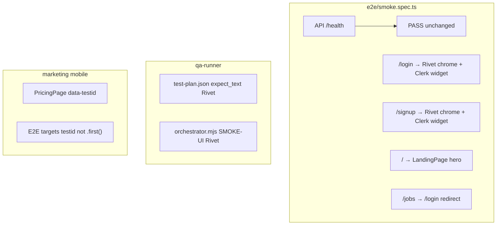

# fix: QA harness rebrand + marketing tap-target regression

**Created:** 2026-06-25
**Depth:** Standard
**Status:** plan

## Summary

Restore green QA smoke and infrastructure stages after the Rivet/ServiceOS
rebrand by updating stale **Fieldly** assertions in Playwright and the
qa-runner, aligning the signed-out `/` routing test with `ProtectedRoute`
behavior, and fixing the marketing pricing-page glove-target E2E failure
(caused by the header CTA being matched before the pricing-card CTA).
Operator-only matrix/runbook execution is documented separately — no code
change unblocks secrets.

## Problem Frame

Post-rebrand QA runs report false failures: the deployed app correctly shows
**Rivet** chrome and a public **LandingPage** at `/`, but E2E smoke and
qa-runner still assert **Fieldly** and `/` → `/login`. Marketing mobile E2E
fails because `getByRole('link', { name: /start free trial/i }).first()` on
`/pricing` resolves the header's `size="sm"` button (`h-8` = 32px) instead of
the pricing card's `size="lg"` button (`h-12` = 48px). CI and operators cannot
trust harness results until these are corrected.

## Requirements

- R1. `npm run e2e:smoke` passes against Railway dev (`E2E_BASE_URL` set) —
  4/4 including API health, login, signup, and auth-routing behavior.
- R2. `npm run qa:run -- --stage infrastructure` passes UI checks when API is
  healthy (all `expect_text` matches deployed login chrome).
- R3. `e2e/marketing-mobile.spec.ts` passes at 320px — pricing primary CTA
  measures ≥44px tall.
- R4. Documentation (`e2e/README.md`) describes current auth routing and
  branding, not Fieldly.
- R5. Journey spec branding is updated so unskipping does not immediately fail
  on stale assertions.
- R6. Operator runbook for full matrix execution is discoverable from the plan
  (secrets checklist; no fake green without credentials).

## Key Technical Decisions

- **Assert app-owned chrome, not Clerk dashboard copy** — Login/signup pages
  render **Rivet** in header/footer (`LoginPage.tsx`, `SignupPage.tsx`).
  Clerk's widget title ("Sign in to ServiceOS") is configured in the Clerk
  dashboard and can change without a deploy. Smoke tests pin **Rivet** +
  role-based Clerk presence (`heading` / `button`), not "Fieldly" or a hard-coded
  "ServiceOS" string. (Alternative: assert only Clerk roles — rejected because
  our chrome is the rebrand signal we control.)

- **Split the `/` redirect smoke test** — Do not revert `ProtectedRoute` to
  force `/` → `/login`. Test two behaviors: (a) signed-out `/` stays on `/` and
  shows landing hero copy; (b) signed-out `/jobs` redirects to `/login`.
  (Alternative: restore redirect — rejected; breaks marketing funnel.)

- **Pricing CTA E2E: scope, don't globally upsize header buttons** — Root cause
  is `.first()` matching `MarketingHeader`'s `size="sm"` link (32px) before
  `PricingPage`'s `size="lg"` card CTA (48px). Add
  `data-testid="pricing-primary-cta"` on the pricing-card link and target it in
  E2E. (Alternative: bump all header CTAs to `min-h-11` — valid a11y follow-up
  but out of scope for a test scoped to the pricing card; deferred.)

- **qa-runner `expect_text: "Rivet"`** — `runUiCheck` does case-insensitive
  HTML substring match (`qa-runner/src/tools.mjs`). "Rivet" appears in login
  page header HTML. Bulk-replace all 65 `Fieldly` entries in
  `test-plan.json` plus the hardcoded smoke default in `orchestrator.mjs`.

- **Optional `data-testid` on auth chrome** — Add `data-testid="auth-chrome-logo"`
  on login/signup header spans if implementer wants rebrand-proof selectors;
  not required for R1 if Rivet text assertions suffice.

## Scope Boundaries

**In scope:** QA-001, QA-002, QA-006; `e2e/smoke.spec.ts`; `e2e/README.md`;
`qa-runner/config/test-plan.json`; `qa-runner/src/orchestrator.mjs`;
`e2e/journeys/signup-to-first-estimate.spec.ts`; `e2e/marketing-mobile.spec.ts`;
`packages/web/src/components/marketing/PricingPage.tsx`;
`packages/web/src/components/marketing/MarketingPages.layout.test.tsx` (pricing
card contract only).

**Non-goals:** Portal palette migration (QA-003), EstimateApprovalPage Fieldly
hardcode (QA-004), U13 design-doc reconciliation (QA-005), contract-test comment
hygiene (QA-007), provisioning Railway secrets (QA-008), Stripe CLI install,
full `qa:runbook` execution in CI.

### Deferred to follow-up work

- QA-003/004/005/007 — customer-cluster palette + branding cleanup (separate plan).
- MarketingHeader mobile glove targets (`size="sm"` header CTAs remain 32px).
- `data-testid` on auth pages if product wants rebrand-proof E2E long-term.
- CI wiring for `E2E_DB_URL_*` / `E2E_CLERK_HMAC_SECRET` repository secrets.

## Repository invariants touched

None of the canonical data/AI invariants apply — this is test-harness and
presentational marketing markup only. No money, RLS, audit events, LLM gateway,
proposals, or catalog resolver changes.

## High-Level Technical Design

## Implementation Units

### U1. E2E smoke — rebrand assertions + auth routing split

- **Goal:** R1, R2 (Playwright side), R4 — all four smoke tests pass.
- **Requirements:** R1, R4
- **Dependencies:** none
- **Files:**
  - `e2e/smoke.spec.ts` (modify)
  - `e2e/README.md` (modify — smoke section bullets)
- **Approach:**
  - **Login test:** Replace `Fieldly` with `Rivet` (exact header text). Replace
    `© 2026 Fieldly` with `/© 2026 Rivet/`. Add
    `getByRole('heading', { name: /sign in/i })` to prove Clerk mounted.
    Keep `consoleErrors` guard.
  - **Signup test:** Same Rivet header/footer assertions; add
    `getByRole('heading', { name: /sign up|create/i })`.
  - **Routing:** Rename/replace "protected route redirects to login" with two
    tests:
    1. `signed-out root shows the public landing page` — `goto('/')`,
       `toHaveURL('/')`, assert `getByRole('heading', { name: /your ai dispatcher/i })`.
    2. `signed-out app route redirects to login` — `goto('/jobs')`,
       `toHaveURL(/\/login/)`.
  - Update `e2e/README.md` smoke bullets to match (Rivet branding; `/` = landing;
    `/jobs` = login bounce).
- **Patterns to follow:** `e2e/estimate-approval-mobile.spec.ts` (Clerk gate via
  `E2E_BASE_URL`); `packages/web/src/components/auth/ProtectedRoute.tsx` (lines
  26–29 routing contract); `LoginPage.tsx` / `SignupPage.tsx` (Rivet chrome).
- **Test scenarios:**
  - Happy path: deployed dev — 4/4 smoke green with `E2E_BASE_URL` +
    `E2E_API_URL` set.
  - Edge: local run without `VITE_CLERK_PUBLISHABLE_KEY` — UI block still
    skips per existing gate (unchanged).
  - Error: page JS error on `/login` — `consoleErrors` array non-empty (login
    test only).
- **Verification:** `E2E_BASE_URL=https://serviceosweb-development.up.railway.app E2E_API_URL=https://serviceosapi-development.up.railway.app npm run e2e:smoke` → 4 passed.

### U2. QA runner — replace Fieldly UI expectations

- **Goal:** R2 — infrastructure stage UI checks pass when API healthy.
- **Requirements:** R2
- **Dependencies:** U1 (same expected string "Rivet"; can land in same PR)
- **Files:**
  - `qa-runner/config/test-plan.json` (modify — replace all `"expect_text": "Fieldly"` → `"Rivet"`)
  - `qa-runner/src/orchestrator.mjs` (modify — `SMOKE-UI` check line ~157)
- **Approach:** Mechanical replace. `runUiCheck` matches substring in page HTML;
  login page header contains "Rivet". Do not change `path: "/login"` — still the
  probe surface. API checks unchanged.
- **Patterns to follow:** existing `expect_text` usage in `test-plan.json`;
  `qa-runner/src/tools.mjs` `runUiCheck` substring logic.
- **Test scenarios:**
  - Happy path: `BASE_URL=… API_URL=… npm run qa:run -- --stage infrastructure`
    → 6/6 pass (UI pass; DB may remain `blocked` without `DB_CHECK_COMMAND` —
    acceptable).
  - Edge: HTML fallback path when Playwright unavailable still finds "Rivet" in
    static HTML.
- **Verification:** infrastructure stage report shows `ui_status: pass` for
  INFRA-001..006; `npm run qa:report` summary shows infrastructure passes.

### U3. Journey spec — signup branding assertion

- **Goal:** R5 — journey does not fail on branding when Clerk creds are provided.
- **Requirements:** R5
- **Dependencies:** U1 (same assertion pattern)
- **Files:**
  - `e2e/journeys/signup-to-first-estimate.spec.ts` (modify line ~46)
- **Approach:** Replace `getByText('Fieldly')` with Rivet header assertion matching
  U1. Journey remains `test.skip` without Clerk creds — only the assertion
  string changes.
- **Patterns to follow:** U1 login/signup assertions.
- **Test scenarios:**
  - Happy path: with Clerk testing creds, signup page step finds Rivet before
    form fill.
  - Edge: skip path unchanged when `hasClerkTestingCreds()` false.
- **Verification:** Grep `e2e/` for `Fieldly` returns zero matches in canonical
  `e2e/` tree (exclude `figma-export/`).

### U4. Marketing pricing CTA — glove target E2E fix

- **Goal:** R3 — marketing mobile 13/13 at 320px.
- **Requirements:** R3
- **Dependencies:** none (independent of U1–U3)
- **Files:**
  - `packages/web/src/components/marketing/PricingPage.tsx` (modify — add
    `data-testid="pricing-primary-cta"` on the `/signup` Link wrapping the card
    Button)
  - `e2e/marketing-mobile.spec.ts` (modify — target `getByTestId('pricing-primary-cta')` instead of `.first()` on role link)
  - `packages/web/src/components/marketing/MarketingPages.layout.test.tsx` (modify — add test that pricing card CTA link carries the testid and wraps a `h-12` button)
- **Approach:** The pricing card already uses `<Button size="lg">` (`h-12` = 48px ≥
  44px). Failure is locator ambiguity with header CTA (`size="sm"` = `h-8` =
  32px). Pin the test to the card CTA via testid; extend jsdom contract so
  regression is caught without Playwright.
- **Patterns to follow:** `MarketingPages.layout.test.tsx` existing
  `MarketingCTA` `h-12` contract; `docs/solutions/conventions/preserve-aria-label-through-kit-form-migration.md` (`min-h-11` / 44px rule); `e2e/estimate-approval-mobile.spec.ts` bounding-box assertions.
- **Test scenarios:**
  - Happy path: 320px Playwright — `pricing-primary-cta` bounding box height ≥ 44.
  - Edge: `/pricing` overflow tests unchanged (still use `.first()` on role link
    for visibility — acceptable for overflow-only checks).
  - jsdom: render `PricingPage` in `MemoryRouter`, assert testid present and
    inner button has `h-12`.
- **Verification:** `E2E_BASE_URL=… npx playwright test e2e/marketing-mobile.spec.ts` → 13 passed; `cd packages/web && npx vitest run src/components/marketing/MarketingPages.layout.test.tsx` → green.

### U5. Operator runbook — matrix secrets checklist (docs only)

- **Goal:** R6 — implementers/operators know exactly what unblocks QA-008.
- **Requirements:** R6
- **Dependencies:** none
- **Files:**
  - `e2e/README.md` (modify — add "Full matrix / runbook" section pointing to
    `scripts/qa-runbook-run.sh` header comments)
- **Approach:** Document required env vars:
  `E2E_DB_URL_READWRITE`, `E2E_DB_URL_READONLY`, `E2E_CLERK_HMAC_SECRET`;
  Railway flag `CLERK_DEV_HMAC_TOKENS=true` on API; command
  `npm run qa:runbook`. No code paths change — blocked status is correct without
  secrets.
- **Patterns to follow:** `scripts/qa-runbook-run.sh` header; `qa-runner/README.md`.
- **Test scenarios:**
  - Test expectation: none — documentation-only unit.
- **Verification:** README section lists all required vars and the single run
  command; operator can copy-paste from `scripts/qa-runbook-run.sh`.

## Risks & Dependencies

| Risk | Mitigation |
|------|------------|
| Clerk changes widget heading copy | Assert Rivet chrome + role regex, not exact Clerk strings |
| "Rivet" appears in marketing footer on login page only in header — substring match still unique enough | `expect_text: "Rivet"` sufficient for qa-runner |
| U1–U3 land before U2 | Same PR preferred; order U1 → U2 → U3 → U4 → U5 |
| Full matrix still blocked without secrets | Expected; U5 documents operator path |

## Open Questions

- Whether to add `data-testid="auth-chrome-logo"` on login/signup in this PR or a
  follow-up (deferred — Rivet text is sufficient for R1/R2).
- Whether MarketingHeader mobile CTAs should get `min-h-11` globally (deferred
  a11y improvement; header buttons are not the pricing-card contract).

## Sources & Research

- QA run findings (2026-06-25): smoke failures, marketing-mobile `.first()` root
  cause, `ProtectedRoute.tsx` lines 26–29.
- `packages/web/src/components/ui/button.tsx` — `sm: h-8`, `lg: h-12`.
- `docs/solutions/conventions/preserve-aria-label-through-kit-form-migration.md` —
  44px tap-target convention.
- `docs/solutions/architecture-patterns/brand-rebrand-via-semantic-token-swap.md` —
  jsdom + Playwright class-contract pairing pattern.
