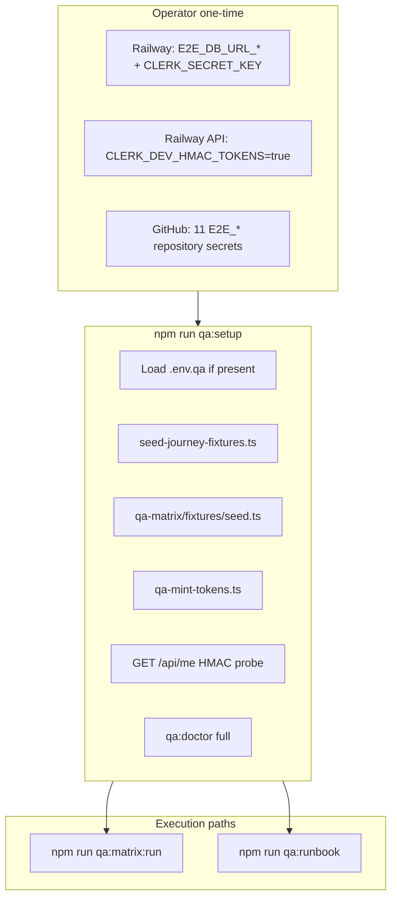

# feat: unblock full QA matrix and beta runbook execution

**Created:** 2026-06-25
**Depth:** Standard
**Status:** plan

## Summary

Unblock QA-008 by turning the existing matrix/runbook harnesses from
"documented but blocked" into a **repeatable operator bootstrap** with a
single entry point, an automated setup path that seeds tenants and verifies
HMAC auth, a GitHub Actions secrets manifest aligned to
`.github/workflows/qa-matrix-gate.yml`, and an optional CI workflow for the
full `npm run qa:runbook` chain. No matrix row logic changes — this is
secrets, Railway flags, Postgres roles, and orchestration only.

## Problem Frame

Operators and cloud agents hit `qa:doctor` with **9 FAIL** because
`E2E_DB_URL_*`, `E2E_CLERK_HMAC_SECRET`, and `E2E_TENANT_*` are unset.
Even with docs scattered across `qa/README.md`,
`qa/reports/2026-05-11/qa-matrix-live-runbook.md`, `e2e/README.md`, and
`.env.qa.example`, the bootstrap sequence is manual and error-prone:

1. Copy 3+ secrets from Railway
2. Set `CLERK_DEV_HMAC_TOKENS=true` on the API (not in repo — deploy config)
3. Seed tenants → paste 6 UUID exports
4. Confirm HMAC tokens work (`/api/me` 200) — failure mode is silent 401s
5. Choose **matrix-only** (`qa:matrix:run`) vs **full beta** (`qa:runbook`)

CI has `.github/workflows/qa-matrix-gate.yml` (nightly + `workflow_dispatch`)
but only runs when **11 GitHub secrets** are provisioned. The fuller
`qa:runbook` (journey seed + qa-runner §1–17 + matrix) has **no CI workflow**.

## Requirements

- R1. Operator can go from zero local env to `npm run qa:doctor` **all OK**
  in one documented flow (≤15 min dashboard work + one command).
- R2. Setup verifies **HMAC auth end-to-end** (`GET /api/me` → 200) before
  spending 5+ minutes on matrix/runbook execution.
- R3. Single canonical runbook at `docs/runbooks/qa-full-matrix-unblock.md`
  covers matrix path, full runbook path, Railway flags, Postgres roles, and
  links to existing deep docs (no duplication of 200-line appendices).
- R4. GitHub repository secrets checklist matches `qa-matrix-gate.yml` exactly;
  operator can verify nightly gate readiness without reading the workflow YAML.
- R5. `npm run qa:setup` (new) orchestrates: optional `.env.qa` load → seed →
  export tenant IDs → mint tokens → HMAC probe → doctor — failing fast with
  the fix from the runbook appendix.
- R6. Optional CI: `workflow_dispatch` job for `npm run qa:runbook` using the
  same secret names (documented; secrets still operator-provisioned).

## Key Technical Decisions

- **Two execution paths, one bootstrap** — Matrix (`qa:matrix:run` → Playwright
  QA matrix + gate) and Full beta (`qa:runbook` → journey seed +
  `qa:run:now` + matrix). Both need the same 3 Railway secrets + tenant UUIDs;
  full beta additionally uses `e2e/fixtures/seed-journey-fixtures.ts` and
  `scripts/qa-mint-tokens.ts` for qa-runner `AUTH_BEARER_TOKEN`. Bootstrap
  script seeds **both** fixture sets against the same `E2E_DB_URL_READWRITE`
  (idempotent prefixes `qa-matrix` / `qa-journey`) so either path works after
  one setup. (Alternative: only matrix seed — rejected; runbook ISO rows need
  journey fixture IDs like estimates/invoices.)

- **Doctor split: bootstrap vs full** — Today `scripts/qa-matrix-doctor.ts`
  requires all 11 vars including `E2E_TENANT_*` before seed can run, which
  blocks first-time operators. Add `npm run qa:doctor:bootstrap` checking only
  URLs + DB connectivity + HMAC secret presence; full `qa:doctor` remains the
  gate before matrix execution. (Alternative: remove tenant IDs from required
  list — rejected; matrix precheck.spec.ts hard-requires them.)

- **HMAC probe in setup, not only in runbook shell** — Reuse the curl pattern
  from `scripts/qa-runbook-run.sh` lines 94–107 inside `qa:setup`, surfacing
  `CLERK_DEV_HMAC_TOKENS` misconfiguration before matrix start. Mint via
  existing `scripts/qa-mint-tokens.ts`.

- **Secrets stay out of repo** — `.env.qa` remains gitignored; plan adds
  `docs/runbooks/qa-github-secrets.md` as the manifest, not committed values.
  `.env.qa.example` gets comments only (no live passwords).

- **CI: matrix gate first, runbook optional** — Nightly `qa-matrix-gate.yml`
  already exists; plan wires documentation + optional `qa-runbook.yml` for
  manual beta sign-off. Do not block PR CI on full runbook (90 min, secrets-heavy).

## Scope Boundaries

**In scope:** QA-008 operator bootstrap, secrets manifest, `qa:setup` script,
doctor bootstrap mode, HMAC auth probe, canonical runbook doc, `.env.qa.example`
clarity, optional `qa-runbook.yml` workflow, cross-links in `qa/README.md` and
`e2e/README.md`.

**Non-goals:** Changing matrix row assertions, provisioning Railway/Clerk
accounts for the operator, Stripe CLI in CI, fixing portal palette (QA-003),
re-running matrix to green (requires live secrets at execution time).

### Deferred to follow-up work

- Auto-sync GitHub secrets from Railway (no API integration).
- Ephemeral per-PR matrix against preview deploys.
- `qa_readonly` role creation as a migration (document SQL; role already exists on dev per `qa/backlog/ISO-01-rls-probe-role.md`).

## Repository invariants touched

None — no product data paths, AI gateway, RLS application code, or money
logic. Setup scripts only **read** Postgres via operator-provided URLs and
**call** public HTTP endpoints. Seed scripts already exist and are idempotent.

## High-Level Technical Design

## Implementation Units

### U1. Canonical operator runbook

- **Goal:** R3 — single doc answers "how do I unblock the full matrix?"
- **Requirements:** R3
- **Dependencies:** none
- **Files:**
  - `docs/runbooks/qa-full-matrix-unblock.md` (create)
  - `qa/README.md` (modify — link at top)
  - `e2e/README.md` (modify — replace duplicated matrix section with link)
- **Approach:** One page with:
  - **Prerequisites table** (Railway web/API URLs, RW+RO Postgres, Clerk secret,
    `CLERK_DEV_HMAC_TOKENS=true`, optional `qa_readonly` for ISO-01)
  - **Quick start:** `cp .env.qa.example .env.qa` → fill → `source .env.qa` →
    `npm run qa:setup` → `npm run qa:matrix:run` OR `npm run qa:runbook`
  - **Matrix vs full runbook** decision table (time, artifacts, when to use)
  - **Troubleshooting** — top 5 from live runbook appendix (HMAC 401, stale
    tenant IDs, RLS/qa_readonly, API 502, Stripe optional)
  - **Links** to `qa/reports/2026-05-11/qa-matrix-live-runbook.md` (deep dive),
    `qa-runner/README.md`, `clerk-testing-tokens-runbook.md`
- **Patterns to follow:** `qa/reports/2026-05-11/OPERATOR-CHECKLIST.md` tone;
  `scripts/qa-runbook-run.sh` header for secret sourcing paths.
- **Test scenarios:**
  - Test expectation: none — documentation-only.
- **Verification:** Doc contains all vars from `qa-matrix-doctor.ts`
  `REQUIRED_VARS`, Railway flag `CLERK_DEV_HMAC_TOKENS`, and both npm commands.

### U2. GitHub Actions secrets manifest

- **Goal:** R4 — operator can wire CI without reading workflow YAML.
- **Requirements:** R4
- **Dependencies:** U1 (linked from canonical runbook)
- **Files:**
  - `docs/runbooks/qa-github-secrets.md` (create)
  - `.github/workflows/qa-matrix-gate.yml` (modify — comment block listing secrets + link to manifest)
- **Approach:** Table mapping each `secrets.*` in `qa-matrix-gate.yml` to
  Railway source, whether it's static (tenant UUIDs from seed output) or
  rotated (CLERK_SECRET_KEY), and verification command. Note: tenant UUID
  secrets can be copied once from `seed.ts` output OR re-seeded and updated.
  Document `workflow_dispatch` trigger for manual nightly rerun.
- **Patterns to follow:** `e2e.yml` Clerk secrets block comments;
  `.env.qa.example` var names.
- **Test scenarios:**
  - Test expectation: none — documentation-only.
- **Verification:** Every secret referenced in `qa-matrix-gate.yml` appears in
  the manifest with source-of-truth instructions.

### U3. Bootstrap script (`qa:setup`)

- **Goal:** R1, R2, R5 — one command from filled `.env.qa` to ready state.
- **Requirements:** R1, R2, R5
- **Dependencies:** U4 (doctor bootstrap mode helps mid-setup)
- **Files:**
  - `scripts/qa-setup.sh` (create)
  - `package.json` (modify — add `"qa:setup": "bash scripts/qa-setup.sh"`)
  - `.env.qa.example` (modify — point to `npm run qa:setup`)
- **Approach:**
  1. `set -euo pipefail`; source `.env.qa` if present (with warning if missing).
  2. Require `E2E_DB_URL_READWRITE`, `E2E_CLERK_HMAC_SECRET`, `E2E_BASE_URL`,
     `E2E_API_URL`; default RO from RW if unset.
  3. Export `DATABASE_URL=$E2E_DB_URL_READWRITE`.
  4. Run `npx tsx e2e/fixtures/seed-journey-fixtures.ts` → source
     `.journey-fixtures.env`.
  5. Run `npx tsx e2e/qa-matrix/fixtures/seed.ts` → eval printed exports
     (matrix tenant IDs; may differ from journey IDs — both exported).
  6. `eval "$(npx tsx scripts/qa-mint-tokens.ts)"`.
  7. HMAC probe: `curl -sf -H "Authorization: Bearer $AUTH_BEARER_TOKEN"
     $E2E_API_URL/api/me"` or exit 1 with `CLERK_DEV_HMAC_TOKENS` hint.
  8. Run `npm run qa:doctor`.
  9. Print next-step commands (`qa:matrix:run` / `qa:runbook`).
- **Patterns to follow:** `scripts/qa-runbook-run.sh` sections 1–2;
  `scripts/qa-matrix-run.sh` seed step.
- **Test scenarios:**
  - Happy path: with valid `.env.qa`, exits 0 and prints "Ready for".
  - Missing `E2E_DB_URL_READWRITE`: exit 1 before any DB touch.
  - HMAC probe 401: exit 1 with ordered causes (flag, secret drift, NODE_ENV).
  - Idempotent re-run: second invocation exits 0 (seeds no-op).
- **Verification:** `source .env.qa && npm run qa:setup` → doctor all OK on a
  workstation with Railway secrets (manual operator verification).

### U4. Doctor bootstrap mode + HMAC secret probe

- **Goal:** R1 — doctor usable before tenant UUIDs exist; R2 partial in doctor.
- **Requirements:** R1, R2
- **Dependencies:** none (parallel with U3)
- **Files:**
  - `scripts/qa-matrix-doctor.ts` (modify)
  - `package.json` (modify — `"qa:doctor:bootstrap": "tsx scripts/qa-matrix-doctor.ts --bootstrap"`)
  - `scripts/qa-matrix-doctor.test.ts` (create — unit tests for arg parsing + required-var sets)
- **Approach:**
  - Add `--bootstrap` flag: required set = `E2E_BASE_URL`, `E2E_API_URL`,
    `E2E_DB_URL_READWRITE`, `E2E_DB_URL_READONLY`, `E2E_CLERK_HMAC_SECRET`
    only; tenant UUID vars reported as `[skip] not set (run qa:setup first)`.
  - Full mode (default): unchanged 11-var gate.
  - Optional enhancement: when `E2E_TENANT_A_ID` + secret present, mint a
    token inline and probe `/api/me` (same as setup script); report
    `[FAIL] HMAC auth probe` with `CLERK_DEV_HMAC_TOKENS` hint on 401.
- **Patterns to follow:** existing `checkEnvVar` / probe functions in doctor;
  `scripts/qa-runbook-run.sh` warning block.
- **Test scenarios:**
  - Happy path: `--bootstrap` with 5 vars set → exit 0.
  - Full mode missing `E2E_TENANT_A_ID` → exit 1.
  - HMAC probe 401 → exit 1 with message containing `CLERK_DEV_HMAC_TOKENS`.
- **Verification:** `npm run qa:doctor:bootstrap` passes with only URL/DB/HMAC
  vars; full doctor passes after `qa:setup`.

### U5. Optional CI workflow for full runbook

- **Goal:** R6 — manual beta sign-off in GitHub Actions.
- **Requirements:** R6
- **Dependencies:** U2 (secrets manifest)
- **Files:**
  - `.github/workflows/qa-runbook.yml` (create)
  - `docs/runbooks/qa-github-secrets.md` (modify — note runbook-only secrets if any)
- **Approach:** Mirror `qa-matrix-gate.yml` structure:
  - `on: workflow_dispatch` only (not on every PR).
  - `timeout-minutes: 120`.
  - Steps: checkout → npm ci → playwright chromium → inject all E2E_* secrets →
    `npm run qa:runbook`.
  - Upload `qa-runner/reports/`, `qa/reports/`, `playwright-report/`.
  - Do **not** add as required PR check.
- **Patterns to follow:** `.github/workflows/qa-matrix-gate.yml`.
- **Test scenarios:**
  - Test expectation: none in unit tests — workflow validated by manual
    `workflow_dispatch` after secrets land.
- **Verification:** Workflow file parses; secret names are a superset of matrix
  gate secrets; README/manifest documents trigger instructions.

## Risks & Dependencies

| Risk | Mitigation |
|------|------------|
| Journey seed + matrix seed produce different tenant UUIDs | Document which IDs each harness uses; setup exports both; qa-mint-tokens uses `E2E_TENANT_A_ID` from journey env file |
| `CLERK_DEV_HMAC_TOKENS` not set on Railway | HMAC probe fails loudly in `qa:setup` and doctor |
| `qa_readonly` missing on new DB clone | Runbook links to ISO-01 story SQL; ISO-01 may partial until role exists |
| Cloud agents cannot reach Railway | Document that setup/run requires operator workstation; CI uses secrets |
| Stripe CLI absent | Remains TODO in smoke-tools; INV-05 rows optional |

## Open Questions

- Whether `qa:setup` should write a generated `.env.qa.local` with seeded UUIDs
  (gitignored) to avoid re-seeding — defer to implementation; manual paste works.
- Whether nightly matrix gate should post Slack summary on failure — out of scope.

## Sources & Research

- `scripts/qa-runbook-run.sh`, `scripts/qa-matrix-run.sh`, `scripts/qa-matrix-doctor.ts`
- `.github/workflows/qa-matrix-gate.yml` — existing CI wiring
- `qa/README.md`, `qa/reports/2026-05-11/qa-matrix-live-runbook.md`, `.env.qa.example`
- `packages/api/src/auth/clerk.ts` — `CLERK_DEV_HMAC_TOKENS` gate (line 347)
- `qa/backlog/ISO-01-rls-probe-role.md` — `qa_readonly` role requirement
- Prior QA session: doctor 2 OK / 9 FAIL without secrets (QA-008)
