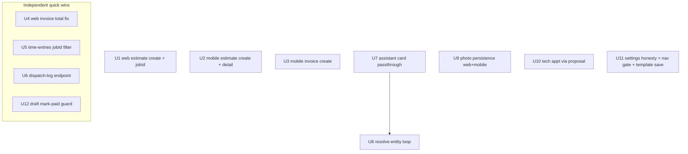

# fix: Critical & High workflow bugs (E1–E15) across web, mobile, API

**Created:** 2026-06-27
**Depth:** Deep
**Status:** plan

## Summary
Fixes the 15 confirmed Critical/High workflow bugs from
`docs/audits/user-workflow-audit-2026-06.md` — broken estimate/invoice
creation, wrong invoice totals, dead-end navigation, unpersisted photos, the
entity-disambiguation dead-end, hidden AI pricing warnings, technician
permission failures, mock "saves" that lose data, and a wrong time-entries
query. The work spans `packages/web`, `packages/mobile`, and `packages/api`,
sequenced so shared contract/permission seams land before the clients that
depend on them. No new product surface — every fix wires existing, mostly
already-built backends to the UI correctly and honestly.

## Problem Frame
Operators and field techs hit silent failures on the most common jobs: the web
"New Estimate" flow shows success but persists nothing; mobile estimate/invoice
creation always 400s; the web invoice detail shows the wrong amount due;
captured photos vanish; "which Bob?" disambiguation discards the command; the
assistant lets a user approve a proposal into a server rejection; a technician
can't edit their own appointment or open Settings; and a template editor claims
edits went live when no API call was made. These were traced end-to-end
(UI → API → handler) and each was re-verified against the cited code.

## Requirements
- R1. Web "New Estimate" persists a real estimate via the API and shows the real share link (E1).
- R2. Mobile estimate creation succeeds against `createEstimateSchema` (E2).
- R3. Mobile invoice creation succeeds against `createInvoiceSchema` (E3).
- R4. Web invoice detail shows the true amount due/paid from server totals, no float-on-money (E4).
- R5. Tapping a mobile estimate opens a real detail/editor, not a dead route or a blank form (E5).
- R6. Field photos persist to the backend on mobile (E6) and web (E7) and are visible across sessions/users.
- R7. The dispatch log shows real outbound message dispatches (E8).
- R8. Picking an entity candidate ("which Bob?") resolves the original intent instead of discarding it, on both web and mobile (E9).
- R9. The assistant chat card surfaces AI-estimated/ambiguous/missing-field warnings and blocks Approve when a line is unresolved (E10).
- R10. A technician can update their own appointment time / send "running late" without a 403, within the role invariants (E11).
- R11. Technicians don't see a Settings entry they can't use; settings load errors are surfaced, not swallowed (E12).
- R12. The template editor either persists via the real API or is removed — no false "edits are live" (E13).
- R13. "Mark as paid" is only offered when the invoice can actually accept a payment (E14).
- R14. The JobDetail time panel shows this job's entries, not the user's entries across all jobs (E15).

## Key Technical Decisions
- **Require a `jobId` client-side for estimate/invoice creation** (resolves the E1/E2/E3 fork) — keep `createEstimateSchema`/`createInvoiceSchema` strict and add job selection (or "create a job for this customer") to the three create flows. *Rationale:* the money/job graph (job-money-state, from-estimate credit, profit reporting) all hang off `jobId`; relaxing the contract to accept a bare `customerId` would orphan money entities from the job graph and ripple into billing reports (D-006). Alternative (add `customerId`, derive a job server-side) rejected as a deeper data-model change with billing ripple.
- **Route technician appointment edits through a `reschedule_appointment` proposal** (resolves the E11 fork) — mirror the dispatch board rather than granting `appointments:update`. *Rationale:* preserves the rbac invariant that techs get no broad write/billing surfaces, and reuses the existing human-approval-gated path (techs already have proposal access). Alternative (broad `appointments:update` grant) rejected as invariant-violating; a narrow scoped permission was the fallback if proposal routing proved too heavy.
- **E10 is an API-only seam.** `AIProposalCard` already renders `meta.markers`, `meta.severity`, `lineItems[].pricingSource`, and `missingFields`; the bug is the assistant route's schema + `proposalToUI`/`customerProposalToUI` mappers dropping them. Fix = widen the schema (new fields `.optional()`/`.nullish()`) and populate from `proposal.payload`/`sourceContext`. *Rationale:* smallest correct seam; avoids touching the card. New fields must be optional to not regress the QA-2026-06-05 null-coercion/status-preprocess envelope handling.
- **E9 clones `resolve-line.ts`.** A new `resolve-entity` service + route re-drafts from the transcript/intent already stored in `sourceContext`, caps at `ready_for_review` (never auto-approves, D-004), catalog-grounds any re-priced line, and emits an audit event. *Rationale:* exact existing template; preserves the approval gate.
- **Status/permission affordances are aligned to the backend, not loosened.** E14 hides the action when status ∉ {open, partially_paid} (don't relax `PAYABLE_STATUSES`); E12 hides the nav entry for techs (don't grant `settings:view`). *Rationale:* the backend invariants are correct; the bugs are UI affordances that lie about them.
- **Mobile photos use the established presign→PUT→confirm pattern** from `uploadAndTranscribe.ts` with the Expo camera (no new `expo-image-picker` dependency). *Rationale:* matches an in-repo precedent and avoids a new dependency.

## Scope Boundaries
**In scope:** the 15 Critical/High bugs E1–E15, with unit tests in the same
commit and Docker-gated integration tests for DB-touching backend changes.

**Non-goals (explicitly out):** the Medium/parity findings E16–E30 from the
audit (digest duplication, web comms polling, mobile suggest-reply, agreements
UI, CSV money parsing, etc.); any new product capability; redesigns. The job
graph / estimates-without-a-job data model is explicitly not changed.

### Deferred to follow-up work
- E16/E17 voice "nothing to draft" sub-status surfacing (related to E9/E10 but a separate seam).
- E26 `?customerId=` pre-fill on the estimate form (UX nicety; the job-selection step from U1/U2 partially addresses the underlying handoff).
- The "silent empty-catch" sweep beyond `SettingsPage` (U11 fixes the one in scope; a broader audit of empty catches is a separate task).
- Orphaned-photo reaper and DB-transaction wrapping for payment/deposit writes (suspected items from the audit).

## Repository invariants touched
- **Integer cents / no float-on-money** — U4 replaces a `qty*rate/100` recompute with server `*Cents`; U1–U3 must send/echo `*Cents` fields only. Note the D-006 field split: **estimates use `unitPrice` (cents), invoices use `unitPriceCents`** (`docs/solutions/conventions/line-item-price-field-estimate-vs-invoice.md`) — U1–U3, U7, U8 must respect it.
- **Audit events on every mutation** — U1 (estimate create via existing route), U8 (`proposal.entity_resolved`), U9 (photo attach, via existing route), U10 (appointment proposal) emit audit events matching `createAuditEvent`.
- **Human-approval gate (D-004)** — U7 ensures approval is informed (warnings reach the card); U8 caps re-drafts at `ready_for_review`; U10 routes through a proposal, never a direct mutation.
- **Catalog grounding** — U8 re-drafts/re-prices only from tenant catalog candidates, never an invented price; uncatalogued lines keep their confidence cap.
- **RLS / tenant_id** — every backend change (U5, U6, U8) scopes by `tenantId` and reuses the existing `requireTenant`/repo patterns.
- **No broad tech write/billing surfaces (rbac invariant)** — U10 and U11 honor it (proposal routing; hide nav rather than grant permissions).

## High-Level Technical Design

Dependency / sequencing graph (land forks-resolved seams first, then clients):

Most units are independent; the only hard ordering is **U7 before U8** (the
re-drafted card must surface residual warnings). U1–U3 share the "require a
job" decision but touch different files and can land in parallel once that
decision is fixed (it is).

## Implementation Units

### U1. Web "New Estimate" — wire to the real API with job selection (E1)
- **Goal:** Replace the `setTimeout` mocks in `NewEstimateFlow` with real estimate create + send, threading a selected/created `jobId`, and fix the fake preview link.
- **Requirements:** R1
- **Dependencies:** none (jobId decision fixed)
- **Files:**
  - `packages/web/src/components/estimates/NewEstimateFlow.tsx` (modify `handleSend`/`saveAsDraft` ~1112–1118; fix `rivet.ai/e/...` preview ~1109–1110; add a job-select / "create job for this customer" step)
  - `packages/web/src/components/estimates/__tests__/NewEstimateFlow.test.tsx` (create)
- **Approach:** Mirror the working path in `packages/web/src/pages/estimates/EstimateCreate.tsx` → `EstimateForm.tsx` (POST `/api/estimates` with `{ jobId, lineItems(unitPriceCents), discountCents?, taxRateBps?, validUntil?, customerMessage?, internalNotes? }`, then `POST /api/estimates/:id/send` which returns `{ viewUrl, viewToken, ... }`). `apiFetch` is already imported in `NewEstimateFlow`. For "Save as draft," POST create only (no send). Use the returned `viewUrl` for the preview/share link instead of the hardcoded string. The component is rendered from `EstimatesPage.tsx:1566` with `onCreated`/`onClose`/`preSelectedCustomerId`; when a `preSelectedCustomerId` exists, fetch that customer's jobs to populate the picker (and offer create-a-job when none). Audit is emitted by the existing route — no new audit code.
- **Patterns to follow:** `EstimateForm.tsx:199–221` (body shape, `onCreated(id)`), send-result shape from `packages/api/src/notifications/send-service.ts:45–57`.
- **Test scenarios:**
  - Happy path: fill line items + select a job → "Send" → asserts one POST `/api/estimates` with the cents-based body and a follow-up POST `/api/estimates/:id/send`; preview shows the returned `viewUrl`.
  - Draft: "Save as draft" → POST create only, no send call.
  - Edge: no job selected → submit blocked with guidance; "create job for this customer" path produces a `jobId` before create.
  - Error path: create returns non-2xx → error surfaced, no success animation, `onCreated` not called.
- **Verification:** Creating from the customer sheet yields an estimate that appears in the list and (on Send) a real `/e/:token` link; no `rivet.ai/...` string remains.

### U2. Mobile estimate — create with `jobId` + add the detail screen (E2, E5)
- **Goal:** Make mobile estimate creation succeed, and give estimates a real detail/edit destination so rows don't dead-end.
- **Requirements:** R2, R5
- **Dependencies:** none
- **Files:**
  - `packages/mobile/src/api/estimates.ts` (add `jobId` to the create payload; map to `unitPriceCents`)
  - `packages/mobile/app/estimates/new.tsx` (add a job picker; drafts should be editable here)
  - `packages/mobile/app/estimates/[id].tsx` (create — detail/editor)
  - `packages/mobile/app/estimates.tsx` (route non-draft rows to `[id]`, drafts to the editor — fix `~39–48`)
  - `packages/mobile/src/api/estimates.test.ts` (extend)
  - `packages/mobile/src/screens/estimate-detail.test.ts` (create)
- **Approach:** Add a job-selection step using `packages/mobile/src/api/jobs.ts` (list jobs for the chosen customer; offer create-job when none, mirroring `customers/new` patterns). Send `{ jobId, lineItems:[{description, quantity, unitPriceCents, catalogItemId?}], discountCents?, taxRateBps?, customerMessage? }` to match `createEstimateSchema`; drop the unsupported `customerId`/`notes` keys. New `[id].tsx` mirrors `invoices/[id].tsx` (GET `/api/estimates/:id`, render `totals.totalCents` via the mobile money formatter). In `estimates.tsx`, route non-draft → `/estimates/[id]`, draft → the editor for that id (not blank `/estimates/new`).
- **Patterns to follow:** `packages/mobile/app/invoices/[id].tsx` (detail shape), `packages/mobile/src/api/invoices.ts` (already accepts optional `jobId`), `packages/mobile/src/screens/estimates.test.ts`.
- **Test scenarios:**
  - Happy path: select customer → select job → add line items → create → asserts POST body has `jobId` and `unitPriceCents`, no `customerId`.
  - Edge: customer with no jobs → create-job affordance yields a `jobId` before estimate create.
  - Navigation: tapping a sent estimate pushes `/estimates/[id]` (route resolves, renders); tapping a draft opens its editor, not a blank form.
  - Error: create 400/validation → `SavePhaseButton` error surfaced with the server message.
- **Verification:** A mobile estimate creates successfully end-to-end; every estimate row leads somewhere real.

### U3. Mobile invoice — create with `jobId` (E3)
- **Goal:** Make mobile invoice creation succeed against `createInvoiceSchema`.
- **Requirements:** R3
- **Dependencies:** none
- **Files:**
  - `packages/mobile/app/invoices/new.tsx` (add job selection; pass `jobId`)
  - `packages/mobile/src/api/invoices.ts` (ensure `jobId` is sent; it already accepts an optional `jobId`)
  - `packages/mobile/src/api/invoices.test.ts` (extend)
  - `packages/mobile/src/screens/invoices.test.ts` (extend if present; else create)
- **Approach:** Same job-selection step as U2. Send `{ jobId, lineItems(unitPriceCents), discountCents?, taxRateBps?, processingFeeBps?, customerMessage? }`; remove the bare-`customerId` path. Keep create→send sequencing as the screen already does (`createInvoice` then `sendInvoice`).
- **Patterns to follow:** `createInvoiceSchema` (`packages/api/src/shared/contracts.ts:222–230`); U2's job picker (share a component/hook if practical).
- **Test scenarios:**
  - Happy path: POST body includes `jobId` + `unitPriceCents`; create + send both fire.
  - Edge: no job for customer → create-job path supplies `jobId`.
  - Error: 400 surfaced via `SavePhaseButton`.
- **Verification:** A mobile invoice creates and sends successfully.

### U4. Web invoice detail — show true amount due/paid (E4)
- **Goal:** Replace the float line-item recompute with server totals so tax/discount/fee and partial payments are correct.
- **Requirements:** R4
- **Dependencies:** none
- **Files:**
  - `packages/web/src/components/invoices/InvoicesPage.tsx` (detail/header/`MarkPaidSheet` ~631, ~700, ~731, ~877, ~934)
  - `packages/web/src/components/invoices/InvoicesPage.test.tsx` (extend)
- **Approach:** Use `inv.totals.totalCents` for the invoice total and `inv.amountDueCents` for the outstanding balance (both already in `InvoiceResponse`), rendered via `centsToDisplay` (`packages/web/src/utils/statusNormalize.ts`). Add a separate "Paid" line for partially-paid invoices. Remove the `Σ(qty*rate)/100` computation and its float path; drop the `amountDueCents ?? Math.round(total*100)` fallback.
- **Patterns to follow:** the list view already does this correctly (`InvoicesPage.tsx:1482`, `centsToDisplay(inv.totals.totalCents)`); the test file's nested-`totals` fixture warning (`InvoicesPage.test.tsx:25–35`).
- **Test scenarios:**
  - Happy path: invoice with tax+discount → "Amount due" equals `totals.totalCents`, formatted `$#,###.##`.
  - Partial payment: `amountPaidCents>0` → "Amount due" equals `amountDueCents` (remaining), plus a "Paid" line; not the full subtotal.
  - Edge: zero tax/discount → unchanged display; no float artifacts (e.g., `$10.00` not `$9.999...`).
- **Verification:** A taxed, partially-paid invoice shows the correct remaining balance in the detail and the Mark-paid sheet.

### U5. time-entries — honor the `jobId` filter (E15)
- **Goal:** Make `GET /api/time-entries?jobId=` return that job's entries via the existing repo method.
- **Requirements:** R14
- **Dependencies:** none
- **Files:**
  - `packages/api/src/routes/time-entries.ts` (GET `/` ~151–212: when `req.query.jobId` present, branch to `repo.findByJob`)
  - `packages/api/test/integration/time-entries-by-job.test.ts` (create — Docker-gated)
  - `packages/api/test/time-entries/*.ts` route unit test (extend if present)
- **Approach:** Add a `jobId` branch ahead of the `userId`/`weekOf` rollup path: when `jobId` is supplied, call `repo.findByJob(tenantId, jobId)` (exists at `packages/api/src/time-tracking/time-entry.ts:92`, pg impl ~111) and return the list shape the client expects. Preserve the existing `canActOnBehalf` guard for the non-jobId path. No new permission.
- **Patterns to follow:** the `jobId` branch style in `estimates.ts`/`invoices.ts`; existing `time-entries.ts` response shaping.
- **Test scenarios:**
  - Integration (DB): two jobs with entries → `?jobId=A` returns only job A's entries (pins real columns, per the mocked-DB caveat in CLAUDE.md).
  - Happy path (unit): `jobId` present → `findByJob` called with `(tenantId, jobId)`.
  - Edge: no `jobId` → unchanged userId/weekOf behavior; tenant isolation holds (job from another tenant returns none).
- **Verification:** The JobDetail time panel (`JobDetail.tsx:985`) shows only this job's entries.

### U6. Dispatch log — real outbound-dispatch endpoint + client (E8)
- **Goal:** Back the dispatch log with actual `message_dispatches` data instead of an always-empty mismatch.
- **Requirements:** R7
- **Dependencies:** none
- **Files:**
  - `packages/api/src/routes/` (add a dispatch-log GET endpoint, e.g. `interactions.ts` `GET /dispatches` or a new `dispatch-log.ts`)
  - `packages/api/src/app.ts` (mount, if a new router)
  - `packages/web/src/components/interactions/DispatchLogPage.tsx` (point at the new endpoint; it already reads `data.dispatches`)
  - `packages/api/test/...dispatch-log route test` + `packages/web/src/components/interactions/DispatchLogPage.test.tsx` (create/extend)
- **Approach:** Add a paginated read that calls `dispatchRepo.listByTenant(tenantId, { limit, offset })` (`packages/api/src/notifications/dispatch-repository.ts:247–278`, returns `{ dispatches, total }`) and returns `{ dispatches, total, limit, offset }`. Gate with an appropriate non-`:view` permission per the owner-notifications learning (e.g. `interactions:view` if present, else the existing interactions gate). Point `DispatchLogPage` at it (the `data.dispatches` read then matches).
- **Patterns to follow:** `routes/interactions.ts:84–109` (pagination/response envelope), `dispatch-repository.ts` `listByTenant`.
- **Test scenarios:**
  - Happy path: tenant with dispatch rows → endpoint returns them; page renders rows (not the empty state).
  - Edge: empty tenant → `{ dispatches: [], total: 0 }`, page shows the empty state legitimately.
  - Isolation: another tenant's dispatches are excluded.
- **Verification:** The dispatch log shows sent estimate/invoice/reminder dispatches.

### U7. Assistant chat card — pass through pricing/confidence/missing-field signals (E10)
- **Goal:** Carry `_meta`/`pricingSource`/`markers`/`missingFields` into the assistant chat card so warnings render and Approve is blocked on unresolved lines.
- **Requirements:** R9
- **Dependencies:** none (prerequisite for U8)
- **Files:**
  - `packages/api/src/routes/assistant.ts` (`assistantProposalSchema` ~42–63; `proposalToUI` ~237–262; `customerProposalToUI` ~177–210)
  - `packages/api/test/...assistant route test` (extend)
  - `packages/web/src/components/shared/AIProposalCard.test.tsx` (extend to assert rendering from the new fields)
- **Approach:** Widen `assistantProposalSchema` with **optional/nullish** fields: `meta` (`overallConfidence`, `severity`, `markers[]`), `lineItems[].pricingSource`, and `missingFields[]`. Populate them in both mappers from `proposal.payload`/`sourceContext` (respect the estimates-`unitPrice` vs invoices-`unitPriceCents` split when reading line items). No `AIProposalCard` change — it already renders these (`~185–385`). Keep fields optional to avoid regressing the QA-2026-06-05 null-coercion/status-preprocess envelope.
- **Patterns to follow:** `AIProposalCard.tsx` expected `AIProposal` shape (meta/lineItems/missingFields); `resolve-line.ts` for where `pricingSource`/`missingFields` live on the payload.
- **Test scenarios:**
  - Happy path: a proposal with an uncatalogued line → mapper output includes `lineItems[].pricingSource:'uncatalogued'`; card test asserts the "AI-estimated" badge renders.
  - Missing fields: payload with `missingFields` → present in output; card disables Approve.
  - Regression: a normal complete proposal still maps with the legacy fields and does not collapse to the fallback envelope.
- **Verification:** An assistant-drafted invoice with an invented price shows the warning in chat and can't be approved blindly.

### U8. Entity disambiguation — resolve loop (web + mobile) (E9)
- **Goal:** Make picking an entity candidate re-draft the original intent instead of discarding it.
- **Requirements:** R8
- **Dependencies:** U7 (re-drafted card must surface residual warnings)
- **Files:**
  - `packages/api/src/proposals/resolve-entity.ts` (create — clone of `resolve-line.ts`)
  - `packages/api/src/routes/proposals.ts` (add `POST /:id/resolve-entity`, mirror `:268`)
  - `packages/api/test/proposals/resolve-entity.test.ts` (create — clone `resolve-line.test.ts`)
  - `packages/mobile/app/proposals/[id].tsx` (~101–104: replace `reject('entity_selected', id)` with a `resolveEntity` call)
  - `packages/mobile/src/hooks/useProposalReview.ts` (add `resolveEntity`)
  - `packages/web/src/components/inbox/InboxPage.tsx` + reuse `AmbiguityPicker.tsx` for `voice_clarification`/`entityCandidates`
  - `packages/mobile/src/hooks/useProposalReview.*.test.ts` (extend)
- **Approach:** New service validates the chosen `candidateId` against `sourceContext.entityCandidates`, re-drafts the original action from the stored `transcript`/classification in `sourceContext` (resolving the reference to the chosen entity id), stamps the result onto the payload/`targetEntityId`, clears the entity clarification from `sourceContext`, **caps at `ready_for_review`** (never auto-approve, D-004), and emits a `proposal.entity_resolved` audit event. Gate `proposals:approve`. Wire the mobile `ClarifyPicker` selection and the web `AmbiguityPicker` to the new endpoint; both merge the returned proposal into row state (as `resolveLine` already does). If the re-draft still has an ambiguous/uncatalogued line, U7 ensures the card shows it.
- **Patterns to follow:** `packages/api/src/proposals/resolve-line.ts` (validation, cap, audit, return shape), `routes/proposals.ts:268`, `InboxPage.tsx:381–404` (`resolveLine` merge), mobile `resolveLine` in `useProposalReview.ts`.
- **Test scenarios:**
  - Happy path (API): ambiguous-entity proposal + valid `candidateId` → payload re-drafted with the chosen entity, status `ready_for_review`, candidates cleared, `proposal.entity_resolved` audited.
  - Guard: `candidateId` not in candidate set → rejected (no mutation). Already-terminal proposal → rejected.
  - Invariant: re-draft never lands in `approved`/auto-executed.
  - Mobile: picking a candidate calls `resolveEntity` (not `reject`); the original intent is preserved.
  - Web: a `voice_clarification` card renders the picker and resolves through the endpoint.
- **Verification:** "Which Bob?" → tap a candidate → the original command proceeds as a reviewable proposal; no re-dictation, no discard.

### U9. Photo persistence — web + mobile (E6, E7)
- **Goal:** Persist captured photos to the existing backend on both platforms; make them visible across sessions/users.
- **Requirements:** R6
- **Dependencies:** none (backend complete)
- **Files:**
  - `packages/web/src/components/jobs/JobDetail.tsx` (~1486: persist instead of local state) and `TechJobView.tsx` (~801)
  - `packages/web/src/routes.ts` (add a `jobs/:id/photos` route to surface the orphaned `JobPhotos` page, or embed its uploader/gallery)
  - `packages/mobile/app/jobs/[id]/photos.tsx` (replace the stub with camera→presign→PUT→confirm)
  - `packages/web/src/components/jobs/__tests__/JobDetail.test.tsx` (extend) / `JobPhotoUploader.test.tsx` (exists)
  - `packages/mobile/src/screens/job-photos.test.ts` (create)
- **Approach:** Web — convert each `CapturedMedia` (data-URL) to a File/Blob and call the existing `uploadJobPhoto(jobId, file, category, ...)` (`packages/web/src/api/job-photos.ts:92`, which orchestrates presign→PUT→attach), then render via `JobPhotoGallery`; route/embed the built `JobPhotos` page so it's reachable. Mobile — capture via the Expo camera and run the presign→PUT→confirm flow mirroring `packages/mobile/src/voice/uploadAndTranscribe.ts:33–68` against `POST /api/jobs/:id/photos/presign-upload` then `POST /api/jobs/:id/photos`. Backend permissions (`jobs:update`/`jobs:view`) are already satisfied by techs. Audit is emitted by the existing attach route.
- **Patterns to follow:** `packages/web/src/api/job-photos.ts` (orchestrator), `packages/web/src/pages/jobs/JobPhotos.tsx` (lifecycle), `uploadAndTranscribe.ts` (mobile signed-upload precedent), `job-photos.test.ts` (backend behavior).
- **Test scenarios:**
  - Web happy path: capture → `uploadJobPhoto` called per photo with the right `jobId`/category; gallery shows persisted photos after a reload-equivalent refetch.
  - Mobile happy path: capture → presign → PUT to the signed URL → attach; list refetch shows the photo.
  - Error: presign or PUT fails → user sees an error, no phantom "saved" photo; partial failure doesn't leave the UI claiming success.
  - Edge: oversized/invalid type rejected (backend caps 10MB / image types) → surfaced.
- **Verification:** A photo taken on mobile or web is visible to another user/session on the same job.

### U10. Technician appointment edits via proposal + running-late hardening (E11)
- **Goal:** Let a tech update their own appointment time / send "running late" without a 403, through the approval-gated path, and stop the silent failure.
- **Requirements:** R10
- **Dependencies:** none
- **Files:**
  - `packages/web/src/pages/technician/TechnicianDayView.tsx` (~348 running-late, ~423 `saveAppointmentTimes`: submit a proposal instead of `PUT /api/appointments/:id`; add `.catch` on the running-late path)
  - `packages/web/src/pages/technician/TechnicianDayView.test.tsx` (extend)
- **Approach:** Replace the direct `PUT /api/appointments/:id` calls with `POST /api/proposals` using `proposalType:'reschedule_appointment'` and the existing payload/`If-Match`/idempotency conventions from the dispatch board. Techs already hold proposal access, so no rbac change. For the auto running-late notification, submit the proposal (or a lighter status signal if one exists) and **handle the result** — remove the fire-and-forget `void apiFetch` with no `.catch`, surfacing/logging failure instead of dropping it. Confirm the `reschedule_appointment` handler covers the time-edit and ETA cases; if "running late" needs a distinct signal, note it under Open Questions rather than inventing a type here.
- **Patterns to follow:** `packages/web/src/pages/dispatch/DispatchBoard.tsx:310–330, 532–545` (proposal submission, types, 409/422 handling), `SUPPORTED_TYPES` in `routes/proposals.ts:82–87`.
- **Test scenarios:**
  - Happy path: tech edits time → a `reschedule_appointment` proposal is POSTed (no direct PUT, no 403).
  - Error: proposal POST fails → surfaced to the tech; running-late failure is caught (not silently dropped).
  - Edge: 409 (appointment changed) → refetch/retry affordance as the board does.
  - Invariant: no path grants techs `appointments:update`.
- **Verification:** On the technician day view, "Edit time" and "running late" complete via a proposal without a 403, and failures are visible.

### U11. Settings honesty — nav gate, surfaced load errors, real template save (E12, E13)
- **Goal:** Stop showing techs a Settings entry they can't use, surface settings load failures, and make the template editor persist (or be removed) rather than lying.
- **Requirements:** R11, R12
- **Dependencies:** none
- **Files:**
  - `packages/web/src/components/layout/Shell.tsx` (~70: add `requires:'settings:view'` to the Settings nav item)
  - `packages/web/src/components/settings/SettingsPage.tsx` (~77 etc.: replace the silent empty `catch` with a surfaced error/retry, using `sonner` toasts already imported)
  - `packages/web/src/components/settings/TemplatesPage.tsx` (~454 mock `handleSave`: wire to the real `PUT /api/templates/:id` like `LiveTemplateDetailModal` ~786–803, or remove the mock modal + the false "edits go live" banner + the no-op "Reset to defaults")
  - `packages/web/src/components/layout/Shell.test.tsx` (extend), `SettingsPage.test.tsx` (extend), `TemplatesPage` test (extend/create)
- **Approach:** Use the existing `requires` nav-gating mechanism (`Shell.tsx:354–362` filters items whose `requires` permission the user lacks) — adding `requires:'settings:view'` hides Settings for techs without granting them the permission (honors the rbac invariant). In `SettingsPage`, the silent catch becomes a visible error state/toast with retry (mirror the toast usage already in the file and `OnboardingShell` error handling). For templates, prefer wiring the mock modal's save to the real `PUT /api/templates/:id` path that `LiveTemplatesSection` already uses; if the mock modal is redundant with `LiveTemplatesSection`, remove it (and the false banner / no-op button) per code-hygiene. Re-gate any owner-only template copy to the real permission (`estimates:update`) so dispatchers aren't wrongly blocked.
- **Patterns to follow:** `Shell.tsx` `NavItem.requires` + `visibleItems`; `LiveTemplateDetailModal.handleSave` (`TemplatesPage.tsx:786–803`); `sonner` toast usage in `SettingsPage`.
- **Test scenarios:**
  - Nav: a tech (no `settings:view`) does not see the Settings nav item; an owner does.
  - Load error: `/api/settings` fails → SettingsPage shows an error/retry, not a silent blank.
  - Template save: editing + save issues `PUT /api/templates/:id` and reflects the result (or, if removed, the false banner/no-op are gone).
  - Permission: a dispatcher (`estimates:update`) can edit template copy.
- **Verification:** Techs don't reach a blank Settings page; template edits actually persist (or the editor no longer claims they do).

### U12. Draft invoice — gate "Mark as paid" to payable statuses (E14)
- **Goal:** Only offer "Mark as paid" when the backend can accept a payment.
- **Requirements:** R13
- **Dependencies:** none
- **Files:**
  - `packages/web/src/components/invoices/InvoicesPage.tsx` (~902: render condition)
  - `packages/web/src/components/invoices/InvoicesPage.test.tsx` (extend)
- **Approach:** Change the button render condition from `status !== 'Paid'` to only when the normalized status maps to `open`/`partially_paid` (the backend `PAYABLE_STATUSES` in `packages/api/src/invoices/payment.ts:305`). Do **not** relax the reconciler. Optionally, for a Draft invoice, show an "Issue invoice" affordance instead — but only if an issue endpoint exists; the research found no `POST /api/invoices/:id/issue`, so if absent, simply hide Mark-as-paid for drafts and note the issue-action as a follow-up.
- **Patterns to follow:** `statusNormalize.ts` status mapping; `PAYABLE_STATUSES` invariant.
- **Test scenarios:**
  - Draft invoice → no "Mark as paid" button.
  - Open / partially-paid → button present.
  - Paid → button absent (unchanged).
- **Verification:** A draft invoice no longer offers an action that 400s.

## Risks & Dependencies
- **U7 must precede U8** — a re-drafted proposal can still carry ambiguous/uncatalogued lines; without the card passthrough, U8 would re-create the "approve into a 400" problem.
- **U7 schema widening** could regress the QA-2026-06-05 completion envelope if new fields aren't `.optional()`/`.nullish()` — covered by a regression test scenario.
- **U10** depends on the `reschedule_appointment` proposal handler covering the time-edit/ETA cases; if "running late" needs a distinct signal, that's an open question, not a new type to invent here.
- **U1–U3** all assume the "require a job" decision (fixed) and a usable job-selection affordance; the create-a-job fallback must produce a real `jobId` before create.

## Open Questions (deferred to implementation)
- Exact dispatch-log permission string (U6) — use `interactions:view` if it exists, else the current interactions gate; confirm against `rbac.ts` at implementation.
- Whether "running late" maps cleanly onto `reschedule_appointment` or needs a separate lightweight signal/proposal (U10).
- Whether the mock `TemplateDetailModal` is fully redundant with `LiveTemplatesSection` (remove) or covers a distinct template type that must be wired (U11).
- Final shape of the mobile job-selection component shared by U2/U3 (one hook/component vs per-screen).
- Whether to add an "Issue invoice" action for drafts (U12) or defer it (no issue endpoint found).

## Sources & Research
- `docs/audits/user-workflow-audit-2026-06.md` — the verified bug catalog (E1–E15).
- `docs/decisions.md` — D-003 (integer cents), D-004 (proposals-first, no auto-exec), D-006 (shared line-item schema), D-009 (Stripe links only after approval).
- `docs/solutions/conventions/line-item-price-field-estimate-vs-invoice.md` — estimates use `unitPrice`, invoices use `unitPriceCents`.
- `docs/solutions/architecture-patterns/owner-notifications-adding-a-push-type.md` — avoid `:view` permissions for sensitive gates; 4-layer producer pattern.
- Template to clone for U8: `packages/api/src/proposals/resolve-line.ts` + `packages/api/test/proposals/resolve-line.test.ts`.
