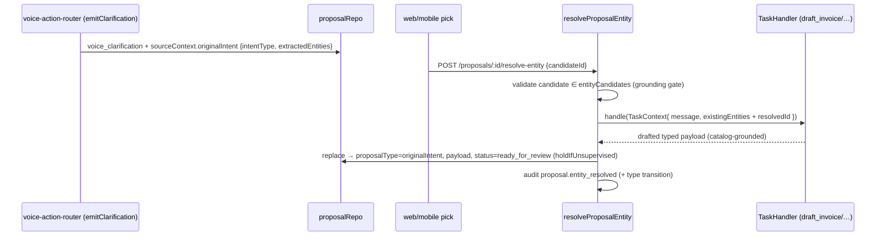

# fix: E9 execution gap + 3 code-review follow-ups

**Created:** 2026-06-27
**Depth:** Deep
**Status:** plan

## Summary
Closes the four follow-ups surfaced by the `/code-review` pass on the
Critical/High workflow fix-set: (1) the entity-disambiguation resolve loop
re-stamps the chosen id but leaves a non-executable `voice_clarification`
proposal, so approving it does nothing — the headline gap; plus (2) the job
photo gallery renders videos in a broken `` and never wires the
already-built delete affordance; (3) tapping a mobile draft estimate opens a
blank create form instead of the draft; (4) `GET /time-entries?jobId=` leaks
every user's hours to any tenant member. Unit 1 is architectural; 2–4 are
small, independent, single-file-family fixes.

## Problem Frame
The prior fix-set shipped E9 (entity disambiguation) only half-done: picking
"which Bob?" no longer discards the command, but the resolved proposal can't
execute, so the owner approves into a silent no-op (`HANDLER_NOT_FOUND` at
execute time). The other three are residual rough edges a user hits: broken
video tiles + no way to delete a wrong photo, a draft estimate that can't be
reopened, and a job time panel that exposes coworkers' hours to a technician.

## Requirements
- R1. Approving a resolved entity-disambiguation proposal executes the **original intent** (e.g. drafts/creates the invoice/customer), grounded and human-approved — never a no-op, never auto-executed (E9 / U8 gap).
- R2. The job photo gallery renders `video/*` attachments with a working `<video>` player, and the delete affordance is wired end-to-end (web; mobile parity).
- R3. Tapping a mobile draft estimate opens it hydrated for editing and saves via update (not a new estimate).
- R4. `GET /time-entries?jobId=` returns all users' entries to owners/dispatchers but only the caller's own entries to a technician; tenant scoping preserved.

## Key Technical Decisions
- **E9 fix = re-run the original task handler with the resolved id (no second LLM call).** At clarification time persist the original `classification.intentType` + `extractedEntities` into `sourceContext.originalIntent`; in `resolve-entity`, look up the `TaskHandler` for that intent, build a `TaskContext` with the resolved id injected into `existingEntities`, call `handler.handle()`, and **replace** the `voice_clarification` proposal with the freshly-drafted typed proposal capped at `ready_for_review`. *Rationale:* reuses the exact drafting path so catalog grounding, summary/explanation, and confidence/threshold logic stay identical; the producer already holds the full classification, so persistence is a tiny additive change. Alternatives rejected: re-routing through `voice-action-router.processSegment` re-runs the LLM classifier (cost, nondeterminism, could re-ambiguate, idempotency-key collisions) and still needs the same persistence change; leaving the proposal as `voice_clarification` and adding an executor for it would duplicate every task handler.
- **Photos: wire delete + safe video render only; do not enable video upload.** *Rationale:* the gallery already has the `onDelete` prop (its test expects it) and `deleteJobPhoto` exists — the only gap is the two call sites not passing the handler, plus ``-for-video. Enabling video *uploads* would need a backend mime-allowlist change, a raised 10MB cap, mobile video capture, and storage cost — a separate feature out of scope for a review follow-up. (User-confirmed.)
- **time-entries: technicians are post-filtered to their own entries on the job; owners/dispatchers see all.** *Rationale:* a tech on a job legitimately wants the job time panel, just not coworkers' hours; a small post-filter on the existing query preserves the panel's usefulness without a new permission. Reuses the existing role logic from `canActOnBehalf`. Alternative (office-only `time_entries:view`, 403 for techs) rejected per product call. (User-confirmed.)
- **Mobile draft estimate uses the existing PATCH/PUT `/estimates/:id` (estimates:update).** *Rationale:* the update endpoint already exists, so this is full hydrate-then-update, not view-only or prefill-recreate.

## Scope Boundaries
**In scope:** the four units below, each with tests in the same commit; a DB-touching read change (U4) gets an integration test.

**Non-goals:** enabling video capture/upload anywhere (backend mime/size, mobile video mode); the duplication cleanups noted in review (shared web/mobile create wizard, `resolveEntity`/`resolveLine` merge helper, `proposalSignals` extractor) — quality, not correctness; mobile video capture; reworking the proposal execution registry.

### Deferred to follow-up work
- Shared mapper/hook refactors for the web/mobile create wizards and the inbox resolve-merge (review cleanup findings).
- Full video support (capture → upload → 50–100MB cap → playback) as its own feature if desired.
- Hardening `voiceClarificationPayloadSchema` (non-passthrough) — U1 removes the offending state by transitioning the type, so this becomes moot, but a schema guard could be added later.

## Repository invariants touched
- **Human-approval gate (D-004)** — U1 must cap the re-drafted proposal at `ready_for_review` (reuse `holdIfUnsupervised`), never approve/execute during resolution.
- **Catalog grounding** — U1 re-draft goes through the grounded `TaskHandler` (`applyCatalogPricing`), never a hand-rolled payload; the candidate-grounding gate in `resolve-entity` stays.
- **Audit on mutation** — U1 keeps the `proposal.entity_resolved` audit and records the type transition; U2 delete and U4 read are already covered server-side (delete endpoint audits; U4 is a read).
- **Tenant/RLS** — U1 and U4 stay tenant-scoped; U4's whole bug is that tenant scope was the *only* guard.
- **Integer cents** — U3 hydration must round-trip `unitPriceCents`/`totalCents` without float conversion.
- **Zod-validated proposals** — U1's type transition must satisfy `assertValidProposalPayload` for the new proposal type.

## High-Level Technical Design

E9 re-draft flow (U1):

## Implementation Units

### U1. Executable re-draft on entity resolution (E9 / U8 gap)
- **Goal:** A resolved entity-disambiguation proposal becomes the original executable typed proposal carrying the resolved id, so approving it does the work.
- **Requirements:** R1
- **Dependencies:** none (lands first; highest risk)
- **Files:**
  - `packages/api/src/workers/voice-action-router.ts` — `emitClarification` (~867–909): on the `entityAmbiguity` path, persist `sourceContext.originalIntent = { intentType: classification.intentType, extractedEntities: <sanitized> }`.
  - `packages/api/src/proposals/resolve-entity.ts` — after the candidate-grounding gate, look up the handler for `sourceContext.originalIntent.intentType` (via `INTENT_TO_PROPOSAL_TYPE` + a handler factory), build a `TaskContext` (tenantId, userId, `message` = stored transcript, conversationId, `existingEntities` = original entities + resolved id), call `handle()`, then update the row to the drafted `proposalType` + payload, capped at `ready_for_review` (`holdIfUnsupervised`); keep the `proposal.entity_resolved` audit and record the type transition; run `assertValidProposalPayload` for the new type.
  - `packages/api/src/routes/proposals.ts` (~298–315) — thread the gateway/catalogRepo/handler-factory deps into `resolveProposalEntity` (today it takes only `proposalRepo` + `auditRepo`).
  - `packages/api/src/app.ts` — pass the new deps where the proposals router is constructed.
  - `packages/api/test/proposals/resolve-entity.test.ts` — extend (handler-level, mocked gateway/repos).
  - `packages/api/test/workers/voice-action-router.*.test.ts` — extend for the `originalIntent` persistence.
- **Approach:** Inject the handler set as a factory so `resolveProposalEntity` stays unit-testable with a mocked handler (don't import the whole router graph eagerly). Reconstruct the resolved id into `existingEntities` exactly as the router does on the non-ambiguous path (`annotation.resolved.customerId/jobId/...`). Preserve chain edges (`chainId`) if the clarification was a chain member, or explicitly drop them with a comment. The candidate-grounding check stays the gate; never move past `ready_for_review`.
- **Patterns to follow:** `voice-action-router.ts` non-ambiguous drafting (`buildHandlers`, `INTENT_TO_PROPOSAL_TYPE`, the `existingEntities` injection ~1196–1221); `holdIfUnsupervised`; the existing `resolve-line.ts` cap-and-audit shape; `TaskHandler`/`TaskContext` in `packages/api/src/ai/tasks/task-handlers.ts`.
- **Test scenarios:**
  - Happy path: ambiguous `draft_invoice` clarification + valid `candidateId` → resolved proposal has `proposalType === 'draft_invoice'` (not `voice_clarification`), carries the resolved `customerId`, status `ready_for_review`, catalog-grounded line items, `proposal.entity_resolved` audited.
  - Per-kind: `create_customer`/`create_job`/`create_appointment` original intents each re-draft to their typed proposal with the resolved id in the right field.
  - Invariant: re-drafted proposal is never `approved`/executed by resolution; an unsupervised tenant stays held.
  - Grounding: chosen `candidateId` not in `entityCandidates` → rejected, no re-draft.
  - Producer: `emitClarification` on the ambiguity path writes `sourceContext.originalIntent` with intentType + entities.
  - Regression: approving the re-drafted proposal routes to a real execution handler (no `HANDLER_NOT_FOUND`).
- **Verification:** "Which Bob?" → pick a candidate → approve → the invoice/customer/job is actually created; no `voice_clarification` ever reaches the executor.

### U2. Photo gallery — video rendering + wired delete
- **Goal:** Videos play instead of showing a broken tile, and users can delete a wrong photo/video.
- **Requirements:** R2
- **Dependencies:** none
- **Files:**
  - `packages/web/src/components/jobs/JobPhotoGallery.tsx` (~75–103): branch on `photo.contentType.startsWith('video/')` → render `<video controls>` (poster/play affordance) instead of ``.
  - `packages/web/src/components/jobs/JobDetail.tsx` (~1147) and `TechJobView.tsx` (~516): pass an `onDelete` handler that calls `deleteJobPhoto(jobId, photoId)` (from `packages/web/src/api/job-photos.ts`) behind a confirm, then removes from the local `photos` state (or refetches).
  - `packages/mobile/app/jobs/[id]/photos.tsx`: render `video/*` safely and add a delete affordance calling the mobile delete (add `deleteJobPhoto` to `packages/mobile/src/jobs/uploadJobPhoto.ts` or a sibling if absent) — parity, kept minimal.
  - `packages/web/src/components/jobs/__tests__/JobPhotoGallery.test.tsx` (extend — `onDelete` test already exists; add a video-render case), `JobDetail.test.tsx`/`TechJobView` delete-wiring test, `packages/mobile/src/screens/job-photos.test.ts` (delete).
- **Approach:** No backend or schema change — `JobPhoto.contentType` already exists. Confirm-before-delete; on success drop the row from each view's owned `photos` state. The DELETE endpoint already audits server-side.
- **Patterns to follow:** the gallery's existing `onDelete` render (~90–99) and its test (`job-photo-delete-<id>` testid); `JobPhotoUploader` DI mock pattern; `deleteJobPhoto` client.
- **Test scenarios:**
  - Video render: a `JobPhoto` with `contentType: 'video/webm'` renders a `<video>` (not ``).
  - Delete (web): clicking delete → confirm → `deleteJobPhoto(jobId, photoId)` called; photo removed from the gallery; error surfaced on failure (no phantom removal).
  - Image unchanged: `image/*` still renders ``.
  - Mobile: delete affordance calls the mobile delete and refetches.
- **Verification:** A captured video plays in the gallery; deleting a photo removes it for the user and persists (gone after refetch).

### U3. Mobile draft estimate hydration + update-on-save
- **Goal:** Tapping a draft estimate opens it populated and saves edits via update, not a new estimate.
- **Requirements:** R3
- **Dependencies:** none
- **Files:**
  - `packages/mobile/app/estimates/new.tsx` (~37): read an `id`/`estimateId` param; when present, `GET /api/estimates/:id`, hydrate `customerId` (resolve from `estimate.customer`/`jobId`), `jobId`, `lineItems` (`unitPriceCents`), `discountCents`, `taxRateBps`, `customerMessage`; on save call update instead of create.
  - `packages/mobile/app/estimates.tsx` (~39): ensure draft rows pass the id the form reads (today it passes `id`, form ignores it).
  - `packages/mobile/src/api/estimates.ts`: add `getEstimate(id)` if absent and `updateEstimate(id, input)` → `PATCH /api/estimates/:id` with `expectedVersion`.
  - `packages/mobile/src/screens/estimate-edit.test.ts` (create) + extend `estimate-create.test.ts`.
- **Approach:** Prefer keeping the current routing (draft → `new.tsx` with id) and adding a hydrate path; switch the save action to `updateEstimate` when editing an existing id. Resolve `customerId` from the estimate response (it carries `customer` + `jobId`, not `customerId`) — use `estimate.customer`/a job→customer lookup; add a small mapper if the GET DTO shape differs from what the line-item components expect. Pass `expectedVersion` for the optimistic lock; respect the deposit-paid edit lock (surface the server error).
- **Patterns to follow:** `packages/mobile/app/estimates/[id].tsx` (GET shape), `createEstimate`/`sendEstimate` in `packages/mobile/src/api/estimates.ts`, the U2/U3 wizard step structure, `estimate-detail.test.ts`/`estimate-create.test.ts`.
- **Test scenarios:**
  - Hydrate: opening a draft with `id` → `GET /api/estimates/:id` → form shows the draft's customer/job/line items (cents round-tripped exactly).
  - Save: editing then saving → `PATCH /api/estimates/:id` with `expectedVersion` and the updated line items; not a create.
  - Edge: deposit-locked/edit-rejected estimate → server error surfaced, no silent failure.
  - Routing: sent estimate still → `/estimates/[id]` view; draft → hydrated editor (no blank form).
- **Verification:** Tapping a draft opens it filled in; saving updates the same estimate (no duplicate created).

### U4. time-entries jobId read — technician self-scope
- **Goal:** Owners/dispatchers see all users' entries on a job; technicians see only their own.
- **Requirements:** R4
- **Dependencies:** none
- **Files:**
  - `packages/api/src/routes/time-entries.ts` (~162–170): in the `jobId` branch, after `repo.findByJob(tenantId, jobId)`, if the caller is not owner/dispatcher (reuse `canActOnBehalf`'s role logic) filter results to `req.auth!.userId`. Keep tenant/RLS scoping; leave the `/active` and `userId`/`weekOf` branches unchanged.
  - `packages/api/test/routes/time-entries.route.test.ts` (extend) and `packages/api/test/integration/time-entries-by-job.test.ts` (extend — DB-touching read; pin real columns + the role-based filter).
- **Approach:** Smallest correct change is a post-filter on the existing query keyed on role; do not add a new permission (per decision). No mutation, so no audit change.
- **Patterns to follow:** `canActOnBehalf` (`time-entries.ts` ~37–40) role logic; the existing jobId branch.
- **Test scenarios:**
  - Owner/dispatcher: `?jobId=A` → entries for all users on job A.
  - Technician: `?jobId=A` → only the technician's own entries on job A (peers' hidden).
  - Tenant isolation preserved (another tenant's job → none).
  - Regression: the web JobDetail panel (owner/dispatcher) still sees multi-user entries.
- **Verification:** A technician querying a job's time sees only their own rows; an owner sees everyone's.

## Risks & Dependencies
- **U1 is the load-bearing unit.** The proposal-type transition must satisfy `assertValidProposalPayload` for the new type, and chain-member clarifications need their `chainId` edges preserved or explicitly dropped. Inject handlers as a factory to keep `resolveProposalEntity` testable and avoid eagerly importing the router graph. Land and stabilize U1 before U2–U4.
- U2/U3/U4 are mutually independent and can be implemented in parallel after U1.

## Open Questions (deferred to implementation)
- Exact `sanitize` applied to `extractedEntities` before persisting on `sourceContext.originalIntent` (mirror whatever `emitClarification` already sanitizes for `classifierReasoning`).
- Whether `GET /api/estimates/:id` returns line items in the exact shape the mobile `LineItemSheet`/list expects, or needs a small mapper (U3).
- Whether the mobile job-photo gallery should reuse a shared render branch or keep its own inline `<Image>`/`<Video>` switch (U2 mobile parity).

## Sources & Research
- `docs/audits/user-workflow-audit-2026-06.md` and the `/code-review` findings that produced these four items.
- `docs/decisions.md` — D-004 (proposals-first, never auto-execute), D-003 (integer cents), D-006 (shared line-item schema).
- `docs/solutions/conventions/line-item-price-field-estimate-vs-invoice.md` and `docs/solutions/test-failures/mocked-client-shape-masks-server-schema-rejection.md` (line-item shape + contract-test rule, relevant to U3).
- Confirmed-bug analysis: `resolve-entity.ts` leaves `proposalType='voice_clarification'`; `voice_clarification` has no execution handler (`packages/api/src/proposals/execution/handlers.ts`, `executor.ts` `HANDLER_NOT_FOUND`); original intent is not persisted by `emitClarification` (`voice-action-router.ts`).
