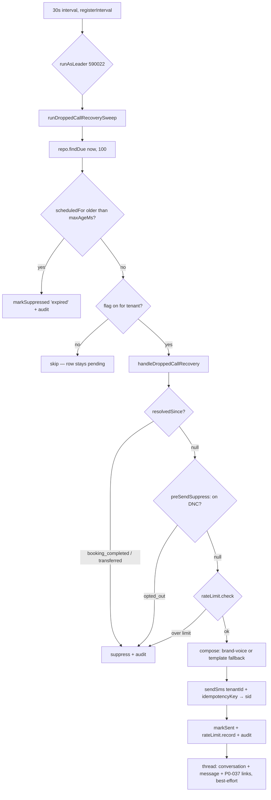

# feat: Wire dropped-call recovery (P8-015) into production

**Created:** 2026-07-07
**Depth:** Deep
**Status:** plan

## Summary

The dropped-call recovery feature is half-alive: `DroppedCallScheduler` durably
schedules a recovery row for every dropped call and the RV-116 resume handler
already handles customer replies, but `runDroppedCallRecoverySweep` is never
scheduled and the handler's five dependency seams (`resolvedSince`, `rateLimit`,
`compose`, `sendSms`, `thread`) have no production implementations — so the
promised ~60-second "we got cut off" recovery SMS never sends. This plan wires
the sweep with production adapters, a per-tenant feature-flag kill switch, a
do-not-contact gate, and P0-037 conversation threading.

## Problem Frame

A customer whose call drops mid-intake today gets nothing unless they call
back — the lead silently dies even though the row recording it exists. Owners
lose bookings; the feature was fully specified (P8-015), and the orchestrator,
scheduler, worker function, resume handler, and their unit + integration tests
all shipped — only the production wiring is missing. Separately, two hazards
were discovered during planning that must not ship with the wiring: this path
has **no DNC/opt-out check** (it would be the only outbound customer-SMS path
in the repo without one), and a naive flag gate would let disabled tenants'
pending rows starve enabled tenants and blast stale texts when a flag flips on.

## Requirements

- R1. Due `dropped_call_recoveries` rows send the recovery SMS in production,
  leader-gated across replicas, with worst-case latency ≈ 90s after the
  scheduled time (30s sweep interval).
- R2. Compliance: a caller on the tenant's DNC list is suppressed
  (`opted_out`), and the existing 1-SMS-per-caller-per-5-minutes limit is
  enforced without burning tokens on failed sends.
- R3. No recovery SMS after the call already resolved: same-session
  completion/escalation, an executed proposal from the drop, or a completed
  call-back session for the same customer all suppress the send.
- R4. Message text is brand-voice via the LLM gateway
  (`dropped_call_recovery_sms` intent, ≤ `RECOVERY_SMS_MAX_CHARS` = 320,
  PII-safe curated cue only), with a deterministic template fallback on
  composer failure and in keyless environments.
- R5. Rollout is per-tenant via a feature flag that defaults **off** and acts
  as a kill switch; disabled tenants' rows are skipped (reversible) but expire
  terminally after a freshness window so they can never starve the batch or
  send stale.
- R6. The recovery SMS threads into the unified inbox: an outbound message on
  the same conversation an inbound SMS from that caller would land in, plus
  P0-037 `conversation_links` rows for the `voice_session` and
  `sms_conversation`.
- R7. No double-sends: leader advisory lock across replicas, per-row Twilio
  `Idempotency-Key` (`dropped_call_recovery:{row.id}`), and `markSent`'s
  `sent_at IS NULL` single-winner guard — pinned by tests.
- R8. Every new mutation emits an audit event; the new table ships with
  RLS + FORCE; all new SQL is pinned by Docker-gated integration tests
  (see `docs/solutions/database-issues/mocked-pool-hides-real-schema-mismatch.md`).

## Key Technical Decisions

- **Per-tenant flag, skip-don't-suppress, plus `maxAgeMs` expiry** — the flag
  (`dropped_call_recovery`, default off, resolved via
  `PgTenantFeatureFlagRepository.isEnabledForTenant`) skips disabled tenants'
  rows so a brief kill-switch dip is reversible; a 30-minute `maxAgeMs` cutoff
  stamps overdue rows `suppressed('expired')` so the pending set stays bounded
  and a later flag flip is forward-only. (Alternative: suppress-on-disabled —
  rejected because it permanently consumes rows during a temporary kill-switch
  dip and writes audit noise for never-enabled tenants.)
- **DNC gate as a new optional `preSendSuppress` handler dep** — checked
  between `resolvedSince` and `rateLimit`; production impl calls
  `dncRepo.isOnDnc(tenantId, normalizePhone(callerE164))` → suppress
  `'opted_out'` through the existing suppress+audit path. (Alternative: widen
  `resolvedSince`'s return union with `'opted_out'` — rejected as semantically
  dishonest; compliance doesn't belong in a booking-state checker.)
- **Composite `resolvedSince` with a widened (optional) row argument** — three
  failure-isolated signals: same-session outcome (`completed` →
  `booking_completed`, `escalated_to_human` → `transferred` — the enum has no
  `transferred` value), executed proposal from `row.context.proposalIds`, and
  a newer completed session for the same `customer_id`
  (`findByTenant(tenantId, { customerId, endedOnly: true })`, filtered in code
  to sessions started after the drop). Indeterminate → `null` → send: a
  redundant "we got cut off, reply to pick back up" is benign; a lost lead is
  not.
- **Compose = brand-voice composer with deterministic fallback** — reuse
  `composeBrandVoiceMessage` with the already-registered
  `dropped_call_recovery_sms` intent; route through it only when
  `config.AI_PROVIDER_API_KEY` is set (mock-gateway text must never reach a
  customer), and fall back to the shipped B5 template on typed composer
  failure. Precedent: the daily-digest wiring in `packages/api/src/app.ts`.
  (Alternative: throw-and-retry until expiry — rejected; for a time-sensitive
  recovery the template is the product, and an LLM outage should degrade to
  template SMS, not silence.)
- **Threading via a real `conversation_links` table (P0-037 option A)** — the
  existing `ConversationLinkRepository` port has no Pg implementation and no
  table; add both, and thread the outbound message using the **same**
  phone→thread resolution as `sms/inbound-capture.ts` so the caller's reply
  lands in the same thread. (Alternative B: metadata-only threading with no
  new table — kept as the explicit descope fallback if migration review
  stalls; it achieves the visible inbox outcome but not queryable linkage.)
- **Keep the leader-gated sweep pattern (no `FOR UPDATE SKIP LOCKED` in v1)** —
  `findDue` has no row claiming, so the `runAsLeader` advisory lock
  (`SWEEP_LOCK.droppedCallRecovery = 590022`, next free number; 590010 is
  reserved) is correctness-critical, not just an efficiency measure. Every
  durable sweep in `app.ts` works this way; the Twilio idempotency key and
  `markSent` guard are the second and third lines of defense. Document at the
  wiring site that the sweep must never be un-gated without adding claiming.
- **`sendSms` adapter passes `tenantId` and `idempotencyKey`** — unlike the
  existing callMeBack/resume closures (which pass only `{to, body}` and
  silently bypass per-tenant Twilio routing), the recovery sender must route
  through the tenant's subaccount and forward the `Idempotency-Key` header;
  both providers support it and return the sid the handler stamps.
- **30-second sweep interval** — the product promise is "~60s after the drop";
  a 60s interval makes worst-case latency ~2× the promise, 30s keeps it ~90s.

## Scope Boundaries

**In scope:** production implementations of the five handler deps; handler
contract widenings (optional `resolvedSince` row arg, optional
`preSendSuppress`); worker flag-gate + expiry additions; `conversation_links`
migration + Pg repo; `app.ts` sweep wiring + flag constant/seed; unit and
Docker-gated integration tests for all of the above.

**Non-goals:**
- `FOR UPDATE SKIP LOCKED` claiming in `findDue` (leader lock suffices for v1).
- Detecting call-backs from a *different phone / unlinked customer* — no
  durable signal exists (voice_sessions has no caller-phone column).
- Threading RV-116 resume-handler replies into the inbox (they bypass the
  capture handler today).
- Any change to the scheduler, resume handler, or detection logic — all live
  and tested.

### Deferred to follow-up work
- Resume-before-send suppression: a caller who replies before the send still
  gets the recovery SMS (bounded to 1 by the rate limiter). Follow-up: resume
  handler stamps pending rows `suppressed('resumed_before_send')`.
- Map `PerTenantTwilioDeliveryProvider` `AUTH_FAILED` to a terminal
  `'no_sms_channel'` suppression instead of retry-until-expiry log noise.
- Thread RV-116 resume replies (inbound + auto-reply) onto the same
  conversation the threader creates.

## Repository invariants touched

- **tenant_id + RLS:** new `conversation_links` table ships with RLS enabled +
  FORCEd (join the FORCE list in `packages/api/src/db/schema.ts` ~3243),
  pinned by an integration test under the unprivileged runtime role. The only
  cross-tenant read remains the existing `findDue` via `withCrossTenantSweep`.
- **Audit events:** the handler already emits `dropped_call_recovery.sent` /
  `.suppressed` through its `audit` dep (wire the app's `auditRepo`). New
  mutations match: the worker's `'expired'` suppression routes through the
  same suppress+audit path; conversation creation uses
  `createConversationWithAudit`; the threader emits one
  `dropped_call_recovery.threaded` event covering message + link writes.
- **LLM gateway:** satisfied by construction — `composeBrandVoiceMessage`
  calls `gateway.complete()` only; the fallback template is non-AI. PII is
  opt-in: only the curated `contextCue` and business name reach the prompt,
  never `row.context.entitiesResolved` or transcript text.
- **Human-approval gate:** not violated — this is a system notification send
  (same class as appointment reminders and callMeBack pages), not proposal
  execution; the resume path already documents that a customer SMS can never
  approve a proposal.
- Integer cents, catalog resolver, entity resolver: not touched by this plan.

## High-Level Technical Design

## Implementation Units

### U1. `conversation_links` migration + Pg repository
- **Goal:** give the existing P0-037 `ConversationLinkRepository` port a real
  table and Pg implementation so links are persistable in production.
- **Requirements:** R6, R8
- **Dependencies:** none
- **Files:**
  - `packages/api/src/db/schema.ts` (new migration: `conversation_links` —
    `id`, `tenant_id UUID`, `conversation_id UUID`, `entity_type TEXT`,
    `entity_id TEXT`, `created_at`; UNIQUE on
    `(tenant_id, conversation_id, entity_type, entity_id)`; RLS + FORCE,
    following migration 112's pattern)
  - `packages/api/src/conversations/pg-conversation-link.ts` (new)
  - `packages/api/test/integration/conversation-links.test.ts` (new)
- **Approach:** implement the existing port
  (`packages/api/src/conversations/linkage.ts`) exactly — `create`,
  `findByConversation`, `findByEntity`, `delete` — extending
  `PgBaseRepository` like `PgDroppedCallRecoveryRepository`. `create` is
  idempotent via `ON CONFLICT DO NOTHING` on the four-column unique key.
- **Patterns to follow:** `packages/api/src/sms/recovery/scheduler.ts`
  (`PgDroppedCallRecoveryRepository`), schema.ts migration 112 + FORCE list.
- **Test scenarios:**
  - Happy path: create then `findByConversation`/`findByEntity` round-trip
    real rows with correct field mapping.
  - Edge: duplicate `create` with identical four-tuple is a no-op (no throw,
    single row).
  - Error: `delete` of a nonexistent link resolves without error.
  - Integration (required — new table): RLS isolation under the unprivileged
    runtime role (tenant A cannot read tenant B's links — mirror the
    `asTenant` pattern in `test/integration/dropped-call-worker.test.ts`);
    migration applies cleanly from scratch.
- **Verification:** integration suite green against real Postgres; the port's
  in-memory and Pg implementations behave identically for the unit's cases.

### U2. Recovery rate-limiter adapter
- **Goal:** bind `PhoneRateLimiter` to the handler's `RecoveryRateLimiter`
  contract with non-consuming check / post-send record semantics.
- **Requirements:** R2
- **Dependencies:** none
- **Files:**
  - `packages/api/src/sms/recovery/recovery-rate-limiter.ts` (new)
  - `packages/api/test/sms/recovery/recovery-rate-limiter.test.ts` (new)
  - `packages/api/test/integration/dropped-call-worker.test.ts` (extend)
- **Approach:** factory `createRecoveryRateLimiter(limiter: PhoneRateLimiter)`
  mapping `check(tenant, e164)` →
  `limiter.check(tenant, RECOVERY_RATE_LIMIT_SCOPE, e164, RECOVERY_RATE_LIMIT_MAX, RECOVERY_RATE_LIMIT_WINDOW_MS)`
  and `record(...)` → `limiter.tryConsume(...)`, logging (not throwing) a
  `false` from `record` — the benign check↔consume race is documented in
  `phone-rate-limit.ts` and the handler treats `record` as best-effort. Lives
  beside the handler because the scope/limit/window binding is
  recovery-domain knowledge; `shared/rate-limit/` stays domain-ignorant.
- **Patterns to follow:** `customer-mms/customer-mms-intake.ts` scope-constant
  usage; constants already exported from `sms/recovery/dropped-call-handler.ts`.
- **Test scenarios:**
  - Happy path (unit, stub limiter): `check` delegates with the exact
    scope/limit/window constants and consumes nothing; `record` delegates to
    `tryConsume`.
  - Error: `record` returning `false` logs and does not throw.
  - Integration (real `phone_rate_limits` table): N `check` calls leave zero
    rows; one send + `record` leaves exactly one bucket row; concurrent
    `record`s for one `(tenant, scope, key)` admit exactly the limit
    (advisory-xact-lock atomicity); the critical inversion bug — wiring
    `check` to `tryConsume` — would fail the "checks record nothing" case.
- **Verification:** a suppressed or failed send provably burns no token
  (row still eligible next sweep); a sent recovery consumes exactly one.

### U3. Handler widenings + production `resolvedSince`
- **Goal:** let the handler consume a DNC gate and a context-aware resolution
  checker without breaking existing implementations, and implement the
  composite production checker.
- **Requirements:** R2 (gate seam), R3
- **Dependencies:** none
- **Files:**
  - `packages/api/src/sms/recovery/dropped-call-handler.ts` (widen
    `ResolvedSinceChecker` with an optional third arg carrying the row
    context; add optional `preSendSuppress?: (row) => Promise<string | null>`
    checked between `resolvedSince` and `rateLimit`, suppressing through the
    existing `suppress()` path)
  - `packages/api/src/sms/recovery/resolved-since.ts` (new)
  - `packages/api/test/sms/recovery/resolved-since.test.ts` (new)
  - `packages/api/test/sms/recovery/dropped-call-recovery.test.ts` (extend:
    `preSendSuppress` ordering + suppression reason)
  - `packages/api/test/integration/dropped-call-worker.test.ts` (extend)
- **Approach:** `createDroppedCallResolvedSince({ voiceSessionRepo,
  proposalRepo, logger })` evaluating three signals in order, each
  individually try/caught so one broken query can't disable the others:
  (1) `voiceSessionRepo.findById(tenantId, voiceSessionId)` — outcome
  `completed` → `'booking_completed'`, `escalated_to_human` →
  `'transferred'`; (2) any of `row.context.proposalIds` with status
  `executed` → `'booking_completed'`; (3) if the session has `customerId`,
  `findByTenant(tenantId, { customerId, endedOnly: true })` filtered in code
  to sessions started after the drop with outcome `completed`/
  `escalated_to_human`. Indeterminate → `null` (send wins — see decision).
- **Patterns to follow:** `telephony/emergency-page-retry.ts`
  (`createEmergencyPageResolvedCheck`) — the same durable-resolution-signal
  problem; existing handler suppression flow.
- **Test scenarios:**
  - Happy path (unit, in-memory repos): each of the three signals returns the
    mapped reason; no signal → `null`.
  - Edge: session not found → `null`; `context` absent/malformed → signal 2
    skipped, others still run; call-back session started *before* the drop is
    ignored.
  - Error: one repo throwing → logged, remaining signals evaluated, result
    from them honored.
  - Handler ordering (extend existing orchestrator suite): `preSendSuppress`
    runs after `resolvedSince`, before `rateLimit`; its non-null reason stamps
    `markSuppressed` + audit with that reason; existing two-arg
    `resolvedSince` mocks still compile and pass (non-breaking widening).
  - Integration: each signal fires from real `voice_sessions` / `proposals`
    rows, including a persisted `context` JSONB round-trip (pins `parseContext`
    against real JSONB per the mocked-pool solutions doc).
- **Verification:** a dropped call whose session was later marked `completed`
  is suppressed as `booking_completed` against real Postgres; a genuinely
  unresolved drop proceeds to send.

### U4. Brand-voice recovery composer adapter
- **Goal:** produce the customer-facing SMS body through the LLM gateway with
  a deterministic fallback, honoring the PII opt-in and char cap.
- **Requirements:** R4
- **Dependencies:** none
- **Files:**
  - `packages/api/src/sms/recovery/recovery-composer.ts` (new)
  - `packages/api/test/sms/recovery/recovery-composer.test.ts` (new)
- **Approach:** factory
  `createRecoveryComposer({ gateway, settingsRepo, standingInstructionRepo, businessName, aiEnabled })`
  returning the handler's `RecoveryMessageComposer`. When `aiEnabled`
  (i.e. `config.AI_PROVIDER_API_KEY` set): call `composeBrandVoiceMessage`
  with intent `'dropped_call_recovery_sms'`, context = `{ contextCue,
  businessName }` only, `maxChars` passed through; on any composer `AppError`,
  log and return the fallback. Fallback (also the `aiEnabled: false` path):
  the shipped B5 template — greeting with business name + cue + "Reply and
  we'll pick up where we left off." — truncated to `maxChars`.
- **Patterns to follow:** the daily-digest composer wiring in
  `packages/api/src/app.ts` (~4905): AI-key gate + deterministic fallback;
  `ai/brand-voice/composer.ts` invariants (tone authority, maxChars enforced
  in code, PII opt-in).
- **Test scenarios:**
  - Happy path (stub gateway): returns composed text; context passed to the
    composer contains exactly `contextCue` and `businessName` (nothing else —
    pins the PII opt-in).
  - Edge: `aiEnabled: false` → template without any gateway call; empty cue →
    template still reads correctly; template output ≤ maxChars for a long cue.
  - Error: gateway/composer throws typed error → fallback template returned,
    error logged, no throw to the handler (row must not strand on LLM outage).
- **Verification:** with a stubbed failing gateway, a due row still sends the
  template body; with a working gateway, the composed text is used.

### U5. Worker flag gate + staleness expiry
- **Goal:** make the sweep per-tenant flag-aware (reversible skip) and bound
  row staleness (terminal expiry), preventing starvation and stale-blast.
- **Requirements:** R5
- **Dependencies:** none (lands before U7 wiring)
- **Files:**
  - `packages/api/src/workers/dropped-call-worker.ts` (add optional
    `isEnabledForTenant?: (tenantId: string) => Promise<boolean>` and
    `maxAgeMs?: number` to `DroppedCallWorkerDeps`; expiry checked first,
    then the flag gate, then the handler; extend `DroppedCallSweepResult`
    with `skipped` and `expired` counts)
  - `packages/api/test/workers/dropped-call-worker.test.ts` (extend)
- **Approach:** for each due row: if `maxAgeMs` set and
  `now - scheduledFor > maxAgeMs` → `repo.markSuppressed(tenantId, id,
  'expired')` + audit event (route through the same audit shape the handler's
  suppress path uses) and count `expired`; else if `isEnabledForTenant`
  returns false → count `skipped`, leave the row pending; else run the
  handler. Per-row try/catch preserved (one bad row never kills the batch).
- **Patterns to follow:** `workers/supervisor-review-worker.ts` (per-tenant
  flag gate in a sweep); the worker's existing per-row isolation.
- **Test scenarios:**
  - Happy path: flag-enabled tenant's row processed; disabled tenant's row
    skipped and still pending; row older than `maxAgeMs` stamped
    `suppressed('expired')` with audit, regardless of flag.
  - Edge: `isEnabledForTenant` absent → all rows processed (backward
    compatible); expiry checked before flag (a stale row for a disabled
    tenant expires rather than skips); mixed batch counts
    `{sent, suppressed, skipped, expired, failed}` correctly.
  - Error: `isEnabledForTenant` throwing for one row → that row counted
    failed/left pending, batch continues.
- **Verification:** with >100 pending rows for a disabled tenant and a fresh
  due row for an enabled tenant, the enabled tenant's row still sends within
  one sweep once expiry has drained the stale set (no starvation).

### U6. Recovery threader
- **Goal:** thread the sent recovery SMS into the unified inbox conversation
  and persist the P0-037 links.
- **Requirements:** R6
- **Dependencies:** U1
- **Files:**
  - `packages/api/src/sms/recovery/recovery-threader.ts` (new)
  - `packages/api/src/sms/inbound-capture.ts` (extract/export the
    phone→thread-target resolution so both directions share it — no behavior
    change to inbound capture)
  - `packages/api/test/sms/recovery/recovery-threader.test.ts` (new)
  - `packages/api/test/integration/dropped-call-worker.test.ts` (extend)
- **Approach:** factory `createRecoveryThreader({ conversationRepo,
  conversationLinkRepo, customerRepo, auditRepo })` implementing
  `RecoveryThreader`: (1) resolve the thread target with the exported
  inbound-capture resolution (single customer match by normalized phone →
  customer thread; else lead; else `sms_unmatched` keyed by E.164);
  (2) open-or-append via the documented 23505 one-open-thread race recovery
  (migrations 198/200), creating through `createConversationWithAudit`;
  (3) `addMessage` with an outbound message row
  (`metadata: { direction: 'outbound', channel: 'sms', messageSid,
  voiceSessionId }`); (4) `linkConversation` twice —
  `('voice_session', voiceSessionId)` and
  `('sms_conversation', smsMessageSid)`; (5) emit one
  `dropped_call_recovery.threaded` audit event. The handler already treats
  `thread` as best-effort — a threader failure must never cause a re-send.
- **Patterns to follow:** `sms/inbound-capture.ts` `openOrAppendConversation`
  (resolution + 23505 recovery); `conversations/linkage.ts` port.
- **Test scenarios:**
  - Happy path (unit, in-memory repos): known customer → message appended to
    the customer's open thread; both links written; audit emitted.
  - Edge: no matching customer → `sms_unmatched` conversation keyed by E.164;
    existing open thread reused rather than duplicated; duplicate threader
    invocation (retry after partial failure) doesn't duplicate links
    (ON CONFLICT) or messages beyond the append semantics.
  - Error: link-repo failure after message write → error propagates to the
    handler's best-effort catch (verify handler still counts the row sent).
  - Integration: an outbound recovery and a subsequent *inbound* SMS from the
    same phone land on the **same** conversation row (the actual P0-037
    outcome, both directions through real Postgres); 23505 race recovers by
    reusing the winner; link rows respect RLS.
- **Verification:** in the integration harness, after a sweep sends a
  recovery, the inbox conversation for that customer shows the outbound
  message, and `conversation_links` resolves the voice session to it.

### U7. app.ts wiring: flag constant, adapters, leader-gated sweep
- **Goal:** activate the feature end-to-end (dark by default) — construct all
  production deps and schedule the sweep.
- **Requirements:** R1, R2, R5, R7
- **Dependencies:** U1–U6
- **Files:**
  - `packages/api/src/workers/dropped-call-worker.ts` (export the flag-key
    constant `DROPPED_CALL_RECOVERY_FLAG = 'dropped_call_recovery'`, following
    `VOICE_VULNERABILITY_TRIAGE_FLAG`'s placement convention)
  - `packages/api/src/flags/resilience-flags.ts` (seed the flag, default
    disabled)
  - `packages/api/src/app.ts` (`SWEEP_LOCK.droppedCallRecovery = 590022` with
    the collision-discipline comment; adapter construction; `registerInterval`
    + `runAsLeader` 30s block inside `if (messageDelivery)`, dedicated
    `dropped-call-worker` logger, placed beside the callMeBack sweep)
  - `packages/api/test/integration/dropped-call-worker.test.ts` (extend:
    flag-resolution + end-to-end sweep with production adapters)
- **Approach:** build `handlerDeps` once: `audit: auditRepo`, `rateLimit` (U2
  over the app's `PhoneRateLimiter` — reuse/construct alongside
  `customerMmsRateLimiter`), `resolvedSince` (U3 over `voiceSessionRepo` +
  `proposalRepo`), `preSendSuppress` (DNC via the app's `dncRepo` +
  `normalizePhone`), `compose` (U4 with `llmGateway`, `settingsRepo`,
  `standingInstructionRepo`, `config.AI_PROVIDER_API_KEY` gate), `sendSms`
  (inline closure over `messageDelivery.sendSms({ to, body, tenantId,
  idempotencyKey })` returning `providerMessageId`), `thread` (U6),
  `topIntentFor` from the row context where available. Worker deps:
  `isEnabledForTenant: (t) => isFlagEnabledForTenant(t,
  DROPPED_CALL_RECOVERY_FLAG)`, `maxAgeMs: 30 * 60_000`. Document at the
  wiring site that `findDue` has no claiming — the leader gate is
  correctness-critical (never un-gate without adding SKIP LOCKED).
- **Patterns to follow:** the callMeBack sweep block (`app.ts` ~4807–4833);
  flag resolver `isFlagEnabledForTenant` (~2874); digest composer gate
  (~4905).
- **Test scenarios:**
  - Integration — flag resolution order against real `tenant_feature_flags`:
    platform default off → row skipped/pending; tenant override on → sends;
    platform on + tenant override off → kill switch wins; flag flip → next
    sweep sends (unit tests cannot pin the tenant-override → platform → false
    SQL).
  - Integration — end-to-end: seeded dropped session + due row + enabled flag
    → sweep sends (stub Twilio fetch), row stamped with sid, audit written,
    rate-limit row recorded, conversation threaded.
  - Integration — concurrency (document-don't-paper-over): two concurrent
    sweep invocations both fetch the row (no SKIP LOCKED), `markSent` is
    single-winner (second UPDATE matches zero rows), both attempts carried
    the identical `dropped_call_recovery:{row.id}` idempotency key.
  - Wiring sanity: sweep registered only when `messageDelivery` exists; lock
    key 590022 unique in `SWEEP_LOCK`.
- **Verification:** on a real-Postgres harness with the flag enabled for one
  tenant, a dropped call produces exactly one recovery SMS ~scheduled-time,
  visible in the conversation thread, with sent/suppressed audit trail — and
  flipping the flag off stops sends on the next tick.

## Risks & Dependencies

- **False "unresolved" reads** (apology after a successful booking): mitigated
  by the three-signal composite (U3), per-tenant rollout with audit
  observability before broad enable, and message wording that stays truthful
  either way. Residual: call-backs from a different phone are undetectable —
  accepted, documented.
- **Leader-election dependency for exactly-once:** `findDue` has no claiming;
  the advisory lock runs on the direct (non-PgBouncer) pool as pinned by
  `test/integration/direct-pool-session-locks.test.ts`. Defense in depth via
  idempotency key + `markSent` guard (U7 tests).
- **Tenants without Twilio creds:** per-tenant provider fails closed → rows
  retry until expiry (bounded, log-noisy). Flag should only be enabled for
  provisioned tenants; terminal `'no_sms_channel'` mapping is a deferred
  follow-up.
- **Migration review for `conversation_links` (U1) gates U6.** Descope
  fallback: metadata-only threading (decision alternative B) keeps U6
  shippable without the new table.

## Open Questions (deferred to implementation)

- Exact filter ergonomics for signal 3 in U3: `findByTenant` has no
  `startedAfter` option — filter in code over a bounded `limit`, or add the
  option to `ListVoiceSessionsOptions` if the list is unbounded in practice.
- Whether the `'expired'` audit event reuses the handler's suppress event
  shape verbatim or needs a worker-side actor id — align with whatever
  `suppress()` emits today.
- The exact exported shape of the shared thread-target resolution extracted
  from `inbound-capture.ts` (U6) — follow the existing function boundaries,
  no behavior change.
