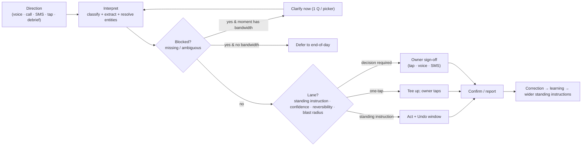
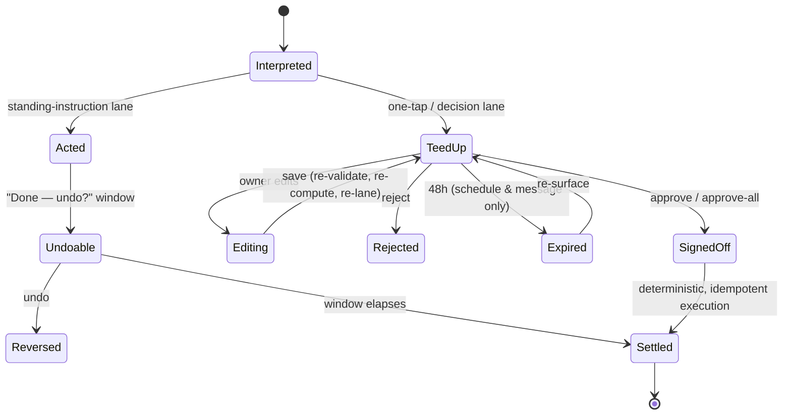
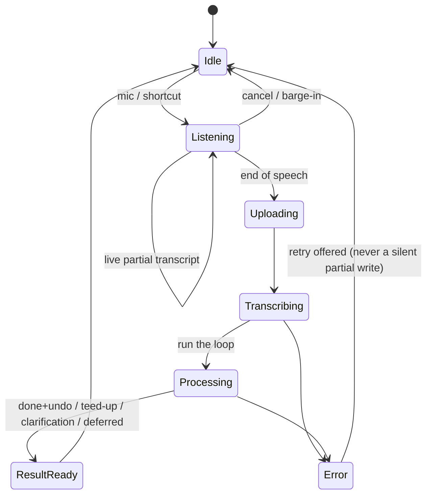

# AI Service OS — Interaction Model (v3.0)

The behavioral layer between the PRD (what), the screens (where), and the build prompts (how). If a screen or story contradicts this on behavior, **this is the reference**.

**What changed across versions.** v1 treated interaction as the product. v2 over-corrected — it tried to *minimize* interaction toward an autonomous system that runs itself and pings the owner. **v3 fixes the premise: the owner has an assistant they direct.** The North Star (*People do the trades. We handle the business*) means removing the **labor** of the business, not removing the **owner** from it. These are independent-business owners; directing the work is the part they want to keep, and keeping their hand on the wheel is what makes the system trustable from day one. So the goal is not minimal interaction — it is **maximum leverage per direction** (one sentence does an hour of work) while the owner stays in command and informed. The assistant is proactive and capable, but it acts on the owner's direction and **standing instructions**, never on its own initiative.

---

## 0. The core stance

The product is **a capable assistant the owner directs** — like the office manager they can't afford, who happens to be instant, always on, and never forgets. A great assistant is not passive: it tees things up, drafts for sign-off, flags what needs a decision, and runs the routine on standing instructions. But it is unmistakably *directed* — the owner is the principal, the assistant is the amplifier.

Two measures, replacing v2's "minimize interaction":

1. **Leverage per direction** — how much completed work one spoken or typed direction produces. The debrief that fans out into six updates is the ideal.
2. **Command & clarity** — the owner always feels in control and always knows what the assistant did or is about to do. Surprise is the cardinal sin.

**The design tension to hold:** *directing fatigue.* If the owner must direct every small thing, directing becomes its own labor and we've rebuilt data entry with a mic. The defense is high leverage per direction **plus standing instructions** — the owner directs the *shape* once ("always text a reminder the morning of"), the assistant handles every *instance* without re-asking.

---

## 1. The three things the owner does

Everything the owner does with the assistant is one of these. Everything else, the assistant handles under direction.

1. **Direct** — issue an instruction ("book Lee Tuesday," "invoice the Smith job," "here's what happened on this call"). One-off or standing.
2. **Decide** — make the judgment calls that are genuinely theirs: price a novel job, approve money out, take or decline the 9pm emergency, sign off on anything customer-facing or hard to reverse.
3. **Stay informed & correct** — see what the assistant did, and correct it when wrong. Concentrated at end-of-day, plus anything time-sensitive in the moment.

The assistant's job is to make **Direct** high-leverage, make **Decide** fast and well-framed, and make **Stay informed** a glance.

---

## 2. Standing instructions (how "directed" stays light)

The owner sets policy once; the assistant applies it forever without re-asking. Examples: *"Text every customer a reminder the morning of their appointment." "Auto-draft an invoice when I mark a job complete." "Never book me before 8am." "Flag any job over $2,000 for me before quoting."* Standing instructions are the bridge between "I direct it" and "it isn't a second job": they convert a class of decisions into a one-time direction. They are visible, editable, and listed in settings — the owner can see exactly what they've delegated and pull any of it back. This is what the auto-execution lane (§5) actually *is*: not autonomy, but the assistant following the owner's standing direction.

---

## 3. Bandwidth of the moment (how direction is given)

How the owner directs varies enormously with the moment's available attention; the assistant senses the moment and adapts, and defers anything deferrable to the highest-bandwidth window (end of day).

| Moment | Bandwidth | How direction works |
|---|---|---|
| **Driving** | Audio only | Direct and hear back by voice; no screen |
| **Walking / between tasks** | Glance + one tap | Quick voice burst or a glanceable card to tap |
| **On the job (gloves, customer present)** | Almost none | Defer; at most one voice note or photo |
| **In front of the customer** | Output only | Assistant is already *ready* (instant quote); never quizzes the owner here |
| **End of day (sitting)** | Full | Review what was done, sign off on the batch, set/adjust standing instructions, correct |
| **Async** | Zero now | One-tap SMS, or it waits for end-of-day |

Deferral is a feature: a low-bandwidth moment defers the question rather than interrupting.

---

## 4. The assistant is proactive (but never acts undirected)

A good assistant doesn't sit silent until spoken to. It:

- **Tees up** — drafts the invoice, the follow-up estimate, the reminder, and presents them ready for one-tap sign-off.
- **Flags** — surfaces what needs a decision ("two Lees — which one?", "this caller wants a weekend slot you don't normally offer").
- **Reports** — the end-of-day digest: what it did, what it's waiting on, what it learned.

The line it never crosses: it does not take a **customer-facing or hard-to-reverse** action without either explicit direction or a standing instruction. Proactivity means *preparing and surfacing*, not *deciding for the owner*.

---

## 5. Execution lanes — responsiveness to direction

When the owner directs an action, how much confirmation it needs is a function of three axes that compound (low confidence, ambiguity, or an uncatalogued element bumps it up a lane):

| Lane | When | Mechanism |
|---|---|---|
| **Act on standing instruction (+ undo)** | The owner has pre-directed this class · reversible · high-confidence | The assistant just does it and shows "Done — undo?" It's following direction, not acting alone |
| **One-tap (teed up)** | Directed one-off · medium stakes · cheap to fix | Assistant prepares it; owner taps to commit |
| **Decision required** | Customer-facing or hard to reverse | Explicit owner sign-off even at high confidence (send invoice, charge, dispatch, send estimate/message) |
| **Owner-only, always** | Irreversible money movement · binding | Never delegated, even by standing instruction |

**Undo is first-class** in the first two lanes — instant, surfaced reversal is what keeps a directed action a single step instead of direct-then-approve. The inbound receptionist sits in lane 2-as-executed: it commits a genuinely-open slot on the live call (no one to tap), bounded and reversible, with a one-tap undo/reschedule on the owner's review card — proactive preparation within the owner's standing booking rules, not autonomy.

---

## 6. The trust arc — widening the mandate, not going silent

As the assistant proves reliable (correction rates fall, surfaced in the digest), the owner **delegates more** by setting broader standing instructions — moving classes of action from "decision required" to "act on standing instruction." The system doesn't go quiet and take over; the owner *chooses* to hand it a wider mandate, and can narrow it again anytime. Trust expands the assistant's brief; it never removes the owner's command.

---

## 7. The universal loop

Every direction runs the same spine; the outcome depends on the lane.



**Latency budgets:** inbound call response **< 1.5s** (≤2.5s ok); back-office direction→outcome **< 3s** p50 (combined classify+extract, one gateway call); SMS round-trip bounded by the human.

---

## 8. The one-breath debrief (highest-leverage direction)

The clearest expression of "leverage per direction." The owner directs in one breath: *"Replaced the capacitor and contactor, quoted them for a condenser in spring, took 280 cash"* → job complete + inventory decremented + a follow-up estimate drafted + a $280 cash payment recorded — most executed under standing instruction, surfacing only the piece needing a decision (the spring estimate's price). One direction, an hour of admin done. Compound, multi-intent direction is therefore **core**: the interpreter decomposes one breath into an ordered set of actions, routes each to its lane, and executes / tees up / defers independently.

---

## 9. Confidence-driven behavior

Confidence selects the lane and gates "act on standing instruction." The assistant attaches an overall tier and per-line provenance to everything.

| Tier | Meaning | Effect |
|---|---|---|
| High | Resolved, catalog-grounded | Eligible to act on a standing instruction (if reversible / in-mandate) |
| Medium | Resolved with inference | Inferred fields marked; one-tap |
| Low | Weak match / thin input | "Review this" callout; decision required |
| Very-low / uncatalogued | Couldn't ground a key element | Capped below auto; surfaces a clarification, never a silent priced write |

Per-line provenance: `catalog` / `ambiguous` / `uncatalogued`. Ambiguous lines render a one-tap picker that patches the draft and re-computes confidence. Over-confidence is the real failure mode, so confidence is calibrated against observed corrections and stays conservative near lane boundaries — the assistant errs toward asking the owner rather than presuming.

---

## 10. The clarification contract

- Ask only for a **missing required field** or a **true ambiguity** — never to confirm something already extracted confidently.
- Prefer a **one-tap picker** over an open question when candidates exist.
- **Respect the moment:** if bandwidth is low, defer the question to end-of-day rather than interrupt.
- Hard cap (~3 loops); after it, present a best-effort result flagged for review.
- A clarification is itself a typed proposal and flows through the same path.

---

## 11. Action lifecycle



Only schedule and message items expire (48h); the rest persist. Editing re-validates, re-computes, and re-evaluates the lane. Execution is idempotent. Every transition is audited (assistant action + directing/approving owner).

---

## 12. Voice interaction state machine (giving direction)



Route-aware context, live partial transcript, explicit "thinking" state, barge-in returns to idle without committing. Mic ≥56px and thumb-reachable on mobile; ≥44px everywhere; no 320px overflow. The "you can say…" suggestions make the cockpit self-teaching — they show the owner what they can direct.

---

## 13. Inbound call interaction (the assistant acting as front desk under standing rules)

```mermaid
sequenceDiagram
  participant C as Caller
  participant A as AI Assistant (front desk)
  participant S as Schedule/Services
  participant O as Owner
  C->>A: calls
  A->>C: greeting + AI disclosure (per tenant/state)
  A->>S: identify caller by phone
  A->>C: intent?
  alt Emergency (no heat / flooding / gas)
    A->>O: fast-path escalate (patch-through or immediate SMS)
    A->>C: reassurance + ETA path
  else Bookable
    A->>S: qualify (service, hours, area) + live availability
    A->>C: offer real open slots (within owner's standing booking rules)
    C->>A: picks a slot
    A->>S: book (one-tap-as-executed; bounded + reversible)
    A->>C: confirm + SMS confirmation
    A->>O: review card (one-tap undo / reschedule)
  end
  Note over C,A: drop <5s detected → SMS recovery within 60s w/ partial transcript
```

The front desk operates strictly inside the owner's standing rules (hours, area, services, booking policy); anything outside them is surfaced to the owner, not decided.

---

## 14. The customer side: invisible competence

The customer perceives no interaction model: they call and get helped, get a text and tap a link, approve an estimate or pay on a token-gated page with no login or app. No new behavior is ever required of them. The owner's decisions are largely *prompted by* these customer moments.

---

## 15. Cross-channel handoffs

- A direction given when the owner can't act now → teed up as an SMS one-tap or held for the end-of-day batch.
- An inbound booking → SMS confirm to caller + review card to owner.
- A truck-dictated direction → reviewed/adjusted on web later.
- Tech texts **OUT** → unavailable block + reschedule drafts → owner approve-all by SMS.

State stays coherent because execution is idempotent and threading is keyed to the action, not the channel.

---

## 16. Error & edge patterns

| Situation | Behavior |
|---|---|
| Low-confidence interpretation | Clarify or defer — never a guess-write |
| Tool / model failure | Retry surfaced; never a silent partial write; correlation-ID logged |
| Ambiguous catalog/customer | One-tap picker; resolving patches the draft |
| Out-of-scope direction | Decline gracefully; offer nearest in-scope action |
| Duplicate on save | Merge / keep-both before writing |
| Customer texts STOP | Opt-out short-circuits; never reaches outreach |
| Unknown inbound number | Lightweight lead-linked thread; never a silent drop |
| Post-execution mistake | Reversal path on executed actions; higher blast radius keeps a longer undo window |
| Backward status move | Owner/admin only, reason required, audited |

---

## 17. Learning loop (the engine of a widening mandate)

Every owner correction (field, before, after, intent) is captured and rolled into the **weekly digest** as "what I learned," beside a 30-second snapshot and one or two suggested actions — often *"want me to start handling this automatically?"*, turning a proven pattern into a new standing instruction. Brand voice is set at onboarding and **locked**, so every utterance sounds like the shop.

---

## 18. Canonical flows

**A. Direct a booking (driving).** *"Book Mrs. Lee for a no-cool call Tuesday afternoon."* → one match, resolved → standing-instruction lane (owner's booking rules cover it): booked, "Done — undo?" by voice. Two Lees → spoken pick if conversational, else deferred picker.

**B. Front-desk booking (inbound).** Greeting+disclosure → identify → qualify + offer real slots within standing rules → caller picks → booked (one-tap-as-executed) → caller SMS → owner review card. Emergency → fast-path escalate.

**C. Job debrief (highest leverage).** One-breath debrief → complete + inventory + payment executed under standing instruction; follow-up estimate **drafted** (decision required to price/send). One direction, one decision.

**D. Estimate → send.** Drafted from a direction → owner edits a price (correction captured) → **send is a decision** (customer-facing) → customer approves on token link → approved estimate offers a job.

**E. Invoice → collect.** Job complete → invoice **drafted** under standing instruction → **send/charge is a decision** → customer pays via link or owner records Zelle/Venmo/cash → Paid, 0.5% fee shown → receipt SMS → QuickBooks one-way.

**F. "I'm out."** Tech texts OUT → unavailable block → reschedule drafts → owner approve-all by SMS.

**G. Speed-to-lead.** Web/GBP lead → lead record + instant response (standing instruction) → unified inbox → owner converts (one-tap), source attribution preserved.

---

## 19. Acceptance criteria (the measurable bar)

- **Leverage is measured:** completed actions per direction trends up (the debrief fan-out); directing effort per task trends down without a rise in undo/correction.
- **Command is preserved:** no customer-facing or hard-to-reverse action happens without explicit direction or a standing instruction the owner set; standing instructions are visible, editable, and revocable.
- Every standing-instruction/one-tap action has an instant, surfaced **undo**.
- Inbound voice ≤1.5s; back-office direction→outcome <3s p50.
- The mic is reachable on every authenticated route incl. onboarding; ≥44px (≥56px primary); no 320px overflow.
- Every teed-up action shows a confidence tier and what it wasn't sure about; uncatalogued lines never auto-price.
- Clarifications are missing-field/ambiguity only, capped, picker-preferred, and deferred when the moment lacks bandwidth.
- Schedule & message items expire at 48h (re-surfaceable); others persist.
- Every mutation audited (assistant action + directing owner); every correction feeds the digest and offers a new standing instruction.
- Customer actions require no login (token links) and confirm by SMS.

---

## Companion documents

| Document | Role relative to this model |
|----------|----------------------------|
| `docs/PRD-v3.md` | What we build — product scope and workflows |
| `docs/PRD-execution-catalog.md` | How we build — per-story prompts and acceptance |
| `docs/strategy/day-in-the-life.md` | Emotional spine and personas |
| `docs/launch/voice-interaction-scope.md` | Launch vs post-launch voice surfaces |
| `docs/interaction-model-v3-code-alignment.md` | Current build ⇄ v3 acceptance criteria |

**Precedence:** When a screen, story, or PRD section contradicts this document on *behavior*, this document wins. When they disagree on *scope* (a feature exists or not), the PRD wins.
