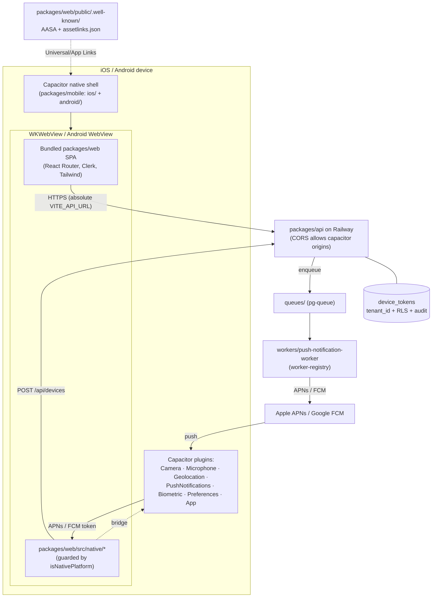

# feat: Native iOS + Android apps (Capacitor) for App Store & Play Store

**Created:** 2026-06-14
**Depth:** Deep
**Status:** plan

## Summary
Package the existing Rivet web product (`packages/web` — a Vite/React SPA)
as native **iOS and Android** apps using **Capacitor**, so the same 40+
screens ship to the Apple App Store and Google Play Store without a
rewrite. The first store-submittable release is **field-ready**: native
camera/microphone/geolocation, app branding, deep/universal links,
biometric app-lock, an offline draft/mutation queue, and push
notifications (new backend device-token store + worker-driven APNs/FCM
send). Releases are built, signed, and uploaded to TestFlight / Play
internal track via **Fastlane in GitHub Actions**.

## Problem Frame
Today the product is web-only (static SPA behind nginx on Railway). Field
technicians and operators want an installable app from the stores, with
the reliability mobile web can't give: dependable mic/camera, push alerts
when a job/escalation lands, biometric lock on a shared device, and
graceful behavior on spotty job-site connectivity. We need real native
artifacts (`.ipa` / `.aab`) that pass store review and a repeatable way to
ship updates.

## Requirements
- **R1.** Produce installable native iOS and Android apps from the
  existing product, submittable to App Store and Play Store.
- **R2.** Reuse the `packages/web` React SPA — no screen rewrites; the web
  deploy stays unaffected.
- **R3.** App runs on-device against the production API with working Clerk
  login.
- **R4.** Native camera, microphone, and geolocation work on both
  platforms with correct OS permission prompts (more reliable than mobile
  web, esp. iOS WKWebView).
- **R5.** App branding: icons, splash, display name, notch/safe-area
  handling.
- **R6.** Deep/universal links open the app to the right screen (estimate,
  invoice, job).
- **R7.** Biometric (Face ID / Touch ID / fingerprint) app-lock, toggleable
  in settings.
- **R8.** Offline draft/mutation queue persists field actions and flushes
  on reconnect, in order.
- **R9.** Push notifications: device registration, **tenant-scoped** token
  store, worker-driven APNs/FCM send, tap → deep link.
- **R10.** Automated CI builds + signs + uploads to TestFlight and Play
  internal track (Fastlane).
- **R11.** Honor repo invariants (RLS/`tenant_id`, audit events, UTC) on
  all new backend surfaces.

## Key Technical Decisions
- **Capacitor, not React Native or a PWA/TWA wrapper** — reuse the entire
  Vite/React SPA (40+ routes, Clerk, Tailwind 4) as one codebase. (RN
  rejected: re-implements every screen, two codebases to keep in sync.
  PWA/TWA rejected: fragile Apple acceptance, weaker native mic/camera.)
- **Bundle the built web assets into the app (`webDir`), do not point the
  webview at the live Railway URL.** A bundled shell loads and runs
  offline (required for the offline queue and field use). Cost: each app
  release ships a snapshot of the `packages/web` build, so web-only changes
  require an app resubmission until OTA updates are added (see deferred).
- **Native-aware React code lives in `packages/web/src/native/*` behind
  `Capacitor.isNativePlatform()` guards**, so it is bundled into the SPA
  and the web build remains a no-op for those paths. `packages/mobile`
  holds *only* the native shell: `capacitor.config.ts`, generated `ios/`
  and `android/` projects, Fastlane, and CI. This keeps the web deploy
  byte-for-byte unaffected (R2) and avoids a parallel UI tree.
- **Absolute API base URL baked at build time for native** via the
  existing `VITE_API_URL` / `window.__APP_CONFIG__` seam (web uses a
  runtime `env.js`; native has no nginx, so it bakes at build). The API
  **CORS allowlist must add** `capacitor://localhost`, `https://localhost`,
  and `http://localhost`.
- **Push routes through the existing notifications + worker seams**, not a
  new bespoke pipeline: mirror `packages/api/src/notifications/delivery-provider.ts`
  for an APNs/FCM provider, enqueue via `packages/api/src/queues/` and run
  in a worker registered in `packages/api/src/workers/worker-registry.ts`
  (the async-worker pattern, P0-009). Sends are never inline.
- **Universal Links / App Links well-known files are served from the web
  origin** (`packages/web/public/.well-known/`), because the tapped URL is
  the web domain. Their *contents* (Team ID, package SHA-256) are finalized
  once signing identities exist (U10), so they land first with placeholders.
- **Bundle identifier `com.rivet.app`, display name "Rivet"** (confirm the
  reverse-DNS against a domain you control before reserving in the stores).

## Scope Boundaries
**In scope:** Capacitor scaffold + native projects; native runtime config &
auth in the webview; branding; native camera/mic/geolocation; deep/universal
links; biometric lock; offline draft/mutation queue; push notifications
(backend token store + send path + client); Fastlane + GitHub Actions to
TestFlight & Play internal track.

**Non-goals:**
- React Native rewrite or any second UI tree.
- Full offline **read** sync / local database mirror — only an outbound
  **mutation/draft** queue (R8), not cached reads.
- iPad/tablet-optimized layouts beyond existing responsive behavior.
- Store **listing content** (screenshots, marketing copy, privacy-policy
  prose, data-safety questionnaire answers) — operational; the U10 runbook
  enumerates what's required but does not author it.
- Creating Apple Developer / Google Play accounts, certificates, keystores,
  or the APNs key / FCM service account — operational prerequisites (listed
  under Risks & Dependencies).

### Deferred to follow-up work
- **OTA web updates** (Capgo / Ionic Appflow) so web-only fixes ship
  without a store resubmission. High value given the bundled-assets
  decision; out of v1 scope.
- Full offline read caching / conflict resolution beyond the mutation queue.
- In-app update prompts ("a new version is available").
- Localized store listings beyond the app's existing i18n.

## Repository invariants touched
- **RLS + `tenant_id`:** the new `device_tokens` table carries `tenant_id`
  with an RLS policy mirroring existing tenant-scoped tables; all reads go
  through the tenant transaction context (`packages/api/src/db/tenant-transaction.ts`).
- **Audit events:** device **register**, **unregister**, and **push send**
  each emit an audit event via `packages/api/src/audit/audit.ts`.
- **UTC:** `device_tokens` timestamps stored UTC.
- **Zod validation:** the `POST /api/devices` body is validated by a Zod
  schema in `packages/shared` (typed-payload convention), even though it is
  not a proposal.
- **Integer cents / LLM gateway / catalog & entity resolver /
  human-approval / no-auto-execute:** not on this path (no money, no AI, no
  proposals). Push payloads must never carry cross-tenant data — tokens are
  scoped to `(tenant_id, user_id)` and filtered through RLS before send.

## High-Level Technical Design

**Milestones (sequencing):**
- **A — Real installable app:** U1, U2, U3.
- **B — Field features:** U4, U5, U6, U7.
- **C — Push:** U8 (backend) → U9 (client).
- **D — Release pipeline:** U10.

## Implementation Units

### U1. Capacitor scaffold + native iOS/Android projects
- **Goal:** A `packages/mobile` package that wraps the built `packages/web`
  SPA in native iOS and Android projects that compile and launch.
- **Requirements:** R1, R2.
- **Dependencies:** none.
- **Files:**
  - `packages/mobile/package.json` (Capacitor deps, `cap:sync` / build scripts)
  - `packages/mobile/capacitor.config.ts` (appId `com.rivet.app`, appName
    `Rivet`, `webDir` → copied web build, server config for native)
  - `packages/mobile/ios/` (generated native project, committed)
  - `packages/mobile/android/` (generated native project, committed)
  - `packages/mobile/scripts/sync-web.mjs` (build `packages/web`, copy
    `dist/` into the Capacitor `webDir`)
  - `packages/mobile/README.md` (how the shell relates to `packages/web`;
    why this is not in `/experiments`)
  - Root workspace config update so `packages/mobile` is recognized
    (mirror how `packages/web` / `packages/api` are registered).
- **Approach:** Add Capacitor core/CLI + iOS/Android platforms. `webDir`
  points at the location `sync-web.mjs` populates from `packages/web`'s
  `vite build` output (`dist/`). No live-URL `server.url` — assets are
  bundled (per Key Decisions). Commit the generated `ios/`/`android/`
  projects so CI and contributors don't regenerate divergent shells. Keep
  `appId`/`appName`/version in one source of truth in `capacitor.config.ts`.
- **Patterns to follow:** existing monorepo package layout
  (`packages/web/package.json`, `packages/shared/package.json`); the
  `/experiments/README.md` convention for explaining a package's purpose
  (here, the inverse: state clearly this IS production, not quarantined).
- **Test scenarios:**
  - `Test expectation: none — scaffolding/native-project config.`
  - Verification covers the build smoke.
- **Verification:** `npm run sync-web` produces a populated `webDir`;
  `npx cap sync` succeeds; the iOS project opens/archives in Xcode and the
  Android project assembles a debug build; app launches to the Rivet login
  screen in a simulator/emulator.

### U2. Native runtime config, webview routing & Clerk auth
- **Goal:** The bundled app reaches the production API and completes Clerk
  login from inside the native webview.
- **Requirements:** R2, R3.
- **Dependencies:** U1.
- **Files:**
  - `packages/web/src/native/capacitorEnv.ts` (+ `capacitorEnv.test.ts`) —
    `isNativePlatform()` helper and resolution of the absolute API base URL
    for native builds.
  - `packages/web/src/lib/runtimeConfig.ts` *(existing)* — extend so a
    baked `VITE_API_URL` is honored when there is no runtime `env.js`
    (native has no nginx).
  - `packages/web/src/lib/apiClient.ts` / `packages/web/src/utils/api-fetch.ts`
    *(existing)* — ensure requests resolve against the absolute base on
    native instead of relative `/api`.
  - `packages/web/.env.mobile.example` — documents the native build env
    (`VITE_API_URL`, `VITE_CLERK_PUBLISHABLE_KEY`).
  - `packages/web/src/main.tsx` *(existing)* — Clerk provider config for
    the native origin (allowed origins / redirect handling).
  - `packages/api/src/**` CORS config *(existing app bootstrap)* — add
    `capacitor://localhost`, `https://localhost`, `http://localhost` to the
    allowlist. (+ test in `packages/api/test/`.)
- **Approach:** Because assets are bundled and served from
  `capacitor://localhost` (iOS) / `https://localhost` (Android), relative
  `/api` calls would hit the webview origin — so the API base URL **must**
  be absolute on native, baked at build time via `VITE_API_URL`. React
  Router history routing works inside the webview (no hash routing needed)
  as long as the app is an SPA served at the webview root, which the bundle
  is. **Clerk is the principal risk:** the SDK must accept the Capacitor
  origin and OAuth (e.g., Google) sign-in must return to the app via the
  in-app browser + a custom scheme; email/password and email-code flows
  work in-webview directly. Confirm Clerk's Capacitor support during
  `ce-work` and wire allowed origins/redirects accordingly.
- **Patterns to follow:** existing `runtimeConfig` / `window.__APP_CONFIG__`
  loading; existing CORS setup in the API bootstrap; the existing 401 →
  `/login` retry in `api-fetch.ts`.
- **Test scenarios:**
  - Happy path (unit): on native, `capacitorEnv` resolves the absolute
    `VITE_API_URL`; on web, it falls back to runtime `env.js`/relative.
  - Edge: missing `VITE_API_URL` in a native build surfaces a clear startup
    error rather than silently calling the webview origin.
  - API (unit/integration): a request with `Origin: capacitor://localhost`
    passes CORS; a disallowed origin is rejected.
  - Manual/verification: Clerk login (email-code and, if used, Google
    OAuth) completes on a real iOS and Android build.
- **Verification:** On-device, the app logs in via Clerk and loads
  authenticated data (e.g., Home/Jobs) from the production API; no CORS or
  mixed-origin errors in the native console.

### U3. App branding: icons, splash, safe-area
- **Goal:** The app looks like a real product — store-grade icons, splash
  screens, display name, and correct notch/status-bar handling.
- **Requirements:** R5.
- **Dependencies:** U1.
- **Files:**
  - `packages/mobile/resources/icon.png`, `packages/mobile/resources/splash.png`
    (source art) + generated platform icon/splash sets under `ios/` and
    `android/`.
  - `packages/web/public/` — favicon / `apple-touch-icon` for parity.
  - `packages/web/src/index.css` *(existing)* — safe-area inset padding
    (`env(safe-area-inset-*)`) and status-bar handling for notched devices.
  - `packages/mobile/capacitor.config.ts` *(existing)* — splash/status-bar
    plugin config.
- **Approach:** Use a Capacitor asset generator from one source icon +
  splash to emit every required size for both platforms. Add CSS safe-area
  padding so headers/footers clear the notch and home indicator. Set the
  per-platform display name to "Rivet".
- **Patterns to follow:** existing Tailwind theme in
  `packages/web/src/index.css`; existing `.mobile-tech-view` responsive
  rules.
- **Test scenarios:**
  - Mobile UI: jsdom class-contract test asserting the app chrome applies
    safe-area padding classes (no content under the notch).
  - Playwright viewport test at 320px confirming no horizontal overflow and
    header clears the status-bar area (pattern:
    `e2e/estimate-approval-mobile.spec.ts`).
  - Otherwise `Test expectation: none — image assets / native config.`
- **Verification:** Icon and splash render on both simulators; on a notched
  device the top bar and bottom controls are fully tappable and unclipped.

### U4. Native camera, microphone & geolocation
- **Goal:** Replace the browser `getUserMedia`/geolocation paths with
  Capacitor plugins on native so capture is reliable and OS permission
  prompts fire correctly.
- **Requirements:** R4.
- **Dependencies:** U2.
- **Files:**
  - `packages/web/src/native/nativeCapture.ts` (+ `nativeCapture.test.ts`)
    — platform-guarded selection: native plugin on Capacitor, existing web
    API otherwise.
  - `packages/web/src/components/voice/useVoiceRecorder.ts` *(existing)* —
    route through `nativeCapture` for audio on native.
  - `packages/web/src/components/shared/CameraCapture.tsx`,
    `packages/web/src/components/jobs/JobPhotoUploader.tsx`,
    `packages/web/src/components/attachments/CaptureSheet.tsx` *(existing)* —
    route photo/video capture through `nativeCapture` on native (keep the
    presign → S3 PUT → attach pipeline unchanged).
  - `packages/web/src/pages/technician/TechnicianDayView.tsx` *(existing)* —
    use the Geolocation plugin on native.
  - `packages/web/src/components/shared/VoiceBar.tsx` *(existing)* — remove
    the "iOS Safari foreground" warning on native (no longer applies).
  - iOS `Info.plist` (`NSCameraUsageDescription`,
    `NSMicrophoneUsageDescription`, `NSLocationWhenInUseUsageDescription`)
    and Android manifest permission strings under `packages/mobile/ios/` and
    `packages/mobile/android/`.
- **Approach:** Add a thin capability layer that returns a native
  implementation (Capacitor Camera / Microphone / Geolocation) when
  `isNativePlatform()`, else the current web implementation, so call sites
  change minimally and the web build is untouched. Per Code Hygiene: when a
  call site switches to native, fully route it — do not leave a half-wired
  web+native branch or a stubbed plugin. Provide clear,
  store-review-friendly usage-description strings.
- **Patterns to follow:** existing capture components and the
  presign/upload API clients (`packages/web/src/api/job-photos.ts`,
  `packages/web/src/api/attachments.ts`); existing codec-detection in
  `VoiceBar.tsx`.
- **Test scenarios:**
  - Happy path (unit): `nativeCapture` returns the native implementation
    under `isNativePlatform()` and the web implementation otherwise.
  - Edge: permission denied → a user-visible prompt to enable access in OS
    settings (not a silent failure).
  - Error: capture cancelled returns cleanly without leaving recording
    state on.
  - Manual/verification: photo, video, voice, and a geolocation read on
    real iOS + Android devices; captured media still uploads via presign.
- **Verification:** On-device camera/mic/location prompts appear once,
  capture succeeds, and an uploaded job photo appears server-side.

### U5. Deep links & universal/app links
- **Goal:** Tapping a Rivet link (e.g., an estimate or invoice URL) opens
  the app to the matching screen; a custom scheme also works.
- **Requirements:** R6.
- **Dependencies:** U2. (Final file contents depend on signing identities
  from U10.)
- **Files:**
  - `packages/web/src/native/deepLinks.ts` (+ `deepLinks.test.ts`) — parse
    an inbound URL → a React Router path; subscribe to Capacitor `App`
    `appUrlOpen`.
  - `packages/web/src/main.tsx` or app shell *(existing)* — register the
    deep-link listener on native startup and navigate.
  - `packages/web/public/.well-known/apple-app-site-association`
    (no extension, JSON) — Universal Links; Team ID + bundle ID.
  - `packages/web/public/.well-known/assetlinks.json` — Android App Links;
    package name + signing cert SHA-256.
  - `packages/web/nginx.conf.template` *(existing)* — ensure
    `/.well-known/*` is served with the correct `application/json`
    content-type and not SPA-fallback-rewritten.
  - iOS Associated Domains entitlement + Android intent filters under
    `packages/mobile/ios/` and `packages/mobile/android/`.
- **Approach:** Map the existing public/link routes (`/e/:id`, `/pay/:id`,
  jobs/invoices) to in-app navigation. Land the well-known files with
  placeholder Team ID / SHA-256 and fill real values once U10 establishes
  signing identities (note this dependency inline so it isn't forgotten).
  Custom URL scheme (e.g., `rivet://`) provides a fallback and supports the
  Clerk OAuth redirect from U2.
- **Patterns to follow:** the existing public route definitions in
  `packages/web/src/routes.ts`; existing nginx static handling.
- **Test scenarios:**
  - Happy path (unit): `https://<domain>/e/<id>` and `rivet://e/<id>` both
    parse to the estimate route; unknown/foreign hosts are ignored.
  - Edge: a link received while logged-out routes through login then back to
    the target (respect the existing `?redirect=` pattern).
  - Integration: the served `apple-app-site-association` and
    `assetlinks.json` return HTTP 200 with `application/json` and valid
    structure (API/nginx test).
  - Error: malformed URL → no-op, no crash.
- **Verification:** Tapping a real link on a device opens the app to the
  correct screen on both platforms; the well-known files validate with
  Apple/Google link-testing tools.

### U6. Biometric app-lock
- **Goal:** Optional Face ID / Touch ID / fingerprint gate that locks the
  app on resume, controlled by a settings toggle.
- **Requirements:** R7.
- **Dependencies:** U2.
- **Files:**
  - `packages/web/src/native/biometricLock.tsx` (+ `biometricLock.test.tsx`)
    — lock-state machine and the gate overlay component.
  - `packages/web/src/components/settings/` *(existing area)* — a "Require
    biometric unlock" toggle; persist via Capacitor Preferences.
  - `packages/web/src/main.tsx` / app shell *(existing)* — mount the gate;
    re-lock on `App` resume when enabled.
- **Approach:** On native + toggle-on, show a blocking overlay on cold
  start and on resume from background; a successful biometric check (with
  device-passcode fallback) clears it. No-op on web and when the toggle is
  off. Store only the boolean preference — no secrets, no token handling
  (Clerk still owns the session).
- **Patterns to follow:** existing settings toggle components; existing
  localStorage/preference usage (e.g., `useConversationDraft.ts`) — but use
  Capacitor Preferences on native.
- **Test scenarios:**
  - Happy path (unit): toggle on → gate shown on resume; successful auth →
    gate cleared.
  - Edge: toggle off → never gated; biometric unavailable on device → falls
    back to device passcode or is hidden with an explanation.
  - Error: failed/cancelled auth keeps the app locked (no bypass).
  - Mobile UI: jsdom class-contract test that the unlock control meets the
    ≥44px tap-target rule (`min-h-11`).
- **Verification:** On-device, enabling the toggle gates the app on resume
  and Face ID/fingerprint unlocks it; disabling removes the gate.

### U7. Offline draft/mutation queue
- **Goal:** Field actions taken offline (job status updates, photo uploads,
  voice/conversation drafts) persist and flush, in order, when connectivity
  returns.
- **Requirements:** R8.
- **Dependencies:** U2 (and conceptually U4 for media payloads).
- **Files:**
  - `packages/web/src/native/offlineQueue.ts` (+ `offlineQueue.test.ts`) —
    durable FIFO queue with retry/backoff and de-dup, persisted via
    Capacitor Preferences/Filesystem.
  - `packages/web/src/utils/api-fetch.ts` *(existing)* — on network failure
    for whitelisted mutations on native, enqueue instead of hard-failing;
    flush on reconnect.
  - `packages/web/src/native/connectivity.ts` (+ test) — online/offline
    detection via the Capacitor `Network` plugin; triggers flush.
  - `packages/web/src/components/` *(existing shell area)* — a small
    "offline — N pending" banner/indicator.
- **Approach:** Scope the queue to **idempotent, low-risk outbound
  mutations** (status updates, attachment metadata, draft saves), not
  arbitrary writes — to avoid replay hazards. Each entry carries method,
  path, body, and an idempotency key; flush replays in enqueue order with
  exponential backoff and drops duplicates. Media blobs persist to the
  filesystem and re-attach via the existing presign pipeline on flush. This
  is the highest-logic unit — tests are the primary proof, not the UI.
- **Patterns to follow:** the existing `useConversationDraft.ts`
  persistence; the existing presign → PUT → attach flow; the 401-retry
  structure in `api-fetch.ts`.
- **Test scenarios:**
  - Happy path: offline mutation → enqueued; reconnect → replayed once and
    removed.
  - Edge: ordering preserved across multiple queued mutations; app restart
    while offline preserves the queue (durability).
  - Edge: duplicate submission de-duped via idempotency key.
  - Error: server 4xx on replay is dropped (not retried forever); 5xx/network
    retries with backoff up to a cap then surfaces a banner.
  - Integration: a queued job-photo flushes through the real presign/attach
    path (mock the network transition, assert the upload sequence).
- **Verification:** With the device in airplane mode, a tech can mark a job
  and add a photo; on reconnect both land server-side exactly once, in
  order.

### U8. Push notifications — backend (device tokens + send path)
- **Goal:** A tenant-scoped device-token store, a registration API, and a
  worker-driven APNs/FCM send path — built on the existing notifications and
  worker seams, honoring RLS and audit.
- **Requirements:** R9, R11.
- **Dependencies:** none (backend can proceed in parallel with B; U9
  consumes it).
- **Files:**
  - `packages/api/src/db/migrations/109_create_device_tokens.sql` — table
    `device_tokens` (`id`, `tenant_id`, `user_id`, `platform` ios|android,
    `token`, `last_seen_at`, `created_at`, `updated_at`, all UTC) + RLS
    policy + unique index on `(tenant_id, token)`. (Confirm the next
    migration number against `migrations/`.)
  - `packages/api/src/db/schema.ts` *(existing)* — add the `device_tokens`
    definition mirroring an existing tenant-scoped table.
  - `packages/api/src/devices/device-token-repository.ts` (+
    `__tests__/device-token-repository.test.ts`) — upsert/list/delete by
    tenant+user; mirror `packages/api/src/notifications/dispatch-repository.ts`.
  - `packages/api/src/routes/devices.ts` (+ test) — `POST /api/devices`
    (register/upsert), `DELETE /api/devices/:id` (unregister); Zod-validated
    body; emits audit events.
  - `packages/api/src/**` route registration *(existing app bootstrap)* —
    mount the devices router (mirror how `routes/me.ts`, `routes/users.ts`
    are mounted).
  - `packages/api/src/notifications/push-delivery-provider.ts` (+ test) —
    APNs + FCM provider implementing the existing delivery-provider
    interface (`packages/api/src/notifications/delivery-provider.ts`).
  - `packages/api/src/workers/push-notification-worker.ts` (+
    `__tests__/push-notification-worker.test.ts`) — consume a push job from
    `packages/api/src/queues/`, load tenant-scoped tokens, send, record a
    dispatch + audit; register in
    `packages/api/src/workers/worker-registry.ts`.
  - `packages/shared/src/contracts/devices.ts` — Zod schema + types for the
    registration payload and push job.
  - Config for APNs key (.p8 / key id / team id) and FCM service account —
    mirror how Twilio/SendGrid creds are injected
    (`packages/api/src/notifications/twilio-provisioning.ts`,
    `sendgrid-provisioning.ts`).
- **Approach:** Registration upserts on `(tenant_id, token)` and stamps
  `last_seen_at`. Sends are enqueued and run in the worker (P0-009) — never
  inline on a request. Token selection is RLS-filtered so a push can only
  target the originating tenant's devices. Each register/unregister/send
  emits an audit event. Dead-token responses (APNs 410 / FCM
  `UNREGISTERED`) prune the row.
- **Patterns to follow:** `delivery-provider.ts` +
  `per-tenant-twilio-delivery-provider.ts`; `dispatch-repository.ts`;
  `worker-registry.ts` + an existing worker (e.g.,
  `appointment-reminder-worker.ts`); `audit/audit.ts`;
  `db/tenant-transaction.ts` for RLS context.
- **Test scenarios:**
  - Happy path (unit): register upserts; duplicate token updates
    `last_seen_at`, no new row.
  - Unit: send selects only the caller tenant's tokens; payload carries no
    cross-tenant fields; an audit event is emitted (mocked provider/repo).
  - Error (unit): APNs 410 / FCM unregistered prunes the token; provider
    failure is retried/dead-lettered per worker conventions.
  - **Integration (Docker-gated, `packages/api/test/integration/device-tokens.test.ts`):**
    pins the real columns and RLS — insert under tenant A, confirm tenant B
    cannot read/select the row; verify the unique index and UTC timestamps.
    (Mocked-DB tests are not sufficient proof here.)
- **Verification:** `cd packages/api && npx tsc --project tsconfig.build.json
  --noEmit` is clean; the integration test proves RLS isolation and real
  columns; a unit-level send path delivers to a mocked APNs/FCM and writes
  an audit event.

### U9. Push notifications — client (register, receive, tap → deep link)
- **Goal:** The app registers for push, sends its token to the backend,
  and handles foreground/background notifications including tap-to-open.
- **Requirements:** R9.
- **Dependencies:** U8 (endpoint), U5 (deep-link routing), U2.
- **Files:**
  - `packages/web/src/native/pushClient.ts` (+ `pushClient.test.ts`) —
    request permission, register, obtain the APNs/FCM token, `POST
    /api/devices`, and route notification taps through the U5 deep-link
    handler.
  - `packages/web/src/main.tsx` / app shell *(existing)* — initialize the
    push client after Clerk auth on native.
  - iOS push capability + background modes and Android notification config
    under `packages/mobile/ios/` and `packages/mobile/android/`
    (FCM `google-services.json`, APNs entitlement).
- **Approach:** Register only after login (token is tenant/user-scoped
  server-side). On a foreground notification, surface an in-app toast
  (reuse Sonner); on a background tap, route via the deep-link parser. Guard
  everything behind `isNativePlatform()` — no-op on web.
- **Patterns to follow:** existing Sonner toast usage; the U5 deep-link
  parser; the existing API client for the registration POST.
- **Test scenarios:**
  - Happy path (unit, mocked Push plugin): permission granted → token
    obtained → `POST /api/devices` called with platform + token.
  - Edge: permission denied → app continues, no registration, no crash;
    re-login refreshes/re-registers the token.
  - Happy path (unit): a notification tap with a deep-link payload navigates
    to the right route.
  - Error: registration POST failure is retried (or enqueued via U7) and
    logged.
  - Manual/verification: a real push from U8 arrives on iOS + Android and
    tapping it opens the linked screen.
- **Verification:** On-device, the app registers a token (visible in
  `device_tokens`), receives a test push, and tapping it deep-links
  correctly.

### U10. Fastlane + GitHub Actions release pipeline
- **Goal:** CI builds, signs, and uploads iOS to TestFlight and Android to
  the Play internal track, with a documented release runbook.
- **Requirements:** R10, R1.
- **Dependencies:** U1–U9 buildable (minimally U1–U3); finalizes the
  signing identities that U5's well-known files need.
- **Files:**
  - `packages/mobile/fastlane/Fastfile` — `ios beta` (build, sign,
    TestFlight) and `android internal` (build `.aab`, sign, Play internal)
    lanes.
  - `packages/mobile/fastlane/Appfile`, `Matchfile`/`Gymfile` as needed.
  - `.github/workflows/mobile-release.yml` — runs `sync-web` → `cap sync` →
    Fastlane on tag/dispatch; consumes signing secrets from GitHub Actions
    secrets.
  - `docs/runbooks/mobile-release.md` — step-by-step submission runbook:
    prerequisites (accounts, bundle IDs, APNs key, FCM service account,
    certs/keystore), how to cut a release, and the **store-review
    checklist** (privacy-policy URL; mic/camera/location usage strings;
    Apple data-collection + Google data-safety disclosures; "not just a
    website" justification via the native features in U4–U9).
  - Update `packages/web/public/.well-known/*` from U5 with the real Team
    ID and signing SHA-256 now that identities exist.
- **Approach:** Keep secrets out of the repo — certificates/keystore and
  API keys live in GitHub Actions secrets (and/or Fastlane match). The web
  build is produced in CI and bundled before `cap sync` so the shipped app
  always matches a known web commit. Start with TestFlight / Play internal
  (not production rollout) to de-risk the first submissions.
- **Patterns to follow:** existing GitHub Actions workflows in
  `.github/workflows/`; existing runbooks under `docs/runbooks/`.
- **Test scenarios:**
  - `Test expectation: none — CI/build configuration.`
  - Verification is the pipeline producing signed artifacts.
- **Verification:** A tagged run produces a signed `.ipa` uploaded to
  TestFlight and a signed `.aab` uploaded to the Play internal track; the
  runbook lets a second person cut a release unaided.

## Risks & Dependencies
- **Clerk inside a Capacitor webview (highest risk).** Allowed origins and
  OAuth redirect via custom scheme must be configured (U2); if Clerk's
  Capacitor support is insufficient, a fallback (Clerk's native/token flow
  or an in-app-browser auth handoff) may be needed. Validate early.
- **Apple review Guideline 4.2 ("minimum functionality / just a website").**
  Mitigated by genuine native features (push, biometric, camera, mic,
  geolocation, offline) — make these prominent in the build and listing.
- **Permission-string and privacy disclosures.** Missing/weak
  `NS*UsageDescription` strings or data-safety answers cause rejections;
  the U10 runbook enumerates them.
- **Bundled-assets trade-off.** Web-only changes need an app resubmission
  until OTA updates (deferred) are added.
- **Well-known fingerprint chicken-and-egg.** AASA/assetlinks contents
  depend on signing identities (U5 lands placeholders; U10 fills them).
- **Operational prerequisites (external, block U10 submission, not the
  code):** Apple Developer Program ($99/yr) + App Store Connect app record;
  Google Play Developer ($25 one-time) + Play Console app; iOS distribution
  cert + provisioning profile; Android upload keystore; APNs auth key
  (.p8); FCM project + service account JSON; a domain you control for
  Universal/App Links (the existing web domain).

## Open Questions (deferred to implementation)
- Exact next migration number and the precise existing table to mirror for
  `device_tokens` (confirm against `packages/api/src/db/schema.ts` +
  `migrations/`).
- The exact app-bootstrap files for CORS and router mounting (confirm where
  CORS and `routes/*` are registered in `packages/api/src`).
- Clerk's supported Capacitor configuration (allowed origins vs.
  native/token flow) — confirm against current Clerk docs during U2.
- Final bundle identifier / display name and the Universal-Link domain.
- Which specific mutations are safe to include in the offline queue (U7) —
  enumerate during implementation against the mutation surface.
