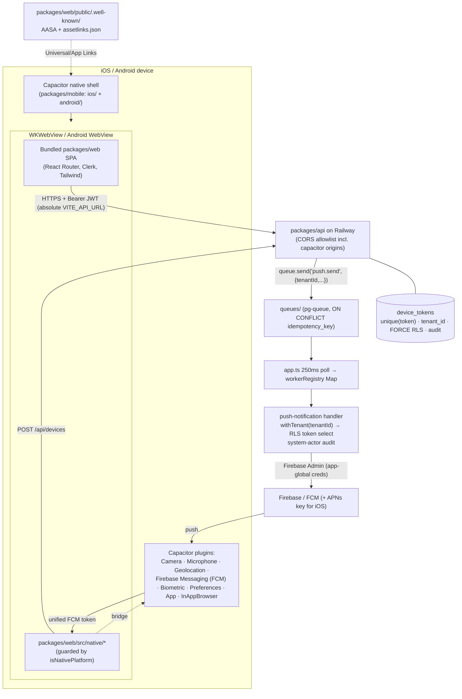

# feat: Native iOS + Android apps (Capacitor) for App Store & Play Store

**Created:** 2026-06-14
**Reviewed:** 2026-06-14 — adversarial deepening pass (codebase verification
+ external research) folded in; see "Deepening pass" below and *Sources*.
**Depth:** Deep
**Status:** plan

## Summary
Package the existing Rivet web product (`packages/web` — a Vite/React SPA)
as native **iOS and Android** apps using **Capacitor**, so the same 40+
screens ship to the Apple App Store and Google Play Store without a
rewrite. The first store-submittable release is **field-ready**: native
camera/microphone/geolocation, app branding, deep/universal links,
biometric app-lock, an offline draft/mutation queue, and push
notifications (new backend device-token store + worker-driven **unified
FCM** send). Releases are built, signed, and uploaded to TestFlight / Play
internal track via **Fastlane in GitHub Actions**.

## Deepening pass (2026-06-14)
This plan was adversarially reviewed against the real codebase and current
external docs before any code. Folded-in corrections (details inline in the
affected units):
- **Migrations are TypeScript entries** in `const MIGRATIONS` in
  `packages/api/src/db/schema.ts` (applied by `getMigrationSQL()` in
  insertion order), **not** loose `migrations/*.sql` files — those are
  legacy and never run. Next free key is ~`178`, not `109`.
- **Push credentials are app-global** (one Firebase service account / one
  APNs key), like SendGrid — **not** per-tenant like Twilio. Tenant
  isolation lives entirely in **RLS on `device_tokens` token selection**.
  Mirroring the per-tenant Twilio provider here would be insecure/wrong.
- **Use unified FCM** (`@capacitor-firebase/messaging`) so both platforms
  return one FCM token → a single backend FCM provider (Firebase Admin),
  with the APNs key uploaded to Firebase for iOS delivery. (Core
  `@capacitor/push-notifications` returns an APNs token on iOS, forcing a
  dual-provider backend.)
- **Worker RLS** is set by the repository via
  `PgBaseRepository.withTenant(tenantId)` (a `SET app.current_tenant_id` on
  a pooled connection, RESET on release), **not** by `tenant-transaction.ts`.
  The push worker must select tokens through `withTenant` and **never** via
  a raw `pool`/`withClient` connection.
- **The `WorkerRegistry` class is dead code**; queue handlers register in
  the `app.ts` `workerRegistry` **Map** keyed by job `type`. Copy a real
  queue handler (`transcript-ingestion-worker` / `image-post-process-worker`),
  not the `appointment-reminder-worker` `setInterval` sweep.
- **Clerk in a Capacitor WebView** has a documented production-only failure
  (iOS WebView → Safari redirect after auth). API calls are fine (Clerk
  Bearer JWT via `getToken({ template: 'serviceos' })`); the **OAuth
  redirect** is the risk. De-risk with a spike on a production-like build.
- **U7 cannot promise server-enforced "exactly once"** — there is no
  general client-idempotency-key middleware (only proposal execution has
  one). The offline queue must rely on **naturally-idempotent** PUT/PATCH
  plus client-side de-dup, and must **not** reuse `apiFetch`'s 401→`/login`
  redirect during background replay.

## Problem Frame
Today the product is web-only (static SPA behind nginx on Railway). Field
technicians and operators want an installable app from the stores, with
the reliability mobile web can't give: dependable mic/camera, push alerts
when a job/escalation lands, biometric lock on a shared device, and
graceful behavior on spotty job-site connectivity. We need real native
artifacts (`.ipa` / `.aab`) that pass store review and a repeatable way to
ship updates.

## Requirements
- **R1.** Produce installable native iOS and Android apps from the
  existing product, submittable to App Store and Play Store.
- **R2.** Reuse the `packages/web` React SPA — no screen rewrites; the web
  deploy stays unaffected.
- **R3.** App runs on-device against the production API with working Clerk
  login.
- **R4.** Native camera, microphone, and geolocation work on both
  platforms with correct OS permission prompts (more reliable than mobile
  web, esp. iOS WKWebView).
- **R5.** App branding: icons, splash, display name, notch/safe-area
  handling.
- **R6.** Deep/universal links open the app to the right screen (estimate,
  invoice, job).
- **R7.** Biometric (Face ID / Touch ID / fingerprint) app-lock, toggleable
  in settings.
- **R8.** Offline draft/mutation queue persists field actions and flushes
  on reconnect, in order.
- **R9.** Push notifications: device registration, **tenant-scoped** token
  store, worker-driven unified-FCM send, tap → deep link.
- **R10.** Automated CI builds + signs + uploads to TestFlight and Play
  internal track (Fastlane).
- **R11.** Honor repo invariants (RLS/`tenant_id`, audit events, UTC) on
  all new backend surfaces.

## Key Technical Decisions
- **Capacitor, not React Native or a PWA/TWA wrapper** — reuse the entire
  Vite/React SPA (40+ routes, Clerk, Tailwind 4) as one codebase. (RN
  rejected: re-implements every screen, two codebases. PWA/TWA rejected:
  fragile Apple acceptance, weaker native mic/camera.)
- **Bundle the built web assets into the app (`webDir`)**, not point the
  webview at the live Railway URL — a bundled shell loads/runs offline
  (required for the offline queue). Cost: each release ships a `packages/web`
  build snapshot, so web-only changes need a resubmission until OTA updates
  (deferred).
- **Native-aware React code lives in `packages/web/src/native/*` behind
  `Capacitor.isNativePlatform()` guards** so it bundles into the SPA and the
  web build is unaffected. `packages/mobile` holds only the native shell
  (`capacitor.config.ts`, generated `ios/`/`android/`, Fastlane, CI).
- **Absolute API base URL baked at build time for native** via the existing
  `VITE_API_URL` / `window.__APP_CONFIG__` seam (native has no nginx
  `env.js`). **CORS:** `config.CORS_ORIGIN` is a *single string* today
  (prod refuses literal `'true'`); to allow `capacitor://localhost`,
  `https://localhost`, `http://localhost` the API must switch
  `cors({ origin })` from a scalar to an **array/predicate allowlist**.
  Clerk's API auth is a Bearer JWT (`getToken({ template: 'serviceos' })`),
  not cookies, so credentialed-CORS to the capacitor origins is safe.
- **Clerk auth is gated by a production-like spike (do it first).** The
  in-WebView `@clerk/clerk-react` SDK has a documented prod-only iOS bug
  (WebView → Safari after auth); Clerk's v1 native SDKs are React-Native
  only and don't apply. Route OAuth through the **InAppBrowser** plugin with
  a custom-scheme return; email/password & email-code work in-WebView.
- **Push uses unified FCM** (`@capacitor-firebase/messaging`): one FCM token
  per device on both platforms → a single **app-global** FCM provider
  (Firebase Admin) on the backend; APNs auth key uploaded to Firebase for
  iOS delivery.
- **Push delivery is a new `PushDeliveryProvider` seam**, parallel to the
  SMS/email-only `MessageDeliveryProvider` (do not shoehorn into it). Copy
  the DI *shape* (interface + in-memory test double + prod impl swapped in
  `app.ts`), not the type. Credentials are **app-global env/secrets (like
  SendGrid)**, never per-tenant.
- **Migrations are TS entries in `MIGRATIONS` (`schema.ts`)**, next free key
  ~`178_create_device_tokens`. New table gets `ENABLE` **and** `FORCE ROW
  LEVEL SECURITY` (so the worker's owner connection is still policy-bound)
  + a `tenant_isolation` policy `USING (tenant_id =
  current_setting('app.current_tenant_id')::UUID)`.
- **`device_tokens` is unique on `token` (global), not `(tenant_id, token)`.**
  On register, upsert by `token` and overwrite `tenant_id`/`user_id`; on
  logout, delete the row. This prevents pushing tenant A's content to a
  device that has since logged into tenant B (RLS then never selects the
  moved token for tenant A).
- **Bundle identifier `com.rivet.app`, display name "Rivet"** (confirm
  reverse-DNS against a domain you control before reserving in the stores).

## Scope Boundaries
**In scope:** Capacitor scaffold + native projects; native runtime config &
auth in the webview; branding; native camera/mic/geolocation; deep/universal
links; biometric lock; offline draft/mutation queue; push notifications
(backend token store + unified-FCM send path + client); Fastlane + GitHub
Actions to TestFlight & Play internal track.

**Non-goals:**
- React Native rewrite or any second UI tree.
- Full offline **read** sync / local DB mirror — only an outbound
  **mutation/draft** queue (R8).
- iPad/tablet-optimized layouts beyond existing responsive behavior.
- Store **listing content** (screenshots, marketing copy, privacy-policy
  prose, data-safety questionnaire answers) — operational; the U10 runbook
  enumerates requirements but doesn't author them.
- Creating Apple/Google accounts, certificates, keystores, the Firebase
  project, APNs key, or FCM service account — operational prerequisites
  (see Risks & Dependencies).

### Deferred to follow-up work
- **OTA web updates** (Capgo / Ionic Appflow) so web-only fixes ship without
  a store resubmission. High value given the bundled-assets decision.
- Full offline read caching / conflict resolution beyond the mutation queue.
- In-app "update available" prompts.
- Deleting the dead `WorkerRegistry` class is captured under U8 hygiene, not
  a separate effort.

## Repository invariants touched
- **RLS + `tenant_id`:** `device_tokens` carries `tenant_id UUID NOT NULL
  REFERENCES tenants(id)` with **`ENABLE` + `FORCE ROW LEVEL SECURITY`** and
  a `tenant_isolation_device_tokens` policy. **Request paths** get the
  tenant GUC via the existing `withTenantTransaction(pool)` middleware;
  the **worker send path** gets it via `PgBaseRepository.withTenant(tenantId)`
  (sets `app.current_tenant_id` on a pooled connection, RESET on release) —
  **not** `tenant-transaction.ts`, and never a raw `pool`/`withClient`.
- **Audit events:** device **register** and **unregister** emit via
  `auditRepo.create(createAuditEvent({ tenantId, actorId, actorRole,
  eventType, entityType, entityId, ... }))` using `req.auth` for the actor.
  The **push-send** audit runs in a worker with no `req.auth`, so it must
  supply a **system actor** (e.g. `actorId: 'system'`, `actorRole:
  'system'`) — `createAuditEvent` throws on a falsy `actorId`.
- **UTC:** `device_tokens` timestamps are `TIMESTAMPTZ NOT NULL DEFAULT
  NOW()`.
- **Zod validation:** `POST /api/devices` validates `req.body` inline via
  `schema.parse(...)` (→ `toErrorResponse`), schema typed in
  `packages/shared/src/contracts/devices.ts`.
- **Integer cents / LLM gateway / catalog & entity resolver /
  human-approval / no-auto-execute:** not on this path. Push payloads carry
  no cross-tenant data — tokens are RLS-filtered by tenant before send.

## High-Level Technical Design

**Milestones (sequencing):**
- **A — Real installable app:** U1, U2, U3.
- **B — Field features:** U4, U5, U6, U7.
- **C — Push:** U8 (backend) → U9 (client).
- **D — Release pipeline:** U10.

## Implementation Units

### U1. Capacitor scaffold + native iOS/Android projects
- **Goal:** A `packages/mobile` package that wraps the built `packages/web`
  SPA in native iOS and Android projects that compile and launch.
- **Requirements:** R1, R2.
- **Dependencies:** none.
- **Environment note:** generating/building the native projects requires a
  **Mac (Xcode/CocoaPods)** and the **Android SDK** — not available in the
  CI/dev Linux container; do this unit on a developer Mac.
- **Files:**
  - `packages/mobile/package.json` (Capacitor deps, `cap:sync` / build scripts)
  - `packages/mobile/capacitor.config.ts` (appId `com.rivet.app`, appName
    `Rivet`, `webDir` → copied web build; custom scheme for deep links/OAuth)
  - `packages/mobile/ios/` and `packages/mobile/android/` (generated, committed)
  - `packages/mobile/scripts/sync-web.mjs` (build `packages/web`, copy
    `dist/` into the Capacitor `webDir`)
  - `packages/mobile/README.md` (relationship to `packages/web`; states this
    IS production, not quarantined like `/experiments`)
  - Root workspace config update so `packages/mobile` is recognized.
- **Approach:** Add Capacitor core/CLI + iOS/Android platforms. `webDir`
  points at what `sync-web.mjs` populates from `packages/web`'s `vite build`
  output. No live-URL `server.url` — assets are bundled. Commit the
  generated native projects so CI/contributors share one shell. Single
  source of truth for appId/appName/version in `capacitor.config.ts`.
- **Patterns to follow:** existing monorepo package layout
  (`packages/web/package.json`, `packages/shared/package.json`); the
  `/experiments/README.md` purpose-statement convention (inverted here).
- **Test scenarios:** `Test expectation: none — scaffolding/native config.`
- **Verification:** `sync-web` populates `webDir`; `npx cap sync` succeeds;
  iOS archives in Xcode, Android assembles a debug build; app launches to
  the Rivet login screen in simulator/emulator.

### U2. Native runtime config, webview routing & Clerk auth
- **Goal:** The bundled app reaches the production API and completes Clerk
  login from inside the native webview.
- **Requirements:** R2, R3.
- **Dependencies:** U1.
- **Files:**
  - `packages/web/src/native/capacitorEnv.ts` (+ `capacitorEnv.test.ts`) —
    `isNativePlatform()` + absolute API base-URL resolution for native.
  - `packages/web/src/lib/runtimeConfig.ts` *(existing)* — honor a baked
    `VITE_API_URL` when there's no runtime `env.js`.
  - `packages/web/src/lib/apiClient.ts` / `packages/web/src/utils/api-fetch.ts`
    *(existing)* — resolve against the absolute base on native, not `/api`.
  - `packages/web/.env.mobile.example` — `VITE_API_URL`,
    `VITE_CLERK_PUBLISHABLE_KEY` for native builds.
  - `packages/web/src/main.tsx` *(existing)* — Clerk config for the native
    origin; OAuth via InAppBrowser + custom-scheme return.
  - `packages/api/src/app.ts` (`cors(...)` at ~591) + `packages/api/src/shared/config.ts`
    (`CORS_ORIGIN`) — switch the scalar origin to an **array/predicate
    allowlist** adding the three capacitor origins. (+ API CORS test.)
- **Approach:** Bundled assets are served from `capacitor://localhost`
  (iOS) / `https://localhost` (Android), so relative `/api` would hit the
  webview origin — the API base URL **must be absolute** on native (baked
  via `VITE_API_URL`). React Router history routing works in the webview.
  **Clerk (gating risk):** API calls use a Bearer JWT and are unaffected by
  the origin; the failure mode is the **OAuth redirect** (documented iOS
  WebView → Safari, prod-only). Run a **spike on a production-like build
  first** before building dependent units; wire OAuth through the
  InAppBrowser plugin with a custom-scheme return; email-code/password work
  in-WebView. The CORS change is mandatory (prod refuses `origin: 'true'`),
  so use an array/predicate, not the current scalar.
- **Patterns to follow:** existing `runtimeConfig`/`window.__APP_CONFIG__`
  loading; `cors(...)` setup in `app.ts`; the 401→`/login` retry in
  `api-fetch.ts`.
- **Test scenarios:**
  - Happy path (unit): native resolves the absolute `VITE_API_URL`; web
    falls back to runtime config/relative.
  - Edge: missing `VITE_API_URL` in a native build surfaces a clear startup
    error, not a silent call to the webview origin.
  - API (unit/integration): `Origin: capacitor://localhost` passes the new
    allowlist; a disallowed origin is rejected; prod config rejects `'true'`.
  - Manual/verification (Mac/device): Clerk email-code and OAuth login
    complete on a production-like iOS + Android build.
- **Verification:** On-device, login succeeds and authenticated data loads
  from the production API; no CORS/mixed-origin/Safari-bounce errors.

### U3. App branding: icons, splash, safe-area
- **Goal:** Store-grade icons, splash screens, display name, and correct
  notch/status-bar handling.
- **Requirements:** R5.
- **Dependencies:** U1.
- **Files:**
  - `packages/mobile/resources/icon.png`, `.../splash.png` + generated
    platform sets under `ios/`/`android/`.
  - `packages/web/public/` — favicon / `apple-touch-icon` for parity.
  - `packages/web/src/index.css` *(existing)* — `env(safe-area-inset-*)`
    padding + status-bar handling.
  - `packages/mobile/capacitor.config.ts` *(existing)* — splash/status-bar
    plugin config.
- **Approach:** Generate every required size from one source icon/splash; add
  safe-area padding so chrome clears the notch/home indicator; per-platform
  display name "Rivet".
- **Patterns to follow:** existing Tailwind theme + `.mobile-tech-view`
  rules in `packages/web/src/index.css`.
- **Test scenarios:**
  - Mobile UI: jsdom class-contract test that app chrome applies safe-area
    padding (no content under the notch).
  - Playwright at 320px: no horizontal overflow; header clears the status
    bar (pattern: `e2e/estimate-approval-mobile.spec.ts`).
  - Otherwise `Test expectation: none — image assets / native config.`
- **Verification:** Icon/splash render on both simulators; on a notched
  device top/bottom controls are fully tappable and unclipped.

### U4. Native camera, microphone & geolocation
- **Goal:** Use Capacitor plugins on native (instead of browser
  `getUserMedia`/geolocation) so capture is reliable and OS prompts fire.
- **Requirements:** R4.
- **Dependencies:** U2.
- **Files:**
  - `packages/web/src/native/nativeCapture.ts` (+ `nativeCapture.test.ts`) —
    platform-guarded selection: native plugin on Capacitor, existing web API
    otherwise.
  - `packages/web/src/components/voice/useVoiceRecorder.ts` *(existing)* —
    route audio through `nativeCapture` on native.
  - `packages/web/src/components/shared/CameraCapture.tsx`,
    `.../jobs/JobPhotoUploader.tsx`, `.../attachments/CaptureSheet.tsx`
    *(existing)* — route capture through `nativeCapture`; keep the presign →
    S3 PUT → attach pipeline unchanged.
  - `packages/web/src/pages/technician/TechnicianDayView.tsx` *(existing)* —
    Geolocation plugin on native.
  - `packages/web/src/components/shared/VoiceBar.tsx` *(existing)* — drop the
    "iOS Safari foreground" warning on native.
  - iOS `Info.plist` (`NSCameraUsageDescription`,
    `NSMicrophoneUsageDescription`, `NSLocationWhenInUseUsageDescription`) +
    Android manifest permissions under `packages/mobile/ios/`/`android/`.
- **Approach:** A thin capability layer returns the native implementation
  under `isNativePlatform()`, else the current web one — minimal call-site
  change, web build untouched. Per Code Hygiene, fully route each switched
  call site (no half-wired web+native branch, no stub plugin). Provide
  review-friendly usage-description strings.
- **Patterns to follow:** existing capture components + presign/upload
  clients (`packages/web/src/api/job-photos.ts`, `.../attachments.ts`);
  codec detection in `VoiceBar.tsx`.
- **Test scenarios:**
  - Happy path (unit): native impl under `isNativePlatform()`, web impl
    otherwise.
  - Edge: permission denied → prompt to enable in OS settings (not silent).
  - Error: cancelled capture returns cleanly, no lingering recording state.
  - Manual/verification (device): photo, video, voice, geolocation on iOS +
    Android; uploads still flow through presign.
- **Verification:** On-device prompts appear once, capture succeeds, an
  uploaded job photo appears server-side.

### U5. Deep links & universal/app links
- **Goal:** Tapping a Rivet link opens the app to the matching screen; a
  custom scheme also works (and backs the Clerk OAuth return from U2).
- **Requirements:** R6.
- **Dependencies:** U2. (Final file contents depend on signing identities
  from U10.)
- **Files:**
  - `packages/web/src/native/deepLinks.ts` (+ `deepLinks.test.ts`) — parse an
    inbound URL → a React Router path; subscribe to Capacitor `App`
    `appUrlOpen`.
  - `packages/web/src/main.tsx` / app shell *(existing)* — register the
    listener on native startup and navigate.
  - `packages/web/public/.well-known/apple-app-site-association` (JSON, no
    extension) — Team ID + bundle ID.
  - `packages/web/public/.well-known/assetlinks.json` — package name +
    signing SHA-256.
  - `packages/web/nginx.conf.template` *(existing)* — serve `/.well-known/*`
    as `application/json`, not SPA-fallback-rewritten.
  - iOS Associated Domains entitlement + Android intent filters under
    `packages/mobile/ios/`/`android/`.
- **Approach:** Map existing public/link routes (`/e/:id`, `/pay/:id`,
  jobs/invoices) to in-app navigation. Land the well-known files with
  placeholder Team ID / SHA-256; fill real values once U10 establishes
  signing identities (note this dependency inline). The custom scheme (e.g.
  `rivet://`) is shared with the Clerk OAuth return (U2) — register it once.
- **Patterns to follow:** public route defs in `packages/web/src/routes.ts`;
  existing nginx static handling.
- **Test scenarios:**
  - Happy path (unit): `https://<domain>/e/<id>` and `rivet://e/<id>` both
    parse to the estimate route; foreign hosts ignored.
  - Edge: link received while logged-out routes through login then back
    (existing `?redirect=` pattern).
  - Integration: served AASA + `assetlinks.json` return 200 +
    `application/json` + valid structure.
  - Error: malformed URL → no-op, no crash.
- **Verification:** Tapping a real link opens the correct screen on both
  platforms; files validate with Apple/Google link tools.

### U6. Biometric app-lock
- **Goal:** Optional Face ID / Touch ID / fingerprint gate that locks on
  resume, controlled by a settings toggle.
- **Requirements:** R7.
- **Dependencies:** U2.
- **Files:**
  - `packages/web/src/native/biometricLock.tsx` (+ `biometricLock.test.tsx`)
    — lock-state machine + gate overlay.
  - `packages/web/src/components/settings/` *(existing)* — "Require biometric
    unlock" toggle; persist via Capacitor Preferences.
  - `packages/web/src/main.tsx` / app shell *(existing)* — mount the gate;
    re-lock on `App` resume when enabled.
- **Approach:** On native + toggle-on, show a blocking overlay on cold start
  and resume; a successful biometric check (device-passcode fallback) clears
  it. No-op on web / toggle-off. Store only the boolean preference — no
  secrets; Clerk still owns the session.
- **Patterns to follow:** existing settings toggles; preference persistence
  (`useConversationDraft.ts`) — but Capacitor Preferences on native.
- **Test scenarios:**
  - Happy path (unit): toggle on → gated on resume; success → cleared.
  - Edge: toggle off → never gated; biometric unavailable → passcode
    fallback or hidden with explanation.
  - Error: failed/cancelled auth keeps it locked (no bypass).
  - Mobile UI: jsdom class-contract test that the unlock control is ≥44px
    (`min-h-11`).
- **Verification:** On-device, enabling gates on resume and Face
  ID/fingerprint unlocks; disabling removes the gate.

### U7. Offline draft/mutation queue
- **Goal:** Field actions taken offline persist and flush, in order, on
  reconnect — without double-writes and without bouncing the user to login.
- **Requirements:** R8.
- **Dependencies:** U2 (and U4 for media payloads).
- **Files:**
  - `packages/web/src/native/offlineQueue.ts` (+ `offlineQueue.test.ts`) —
    durable FIFO queue with retry/backoff and client-side de-dup;
    **metadata in Capacitor Preferences, media blobs in Filesystem**.
  - `packages/web/src/native/connectivity.ts` (+ test) — online/offline via
    the Capacitor `Network` plugin; triggers flush.
  - `packages/web/src/utils/api-fetch.ts` *(existing)* — on native network
    failure for whitelisted **naturally-idempotent** mutations, enqueue
    instead of hard-failing.
  - `packages/web/src/components/` *(existing shell)* — an "offline — N
    pending" indicator.
- **Approach:** Restrict the queue to **naturally-idempotent** operations
  (PUT/PATCH status, attachment-metadata updates, draft saves) — the server
  has **no general client-idempotency-key middleware** (only proposal
  execution does), so non-idempotent POSTs must be **excluded** or made
  naturally idempotent; "exactly once" is achieved by last-write-wins +
  client-side de-dup, not a server guarantee. **Flush gating is its own
  path, not `apiFetch`'s:** on reconnect, confirm connectivity **and**
  acquire a fresh Clerk token (`getToken`) before replay; tokens are
  short-lived and refresh needs network, so on token-fetch failure **keep
  the entry queued and retry later** — do **not** fall through to
  `api-fetch.ts`'s 401→`/login` redirect (disruptive mid-flush). Replay in
  enqueue order with exponential backoff; on a **permanent 4xx**, drop and
  surface, and skip-and-continue so one bad entry doesn't head-of-line-block
  the rest. Media blobs re-attach via the existing presign pipeline on flush.
  Tests are the primary proof here, not the UI.
- **Patterns to follow:** `useConversationDraft.ts` persistence; the presign
  → PUT → attach flow; the token getter in `AuthTokenBridge.tsx` (but
  acquire-or-requeue, not redirect).
- **Test scenarios:**
  - Happy path: offline PUT status → enqueued; reconnect (token OK) →
    replayed once and removed.
  - Edge: ordering preserved; app restart while offline preserves the queue.
  - Edge: **stale/expired token at flush** → entry stays queued and retries;
    **no `/login` redirect**.
  - Edge: client-side de-dup drops a duplicate enqueue.
  - Error: permanent 4xx on replay is dropped + surfaced; 5xx/network retries
    with backoff to a cap; a stuck entry is skipped, others proceed.
  - Integration: a queued job-photo flushes through the real presign/attach
    path (assert the upload sequence across the network transition).
- **Verification:** In airplane mode a tech marks a job and adds a photo; on
  reconnect both land server-side once, in order, with no login bounce.

### U8. Push notifications — backend (device tokens + unified-FCM send)
- **Goal:** A tenant-scoped device-token store, a registration API, and a
  worker-driven **unified-FCM** send path — on the real migration/queue/RLS/
  audit seams, with **app-global** push credentials.
- **Requirements:** R9, R11.
- **Dependencies:** none (backend can proceed in parallel; U9 consumes it).
- **Files:**
  - `packages/api/src/db/schema.ts` *(existing)* — add a
    **`MIGRATIONS['178_create_device_tokens']`** entry (confirm next free key
    against the `MIGRATIONS` keys, currently topping out at `177`). Columns:
    `id UUID PK DEFAULT gen_random_uuid()`, `tenant_id UUID NOT NULL
    REFERENCES tenants(id)`, `user_id`, `platform` (`ios`|`android`),
    `token` (**UNIQUE**), `last_seen_at`, `created_at`/`updated_at`
    `TIMESTAMPTZ NOT NULL DEFAULT NOW()`; index on `tenant_id`; `ENABLE` +
    `FORCE ROW LEVEL SECURITY`; plain `CREATE POLICY tenant_isolation_device_tokens
    ... USING (tenant_id = current_setting('app.current_tenant_id')::UUID)`
    (`getMigrationSQL()` auto-rewrites to DROP+CREATE — do **not** add a
    loose `migrations/*.sql` file; those don't run).
  - `packages/api/src/devices/device-token-repository.ts` (+
    `__tests__/device-token-repository.test.ts`) — extends
    `PgBaseRepository`; `upsertByToken` (overwrite `tenant_id`/`user_id`,
    bump `last_seen_at`), `listByTenant(tenantId)` and `deleteToken`, all
    wrapped in `withTenant(...)`. Never use raw `pool`/`withClient`.
  - `packages/api/src/routes/devices.ts` (+ test) — `createDevicesRouter(deps)`
    returning a Router; `POST /api/devices` (register/upsert) + `DELETE
    /api/devices/:token` (unregister/logout); chain `requireAuth,
    requireTenant`; tenant from `req.auth!.tenantId` (not body); Zod
    `schema.parse(req.body)` → `toErrorResponse`; emit register/unregister
    audit with the `req.auth` actor.
  - `packages/api/src/app.ts` *(existing)* — `app.use('/api/devices',
    createDevicesRouter({ deviceTokenRepo, auditRepo }))` near the other
    `/api/*` mounts; register the push queue handler in the **`workerRegistry`
    Map** (`workerRegistry.set('push.send', handler)`). **Delete the unused
    `WorkerRegistry` class** in `packages/api/src/workers/worker-registry.ts`
    (re-grep first — it's dead code; hygiene).
  - `packages/api/src/notifications/push-delivery-provider.ts` (+ test) — new
    `PushDeliveryProvider` interface (`sendPush(token, payload)`), a
    **Firebase Admin** prod impl using **app-global** credentials, and an
    in-memory test double swapped in `app.ts`. (Do **not** implement
    `MessageDeliveryProvider`; do **not** use per-tenant Twilio cred logic.)
  - `packages/api/src/workers/push-notification-worker.ts` (+
    `__tests__/push-notification-worker.test.ts`) — a `WorkerHandler`
    (`{ type: 'push.send', handle }`) that loads tenant tokens via
    `deviceTokenRepo.listByTenant(tenantId)` (RLS via `withTenant`), sends
    via the provider, prunes dead tokens (FCM `NotRegistered`/`Unregistered`),
    and writes a **system-actor** audit. `auditRepo`/`deviceTokenRepo`/
    provider injected as deps.
  - `packages/shared/src/contracts/devices.ts` — Zod schema + types for the
    registration payload and the `push.send` job.
  - App-global FCM config (Firebase service account) injected from
    env/secrets — analogous to **SendGrid** (global), not Twilio.
- **Approach:** Register upserts by `token` (global unique), overwriting
  `tenant_id`/`user_id` so a device that switches tenants stops receiving the
  old tenant's pushes (RLS won't select the moved token). Sends are
  **enqueued** (`queue.send('push.send', { tenantId, ... }, idempotencyKey)`
  — `pg-queue` dedups on `idempotency_key`) and run in the worker, never
  inline. The worker establishes the tenant GUC through the repo's
  `withTenant`; token selection is therefore RLS-scoped to the originating
  tenant. Pin the RLS guarantee with the integration test.
- **Patterns to follow:** an existing **queue handler**
  (`transcript-ingestion-worker.ts` / `image-post-process-worker.ts`) — not
  the `appointment-reminder-worker` sweep; `PgBaseRepository.withTenant`;
  `audit/audit.ts` `createAuditEvent`; route shape from
  `routes/technician-location.ts` / `routes/me.ts`; existing `queue.send(`
  call sites (`routes/jobs.ts`, `attachment-service.ts`); **SendGrid**
  global-credential injection (not Twilio).
- **Test scenarios:**
  - Happy path (unit): register upserts; duplicate token bumps
    `last_seen_at`, no new row.
  - Unit: a token re-registered under tenant B has its `tenant_id` overwritten
    (no orphan row left for tenant A).
  - Unit: send selects only the caller tenant's tokens; payload carries no
    cross-tenant fields; a **system-actor** audit is emitted (mocked
    provider/repo).
  - Error (unit): FCM `NotRegistered`/`Unregistered` prunes the token;
    provider failure is retried/dead-lettered per queue conventions.
  - **Integration (Docker-gated, `packages/api/test/integration/device-tokens.test.ts`):**
    pins real columns + RLS — insert under tenant A, confirm tenant B cannot
    select it; confirm a worker-style `withTenant(B)` read does not see A's
    token; verify the `UNIQUE(token)` constraint, FORCE-RLS isolation, and
    UTC timestamps. (Mocked-DB is not sufficient proof.)
- **Verification:** `cd packages/api && npx tsc --project tsconfig.build.json
  --noEmit` clean; the integration test proves RLS isolation + cross-tenant
  token move + real columns; the unit send path delivers to a mocked Firebase
  Admin and writes a system-actor audit.

### U9. Push notifications — client (register, receive, tap → deep link)
- **Goal:** The app obtains a unified FCM token, registers it with the
  backend, and handles foreground/background notifications including
  tap-to-open.
- **Requirements:** R9.
- **Dependencies:** U8 (endpoint), U5 (deep-link routing), U2.
- **Files:**
  - `packages/web/src/native/pushClient.ts` (+ `pushClient.test.ts`) — via
    **`@capacitor-firebase/messaging`**: request permission, obtain the
    unified FCM token, `POST /api/devices`, route taps through the U5
    deep-link handler, and `DELETE /api/devices/:token` on logout.
  - `packages/web/src/main.tsx` / app shell *(existing)* — initialize the
    push client **after Clerk auth** on native.
  - iOS push capability + background modes, Android notification config, and
    `google-services.json` / Firebase plist under
    `packages/mobile/ios/`/`android/`.
- **Approach:** Register only after login (tokens are tenant/user-scoped
  server-side). Foreground notification → Sonner toast; background tap →
  deep-link parser. Token is an FCM token on **both** platforms (unified).
  Guard everything behind `isNativePlatform()` — no-op on web.
- **Patterns to follow:** existing Sonner usage; the U5 deep-link parser; the
  API client for register/unregister.
- **Test scenarios:**
  - Happy path (unit, mocked Firebase Messaging plugin): permission granted →
    FCM token → `POST /api/devices` with `platform` + token.
  - Edge: permission denied → app continues, no registration, no crash;
    re-login re-registers; logout calls `DELETE`.
  - Happy path (unit): a tap with a deep-link payload navigates correctly.
  - Error: registration POST failure retries (or enqueues via U7) and logs.
  - Manual/verification (device): a real push from U8 arrives on iOS +
    Android and the tap opens the linked screen.
- **Verification:** On-device, the app registers a token (row in
  `device_tokens`), receives a test push, and the tap deep-links correctly.

### U10. Fastlane + GitHub Actions release pipeline
- **Goal:** CI builds, signs, and uploads iOS to TestFlight and Android to
  the Play internal track, with a documented release runbook.
- **Requirements:** R10, R1.
- **Dependencies:** U1–U9 buildable (minimally U1–U3); finalizes the signing
  identities U5's well-known files need.
- **Files:**
  - `packages/mobile/fastlane/Fastfile` — `ios beta` (build, sign,
    TestFlight) and `android internal` (build `.aab`, sign, Play internal)
    lanes; auto-increment build numbers.
  - `packages/mobile/fastlane/Appfile`, `Matchfile`/`Gymfile` as needed.
  - `.github/workflows/mobile-release.yml` — `sync-web` → `cap sync` →
    Fastlane on tag/dispatch (iOS lane needs a macOS runner); signing secrets
    from GitHub Actions secrets.
  - `docs/runbooks/mobile-release.md` — prerequisites (accounts, bundle IDs,
    **Firebase project + APNs key uploaded to Firebase + FCM service
    account**, certs/keystore); how to cut a release; the **store-review
    checklist**: privacy-policy URL; mic/camera/location usage strings;
    Apple data-collection + Google data-safety disclosures; a **reviewer
    demo login** (the app is login-gated — provide working creds and any 2FA
    notes); "not just a website" justification via U4–U9 native features.
  - Update `packages/web/public/.well-known/*` (from U5) with the real Team
    ID and signing SHA-256.
- **Approach:** Keep secrets out of the repo (Actions secrets and/or Fastlane
  match). The web build is produced in CI and bundled before `cap sync` so
  the shipped app matches a known web commit. Start with TestFlight / Play
  internal (not production rollout) to de-risk first submissions.
- **Test scenarios:** `Test expectation: none — CI/build configuration.`
- **Verification:** A tagged run produces a signed `.ipa` to TestFlight and a
  signed `.aab` to Play internal; a second person can cut a release from the
  runbook unaided.

## Risks & Dependencies
- **Clerk OAuth inside the WebView (highest risk).** Documented iOS WebView →
  Safari redirect that appears **in production but not dev**; spike on a
  production-like build first, route OAuth through InAppBrowser + custom
  scheme, and have a fallback (Clerk token flow / external-browser handoff).
  API Bearer-JWT calls are unaffected.
- **Push credential scope.** Push creds are **app-global** (one Firebase
  service account / one APNs key uploaded to Firebase). Copying the
  per-tenant Twilio provider would be insecure and wrong — tenant isolation
  is RLS on `device_tokens` only.
- **Dead `WorkerRegistry` class.** Registering a handler against it would
  silently never run; register in the `app.ts` `workerRegistry` Map and
  delete the dead class.
- **Offline replay auth.** Clerk tokens are short-lived and refresh needs
  network; the flush path must acquire-or-requeue, never the 401→`/login`
  redirect.
- **Apple review Guideline 4.2 ("just a website").** Mitigated by genuine
  native features (push, biometric, camera, mic, geolocation, offline) — make
  them prominent; supply a reviewer demo account.
- **Bundled-assets trade-off.** Web-only changes need a resubmission until
  OTA updates (deferred).
- **Well-known fingerprint chicken-and-egg.** AASA/assetlinks contents depend
  on signing identities (U5 placeholders → U10 fills them).
- **Build environment.** iOS requires macOS (Xcode/CocoaPods); Android
  requires the Android SDK — neither is in the dev/CI Linux container, so
  U1/U3 native generation, on-device verification (U4/U6/U9), and U10 run on
  a Mac / macOS CI runner.
- **Operational prerequisites (external; block U10 submission, not the
  code):** Apple Developer Program ($99/yr) + App Store Connect app; Google
  Play Developer ($25) + Play Console app; iOS distribution cert +
  provisioning profile; Android upload keystore; **a Firebase project with
  the APNs auth key uploaded + an FCM service account**; a domain you control
  for Universal/App Links (the existing web domain).

## Open Questions (deferred to implementation)
- Exact next free `MIGRATIONS` key in `schema.ts` (≈`178`) and the precise
  existing table to mirror for `device_tokens` shape.
- Final Clerk-in-Capacitor wiring (InAppBrowser OAuth vs. token flow) —
  resolved by the U2 spike against a production-like build.
- Final bundle identifier / display name and the Universal-Link domain.
- The exact whitelist of mutations safe for the offline queue (U7) —
  naturally-idempotent only; enumerate against the mutation surface and keep
  strict.
- Confirm deletion of the dead `WorkerRegistry` class as part of U8 (re-grep
  for any late callers first).

## Sources & Research
External research was load-bearing (it changed U2's mitigation and U8/U9's
provider design):
- Clerk iOS WebView → Safari redirect after auth (prod vs dev) —
  https://forum.ionicframework.com/t/ios-webview-redirects-to-safari-after-clerk-authentication-production-vs-development-issue/248720
- Clerk iOS/Android SDK v1 (React-Native native SDKs; not the WebView path) —
  https://clerk.com/changelog/2026-02-10-ios-android-sdk-v1
- Capacitor InAppBrowser plugin —
  https://capacitorjs.com/docs/apis/inappbrowser
- Capacitor push: iOS returns an APNs token, not FCM —
  https://forum.ionicframework.com/t/capacitor-push-notifications-is-not-giving-apns-token-on-ios-instead-giving-fcm-token/242097
- Unified FCM via `@capacitor-firebase/messaging` —
  https://dev.to/saltorgil/the-complete-guide-to-capacitor-push-notifications-ios-android-firebase-bh4
- Capacitor Push Notifications (Firebase) guide —
  https://capacitorjs.com/docs/guides/push-notifications-firebase

Codebase verification (this repo) confirmed the migration mechanism
(`MIGRATIONS` in `schema.ts`), worker RLS via `PgBaseRepository.withTenant`,
the dead `WorkerRegistry` class, the SMS/email-only `MessageDeliveryProvider`,
the scalar `CORS_ORIGIN`, the `createAuditEvent` actor requirement, and the
absence of general client-idempotency support.
