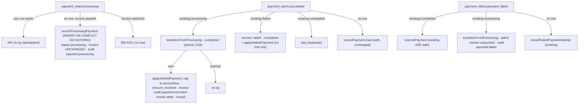

# feat: One-Time ACH Processing Lifecycle (E2a)

**Created:** 2026-06-14
**Depth:** Deep (4 units) — **high-risk: modifies the shared payment/money path**.
**Status:** plan (deepened 2026-06-14 — adversarial money-path review folded in)
**Parent:** `docs/plans/2026-06-14-001-feat-prd-gap-closure-roadmap-plan.md` → Wave 1 epic **E2** (stage **2a**).

## Summary
Make one-time ACH a **first-class, owner-visible** payment on the existing hosted invoice flow. ACH eligibility and settlement already work (Stripe `automatic_payment_methods` + the `payment_intent.succeeded` handler), but the 1–4 business-day ACH **"processing" window is invisible** (`payment_intent.processing` unhandled; domain `PaymentStatus` lacks `'processing'`). This adds the processing→settled→failed lifecycle at the **payment level** (invoice stays `open` until funds clear), surfaces "ACH processing" to owner and customer, and — the load-bearing part — makes settlement **upgrade** the in-flight payment via an **atomic, race-safe, idempotent** path that reproduces *every* effect a normal settled payment has.

## Problem Frame
PRD §5/§6.5 claim ACH parity. Verified 2026-06-14: the PaymentIntent flow (`stripe-payment-intent.ts:80`) enables ACH by code; `webhooks/routes.ts:1079` settles and marks the invoice paid; NSF returns reverse it — so **money correctness holds today**. The gap is **visibility** during the multi-day processing window, where the owner (who runs the business from the digest/dashboard) sees nothing. Closing it safely is delicate because the settlement path is the *shared* money path that card payments use.

## Requirements
- **R1.** ACH processing records a first-class `processing` payment (provider_reference set) **without** marking the invoice paid or firing the receipt.
- **R2.** Settlement (`payment_intent.succeeded`) **upgrades** an existing `processing` payment to `completed` (never a duplicate), then applies invoice + receipt + money-state.
- **R3.** Failure before settlement transitions `processing`→`failed`; invoice untouched. Post-settlement NSF still reverses via the existing path.
- **R4.** Customer portal and owner invoice view show "ACH processing (clears in 1–4 business days)" while in flight.
- **R5.** Idempotent and order-tolerant across every delivery order/duplicate of {processing, succeeded, failed}; `recordPayment`'s card-path behavior is **unchanged**.
- **R6.** Integer cents; every transition emits an audit event; all queries tenant-scoped under RLS.
- **R7 (deepening).** Settlement is **money-safe**: it caps the applied amount to the invoice's *current* `amountDueCents`, settles using Stripe's authoritative `amount_received`, and treats an already-paid/void/canceled invoice as an idempotent no-op — **no over-collection**.
- **R8 (deepening).** Settlement reproduces **all** settled-money effects `recordPayment` performs — invoice balance/status, the **same** audit event types the card path emits (`payment.recorded` + conditional `invoice.status_changed`), the **`refreshJobMoneyStateSafe` money-state rollup**, and the **receipt notifier**. No ACH-only divergence.
- **R9 (deepening).** Payment rows are unique per `(tenant, provider_reference)` and all transitions out of `processing` are **atomic CAS** — no duplicate, orphan, or phantom-paid states under concurrent/out-of-order webhooks.

## Key Technical Decisions
- **Represent ACH-in-flight at the PAYMENT level (`status='processing'`), not a new invoice status.** Invoice stays `open` until settlement; owner sees a processing *payment*. The payments `status` CHECK **already permits `'processing'`** (`schema.ts:681`), so no status migration. *(Alt: an `invoice.status='payment_processing'` — rejected; ripples across filters/money-dashboard/money-state/UI.)*
- **Ship the missing `provider_reference` uniqueness; the in-code comments claiming it exists are FALSE.** There is **no** unique index on `payments.reference_number` today (`payment.ts:140` and `pg-payment.ts:90` assert one that was never created; `findByProviderReference` even does `ORDER BY paid_at DESC LIMIT 1` because dups are possible). E2a adds an **idempotent additive migration** creating a **partial unique index on `payments(tenant_id, reference_number) WHERE reference_number IS NOT NULL`**, with the standard duplicate-detection guard (detect pre-existing dupes → fall back to non-unique + `RAISE WARNING`, mirroring the migration-126/135 pattern), and **fixes the false comments**. `recordProcessingPayment` then inserts **`ON CONFLICT DO NOTHING`** rather than racy check-then-insert. *(This is the backstop the entire idempotency story rests on; the webhook-base dedup only keys on `(source, event_id)` and gives zero protection across the distinct processing/succeeded/failed event ids.)*
- **Settlement goes through an atomic CAS, then reproduces the full settled-money effect set.** Add `PaymentRepository.transitionFromProcessing(tenantId, id, toStatus, …)` = `UPDATE … SET status=$to … WHERE tenant_id AND id AND status='processing' RETURNING *` (null ⇒ row already left `processing` ⇒ terminal no-op, mirroring `reversePaymentAtomic`'s idempotency). Invoice/money-state/receipt effects run **only after** a winning CAS to `completed`. Extract a shared **post-create** helper (`applySettledPayment`: invoice balance+status via `applyPaymentToInvoice`, audit `payment.recorded`/`invoice.status_changed`, `refreshJobMoneyStateSafe`, receipt) used by **both** `recordPayment` and `settleProcessingPayment` so the card path is byte-identical and ACH cannot diverge. *(Alt: non-atomic read-then-`update()` — rejected; a settle+fail interleave yields a phantom-paid invoice. Alt: a new `payment.completed` audit type — rejected; breaks revenue consumers that filter `payment.recorded`.)*
- **Settlement re-applies `recordPayment`'s guards.** Re-read the invoice; cap the applied amount to current `amountDueCents`; use `amount_received` (authoritative settled figure) and reconcile the row's `amountCents`; treat non-payable/already-settled as idempotent ACK (200), not a throw. *(Prevents the over-collection scenario: ACH processing $500 → owner records $200 cash → ACH settles → applying full $500 to a $300-due invoice.)*
- **Full state machine keyed on the existing row's status, for both events.** `recordProcessingPayment` no-ops if **any** row exists for the provider_reference. `payment_intent.succeeded`: `completed`→skip · `processing`→settle (CAS) · `failed`→**recover** (flip the failed row to completed + apply, **not** a second row) · none→`recordPayment` (card path). *(Handles failed-before-succeeded, which today falls through and double-records.)*
- **Every webhook branch ACKs terminal conditions.** The new `payment_intent.processing` branch returns 200 + `webhookRepo.updateStatus(…,'processed')` on all non-exceptional paths, wrapping `ValidationError` mentioning `status`/`not found`/`exceeds` as idempotent success (mirroring the succeeded branch at `routes.ts:1136-1149`) — so a processing event for an already-paid/void invoice never 500s into a retry storm.

## Scope Boundaries
**In scope:** `PaymentStatus`+=`'processing'`; the partial-unique `provider_reference` migration + comment fix; `recordProcessingPayment` (ON CONFLICT), `applySettledPayment` shared helper, `settleProcessingPayment`, `failProcessingPayment`, atomic `transitionFromProcessing`; the three webhook branches with the full state machine + ACK semantics; portal + owner "ACH processing" surfacing; unit + webhook + Docker-gated integration tests.

**Non-goals (defer to E2b / Wave 3):** saved/recurring bank accounts, SetupIntent for `us_bank_account`, mandates, micro-deposit / Financial-Connections verification, embedded bank-entry UI; a new invoice lifecycle status; business-day settle-date math; the legacy `stripe-payment-link.ts` / `checkout.session.completed` (card-only here).

### Deferred to follow-up work
- Owner digest line "N ACH payments processing" (fold into E5 digest later).
- `estimatedSettleDate` computed field (ship static "1–4 business days" copy for 2a).

## Repository invariants touched
- **Integer cents** — amounts are integer cents; settlement uses `amount_received` and caps to `amountDueCents`.
- **`tenant_id` + RLS** — all reads/writes via tenant-scoped repo; the new unique index is `(tenant_id, reference_number)`.
- **Audit on every mutation** — `payment.processing` (record), `payment.recorded`+`invoice.status_changed` (settle, **same types as card**), `payment.failed` (processing-fail).
- **Webhook base (P0-014)** — new branch reuses dedup + `updateStatus('processed')`; terminal ValidationErrors ACK as success.
- **Migration discipline** — additive, idempotent, duplicate-guarded index migration (mirror migration-126/135); RLS unchanged.
- **No AI/proposals/catalog/entity-resolver/human-approval** — customer-initiated payment path.

## High-Level Technical Design

## Implementation Units

> DB-touching units require a Docker-gated integration test in `packages/api/test/integration/` (CLAUDE.md). The sandbox can't pull the pgvector testcontainer image (rate-limited), so integration tests are written here and run in **PR CI**; unit + webhook tests are the local proof.

### U1. Payment domain: `processing` status, provider_reference uniqueness, atomic transitions, shared settle
- **Goal:** Race-safe, money-complete domain support for an in-flight ACH payment that settles or fails without disturbing the card path.
- **Requirements:** R1, R2, R3, R5, R6, R7, R8, R9.
- **Dependencies:** none.
- **Files:**
  - `packages/api/src/db/schema.ts` — new migration: partial unique index `payments(tenant_id, reference_number) WHERE reference_number IS NOT NULL`, with duplicate-detection guard + `RAISE WARNING` fallback (mirror migration-126/135). Confirm `status` CHECK already includes `'processing'` (it does, line 681 — no status migration).
  - `packages/api/src/invoices/payment.ts` — `PaymentStatus` += `'processing'`; extract `applyPaymentToInvoice` (balance/status math) **and** a `applySettledPayment` helper (invoice update + audit `payment.recorded`/`invoice.status_changed` + `refreshJobMoneyStateSafe` + receipt) used by both `recordPayment` and settlement; refactor `recordPayment` to call them (behavior identical); add `recordProcessingPayment` (INSERT ON CONFLICT DO NOTHING; no invoice change; audit `payment.processing`); **fix the false provider_reference-uniqueness comment** (`payment.ts:140`).
  - `packages/api/src/payments/payment-service.ts` — `settleProcessingPayment(tenantId, providerReference, settledAmountCents,…)` (atomic CAS processing→completed; on win, re-read invoice, cap to `amountDueCents`, `applySettledPayment`; non-payable/already-settled ⇒ idempotent no-op) and `failProcessingPayment(tenantId, providerReference, reason,…)` (atomic CAS processing→failed; invoice untouched; audit). Mirror `reversePayment`.
  - `packages/api/src/invoices/pg-payment.ts` — add `transitionFromProcessing(tenantId, id, toStatus, extras) → Payment | null` (CAS `WHERE status='processing' RETURNING *`); make `recordProcessingPayment`'s insert ON CONFLICT DO NOTHING; **fix the false comment** (`pg-payment.ts:90`).
  - `packages/api/test/invoices/payment-ach-processing.test.ts` (new — unit, mocked repos, incl. settle+fail concurrency, money-state-called assertion, audit-type parity with card).
  - `packages/api/test/integration/payments-ach-processing.test.ts` (new — Docker-gated; the unique index rejects a duplicate provider_reference; processing→open, settle→paid, fail→open against real columns).
- **Approach:** The unique index makes inserts race-safe; `transitionFromProcessing` makes settle/fail mutually exclusive (a lost CAS returns null → no invoice effect). `applySettledPayment` guarantees ACH settlement and card capture run the identical settled-money effects (incl. money-state rollup + `payment.recorded` audit). `settleProcessingPayment` caps to current `amountDueCents` and uses `amount_received`.
- **Patterns to follow:** `recordPayment` (`payment.ts:200`), `reversePaymentAtomic` (`pg-payment.ts:278`), `incrementRefundAtomic`, `payment-audit.ts`.
- **Test scenarios:**
  - Happy: record processing → invoice `open`, audit `payment.processing`; settle → `completed`, invoice `paid`, **`refreshJobMoneyStateSafe` invoked**, receipt fired once, audit `payment.recorded` (same type as card).
  - Concurrency: settle + fail fired together → exactly one wins via CAS; invoice/payment/money-state stay consistent (no phantom-paid).
  - Over-collection guard (R7): processing $500 → external $200 payment → settle caps applied amount to remaining $300; no overshoot.
  - amount drift: `amount_received` differs from processing `pi.amount` → settle uses `amount_received`, reconciles the row.
  - Idempotency: duplicate processing insert blocked by the unique index (ON CONFLICT no-op); double-settle is a no-op.
  - Card regression: `recordPayment` output (balances/status/audit/money-state/receipt) identical before/after the helper extraction.
  - Integration (CI): unique-index rejects a 2nd row for the same `(tenant, reference_number)`; full processing→settle / processing→fail lifecycle.
- **Verification:** unit green locally; integration green in CI; `tsc --project tsconfig.build.json` clean.

### U2. Webhook lifecycle: processing handler + state-machine routing + ACK semantics
- **Goal:** Drive U1 transitions from Stripe events, idempotently, order-tolerantly, without retry storms.
- **Requirements:** R2, R3, R5, R7, R9.
- **Dependencies:** U1.
- **Files:**
  - `packages/api/src/webhooks/routes.ts` — add `payment_intent.processing` (metadata guard → `recordProcessingPayment`; ANY existing row or non-payable invoice → 200 ACK no row; wrap terminal `ValidationError` as ACK; always `updateStatus('processed')`+200). Rework `payment_intent.succeeded` routing on the existing row's status: `completed`→skip · `processing`→`settleProcessingPayment` · `failed`→recover-to-completed · none→`recordPayment` (keep the existing overpayment/already-settled try/catch). Add the `processing`→`failProcessingPayment` case to `payment_intent.payment_failed` (between `completed`→reverse and no-row→failed-attempt). Use `amount_received` for the settled amount.
  - `packages/api/test/webhooks/stripe-ach-processing.test.ts` (new — handler tests, mocked Stripe payloads + repos).
- **Approach:** Mirror the succeeded handler shape (metadata guard, `findByProviderReference`, repo-wired guard, `updateStatus('processed')`, 200). Drive transitions through the U1 atomic methods so concurrent deliveries converge.
- **Patterns to follow:** `payment_intent.succeeded` (`routes.ts:1079-1151`, incl. the 1136-1149 idempotent-ACK catch), `payment_intent.payment_failed` (`routes.ts:1162-1235`), `mapStripePaymentMethod`.
- **Test scenarios (enumerate orderings):**
  - processing → records once; duplicate processing → no-op.
  - processing → succeeded → exactly one `completed` row, invoice paid.
  - **succeeded before processing** → completed recorded; late processing → no-op (any-row guard).
  - **failed before succeeded** → recover to one `completed` row (no second row), invoice paid.
  - processing → failed → row `failed`, invoice open; later succeeded → recover (or no-op if business rule says terminal — decide & test).
  - processing for already-paid/void invoice → **200 ACK, no row, no retry**.
  - missing metadata → 200 skip.
- **Verification:** handler tests green for all orderings; zero duplicate rows; `tsc` clean.

### U3. Customer + owner "ACH processing" visibility
- **Goal:** Surface the in-flight ACH state to the paying customer and the owner.
- **Requirements:** R4.
- **Dependencies:** U1.
- **Files:**
  - `packages/api/src/routes/public-payments.ts` — status endpoint (`:166`) returns `paymentProcessing: boolean` (a `processing` payment exists for the invoice).
  - `packages/web/src/components/customer/InvoicePaymentPage.tsx` — persistent "payment processing — clears in 1–4 business days" state when `paymentProcessing` (the submit-time `processing_async` copy exists; make it survive reloads/poll).
  - Owner invoice/payment view (locate via grep in execution) — "Processing" badge on a processing payment row.
  - `packages/web/src/components/customer/InvoicePaymentPage.test.tsx` — extend; + owner-badge test.
- **Approach:** Payment-level flag only (no invoice-status change). Reuse the existing poll; add the flag for revisits + owner view.
- **Patterns to follow:** existing `processing_async` + polling in `InvoicePaymentPage.tsx`; `public-payments.ts` status shape.
- **Test scenarios:** endpoint returns `paymentProcessing` true/false (tenant-scoped); portal shows processing copy when true, flips to paid on settlement; owner row shows "Processing"; mobile ≥44px preserved if a public/mobile view is touched.
- **Verification:** web + endpoint tests green.

### U4. (verification gate, no new code) End-to-end + card-regression sweep
- **Goal:** Prove the lifecycle holds and the card path didn't regress.
- **Requirements:** R5, R8.
- **Dependencies:** U1–U3.
- **Files:** none (existing + new suites).
- **Approach:** Run full payments/webhook/web suites; confirm existing card + NSF-reversal tests pass unchanged; confirm money-state/audit parity. Fold gaps back into U1–U3.
- **Test scenarios:** `Test expectation: none new — green-suite + /code-review gate.`
- **Verification:** `tsc` (build) + `npm run lint` + `npm run test` (api) + web green; integration green in CI; `/code-review` clean.

## Risks & Dependencies
- **Over-collection (money) — finding #4.** Settlement must cap to current `amountDueCents` + use `amount_received` (R7); covered by the over-collection unit test.
- **Stale money-state / broken revenue reporting — finding #2.** Settlement must run `refreshJobMoneyStateSafe` and emit `payment.recorded` (not a new type) (R8); covered by the "money-state invoked + audit parity" test.
- **Settle/fail race → phantom-paid — finding #3.** Atomic `transitionFromProcessing` CAS; invoice effects only after a winning CAS (R9); covered by the concurrency test.
- **Duplicate/orphan processing rows — finding #1.** Partial-unique `(tenant, reference_number)` index + ON CONFLICT + any-row guard (R9); covered by the integration unique-index test. **Verify** no legacy duplicates break the index (duplicate-guarded migration).
- **Retry storm on terminal conditions — finding #6.** Every branch ACKs `status`/`not-found`/`exceeds` ValidationErrors as 200.
- **Core money path blast radius.** Mitigated by the shared `applySettledPayment` helper (card path byte-identical) + the card-regression test + this deepened plan.
- **Sequencing:** U1 → U2 → U3 → U4.

## Open Questions (deferred to implementation)
- Exact migration number + whether any legacy `reference_number` duplicates exist (the duplicate-guard handles either way; report what the guard finds).
- Business rule for `processing → failed → (later) succeeded`: recover to completed, or treat the failure as terminal? (Default: recover to one completed row; test whichever is chosen.)
- The owner invoice/payment UI file that renders payment rows (grep in U3).
- Confirm `checkout.session.completed` needs no processing handling (portal uses PaymentIntent — expected yes).

## Sources & Research
- Code verified 2026-06-14 + adversarial deepening pass: `payments/stripe-payment-intent.ts:80`; `webhooks/routes.ts:1079-1235` (+ idempotent-ACK catch 1136-1149, fall-through `updateStatus('processed')`+200 / catch→500); `invoices/payment.ts:200-332` (`recordPayment` does balance + audit + **money-state rollup** + **receipt**; `PaymentStatus` omits `processing`); `payments/payment-service.ts` (`reversePayment`/`recordFailedPaymentAttempt`); `invoices/pg-payment.ts` (`reversePaymentAtomic` CAS pattern; **no** atomic processing transition; **no** unique index on `reference_number`); `db/schema.ts:681` (`status` CHECK includes `processing`; **no** unique index on `reference_number` across migrations 026/100/133; false uniqueness comments at `payment.ts:140`/`pg-payment.ts:90`); migration-126/135 (duplicate-guarded unique-index pattern to mirror); `routes/public-payments.ts:166`; `web/.../InvoicePaymentPage.tsx` (`processing_async` + polling).
- `docs/decisions.md` D-009 (Stripe-hosted, minimize PCI); PRD §5 line 234, §6.5 line 392. No `docs/solutions/` entries.
