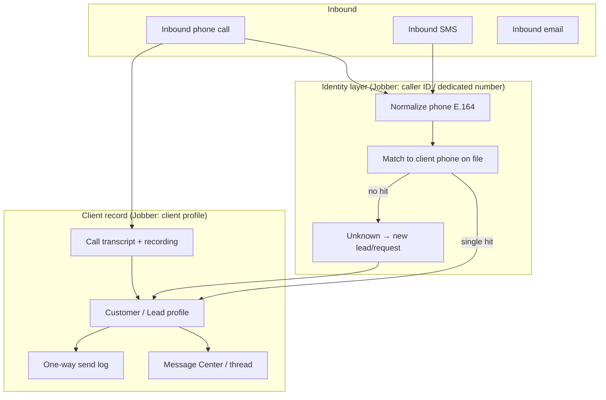
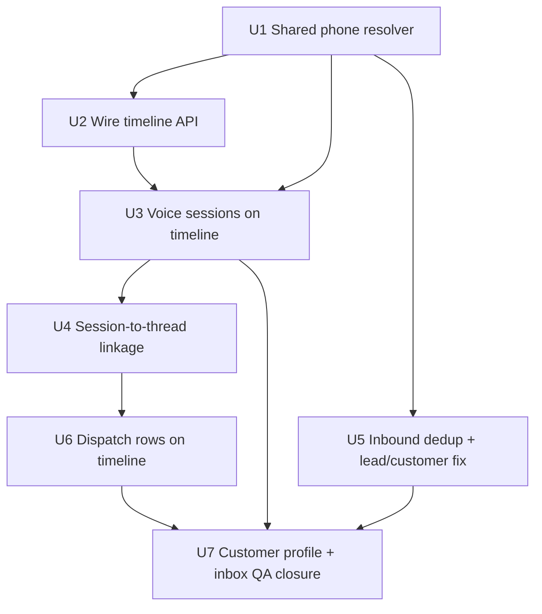

# feat: CRM Customer Communication Record — Jobber Parity

**Created:** 2026-06-19
**Depth:** Deep
**Status:** plan

## Summary

Research and a sequenced plan to bring ServiceOS's **customer communication
record** to Jobber parity: every inbound/outbound touch (phone, SMS, email,
automated notification) resolves to the right customer or lead, persists on
their record, and renders as a single chronological history on the customer
profile and in a team inbox. Much of the underlying infrastructure already
exists (Twilio voice, conversations/messages, `identify_caller`, Comms Inbox,
timeline aggregator); the gaps are **wiring, unification, and linkage depth**
—not greenfield domains.

> **Naming note:** The request referenced "Joppa." No field-service CRM product
> by that name was found. This plan targets **Jobber** (`getjobber.com`), which
> is the documented head-to-head competitor throughout the repo
> (`docs/competitive-gap-analysis.md`, `docs/plans/2026-06-15-001-feat-crm-comms-multilocation-jobber-parity-plan.md`).
> If "Joppa" refers to a different product, re-run scope synthesis against that
> source before executing.

## Problem Frame

Field-service owners lose context when communication lives on personal phones,
in Twilio logs, and in separate "interactions" vs "inbox" screens. Jobber's
pitch is simple: *call or text comes in → system knows who it is → full history
on the client record → team picks up where the last conversation left off.*
ServiceOS has the voice-first AI layer Jobber lacks, but the **customer record
as the system-of-record for all comms** is incomplete: the timeline endpoint is
unwired, voice sessions live on a separate page, and phone matching ignores
contact-level numbers.

## Requirements

- **R1.** Inbound phone calls resolve to an existing customer, lead, or
  "unknown" bucket via normalized caller ID — never a silent miss.
- **R2.** Every voice session, SMS thread message, and outbound dispatch is
  **linkable** to a customer (or lead pre-conversion) and visible on that
  customer's unified timeline.
- **R3.** The customer detail page shows a working, filterable communication
  timeline (notes, jobs, money events, SMS, calls, emails, appointments).
- **R4.** A team **Comms Inbox** surfaces threads needing reply, with
  cross-channel history and owner reply (already partially built — verify and
  close gaps).
- **R5.** Unknown callers create or attach to a **lead** without duplicating
  existing customers; conversion links comm history forward.
- **R6.** Caller ID matching searches **customer primary/secondary phones AND
  customer_contacts phones** (Jobber matches any client phone on file).
- **R7.** Voice call end-of-call writes a durable link: `voice_session` ↔
  `customer`/`lead` and optionally a `messages` transcript row for timeline
  inclusion.
- **R8.** Automated one-way sends (estimate, invoice, reminder) appear on the
  customer timeline alongside conversational SMS (Jobber separates these in
  reports but shows both on the client profile).

## Key Technical Decisions

- **Single read-model, multiple write paths — no new "communications" table
  yet.** Jobber stores calls, texts, and emails against the client record via
  integration sync + native message center. We already have `messages`,
  `voice_sessions`, and `message_dispatches`. **Decision:** extend the existing
  P9-002 timeline aggregator to ingest voice sessions and dispatch rows rather
  than introduce a fourth store. (Alternative: materialized `communication_events`
  table — rejected for now: YAGNI; timeline fan-out is proven and read-only.)

- **Phone resolution is a shared service, not per-channel duplication.**
  `identify_caller` today queries only `customers.phone_normalized`. **Decision:**
  extract `resolvePhoneToEntity(tenantId, phone)` that checks customers (primary +
  secondary), `customer_contacts`, open leads, then returns
  `{ kind: 'customer'|'lead'|'unknown'|'ambiguous', ... }`. Voice, inbound SMS
  capture, and Comms Inbox all call this. (Alternative: keep channel-specific
  lookups — rejected: caused `find-or-create-lead` to miss existing customers.)

- **Voice sessions join the timeline via mapper, not conversation duplication.**
  Timeline already defines `call_inbound` / `call_outbound` kinds; today they only
  appear when a `messages` row exists with transcript type. **Decision:** add
  `mapVoiceSessionToEvent()` in `timeline.ts` and fan-out `voice_sessions` by
  `customer_id` in `timeline-service.ts`. Optionally mirror a summary message
  into the customer's conversation thread for inbox parity — defer to U4 if
  inbox already reads voice via links.

- **Human owner replies stay direct mutations; AI outreach stays proposal-gated.**
  Matches existing decision in the June 15 plan and `proposals/auto-approve.ts`.

- **Jobber's third-party phone integrations (Aircall, OpenPhone) are out of
  scope.** We own the Twilio stack; parity target is native Jobber Message
  Center + AI Receptionist behavior, not their partner ecosystem.

## Scope Boundaries

**In scope:** phone→entity resolution, timeline wiring + voice inclusion,
lead/customer dedup on inbound, customer profile comm history, Comms Inbox gap
closure, call→record linkage at session end.

**Non-goals:**
- Marketing automation / campaign builder (PRD non-goal).
- Replacing `/interactions` — it remains the ops/debug call log; customer profile
  becomes the CRM-facing history.
- Jobber AI Receptionist feature parity (booking during call) — already tracked
  in voice/P12 stories; this plan covers **record linkage** only.
- Business-branch multi-location (U10–U12 in June 15 plan).
- Equipment registry, LTV segmentation (adjacent CRM, not comms-core).

### Deferred to follow-up work
- Contact-centric comms routing (reply to site contact's phone vs account phone).
- Authorized-caller model (spouse/employee calling on behalf of account).
- Real-time timeline push (WebSocket) — fetch-on-load is sufficient for V1.
- Email ingestion as inbox threads (outbound email logging only today).

## Repository invariants touched

- **UTC storage / tenant timezone render** — timeline `occurredAt` from source
  rows; UI renders in tenant TZ.
- **`tenant_id` + RLS** — all reads via existing tenant-scoped repos; phone
  resolver query uses `tenant_id` first predicate.
- **Audit events** — session link writes, lead creation from unknown caller, owner
  replies emit audit rows.
- **Entity resolver / voice_clarification** — ambiguous phone match (multiple
  customers) surfaces one-tap clarification, never silent pick.
- **LLM gateway** — suggest-reply unchanged; no new AI paths in this plan.
- **DNC/consent gates** — outbound reply path unchanged; re-check at dispatch.

## High-Level Technical Design

Jobber's communication→customer model (research synthesis):

**ServiceOS today vs Jobber:**

| Jobber behavior | ServiceOS today | Gap |
|---|---|---|
| Dedicated tenant phone number | Twilio per-tenant provision (`workers/provision-twilio.ts`) | ✅ |
| Caller ID → client match | `identify_caller` → `customers.phone_normalized` only | ⚠️ No contacts/leads |
| AI Receptionist saves transcript on client | `voice_sessions` + optional `customer_id` | ⚠️ Not on customer timeline |
| Message Center (two-way SMS) | `CommsInboxPage` + `conversations/messages` | ✅ built; verify e2e |
| Client profile comm history | `CommunicationTimeline` UI + `GET /timeline` | ❌ API unwired (`timelineDeps: undefined` in `app.ts`) |
| Unknown caller → lead | `find_or_create_lead` | ⚠️ Skips existing-customer check |
| One-way sends on profile | `message_dispatches` audit | ⚠️ Not in timeline |
| Call forwarding + caller ID passthrough | Twilio gather/media streams | ✅ different impl, same outcome |

Execution phases:

## Implementation Units

### U1. Shared phone→entity resolver
- **Goal:** One function resolves a normalized phone to customer, lead, unknown,
  or ambiguous — used by voice, SMS, and inbox.
- **Requirements:** R1, R5, R6
- **Dependencies:** none
- **Files:**
  - `packages/api/src/customers/phone-resolver.ts` (new)
  - `packages/api/src/ai/skills/identify-caller.ts` (delegate to resolver)
  - `packages/api/src/sms/inbound-capture.ts` (use resolver)
  - `packages/api/src/ai/skills/find-or-create-lead.ts` (check customer first)
  - Tests: `packages/api/src/customers/phone-resolver.test.ts`,
    `packages/api/test/integration/phone-resolver.test.ts`
- **Approach:** Query order: (1) `customers` where `phone_normalized` OR
  secondary matches; (2) `customer_contacts.phone_normalized`; (3) open `leads`
  by `phone_normalized`. Return discriminated union. Multiple customer hits →
  `ambiguous` with candidates (feeds voice_clarification). Zero hits →
  `unknown`.
- **Patterns to follow:** `customers/dedup.ts` normalization; `identify-caller.ts`
  tenant-first SQL.
- **Test scenarios:**
  - Happy path: primary phone → single customer.
  - Edge: phone on billing contact only → customer match; two customers same
    phone → ambiguous; lead + customer same phone → customer wins.
  - Integration (DB): real columns on `customer_contacts`; cross-tenant isolation.
- **Verification:** Voice inbound and SMS inbound both resolve the same entity
  for a contact-level phone.

### U2. Wire customer timeline API
- **Goal:** `GET /api/customers/:id/timeline` works in production.
- **Requirements:** R3
- **Dependencies:** none
- **Files:**
  - `packages/api/src/app.ts` (pass `timelineDeps` to `createCustomerRouter`)
  - `packages/api/src/routes/customers.ts` (verify mount)
  - Tests: `packages/api/test/integration/customer-timeline.test.ts`
- **Approach:** Construct `CustomerTimelineDeps` from already-instantiated repos
  in `app.ts` (notes, jobs, estimates, invoices, payments, conversations,
  appointments). Mirror the pattern used for other routers in the same block.
- **Patterns to follow:** `createCustomerRouter` optional `timelineDeps` branch
  at `routes/customers.ts:253`.
- **Test scenarios:**
  - Happy path: customer with note + job → timeline returns both kinds sorted desc.
  - Edge: empty customer → `{ events: [], nextCursor: null }`.
  - Integration (DB): endpoint returns tenant-scoped events only.
- **Verification:** Customer detail Activity tab loads real data (not empty 404).

### U3. Voice sessions on customer timeline
- **Goal:** Inbound/outbound calls appear as `call_inbound` / `call_outbound`
  events on the customer timeline.
- **Requirements:** R2, R7
- **Dependencies:** U2
- **Files:**
  - `packages/api/src/customers/timeline.ts` (`mapVoiceSessionToEvent`)
  - `packages/api/src/customers/timeline-service.ts` (fan-out voice sessions)
  - `packages/api/src/voice/voice-session.ts` or repo interface (add
    `findByCustomer(tenantId, customerId)` if missing)
  - `packages/api/src/voice/pg-voice-session.ts` (implement query)
  - Tests: `packages/api/src/customers/timeline.test.ts` (mapper unit),
    `packages/api/test/integration/customer-timeline-voice.test.ts`
- **Approach:** Extend `CustomerTimelineDeps` with `voiceSessionRepo`. Query
  `voice_sessions WHERE customer_id = $id` (bounded limit). Map channel +
  direction to timeline kinds; summary = outcome + excerpt; metadata holds
  `voiceSessionId`, `callSid`, `durationSeconds`, transcript turn count.
- **Patterns to follow:** existing `mapMessageToEvent` for call kinds;
  `routes/interactions.ts` excerpt helper.
- **Test scenarios:**
  - Happy path: voice session with `customer_id` → timeline event with correct kind.
  - Edge: session without `customer_id` excluded; in-progress session included
    with partial metadata.
  - Integration (DB): pin `voice_sessions.customer_id` column in query.
- **Verification:** Customer who called in shows the call on their profile
  timeline, not only on `/interactions`.

### U4. End-of-call customer linkage + optional thread mirror
- **Goal:** Every completed voice session stamps `customer_id` (or lead link)
  and optionally appends a transcript summary to the customer's conversation.
- **Requirements:** R2, R7
- **Dependencies:** U1, U3
- **Files:**
  - `packages/api/src/routes/telephony.ts` and/or voice session finalizer
  - `packages/api/src/conversations/linkage.ts` (link to `voice_session`)
  - `packages/api/src/workers/voice-action-router.ts` (ensure identify result
    flows to session create/update)
  - Tests: `packages/api/src/routes/telephony.test.ts` (handler-level mocked),
    `packages/api/test/integration/voice-session-customer-link.test.ts`
- **Approach:** On call start: run phone resolver → set `voice_sessions.customer_id`
  or store lead id in `context` JSONB. On call end: if matched customer, ensure
  conversation link exists; append `message_type: transcript` summary row (reuse
  `mapMessageToEvent` path). Ambiguous → store candidates in session context
  for operator resolution.
- **Patterns to follow:** `conversations/linkage.ts` `voice_session` entity type;
  existing session outcome stamping in `telephony.ts`.
- **Test scenarios:**
  - Happy path: known caller → session.customer_id set at start; timeline + inbox show call.
  - Edge: unknown caller → no customer_id; lead created separately (U5).
  - Integration (DB): session row persists customer_id after hangup.
- **Verification:** Interactions list and customer timeline show the same
  customer for a matched call.

### U5. Inbound dedup — customer before lead
- **Goal:** Stop creating phantom leads when the caller is already a customer;
  link inbound SMS/calls correctly on lead conversion.
- **Requirements:** R5
- **Dependencies:** U1
- **Files:**
  - `packages/api/src/ai/skills/find-or-create-lead.ts`
  - `packages/api/src/leads/lead-service.ts` (`convertToCustomer` — link open
    conversations/voice sessions by phone)
  - `packages/api/src/sms/inbound-capture.ts`
  - Tests: `packages/api/src/ai/skills/find-or-create-lead.test.ts`,
    `packages/api/test/integration/lead-conversion-comms-link.test.ts`
- **Approach:** `findOrCreateLead` calls phone resolver first; if customer →
  return `{ kind: 'existing_customer', customerId }` without creating lead.
  On `convertToCustomer`, re-attribute open `conversations` and unlinked
  `voice_sessions` matching the lead's phone to the new customer id.
- **Patterns to follow:** atomic `convertToCustomer` transaction in lead-service.
- **Test scenarios:**
  - Happy path: unknown phone → lead created; known customer phone → no lead.
  - Edge: lead converts → prior SMS thread visible on customer timeline.
  - Integration (DB): conversion updates conversation entity links.
- **Verification:** Customer calling from on-file phone never gets a duplicate lead.

### U6. Outbound dispatch rows on timeline
- **Goal:** Automated estimate/invoice/reminder sends appear on customer timeline
  as `sms_sent` / `email_sent` events.
- **Requirements:** R8
- **Dependencies:** U2
- **Files:**
  - `packages/api/src/customers/timeline.ts` (`mapDispatchToEvent`)
  - `packages/api/src/customers/timeline-service.ts` (fan-out dispatches by
    customer — via job→customer or direct entity resolution)
  - `packages/api/src/notifications/dispatch-repository.ts` (add
    `findByCustomer(tenantId, customerId, limit)` if missing)
  - Tests: `packages/api/src/customers/timeline.test.ts`,
    `packages/api/test/integration/customer-timeline-dispatch.test.ts`
- **Approach:** Join `message_dispatches` to customer through entity_type/id
  (estimate/invoice/job/customer/conversation_reply). Map template/kind to
  summary strings ("Estimate sent via SMS", etc.).
- **Patterns to follow:** existing timeline mappers; dispatch ledger schema.
- **Test scenarios:**
  - Happy path: estimate SMS dispatch → timeline `sms_sent` with estimate id in metadata.
  - Edge: failed dispatch → event with failed status in metadata (not hidden).
  - Integration (DB): dispatch join paths use real FK columns.
- **Verification:** Customer profile shows both conversational replies and
  automated sends (Jobber client profile behavior).

### U7. Customer profile + Comms Inbox closure
- **Goal:** Close UX gaps so the owner sees Jobber-equivalent "whole history +
  reply" on web mobile.
- **Requirements:** R3, R4
- **Dependencies:** U2, U3, U5, U6
- **Files:**
  - `packages/web/src/pages/customers/CustomerDetail.tsx`
  - `packages/web/src/components/customers/CommunicationTimeline.tsx`
  - `packages/web/src/pages/conversations/CommsInboxPage.tsx`
  - `packages/web/src/components/interactions/DispatchLogPage.tsx` (fix API
    mismatch if still present)
  - Tests: `packages/web/src/pages/conversations/CommsInboxPage.test.tsx`,
    `e2e/customer-comms-timeline-mobile.spec.ts` (new Playwright viewport test)
- **Approach:** Customer detail: link call events to transcript drawer (reuse
  interactions modal). Comms Inbox: verify thread list includes voice-linked
  threads; deep-link from timeline event → thread/call detail. Fix dispatch log
  if it still calls wrong endpoint. Mobile: ≥44px tap targets, 320px overflow
  per CLAUDE.md.
- **Patterns to follow:** `e2e/estimate-approval-mobile.spec.ts`; existing
  CommsInbox tests.
- **Test scenarios:**
  - Happy path: customer detail shows SMS + call + invoice send in one feed.
  - Edge/mobile: 320px no overflow; tap targets on reply and "view transcript".
  - Error: timeline API failure shows retry, not blank screen.
- **Verification:** Side-by-side with Jobber client profile + Message Center
  checklist passes internal QA (`docs/verification-runs/beta-verification-2026-05-09.md`
  comms section).

## Risks & Dependencies

- **June 15 plan overlap.** U1/U5/U6/U7 overlap with U4/U5/U6 of
  `2026-06-15-001-feat-crm-comms-multilocation-jobber-parity-plan.md`. Execute
  *this* plan's U1–U7 first (communication linkage); defer tags/equipment/branches
  to that plan's remaining units.
- **Timeline query cost.** Adding voice + dispatch fan-out increases parallel
  reads. Mitigation: keep `MAX_TIMELINE_LIMIT` cap; cursor pagination already
  exists.
- **Mocked-DB false confidence.** All DB-touching units require Docker-gated
  integration tests (prior entity-resolver column incident).
- **find-or-create-lead behavior change** is user-visible — unknown callers
  still create leads; only duplicate-customer case changes.

## Open Questions (deferred to implementation)

- Should ambiguous phone matches auto-link to the most-recently-active customer
  when the owner doesn't clarify, or stay unlinked until explicit?
- Mirror full transcript into `messages` vs summary-only row — decide based on
  inbox thread UX during U4.
- Include lead-stage comms on lead detail using the same timeline service with
  `entityType=lead`, or separate surface?
- `DispatchLogPage` — fix in U7 or delete if redundant with timeline?

## Sources & Research

**Jobber (primary reference — "Joppa" not found as CRM product):**

- [Two-Way Text Messaging](https://help.getjobber.com/hc/en-us/articles/360051087154-Two-Way-Text-Messaging)
  — Message Center, dedicated number, search by name/phone, threaded history.
- [Dedicated Phone Number](https://help.getjobber.com/hc/en-us/articles/360047029094-Dedicated-Phone-Number)
  — tenant number, SMS-only with call forward, caller ID passthrough on forward.
- [AI Receptionist](https://help.getjobber.com/hc/en-us/articles/25315927533847-Receptionist-powered-by-Jobber-AI)
  — caller ID → client match, transcript/recording/summary on client record.
- [Client Communications Report](https://help.getjobber.com/hc/en-us/articles/115016068927-Client-Communications-Report)
  — one-way sends logged; two-way stays in Message Center; both on client profile.
- [Aircall × Jobber integration](https://aircall.io/blog/partnerships/aircall-jobber-integration-launch/)
  — call/SMS log sync, contact bidirectional sync, missed-call follow-up tasks
  (reference architecture, out of scope to build).

**Internal:**

- `docs/plans/2026-06-15-001-feat-crm-comms-multilocation-jobber-parity-plan.md`
- `docs/quality/crm-deep-state-and-edges.md` §1.1, §communication gaps
- `packages/api/src/app.ts:3268` — `timelineDeps: undefined`
- `packages/api/src/customers/timeline-service.ts` — aggregator (no voice yet)
- `packages/api/src/ai/skills/identify-caller.ts` — customer phone only
