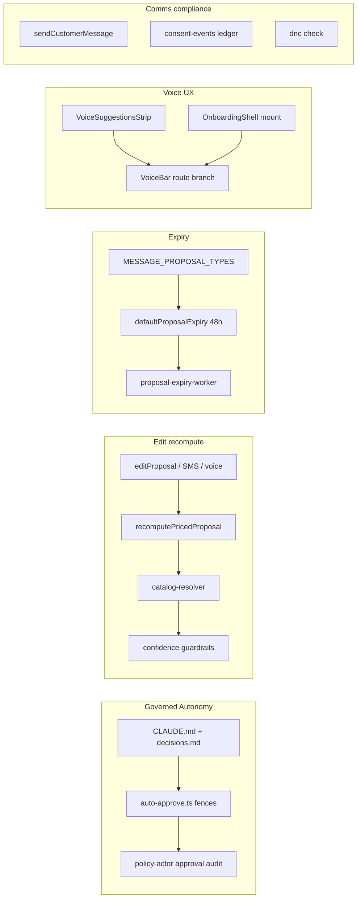

# fix: reconcile Interaction Model spec ↔ production (six behavioral gaps)

**Created:** 2026-06-22
**Depth:** Deep
**Status:** in progress — U1–U2 shipped (committed on feature branch); U3 implemented in working tree (uncommitted, tests green); U4–U7 pending.

## Progress & decisions (2026-06-22 reconciliation pass)

Branch `claude/vigilant-ptolemy-tikkqy` (harness). Verified state of the seven units and
three decisions taken this pass:

| Unit | State | Notes |
|------|-------|-------|
| **U1** docs reconcile | ✅ committed `bc6fd026` | Governed-autonomy prose landed in CLAUDE.md + decisions.md. |
| **U2** auto-approval audit | ✅ committed `576cf168` | Policy-actor approval audit on auto-approve at birth (D-014). |
| **U3** recompute on edit | 🚧 in working tree (uncommitted) | Helper `recompute-priced-proposal.ts` + `editProposal` rewire + catalog-repo threading + unit/integration tests; 5/5 unit green. **Two gaps to close — see U3 below.** |
| **U4** message expiry | ⬜ pending | Roster resolved (4 types). |
| **U5** voice suggestions | ⬜ pending | Frontend; unchanged. |
| **U6** onboarding mic | ⬜ pending | Frontend; unchanged. |
| **U7** SMS consent/receipts | ⬜ pending | **Premise corrected — outbound gate already exists; see U7 below.** |

**Decisions (user-confirmed this pass):**
- **Scope:** execute the *full* remaining plan (U3 finish → U4 → U5 → U6 → U7).
- **U3 cleanup:** **consolidate now** — refactor `estimate-task.ts` + `invoice-task.ts` to call the shared helper (no duplicated catalog/confidence/`_meta` logic), not edit-path-only.
- **U7:** proceed with **full U7 as written** — add the consent-ledger gate on top of the *already-present* `smsConsent`+DNC check, re-verify confirmation/receipt coverage, and fix the ACH receipt gap. The plan's "live gap" framing was wrong (gate exists); the work is now *additive + corrective*, framed to avoid a redundant double-block.

### Verification snapshot (`main` @ 72821600)

Deepening pass against the canonical `main` tree (before merging the feature branch):

| Claim | On `main`? | Notes |
|-------|------------|-------|
| U1 Governed Autonomy docs | ❌ | `CLAUDE.md:60` still says "Never auto-execute"; D-004 unchanged. |
| U2 auto-approval audit | ❌ | `createProposal` stamps `approvedAt` but emits no policy-actor approval audit. |
| U3 recompute helper | ❌ | `editProposal` merges + Zod-validates only; no `recompute-priced-proposal.ts`. |
| U4 message expiry | ❌ | 48h TTL applies to schedule types only (`proposal.ts:89–111`). |
| U5/U6 voice affordances | ❌ | No `VoiceSuggestions` / `useOnboardingVoice`; `OnboardingShell` has no `VoiceBar`. |
| U7 consent gate (boolean+DNC) | ✅ | `sendCustomerMessage` gates on `smsConsent` + DNC (`customer-message-delivery.ts:37–41`). |
| U7 consent ledger at send | ❌ | `consent-events.ts` not consulted by delivery chokepoint. |
| U7 ACH receipt | 🟡 | `recordProcessingPayment` correctly skips receipt; **`settleProcessingPayment` also skips receipt** — customer never gets ACH-cleared receipt (`webhooks/routes.ts:1244–1258`). |

**Spec location:** no file named "Interaction Model" exists in `docs/`. Reconcile prose in:
`CLAUDE.md`, `docs/decisions.md` (amend D-004 + record D-014), `docs/mobile/workflows.md`
(§Decide / auto-approve), `docs/PRD-execution-catalog.md` (approval language), and
`docs/launch/voice-interaction-scope.md` (voice UX scope). Cross-link existing behavioral
tests (`packages/api/test/proposals/auto-approve.test.ts`, voice golden-path tests).

## Context

A section-by-section audit of the **Interaction Model spec** against the canonical
product in `/packages` found the implementation is largely faithful, but with six
real divergences. This plan closes them. The headline divergence — the shipped
**auto-approve** path versus the spec's "never auto-execute" — was resolved by
product decision to **Governed Autonomy**: keep the behavior, make it honest in
docs *and* in the audit trail (rather than ripping out auto-approve or only
rewording docs). The remaining five are concrete engineering fixes.

## Summary

Reconcile the spec's "a human approves every state change" language with the
shipped, fenced auto-approve path (docs + explicit audit attribution); make
proposal **edits re-compute** totals/catalog-grounding/confidence so a human
correction can't leave stale auto-approve eligibility; let **time-sensitive
message proposals expire** at 48h like schedule proposals; add the per-route
**VoiceSuggestions** "you can say…" strip; make the persistent **mic route-aware
to onboarding**; and verify/close the **customer-SMS + consent** wiring on the
transactional send path.

## Problem Frame

The Interaction Model is the behavioral contract for a voice-first, propose-then-
approve operations system used by service-business owners. Where code drifts from
it, two harms follow: (1) the product's central trust promise ("the AI drafts, a
human commits") becomes ambiguous or, worse, silently violated; and (2) self-
teaching/affordance features the spec promises (voice suggestions, onboarding
voice) are absent, degrading the voice-first experience. One drift (GAP 6) may
also be a compliance exposure (outbound SMS without a re-checked consent/DNC gate).

## Requirements

- **R1.** Spec (§1/§4/§11) and `CLAUDE.md` accurately describe the shipped
  approval model: explicit human approval is the default; *governed* auto-approve
  is a narrowly-fenced exception, never available to comms/money/irreversible.
- **R2.** Every auto-approval emits an audit event attributing a system "policy"
  actor plus provenance (supervisor mode, threshold, confidence, undo window),
  closing the "agent attribution absent" gap.
- **R3.** Editing a proposal re-computes document totals, re-grounds line items in
  the tenant catalog, and recomputes the confidence marker before it can be
  (re-)approved — an edit can never preserve stale high confidence.
- **R4.** Time-sensitive **message** proposals expire at 48h (like schedule
  proposals) and are re-proposable; non-time-sensitive proposals still persist.
- **R5.** A per-route VoiceSuggestions strip renders 2–3 real example utterances
  near the mic, meeting the mobile bar (≥44px targets, no 320px overflow).
- **R6.** The persistent mic is reachable during onboarding and dispatches voice
  to the onboarding conversation endpoint (not `/assistant`).
- **R7.** Customer-facing confirmation/receipt SMS fires on the flows the spec
  promises, and every outbound transactional SMS passes a DNC + SMS-consent gate.

## Key Technical Decisions

- **Governed Autonomy via docs + audit, not behavior change** — the auto-approve
  gates (`packages/api/src/proposals/auto-approve.ts`, `decideInitialStatus()` in
  `packages/api/src/proposals/proposal.ts`) are already correctly fenced
  (capture-class only; supervisor-present; confidence ≥ mode threshold; low/
  very_low blocked; uncatalogued capped at 0.85 < 0.90; supervisor spend budget;
  5s undo). We do **not** touch the gates. We reconcile prose and add the missing
  explicit approval audit. (Alternatives: "docs-only" — rejected, leaves the
  audit trail dishonest; "enforce strict tap" — rejected by product, a regression
  for tenants relying on throughput.)
- **Re-compute on edit by extracting a shared helper, not duplicating task-handler
  logic** — `estimate-task.ts` and `invoice-task.ts` each inline
  assessConfidence + catalog grounding + `_meta` stamping. Extract one
  `recomputePricedProposal()` reused by both the draft path and `editProposal()`.
  (Alternative: inline a second copy in `actions.ts` — rejected, divergence risk.)
  The recompute is **deterministic** (catalog resolver + confidence guardrails);
  it makes **no new LLM gateway call**.
- **Expire message proposals by generalizing the existing expiry mechanism, not a
  new `scheduled_message` type** — add `MESSAGE_PROPOSAL_TYPES` +
  `isExpirableProposalType()` and reuse the schedule 48h TTL + worker + re-propose
  path. No new enum value, no migration. (Alternative: net-new `scheduled_message`
  type — rejected, larger surface + migration for no added behavior.)
- **Onboarding mic = mount the existing VoiceBar in OnboardingShell + route-aware
  dispatch (MVP)**, not a root-level persistent provider. `/onboarding`
  (`OnboardingShell`) is a separate root layout *outside* `Shell`, so VoiceBar
  isn't mounted there at all. The true "no remount" single-instance design
  (root `VoiceMicProvider`) is a larger refactor — deferred. (See Non-goals.)
- **One DNC/consent chokepoint** — enforce in the single inner
  `sendCustomerMessage()` used by every `TransactionalCommsService` method, so all
  six message types inherit the gate.

## Scope Boundaries

**In scope:** the six gaps above, each with tests, honoring repo invariants.

**Non-goals:**
- Net-new `scheduled_message` proposal type / DB migration.
- Root-level `VoiceMicProvider` single-instance refactor (true no-remount mic).
- Changing any auto-approve threshold, gate, or the 5s undo semantics.
- The *other* comparison gaps not listed here (tech-mobile photo/expense capture,
  call-record entity linkage, digest "suggested actions," VoiceBar state-machine
  phase renaming) — separate follow-ups.

### Deferred to follow-up work
- `VoiceMicProvider` at app root so a single mic instance truly persists across
  the Shell ↔ OnboardingShell boundary without remount.
- Broaden the message-expiry roster beyond the initial set once usage shows which
  comms proposals actually accumulate as stale-pending.
- Update stale PRD gap docs (`docs/PRD-v4.2-addendum.md`, `docs/prd-v4.1-feature-diff.md`)
  that still claim 48h expiry is unwired — schedule TTL shipped; message TTL is U4.

## Repository invariants touched

- **Human-approval gate / "never auto-execute":** deliberately amended in U1 — the
  reworded invariant still **forbids** auto-approve for comms/money/irreversible
  and still requires explicit approval as the default; it sanctions only the
  fenced capture-class exception. This is the one place we are intentionally
  editing a stated invariant, and U2 makes it auditable.
- **Audit events:** U2 (auto-approval audit), U7 (`sms_blocked_by_compliance` audit).
- **Integer cents:** U3 keeps invoice per-line `totalCents` consistent in integer
  cents after an edit (the draft path writes no document-level totals, so there is
  no document total to recompute via `billing-engine`).
- **Catalog grounding:** U3 re-runs `catalog-resolver.ts` on edit, preserving the
  uncatalogued cap.
- **Tenant_id / RLS:** all backend units use existing tenant-scoped repos.
- **Consent/TCPA:** U7's centerpiece.
- **LLM gateway:** unchanged; U3's recompute is deterministic (no model call).

## High-Level Technical Design



## Implementation Units

### U1. Governed Autonomy — reconcile the prose
- **Goal:** Make the spec + `CLAUDE.md` describe the shipped approval model exactly.
- **Requirements:** R1
- **Dependencies:** none
- **Files:**
  - `CLAUDE.md` (the "Story Execution Rules" line "Never auto-execute proposals —
    all require human approval" + Core Patterns approval language)
  - Interaction Model prose targets listed in **Verification snapshot** above
  - `docs/decisions.md` (record the Governed Autonomy decision + rationale as D-014;
    amend D-004 constraints to reference the fenced exception)
- **Approach:** Replace absolute "never auto-execute" wording with the governed
  rule, stated as a hard list: auto-approval is permitted **only** when *all* hold
  — capture-class action (never comms/money/irreversible); a supervisor is present;
  overall confidence ≥ mode threshold (0.90/0.92/0.95, tenant-tunable); no low/
  very_low marker; all lines catalog-grounded; within supervisor spend budget; and
  a 5s undo window applies. Everything else requires explicit human approval
  (tap/SMS/voice). State that every auto-approval is audited to a policy actor
  (forward-ref U2).
- **Patterns to follow:** mirror the precise, list-style invariant phrasing already
  in `CLAUDE.md` Core Patterns.
- **Test scenarios:** `Test expectation: none — documentation only.` The behavioral
  invariants are already pinned in `packages/api/test/proposals/auto-approve.test.ts`
  (comms/money/irreversible never auto-approve; low/very_low block; supervisor-
  presence gate); cross-link them from the decision note rather than duplicating.
- **Verification:** spec, `CLAUDE.md`, and `auto-approve.ts` say the same thing; a
  reader cannot find a surviving "never auto-execute, no exceptions" claim.

### U2. Governed Autonomy — explicit auto-approval audit attribution
- **Goal:** Emit an approval audit event when a proposal is auto-approved at birth,
  attributing the policy actor + provenance.
- **Requirements:** R2
- **Dependencies:** U1 (event semantics/wording should match the doc)
- **Files:**
  - `packages/api/src/proposals/proposal.ts` (the `decideInitialStatus → 'approved'`
    branch inside `createProposal()`, ~`:638`/`:688` where `approvedAt` is stamped)
  - `packages/api/src/proposals/audit.ts` (reuse the existing proposal-audit emitter)
  - `packages/api/test/proposals/proposal.test.ts` (unit)
  - `packages/api/test/integration/proposal-auto-approve-audit.test.ts` (new,
    Docker-gated — pins the real audit row + columns)
- **Approach:** When initial status resolves to `approved`, emit a
  `proposal.approved` (or `proposal.auto_approved`) audit event with
  `actorRole: 'system'`, `actorId` = a stable policy identifier (e.g.
  `auto-approve-policy`), and metadata `{ supervisorMode, threshold,
  confidenceScore, overallConfidence, undoWindowMs, sourceTrustTier }`. Mirror the
  field shape of the human approval audit in
  `packages/api/src/proposals/actions.ts` (`logProposalEvent`, ~`:204–217`) so
  human and policy approvals are queryable side by side. Idempotent with creation
  (one event per proposal).
- **Patterns to follow:** the human-approval `logProposalEvent` call and channel-
  metadata convention in `actions.ts`.
- **Test scenarios:**
  - Happy path: capture-class, supervised, confidence ≥ threshold → proposal is
    `approved` AND exactly one policy-actor approval audit event is emitted with
    the provenance metadata.
  - Edge: manual approval path still emits the human-actor event unchanged (no
    double-emit, no regression).
  - Negative: a proposal that lands `draft`/`ready_for_review` emits **no**
    auto-approval audit event.
  - Integration: the audit row persists with `actor_role='system'` and metadata
    columns populated (mocked-DB is not sufficient proof).
- **Verification:** querying audit for an auto-approved proposal returns a policy-
  attributed approval with provenance; `tsc --project tsconfig.build.json` clean.

### U3. Re-compute totals + catalog grounding + confidence on edit
- **Goal:** A proposal edit re-grounds/re-prices/re-scores before re-approval.
- **Requirements:** R3
- **Dependencies:** none
- **Files:**
  - `packages/api/src/ai/tasks/recompute-priced-proposal.ts` (new shared helper)
  - `packages/api/src/ai/tasks/estimate-task.ts` and
    `packages/api/src/ai/tasks/invoice-task.ts` (refactor to call the helper so
    draft-time and edit-time share one implementation)
  - `packages/api/src/proposals/actions.ts` (`editProposal`, ~`:539–632`: after
    shape validation, before persist, call the helper and persist recomputed
    `confidenceScore`/`confidenceFactors`/`payload._meta` + totals)
  - `packages/api/src/routes/proposals.ts` (thread `catalogRepo` into `editProposal`)
  - `packages/api/src/proposals/sms/reply-handler.ts` (~`:748`)
  - `packages/api/src/ai/tasks/proposal-approval-task.ts` (~`:1043`)
  - reuse: `packages/api/src/shared/billing-engine.ts` (`calculateDocumentTotals`),
    `packages/api/src/ai/resolution/catalog-resolver.ts` (`resolveLineItems`,
    `applyCatalogPricing`, `lineItemConfidenceSignals`, `UNCATALOGUED_CONFIDENCE_CAP`),
    `packages/api/src/ai/guardrails/confidence.ts` (`assessConfidence`,
    `getConfidenceLevel`)
  - `packages/api/test/proposals/edit-proposal-recompute.test.ts` (new unit)
  - `packages/api/test/integration/proposal-edit-recompute.test.ts` (new,
    Docker-gated — pins persisted `confidence_score` + line totals)
  - `packages/api/test/proposals/sms/reply-handler.test.ts` or
    `packages/api/test/ai/tasks/proposal-approval-task.test.ts` (handler-level:
    uncatalogued edit drops confidence on at least one non-UI channel)
- **Current state (in working tree, uncommitted):** the helper
  `recompute-priced-proposal.ts` exports `isPricedDraftType()` +
  `recomputePricedProposalOnEdit()`. It re-grounds line items via
  `resolveLineItems`/`applyCatalogPricing`, rebuilds confidence factors, re-applies
  the uncatalogued cap (≤0.85), and stamps `_meta.overallConfidence`. `editProposal`
  takes an optional `CatalogItemRepository`, recomputes after shape-validation, and
  persists `payload`/`confidenceScore`/`confidenceFactors`; the repo is threaded
  through `createProposalsRouter` → `app.ts` (`catalogRepo`). Unit test (pure helper
  + in-memory `editProposal`) and a Docker-gated integration test pinning the
  persisted `confidence_score` exist; 5/5 unit green. The **security-critical**
  behavior (uncatalogued edit drops persisted confidence below the 0.90 floor) is
  done and tested.
- **Remaining work to close U3 (this pass):**
  1. **Consolidate the duplication (decided: do now).** `estimate-task.ts`
     (~`:114–215`) and `invoice-task.ts` (~`:168–225`) still inline their own
     catalog-grounding + confidence + `_meta` logic. Refactor both to call the
     shared helper so draft-time and edit-time share ONE implementation (CLAUDE.md
     hygiene: no duplicated logic). The helper must reproduce the draft handlers'
     output exactly — including **invoice per-line `totalCents`** (`invoice-task.ts:152`
     sets `{ unitPriceCents, totalCents: round(unitPriceCents*qty) }`); confirm
     `applyCatalogPricing` recomputes that per-line total on quantity/price change
     (`catalog-resolver.ts:386–390`), and recompute it in the helper if not. Keep
     all existing estimate/invoice draft-path tests green.
  2. **Totals correctness (corrected scope).** The draft handlers do **not** stamp
     a document-level `payload.totals`; only invoice lines carry per-line
     `totalCents`. So "recompute totals via `billing-engine`" reduces to: keep
     per-line `totalCents` consistent for invoices after an edit (integer cents).
     Do **not** introduce a new document-totals field the draft path never wrote.
  3. **Thread the catalog repo into the other two edit channels** so the recompute
     applies everywhere a human edits: SMS (`proposals/sms/reply-handler.ts:748`)
     and voice (`ai/tasks/proposal-approval-task.ts:1043`). The UI route must also
     pass `catalogRepo` (`routes/proposals.ts:365`). Add a handler-level test
     (mocked gateway/repos) for at least one of these channels asserting an
     uncatalogued edit drops confidence.
  4. Commit U3 (helper + rewire + consolidation + cross-channel threading + tests)
     before U4.
- **Approach (type-aware helper):** for priced types (`draft_estimate`/`draft_invoice`)
  re-ground line items against the tenant catalog, keep per-line cents consistent,
  re-derive `_meta.overallConfidence`, and re-apply the uncatalogued cap; for
  non-priced types it is a no-op. Editing remains allowed only on
  `draft`/`ready_for_review`; the recompute updates the values a subsequent approval
  reads.
- **Patterns to follow:** the existing draft-time sequence in `estimate-task.ts`
  (~`:138–215`) is the canonical order to extract. Existing execution-time editors
  (`estimates/estimate-editor.ts`, `invoices/invoice-editor.ts`) show
  `calculateDocumentTotals` usage but operate on canonical entities, not proposal
  payloads — do not conflate.
- **Test scenarios:**
  - Happy path: edit a catalog-matched line's quantity → totals recompute in cents,
    confidence stays high.
  - Critical: edit a line to an **uncatalogued** description → persisted confidence
    drops to ≤ 0.85 (below the 0.90 auto-approve floor); proposal can no longer be
    auto-eligible. (This is the security-relevant case.)
  - Edge: edit a non-priced proposal type → no crash, no spurious catalog calls.
  - Money: totals are integer cents; no float drift after repeated edits.
  - Integration: persisted `confidence_score` and line totals match the recompute
    (real columns, not mocks).
- **Verification:** the uncatalogued-edit test proves stale auto-approve
  eligibility is impossible; `tsc --project tsconfig.build.json` clean.

### U4. Expire time-sensitive message proposals at 48h
- **Goal:** Message proposals that go stale expire like schedule proposals.
- **Requirements:** R4
- **Dependencies:** none (land after U3 commit)
- **Files:**
  - `packages/api/src/proposals/proposal.ts` (add `MESSAGE_PROPOSAL_TYPES` +
    `isMessageProposalType()`; add `isExpirableProposalType() =
    isScheduleProposalType || isMessageProposalType`; generalize
    `defaultProposalExpiry()` ~`:107–111` to apply the 48h TTL to expirable types)
  - `packages/api/src/proposals/actions.ts` (`reproposeProposal`, ~`:657`: gate on
    `isExpirableProposalType` instead of `isScheduleProposalType`)
  - `packages/api/src/workers/proposal-expiry-worker.ts` (no logic change — keys off
    `expiresAt` + `EXPIRABLE_PROPOSAL_STATUSES`; confirm new types flow through)
  - `packages/api/test/proposals/proposal.test.ts` (unit: expiry + type predicates)
  - `packages/api/test/workers/proposal-expiry-worker.test.ts` (unit: a message
    type expires)
  - `packages/api/test/integration/proposal-expiry-message-types.test.ts` (new,
    Docker-gated)
- **Approach (roster RESOLVED this pass):** verification confirmed all four
  candidates are created in a pending state (`draft`/`ready_for_review`) and are
  time-sensitive, so all four go in:
  ```
  export const MESSAGE_PROPOSAL_TYPES: readonly ProposalType[] = [
    'send_payment_reminder', // overdue-invoice-worker → 'ready_for_review' (dunning cadence)
    'notify_delay',          // voice task → 'draft' (delay window is appointment-bound)
    'send_estimate_nudge',   // voice task → 'draft' (48h cooldown; stales fast)
    'request_feedback',      // voice task → 'draft' (post-job window closes)
  ];
  ```
  `request_feedback` is **included** (reversing the plan's earlier exclusion): it
  meets the stated principle — time-sensitive + machine-raised + sits pending — and
  a stale feedback ask is low-value. `send_invoice`/`send_estimate` are **excluded**
  (persistent business actions, not time-critical). `reproposeProposal` gates on
  `isExpirableProposalType` (schedule ∪ message); `defaultProposalExpiry` applies
  the existing 48h TTL to both; the worker is already type-agnostic (no change).
- **Patterns to follow:** the existing `SCHEDULE_PROPOSAL_TYPES` /
  `isScheduleProposalType` / `SCHEDULE_PROPOSAL_EXPIRY_MS` trio.
- **Test scenarios:**
  - Happy path: a `send_payment_reminder` draft older than 48h transitions to
    `expired` on the sweep and is re-proposable with a fresh 48h clock.
  - Edge: a persistent (non-expirable) comms type still never gets an `expiresAt`.
  - Edge: an already-approved/executed message proposal is not expired.
  - Integration: the worker expires a real message-type row across the tenant sweep.
- **Verification:** schedule + message proposals share one expiry path; persistent
  types unaffected; `tsc --project tsconfig.build.json` clean.

### U5. VoiceSuggestions strip (per-route "you can say…")
- **Goal:** Seed 2–3 real example utterances near the mic, per route.
- **Requirements:** R5
- **Dependencies:** none (sequence before U6 — both edit `VoiceBar.tsx`)
- **Files:**
  - `packages/web/src/hooks/useVoiceSuggestions.ts` (new: `pathname → suggestions[]`)
  - `packages/web/src/components/shared/VoiceSuggestionsStrip.tsx` (new)
  - `packages/web/src/components/shared/VoiceBar.tsx` (render the strip in the
    `idle` phase)
  - `packages/web/src/hooks/useVoiceSuggestions.test.ts` (new unit)
  - `packages/web/src/components/shared/VoiceSuggestionsStrip.test.tsx` (new jsdom
    class-contract test)
  - `e2e/voice-suggestions-mobile.spec.ts` (new Playwright viewport test)
- **Approach:** Mirror the existing route→command map in
  `packages/web/src/hooks/useVoiceCommands.ts`; derive the current route via
  `useLocation()` (the pattern Shell already uses, `Shell.tsx:243`). Seed copy from
  real vocabulary: nav intents in `useVoiceCommands` + the assistant examples in
  `AssistantPage.tsx` (`SUGGESTIONS`, ~`:52–59`). Tapping a suggestion pre-fills the
  mic transcript (reuses the existing dispatch). Strip buttons use `min-h-11`
  (≥44px) and a `minmax(0,1fr)` container to avoid 320px overflow.
- **Patterns to follow:** map shape from `useVoiceCommands.ts`; jsdom class
  assertions from
  `packages/web/src/components/customer/EstimateApprovalPage.layout.test.tsx`;
  Clerk/VoiceBar mocking from
  `packages/web/src/components/layout/Shell.proposals.test.tsx`; viewport spec from
  `e2e/estimate-approval-mobile.spec.ts`.
- **Test scenarios:**
  - Happy path: `useVoiceSuggestions('/schedule')` returns 2–3 schedule-relevant
    utterances; a different route returns a different set.
  - UI contract (jsdom): each suggestion button has `min-h-11`; container uses
    `minmax(0,1fr)` / `min-w-0` so nothing overflows.
  - E2E (Playwright): at 320px and 390px the strip renders with no horizontal
    overflow and all tap targets measure ≥44px via `boundingBox()`.
- **Verification:** strip appears under the idle mic on multiple routes; mobile
  contract tests pass.

### U6. Route-aware mic → onboarding endpoint
- **Goal:** The mic is usable during onboarding and dispatches to the onboarding
  conversation endpoint, not `/assistant`.
- **Requirements:** R6
- **Dependencies:** U5 (same file `VoiceBar.tsx`; merge after)
- **Files:**
  - `packages/web/src/hooks/useOnboardingVoice.ts` (new: wraps
    `POST /api/onboarding/conversation/turn`, holds `sessionId` across turns)
  - `packages/web/src/components/shared/VoiceBar.tsx` (`handleSend`, ~`:290–315`:
    branch on `useLocation().pathname.startsWith('/onboarding')` → onboarding
    dispatch; else current `/assistant` behavior)
  - `packages/web/src/components/onboarding/v2/OnboardingShell.tsx` (mount the
    VoiceBar so the mic is present during onboarding)
  - `packages/web/src/hooks/useOnboardingVoice.test.ts` (new unit; mirror
    `useVoiceSession.test.ts`)
  - `packages/web/src/components/shared/VoiceBar.test.tsx` (new: mock `useLocation`
    → `/onboarding`, assert onboarding dispatch, not `/assistant`)
  - `packages/api/test/integration/onboarding-conversation-turn.test.ts` (new
    Docker-gated API test if none exists for the route)
- **Approach:** The onboarding endpoint is session-stateful
  (`packages/api/src/routes/onboarding-conversation.ts`,
  `POST /api/onboarding/conversation/turn`; orchestrator
  `packages/api/src/ai/orchestration/onboarding-conversation.ts`): first call omits
  `sessionId`, subsequent calls reuse it. `useOnboardingVoice` owns that lifecycle.
  VoiceBar's transcript handler picks the target from the route — no remount, no new
  mic component. Mounting VoiceBar in `OnboardingShell` is the MVP for "mic reachable
  on onboarding"; the single-instance root provider is deferred (Non-goals).
- **Patterns to follow:** `useVoiceSession` hook + its test; the onboarding turn
  request schema in `onboarding-conversation.ts`.
- **Test scenarios:**
  - Happy path: on `/onboarding`, a transcript POSTs to the conversation turn
    endpoint; the returned `sessionId` is retained for the next turn.
  - Routing: on an app route, dispatch still goes to `/assistant?q=` (no regression).
  - Edge: terminal onboarding state (`completed: true`) stops further dispatch.
  - Integration: the turn endpoint advances session state and returns the FSM
    state/`completed` flag (real session row).
- **Verification:** speaking during onboarding drives the onboarding agent; app-
  route voice unchanged; `tsc --project tsconfig.build.json` clean.

### U7. Customer-SMS confirmation wiring + consent/DNC gate
- **Goal:** Promised confirmation/receipt SMS fire; every outbound transactional
  SMS passes a consent + DNC check.
- **Requirements:** R7
- **Dependencies:** none (can parallel U4–U6 backend; no file collision)
- **Files:**
  - `packages/api/src/notifications/customer-message-delivery.ts` (the inner
    `sendCustomerMessage()` chokepoint — add ledger gate + suppression audit here)
  - `packages/api/src/notifications/transactional-comms-service.ts` (confirm all six
    methods route through the chokepoint)
  - reuse: `packages/api/src/compliance/dnc.ts` (`isOnDnc`, `normalizePhone`),
    `packages/api/src/compliance/consent-events.ts` (`listByPhone`, `deriveConsentStatus`)
  - `packages/api/src/webhooks/routes.ts` (`payment_intent.succeeded` settle branch
    ~`:1244–1258` — fire receipt when ACH settles)
  - `packages/api/src/payments/payment-service.ts` (`settleProcessingPayment` — optional
    notifier hook, or fire from webhook after settle)
  - confirm trigger coverage in the execution handlers
    (`packages/api/src/proposals/execution/*`) for create_booking / reschedule /
    cancel (already wired) and audit any gap for the flows the spec promises
  - `packages/api/test/notifications/transactional-comms-consent.test.ts` (new unit)
  - `packages/api/test/integration/transactional-sms-consent-gate.test.ts` (new
    Docker-gated)
- **VERIFIED premise correction:** an outbound gate **already exists**. The single
  chokepoint `sendCustomerMessage()` (`customer-message-delivery.ts:37–41`) already
  requires `customer.smsConsent === true` **and** `!dncRepo.isOnDnc()` before any
  SMS, and all six `TransactionalCommsService` methods funnel through it (peer
  send paths `send-service.ts:380–383`, `appointment-confirmation-notifier.ts:79–81`,
  `delay-notifications.ts:337` carry the same gate). So R7's "add a gate" is largely
  satisfied. The plan's "live compliance gap" framing was wrong.
- **Approach (full U7 = additive + corrective, no double-block):**
  1. **Authoritative consent.** The current gate trusts the `customer.smsConsent`
     boolean (a denormalized rollup). Strengthen it to consult the consent-events
     **ledger** as the source of truth: in `sendCustomerMessage`, resolve latest SMS
     consent via `consentRepo.listByPhone(tenantId, phone)` + `deriveConsentStatus`
     and block when `revoked` (or when neither boolean nor ledger grants). Layer this
     as a single combined decision — do **not** stack a second independent block that
     could diverge from the boolean. DNC stays the other gate.
  2. **Observability.** The gate currently skips silently. Emit an
     `sms_blocked_by_compliance` audit event (reason: `dnc` | `consent_revoked` |
     `no_consent`) when a send is suppressed, so blocks are queryable. Thread an
     `AuditRepository`/emitter into `CustomerMessageDeliveryDeps`.
  3. **ACH receipt gap (deepened).** `recordProcessingPayment` correctly does **not**
     fire a receipt at `payment_intent.processing`. The bug is the **missing receipt
     when ACH clears**: `payment_intent.succeeded` settles via `settleProcessingPayment`
     (`webhooks/routes.ts:1244–1258`) without calling `paymentReceiptNotifier`.
     Wire `notifyPaymentReceived` on successful settle (status flips `processing` →
     `completed`). Do **not** receipt at processing time.
  4. **Coverage re-verification.** Confirm confirmation/receipt SMS fire on the
     spec-promised flows (create_booking/reschedule/cancel already wired via
     `proposals/execution/*`); audit and close any gap. Idempotency unchanged
     (`idempotencyKeyPrefix` per entity+method).
- **Patterns to follow:** the existing `idempotencyKeyPrefix` usage in
  `transactional-comms-service.ts`; the audit emitter used elsewhere in
  notifications.
- **Test scenarios:**
  - Happy path: a confirmation/receipt is sent for a consented, non-DNC recipient.
  - Compliance: recipient on DNC → no SMS, one `sms_blocked_by_compliance` audit
    event; recipient with revoked/absent SMS consent → same.
  - ACH: `payment_intent.processing` does **not** send a receipt;
    `payment_intent.succeeded` settle **does** send a receipt.
  - Idempotency: re-executing the same notify does not double-text.
  - Integration: the gate reads real consent/DNC rows and the dispatch row reflects
    the block (mocked-DB not sufficient).
- **Verification:** no outbound transactional SMS bypasses consent/DNC; promised
  confirmations fire; ACH-cleared payments receipt; `tsc --project tsconfig.build.json` clean.

## Risks & Dependencies

- **U1 amends a stated invariant.** The reworded rule must still forbid
  comms/money/irreversible auto-approve and keep explicit approval the default;
  U2's audit makes the exception observable. Treat U1+U2 as a pair.
- **U3 catalog threading is incomplete across channels.** On `main`, none of the
  three `editProposal` call sites pass `catalogRepo`. All three must be threaded
  (UI `routes/proposals.ts:365`, SMS `reply-handler.ts:748`, voice
  `proposal-approval-task.ts:1043`) before U3 closes.
- **U7 is NOT a live gap (corrected).** The outbound `smsConsent`+DNC gate already
  exists in `sendCustomerMessage()`. Full-U7 is additive (consent-ledger as source
  of truth + suppression audit) + corrective (ACH settle receipt). Risk shifts
  from "compliance hole" to "don't introduce a redundant/divergent double-block" —
  layer the ledger check into the one existing decision.
- **U5/U6 share `VoiceBar.tsx`** — land U5 first, then U6, to avoid a merge
  collision in `handleSend`/render.
- **Feature branch merge.** U1–U3 land on `claude/vigilant-ptolemy-tikkqy`; merge
  or cherry-pick onto the execution branch before U4–U7 to avoid re-implementing
  shipped work.

## Open Questions (resolve during implementation)

- ~~**U4 roster**~~ **RESOLVED:** all four (`send_payment_reminder`, `notify_delay`,
  `send_estimate_nudge`, `request_feedback`) are created pending + time-sensitive →
  all included; `send_invoice`/`send_estimate` excluded.
- ~~**U7 enforcement point**~~ **RESOLVED:** the outbound gate lives in
  `sendCustomerMessage()` (`customer-message-delivery.ts:37–41`); full-U7 work layers
  the consent-ledger check + audit into that single function (no double gate).
- ~~**U7 ACH receipt vector**~~ **RESOLVED (deepening):** fix on
  `settleProcessingPayment` / `payment_intent.succeeded` settle branch, not
  `recordPayment` at processing time.
- **U6 mic placement (still open):** confirm mounting VoiceBar in `OnboardingShell`
  doesn't fight the onboarding layout chrome; if it does, fall back to a thin
  onboarding-local mic that reuses `useOnboardingVoice`.

## Recommended execution order

1. Merge/cherry-pick U1–U2 from feature branch (if not already on execution branch).
2. Finish + commit U3 (consolidation + cross-channel threading).
3. U4 (backend, independent).
4. U5 → U6 (frontend, sequential).
5. U7 (backend; can start after U4 or in parallel with U5).

## Build verification (every backend unit + final)

```
cd packages/api && npx tsc --project tsconfig.build.json --noEmit
```

Plus: `vitest` unit suites named per unit; Docker-gated integration tests under
`packages/api/test/integration/`; and the Playwright spec for U5. Run the full
typecheck before marking any unit complete.
