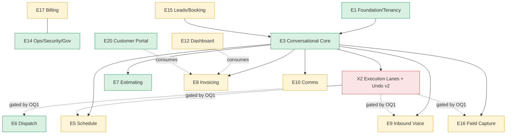

# feat: Rivet — 16-Epic Program Roadmap (reconciled to as-built)

**Created:** 2026-06-22
**Depth:** Deep (whole-program, roadmap altitude — less depth per epic by design)
**Status:** plan

> **What this is.** A single durable roadmap across the full product program —
> the 16 canonical epics (PRD v4.1) plus the 6 promoted epics E17–E22 (PRD
> v4.2 §6) — reconciled to the **as-built Railway product** in `/packages` and
> grounded in the uploaded Claude Design export (screens + `interaction-model.md`
> v2.0). It is **not** an implementation; ce-plan never writes code. Each epic
> unit is a roadmap-altitude slice whose execution is driven by its **own
> dedicated `/ce-plan` → `/ce-work`** (the pattern already set by
> `docs/plans/2026-06-22-001-...-epic3-plan.md`).
>
> **Sources of truth folded in:** `docs/PRD-execution-catalog.md` (Phase 0
> story catalog), `docs/prd-v4.1-feature-diff.md` (story-by-story status, dated
> 2026-06-20), `docs/PRD-v4.2-addendum.md` (as-built reconciliation), and the
> design export at the uploaded zip (`CLAUDE.md` design system +
> `uploads/interaction-model.md`).

## Summary
Rivet ("Your AI dispatcher") is **~87% built-or-substantial across 149 stories
(96% of P0)**; the program is past greenfield and into *close-the-gaps + adopt
the v2 interaction model + apply the new visual design*. This roadmap inventories
all 22 epics against real files, marks shipped vs. remaining, reconciles every
stale "locked" decision to the deployed stack (Railway / Redis-queue / Twilio
FSM / Clerk / Sentry / flat $297 pricing), folds in the design export's screens
and behavioral model, and sequences the remaining work into four delivery waves.
The single largest new input is the design export's **execution-lanes model
(§5 of `interaction-model.md`), which revises the repo's "never auto-execute"
invariant** — surfaced here as the #1 decision requiring founder sign-off.

## Problem Frame
The codebase has outgrown its PRD: the product was re-platformed off the v4.1
"locked" stack, ~6 epics of real capability were built with no home in the PRD,
and a fresh design export now introduces a v2 interaction model and a full visual
system. Without a single reconciled roadmap, three failure modes recur: (1) work
gets planned against abandoned decisions (AWS CDK, SQS, n8n, the 0.5% fee); (2)
"missing" stories get rebuilt when they were deliberately solved another way; (3)
the new design's behavioral inversion (silence-by-default, execution lanes) gets
implemented piecemeal and collides with the existing approval-gate architecture.
This plan is the map that prevents all three.

## Requirements
- **R1.** Enumerate all 22 epics with current state (✅/🟡/❌ tally + key paths)
  and the concrete remaining work, grounded in real files — not PRD prose.
- **R2.** Every stale "locked" decision is reconciled to the as-built stack with
  the superseding decision record named; no unit plans abandoned architecture.
- **R3.** The design export is tied in: each epic names the screens it must honor,
  and design-system adoption + mobile (`m/`) parity are explicit workstreams.
- **R4.** The interaction-model v2 (execution lanes, undo-first, management-by-
  exception, trust ratchet) is reconciled against the repo's human-approval-gate
  invariant, with a clear recommended path and an explicit founder decision.
- **R5.** Remaining work is sequenced into waves by priority/leverage, with the
  highest-value closable P0/revenue gaps called out for immediate execution.
- **R6.** Each epic unit is expandable into its own `/ce-plan`; this roadmap
  defines scope and sequence, not per-story test scenarios (deferred by altitude).
- **R7.** All repo invariants are honored or, where the design revises one
  (auto-execute), the revision is gated behind an ADR + `CLAUDE.md` update.

## Key Technical Decisions

- **D1 — Reconcile to the deployed stack, not the PRD's "locked" stack.** Plan
  against **Railway** (`railway.toml`, `Dockerfile`), the **Postgres-backed
  Redis/ioredis worker queue** (not SQS/n8n), **native Twilio FSM** voice (Vapi
  legacy, per D16), **Clerk** auth, **Sentry** observability, and **flat
  $297/mo + overage** pricing (the 0.5% fee is permanently obsolete). Rationale:
  the README is emphatic that `/experiments/infra` (AWS CDK) is "built, but
  nothing deploys them," and `PRD-v4.2-addendum.md §3` records each divergence
  with a decision record. Alternative (follow the catalog literally) rejected:
  it re-platforms off Railway and contradicts shipped reality.

- **D2 — Adopt interaction-model v2 execution lanes *incrementally*, gated on a
  founder ADR (see Open Question OQ1).** Reconciliation: the repo invariant
  "never auto-execute — all require human approval" is re-read as **"never
  auto-execute customer/money-facing or hard-to-reverse actions"** — which v2's
  Confirm-required/Never lanes preserve exactly. v2 adds only an **Auto +
  instant-undo** lane for *reversible internal* work (internal slot holds, draft
  creation, status moves, inventory decrement). The seed already exists
  (`packages/api/src/proposals/auto-approve.ts`, `threshold-resolver.ts`); v2
  formalizes it into explicit lanes + first-class undo/reversal + correction-rate-
  driven lane migration surfaced in the digest. Rationale: this is the design's
  central thesis and the only way to hit "the product is the silence between
  interactions." Alternative (keep flat approval gate) rejected: it makes "book
  Lee Tuesday" two interactions and a queue to babysit, and the inbound
  receptionist already violates it. **No auto-lane code ships before the ADR +
  `CLAUDE.md` invariant update.**

- **D3 — Treat the design export as a visual + behavioral refresh of an existing
  app, not a greenfield rebuild.** Most epics already have web components; the
  export is (a) a design-system retoken (Bricolage/Hanken, the documented color
  ramp, radii/shadows), (b) a set of genuinely new screens (Clarify Picker,
  Pending Proposals, SMS Approval, Weekly Digest, Inbound-Call states, Reviews
  Reputation), and (c) full mobile (`m/`) layouts. Adopt via a shared token layer
  + component refits, not a rewrite. The `/rewrite` tree stays out of scope.

- **D4 — Per-epic depth is deferred to dedicated plans.** This roadmap stops at
  scope + state + sequence per epic; detailed unit/test enumeration lives in each
  epic's own `/ce-plan` (mirroring the epic3 plan). Chosen because the user asked
  for whole-program breadth over per-epic depth.

## Scope Boundaries
**In scope:** a reconciled, sequenced roadmap for all 22 epics; the cross-cutting
design-system and execution-lane workstreams; identification of the concrete
remaining work per epic with grounded file paths; the program-level decisions and
their records.

**Non-goals:** writing any code, migrations, or tests (this is a plan); per-story
test-scenario enumeration (deferred to each epic's `/ce-plan`, per D4); any work
in `/experiments`, `/rewrite`, or `/infra`; re-deriving the story-by-story audit
(it was done 2026-06-20 in `prd-v4.1-feature-diff.md` and is treated as current).

### Deferred to follow-up work
- **Epic 11 Inventory (stock/quantity-on-hand)** — all stories P1/P2, deferred
  *by design* per PRD priority; no quantity model today.
- **Marketplace ingestion (15.7 Angi/Thumbtack), Google LSA (15.8), FSM import
  (13.7), QuickBooks two-way (13.2)** — P1/P2, post-beta.
- **Estimate/message template authoring (7.9, 10.5), outbound estimate revival
  (10.8)** — P1/P2 polish.

## Repository invariants touched
This is the whole product, so all invariants apply. How the roadmap honors each:
- **Integer cents** — money epics (E7/E8/E17/E18) keep cents; no unit introduces
  floats; voice-overage metering (9.12) computes in cents.
- **UTC stored / tenant-tz rendered** — scheduling (E5), digest (E12), call logs
  (E9) keep the convention.
- **`tenant_id` + RLS on every entity** — E1/E14 own this (~197 RLS policies
  today); any new table (overage ledger, undo/reversal log, lane-migration
  audit) carries `tenant_id` + RLS.
- **Every mutation emits an audit event** — `audit_events` (1.7) is the spine;
  new lanes/undo emit audit on execute *and* reverse (agent + approver).
- **All AI calls via the LLM gateway** — E3/E9/E7 route through
  `packages/api/src/ai/gateway`; lane classification reuses it, no side calls.
- **Zod-validated proposals, human-approval gate** — preserved for customer/
  money-facing actions; **D2 revises the gate only for reversible-internal work**
  and only behind an ADR.
- **Catalog-grounded prices** — E7 keeps `ai/resolution/catalog-resolver.ts`;
  uncatalogued lines stay capped below auto-approve (and below any auto lane).
- **Entity resolver on voice free-text** — E3/E9 keep `ai/resolution`; ambiguity
  becomes a one-tap `voice_clarification` (design: `m/Clarify Picker.dc.html`).
- **Async worker pattern (P0-009) / webhook base (P0-014)** — all background and
  external-webhook work in new units uses these, not ad-hoc handlers.

## High-Level Technical Design

**Program shape.** Three layers, all present today, evolving in place:
1. **Platform layer** (E1, E14, E17) — tenancy/RLS/auth, ops/governance, SaaS
   billing. Mature; hardening + overage metering remain.
2. **Capture → Interpret → Lane → Execute → Learn spine** (E3 core, consumed by
   E5–E10, E15, E16). Mature as an *approval-gated* loop; the v2 work adds the
   **lane + undo** stage (D2).
3. **Surfaces** — owner web/mobile (E12 dashboard, all in-app screens), the
   customer side (E20 portal, token links), and the voice/SMS channels (E9, E10).
   Design export refreshes all three.

**Reconciliation table (the binding "as-built" reference for every unit):**

| Concern | PRD "locked" | As-built (plan against this) | Record |
|---|---|---|---|
| Runtime/IaC | AWS CDK + ECS/Fargate | **Railway** (`railway.toml`, `Dockerfile`) | README; `/experiments/infra` quarantined |
| Orchestration | n8n Cloud | **Postgres queue + ~27 workers + DLQ** | ADR `docs/decisions/p0-028-queue-choice.md` |
| Async jobs | SQS | **Redis/ioredis** workers | p0-028 |
| DB | Supabase | **Managed Postgres + in-code migrations**, RLS + pg_trgm | `production-readiness-scope.md`; D-001 |
| Frontend | Next.js/Vercel | **React + Vite + React Router / Railway** | D-001 |
| AI runtime | LangGraph/FastAPI (Py) | **TypeScript/Express + provider-agnostic gateway** | D-005 |
| Inbound voice | Vapi/Retell | **Native Twilio FSM** (Vapi legacy) | D16 (`2026-06-11-rivet-architect-plan.md`) |
| Auth / SMS | Clerk / Twilio | **Clerk / Twilio** (unchanged) | retained |
| Monitoring | CloudWatch + Sentry | **Sentry** (CloudWatch N/A on Railway) | retained |
| Pricing | $99/mo + 0.5% fee | **Flat $297/mo + 500 min + $0.30/min overage** | GTM brief; 8.7 obsolete |
| Accounting | QuickBooks + Invoice Ninja | **QuickBooks one-way** (Ninja dropped; Xero stub) | v4.2 §4 |

## Program scorecard (all 22 epics)

| Epic | ✅/🟡/❌ | State | Wave | Headline remaining |
|---|---|---|---|---|
| E1 Platform Foundation & Multi-Tenancy | 5/3/0 | strong | W1 | 1.1 signup flow, 1.3 role enum (Admin/CSR), 1.5 role landing |
| E2 Onboarding & Living Templates | 0/9/1 | under-counted | W1 | re-audit FSM; conversational front; 2.6 catalog seeding |
| E3 Conversational AI Core | 9/3/0 | mature (PR #611) | W1 | 3.2 Nova-3 WS+TTL, 3.8 clarify-only, 3.12 retry |
| E4 Customer Management / CRM | 5/4/0 | strong | W2 | 4.4/4.6 merge UI, 4.7 caller-ID, 4.9 timeline UI |
| E5 Scheduling & Calendar | 4/5/1 | partial | W1 | **5.5 48h TTL (P0)**, 5.1 status set, 5.4 voice wiring |
| E6 Dispatch & Technician Exp. | 7/2/0 | strong | W3 | 6.5 tap-status UI, 6.8 reassign endpoint |
| E7 Estimating | 7/2/1 | strong | W2 | 7.2 3-loop cap, 7.10 detail UI, 7.9 templates (P2) |
| E8 Invoicing & Payments | 6/3/1 | strong | W2 | 8.3 convo-create, 8.8 receipts, 8.10 overdue UI |
| E9 Inbound Voice / Receptionist | 8/3/1 | partial | W1 | **Vapi→Twilio (D16)**, 9.2/9.5/9.9, **9.12 overage** |
| E10 Customer Comms & Outreach | 4/4/1 | partial | W2 | 10.4 TTL, 10.5 templates, 10.7 thread UI, 10.9 prefs |
| E11 Inventory Management | 0/2/6 | deferred by design | — | all P1/P2; no quantity model |
| E12 HomePage, Dashboard & Insights | 0/8/1 | wiring-heavy | W1 | 12.2/12.3/12.5 HomePage wiring, **12.6 email not SMS**, 12.8 quick actions |
| E13 Integrations & Sync | 2/1/4 | mostly superseded | W3 | 13.2 QB two-way; 13.3/13.4 SUPERSEDED |
| E14 Platform Ops, Security & Gov | 6/2/0 | strong | W3 | 14.4 voice-spend UI, 14.8 tested restore |
| E15 Lead Capture & Online Booking | 2/5/2 | partial | W1 | **15.2 speed-to-lead trigger (P0)**, 15.3/15.4 wiring |
| E16 Field Documentation & Capture | 3/6/0 | partial | W2 | 16.2 inline photo, 16.6/16.7 time review+costing, 16.8 OCR |
| E17 Platform Billing *(promoted)* | live/partial | live | W2 | **voice-overage metering = 9.12** (revenue gap) |
| E18 Service Agreements / Memberships *(promoted)* | built | strong | W2 | polish; tie to dashboard |
| E19 Reputation *(promoted)* | built | strong | W2 | reply-approval polish; lead-inbox surfacing (15.6) |
| E20 Customer Portal *(promoted)* | built | strong | W2 | design refit (estimate-approval/pay screens) |
| E21 Localization EN/ES *(promoted)* | built | verify | W3 | confirm bilingual coverage depth |
| E22 Voice Quality & Eval *(promoted)* | built | strong | W3 | expand corpus/gates as voice work lands |

## Cross-cutting workstreams (do first — they shape every surface epic)

### U1. Design-system adoption + mobile `m/` parity
- **Goal:** Land the design export's system as a shared token + component layer so
  every in-app screen inherits Bricolage/Hanken type, the documented color ramp,
  radii (inputs 10–12 / cards 18 / chips full), shadows, and ≥44px hit targets —
  and bring the `m/` mobile layouts to parity.
- **Requirements:** R3. **Dependencies:** none (enabling for all surface epics).
- **Current state:** web is React+Vite+Tailwind; the prior figma-export gap
  analysis flagged "design tokens: Figma vars vs Tailwind-only." New export adds
  net-new screens (Clarify Picker, Pending Proposals, SMS Approval, Weekly Digest,
  Inbound-Call Booked/Dropped/Voicemail, Reviews Reputation).
- **Designs to honor:** the export `CLAUDE.md` (fonts/colors/tokens/wordmark);
  all root `*.dc.html` (desktop) + `m/*.dc.html` (mobile).
- **Approach:** central token module (CSS vars/Tailwind theme extension) +
  font loading; refit shared primitives (`packages/web/src/components/ui/*` and
  shared list/detail/state components) before per-epic screen refits; pin mobile
  contracts with jsdom class-contract + Playwright viewport tests (pattern:
  `e2e/estimate-approval-mobile.spec.ts`). **No 320px overflow; min-h-11.**
- **Patterns to follow:** existing `packages/web/src/components/{layout,ui}`,
  `figma-export/styles/*` (reference only — not deployed).
- **Test note:** jsdom class-contract + Playwright viewport per refit screen;
  detailed scenarios per screen deferred to the epic's `/ce-plan`.
- **Verification:** a representative screen (e.g., Dashboard) renders with the new
  tokens on desktop + 320px mobile with no overflow and ≥44px targets.

### U2. Execution lanes + undo (Interaction Model v2)  ⚠️ DECISION-GATED (OQ1)
- **Goal:** Introduce the v2 lane model — **Auto+instant-undo / Confirm-light /
  Confirm-required / Never** — over the existing proposal spine, with first-class
  undo/reversal and correction-rate-driven lane migration in the digest.
- **Requirements:** R4, R7. **Dependencies:** E3 (proposal spine, present);
  **founder ADR (OQ1) before any auto-lane code.**
- **Current state:** approval-gated everywhere; seeds exist
  (`packages/api/src/proposals/auto-approve.ts`, `threshold-resolver.ts`,
  supervisor confirmation in `proposals/guardrails/*`). No undo-window/reversal
  primitive; no lane concept as such.
- **Designs/behaviors to honor:** `interaction-model.md` §§5,6,10 (lanes, universal
  loop, lifecycle), §7 one-breath debrief, §4 trust ratchet; screens `m/SMS
  Approval`, `m/Pending Proposals`, `AI Proposal Card`, `m/Inbound Call *`.
- **Approach:** (1) ADR revising the invariant to "never auto-execute customer/
  money-facing or hard-to-reverse"; update repo `CLAUDE.md`. (2) Lane classifier
  extending `threshold-resolver.ts` over the three axes (confidence × reversibility
  × blast radius); uncatalogued/ambiguous bumps up a lane. (3) Undo/reversal
  primitive (tenant-scoped, audited on execute+reverse; longer window for higher
  blast radius). (4) Thin first slice on **one reversible-internal intent** (e.g.,
  internal slot hold or status move) end-to-end before broadening to E5/E6/E9/E16.
- **Patterns to follow:** `proposals/*`, `audit_events`, async worker pattern.
- **Test note:** lane-selection unit tests (axis matrix); undo/reversal integration
  test (Docker-gated — real columns); handler tests with mocked gateway/repos.
- **Verification:** the chosen reversible intent auto-executes with a working,
  audited "Done — undo?" window; a customer/money-facing intent still requires
  explicit approval even at high confidence.

## Epic units by wave

> Each epic below is a roadmap slice. **Execution = a dedicated `/ce-plan
> <epic>` → `/ce-work`** (per D4). "Remaining" lists the closable gaps with story
> IDs from `prd-v4.1-feature-diff.md`; SUPERSEDED items are *not* work.

### Wave 1 — Close the P0/MVP gaps (96% → 100% of P0; highest leverage)

**U3 · E1 Platform Foundation & Multi-Tenancy** (5/3/0)
- Shipped: Clerk RS256+JWKS (`auth/clerk.ts`), RLS (`db/schema.ts`
  `tenant_isolation_*`, `middleware/tenant-context.ts`), audit log (`audit_events`),
  invitations, tenant settings. Remaining: **1.1** full signup flow; **1.3** add
  Admin/CSR to `auth/rbac.ts` role enum; **1.5** confirm role-based sign-in
  landing. Designs: `Login`, `Signup`, `Team & Roles`, `Settings Hub`.

**U4 · E2 Onboarding & Living Templates** (0/9/1)
- Backend conversational FSM exists (`ai/agents/onboarding/transitions.ts` 6-state,
  `ai/orchestration/onboarding-conversation.ts`, `MAX_TURNS=15`); **re-audit — many
  🟡s are likely ✅.** Remaining: conversational front to match the design (current
  `onboarding/v2` is sidebar-step), **2.6** service-catalog seeding, capture UIs
  (2.5/2.7). Designs: `Onboarding`, `m/Onboarding`, `Brand Voice`.

**U5 · E3 Conversational AI Core** (9/3/0) — *already CI-green on PR #611*
- See `docs/plans/2026-06-22-001-...-epic3-plan.md`. Remaining (small): **3.2**
  Nova-3 WebSocket + 30s grant token (today Whisper async), **3.8** clarify-only-on-
  missing-field proof, **3.12** low-confidence retry heuristic. Designs: `Assistant`,
  `VoiceBar`, `AI Proposal Card`, `m/Clarify Picker`.

**U6 · E5 Scheduling & Calendar** (4/5/1)
- Shipped: convo-create, calendar views, double-book detection
  (`scheduling/feasibility.ts`), job detail. Remaining: **5.5 48h proposal TTL
  (P0)** — `expiresAt` exists in `proposals/*` but no creation path sets it;
  **5.1** reconcile job status set to PRD's 7 states; **5.4** voice availability
  wiring; 5.6 drag-reschedule UI. Designs: `Schedule`, `m/Schedule`, `Dispatch Board`.

**U7 · E9 Inbound Voice Agent / Receptionist** (8/3/1)
- Shipped: Twilio FSM answer (`telephony/twilio-adapter.ts`), caller lookup, live
  availability, booking (direct-write+review), SMS confirm, disclosure, transcript.
  Remaining: **execute D16 — migrate off Vapi** (`integrations/vapi/*` legacy) to
  the native FSM for all paths; **9.2** number provisioning in onboarding; **9.5**
  explicit qualify gate; **9.9** emergency feed flag; **9.12 metered minutes** →
  see U16/E17. Designs: `Call Log`, `Call Detail`, `m/Inbound Call`,
  `m/Inbound Call Booked/Dropped/Voicemail`.

**U8 · E12 HomePage, Dashboard & Insights** (0/8/1) — *wiring-heavy*
- Backend metrics exist (`reports/money-dashboard.ts`, `metrics/hfcr.ts`,
  `hfcr-weekly-send-worker.ts`). Remaining: HomePage wiring (**12.2/12.3/12.5**
  snapshot, tap-able pending queue, voice-ROI tiles), **12.6** weekly feedback as
  **email** (currently SMS) + opt-out enforcement, **12.8** one-tap quick actions,
  12.9 first-action empty states. This epic is the owner's exception surface —
  pairs tightly with U2. Designs: `Dashboard`, `m/Dashboard`, `Weekly Digest`,
  `m/Notifications`, `m/Pending Proposals`.

**U9 · E15 Lead Capture & Online Booking** (2/5/2)
- Shipped: web-form capture (`public-intake/*`), online booking widget
  (`portal/...BookAppointment.tsx`). Remaining: **15.2 speed-to-lead auto-SMS
  trigger (P0)** (lead stored, trigger not wired — flagged in v4.2 §7); **15.3/15.4**
  unified inbox + lead→customer/job auto-proposal; 15.9 source attribution on
  HomePage. Designs: `m/Leads Inbox`, `m/Lead Detail`, `m/Lead Sources`,
  `m/Online Booking`, `m/Booking Confirmed`.

### Wave 2 — Revenue, money surfaces, and differentiation

**U10 · E17 Platform Billing** *(promoted; live)* — **owns the revenue gap**
- Shipped: subscription billing (`billing/subscription.ts` — trial/checkout/portal),
  `billing/stripe-connect.ts` tenant payouts. Remaining: **9.12 / §5 voice-overage
  metering & billing** — only trial gating (100-min cap) exists; build the
  minute-bucket + $0.30/min overage ledger (integer cents, `tenant_id`+RLS, async
  worker) + Stripe metered billing. **Highest-value non-MVP gap.** Designs: `Billing`,
  `m/Billing`.

**U11 · E7 Estimating** (7/2/1)
- Strong (`ai/tasks/estimate-task.ts` + `catalog-resolver.ts` price grounding,
  e-sign, approval, job conversion). Remaining: **7.2** enforce 3-loop clarify cap
  on estimate path; **7.10** richer detail UI; 7.9 templates (P2). Designs:
  `Estimate Builder`, `Estimates List`, `New Estimate 1–3`, `Customer Estimate Approval`.

**U12 · E8 Invoicing & Payments** (6/3/1)
- Strong (entity, auto-from-job, Stripe Payment Links, methods, mark-paid).
  **8.7 0.5% fee = SUPERSEDED** (flat pricing — do not build). Remaining: **8.3**
  convo-create hardening, **8.8** receipts, **8.10** overdue HomePage count.
  Designs: `Invoices List`, `Invoice Detail`, `New Invoice 1–3`, `Customer Pay Invoice`.

**U13 · E10 Customer Comms & Outreach** (4/4/1)
- Shipped: Twilio SMS in/out, confirmations/reminders, on-the-way, STOP/START
  (`compliance/stop-reply.ts`). Remaining: **10.4** message 48h TTL (pairs with
  5.5/U2 lifecycle), **10.5** user-authored templates, **10.7** two-way thread UI,
  **10.9** per-tenant notification prefs; 10.8 revival (P2). Designs: `Comms Inbox`,
  `Message Thread`, `Message Templates`, `m/SMS Approval`.

**U14 · E4 Customer Management / CRM** (5/4/0)
- Strong (list, add via form/convo, detail, tags/notes). Remaining: **4.4/4.6**
  merge-on-card UI + merge execution, **4.7** caller-ID multi-channel match, **4.9**
  timeline UI wiring. Designs: `Customers`, `Add/Edit Customer`, `Customer Detail`.

**U15 · E16 Field Documentation & Capture** (3/6/0)
- Shipped: job photos + S3 (`attachments`), time clock in/out (`time_entries`),
  expense capture (`expenses`). Remaining: **16.2** inline photo-with-notes, **16.6/
  16.7** time review + costing surface, **16.8** receipt **OCR** (table exists, OCR
  not implemented). Pairs with U2 (one-breath debrief). Designs: `Tech Job On-Site`,
  `TechJobView`, `m/Job Photos`, `m/Expense Capture`, `m/Time Tracking`.

**U16 · E18 Memberships · E19 Reputation · E20 Portal** *(promoted; built — refit + polish)*
- E18 `agreements/*` (recurring jobs/invoices, member pricing) — tie to dashboard.
  E19 `reputation/*` (Google review mirror, AI public/private reply drafting via
  brand voice) — keep reply on the **approval gate** (`build-proposal.ts`); surface
  GBP messages in the lead inbox (15.6). E20 `portal/*` token-scoped self-service —
  apply U1 design refit. Designs: `Reviews Reputation`, `m/Reviews Reputation`,
  `Customer Estimate Approval`, `Customer Pay Invoice`.

### Wave 3 — Lower-priority / deferred / verification

**U17 · E6 Dispatch & Technician Experience** (7/2/0) — polish 6.5 tap-status UI, 6.8 reassign endpoint. Designs: `Dispatch Board`, `Tech Job On-Site`.
**U18 · E13 Integrations & Sync** (2/1/4) — **13.3 Invoice Ninja + 13.4 n8n = SUPERSEDED** (QuickBooks + Postgres queue). Real remaining: **13.2** QB two-way reconcile; 13.6 Google Calendar write; 13.7 FSM import (P2).
**U19 · E14 Platform Ops, Security & Governance** (6/2/0) — strong (~197 RLS policies, redaction, guardrails, rate-limit). Remaining: **14.4** voice-minute spend in UI (pairs with U10), **14.8** tested-restore evidence.
**U20 · E21 Localization EN/ES** *(promoted)* — verify bilingual coverage depth (voice/SMS/email) against the Spanish corpus; close any gaps.
**U21 · E22 Voice Quality & Eval** *(promoted)* — `packages/voice-eval` + `serviceos_training`; expand corpus/CI gates as U7/U2 voice work lands.
**U22 · E11 Inventory** (0/2/6) — **deferred by design** (all P1/P2). Roadmap placeholder only; revisit post-beta when a quantity-on-hand model is justified.

## Top closable gaps to execute first (the short list)
1. **5.5 / 10.4 — proposal & message 48h TTL (P0).** Field exists; wire creation
   path to set it + an expiry worker. Smallest P0, unblocks lifecycle correctness.
2. **15.2 — speed-to-lead auto-SMS trigger (P0).** Lead stored; wire the trigger.
3. **9.12 / E17 — voice-overage metering (revenue).** Only true monetization gap.
4. **12.6 — weekly feedback as email + opt-out (P0).** Currently SMS-only.
5. **D16 — Vapi → Twilio FSM migration (E9).** Remove the legacy voice path.
6. **OQ1 sign-off → U2 thin slice.** Unblocks the whole v2 interaction model.

## Sequencing & dependencies
- **U1 + U2(decision)** precede surface-heavy epics (they change every screen and
  the execute stage). U1 can proceed immediately; U2 code waits on OQ1.
- **Wave 1** is mostly hardening/wiring on a built base → fastest path to a clean
  100%-of-P0 posture; do the "short list" P0s first.
- **Wave 2** money/differentiation; U10 (overage) is revenue-gating.
- **Wave 3** deferred/verification; E11 stays parked.
- Epic deps follow the spine: E1→E3→{E5,E7,E8,E9,E10,E15,E16}; E12 consumes all;
  E20 consumes E7/E8; E17/E14 cross-cut.

## Risks & Dependencies
- **R-1 (highest): adopting v2 auto-lanes regresses the safety posture.** An
  over-confident auto-execute on a mis-classified reversible action erodes trust.
  Mitigation: ADR-gated (OQ1), confidence calibrated conservatively near lane
  boundaries, instant audited undo, thin-slice one intent first, correction-rate
  monitoring before broadening.
- **R-2: "missing" stories get rebuilt.** Several ❌ are SUPERSEDED (8.7, 13.3,
  13.4) or under-counted (Epic 2). Mitigation: this roadmap + the reconciliation
  table are the gate before any epic `/ce-plan`.
- **R-3: design refit churn.** Retokening every screen at once is risky.
  Mitigation: U1 lands the token/primitive layer first; per-epic screen refits
  ride each epic's `/ce-plan`.
- **R-4: stale audit drift.** `prd-v4.1-feature-diff.md` is 2 days old; a few 🟡s
  may have moved. Mitigation: each epic `/ce-plan` re-verifies its own stories
  against live files (cheap, local).

## Open Questions (founder decisions / deferred to per-epic plans)
- **OQ1 (blocking for U2):** Adopt interaction-model v2 execution lanes (auto +
  instant-undo for reversible-internal work) via ADR + `CLAUDE.md` invariant
  update? *Recommendation: yes, incrementally, customer/money-facing stays
  confirm-required.* Until answered, the program stays fully approval-gated.
- **OQ2:** Lock pricing (flat $297 + overage)? If yes, 8.7 is permanently dead and
  9.12/U10 is the only monetization work (carries `PRD-v4.2-addendum §8.1`).
- **OQ3:** Confirm D16 (deprecate Vapi everywhere) — scopes U7.
- **OQ4:** Self-serve booking — keep direct-write-then-owner-review, or hold
  high-value bookings for confirmation? Shapes E9/E15 + lane choice in U2.
- **OQ5:** Job-costing epic (time + expense → costing layer) — still unscoped;
  promote to a first-class epic? Touches E16/E8.

## Sources & Research
- Design export (uploaded zip `a5f2a3e9-Platform_Foundation__MultiTenancy.zip`):
  `CLAUDE.md` (design system), `uploads/interaction-model.md` v2.0 (behavior),
  desktop `*.dc.html` + mobile `m/*.dc.html` (screens).
- `docs/PRD-execution-catalog.md` — Phase 0 story catalog + effort table.
- `docs/prd-v4.1-feature-diff.md` (2026-06-20) — story-by-story status, 16 epics.
- `docs/PRD-v4.2-addendum.md` — as-built reconciliation, promoted epics E17–E22.
- `docs/decisions/p0-028-queue-choice.md`, `docs/decisions/production-readiness-scope.md`,
  `docs/superpowers/plans/2026-06-11-rivet-architect-plan.md` (D16).
- Direct code verification (2026-06-22): Railway (`railway.toml`), Redis worker
  (`ioredis`), Clerk (`auth/clerk.ts`), Sentry (`@sentry/node`), RLS
  (`db/schema.ts`, 747 `tenant_id` refs), promoted epics
  (`billing/subscription.ts`, `agreements/`, `reputation/`, `portal/`,
  `packages/voice-eval`, `serviceos_training`), lane seeds
  (`proposals/auto-approve.ts`, `threshold-resolver.ts`); voice-overage absent.
