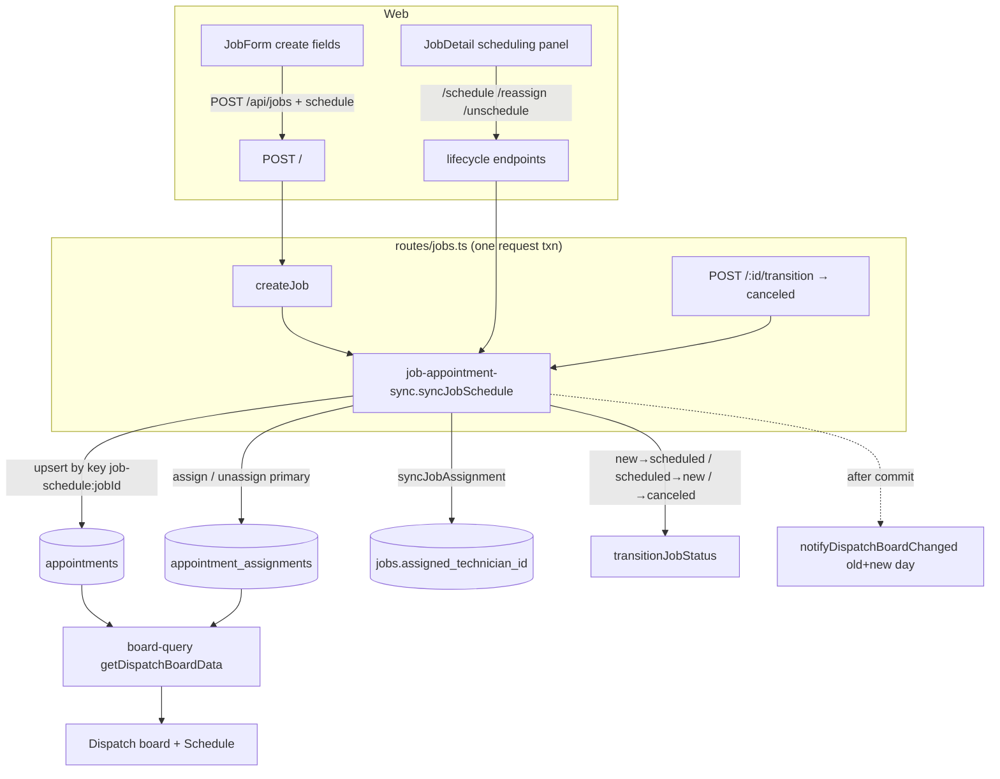

# feat: Direct job scheduling — sync jobs onto the dispatch board via appointments

**Created:** 2026-06-30
**Depth:** Deep
**Status:** plan

## Summary
A directly-created job can never reach the Dispatch board or Schedule
calendar: those surfaces read the `appointments` table (joined to
`appointment_assignments` → technician lanes), and there is no path —
outside estimate conversion — that turns a job into an appointment. This
plan adds a direct job-scheduling capability. Scheduling intent (a start
time + optional technician) on job **create**, plus dedicated
**schedule / reschedule / reassign / unschedule** endpoints, project onto
a linked appointment + primary assignment through a new sync service,
mirroring the proven `from-estimate.ts` machinery. The job's status
advances `new → scheduled`, the technician is denormalized onto
`job.assignedTechnicianId`, and the live board is notified. Includes the
web UI (create-form fields + a Job-detail scheduling panel) and the full
test gate (unit + Docker-gated integration + jsdom/Playwright).

## Problem Frame
Reproduced live: `JOB-0001` "scheduled for Today 2:00 PM" appeared on
neither the Schedule calendar nor the Dispatch board, and stayed status
**"New."**

Root cause (confirmed in source — and the original brief's premise was
partly wrong):
- The board comes from `GET /api/dispatch/board` →
  `packages/api/src/dispatch/board-query.ts` (`getDispatchBoardData`),
  which reads `appointments` via `appointmentRepo.findByDateRange`, groups
  each by its **primary** `appointment_assignments` row
  (`assignments.find(a => a.isPrimary)`, `board-query.ts:204`) into
  technician lanes, and drops the rest into an **unassigned queue**
  (`board-query.ts:202-212`). It never reads `jobs`.
- **`jobs` has no `scheduled_at` column** (migration `016`,
  `schema.ts:366-391`); the comment in `from-estimate.ts:12` states this
  outright. `createJobSchema` (`packages/api/src/shared/contracts.ts:196`)
  and the web `JobForm` carry **no** date/time or technician field, so
  `POST /api/jobs` → `createJob` cannot schedule anything.
- The only path that schedules a job today is
  `POST /api/jobs/from-estimate/:estimateId` →
  `convertEstimateToScheduledJob` (`jobs/from-estimate.ts`), which already
  does the right thing: `createAppointment` (with an idempotency key) +
  `assignTechnician` (primary) + `syncJobAssignment` (denormalize tech onto
  the job) + audit + compensation.

So the real gap is not "scheduledAt is saved but no appointment is
created" — it is **there is no direct job-scheduling path at all**. A
job created without an estimate has no way to acquire a time/technician and
is therefore invisible to dispatch forever.

Affected: dispatchers and owners scheduling non-estimate jobs (emergency
calls, phone-ins, internal work), and any consumer trusting the board as
the source of truth for "what's scheduled."

## Requirements
- R1. A job can be scheduled directly with a start time and optional
  technician, producing a linked appointment that appears on the Dispatch
  board and Schedule calendar **in the same request**.
- R2. Scheduling on **create**: `POST /api/jobs` accepts optional
  `scheduledStart` (+ `technicianId`, `durationMin`, `timezone`) and
  schedules atomically with the job write.
- R3. Dedicated lifecycle endpoints for an existing job:
  `POST /api/jobs/:id/schedule` (initial schedule **or** reschedule — an
  idempotent upsert), `POST /api/jobs/:id/reassign` (change/clear the
  primary technician, keep the slot), `POST /api/jobs/:id/unschedule`
  (remove the schedule).
- R4. **One canonical appointment per job-schedule** (idempotent): repeated
  saves / duplicate clicks never create a second appointment.
- R5. Sync semantics: reschedule moves the appointment's time; reassign
  moves it to the new technician lane (or to **unassigned** when cleared);
  unschedule and job-cancel cancel the appointment; the technician mirror
  on `job.assignedTechnicianId` stays consistent via `syncJobAssignment`.
- R6. Status mapping: first schedule moves the job `new → scheduled`
  (through the lifecycle: timeline + audit); unschedule reverts
  `scheduled → new`; canceling a job cancels its appointment.
- R7. A technician double-booking is rejected as **409** with **no partial
  state** (the job-time change rolls back too).
- R8. Every mutation emits an audit event; all new rows are tenant-scoped
  under existing RLS; times are stored UTC and rendered in tenant tz.
- R9. Web: schedule fields on the create form and a scheduling panel on the
  Job-detail page (schedule / reschedule / reassign / unschedule), meeting
  the mobile bar (≥44px targets, no 320px overflow).
- R10. Full test gate: unit (in-memory repos), Docker-gated integration
  (real Postgres, real columns/constraints), and jsdom + Playwright.

## Key Technical Decisions
- **New parallel sync module, not a refactor of `from-estimate.ts`** —
  per the product decision. `from-estimate.ts` stays untouched (it is a
  shipped, battle-tested path). The new
  `packages/api/src/jobs/job-appointment-sync.ts` mirrors its primitives
  (`createAppointment` / `assignTechnician` / `unassignTechnician` /
  `syncJobAssignment` / audit). Accepts deliberate duplication of the
  create→assign→sync sequence in exchange for zero blast radius on the
  estimate flow. (Alternative — extract a shared core both call — rejected
  by the product decision because it touches the shipped estimate path.)
- **Idempotency key `job-schedule:${jobId}`** — tech/slot-**independent**,
  so the *same* appointment row is the canonical schedule across reschedule
  and repeated saves (R4). Resolution: `appointmentRepo.findByJob` →
  the row whose `idempotencyKey === 'job-schedule:'+jobId` **and**
  `status !== 'canceled'` → `update` it; else `createAppointment` with that
  key. This is the **opposite** of `from-estimate.ts:209-211`, which bakes
  tech+slot into the key because there each override is a distinct
  appointment. The DB partial-unique index
  `idx_appointments_idempotency (tenant_id, idempotency_key)` (migration
  135) + `ON CONFLICT DO NOTHING` re-select (`pg-appointment.ts`) is the
  race backstop. (Alternative — add a join table or a new FK column —
  rejected: `appointments.job_id` already *is* the linkage and the board
  keys off it.)
- **Release the key on cancel** (set `idempotency_key = NULL` when
  canceling/unscheduling) — otherwise a later re-schedule dedupes back into
  the *canceled* row (the `from-estimate.ts:303-306` "revive" trap) and
  attempts an illegal `canceled → scheduled` transition. Freeing the key
  lets the next schedule create a fresh appointment cleanly. (Alternative —
  "revive" the canceled row like from-estimate — rejected for clarity; a
  canceled appointment should stay canceled.)
  **⚠ This is a BLOCKER prerequisite, not a one-liner** (deepening review,
  Finding 2): `PgAppointmentRepository.update`'s `fieldMap`
  (`pg-appointment.ts:241-253`) has **no `idempotencyKey` entry**, so a
  `update({ idempotencyKey: null })` is silently dropped and the NULL never
  reaches SQL; the type `Appointment.idempotencyKey` is `string | undefined`
  and `UpdateAppointmentInput` omits it entirely, so it won't even
  type-check. Releasing the key requires **three coordinated changes**
  (widen `Appointment.idempotencyKey` to `string | null` in
  `appointments/appointment.ts`; add it to `UpdateAppointmentInput`; add
  `idempotencyKey: 'idempotency_key'` to the pg `update` fieldMap) plus a
  unit test asserting the SET clause is emitted. The DB column is already
  nullable with the partial unique index `WHERE idempotency_key IS NOT NULL`
  (migration 135) — only the app layer can't write it today. Tracked in U1
  (types/contract) + U2 (fieldMap + test), not deferred.
- **Scope strictly to OUR key, never "any appointment for this job"** — a
  job may already carry an estimate-created appointment (different key). The
  sync must only ever touch the `job-schedule:` row, or it would hijack an
  estimate visit. (The `assignedTechnicianId` denormalization via
  `syncJobAssignment` is shared and that is intended.)
- **Same-request transaction for atomicity** — `/api` is wrapped by
  `withTenantTransaction`, and every Pg repo call reuses the request-scoped
  client (`db/pg-base.ts`), so the job row + appointment + assignment +
  audit all commit or roll back together (confirmed across `pg-job`,
  `pg-appointment`, `pg-assignment`, `pg-audit` — all extend
  `PgBaseRepository.withTenant`; deepening review Finding 1). The DB EXCLUDE
  `no_double_booking` (migration 131) aborts the whole operation → 409
  (R7). **`notifyDispatchBoardChanged` is reached only on the success
  branch** — after `await syncJobSchedule(...)` returns and before
  `res.json`, **never in a `finally`**. Note (deepening review Finding 4):
  the `/api` `withTenantTransaction` middleware COMMITs on
  `res.once('finish')` *after* `res.json` flushes (`tenant-context.ts:178-189`),
  so this notify is technically *pre-commit*. That is safe **only** because
  it sits on the success path: a 409 throws past it (no spurious revision
  bump), and on success the bump is harmless because clients re-fetch after
  the commit lands. Do **not** describe it as "post-commit." (If a strict
  post-commit guarantee is later wanted, move it to a `res.on('finish')`
  hook gated on `res.statusCode < 400`.) Reschedule notifies **both** the
  old and new day, so the sync must return `previousScheduledStart`.
- **Scheduling is operator-direct, not an AI proposal** — like
  `from-estimate.ts`, this is a human-initiated mutation, so it does **not**
  go through the Zod-proposal / human-approval gate (that gate governs
  AI-drafted `create_appointment` proposals, which remain unchanged). This
  plan adds a second, operator-only appointment-creation path on purpose.
- **Unschedule status revert uses a system-authorized backward move** —
  `scheduled → new` is a backward transition, and `BACKWARD_MOVE_ROLES`
  is `['owner']`, so a dispatcher cannot revert it the normal way. Extend
  `BACKWARD_MOVE_ROLES` to include `'system'` and have the sync call
  `transitionJobStatus(..., actorRole: 'system', reason: 'Schedule cleared')`
  for this *structural* revert (the inverse of the automatic
  `new → scheduled` advance), keeping timeline + audit in one place.
  `'system'` is never a real `req.auth.role`, so this cannot be reached by
  a user spoofing a role. (Alternative — keep owner-only and leave a
  dispatcher's unschedule with status stuck at `scheduled` — rejected: it
  reintroduces the status/board inconsistency we are fixing. See Open
  Questions for the confirm-with-product note.)
- **`PUT /api/jobs/:id` is NOT a scheduling path** — generic job updates
  stay free of schedule side effects, which eliminates the
  "summary-only edit silently cancels the visit" failure mode by
  construction. Schedule changes flow only through the create fields and
  the dedicated endpoints. (See Risks for the pre-existing
  `PUT.assignedTechnicianId` desync.)

## Scope Boundaries
**In scope:**
- API: schedule fields on `POST /api/jobs`; `POST /api/jobs/:id/schedule`,
  `/reassign`, `/unschedule`; the `job-appointment-sync` service;
  job-cancel → appointment-cancel propagation.
- Web: create-form schedule fields; Job-detail scheduling panel + actions.
- Tests: unit, Docker-gated integration, jsdom contract, Playwright.

**Non-goals:**
- Multi-visit jobs (multiple concurrent appointments per job). The model
  is **1:1** job ↔ one canonical `job-schedule:` appointment. Estimate-
  created appointments coexist but are out of this path's scope.
- Reworking `convertEstimateToScheduledJob` or the AI `create_appointment`
  proposal/execution path.
- Drag-and-drop board reassignment, feasibility-preview UI, crew
  (non-primary) assignment from the job page.
- Making `PUT /api/jobs/:id` schedule-aware.
- Auto slot-finding when no `scheduledStart` is given (a direct schedule
  requires an explicit time; from-estimate's auto-pick is not reused here).

### Deferred to follow-up work
- Optional DB hard-guard: a partial unique index
  `(tenant_id, job_id) WHERE idempotency_key LIKE 'job-schedule:%' AND
  status <> 'canceled'`. Not in v1 — the idempotency key already gives
  upsert semantics and a naive index could collide with estimate-created
  rows.
- Converging `PUT.assignedTechnicianId` (which today writes the denormalized
  field without moving the appointment's assignment) onto the reassign
  path, or removing it from the update surface.

## Repository invariants touched
- **tenant_id + RLS:** every appointment / assignment / audit / timeline
  row is written tenant-scoped; `appointments`, `appointment_assignments`,
  `jobs` already FORCE RLS. No new tables.
- **Audit events:** the sync emits the appointment lifecycle audits
  (`appointment.created` via `createAppointment`, assignment audits via
  `assignTechnician`/`unassignTechnician`) plus job-side
  `job.status_changed` (via `transitionJobStatus`) and a new
  `job.scheduled` / `job.unscheduled` / `job.reassigned` domain audit.
  All audit writes stay **in-band** (same transaction) so a rollback leaves
  no orphan audit row.
- **UTC storage / tenant-tz render:** `scheduledStart`/`scheduledEnd`
  stored UTC on `appointments`; the web renders via the existing
  `formatInTenantTz` util.
- **Human-approval gate:** unchanged. This is an operator-direct path
  (precedent: `from-estimate.ts`), not an AI proposal; the AI
  `create_appointment` approval flow is not touched.
- Integer cents, LLM gateway, catalog resolver, entity resolver: **N/A**
  (no money, no AI, no free-text entity refs on this path).

## High-Level Technical Design

Two tables carry "scheduled": **time** on `appointments`, **lane
membership** on `appointment_assignments` (primary). The board groups by
the primary assignment; *unassigned* = appointment with no primary
assignment. So "reassign-to-none" is an assignment-table delete, not an
appointment field.

## Implementation Units

### U1. Schedule-intent contracts & request schemas
- **Goal:** Define the input surface for direct scheduling without any
  appointment behavior yet — the contract that nails presence/null
  semantics first.
- **Requirements:** R2, R3 (shape only).
- **Dependencies:** none.
- **Files:**
  - `packages/api/src/shared/contracts.ts` (extend `createJobSchema` with
    optional `scheduledStart` (ISO datetime), `technicianId` (uuid),
    `durationMin` (positive int), `timezone` (min 1); add
    `scheduleJobSchema`, `reassignJobSchema` (`technicianId: uuid | null`),
    and `unscheduleJobSchema` request schemas, `.strict()`).
  - `packages/api/src/appointments/appointment.ts` (BLOCKER prerequisite,
    Finding 2 — widen `Appointment.idempotencyKey` to `string | null` and
    add `idempotencyKey` to `UpdateAppointmentInput` so the cancel branch
    can clear the key; the pg `update` fieldMap entry + its test land in
    U2).
  - `packages/api/src/jobs/job-appointment-sync.ts` (new — declare the
    `SyncJobScheduleInput` / `SyncJobScheduleDeps` types only in this unit;
    logic lands in U2).
  - `packages/api/test/shared/contracts.test.ts` (or the nearest existing
    contracts test) — **test file**.
- **Approach:** Optional, additive fields so existing callers stay valid.
  `scheduledStart` present ⇒ schedule on create; absent ⇒ today's behavior
  (no appointment). For reassign, model "clear technician" as explicit
  `null` (distinct from absent). Do **not** add a `scheduledAt` column to
  `jobs` and do **not** touch `UpdateJobInput`. The appointment-type
  widening is a typed prerequisite for U2's key-release; verify it doesn't
  break existing `createAppointment` callers (the field stays optional).
- **Patterns to follow:** the `fromEstimateBodySchema` in `routes/jobs.ts`
  (strict zod body), and existing `create*Schema` shapes in
  `shared/contracts.ts`.
- **Test scenarios:**
  - Happy path: `createJobSchema` parses with and without the schedule
    block; the bare (unscheduled) body still parses.
  - Edge cases: `technicianId: null` parses for reassign but is rejected by
    `createJobSchema`/`scheduleJobSchema`; non-ISO `scheduledStart`,
    non-positive `durationMin`, and unknown keys are rejected (`.strict()`).
  - Error/failure: `scheduledStart` present without a valid datetime → zod
    error surfaced as 400 by the route's existing `ZodError` mapping.
- **Verification:** schemas accept the documented bodies and reject the
  documented invalids; no behavior change to existing job create/update.

### U2. `job-appointment-sync` service (the core orchestration)
- **Goal:** A pure, repo-injected `syncJobSchedule(deps, input)` that
  projects schedule intent onto the appointment + assignment + job-status,
  idempotently, with audit — fully unit-tested before any HTTP wiring.
- **Requirements:** R1, R4, R5, R6, R7 (logic), R8.
- **Dependencies:** U1.
- **Files:**
  - `packages/api/src/jobs/job-appointment-sync.ts` (implement).
  - `packages/api/src/jobs/job-lifecycle.ts` (extend `BACKWARD_MOVE_ROLES`
    to include `'system'` for the structural `scheduled → new` revert).
  - `packages/api/src/appointments/pg-appointment.ts` (BLOCKER, Finding 2 —
    add `idempotencyKey: 'idempotency_key'` to the `update` `fieldMap` so
    the cancel branch can write SQL `NULL`; today the field is silently
    dropped).
  - `packages/api/test/jobs/job-appointment-sync.test.ts` — **test file**
    (in-memory repos).
  - `packages/api/test/appointments/pg-appointment.test.ts` (extend — assert
    `update({ idempotencyKey: null })` emits an `idempotency_key = NULL` SET
    clause) — **test file**.
  - `packages/api/test/jobs/job-lifecycle.test.ts` (extend — system
    backward-move authorization).
- **Approach:** One entry point with an `operation` discriminator —
  `schedule | reschedule | reassign | unschedule | cancelForJob` (schedule
  and reschedule share the upsert body). Steps:
  1. Resolve the canonical appointment: `appointmentRepo.findByJob` → the
     row with `idempotencyKey === 'job-schedule:'+jobId` and
     `status !== 'canceled'`.
  2. schedule/reschedule: if found → `appointmentRepo.update` time; else
     `createAppointment({ jobId, scheduledStart, scheduledEnd, timezone,
     idempotencyKey })`. Validate via `validateAppointmentInput` +
     `validateAppointmentTimes` first (mirror `from-estimate.ts:264-279`).
     If a `technicianId` is given, `assignTechnician` (primary).
     **Conflict handling differs by path (deepening review Finding 6) —
     this is the key trap:**
     - *create→assign* (a fresh appointment was just created): on
       `ConflictError`, compensate by canceling the just-created appointment
       **and releasing its key** — but wrap that compensating write in
       `withRequestSavepoint` (pattern: `invoices/schedule-completion.ts:79`)
       so it survives a poisoned transaction; or skip compensation and rely
       purely on whole-request rollback. Let the 409 propagate.
     - *reschedule / assign-into-conflict on an EXISTING appointment*: the
       409 surfaces as SQLSTATE `23P01` from the
       `trg_appointments_sync_to_assignments` trigger
       (`schema.ts:3357-3376`) re-stamping the assignment window — which
       leaves the request transaction in **aborted** state. Do **NOT**
       attempt any follow-up write (it would throw "current transaction is
       aborted" and mask the original `ConflictError`). Just let the
       `ConflictError` propagate; whole-request rollback restores the prior
       time. (`from-estimate`'s compensation only works because its conflict
       normally fires from the application-layer `detectOverlappingAppointments`
       pre-flight *before* any DB write — our reschedule has no such
       pre-flight, so the constraint is the first signal.)
  3. reassign: `unassignTechnician` the current primary (a real row
     `DELETE`, confirmed `assignment.ts:213` → `pg-assignment.ts:156`); if a
     new `technicianId` is given, `assignTechnician` primary. Keep the time.
  4. unschedule / cancelForJob: use the **repo** `appointmentRepo.update`
     (not the `updateAppointment` wrapper, which enforces
     `assertValidAppointmentTransition`/audit — mirror `from-estimate.ts:304`)
     → `{ status: 'canceled', idempotencyKey: null }` (release the key —
     requires the U1+U2 fieldMap changes); drop the primary assignment.
  5. `syncJobAssignment(tenantId, jobId, appointmentId, ...)` after any
     assignment change to keep `assignedTechnicianId` correct (clears it to
     NULL on reassign-to-none — `syncJobAssignment` writes `undefined` and
     pg `update` maps it to SQL NULL, `pg-job.ts:258-262`).
  6. Status: on first schedule when `job.status === 'new'`, forward
     `transitionJobStatus → 'scheduled'`; on unschedule when
     `'scheduled'`, backward `transitionJobStatus('new', actorRole:
     'system', reason: 'Schedule cleared')`. The `'system'` literal MUST be
     hard-coded here, **never** sourced from `req.auth.role` (which is
     validated against `['owner','dispatcher','technician']`, so `'system'`
     is unreachable as a real role — keep it that way; Finding 3). On
     `cancelForJob` the caller's `→ canceled` transition already ran (U5) —
     here just cancel the appointment. Idempotent re-saves of an
     already-`scheduled` job do **not** re-transition.
  7. Emit a `job.scheduled` / `job.unscheduled` / `job.reassigned` audit;
     return `{ appointment, previousScheduledStart? }` so the route can
     board-notify the right day(s).
- **Patterns to follow:** `jobs/from-estimate.ts` (create→assign→sync→audit,
  compensation, validate-before-commit); `appointments/assignment.ts`
  (`assignTechnician` / `unassignTechnician` / `syncJobAssignment`);
  `appointments/appointment.ts` (`createAppointment`,
  `normalizeAppointmentTimeUpdates` presence semantics).
- **Test scenarios:**
  - Happy path: schedule with tech → one appointment, one primary
    assignment, `job.assignedTechnicianId` set, status `new → scheduled`,
    audits present.
  - Idempotency: calling schedule twice with identical input → exactly one
    non-canceled `job-schedule:` appointment; reschedule updates the same
    row's time (no new row).
  - Estimate coexistence: a job already carrying an estimate-created
    appointment (different key) → scheduling creates/manages a **separate**
    `job-schedule:` row; the estimate visit is untouched.
  - Reassign-to-none: clear the tech → primary assignment removed,
    `assignedTechnicianId` cleared; appointment time unchanged.
  - Unschedule: appointment `canceled` + key released; status
    `scheduled → new` recorded (system backward, timeline + audit);
    re-schedule afterward creates a **fresh, distinct** non-canceled
    appointment (not a revived canceled one).
  - Status idempotence: re-saving an already-`scheduled` job does not
    re-emit a status transition.
  - Error/failure (create→assign): double-booked tech on a *fresh* schedule
    → `ConflictError` bubbles; the just-created appointment is compensated
    (canceled, key released), compensation wrapped so it can't double-throw.
  - Error/failure (reschedule): conflict on an *existing* appointment → the
    `ConflictError` propagates with **no** follow-up write attempted (the
    real poisoned-transaction behavior is pinned in U6, not here).
  - Repo SET-clause (BLOCKER pin, Finding 2): unit-assert
    `PgAppointmentRepository.update({ idempotencyKey: null })` emits an
    `idempotency_key = NULL` SET clause (today it is silently dropped).
- **Verification:** all unit scenarios green against in-memory repos; the
  service has no HTTP/Express dependency; the key-release SET clause is
  proven at the repo layer (and end-to-end in U6).

### U3. Wire the create path (schedule-on-create)
- **Goal:** `POST /api/jobs` schedules atomically when schedule fields are
  present.
- **Requirements:** R2, R7, R8.
- **Dependencies:** U2.
- **Files:**
  - `packages/api/src/routes/jobs.ts` (`POST /`: after `createJob`, when
    `parsed.scheduledStart` present, call `syncJobSchedule({operation:
    'schedule'})`; `notifyDispatchBoardChanged` **on the success branch
    only** — after the sync resolves, before `res.json`, never in a
    `finally`, so a 409 skips the bump).
  - `packages/api/src/app.ts` (pass the sync deps — `appointmentRepo`,
    `assignmentRepo`, `userRepo` already constructed near the jobs-router
    wiring — into `createJobRouter`).
  - `packages/api/test/routes/jobs.route.test.ts` (extend) — **test file**.
- **Approach:** Same handler, same request transaction, so job + appointment
  + assignment commit together; a `ConflictError` from the sync maps to 409
  via `toErrorResponse` and rolls the job back (create+schedule is
  **all-or-nothing**). Validate `technicianId` references a `technician`
  user (reuse the from-estimate guard) before assigning. Board-notify only
  after success.
- **Patterns to follow:** the existing `POST /` handler and the
  `from-estimate` route's deps-optional wiring (`fromEstimateDeps`).
- **Test scenarios:**
  - Happy path: create with `scheduledStart` + `technicianId` → 201; the
    job is `scheduled`; a board fetch for that day shows the appointment in
    the tech's lane.
  - Create with `scheduledStart`, no tech → 201; appointment in the
    **unassigned** queue; job `scheduled`.
  - Create with no schedule → 201; today's behavior (no appointment),
    status `new`.
  - Error/failure: double-booked tech → 409 and **no job created** (assert
    the job count is unchanged); board revision **not** bumped.
- **Verification:** create-with-schedule reaches the board in one request;
  conflict is atomic.

### U4. Dedicated lifecycle endpoints (schedule / reschedule / reassign / unschedule)
- **Goal:** Manage an existing job's schedule.
- **Requirements:** R3, R4, R5, R6, R7.
- **Dependencies:** U2.
- **Files:**
  - `packages/api/src/routes/jobs.ts` (`POST /:id/schedule`,
    `POST /:id/reassign`, `POST /:id/unschedule`; ownership-check the job;
    map operations to `syncJobSchedule`; board-notify the affected day(s)).
  - `packages/api/test/routes/jobs.route.test.ts` (extend) — **test file**.
- **Approach:** `POST /:id/schedule` covers both initial schedule and
  reschedule (idempotent upsert by key). Reschedule must
  `notifyDispatchBoardChanged` for **both** the old day (from
  `previousScheduledStart`) and the new day. `reassign` accepts
  `technicianId: uuid | null`. `unschedule` requires the existing schedule
  to be present (404/409 if none). All wrapped in the request transaction;
  conflicts → 409 with no partial state.
- **Patterns to follow:** the existing appointment proposal handlers
  (`reschedule-handler.ts`, `reassignment-handler.ts`,
  `cancellation-handler.ts`) for the board-notify-old+new-day idiom; the
  `POST /:id/transition` handler for route shape.
- **Test scenarios:**
  - Happy path: schedule an unscheduled job → appears on board; reschedule
    to a new day → moves; board revision bumped for old **and** new day.
  - Reassign: move to a new tech → lane changes; reassign to `null` →
    unassigned queue.
  - Unschedule: appointment off the board; job `scheduled → new`.
  - Edge: unschedule a job with no schedule → 409/404 (no-op, documented).
  - Error/failure: reschedule into a conflicting slot → 409; the job's and
    appointment's times are **both** unchanged (rollback verified).
- **Verification:** each endpoint produces the expected board state;
  conflicts are atomic.

### U5. Cancel-the-job → cancel-the-appointment propagation
- **Goal:** Canceling a job removes its appointment from the board.
- **Requirements:** R5, R6, R8.
- **Dependencies:** U2.
- **Files:**
  - `packages/api/src/routes/jobs.ts` (`POST /:id/transition`: when
    `status === 'canceled'`, after `transitionJobStatus`, call
    `syncJobSchedule({operation: 'cancelForJob'})` and board-notify),
    mirroring how the handler already layers side effects on `completed`.
  - `packages/api/test/routes/jobs.route.test.ts` (extend) — **test file**.
- **Approach:** Reuse the sync's cancel branch (cancel appointment + release
  key + drop primary assignment). Keep it in the same request transaction
  so a failed cancel rolls the status change back. Best-effort
  board-notify after.
- **Patterns to follow:** the `completed`-status side-effect block in the
  existing transition handler (`routes/jobs.ts:348-391`).
- **Test scenarios:**
  - Happy path: cancel a scheduled job → linked appointment `canceled` and
    absent from the board.
  - Edge: cancel a job with no appointment → no-op, no error.
  - Integration-pinned (U6): a re-opened (`canceled → new`) then
    re-scheduled job gets a fresh appointment.
- **Verification:** canceled jobs never leave a live appointment on the
  board.

### U6. Docker-gated integration tests (real Postgres)
- **Goal:** Prove the SQL/constraints against a real schema — the
  authoritative gate (CLAUDE.md: mocked-DB tests are necessary but never
  sufficient; the idempotency unique index and `no_double_booking` EXCLUDE
  only exist in real Postgres).
- **Requirements:** R4, R7 and end-to-end R1/R5/R6.
- **Dependencies:** U2–U5.
- **Files:**
  - `packages/api/test/integration/job-appointment-sync.test.ts` (new) —
    **test file**.
- **Approach:** Drive the real routes via `supertest` against the
  testcontainer/`EXTERNAL_TEST_DB_URL` Postgres, seeding tenant + users +
  customer + location via the existing integration harness, and assert on
  **board output** (`getDispatchBoardData`) and real DB rows — not on the
  job field alone.
- **Patterns to follow:** `test/integration/jobs.test.ts`,
  `test/integration/appointments.test.ts`, the shared
  tenant/RLS/seed helpers, and the
  `docs/solutions/database-issues/mocked-pool-hides-real-schema-mismatch.md`
  recipe (drive the real route, pin real columns).
- **Test scenarios (Integration — mocks can't prove these):**
  - Idempotency upsert: schedule the same job twice → exactly **one**
    non-canceled `job-schedule:` appointment row (unique index enforced).
  - Concurrent create race: two simultaneous schedules of the same job →
    one insert wins, one dedupes; single row.
  - `no_double_booking` (Finding 6 — the poisoned-txn trap): reschedule an
    existing appointment into a slot the tech already holds → the
    `trg_appointments_sync_to_assignments` trigger trips `23P01`; assert the
    route returns **409, not 500** (no secondary compensating write masks
    the `ConflictError`), and **both** job-time and appointment-time are
    unchanged (whole-request rollback).
  - Concurrent reschedule-vs-cancel: a reschedule and an unschedule of the
    same job racing → a single coherent terminal state (no orphan
    appointment, no duplicate), exercising the unique index + rollback.
  - Board reflects schedule: after scheduling, `getDispatchBoardData` for
    that day shows the appointment in the tech lane; reassign-to-none moves
    it to `unassignedAppointments` and out of the old lane.
  - Cancel/unschedule: appointment off the board; key released; a
    subsequent schedule creates a fresh row (no `canceled → scheduled`).
  - Status + audit: first schedule writes a `job.status_changed`
    (`new → scheduled`) timeline + audit; unschedule writes the
    system-backward revert.
- **Verification:** the suite is red if any query/column/constraint drifts
  from the schema; green proves the path end-to-end on real Postgres.

### U7. Web — create-form schedule fields
- **Goal:** Let the operator schedule while creating a job.
- **Requirements:** R9.
- **Dependencies:** U3.
- **Files:**
  - `packages/web/src/components/jobs/JobForm.tsx` (optional schedule
    section: date/time input, technician `Select` from `useTechnicianRoster`,
    optional duration; include `scheduledStart`/`technicianId`/`durationMin`/
    `timezone` in the POST body only when a time is set).
  - `packages/web/src/components/jobs/__tests__/JobForm.test.tsx` (extend or
    add) — **test file** (jsdom class-contract: `min-h-11` on the new
    controls, no 320px overflow, body shape with/without a time).
- **Approach:** Reuse `useTechnicianRoster` (`GET /api/users?role=technician`)
  and `formatInTenantTz`. Keep the schedule block optional so the existing
  "create unscheduled job" flow is unchanged. Render the tenant timezone for
  the time field.
- **Patterns to follow:** `hooks/useTechnicianRoster.ts`, the scheduling
  inputs in `pages/appointments/AppointmentEdit.tsx` and
  `components/dispatch/` (e.g. `useCreateScheduleProposal`), and existing
  `JobForm` field/`min-h-11` conventions.
- **Test scenarios:**
  - Happy path: filling the time (+ tech) posts a body containing the
    schedule fields; leaving it empty posts the legacy body.
  - Class-contract: new controls carry `min-h-11`; container has no
    horizontal overflow at 320px.
  - `Test expectation: none` — N/A (this unit bears behavior + layout).
- **Verification:** create form can schedule; mobile bar met in jsdom.

### U8. Web — Job-detail scheduling panel + actions (+ Playwright)
- **Goal:** Schedule / reschedule / reassign / unschedule an existing job
  from its detail page, and an end-to-end mobile proof.
- **Requirements:** R9, R10.
- **Dependencies:** U4.
- **Files:**
  - `packages/web/src/pages/jobs/JobDetail.tsx` (scheduling panel: current
    appointment summary + actions calling `/api/jobs/:id/schedule`,
    `/reassign`, `/unschedule`; refetch on success).
  - `packages/web/src/pages/jobs/__tests__/JobDetail.test.tsx` (extend/add)
    — **test file** (jsdom: actions render, call the right endpoints,
    `min-h-11`, no 320px overflow).
  - `packages/web/e2e/job-scheduling-mobile.spec.ts` (new) — **Playwright
    viewport test**.
- **Approach:** Fetch the job's appointment (via the job-detail enrich or
  `GET /api/appointments?jobId=`), show it, and expose the four actions
  with confirm states. Reassign uses `useTechnicianRoster`. Render times via
  `formatInTenantTz`.
- **Patterns to follow:** `pages/appointments/AppointmentEdit.tsx`,
  `pages/dispatch/DispatchBoard.tsx`, and the mobile-proof pattern in
  `e2e/estimate-approval-mobile.spec.ts`.
- **Test scenarios:**
  - Happy path: schedule from the panel → appointment summary appears;
    reschedule updates it; reassign changes the tech; unschedule clears it.
  - Class-contract: action buttons `min-h-11`; panel has no 320px overflow.
  - Integration (Playwright): at a mobile viewport, schedule a job and
    confirm it renders without overflow and the controls are tappable.
- **Verification:** the Job-detail page drives all four actions and meets
  the mobile bar in jsdom + Playwright.

## Risks & Dependencies
- **`PUT /api/jobs/:id` `assignedTechnicianId` desync (pre-existing).**
  `UpdateJobInput` allows `assignedTechnicianId` (`jobs/job.ts:147`), so a
  PUT can change the denormalized field **without** moving the appointment's
  primary assignment — the board (which reads the assignment) would not
  follow. This plan makes the reassign endpoint canonical and leaves PUT
  unchanged; converging or removing PUT's tech field is **deferred** and
  listed above. Tests must assert lane membership via the **board query**,
  not the job row, so this divergence can't hide.
- **Idempotency key reuse after cancel (BLOCKER, Finding 2).** The
  appointment repo cannot write `idempotency_key = NULL` today (no fieldMap
  entry; type omits it), so the "fresh appointment after cancel" behavior is
  *broken until* the three coordinated changes in U1 (type/contract) + U2
  (pg fieldMap) land. Pinned by a repo-layer SET-clause unit test (U2) and
  the schedule→unschedule→schedule integration test (U6).
- **Compensation inside a poisoned transaction (Finding 6).** A reschedule
  conflict is a DB-trigger `23P01` that aborts the request transaction; any
  follow-up compensating write then throws "current transaction is aborted"
  and masks the original `ConflictError` (→ 500 instead of 409). The sync
  must compensate **only** on the create→assign path (savepoint-wrapped via
  `withRequestSavepoint`, or not at all) and never on the reschedule path.
  Pinned by a U6 test asserting reschedule-conflict returns **409, not 500**,
  with the appointment time unchanged.
- **Board notify is pre-commit, not post-commit (Finding 4).** Under the
  `/api` middleware, COMMIT fires on `res.finish` *after* `res.json`, so the
  notify in the handler body runs before commit. Safe only because it sits
  on the success branch (a 409 throws past it). Pinned by the
  conflict-atomicity tests asserting the revision is **not** bumped on 409.
- **Two appointment-creation paths now exist** (operator-direct here, AI
  proposal elsewhere). Intended; documented under invariants. The sync's
  strict key-scoping keeps them from colliding on the same job.

## Open Questions (deferred to implementation)
- **Unschedule status revert authorization.** This plan extends
  `BACKWARD_MOVE_ROLES` with `'system'` so a dispatcher's unschedule can
  revert `scheduled → new`. Confirm with the lifecycle owner that a
  system-authorized structural revert is acceptable vs. keeping unschedule
  owner-only (which would leave a dispatcher's job stuck at `scheduled`).
  If owner-only is required, unschedule must either 403 for non-owners or
  cancel the appointment while leaving status `scheduled` (and the UI must
  reflect that).
  *(Resolved — formerly an open question on whether `appointmentRepo.update`
  can null `idempotency_key`. The deepening review confirmed it CANNOT today;
  the fix is now a required BLOCKER sub-task in U1+U2, not an open question.)*
- **Default `durationMin`.** `from-estimate.ts` uses 60. Confirm the same
  default here, or whether the create/schedule UI should require a duration.
- **Appointment `appointmentType` on direct schedule.** Whether a
  directly-scheduled job's appointment should default `appointmentType`
  (e.g. `repair`) or leave it null. Cosmetic on the board; default null
  unless product wants otherwise.

## Sources & Research
- Prior learnings (load-bearing):
  - `docs/solutions/database-issues/mocked-pool-hides-real-schema-mismatch.md`
    — mandates the U6 Docker-gated integration tests over real columns.
  - `docs/solutions/architecture-patterns/sse-streams-bypass-request-transaction-under-pgbouncer.md`
    — confirms `/api` runs one request transaction (atomicity lever) and
    that the dispatch board is an SSE stream fed by an in-process bus
    (`notifyDispatchBoardChanged`).
  - `docs/solutions/architecture-patterns/per-tenant-job-shared-idempotency-key.md`
    — informs the single canonical `job-schedule:${jobId}` key.
- Canonical pattern mirrored: `packages/api/src/jobs/from-estimate.ts`
  (appointment + primary assignment + `syncJobAssignment` + idempotency +
  compensation + audit).
- **Adversarial deepening review (2026-06-30)** verified the 7 riskiest
  claims against source. Folded back: 1 BLOCKER (key-release needs a 3-part
  repo/contract change, not a one-liner — U1+U2), and SHOULD-FIX
  corrections to board-notify timing (pre-commit, success-branch only) and
  conflict compensation (savepoint-wrapped / per-operation, to avoid a
  poisoned-transaction double-throw). Confirmed sound: same-request-txn
  atomicity, the `'system'` backward-move (incl. the privilege-hole check),
  and reassign-to-none → unassigned lane.
