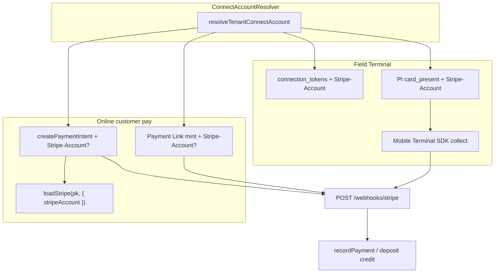

# feat: Complete Stripe Connect routing and Terminal for trades payments

**Created:** 2026-07-14  
**Depth:** Deep  
**Status:** plan  
**PRD:** `docs/strategy/prd-stripe-trades-payments.md`  
**Stripe API:** `2026-06-24.dahlia`

## Summary

Finish routing all end-customer Stripe charges to the tenant’s Connect Express account (PaymentIntent `/pay` path, operator payment links, estimate deposits, and Stripe.js `stripeAccount`), then add Stripe Terminal (connection tokens + card-present PaymentIntents + mobile collect) so field techs can take in-person payments that settle through the existing invoice/deposit webhook ledger. SaaS subscription billing stays on the platform account.

## Problem Frame

Connect onboarding exists, but several charge paths still mint objects on the platform secret key without `Stripe-Account`. For in-person trades, that means “Stripe is connected” does not guarantee money lands in the contractor’s bank, and techs still cannot collect card-present at the job site. Owners and customers experience a broken money loop relative to competitor field tools.

## Requirements

- R1. Reuse `ConnectAccountResolver`; platform fallback only when Connect missing or `chargesEnabled === false`.
- R2. Online PaymentIntents: optional Connect header; `automatic_payment_methods[enabled]=true`; **no** `payment_method_types`.
- R3. Public create-payment-intent returns `stripeAccountId` when Connect-scoped.
- R4. Web Elements init with `loadStripe(pk, { stripeAccount })` when account present (`InvoicePaymentPage`, portal payment methods if SetupIntent already Connect-scoped — verify parity).
- R5. Operator invoice payment-link minting is Connect-aware (same pattern as `PublicInvoiceService`).
- R6. Estimate deposit checkout minting is Connect-aware (including deactivate with same account header).
- R7. Terminal: Locations/connection tokens + card-present PI on Connect (`payment_method_types: ['card_present']` only here).
- R8. Terminal settlement via existing webhooks → `recordPayment` / deposit credit (`metadata.invoice_id` | `deposit_for_job_id`, `tenant_id`).
- R9. Explicit human collect action; no AI auto-charge.
- R10. Audit Connect routing + Terminal collect attempts.
- R11. Idempotency keys include account scope (`acct_…` or `platform`).
- R12. Ops doc: Connect webhook listening checklist (Stripe MCP / Dashboard) — PRD §13.

## Key Technical Decisions

- **Keep direct charges (`Stripe-Account`)** — Matches existing Express + public invoice Payment Link design. (Alternatives: destination charges / separate charges & transfers — rejected for this plan to avoid dual models and payout confusion.)
- **Do not introduce application fees in this plan** — Monetization of payment volume is a product decision; omit `application_fee_amount` unless a follow-up PRD adds it.
- **Extend fetch-based Stripe wrappers** — Stay consistent with `stripe-payment-intent.ts` / `stripe-payment-link.ts` (no full Stripe SDK dependency unless Terminal JS/mobile SDKs require client packages).
- **Terminal MVP on mobile** — Connection token + server-created card-present PI; collect UI in `packages/mobile` (primary field surface). Web technician day view may deep-link later (deferred).
- **Platform fallback retained** — Tenants without Connect keep today’s platform charge path; document as legacy, not a second product mode forever.
- **Stripe MCP** — Cloud agents cannot authenticate Stripe MCP interactively; Phase 2 verification is a human/Dashboard/CLI checklist. Desktop Cursor with Stripe MCP authenticated can execute the same checklist via MCP tools when available.

## Scope Boundaries

**In scope:** Connect routing for public PaymentIntents, operator payment links, deposits; Elements `stripeAccount`; Terminal API + mobile collect MVP; webhook/ops checklist; tests per unit.

**Non-goals:** Accounts v2 migration; tips/Venmo/store credit; Wisetack funded→paid; Checkout Session rewrite of all Payment Links; application fees; multi-currency; web tech Terminal UI.

### Deferred to follow-up work

- Reader hardware provisioning UX beyond minimal Location create
- Offline Terminal / store-and-forward
- Destination-charge migration evaluation
- Partial-pay owner UI (API already supports partials)

## Repository invariants touched

- **Integer cents** — all PI/link/Terminal amounts from `amountDueCents` / deposit remaining cents.
- **tenant_id + RLS** — Connect resolve only from invoice/job tenant; public routes still token-gated.
- **Audit events** — routing decision + Terminal collect start/success/fail.
- **Human-approval gate** — unchanged for proposals; Terminal is explicit tech action, not proposal auto-exec.
- **LLM gateway / catalog / entity resolver** — not in scope.

## High-Level Technical Design

**Sequencing:** U1 shared helper → U2 public PI + web Elements → U3 operator links → U4 deposits → U5 portal Elements parity + audit → U6 webhook/ops doc → U7 Terminal server → U8 mobile collect → U9 integration/e2e matrix.

## Implementation Units

### U1. Connect-aware PaymentIntent helper

- **Goal:** Extend `createPaymentIntent` to optionally set `Stripe-Account` and scope idempotency keys by account.
- **Requirements:** R1, R2, R11
- **Dependencies:** none
- **Files:**
  - `packages/api/src/payments/stripe-payment-intent.ts`
  - `packages/api/test/payments/stripe-payment-intent.test.ts`
- **Approach:** Add optional `stripeAccountId?: string` to input/config. When set, add header `Stripe-Account`. Change idempotency key to `pi_{invoiceId}_{amount}_{acct|platform}`. Keep `automatic_payment_methods[enabled]=true`; do not add `payment_method_types`.
- **Patterns to follow:** `packages/api/src/payments/stripe-saved-card.ts` (header gating); existing fetch wrapper style in `stripe-payment-intent.ts`.
- **Test scenarios:**
  - Happy path: with `stripeAccountId` → request includes `Stripe-Account` and Connect-scoped idempotency key.
  - Happy path: without account → no header; key ends with `platform`.
  - Error/failure: Stripe non-OK → throw with status body (existing behavior preserved).
  - Edge: amount validation still rejects non-positive / non-integer cents.
- **Verification:** Unit tests pass; no route wiring yet.

### U2. Public `/pay` PaymentIntent + Elements Connect context

- **Goal:** Public pay page creates Connect-scoped PIs and confirms with matching Stripe.js account.
- **Requirements:** R1–R4, R10
- **Dependencies:** U1
- **Files:**
  - `packages/api/src/routes/public-payments.ts`
  - `packages/api/src/app.ts` (wire `connectAccountResolver` into public payments deps)
  - `packages/web/src/components/customer/InvoicePaymentPage.tsx`
  - `packages/api/test/routes/public-payments.route.test.ts`
  - `packages/web/src/components/customer/InvoicePaymentPage.test.tsx`
- **Approach:** Resolve Connect from invoice.tenantId; pass `stripeAccountId` into `createPaymentIntent`; JSON response includes `stripeAccountId: string | null`. Frontend `loadStripe(key, account ? { stripeAccount: account } : undefined)` using returned account (not a second guess). Audit log when falling back to platform.
- **Patterns to follow:** `PublicInvoiceService.getOrCreateCheckoutUrl` Connect block; portal SetupIntent Connect resolve in `public-portal.ts`.
- **Test scenarios:**
  - Happy path: Connect active → fetch spy sees `Stripe-Account`; response includes account id.
  - Happy path: Connect inactive → no header; `stripeAccountId: null`.
  - Edge: expired/mismatched view token → 404 (unchanged).
  - Edge: non-payable status → 409 (unchanged).
  - Frontend: when `stripeAccountId` present, `loadStripe` called with `{ stripeAccount }`.
- **Verification:** Route + page tests green; manual test-mode pay optional.

### U3. Operator invoice payment link on Connect

- **Goal:** `POST /api/invoices/:id/payment-link` mints links on the tenant Connect account when enabled.
- **Requirements:** R5, R1, R11
- **Dependencies:** none (can parallel U2); shares resolver pattern with U4
- **Files:**
  - `packages/api/src/invoices/invoice-payment-link.ts`
  - `packages/api/src/payments/stripe-payment-link.ts` and/or `payment-link-provider.ts`
  - `packages/api/src/routes/invoices.ts` (deps wiring if needed)
  - `packages/api/src/app.ts`
  - `packages/api/test/invoices/invoice-payment-link.test.ts`
  - `packages/api/test/payments/stripe-payment-link-restriction.test.ts` (extend)
- **Approach:** Thread optional `stripeAccountId` / resolver into `PaymentLinkProvider.generateLink` (and deactivate). Prefer extending `StripePaymentLinkProvider` rather than duplicating `PublicInvoiceService` fetch body — if provider stays platform-only by design, either (a) teach provider Connect headers or (b) route operator mint through the same code path as `PublicInvoiceService`. Prefer (a) for one mint implementation. When reminting after Connect activation, deactivate prior platform link if ids differ in account scope.
- **Patterns to follow:** `public-invoice-service.ts` Connect header + deactivate headers.
- **Test scenarios:**
  - Happy path: Connect enabled → Payment Links API called with `Stripe-Account`.
  - Happy path: existing URL returned without remint when still valid.
  - Edge: Connect disabled → platform mint (legacy).
  - Error: non-payable invoice → Conflict/Validation (unchanged).
- **Verification:** Unit tests assert header presence; invoices route smoke if present.

### U4. Estimate deposit checkout on Connect

- **Goal:** Deposit Payment Links settle on the tenant Connect account.
- **Requirements:** R6, R1, R11
- **Dependencies:** U3 provider changes helpful but not required if deposit keeps inline fetch — still apply same header pattern.
- **Files:**
  - `packages/api/src/estimates/public-estimate-service.ts`
  - `packages/api/src/app.ts` (pass resolver into estimate service deps if missing)
  - `packages/api/test/estimates/public-estimate-service.test.ts`
  - `packages/api/test/invoices/public-invoice-connect.test.ts` (mirror patterns) or new `packages/api/test/estimates/public-estimate-deposit-connect.test.ts`
- **Approach:** Mirror invoice Connect block: resolve tenant Connect; set `Stripe-Account` on create + deactivate; metadata still `deposit_for_job_id` + `tenant_id` for webhook credit. Expiry/remint logic unchanged.
- **Patterns to follow:** `PublicInvoiceService.getOrCreateCheckoutUrl`; existing deposit expiry deactivate in `getOrCreateDepositCheckoutUrl`.
- **Test scenarios:**
  - Happy path: Connect active → create/deactivate include `Stripe-Account`.
  - Happy path: live existing link returned without remint.
  - Edge: expired link deactivated with same account header then reminted.
  - Edge: no deposit required → ValidationError (unchanged).
- **Verification:** Deposit Connect unit tests pass.

### U5. Portal Elements parity + routing audit helper

- **Goal:** Portal saved-card Elements uses Connect `stripeAccount` consistently; shared small helper avoids drift.
- **Requirements:** R4, R10
- **Dependencies:** U2 (response shape / helper)
- **Files:**
  - `packages/web/src/pages/portal/PortalPaymentMethods.tsx`
  - `packages/web/src/lib/stripeConnect.ts` (new thin helper: `loadStripeForAccount(pk, accountId | null)`)
  - `packages/web/src/pages/portal/__tests__/PortalPaymentMethods.test.tsx`
  - `packages/api/src/payments/connect-routing-audit.ts` (optional tiny helper) + unit test
  - `packages/api/test/portal/portal-payment-methods.test.ts` (API already Connect — assert client contract if API returns account id)
- **Approach:** If SetupIntent API does not already return `stripeAccountId`, add it for the client. Centralize `loadStripeForAccount`. Emit audit metadata `{ tenantId, surface, stripeAccountId | 'platform' }`.
- **Patterns to follow:** U2 InvoicePaymentPage; portal SetupIntent Connect resolve.
- **Test scenarios:**
  - Happy path: Connect SetupIntent → Elements inited with `stripeAccount`.
  - Edge: no Connect → loadStripe without second arg.
- **Verification:** Portal + shared helper tests pass.

### U6. Webhook / ops Connect listening checklist

- **Goal:** Document and, where code-feasible, harden handling so Connect-originated events reconcile.
- **Requirements:** R8, R12
- **Dependencies:** U2–U4 (events will carry `event.account`)
- **Files:**
  - `docs/strategy/prd-stripe-trades-payments.md` §13 (keep in sync)
  - `docs/beta-verification-runbook.md` or new `docs/ops/stripe-connect-webhooks.md`
  - `packages/api/src/webhooks/routes.ts` (only if a bug is found ignoring `event.account` for payment recording — do not change SaaS branches)
  - `packages/api/test/webhooks/stripe-payment-events.test.ts` (add case: event with `account` field still records payment)
- **Approach:** Code: ensure payment handlers key off metadata + provider_reference, not assuming platform-only object ids. Docs: Dashboard/MCP checklist for “Events on Connected accounts.” Note Stripe MCP auth must be done in Cursor desktop.
- **Patterns to follow:** Existing webhook idempotency in `webhook-handler.ts`.
- **Test scenarios:**
  - Happy path: `payment_intent.succeeded` with `event.account = acct_…` and invoice metadata → `recordPayment`.
  - Edge: duplicate delivery → idempotent no double credit.
  - Test expectation for pure docs file: none — ops checklist only (if no code change in a commit, say so); if code touched, tests above required.
- **Verification:** Checklist merged; webhook test with `account` present passes.

### U7. Terminal server: connection token + card-present PaymentIntent

- **Goal:** Authenticated API for field clients to start a Terminal payment on Connect.
- **Requirements:** R7–R11, N1–N3
- **Dependencies:** U1 (shared PI patterns; Terminal PI is a separate function)
- **Files:**
  - `packages/api/src/payments/stripe-terminal.ts` (new)
  - `packages/api/src/routes/terminal.ts` (new) or nest under `packages/api/src/routes/payments.ts`
  - `packages/api/src/app.ts` (mount + auth)
  - `packages/shared/src/contracts/` (request/response Zod if shared)
  - `packages/api/test/payments/stripe-terminal.test.ts`
  - `packages/api/test/routes/terminal.route.test.ts`
- **Approach:**
  - `POST /api/terminal/connection-token` — tenant-auth; resolve Connect; require `chargesEnabled`; `POST /v1/terminal/connection_tokens` with `Stripe-Account`.
  - `POST /api/terminal/payment-intents` — body `{ invoiceId }` or `{ jobId, purpose: 'deposit' }`; server loads outstanding cents; create PI with `payment_method_types[]=card_present`, metadata, Connect header, scoped idempotency key; return `{ clientSecret, paymentIntentId, stripeAccountId, amountCents }`.
  - Optional: ensure a Terminal Location exists per Connect account (create-once, store id on tenant or settings column — additive migration if persisted).
  - Reject if Connect not ready with clear `CONNECT_REQUIRED` error for mobile fallback.
- **Patterns to follow:** `createPaymentIntent` fetch style; billing Connect gating; webhook metadata conventions.
- **Test scenarios:**
  - Happy path: Connect active → connection token + PI include `Stripe-Account`; PI body includes `card_present` only (no automatic_payment_methods conflict — follow Stripe Terminal docs: use `payment_method_types`).
  - Error: Connect missing → 409/400 `CONNECT_REQUIRED`.
  - Error: invoice not payable / amount 0 → conflict.
  - Edge: idempotent replay same invoice+amount+account returns stable key behavior.
  - Auth: unauthenticated → 401.
- **Verification:** Unit + route tests green; `tsc --project tsconfig.build.json --noEmit` clean.

### U8. Mobile field collect UI (Terminal MVP)

- **Goal:** Tech collects card-present payment for an open invoice from mobile.
- **Requirements:** R7–R9, N6
- **Dependencies:** U7
- **Files:**
  - `packages/mobile/` screens/components for collect payment (follow existing invoice screens under `packages/mobile/app/invoices/` or `src/screens/`)
  - Stripe Terminal React Native (or chosen) client dependency — pin version in mobile package.json
  - `packages/mobile/src/...` tests (Jest) for gating UI + API client
  - Class-contract / tap-target test if new primary buttons
- **Approach:** “Collect payment” on invoice detail → fetch connection token + PI → Terminal SDK collect/confirm → rely on webhook for ledger (poll invoice status like web `useInvoiceStatus` if a hook exists or add lightweight poll). Fallback CTAs: open pay link / mark cash if role allows. No card data through Rivet servers.
- **Patterns to follow:** Mobile proposal review / invoice screens; web status polling pattern.
- **Test scenarios:**
  - Happy path: Connect ready → collect button enabled → API called with invoice id.
  - Edge: `CONNECT_REQUIRED` → show fallback pay link / instructions (no crash).
  - UI: primary collect control `min-h-11` / ≥44px class contract.
  - Error: SDK failure → error message + fallback actions.
- **Verification:** Mobile unit tests pass; manual Terminal test-mode on a supported device noted in PR.

### U9. Integration matrix + e2e stubs

- **Goal:** Prove Connect header matrix and keep Playwright stubs compatible.
- **Requirements:** R1–R6, N5
- **Dependencies:** U2–U4, U7
- **Files:**
  - `packages/api/test/integration/payments-connect-routing.test.ts` (new, Docker-gated)
  - `e2e/helpers/stripe-stub.ts` (extend if response shape adds `stripeAccountId`)
  - `packages/api/test/invoices/public-invoice-connect.test.ts` (ensure still green)
- **Approach:** Integration test (or strong route suite if Docker unavailable in CI job already used for payments) asserts for Connect-active tenant fixtures that PI create, operator link, and deposit mint send `Stripe-Account`. Document skip behavior consistent with other integration tests.
- **Patterns to follow:** `packages/api/test/integration/payments.test.ts`, `public-invoice-connect.test.ts`.
- **Test scenarios:**
  - Integration: Connect tenant → three mint paths include header.
  - Integration: non-Connect tenant → no header.
  - E2E stub: pay page still loads with new JSON fields.
- **Verification:** Integration job passes when Docker available; e2e stubs updated.

## Risks & Dependencies

- **Tap to Pay + Connect SDK quirks** — Prefer server-created PIs + connection tokens on the connected account; validate on target mobile OS early in U8.
- **Stale platform Payment Links** after Connect activation — U3/U4 remint/deactivate; consider one-off ops note.
- **Webhook Connect listening** — Without Dashboard config, ledger won’t update; U6 is blocking for production Phase 1/3.
- **Publishable key** — Platform `pk_` + `stripeAccount` option is correct for direct charges Elements; do not switch to connected-account publishable keys unless Stripe docs for a specific flow require it.
- **Stripe MCP** — Not usable until authenticated in Cursor desktop; plan does not block on MCP for implementation.

## Open Questions

- Persist Terminal `location_id` on `tenants` vs settings JSON — decide in U7 based on minimal migration cost.
- Whether technician web (`TechnicianDayView`) needs a collect entry point in the same epic or a follow-up.
- Exact Terminal React Native package version compatible with Expo/RN version in `packages/mobile` — resolve during U8 spike (≤1 day engineering), not a product fork.

## Sources & Research

- Codebase audit: Connect-aware `PublicInvoiceService`; platform-only `createPaymentIntent`, operator `createInvoicePaymentLink`, deposit `getOrCreateDepositCheckoutUrl`.
- `docs/strategy/parity-jobs-invoicing.md` — C3 Terminal / Connect extension.
- Stripe docs: Terminal + Connect direct charges require `Stripe-Account` on Terminal objects and PIs; online flows omit `payment_method_types`; Terminal uses `card_present`.
- Stripe best-practices skill: API `2026-06-24.dahlia`; RAK preference; dynamic PMs online.
