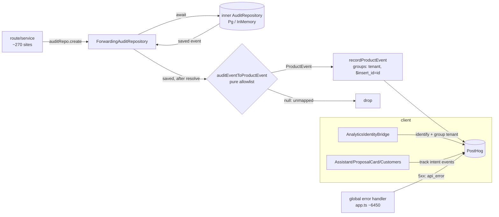

# feat: PostHog feature-domain instrumentation via the audit stream

**Created:** 2026-07-16
**Depth:** Deep
**Status:** plan

## Summary

Give PostHog near-complete visibility into the *product* — every business
mutation across all ~13 feature domains — by forwarding the existing audit-event
stream through one PII-guarded, allowlisted seam, rather than hand-instrumenting
~270 call sites. Add the pieces audit can't see (a few client intent/view events
and backend `api_error`), plus tenant **group analytics** so every metric can be
sliced by tenant, vertical, and plan. The result answers three questions we
cannot answer today: *where are customers hitting errors*, *which feature is most
used (so it can anchor marketing)*, and *what is the real usage funnel* (e.g. we
pitch calling, but tenants lean on invoice-voice more).

## Problem Frame

PostHog currently sees the acquisition → activation → conversion funnel and
nothing else. Of ~65 API route modules, exactly two emit product events. The
moment a tenant is a paying customer *using* the product — assistant, proposals,
estimates, invoices, payments, jobs, appointments, customers, catalog, voice,
settings, agreements, feedback — PostHog is blind. So "which features do
customers actually use," "which feature should anchor marketing," "is the real
usage path what we assume," and "where are they hitting bugs" are all
unanswerable. The audit stream already records every mutation (~270 call sites,
~200 `eventType`s, all 13 domains) through a single injected `AuditRepository` —
an existing, centralized, server-side event stream we can tap once.

## Requirements

- **R1 — Complete server-side feature coverage.** Business mutations across all
  13 domains forward to PostHog as curated product events, without editing every
  route. New domains/mutations are covered by adding an allowlist row, not new
  call sites.
- **R2 — Error visibility.** Backend 5xx surface in PostHog as `api_error`
  (frontend `app_error` already exists), attributable to route + tenant, and
  correlatable with the feature the user was in.
- **R3 — Best-feature-for-marketing.** Every product event carries a derived
  `feature_domain` so feature usage can be *ranked* (calling vs invoicing vs
  estimates) overall and per vertical/plan.
- **R4 — Real usage funnel/path.** Events are shaped so PostHog paths/funnels
  reconstruct the *actual* cross-feature usage sequence per tenant, not the
  assumed one.
- **R5 — PII guardrails hold.** Deny-by-default allowlist; only IDs/enums leave
  the server; raw audit `metadata` (which carries phone numbers, IPs, money,
  UTM) is never forwarded; system/customer sentinel actors never mint fake
  "persons"; public token routes stay server-side only.
- **R6 — Zero-risk to mutations.** Off-by-default (no key → no-op, no mapping
  cost); an analytics failure can never break or slow a business mutation.
- **R7 — Tenant groups + person properties.** Events roll up per tenant; tenant
  traits (vertical, plan, subscription_status, activated, voice_agent_live) and
  person traits (role, current_mode) are set.
- **R8 — Tested + build-clean.** Pure logic has unit tests in the same commit;
  the DB-touching decorator gets a Docker-gated integration test; new event
  names are registry-enforced; everything passes `tsconfig.build.json`.

## Key Technical Decisions

- **Forward the audit stream via a repository decorator at the composition
  root** — a `ForwardingAuditRepository implements AuditRepository` wraps the
  single `webhookAuditRepo` built at `packages/api/src/app.ts:~1035` (aliased to
  `auditRepo` at `:~1226` and threaded everywhere). One edit → every mutation
  covered. *Alternatives rejected:* (b) hooking inside `PgAuditRepository.create`
  couples analytics to Postgres, skips the in-memory boot path, and can't be
  unit-tested without a DB; (c) a separate domain-events emitter re-introduces
  the ~65-file hand-instrumentation we're avoiding — the audit write already *is*
  the domain event.
- **A pure, deny-by-default allowlist mapper** (`auditEventToProductEvent(event)
  → ProductEvent | null`) is the single seam where naming and PII are governed.
  Unmapped `eventType` → `null` (no leak of un-reviewed types). Curated PostHog
  names (`proposal_approved`) are decoupled from internal audit strings
  (`proposal.one_tap_approved`), so a rename on either side can't silently
  corrupt the other. Modeled on the existing pure, unit-tested
  `packages/api/src/analytics/activity-feed.ts` mapper.
- **`distinctId` is derived, never blindly `actorId`.** `actorId` is a Clerk id
  for operator actions but a sentinel for automated/customer actions
  (`'system:stripe_webhook'`, one-tap actor, `'calling-agent'`). Reuse
  `actorKindFor` (activity-feed.ts): human → real id (stitches to the browser
  `identify()`); system/agent → a stable server distinct id + `actor_kind` prop.
  This is a correctness keystone and is unit-tested. Tenant-level insights use
  the **group**, so they're correct regardless of actor.
- **Derived `feature_domain` on every product event** (from the `eventType`
  prefix: `proposal|estimate|invoice|payment|appointment|customer|catalog|voice|
  settings|integration|agreement|feedback`). This is what makes R3/R4 answerable
  — head-to-head feature ranking and real-path analysis at the domain grain.
- **Dedup via the audit `event.id` as PostHog `$insert_id`.** Some logical
  events audit from multiple paths / on retry; PostHog dedupes on `$insert_id`.
  The decorator forwards once, *after* the awaited write resolves (no
  pre-commit ghosts).
- **Group traits set server-side.** The high-value B2B traits (vertical, plan,
  subscription_status, activated) change on server-only events (billing,
  activation) and must be right even for tenants who never open the SPA, so
  `recordTenantGroup` is called at those server moments; the client sets only the
  thin traits `/api/me` already exposes. *Alternative* (extend `/api/me` with a
  full tenant block and set all traits client-side) rejected as ad-block-fragile
  and wrong for web-silent tenants.
- **Frozen funnel contract.** `recordFunnelEvent` and the `FunnelEvent` union are
  not renamed (live dashboards depend on them); `groups:{tenant}` is added
  additively.

## Scope Boundaries

**In scope:** the P0 wrapper/group foundation; the pure mapper + allowlist
(seeded small); the forwarding decorator + its wiring; a minimal set of client
intent events; `api_error`; unit + integration tests; registry enforcement.

**Non-goals:**
- Turning analytics *on* in prod (setting `POSTHOG_API_KEY`/`VITE_POSTHOG_KEY`,
  verifying the pipeline) — an ops step, tracked separately; all code ships
  off-by-default.
- Building PostHog dashboards, surveys/NPS, session replay, feature-flag
  reconciliation, Pendo removal — later phases in
  `docs/posthog-instrumentation-strategy.md`.
- Exhaustively allowlisting all ~200 eventTypes at once — the mechanism ships
  with a small, confirmed allowlist and expands one domain per follow-up PR.

### Deferred to follow-up work
- Expand the allowlist domain-by-domain (voice, ops, crm, settings, agreements,
  feedback) after the proposals + money-path slice is verified live.
- The broader client-event list in the strategy doc §5 beyond the three below.
- Backend LLM-gateway / worker-job failure events (extend `api_error` sources).

## Repository invariants touched

- **Audit events** — this plan *reads* the audit stream (via a delegating
  decorator) and must not alter audit semantics: the inner `create()` result is
  returned unchanged, forwarding happens after it resolves, and any forwarding
  error is swallowed. Audit remains the source of truth; analytics is a
  best-effort tap.
- **Tenant/RLS** — no schema or query changes; the decorator forwards
  already-persisted, tenant-scoped events. `tenant_id` rides every product event
  and the PostHog group key.
- **Integer cents** — money never enters an event as free text; only whitelisted
  integer-cents fields (if any) or booleans/enlikes derived from them.
- **Human-approval gate / LLM gateway / catalog + entity resolver** — untouched;
  this is observability only, no proposal auto-execution or AI-path change.

## High-Level Technical Design

## Implementation Units

### U1. Generalize the server analytics wrapper
- **Goal:** add product-event + group + tenant-trait capability to
  `posthog.ts` without disturbing the frozen funnel contract.
- **Requirements:** R1, R6, R7 (foundation).
- **Dependencies:** none.
- **Files:** `packages/api/src/analytics/posthog.ts`;
  `packages/api/src/analytics/product-events.ts` (NEW — `ProductEventName`
  string-literal union / server catalog); `packages/api/test/analytics/posthog.test.ts`.
- **Approach:** factor an internal `captureServer({ distinctId, event,
  properties, groups })`; both `recordFunnelEvent` and the new
  `recordProductEvent(name, { tenantId, distinctId, properties? })` delegate to
  it. `recordProductEvent` always sets `groups: { tenant: tenantId }`, merges
  `{ tenant_id, source: 'server', timestamp }`, and passes `$insert_id` when the
  caller supplies one. Extend `PosthogClientLike.capture` to accept optional
  `groups` and `$insert_id` (posthog-node supports both; current interface
  omits them). Add `recordTenantGroup(tenantId, traits)` wrapping posthog-node
  `groupIdentify`. Add `isProductAnalyticsEnabled()` (alias of the existing key
  check) for the decorator's fast-exit. Additively pass `groups:{tenant}` on the
  existing funnel events. Keep off-by-default: no key → every new fn no-ops and
  the client is never constructed.
- **Patterns to follow:** the existing lazy `getClient()` / `shutdownAnalytics()`
  / `__resetAnalyticsForTests()` structure in the same file.
- **Test scenarios:**
  - Happy path: with a mock client, `recordProductEvent('proposal_approved', {
    tenantId, distinctId, properties })` calls `capture` once with
    `groups:{tenant}`, merged standard props, and `$insert_id` when given.
  - Off-by-default: no key → `recordProductEvent` / `recordTenantGroup` are
    no-ops and never construct a client.
  - Error isolation: a throwing `capture` never propagates out of
    `recordProductEvent`.
  - `recordFunnelEvent` still emits its existing shape (regression) now with
    `groups:{tenant}` added.
- **Verification:** unit suite green; `tsc --project tsconfig.build.json`
  clean; funnel events unchanged except the additive group.

### U2. Client group analytics + person properties
- **Goal:** bind tenant group + person traits in the browser so client events
  and funnel events roll up per tenant.
- **Requirements:** R7.
- **Dependencies:** none (parallel to U1).
- **Files:** `packages/web/src/lib/analytics.ts` (add `group()` to `PostHogLike`
  + a `groupTenant(tenantId, traits)` wrapper; register any new names);
  `packages/web/src/components/auth/AnalyticsIdentityBridge.tsx`;
  `packages/web/src/lib/analytics.funnel.test.ts` (or a sibling unit test).
- **Approach:** after `identify(userId, traits)`, call `groupTenant(me.tenant_id,
  …)`. Person traits from `useMe`: `role`, `current_mode`, `can_field_serve`
  (plus existing `emailDomain`). Client-available tenant traits are thin
  (`/api/me` exposes `tenant_id`, `timezone`, `integration_statuses`) — seed
  `timezone` and derive `voice_agent_live` from `integration_statuses`; the
  authoritative B2B traits come from U3 server-side. Off-by-default like the rest
  of the wrapper; never throw (Clerk/ad-block resilience already modeled here).
- **Patterns to follow:** existing `identify()`/`resetIdentity()` in
  `analytics.ts`; the guarded Pendo block already in
  `AnalyticsIdentityBridge.tsx`.
- **Test scenarios:**
  - Happy path: signed-in with `me` → `group('tenant', me.tenant_id, …)` fires
    once with the expected traits; `identify` carries the person props.
  - Off-by-default: no `VITE_POSTHOG_KEY` → `groupTenant` no-ops.
  - Signed-out: `resetIdentity()` still clears; no group call.
- **Verification:** unit test green; SPA typecheck clean.

### U3. Server-side tenant group trait-sets
- **Goal:** set the authoritative tenant traits at the server moments they
  become known/change, so groups are correct even for web-silent tenants.
- **Requirements:** R7, R3 (vertical/plan enable the marketing slices).
- **Dependencies:** U1 (`recordTenantGroup`).
- **Files:** `packages/api/src/webhooks/routes.ts` (bootstrap → `created_at`,
  `vertical`; Stripe subscription handler → `plan`, `subscription_status`);
  `packages/api/src/settings/pack-activation.ts` and/or
  `packages/api/src/routes/onboarding.ts` (`vertical` on pack activation);
  `packages/api/src/voice/activation.ts` (`voice_agent_live`, `activated`);
  tests alongside each (mock the analytics module).
- **Approach:** call `recordTenantGroup(tenantId, { … })` at each site,
  fire-and-forget, off-by-default. No new columns — read values already in hand
  at each handler. Keep the set minimal and enum/id/bool/timestamp only.
- **Patterns to follow:** how `recordFunnelEvent` is already called in
  `webhooks/routes.ts` and `voice/activation.ts`.
- **Test scenarios:**
  - Each site: given a subscription/activation/bootstrap, `recordTenantGroup` is
    called once with the expected trait keys.
  - Off-by-default: no key → no-op, handler behavior unchanged.
  - Analytics failure never fails the webhook/activation path.
- **Verification:** handler unit tests green; existing webhook/activation tests
  still pass.

### U4. Pure audit→product-event mapper + allowlist (seeded small)
- **Goal:** the single governed seam translating audit events to safe product
  events; the PII/naming/`feature_domain`/`distinctId` policy lives here.
- **Requirements:** R1, R3, R4, R5.
- **Dependencies:** U1 (`ProductEventName` catalog).
- **Files:** `packages/api/src/analytics/audit-event-mapping.ts` (NEW);
  `packages/api/test/analytics/audit-event-mapping.test.ts` (NEW).
- **Approach:** export `auditEventToProductEvent(event: AuditEvent):
  ProductEvent | null`. Deny-by-default `Record<auditEventType, { name:
  ProductEventName; props?: (e) => SafeProps }>`, grouped by domain with
  comments. Base props always `{ entity_type, entity_id, actor_role, actor_kind,
  feature_domain, source: 'server', audit_event_type }` — all IDs/enums. Per-map
  `props()` picks **named** metadata keys only (e.g. `{ proposal_type, status }`)
  — never spreads `metadata`. `feature_domain` derived from the `eventType`
  prefix via a small pure helper. `distinctIdFor(event)` reuses `actorKindFor`
  to collapse sentinels → stable server id and set `actor_kind`. Carry the audit
  `event.id` outward as the dedup key. **Seed the allowlist small:** proposals
  (`proposal.approved`/`rejected`/`executed`/`one_tap_approved`) + money-path
  (`estimate.created`, `public_estimate.approved`/`declined`, `invoice.issued`,
  `payment.recorded`/`refunded`/`failed`, `appointment.booked`) — only events
  whose audit write is confirmed on the value path.
- **Patterns to follow:** `packages/api/src/analytics/activity-feed.ts`
  (`toActivityFeedItem`, `actorKindFor`) — same pure, table-driven, tested shape.
- **Test scenarios:**
  - Happy path: each seeded `eventType` → correct `name`, correct
    `feature_domain`, and *exactly* the whitelisted props.
  - Deny-by-default: an unmapped `eventType` → `null`.
  - **PII:** a fixture whose `metadata` contains `fromE164` / `ipAddress` /
    an amount / an email does **not** surface any of them.
  - `distinctId`: human `actorId` passes through; each sentinel
    (`'system:stripe_webhook'`, one-tap actor, `'calling-agent'`, `'system'`,
    `'unknown'`) collapses to the stable server id with `actor_kind` set.
  - Registry cross-check: every allowlist `name` exists in the `ProductEventName`
    catalog (mirrors `analytics.funnel.test.ts` — un-catalogued name fails CI).
- **Verification:** pure unit suite green; no I/O in the module; build clean.

### U5. Forwarding decorator + composition-root wiring
- **Goal:** intercept every `auditRepo.create` and forward mapped events, safely.
- **Requirements:** R1, R5, R6.
- **Dependencies:** U1, U4.
- **Files:** `packages/api/src/audit/forwarding-audit-repository.ts` (NEW);
  `packages/api/src/app.ts` (wrap `webhookAuditRepo` at ~1035);
  `packages/api/test/audit/forwarding-audit-repository.test.ts` (NEW, unit);
  `packages/api/test/integration/audit-posthog-forwarding.test.ts` (NEW,
  Docker-gated).
- **Approach:** `ForwardingAuditRepository implements AuditRepository` holds an
  inner repo; delegates `findByEntity`/`findByCorrelation`/`findRecentByTenant`
  verbatim. In `create(event)`: `const saved = await inner.create(event)`; then
  `if (isProductAnalyticsEnabled())` map + `recordProductEvent(...,
  { distinctId, tenantId, insertId: saved.id, properties })`, all inside
  `try/catch {}`; `return saved`. Forwarding is a non-blocking `capture` enqueue
  (no network on the mutation path). Wire by wrapping the constructed
  `webhookAuditRepo` so the webhook router and the `auditRepo` alias both get the
  decorated instance — single edit, total coverage.
- **Patterns to follow:** `AuditRepository` interface in
  `packages/api/src/audit/audit.ts`; the delegating shape of existing repo
  wrappers; the Docker-gated integration setup in
  `packages/api/test/integration/executor-audit-atomicity.test.ts` +
  `global-setup.ts`.
- **Test scenarios:**
  - Happy path (unit, mock inner + mock analytics): a mapped event →
    `inner.create` awaited first, then `recordProductEvent` once with
    `$insert_id === saved.id`.
  - Unmapped event → `inner.create` called, `recordProductEvent` **not** called.
  - Off-by-default: disabled → inner called, mapper/forward skipped entirely.
  - Failure isolation: `recordProductEvent` throws → `create` still resolves to
    `saved`; `inner.create` rejects → nothing forwarded, error propagates
    unchanged (mutation semantics preserved).
  - Pass-through: `findByEntity`/`findByCorrelation`/`findRecentByTenant`
    delegate unchanged.
  - **Integration (Docker):** through the decorated Pg repo, a real
    `audit_events` row is written **and** a stub `recordProductEvent` is invoked
    with the persisted event's real `id`/`tenant_id` — proving the seam works
    against a real DB (per CLAUDE.md: mocked-DB tests aren't sufficient proof).
- **Verification:** unit + integration green; `npm run test:integration`
  provisions the Postgres container; build clean; a full local mutation still
  behaves identically with analytics disabled.

### U6. Minimal client intent/view events
- **Goal:** capture the high-value gestures audit can't see (no row mutation).
- **Requirements:** R4 (real path needs views/sends, not just mutations).
- **Dependencies:** U2 (registry discipline).
- **Files:** `packages/web/src/lib/analytics.ts` (add names to `AnalyticsEvent`);
  `packages/web/src/components/assistant/AssistantPage.tsx` (or
  `conversations/MessageInput.tsx`) → `assistant_message_sent`;
  `packages/web/src/components/conversations/ProposalCard.tsx` →
  `proposal_viewed`; `packages/web/src/components/customers/CustomersPage.tsx` →
  `customer_search_run`; sibling `*.funnel.test.tsx` for each.
- **Approach:** fire via existing `track()`; carry `tenant_id`/`user_id` through
  the established context. Keep to these three; defer the rest of strategy §5.
  IDs/enums only (no query text in `customer_search_run` — a `has_query`
  boolean + result_count, not the term).
- **Patterns to follow:** existing `track()` call sites (e.g.
  `walkthrough/Walkthrough.tsx`, `marketing/PricingPage.tsx`); the
  `*.funnel.test.tsx` assertion style.
- **Test scenarios:**
  - Each event fires once on its trigger with the expected props; off-by-default
    → no-op; no PII (search term never sent).
- **Verification:** component tests green; SPA typecheck clean.

### U7. Backend `api_error` in the global error handler
- **Goal:** make server 5xx visible in PostHog, attributable to route + tenant.
- **Requirements:** R2.
- **Dependencies:** U1 (`recordProductEvent` or a dedicated
  `recordServerError`).
- **Files:** `packages/api/src/app.ts` (global error handler at ~6450);
  a unit or integration test asserting the emit on a forced 5xx.
- **Approach:** the handler already computes `statusCode` via
  `toErrorResponse(err)` and `captureRequestError()` (`:6447`) stashed the error.
  For `statusCode >= 500` only, emit `api_error { route, status, source:
  'server', tenant_id }` using the already-redacted `req.safeRequestLog.route`
  and `req.auth?.tenantId`; change the handler's unused `_req` to `req`. **No**
  body, headers, or message. Off-by-default; wrapped so the error response path
  is never itself broken by analytics. Land last so a 5xx test doesn't interact
  with U5.
- **Patterns to follow:** the existing handler + `captureRequestError`
  (`packages/api/src/middleware/request-logging.ts`); `redactUrlValue` usage for
  the route.
- **Test scenarios:**
  - A route that throws a 500 → `api_error` emitted once with
    `{ route, status: 500, tenant_id }`; no PII fields present.
  - A 4xx → **no** `api_error`.
  - Off-by-default → no emit; the JSON error response is unchanged either way.
- **Verification:** test green; forcing a 5xx locally emits exactly one
  `api_error`; build clean.

## Risks & Dependencies

- **Best-effort audit writes** → product-event counts inherit the audit layer's
  best-effort nature (some sites swallow failures / are conditional on the repo
  being wired). Mitigation: only allowlist events whose audit write is confirmed
  on the value path; treat counts as analytics-grade, not financial truth.
- **`eventType` drift** silently stops an allowlisted event forwarding if a route
  renames its string. Mitigation: the mapping is one reviewable file; the
  registry cross-check test pins names; audit `eventType`s are a semi-stable
  internal contract.
- **Sentinel `distinctId` misattribution** is the highest-severity trap (fake
  persons, customer one-tap approvals attributed to a bot). Mitigation:
  `distinctIdFor` + `actor_kind`, unit-tested; person insights filter
  `actor_kind='human'`, tenant insights use the group.
- **Forward-after-resolve vs. transactional rollback:** `executeAudited` writes
  audit inside a tenant transaction; a post-resolve forward could, in rare
  rollback-after-create races, over-count. Accepted for analytics; `$insert_id`
  dedup and best-effort semantics bound the blast radius.
- **Sequencing:** U1 precedes U3/U4/U5/U7; U2 precedes U6; U5 depends on U4.
  Land order: U1 → U2 → U4 → U5 → U3 → U6 → U7 (foundation, then the seam, then
  breadth, then the extras) as reviewable increments on
  `claude/posthog-integration-strategy-1qeviy`.

## Open Questions (deferred to implementation)

- Exact `recordProductEvent` prop names and whether `api_error` reuses it or a
  dedicated `recordServerError` (both fine; decide at U1).
- The precise stable server distinct-id value for system actors (a constant like
  `'server:system'`), finalized in U4.
- Whether `voice_agent_live` is cleanly derivable from `/api/me`
  `integration_statuses` on the client, or should be server-only via U3.

## Sources & Research

- `docs/posthog-instrumentation-strategy.md` (the strategy this executes).
- Audit-system map: single injected `AuditRepository`, ~270 call sites / ~200
  `eventType`s across all 13 domains; PII confirmed in `metadata` (phone/IP/
  money/UTM); `actorKindFor` classifier and Docker-gated audit integration tests
  already exist (`executor-audit-atomicity.test.ts`, `global-setup.ts`).
- Forwarding-strategy analysis: decorator at `app.ts:~1035`; pure mapper modeled
  on `analytics/activity-feed.ts`; `$insert_id` dedup; group traits server-side.
