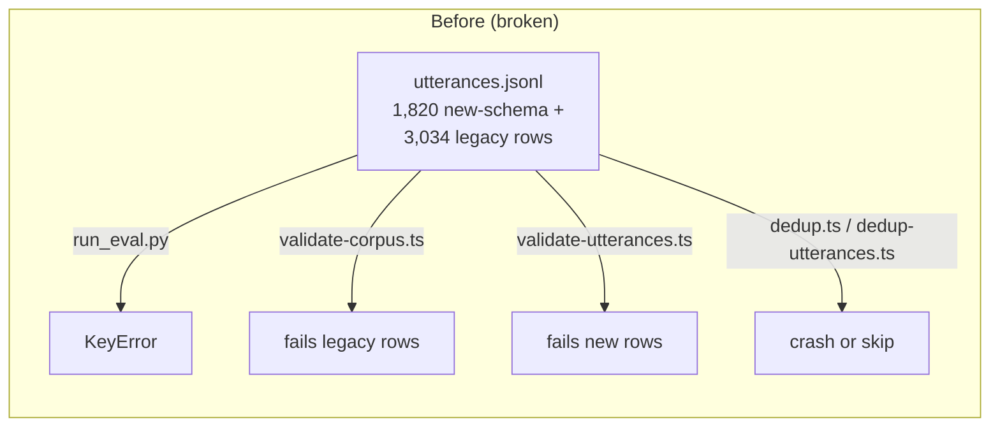
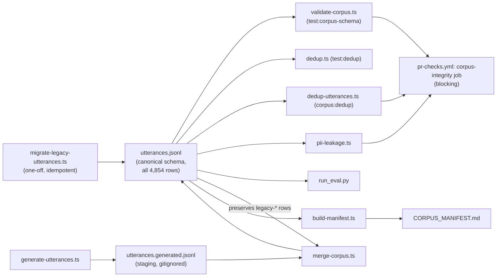

# fix: Corpus integrity — canonical schema, CI gates, manifest truth (T6-F01, T6-F02, T6-F06)

**Created:** 2026-07-18
**Depth:** Standard
**Status:** plan

## Summary
`data/corpus/utterances.jsonl` currently holds 4,854 rows in two incompatible
schemas — 1,820 new-schema rows and 3,034 legacy rows — merged accidentally at
commit `5042bd3` (PR #609), and no CI gate has ever caught it because no
corpus check runs in CI at all. This plan unifies the corpus onto one
canonical schema (migrating the legacy rows without losing their slot labels),
fixes every consumer that currently crashes or silently mis-validates on the
mixed data, adds a blocking CI gate so this can't silently recur, fixes the
generator/build collision that would otherwise destroy the migrated rows on
the next `corpus:build`, and regenerates `CORPUS_MANIFEST.md` from the real
data so its counts and claims stop being fiction.

## Problem Frame
The voice-agent training/eval corpus is the ground truth for intent
classification and slot extraction quality. Two independent efforts wrote to
the same output file (`data/corpus/utterances.jsonl`) using two different
row shapes, and the merge in PR #609 concatenated both without reconciling
them. The result:

- Every `eval:*` npm script (`scripts/eval/run_eval.py`) crashes with a
  `KeyError` on the legacy rows, because `split_of(r["id"])` assumes every
  row has an `id`.
- Both schema validators (`scripts/data-pipeline/validate-corpus.ts` /
  `test:corpus-schema`, and `scripts/data-pipeline/validate-utterances.ts` /
  `corpus:utterances`) each reject the *other* generation's rows outright —
  so neither can validate the file as it exists today.
- Both duplicate-detection scripts (`scripts/data-pipeline/dedup.ts` and
  `dedup-utterances.ts`) key on a field (`text` vs. `utterance`) that only one
  generation of rows has, so they either throw or silently skip half the
  corpus.
- None of this is caught in CI — grepping `.github/workflows/` for
  `corpus:|test:dedup|pii-leakage|run_eval|corpus-schema` returns nothing.
  The only tolerant consumer today is
  `packages/voice-eval/run-intent-eval.ts:56-64`, which normalizes
  `r.text ?? r.utterance` — an accidental workaround, not a fix.
- `CORPUS_MANIFEST.md` (and `data/corpus/README.md`) claim 1,820 EN / 3,617
  total rows "verified by `pnpm test:pii-leakage`" and claim
  `pnpm corpus:build` regenerates the file byte-identically. Neither is true:
  the file has 4,854 EN rows today, the manifest's provenance table never
  covers the 3,034 legacy rows, and running `corpus:build` today would
  overwrite `utterances.jsonl` wholesale — destroying the legacy rows,
  because `generate-utterances.ts` (`scripts/data-pipeline/lib.ts:9`,
  `CORPUS_DIR`) and the retired legacy generator both wrote to the same path.

Evidence for the counts, breakages, and generator collision above comes from
a completed audit; see `discovery/06-corpus-training-eval.md` (lives on PR
#700's branch — not present in this working tree; cited by path only).

This affects: anyone running `eval:*` or `corpus:*` scripts locally, PR
authors who touch the corpus (no CI signal today), and anyone who trusts
`CORPUS_MANIFEST.md` as a record of what's actually committed.

## Requirements
- R1 (T6-F01). One canonical row schema for `data/corpus/utterances.jsonl`;
  all 4,854 existing rows conform to it with zero data loss (legacy `slots`/
  `confidence` preserved, not dropped).
- R2 (T6-F01). Every existing corpus consumer (`test:corpus-schema`,
  `test:dedup`, `corpus:dedup`, `corpus:utterances`, `eval:*` /
  `run_eval.py`) runs cleanly against the migrated file — no schema
  rejections, no `KeyError`s, no silent partial coverage.
- R3 (T6-F02). A new CI job blocks every PR on `test:corpus-schema`,
  `corpus:dedup`, and `test:pii-leakage` — fast, no LLM calls, no cost.
- R4 (T6-F06). `CORPUS_MANIFEST.md` is regenerated from the actual committed
  data by a script, so its counts and provenance claims cannot silently drift
  from reality again.
- R5 (T6-F01). `pnpm corpus:build` no longer clobbers the migrated legacy
  rows — regeneration and the frozen legacy data coexist safely.
- R6. Dead code uncovered while doing this work (the redundant validator,
  the orphaned legacy schema module, and orphaned legacy seed data with zero
  live importers) is removed, per repo hygiene rules.

## Key Technical Decisions

- **Canonical schema = new schema extended with optional `slots`/
  `confidence`** — `{id, text, intent, lang, code_switch, source,
  reviewed_by_human, slots?, confidence?}`. Rationale: the new schema is
  already what `test:corpus-schema`, `dedup.ts`, and
  `packages/voice-eval/run-intent-eval.ts` are built around; extending it
  (rather than the legacy schema) means the 1,820 already-correct rows need
  no rewrite, and the legacy rows' richer slot labels/confidence scores are
  preserved as optional fields rather than discarded. (Alternative:
  standardize on the legacy schema — rejected, it would require rewriting
  every already-working consumer and lacks `id`/`lang`/`code_switch`, which
  `run_eval.py`'s split and the ES-corpus tooling depend on.)
- **One-off, deterministic migration script**, not an ongoing transform.
  Legacy rows get a stable `legacy-<sha1-of-text-prefix>` id (deterministic
  so re-running the script is idempotent and a no-op on already-migrated
  rows), `utterance` → `text`, `lang: 'en'`, `code_switch: false`, `source`/
  `slots`/`confidence` preserved as-is. Rationale: matches the existing
  `mulberry32`/`fnv1a`-style "reproducible forever" convention already used
  by `generate-utterances.ts`; idempotency means the script is safe to keep
  in the repo and re-run without double-processing if invoked again.
- **Keep the split rule `fnv1a(id) % 5 == 0 → test`, unchanged.** It already
  lives in `scripts/eval/corpus_io.py:split_of` and
  `scripts/data-pipeline/lib.ts:fnv1a`. Once every row has a stable `id`,
  this rule "just works" for the legacy rows too — no change to the split
  logic itself, only to what feeds it.
- **`validate-corpus.ts` (backs `test:corpus-schema`) becomes the single
  canonical validator; `validate-utterances.ts` (backs `corpus:utterances`)
  is deleted.** Rationale: `validate-corpus.ts` already validates every
  corpus file (behaviors alignment, edge cases, negatives, slot fixtures),
  not just utterances, and it's the script this plan wires into the new CI
  gate (R3) — extending the broader, CI-facing validator is less
  duplication than extending the narrower one. Its two floor checks that
  `validate-corpus.ts` doesn't currently enforce for English
  (`MIN_TOTAL = 3000`, `MIN_PER_BEHAVIOR = 50`) must be ported over during
  the merge so the gate doesn't get quietly weaker. The near-duplicate
  (cosine > 0.95) check duplicated inside `validate-utterances.ts` is
  dropped rather than ported — `corpus:dedup` (`dedup-utterances.ts`)
  already does the identical check; keeping it in two places is the kind of
  duplication the repo's hygiene rule flags.
- **`scripts/data-pipeline/corpus-lib.ts` (the legacy schema helper module)
  and the orphaned legacy seed files (`curated-seed.ts`,
  `curated-seed-supplement.ts`, `curated-seed-supplement2.ts`) are deleted.**
  Verified: `corpus-lib.ts` is imported only by `validate-utterances.ts`
  (deleted in this plan) and `dedup-utterances.ts` (repointed to `lib.ts` in
  this plan) — once both are gone/repointed it has zero importers. The three
  `curated-seed*.ts` files export `CURATED`/`CURATED_SUPPLEMENT`/
  `CURATED_SUPPLEMENT2` data with **no importer anywhere in the repo outside
  each other** (`grep -rln "curated-seed\b"` returns only the three files
  themselves) — the generator that once consumed them to write the legacy
  rows is already gone; the data they hold is orphaned. There is no
  `scripts/data-pipeline/*.test.ts` suite anywhere in this repo today —
  validation of these scripts is exclusively by running them and checking
  exit code (the established convention here), so none of this deletion
  breaks a test file.
- **Generator/build collision fix: split "generated" from "frozen migrated"
  by output file, merged at build time — not by mutating one shared file
  in place.** `generate-utterances.ts` keeps writing its own regenerable
  rows (existing `utt_en_*`/`utt_es_*` id namespace) to a staging path
  (`data/corpus/utterances.generated.jsonl`, not committed); a new
  `scripts/data-pipeline/merge-corpus.ts` reads that staging file plus the
  `legacy-*`-id rows preserved from the last committed
  `data/corpus/utterances.jsonl`, and writes the merged, final
  `utterances.jsonl` — the file every validator/dedup/eval script actually
  reads. `corpus:build` becomes
  `corpus:generate && corpus:merge && corpus:fixtures`. Rationale: this is
  the "simplest robust" option named in scope — id-namespacing alone doesn't
  stop `writeJsonl` from truncating the whole file on every run; a merge
  step that always re-derives the final file from (fresh generated ∪ frozen
  legacy) is the only way `corpus:build` can be re-run safely without either
  a human manually diffing JSONL or the legacy rows quietly vanishing.
- **CI gate mirrors the existing independent-job style** (see
  `mobile-typecheck` in `.github/workflows/pr-checks.yml`): its own job,
  checkout + setup-node + `npm ci`, no Docker/Postgres dependency, so it
  doesn't wait on the `test` job and stays fast. Blocks on failure (required
  check), consistent with `voice-quality`'s launch-gate precedent in the
  same workflow.

## Scope Boundaries
**In scope:** schema unification and migration of
`data/corpus/utterances.jsonl`; fixing `test:corpus-schema`, `test:dedup`,
`corpus:dedup`, `run_eval.py`/`corpus_io.py` to work against the migrated,
canonical file; deleting the now-redundant validator and orphaned legacy
code; fixing the `corpus:build` generator collision; adding the new CI gate;
regenerating `CORPUS_MANIFEST.md` (and correcting the stale counts in
`data/corpus/README.md`) from real data.

**Non-goals:**
- Re-labeling or re-taxonomizing intents (prod has 60 intents vs. 41 in
  `behaviors.yaml` vs. 35 in the corpus) — that's T6-F03, a separate
  relabeling effort with its own review process.
- Wiring the Spanish live-gate (T6-F05) or the vocabulary coverage gate
  (T6-F08) into CI — separate, tracked stories.
- Changing the intent classifier, slot extractors, or eval accuracy targets
  in `scripts/eval/classifier.py` / `slots.py`.
- Adding a `scripts/data-pipeline` unit-test framework from scratch — this
  repo's established pattern for these scripts is validation-by-running
  (exit code), and this plan follows that pattern rather than introducing a
  new one mid-fix.

### Deferred to follow-up work
- Taxonomy drift (T6-F03), Spanish live-gate wiring (T6-F05), vocab-coverage
  wiring (T6-F08) — noted above, tracked separately.
- Deciding whether `data/corpus/README.md`'s "Editing rules" section needs a
  new rule documenting the `legacy-*` id namespace and the
  generated/frozen-merge split — worth a follow-up doc pass once this lands
  and the shape is proven in practice.

## Repository invariants touched
This is a data-pipeline/tooling fix with no product code path — the
money/RLS/audit-event/LLM-gateway/catalog-resolver/entity-resolver
invariants don't apply. The one invariant that does apply:

- **AI-drafted content grounding** — N/A directly, but the corpus this plan
  fixes is exactly what the intent classifier and slot extractors are
  evaluated against; getting the schema and CI gate right is a prerequisite
  for trusting those eval numbers at all.

## High-Level Technical Design

## Implementation Units

### U1. Canonical schema + one-off legacy migration
- **Goal:** Migrate all 3,034 legacy-schema rows in
  `data/corpus/utterances.jsonl` into the canonical schema, in place,
  losslessly, leaving the 1,820 already-canonical rows untouched.
- **Requirements:** R1, R6 (partial — establishes the shape everything else
  builds on)
- **Dependencies:** none
- **Files:**
  - `scripts/data-pipeline/migrate-legacy-utterances.ts` (new)
  - `data/corpus/utterances.jsonl` (rewritten in place — data, not code)
- **Approach:** Read every line of `utterances.jsonl`. For a row that
  already has `id`/`text`/`lang`/`code_switch` (canonical shape), pass it
  through unchanged. For a row shaped like the legacy schema (`utterance`/
  `slots`/`confidence`, no `id`), emit
  `{id: 'legacy-' + sha1(utterance).slice(0,10), text: utterance, intent,
  lang: 'en', code_switch: false, source, reviewed_by_human, slots,
  confidence}`. `sha1` from Node's `node:crypto` (stdlib only, matching this
  module's dependency-free convention). Write the result back to
  `utterances.jsonl` via the existing `writeJsonl` helper. The sha1-prefix
  id makes the script idempotent: re-running it against an
  already-migrated file reclassifies every row as "already canonical" and
  is a no-op.
- **Patterns to follow:** `scripts/data-pipeline/lib.ts` (`readJsonl`,
  `writeJsonl`, `CORPUS_DIR`) for IO; `mulberry32`/`fnv1a`'s
  "deterministic forever" doc-comment convention for the new id function.
- **Test scenarios:**
  - Happy path: run against the current mixed file → output has exactly
    4,854 rows, all canonical shape, no row dropped.
  - Idempotency: run the script twice in a row → second run produces
    byte-identical output (no double-`legacy-` prefixing, no duplicate ids).
  - Data preservation: for a sample of legacy rows, `slots` and `confidence`
    values in the output match the pre-migration input exactly; `source`
    values (`curated`/`template_augmented`) are preserved unchanged.
  - Edge case: a row that has `id` but is missing `lang`/`code_switch`
    (shouldn't exist today, but the script should fail loudly rather than
    silently drop the row) — the script exits non-zero with a clear message
    naming the offending row id, rather than emitting an invalid row.
  - No `scripts/data-pipeline/*.test.ts` file — validation is by running
    the script against the real committed file and asserting row
    count/shape via the U3 validator (`test:corpus-schema`), matching this
    repo's established validation-by-running convention for this directory.
- **Verification:** `npx tsx scripts/data-pipeline/migrate-legacy-utterances.ts`
  followed by `wc -l data/corpus/utterances.jsonl` shows 4,854; every row
  parses as JSON with `id`/`text`/`intent`/`lang`/`code_switch`/
  `reviewed_by_human` present.

### U2. Retire the legacy schema module, dead seeds, and fix dedup field-keying
- **Goal:** Remove the now-dead legacy-schema code path and make both
  dedup scripts key on the canonical `text`/`id` fields.
- **Requirements:** R2, R6
- **Dependencies:** U1 (dedup scripts should be exercised against the
  migrated file)
- **Files:**
  - `scripts/data-pipeline/dedup-utterances.ts` (modify — repoint import
    from `./corpus-lib` to `./lib`, key on `text`/`id` not
    `utterance`/index)
  - `scripts/data-pipeline/dedup.ts` (verify only — already keys on
    `id`/`text` via `lib.ts`; confirm it now runs clean against the
    migrated file, no code change expected)
  - `scripts/data-pipeline/corpus-lib.ts` (delete — zero remaining
    importers after this unit and U3)
  - `scripts/data-pipeline/curated-seed.ts` (delete — zero importers
    anywhere in the repo, orphaned)
  - `scripts/data-pipeline/curated-seed-supplement.ts` (delete — same)
  - `scripts/data-pipeline/curated-seed-supplement2.ts` (delete — same)
- **Approach:** In `dedup-utterances.ts`, swap
  `import { UTTERANCES_PATH, normalizeUtterance, readJsonl } from
  './corpus-lib'` for `lib.ts`'s `CORPUS_DIR`/`readJsonl`/`normalizeText`,
  and change every `r.utterance` reference to `r.text`. The near-dup
  (`NearDupIndex`, cosine > 0.95) logic and `--list`/`--check` flags are
  unchanged — only the field name and import source move. Confirm (don't
  need to change) that `dedup.ts`'s existing `TextRow { id, text }`
  interface already matches the canonical schema, so it should already work
  once the file is migrated — this unit's job for `dedup.ts` is
  verification, not modification. Delete `corpus-lib.ts` only after
  confirming (re-grep) it has no other importers post-change. Delete the
  three `curated-seed*.ts` files — they're independent of the dedup fix but
  surfaced as dead code while investigating `corpus-lib.ts`'s consumers, and
  the repo's hygiene rule requires removing dead code found while working
  in the area, not just what's strictly on the critical path.
- **Patterns to follow:** `scripts/data-pipeline/lib.ts`'s existing
  `normalizeText`/`readJsonl`/`CORPUS_DIR` — the same helpers `dedup.ts`,
  `pii-leakage.ts`, and `validate-corpus.ts` already use.
- **Test scenarios:**
  - Happy path: `npx tsx scripts/data-pipeline/dedup-utterances.ts --list`
    against the migrated file runs to completion (no `TypeError` on
    `undefined.utterance`) and reports counts for the full 4,854 rows.
  - Cross-generation near-dupes: construct a small fixture (2-3 rows) where
    a migrated legacy row and a new-schema row have near-identical `text`
    across the old/new boundary — confirm `dedup-utterances.ts` flags the
    pair (proves the fix actually covers cross-generation duplicates, not
    just within one generation).
  - Regression: `npx tsx scripts/data-pipeline/dedup.ts` against the
    migrated file still passes with `exact=0` (or the same pre-existing
    exact-dup count, if any) — no new exact duplicates introduced by
    migration id assignment.
  - Dead-code removal: `grep -rln "corpus-lib" scripts/` and
    `grep -rln "curated-seed\b"` (repo-wide, excluding the deleted files
    themselves) both return empty after this unit.
  - No `*.test.ts` file for these scripts — validation is running them
    against the real migrated corpus, per this directory's convention.
- **Verification:** Both `pnpm test:dedup` and `pnpm corpus:dedup` exit 0
  against the migrated corpus; `npx tsc -p scripts/data-pipeline/tsconfig.json
  --noEmit` (i.e. `pnpm typecheck:corpus`) passes with no dangling imports
  from the deleted files.

### U3. Merge validators into one canonical schema check; harden id handling in the eval harness
- **Goal:** `validate-corpus.ts` becomes the single schema/floor validator
  for the canonical row shape (incl. optional `slots`/`confidence`);
  `validate-utterances.ts` is deleted; `run_eval.py`/`corpus_io.py` fail
  loudly (not with a bare `KeyError`) if a row is ever missing `id` again.
- **Requirements:** R1, R2, R6
- **Dependencies:** U1
- **Files:**
  - `scripts/data-pipeline/validate-corpus.ts` (modify)
  - `scripts/data-pipeline/validate-utterances.ts` (delete)
  - `scripts/eval/corpus_io.py` (modify — `split_of`/`load_jsonl` guard)
  - `package.json` (modify — remove `corpus:utterances` script; update
    `corpus:verify` chain)
- **Approach:** In `validate-corpus.ts`'s `validateUtterances()`, accept
  the canonical schema as-is (it already does — `id`/`text`/`intent`/
  `lang`/`code_switch`/`reviewed_by_human`) and add: (a) optional-field
  passthrough for `slots`/`confidence` (no validation needed beyond "if
  present, `slots` is an object and `confidence` is a number 0-1" — mirror
  the leniency already used for optional fields elsewhere in this file);
  (b) the two floor checks ported from the retired `validate-utterances.ts`
  that `validate-corpus.ts` doesn't currently enforce for English:
  `MIN_TOTAL = 3000` total rows and `MIN_PER_BEHAVIOR = 50` per intent
  (mirror the existing ES floor pattern — `rows.length < 1200` — already in
  this function, just scoped to `lang === 'en'`). Do **not** port the
  near-dup (cosine > 0.95) check from `validate-utterances.ts` — that's
  already covered by `corpus:dedup` (U2) and would be duplicate logic.
  Delete `validate-utterances.ts` and its sole remaining import of
  `local-embed.ts`'s `NearDupIndex` (verify `local-embed.ts` is still used
  by `dedup-utterances.ts` — it is, so `local-embed.ts` itself stays).
  Update `package.json`: drop the `corpus:utterances` script entry, and
  remove its step from the `corpus:verify` chain (`corpus:vocab &&
  corpus:behaviors && corpus:coverage && corpus:dedup` — `test:corpus-schema`
  now covers what `corpus:utterances` used to check). In
  `scripts/eval/corpus_io.py`, add a small guard — either in `load_jsonl`
  or a new `require_id(rows)` helper called once at the top of
  `run_eval.py`'s scope functions — that raises a clear
  `ValueError(f"row missing 'id': {row}")` instead of letting
  `split_of(r["id"])` throw a bare `KeyError` deep in a loop. This is
  defensive hardening, not a functional fix (after U1, every row has an
  `id`) — it turns a future regression into a clear error message instead
  of a cryptic stack trace.
- **Patterns to follow:** `validate-corpus.ts`'s existing per-language floor
  pattern (`if (lang === 'es') { ... }`) for the new EN floor block; this
  repo's existing `fail()`/`errors` accumulation style (collect all errors,
  exit non-zero once at the end) rather than throwing on the first
  violation.
- **Test scenarios:**
  - Happy path: `npx tsx scripts/data-pipeline/validate-corpus.ts` against
    the migrated file exits 0 and logs `4,854 rows` for `utterances.jsonl`.
  - Accepts canonical rows with optional `slots`/`confidence` present
    (legacy-derived rows) and canonical rows without them (originally
    new-schema rows) — both pass.
  - Rejects a row missing `id`/`text`/`intent` — construct a throwaway
    malformed row, confirm `validate-corpus.ts` fails with the existing
    `missing id/text/intent` message (proves the schema gate still
    rejects genuinely broken rows, not just legacy-shaped ones).
  - Floor regression check: confirm the ported `MIN_TOTAL`/
    `MIN_PER_BEHAVIOR` EN floors actually fire — temporarily truncate a
    scratch copy of the corpus below 3,000 rows and confirm the validator
    fails with the new message (do this against a scratch file, not the
    committed one).
  - `run_eval.py` smoke: if `python3` is available in this environment,
    run `python3 scripts/eval/run_eval.py --full` against the migrated
    corpus and confirm no `KeyError` — this is also exercised as a
    required CI-time check per U6, so if `python3` isn't available locally,
    note it as CI-only rather than blocking this unit.
  - No `*.test.ts`/`*.test.py` file for these scripts — validation is
    running them against the real migrated corpus (existing convention).
- **Verification:** `pnpm test:corpus-schema` and `pnpm corpus:verify` both
  exit 0 against the migrated corpus; `pnpm typecheck:corpus` passes; a
  repo-wide grep for `validate-utterances` (outside git history) returns
  nothing.

### U4. Fix the generator/build collision (corpus:build no longer clobbers migrated rows)
- **Goal:** Running `corpus:build` regenerates the synthetic rows without
  destroying the migrated legacy rows now living in `utterances.jsonl`.
- **Requirements:** R5
- **Dependencies:** U1 (needs the `legacy-*` id namespace to exist and be
  distinguishable)
- **Files:**
  - `scripts/data-pipeline/generate-utterances.ts` (modify — write to a
    staging path instead of `utterances.jsonl` directly)
  - `scripts/data-pipeline/merge-corpus.ts` (new)
  - `package.json` (modify — `corpus:build` and `corpus:generate` wiring)
  - `.gitignore` (modify — ignore the new staging file)
- **Approach:** `generate-utterances.ts` currently writes directly to
  `join(CORPUS_DIR, 'utterances.jsonl')` (and `utterances_es.jsonl`,
  which has no legacy-row problem and is left as-is). Change the EN output
  path to `data/corpus/utterances.generated.jsonl` — a build artifact, not
  committed. Add `merge-corpus.ts`: reads
  `utterances.generated.jsonl` (the fresh `utt_en_*` rows) and the
  **current committed** `utterances.jsonl`, filters the latter down to rows
  whose `id` starts with `legacy-`, concatenates
  (generated ∪ legacy-filtered), and writes the result to
  `data/corpus/utterances.jsonl` — the file every other script reads.
  Update `package.json`: `corpus:generate` still runs
  `generate-utterances.ts && generate-transcripts.ts`; add
  `corpus:merge: "tsx scripts/data-pipeline/merge-corpus.ts"`; change
  `corpus:build` to `corpus:generate && corpus:merge && corpus:fixtures`.
  Add `data/corpus/utterances.generated.jsonl` to `.gitignore` since it's a
  regenerable intermediate, not source of truth.
- **Patterns to follow:** `generate-utterances.ts`'s existing
  `writeJsonl`/`CORPUS_DIR` usage from `lib.ts`; `build-manifest.ts` (U5)
  will read the final merged file the same way `validate-corpus.ts` does.
- **Test scenarios:**
  - Happy path: run `corpus:generate` then `corpus:merge` — confirm the
    final `utterances.jsonl` contains both the freshly-generated `utt_en_*`
    rows and every pre-existing `legacy-*` row, with no row lost.
  - Idempotency / no double-run corruption: run `corpus:merge` twice in a
    row without regenerating — second run produces the same output (merge
    reads the already-merged file's `legacy-*` rows back out correctly,
    doesn't re-duplicate them).
  - Regression: confirm `test:corpus-schema` and `test:dedup` still pass
    against the merged output.
  - Failure path: if `utterances.generated.jsonl` is missing (someone runs
    `corpus:merge` without `corpus:generate` first), `merge-corpus.ts` exits
    non-zero with a clear "run corpus:generate first" message rather than
    silently treating an empty file as valid input and wiping the merged
    output down to only the legacy rows.
  - No `*.test.ts` file — validation is running the full
    `corpus:generate && corpus:merge` sequence against the real corpus and
    inspecting row counts/shape, per this directory's convention.
- **Verification:** `pnpm corpus:build` run end-to-end leaves
  `data/corpus/utterances.jsonl` at (generated EN count) + 3,034 rows, and
  `pnpm corpus:verify` still passes afterward.

### U5. Regenerate `CORPUS_MANIFEST.md` from real data
- **Goal:** Manifest counts and provenance are generated from the actual
  committed files, not hand-maintained prose that drifts.
- **Requirements:** R4
- **Dependencies:** U1, U4 (needs the final, stable row counts)
- **Files:**
  - `scripts/data-pipeline/build-manifest.ts` (new)
  - `CORPUS_MANIFEST.md` (regenerated output)
  - `data/corpus/README.md` (modify — correct the stale row counts in the
    "Layout" table to match reality; point the "Regenerate" section at the
    updated `corpus:build` chain from U4)
  - `package.json` (modify — add a `corpus:manifest` script)
- **Approach:** `build-manifest.ts` reads every file already listed in the
  current manifest (`behaviors.yaml`, `utterances.jsonl`,
  `utterances_es.jsonl`, `edge_cases.jsonl`, `negatives.jsonl`,
  `slot_fixtures/*.jsonl`) via `lib.ts`'s `readJsonl`/`listJsonl`, counts
  rows, and additionally reports a `source` breakdown for
  `utterances.jsonl` (count by `curated` / `template_augmented` / whatever
  values the generated rows use) so the provenance table actually covers
  the legacy-derived rows instead of omitting them. It writes
  `CORPUS_MANIFEST.md` from a template with the counts substituted in —
  same file layout/sections as today (Data files, Seed files, Pipeline &
  harness, Provenance & ethics), but every count is computed, not typed by
  hand. Drop the "byte-identical regeneration" claim from the Provenance
  section (it's false — the merge step in U4 is designed to be
  *content-equivalent*, not byte-identical, since it now merges frozen and
  regenerated data); replace it with an accurate description: `corpus:build`
  regenerates the synthetic portion and merges the frozen legacy rows back
  in. Update `data/corpus/README.md`'s "Layout" table counts to match
  (currently claims 1,820 EN / stale totals) and its "Regenerate" section
  to mention the merge step.
- **Patterns to follow:** existing manifest's markdown table structure
  (don't redesign the format, just make the numbers real); `lib.ts`'s
  `listJsonl`/`readJsonl` already used by `validate-corpus.ts` and
  `pii-leakage.ts` for the same file set.
- **Test scenarios:**
  - Happy path: `npx tsx scripts/data-pipeline/build-manifest.ts` against
    the post-migration/post-merge corpus produces a manifest whose
    `utterances.jsonl` row count matches `wc -l data/corpus/utterances.jsonl`
    exactly, and whose total matches the sum of every listed file.
  - Provenance completeness: the regenerated manifest's source breakdown
    accounts for all 4,854 `utterances.jsonl` rows (no silent gap the way
    today's hand-written table skips the 3,034 legacy rows).
  - Idempotency: running it twice with no data change produces
    byte-identical `CORPUS_MANIFEST.md` output (safe to re-run, easy to
    diff in review).
  - No `*.test.ts` file — validation is running the script and diffing its
    output against a manual `wc -l`/`jq` count of each file, per this
    directory's convention.
- **Verification:** `CORPUS_MANIFEST.md`'s "Total labeled examples" count
  matches the real sum of every listed file; `data/corpus/README.md`'s
  table no longer contradicts it.

### U6. Add the blocking corpus-integrity CI gate
- **Goal:** Every PR is blocked if the corpus schema, dedup, or PII checks
  fail — closing the gap that let this drift go undetected for two merges.
- **Requirements:** R3
- **Dependencies:** U1-U5 (the gate should only be turned on once every
  check it runs actually passes against the migrated corpus)
- **Files:**
  - `.github/workflows/pr-checks.yml` (modify — new job)
- **Approach:** Add a `corpus-integrity` job, sibling to `mobile-typecheck`
  and `test` (no `needs:`, so it runs in parallel and doesn't block on the
  Docker-heavy `test` job). Steps: checkout, `setup-node@v5` (node 20,
  npm cache), `npm ci`, then three run steps: `npm run test:corpus-schema`,
  `npm run corpus:dedup`, `npm run test:pii-leakage`. No Postgres, no LLM
  gateway calls, no cost — matches the "fast" requirement. Mark it required
  on the branch protection rule for `main` (a repo-settings change, not a
  file change in this plan — flag it as a follow-up action for whoever
  merges the PR, since branch protection isn't configured in-repo).
- **Patterns to follow:** `mobile-typecheck` job in the same file — same
  checkout/setup-node/`npm ci` shape, same "independent job, no `needs`"
  structure; the file's existing comment style documenting *why* a job is
  shaped the way it is (see the comments above `voice-quality` and
  `mobile-typecheck`).
- **Test scenarios:**
  - Happy path: on a PR branch with the migrated corpus and all of U1-U5
    landed, the `corpus-integrity` job goes green.
  - Failure path (regression proof): on a scratch branch, reintroduce one
    malformed row (missing `id`) into a copy of `utterances.jsonl` and
    confirm the job fails at the `test:corpus-schema` step with a
    legible error — proving the gate actually catches the exact class of
    bug this plan fixes.
  - Integration: this is inherently a cross-layer check (git → CI runner →
    npm scripts → corpus files) that no unit test can substitute for;
    proof is a real CI run, not a mock.
  - `Test expectation: none — this is a workflow-config change`, beyond the
    live-run proof above (no unit test framework applies to YAML).
- **Verification:** The job appears in the PR's checks list and is green
  once U1-U5 are merged; a deliberately-broken test PR (or local
  `act`/manual dry run of the three commands) demonstrates it fails loudly
  on a real regression.

### U7. Branch, verify, and open the PR (process)
- **Goal:** Land this work through the repo's normal review path with every
  gate proven green before requesting review.
- **Requirements:** supports R1-R6 (process, not a functional requirement)
- **Dependencies:** U1-U6
- **Files:** none (process step)
- **Approach:** Branch `claude/fix-corpus-integrity` off `origin/main`.
  Implement U1-U6 in order (each is a reasonable atomic commit). Before
  requesting review, run: `pnpm corpus:build` (proves U4's merge doesn't
  clobber anything), `pnpm corpus:verify` (the full existing
  vocab/behaviors/coverage/dedup chain, now minus the retired
  `corpus:utterances` step per U3), `pnpm test:corpus-schema`,
  `pnpm corpus:dedup`, `pnpm test:pii-leakage` (the exact three commands
  U6 gates on, run locally first), and
  `pnpm typecheck:corpus` (`tsc -p scripts/data-pipeline/tsconfig.json
  --noEmit` — the scripts' own typecheck, separate from
  `packages/api`'s `tsconfig.build.json` gate, since this plan touches no
  `packages/api` code). Open a **draft** PR so CI (including the new U6 job)
  runs before requesting human review.
- **Patterns to follow:** repo's standard PR flow; this plan does not
  authorize merging without human approval (per `CLAUDE.md`: "Never
  auto-execute proposals — all require human approval").
- **Test scenarios:** `Test expectation: none — process/sequencing step,
  not a code unit.`
- **Verification:** Draft PR open, all local commands above exit 0, CI
  (including the new `corpus-integrity` job) green on the PR.

## Risks & Dependencies
- **Row-count drift during implementation.** U1's migration and U4's merge
  logic both touch row counts; if implemented out of order (e.g. U4 before
  U1), the merge step has no `legacy-*` rows to preserve yet. The
  dependency ordering above (U1 first) exists specifically to avoid this.
- **`corpus:verify` chain edit (U3) is easy to get subtly wrong** — dropping
  the `corpus:utterances` step without porting its unique floor checks into
  `validate-corpus.ts` first would silently weaken the gate rather than
  fixing it. U3's test scenarios explicitly include a floor-regression
  check for this reason.
- **`python3` may not be present in every dev environment** — the
  `run_eval.py` smoke test in U3 is CI-only in that case (already the
  status quo; `eval:*` scripts already assume `python3` per
  `package.json`).
- **Branch protection for the new required check (U6) is a GitHub repo
  setting, not a file in this repo** — it must be turned on manually after
  merge; this plan cannot verify or set it.

## Open Questions
- Exact final EN row count after U4's merge (generated count + 3,034
  legacy) depends on how many rows `generate-utterances.ts` currently
  produces per intent × seed count — not knowable until U1 and U4 are
  actually run; U5's manifest generation reads whatever that real number
  turns out to be rather than assuming 1,820 stays fixed forever.
- Whether `data/corpus/README.md`'s "Editing rules" section needs a new
  rule documenting the `legacy-*` id namespace — deferred (see Scope
  Boundaries) pending how U1-U4 look in practice.

## Sources & Research
- `discovery/06-corpus-training-eval.md` — the completed audit this plan is
  based on (counts, breakage list, generator-collision finding). Lives on
  PR #700's branch, not in this working tree; cited by path only, not read
  directly for this plan.
- Repo files read directly to verify the audit's claims before planning:
  `scripts/data-pipeline/{lib.ts,corpus-lib.ts,validate-corpus.ts,
  validate-utterances.ts,dedup.ts,dedup-utterances.ts,pii-leakage.ts,
  generate-utterances.ts,curated-seed*.ts}`, `scripts/eval/{run_eval.py,
  corpus_io.py}`, `packages/voice-eval/run-intent-eval.ts`,
  `CORPUS_MANIFEST.md`, `data/corpus/README.md`, `.github/workflows/
  pr-checks.yml`, root `package.json`, `git log`/`git show 5042bd3`
  (PR #609 merge commit).
