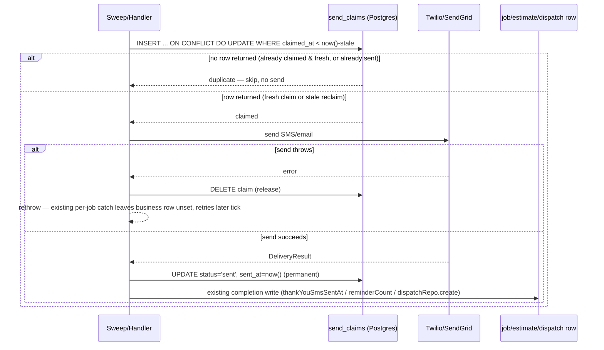

# fix: Duplicate-SMS elimination — claim-before-send for mark-after-send workers (T4-F01, T4-F10)

**Created:** 2026-07-18
**Depth:** Standard
**Status:** plan

## Summary
Three mark-**after**-send workers (thank-you SMS, estimate nudge, generic
customer-message delivery) dispatch a customer SMS/email and only record
completion afterward, so a crash or restart between the provider send and the
DB stamp re-sends the same message on the next sweep tick. The only crash
backstop today is an **unverified** Twilio `Idempotency-Key` header that is
not documented for `Messages.json` — not something to depend on. This plan
converts all three to a claim-before-send ledger, mirroring the
already-correct pattern in `packages/api/src/notifications/lifecycle-email.ts`
and `packages/api/src/workers/appointment-reminder-worker.ts`, generalized
into one shared helper. It also fixes a small adjacent gap (T4-F10): the
queue's dead-letter rows record the literal string `'max attempts exceeded'`
instead of the real handler failure, because `processMessage` swallows the
caught exception and returns only a boolean.

## Problem Frame
Evidence: `discovery/04-backend-apis-integrations.md` (on
`origin/claude/serviceos-discovery-planning-nzjmso`), finding **T4-F01**
("Duplicate-SMS window: mark-after-send sweeps backstopped by an unverified
Twilio idempotency header") and **T4-F10** ("DLQ rows lose the real failure
reason").

- `packages/api/src/workers/thank-you-sms-worker.ts:245-249` —
  `deps.dispatcher.send(...)` then `deps.jobRepo.update(... thankYouSmsSentAt
  ...)`; no idempotency key on the send itself.
- `packages/api/src/estimates/estimate-nudge.ts:45-56` —
  `deps.sendService.sendEstimate(...)` then `deps.estimateRepo.update(...
  reminderCount+1, lastReminderAt ...)`. Shared by two callers:
  `packages/api/src/workers/estimate-reminder-worker.ts:111-124` (sweep) and
  `packages/api/src/proposals/execution/handlers.ts:905-922`
  (`send_estimate_nudge` proposal handler).
- `packages/api/src/notifications/customer-message-delivery.ts:38-63` —
  `deps.delivery.sendSms(...)` then `deps.dispatchRepo.create(...)` **inside a
  fully swallowed `catch {}`** (line 60-62 and 92-94), so a crash between send
  and the dispatch write is not just unretried, it is silently invisible.
- Load-bearing (and unverified) backstop:
  `packages/api/src/notifications/twilio-delivery-provider.ts:180-183` sets an
  `Idempotency-Key` header on `Messages.json`; `delivery-provider.ts:46`
  itself hedges "provider *should* dedupe." No in-repo test or Twilio contract
  evidence supports this being honored by the API. Treat it as a harmless
  belt, never the load-bearing safety net.
- Who's affected: every tenant's customers receiving thank-you SMS or
  estimate-reminder nudges after any API process crash/restart/deploy that
  lands between the provider call and the DB write — a plausible, not
  hypothetical, event (deploys, OOM kills, orchestrator restarts).
- T4-F10, adjacent: `packages/api/src/queues/queue.ts:308-327`
  (`processMessage`) catches the handler's exception, logs it, and returns
  only `false` — the real error text is discarded. `packages/api/src/app.ts:2674`
  then calls `queue.moveToDeadLetter(message, 'max attempts exceeded')` with a
  hardcoded string regardless of why the handler actually failed, so DLQ
  triage requires re-deriving the failure from payload archaeology.

## Requirements
- R1. Converting a mark-after-send worker to claim-before-send must make a
  crash/restart between the provider send call and the existing
  business-level "handled" write (job/estimate/dispatch row) **not** cause a
  resend on the very next sweep tick.
- R2. A crash strictly *before* the send starts (claim written, send never
  attempted) must not permanently block the message — it must become
  eligible again after a bounded stale-claim window, not require manual ops
  intervention.
- R3. Concurrent sweep instances (leader-lock bypass, overlapping ticks, or a
  future multi-replica worker) racing on the same customer message must
  result in exactly one send.
- R4. The generalization must be ONE shared helper, not three copy-pasted
  claim implementations, per CLAUDE.md code-hygiene ("remove dead code...
  when wiring a dormant module") and the repo's existing preference for
  single composition points (`dispatchEstimateNudge` already exists for
  exactly this reason).
- R5. `customer-message-delivery.ts`'s swallowed `catch {}` must stop hiding
  crash-adjacent failures: a send failure must be logged/surfaced (still
  best-effort — must not block the caller's business mutation — but no
  longer silent).
- R6. DLQ rows (`_queue_dlq.error`) must contain the real handler failure
  reason (message + a short stack excerpt), redacted the same way existing
  DLQ payloads are, instead of the constant `'max attempts exceeded'`.
- R7. Every DB-touching change must ship with a Docker-gated integration
  test pinning real column/constraint names (`packages/api/test/integration/`),
  per CLAUDE.md — mocked-DB tests alone are insufficient (the entity resolver
  precedent).
- R8. Every mutation continues to emit its existing audit events; no
  audit-event regressions.

## Key Technical Decisions

- **New dedicated `send_claims` ledger table, not a reuse of
  `message_dispatches`.** `message_dispatches` (migration `045`) is a
  reporting/audit surface consumed elsewhere (`listByTenant`, the
  `send_estimate_nudge` 48h cooldown check at
  `proposals/execution/handlers.ts:864-887`, the daily-digest segment map).
  Overloading it with ephemeral claimed-but-unsent or auto-reclaimed rows
  would pollute those consumers' assumption that every row represents a
  genuine send outcome. `lifecycle_emails` (migration `204`) already
  establishes the precedent of a *separate*, purpose-built ledger table for
  exactly this kind of gate. (Alternative considered: extend
  `DispatchRepository` with a `'claimed'` status and generalize its unique
  index — rejected because it couples an audit/reporting table's contract to
  a concurrency-control concern, and several call sites already assume
  `message_dispatches` rows never disappear or get reclaimed.)

- **Bounded stale-claim expiry, not the permanent-skip model
  `lifecycle_emails` uses.** `lifecycle_emails` never releases a claim except
  on an explicit synchronous catch — a hard process kill mid-send leaves the
  row forever, silently dropping that one onboarding email. That tradeoff is
  acceptable for a one-time onboarding email; it is not acceptable for
  recurring, revenue-adjacent customer touchpoints (thank-you SMS drives
  review requests; estimate nudges drive close rate). The shared helper
  therefore claims via an atomic `INSERT ... ON CONFLICT ... DO UPDATE ...
  WHERE claimed_at < now() - staleInterval`, which reclaims a `status =
  'claimed'` row only once it has sat unresolved past the stale window, and
  never touches a row already flipped to `status = 'sent'` (permanent
  tombstone). This satisfies R1 (an immediate retry within the stale window
  is blocked) and R2 (an abandoned claim is not permanent) simultaneously.
  Default stale window: 15 minutes — far longer than any realistic single
  send + DB round trip (seconds, even with retries), short enough that
  recovery costs at most 1-2 sweep ticks for every converted worker
  (thank-you-sms sweeps every 10 min, estimate-reminder every 60 min, per
  `app.ts:6074,6239`). (Alternatives considered: mirror `lifecycle_emails`'
  permanent-skip model — rejected per above; a separate periodic reaper
  process mirroring `pg-queue.ts`'s crash-orphan reaper — rejected as
  unnecessary complexity when the inline atomic UPSERT achieves the same
  result in one query with no extra process.)

- **Claim on send, finalize business state unchanged.** The claim ledger is
  purely the crash-safety layer; it does not replace or duplicate the
  existing business-level completion fields
  (`jobs.thank_you_sms_sent_at`, `estimates.reminder_count` /
  `last_reminder_at`, `message_dispatches` rows). Those keep their current
  meaning and are still written only after a confirmed successful send. This
  keeps the change surgical: insert a claim immediately before the existing
  `send(...)` call, finalize/release the claim immediately after, and leave
  every downstream field write exactly where it already is.

- **Claim key is caller-composed and occurrence-scoped, not entity-scoped.**
  Thank-you SMS is at-most-once per job (`thank_you_sms:{jobId}`), so the
  claim key mirrors that. Estimate nudges are deliberately repeatable
  (`reminderCount` increments each time, capped by `maxReminders`), so the
  claim key must be per-occurrence — `estimate_nudge:{estimateId}:{reminderCount
  + 1}` — so a later nudge is a fresh, independent claim rather than blocked
  by an earlier nudge's permanent tombstone.
  `customer-message-delivery.ts` already threads a per-call
  `idempotencyKeyPrefix` (e.g. `estimate:{id}:send`) from its four call
  sites; the claim key reuses `${idempotencyKeyPrefix}:{channel}` unchanged so
  no caller needs to change its key-construction logic.

- **T4-F10: persist the real error on the message row, not just thread it
  through the return value.** The simplest fix would be changing
  `processMessage`'s return type to include the caught error and passing it
  straight into the single `moveToDeadLetter` call site
  (`app.ts:2670-2674`) — sufficient for today's single call site. This plan
  instead also persists `last_error` onto `_queue_messages` at every failed
  attempt (not only the final one), because: (a) it gives operators
  visibility into *why* a message is still retrying before it ever reaches
  the DLQ, which today is invisible outside logs; (b) it is the fix already
  scoped and verified by the audit this plan executes against; (c) it costs
  one redacted `UPDATE` per failed attempt, using the same redaction already
  applied to DLQ payloads. The DLQ insert then copies the persisted value
  instead of a hardcoded string. `processMessage`'s return value still
  carries the error so the same call can both persist it and pass it to
  `moveToDeadLetter` without a second read.
- **`_queue_messages`/`_queue_dlq` schema change goes in `pg-queue.ts`'s own
  `ensureTable`, not `schema.ts`'s `MIGRATIONS` registry.** These two tables
  are already bootstrapped entirely inside `PgQueue.ensureTable()`
  (`packages/api/src/queues/pg-queue.ts:32-69`) and were never added to the
  central `MIGRATIONS` object — they sit outside that registry by existing
  design (self-contained lightweight queue implementation). Adding
  `last_error` follows the identical existing convention: an idempotent
  `ALTER TABLE _queue_messages ADD COLUMN IF NOT EXISTS last_error TEXT;`
  inside `ensureTable`. This is a deliberate, noted deviation from "every new
  column needs a `schema.ts` migration entry" — the deviation already exists
  for this table pair and this change follows it rather than introducing a
  second, inconsistent path for the same two tables.

## Scope Boundaries

**In scope:**
- A shared claim-before-send helper (new `send_claims` ledger + module).
- Converting `thank-you-sms-worker.ts`, `estimate-nudge.ts`, and
  `customer-message-delivery.ts` to use it.
- Removing the swallowed `catch {}` in `customer-message-delivery.ts`.
- T4-F10: real DLQ error capture.
- Branching, quality gates, and a draft PR (U6).

**Non-goals:**
- Verifying or removing the Twilio `Idempotency-Key` header
  (`twilio-delivery-provider.ts:180-183`) — leave it in place as a harmless
  belt; do not build new reliance on it either way.
- `send-service.ts`'s existing minute-quantized dispatch key (`:368-380`) —
  untouched, unrelated layer.
- Converting every other mark-after-send shape in `workers/` (see Deferred
  below) — this plan's three units are the ones named in the audit finding;
  the rest are noted for a follow-up, not silently left undocumented.
- Any change to `message_dispatches`' schema, indexes, or existing
  consumers.
- T4-F02 through T4-F09/F11-F15 (rate limits, Sentry, authz, mass-assignment,
  TLS, Redis, hygiene) — separate findings, separate plans.

### Deferred to follow-up work
Other mark-after-send shapes found while grepping `workers/*.ts` for
`send → then update` patterns, not part of this plan's scope:
- `packages/api/src/workers/daily-digest-worker.ts:461-482` — sends an owner
  digest SMS segment, *then* `dispatchRepo.create(...)`; the existing
  `catch` only handles a **concurrent-create** unique-violation race, not a
  crash between the send and the create. Owner-facing (not customer-facing),
  lower severity, same shape as T4-F01.
- `packages/api/src/workers/call-me-back-worker.ts:84-88` — `sendSms(...)`
  then `callMeBackRepo.markNotified(...)`; owner/dispatcher-facing internal
  task notification, mark-after-send.
- `packages/api/src/workers/hfcr-weekly-send-worker.ts:106-132` and
  `packages/api/src/workers/weekly-feedback-worker.ts:131-147` — both are
  explicitly, deliberately "deliverable-first" per their own code comments
  (send, then record; a transient failure retries next week rather than
  silently dropping the week). This is a reasoned, documented tradeoff
  already in the codebase, not an accidental gap — lowest priority of the
  four, and arguably should stay as-is given the owner-facing, weekly
  (not per-customer) blast radius.

## Repository invariants touched
- **RLS/tenant_id:** `send_claims` is tenant-scoped, `FORCE ROW LEVEL
  SECURITY`, mirrors `lifecycle_emails`' policy shape exactly.
- **Audit events:** unchanged — every existing `notification.*`/
  `estimate.reminder_sent` audit call stays exactly where it is, still fired
  only after a confirmed send.
- **Async worker pattern (P0-009):** the claim/release/finalize calls live
  inside the existing per-tenant/per-job try/catch sweep bodies; sweep
  cadence and leader-lock semantics (`runAsLeader`) are untouched.
- **Money/cents, LLM gateway, Zod proposals, catalog/entity resolver:** not
  touched by this plan (no pricing, no AI drafting, no free-text entity
  resolution on this path).

## High-Level Technical Design

## Implementation Units

### U1. Shared claim-before-send ledger
- **Goal:** One reusable module + migration providing atomic claim, release,
  and finalize primitives, generalizing `lifecycle-email.ts`'s pattern with a
  bounded stale-claim expiry.
- **Requirements:** R1, R2, R3, R4, R7
- **Dependencies:** none
- **Files:**
  - `packages/api/src/db/schema.ts` — new migration key `258_send_claims`
    (next available key; current max is `257_estimate_line_items_image_file_id`).
  - `packages/api/src/notifications/send-claim-ledger.ts` (new) —
    `claimSend(pool, tenantId, claimKey, staleMinutes?)`,
    `markSendClaimComplete(pool, tenantId, claimKey)`,
    `releaseSendClaim(pool, tenantId, claimKey)`, and the convenience wrapper
    `withSendClaim(pool, tenantId, claimKey, sendFn, staleMinutes?)` returning
    `{ outcome: 'sent'; result: T } | { outcome: 'duplicate' }` (rethrows on
    send failure after releasing, mirroring `sendLifecycleEmail`'s shape).
  - `packages/api/test/notifications/send-claim-ledger.test.ts` (new, unit,
    mocked `Pool`) — SQL shape assertions (query text/params for claim,
    release, finalize).
  - `packages/api/test/integration/send-claim-ledger.test.ts` (new,
    Docker-gated) — real Postgres proof of the constraint/index/UPSERT
    semantics.
- **Approach:**
  - Table: `send_claims(tenant_id UUID NOT NULL REFERENCES tenants(id),
    claim_key TEXT NOT NULL, status TEXT NOT NULL DEFAULT 'claimed' CHECK
    (status IN ('claimed','sent')), claimed_at TIMESTAMPTZ NOT NULL DEFAULT
    NOW(), sent_at TIMESTAMPTZ, PRIMARY KEY (tenant_id, claim_key))`. RLS
    enabled + forced, tenant-isolation policy identical in shape to
    `lifecycle_emails`' (migration `204`).
  - `claimSend`: `INSERT INTO send_claims (tenant_id, claim_key, status,
    claimed_at) VALUES ($1,$2,'claimed',NOW()) ON CONFLICT (tenant_id,
    claim_key) DO UPDATE SET claimed_at = NOW(), status = 'claimed' WHERE
    send_claims.status = 'claimed' AND send_claims.claimed_at < NOW() -
    ($3 || ' minutes')::interval RETURNING claim_key`. Returns `true` iff a
    row came back (row count > 0) — this is the single atomic
    claim-or-stale-reclaim, race-safe under `FOR UPDATE`-free concurrent
    INSERTs because Postgres serializes conflicting inserts on the same key.
  - `markSendClaimComplete`: `UPDATE send_claims SET status='sent',
    sent_at=NOW() WHERE tenant_id=$1 AND claim_key=$2` (permanent — a `'sent'`
    row's `WHERE status='claimed'` guard in `claimSend` means it is never
    matched again).
  - `releaseSendClaim`: `DELETE FROM send_claims WHERE tenant_id=$1 AND
    claim_key=$2 AND status='claimed'` (never deletes a `'sent'` row, so a
    late/duplicate release call after a success can't undo a tombstone).
  - `withSendClaim` composes the three: claim → on success, run `sendFn`,
    finalize, return `{outcome:'sent', result}`; on claim-miss, return
    `{outcome:'duplicate'}` without calling `sendFn`; on `sendFn` throw,
    release then rethrow (caller's existing try/catch handles the rest,
    unchanged).
- **Patterns to follow:** `packages/api/src/notifications/lifecycle-email.ts`
  (claim/release shape, no-op-when-no-pool posture at the call site, not
  inside this helper — callers already gate on `pool` before entering);
  `packages/api/src/workers/appointment-reminder-worker.ts:130-147` (claim via
  unique-constraint-and-catch as the alternate proof this idiom is already
  trusted in this codebase).
- **Test scenarios:**
  - Happy path: `claimSend` returns true once for a fresh key; `withSendClaim`
    sends, finalizes to `'sent'`, and a second call with the same key returns
    `{outcome:'duplicate'}` without invoking `sendFn` again.
  - Edge — stale-claim expiry: claim a key, advance the clock (via a
    literal `INSERT ... claimed_at = NOW() - INTERVAL '20 minutes'` fixture
    row in the integration test) past the default 15-minute window, assert
    `claimSend` returns true again (reclaim) and a fresh `sendFn` runs.
  - Edge — crash-between-claim-and-send recovery: claim a key, do **not**
    finalize or release (simulating a crash before/during send), assert an
    immediate re-claim attempt returns false (still fresh), then assert it
    returns true only after the stale window elapses.
  - Edge — crash-between-send-and-mark → NO resend: claim, finalize to
    `'sent'`, assert a subsequent `claimSend` (even after the stale window
    would otherwise apply) always returns false — the `'sent'` tombstone is
    permanent regardless of age.
  - Concurrency — race → exactly one send: two concurrent `claimSend` calls
    for the same fresh key (via `Promise.all`) — assert exactly one resolves
    true.
  - Error path: `sendFn` throws inside `withSendClaim` — assert the claim
    row is deleted (next `claimSend` for the same key immediately returns
    true) and the original error is rethrown unchanged.
  - Integration (Docker-gated, `packages/api/test/integration/`): pin the
    real `send_claims` table/column/constraint names and the partial UPSERT
    behavior against actual Postgres — per CLAUDE.md, the mocked-`Pool` unit
    test alone does not prove the SQL is valid or the constraint exists.
- **Verification:** All new unit + integration tests pass; `claimSend`'s SQL
  runs successfully against a real Postgres instance (Docker-gated suite) and
  exhibits the claim/reclaim/tombstone truth table above.

### U2. Migrate thank-you-sms-worker to claim-before-send
- **Goal:** Close the crash-resend window between
  `dispatcher.send(...)` and `jobRepo.update({thankYouSmsSentAt})`.
- **Requirements:** R1, R2, R3, R7, R8
- **Dependencies:** U1
- **Files:**
  - `packages/api/src/workers/thank-you-sms-worker.ts` — wrap the send in
    `withSendClaim` inside `sendOneThankYou` (lines 206-257).
  - `packages/api/test/workers/thank-you-sms-worker.test.ts` — extend with
    claim-aware scenarios (mocked pool/ledger).
  - `packages/api/test/integration/thank-you-sms-worker.test.ts` — extend
    with a real-Postgres crash-simulation scenario.
- **Approach:** Claim key `thank_you_sms:{jobId}` (tenant-scoped by
  `send_claims`' own `tenant_id` column, so no tenant prefix needed in the
  key itself). Call `withSendClaim(deps.pool, tenantId, claimKey, () =>
  deps.dispatcher.send({ to: customer.primaryPhone, body }))` in place of the
  bare `await deps.dispatcher.send(...)` at line 245. On `{outcome:
  'duplicate'}`, treat as already-handled: return `'suppressed'` (reuse the
  existing `SendOutcome` union, or introduce a distinct sentinel if the
  result-shape divergence would confuse the caller — evaluate at
  implementation time whether `sweepTenant`'s counters need a distinct
  "already-claimed" bucket) **without** calling `markHandled` (since
  `thankYouSmsSentAt` should only be set by whichever attempt actually
  completes the send, avoiding a second writer racing the first). On a
  `sendFn` throw, `withSendClaim` already released the claim before
  rethrowing — the existing outer `catch` in `sweepTenant` (lines 192-200)
  is unchanged and still leaves `thankYouSmsSentAt` null for the next tick.
  The permanent-suppression paths (`no_phone`, `no_sms_consent`, `on_dnc`,
  `job_not_found`) do not send at all — they are untouched, no claim needed.
- **Patterns to follow:** existing per-job try/catch in `sweepTenant`;
  U1's `withSendClaim`.
- **Test scenarios:**
  - Happy path: one job, one send, `thankYouSmsSentAt` set once, dispatcher
    called once.
  - Crash-between-claim-and-send recovery: pre-seed a stale (>15min old)
    `send_claims` row for the job's key with no corresponding
    `thankYouSmsSentAt`; run the sweep; assert it reclaims and sends.
  - Crash-between-send-and-mark → NO resend: pre-seed a `'sent'` `send_claims`
    row for the job's key but leave `thankYouSmsSentAt` NULL (simulating the
    crash after send, before the job-row write); run the sweep; assert the
    dispatcher is **not** called again, and the job is not stuck (surfaces a
    warn log so this genuinely-inconsistent state is observable, since
    normally the two should always move together).
  - Concurrent sweep double-claim race → exactly one send: run
    `runThankYouSmsSweep` twice concurrently against the same eligible job
    set; assert the dispatcher records exactly one send for that job.
  - Integration: pin `send_claims` columns against real Postgres in the
    thank-you-worker's own crash-recovery scenario (extends the existing
    Docker-gated file rather than only the generic U1 ledger test, so the
    job-specific eligibility query + claim interplay is proven together).
- **Verification:** `npm test -- thank-you-sms-worker` and
  `npm run test:integration -- thank-you-sms-worker` both green; manual read
  of the diff confirms `dispatcher.send` is never reachable without a prior
  successful claim.

### U3. Migrate estimate-nudge to claim-before-send
- **Goal:** Close the crash-resend window in `dispatchEstimateNudge`,
  covering both callers (sweep + proposal handler) from one change point.
- **Requirements:** R1, R2, R3, R7, R8
- **Dependencies:** U1
- **Files:**
  - `packages/api/src/estimates/estimate-nudge.ts` — add `pool: Pool | null`
    to `EstimateNudgeDeps`; wrap `sendService.sendEstimate(...)` (lines
    45-50) in `withSendClaim`.
  - `packages/api/src/app.ts` — thread `pool` into the `EstimateNudgeDeps`
    construction at both call sites: the estimate-reminder sweep's deps
    object (mirrors the pattern at `estimateRepo`/`sendService` around
    `app.ts:6058-6067`) and wherever `SendEstimateNudgeExecutionHandler` is
    constructed (verify exact construction site at implementation time —
    the handler's constructor at `proposals/execution/handlers.ts:817-824`
    does not currently take a pool; confirm whether to add it there or pass
    pool through a already-available deps bag).
  - `packages/api/test/estimates/estimate-nudge.test.ts` (new, or extend if
    a unit test file for `estimate-nudge.ts` doesn't already exist — search
    first) — claim-aware unit scenarios.
  - `packages/api/test/proposals/send-estimate-nudge-handler.test.ts` —
    extend with a claim-collision scenario (two nudge attempts for the same
    `reminderCount+1` collapse to one send).
  - `packages/api/test/integration/estimate-nudge.test.ts` (new,
    Docker-gated).
- **Approach:** Claim key `estimate_nudge:{estimate.id}:{(estimate.reminderCount
  ?? 0) + 1}` — computed from the `estimate` snapshot passed into
  `dispatchEstimateNudge`, so it's stable for a given attempt regardless of
  caller. When `deps.pool` is null (dev/test without DB, matching the
  no-DB-no-op posture elsewhere), skip the claim wrapper entirely and send
  directly — the two production callers always have a real pool; only
  no-DB dev/test paths take this branch, and it preserves current behavior
  for the many existing unit tests using `InMemoryEstimateRepository` +
  `InMemorySendService`-style doubles without a pool. On
  `{outcome:'duplicate'}`, `dispatchEstimateNudge` should throw a distinguishable
  error (e.g. `EstimateNudgeAlreadyClaimedError`) or return a sentinel the
  callers can treat as a no-op success — decide based on whichever keeps
  both call sites' existing error handling (the sweep's per-estimate catch,
  the proposal handler's `ExecutionResult`) simplest; document the choice in
  the PR description since this is the one open design call in this unit.
- **Patterns to follow:** U1's `withSendClaim`; the existing shared-composition
  rationale already documented at the top of `estimate-nudge.ts` (RV-086).
- **Test scenarios:**
  - Happy path: nudge sends once, `reminderCount` increments once, audit
    event fires once.
  - Crash-between-claim-and-send recovery: stale claim for
    `estimate_nudge:{id}:1`, `reminderCount` still 0 — sweep reclaims and
    sends.
  - Crash-between-send-and-mark → NO resend: `'sent'` claim for
    `estimate_nudge:{id}:1` but `reminderCount` still 0 (crash before the
    bookkeeping write) — assert `sendEstimate` is not called again by either
    caller.
  - Concurrent race → exactly one send: the sweep and the proposal handler
    racing on the same estimate at the same `reminderCount+1` — assert
    `sendEstimate` called exactly once, one caller observes
    `{outcome:'duplicate'}`.
  - Edge — repeatability across occurrences: after the first nudge sends and
    `reminderCount` becomes 1, a second, later nudge (key
    `estimate_nudge:{id}:2`) is a fresh claim and sends independently — proves
    the per-occurrence key doesn't over-block legitimate repeat nudges.
  - Integration: pin `send_claims` + the `estimates.reminder_count`/
    `last_reminder_at` interplay against real Postgres.
- **Verification:** both callers' existing test suites plus the new
  scenarios pass; `npx tsc --project tsconfig.build.json --noEmit` clean
  after threading `pool` through the two call sites in `app.ts`.

### U4. Migrate customer-message-delivery + remove swallowed catch{}
- **Goal:** Close the crash-resend window and stop silently swallowing send
  failures in the generic customer-message path used by
  `transactional-comms-service.ts` and `one-tap-undo.ts`.
- **Requirements:** R1, R2, R3, R5, R7, R8
- **Dependencies:** U1
- **Files:**
  - `packages/api/src/notifications/customer-message-delivery.ts` — add
    `pool: Pool | null` to `CustomerMessageDeliveryDeps`; wrap both the SMS
    (lines 38-63) and email (lines 65-95) branches in `withSendClaim`; replace
    the two empty `catch {}` blocks with a logged warn (still best-effort —
    do not rethrow into the caller, per the function's documented contract
    that "transactional comms never block business mutations" — but the
    failure must be observable).
  - `packages/api/src/notifications/transactional-comms-service.ts` — thread
    `pool` into the three `sendCustomerMessage(this.deps, ...)` call sites'
    shared `deps` construction (verify whether `this.deps` already carries a
    pool at implementation time).
  - `packages/api/src/routes/one-tap-undo.ts` — thread `pool` into
    `deps.customerMessageDeps` construction (line 120 call site).
  - `packages/api/test/notifications/customer-message-delivery.test.ts` —
    extend with claim-aware scenarios and a test asserting the failure path
    now logs (via an injected/mock logger) instead of swallowing silently.
  - `packages/api/test/integration/customer-message-delivery.test.ts` (new,
    Docker-gated).
- **Approach:** Claim key `${input.idempotencyKeyPrefix}:{channel}` — this is
  the exact string already used as `message_dispatches.idempotency_key`
  today (see `dispatchRepo.create({..., idempotencyKey})` at lines 49-59 and
  81-91), so no caller needs new key-construction logic; the claim ledger
  and the audit-trail dispatch row are keyed identically but live in separate
  tables per the U1 rationale. Because a `dispatchRepo.create` unique
  violation is *also* possible today (a second concurrent call with the same
  `idempotencyKeyPrefix`), keep that existing safety net in place as a
  second layer — the claim now prevents the *send*, the dispatch-row unique
  index still prevents a duplicate *audit record* if two claims somehow both
  believed they'd won (defense in depth, not redundant given they close
  different windows). On `{outcome:'duplicate'}` from the claim, skip the
  provider call and the dispatch-row write entirely (this occasion was
  already handled) — log at `info`, not `warn` (expected/benign path,
  distinct from the new warn-on-genuine-failure below).
- **Patterns to follow:** U1's `withSendClaim`; the function's own doc
  comment (update it to describe the new claim gate and the no-longer-silent
  failure path).
- **Test scenarios:**
  - Happy path: SMS + email each send once, each logs one dispatch row with
    its channel-specific idempotency key (existing test, unaffected).
  - Crash-between-claim-and-send recovery: stale SMS claim, no dispatch row
    — retried call sends and writes the dispatch row.
  - Crash-between-send-and-mark → NO resend: `'sent'` claim but no dispatch
    row (crash between the provider call succeeding and the
    `dispatchRepo.create` write) — assert `delivery.sendSms` not called
    again; assert a warn log surfaces the inconsistency (dispatch row
    missing despite a completed send) so it's discoverable rather than
    silently invisible, satisfying R5's "stop hiding" requirement even in
    this edge state.
  - Concurrent race → exactly one send: two concurrent calls with the same
    `idempotencyKeyPrefix` — exactly one `sendSms`/`sendEmail` call.
  - Error path (was previously swallowed): `delivery.sendSms` throws (e.g.
    gate suppression, or a genuine provider error) — assert the claim is
    released, no dispatch row is written, and the logger receives a warn
    with the tenant/entity/error — and, critically, the function still
    resolves (does not throw) so callers' business mutations are unaffected,
    matching the documented "never block business mutations" contract.
  - Integration: pin `send_claims` + `message_dispatches` interplay against
    real Postgres for both channels.
- **Verification:** existing + new tests green; grep confirms no bare
  `catch {}` remains in this file; `tsc --project tsconfig.build.json
  --noEmit` clean.

### U5. DLQ real-error capture (T4-F10)
- **Goal:** `_queue_dlq.error` reflects the actual handler failure, not a
  constant string; `_queue_messages` exposes the last failure reason while a
  message is still retrying.
- **Requirements:** R6
- **Dependencies:** none (independent of U1-U4; can land in parallel)
- **Files:**
  - `packages/api/src/queues/pg-queue.ts` — add `ALTER TABLE _queue_messages
    ADD COLUMN IF NOT EXISTS last_error TEXT;` to `ensureTable` (line ~49);
    add `recordFailure(messageId: string, error: string): Promise<void>`
    persisting a redacted error to that column; `moveToDeadLetter` continues
    to accept an explicit `error` string param (unchanged signature — the
    caller now passes the real one).
  - `packages/api/src/queues/queue.ts` — add `recordFailure` to the `Queue`
    interface and `InMemoryQueue` (store on the in-memory message record, for
    test parity); change `processMessage`'s return type from `Promise<boolean>`
    to `Promise<{ success: boolean; error?: string }>`, populating `error`
    from the caught exception (message + first few lines of `stack`) run
    through `redactForSink(..., 'dlq')` for the same bounded-truncation
    behavior already applied to DLQ payloads.
  - `packages/api/src/app.ts` — update `handleQueueMessage` (lines 2662-2679):
    call `queue.recordFailure(message.id, result.error)` immediately when
    `!result.success`, before the `maxAttempts` check; pass `result.error ??
    'max attempts exceeded'` (fallback only, should not normally trigger) into
    `queue.moveToDeadLetter`.
  - `packages/api/test/queues/queue.test.ts` — extend: `processMessage`
    returns the real error text on a handler throw; `InMemoryQueue.recordFailure`
    stores it.
  - `packages/api/test/integration/queue.test.ts` — extend: `recordFailure`
    persists `last_error` on a real `_queue_messages` row; a full
    fail-then-exhaust-then-DLQ flow ends with the DLQ row's `error` matching
    the actual thrown message, not the old constant.
- **Approach:** No new call sites for `moveToDeadLetter` beyond the existing
  one (confirmed only one production call site plus the orphan-reaper path
  at `pg-queue.ts:151-178`, which already writes an appropriate specific
  string for that distinct case and is unaffected by this change). All
  callers of `processMessage` (only `app.ts`, confirmed by grep) must be
  updated for the new return shape.
- **Test scenarios:**
  - Happy path: handler succeeds — `processMessage` returns `{success:
    true}` (no `error` field), `queue.delete` called, no `recordFailure` call.
  - Error path: handler throws `new Error('boom')` — `processMessage` returns
    `{success:false, error: <redacted text containing 'boom'>}`;
    `recordFailure` persists it; on final attempt, `moveToDeadLetter` is
    called with that same text and the DLQ row's `error` column matches
    (extends the existing `AC#3` test in `queue.test.ts` and the equivalent
    in `test/integration/queue.test.ts`).
  - Edge — retry-then-exhaust: a handler that fails on attempts 1-2 and
    succeeds on attempt 3 — `last_error` is set after attempts 1 and 2,
    cleared/irrelevant after the successful attempt 3 (message deleted, no
    lingering row to check — assert no DLQ row was created).
  - Edge — redaction: a thrown error containing something matching the
    existing `transcript|content|text` key-based redaction shape — assert
    the persisted/DLQ text is bounded (reuse `sanitizePayloadSnapshot`'s
    existing 160-char truncation, already exercised by `redactForSink`) and
    does not include the sensitive field in the clear beyond that.
  - Integration: pin `_queue_messages.last_error` and `_queue_dlq.error`
    columns against real Postgres end-to-end (send → fail → recordFailure →
    moveToDeadLetter → listDeadLetter).
- **Verification:** `npm test -- queue.test` and
  `npm run test:integration -- queue.test` green; a manual DLQ row inspection
  in the integration test shows the real thrown message, not the constant.

### U6. Process — branch, gates, draft PR
- **Goal:** Land U1-U5 as reviewable commits on an isolated branch with all
  quality gates green before requesting review.
- **Requirements:** supports R1-R8 collectively
- **Dependencies:** U1-U5
- **Files:** none (process only)
- **Approach:**
  - Branch `claude/fix-duplicate-sms-claims` off `origin/main` (not off this
    plan-writing session's current branch, `claude/fix-voice-silence-handling`
    — this work is unrelated to that branch's voice-silence fix and must not
    carry its changes).
  - Land U1 first (shared primitive), then U2/U3/U4 (can be separate commits,
    each independently testable), then U5 (independent, can be interleaved).
  - Before requesting review, run: the touched vitest suites (`workers/`,
    `notifications/`, `estimates/`, `proposals/`, `queues/` test dirs),
    `npm run test:integration` for every Docker-gated test added/extended in
    U1-U5, `cd packages/api && npx tsc --project tsconfig.build.json --noEmit`
    (per CLAUDE.md's mandatory build verification — the default
    `tsconfig.json` is not sufficient), `npm run lint` (includes
    `lint:log-safety`, relevant here since U5 touches error-message logging
    paths).
  - Draft PR description should call out the one open design decision left
    to implementation time in U3 (duplicate-vs-error signaling shape for
    `dispatchEstimateNudge`'s two callers) so reviewers know it was a
    deliberate, documented choice rather than an oversight.
- **Test scenarios:** Test expectation: none — process unit, verified by the
  gates above passing.
- **Verification:** All vitest suites green, `test:integration` green,
  `tsc --project tsconfig.build.json --noEmit` clean, `npm run lint` clean,
  draft PR opened against `main` with the above description.

## Risks & Dependencies
- U3's exact `pool`-threading call site for
  `SendEstimateNudgeExecutionHandler` is not fully resolved by this plan
  (flagged as an implementation-time lookup, not a planning gap — the
  handler's current constructor signature is known, but its construction
  site in `app.ts`'s proposal-execution wiring was not traced to the exact
  line as part of this research pass).
- The stale-claim window (15 min default) is a judgment call, not a value
  pinned by product requirements; if real-world crash-recovery timing proves
  it too short/long, it's a one-line tune, not a redesign.
- U4's two swallowed `catch {}` blocks are also relied upon by any existing
  test asserting today's exact silent-failure behavior — those tests will
  need their expectations updated alongside the fix (expected, not a risk to
  the fix itself, but worth flagging so it isn't mistaken for a regression
  during review).

## Open Questions (deferred to implementation)
- U2: does `sweepTenant`'s result-counter shape (`sent`/`suppressed`/`failed`)
  need a fourth bucket for "already claimed by a concurrent run," or does
  folding it into `suppressed` read clearly enough? Decide when writing the
  test assertions.
- U3: throw-vs-sentinel for `dispatchEstimateNudge`'s duplicate-claim
  outcome, and the exact `app.ts` construction site for
  `SendEstimateNudgeExecutionHandler`'s deps.
- U4: does `transactional-comms-service.ts`'s `this.deps` already carry a
  `pool`, or does it need adding to that service's own constructor first?
