# fix: Restore live AI provider so operator voice can draft proposals

**Created:** 2026-07-20  
**Depth:** Deep  
**Status:** plan  
**Evidence:** `docs/verification-runs/operator-voice-50-live-2026-07-20.md` (0/50 AI path)

## Summary

The operator voice/assistant money loop is dead on the live Railway APIs because
LLM completions fail (or never leave hermetic-mock mode). This is **not** caused
by PR #714 and **not** fixed by redeploying application code alone. Restore a
working `AI_PROVIDER_API_KEY` (and correct `NODE_ENV`) on the intended go-live
host, add a completion-level readiness probe so this cannot go silent again,
re-run the top-50 live probe, then deploy #714’s handler gates.

## Problem Frame

Mike’s product promise — speak create/edit/send for clients, jobs, estimates,
invoices — requires: transcript → `classifyIntent` (LLM) → task handler →
proposal → human approve. On 2026-07-20 every one of 50 operator utterances
failed before a proposal existed:

| Host | `/api/health/ai` | Auth for probe | AI completions |
|---|---|---|---|
| `serviceosapi-production` | `providers: []` | 401 (HMAC refused) | Gateway never created → hermetic mock / no real provider |
| `serviceosapi-development` | `api.openai.com` available, breaker closed | 200 (QA tenant) | Completions still fail → assistant `error-envelope`, voice `score: 0` reprompt |

Both hosts report `"environment":"development"` in `/health`, so
`validateProductionConfig` (which **requires** `AI_PROVIDER_API_KEY`) is **not
running**. The app boots “healthy” with a broken or absent AI path.

Who it affects: every operator using assistant chat or in-app voice on the live
deploy. REST CRUD still works; AI drafting does not.

## Requirements

- R1. The go-live Railway API service has a valid `AI_PROVIDER_API_KEY` (and
  matching `AI_PROVIDER_BASE_URL` / model envs) and can complete at least one
  real `gateway.complete` for `classify_intent` and one for assistant chat.
- R2. That service runs with `NODE_ENV=production` (or `prod`) so
  `validateProductionConfig` fails boot if the AI key (and other prod secrets)
  are missing — no more silent hermetic fallback on the public hostname.
- R3. `/api/health/ai` (or a sibling readiness check) proves **completion
  success**, not only “breaker registry non-empty / host pingable”.
- R4. Re-run the top-50 operator probe against the go-live host: target ≥40/50
  assistant turns produce the expected proposal type (or gated
  `missingFields` / clarification), not `degraded`/`error-envelope`.
- R5. Deploy PR #714 (`send_estimate` gate + offline operator-ops loop) **after**
  R1–R4 so handler fixes are live on a working provider.
- R6. Document the operator runbook: which Railway service is canonical
  production, required AI env vars, and how to re-run the 50-probe.

## Key Technical Decisions

- **Ops-first, then code hardening** — The live failure is primarily missing /
  invalid provider credentials and `NODE_ENV` still set to `development`. Fix
  Railway variables before changing product behavior. (Alternative: only ship
  more hermetic scripting — rejected; hermetic is for local boot, not
  customer-facing “AI runs the business”.)
- **Treat `serviceosapi-production` as the go-live target; use
  `serviceosapi-development` as the canary** until prod auth + AI are green.
  Both currently mis-advertise `environment: development`.
- **Completion probe over host probe** — `/api/health/ai` today only lists
  circuit breakers (`sharedBreakerRegistry`). Empty list = no key; non-empty ≠
  completions work. Add a gated completion self-check (cheap model, tiny
  prompt, auth or metrics-token protected) so deploys cannot look green while
  every chat returns `error-envelope`.
- **Do not enable `CLERK_DEV_HMAC_TOKENS` on real production** — prod must stay
  RS256 + Clerk JWT template `serviceos` with `tenant_id`/`role`. Probe auth
  for the 50-run should use a real session or a dedicated QA path that does not
  weaken prod.
- **Sequence: AI green → top-50 green → merge/deploy #714** — Deploying handler
  gates onto a dead LLM path changes nothing observable for Mike.
- **Provider choice: Option A — OpenRouter (decided 2026-07-20)** — Managed
  pay-per-token inference for open models (Llama 3.1 8B / Llama 3.3 70B /
  Qwen 2.5 72B). Keep ServiceOS on Railway; do not self-host 70B there.
  Runbook: `docs/runbooks/openrouter-ai-provider.md`. Code defaults and env
  templates now match this stack.
- **RCA confirmed (metrics):** Claude model ids → `api.openai.com` (100%
  `gateway_requests_total` errors). Also: `AI_DEFAULT_MODEL` only applied to
  `tenantId=system` — fixed so it falls through to all tenants. Ops runbook:
  `docs/runbooks/live-ai-restore.md`.

## Scope Boundaries

**In scope:**

- Railway env diagnosis and correction (`AI_PROVIDER_*`, `NODE_ENV`, model
  tiers).
- Code: AI completion readiness signal + tests; optional clearer degraded
  telemetry (correlation id already exists).
- Live re-verification of the top-50 operator workflows.
- Deploy #714 after AI path is green.
- Short runbook update under `docs/runbooks/` or `docs/verification-runs/`.

**Non-goals:**

- Expanding hermetic mock to cover all 50 intents as a production substitute.
- Rebuilding the voice FSM or classifier prompts (unless the re-probe shows
  classification bugs after the provider works).
- Full Layer-2 audio corpus / Twilio PSTN soak.
- Migrating off Railway.

### Deferred to follow-up work

- Clerk JWT template / prod auth probe automation (needed for unattended
  prod 50-runs; can use signed-in owner token for the first human-gated re-run).
- Catch-up of `data/behaviors.yaml` for the other 18 intents still missing from
  `validate-behaviors` (only `update_job` was added in #714).
- pg-mode voice-quality harness (tracker H1).

## Repository invariants touched

- **LLM gateway** — all live AI must keep going through
  `packages/api/src/ai/gateway`; no bypass providers in routes.
- **Human-approval gate** — restoring AI only drafts proposals; never
  auto-executes money/comms.
- **Zod proposals / entity resolver / catalog resolver** — unchanged; exercised
  again once classification succeeds.
- **Audit** — proposal create/approve paths already emit audits; re-probe should
  leave draft proposals (HITL), not silent entity writes.

## High-Level Technical Design

```mermaid
flowchart TD
  subgraph today [Today - broken]
    A1[Railway NODE_ENV=development] --> A2[validateProductionConfig skipped]
    A2 --> A3{AI_PROVIDER_API_KEY?}
    A3 -->|missing prod host| A4[hermetic mock / providers empty]
    A3 -->|set but bad dev host| A5[createLLMGateway + breaker green]
    A5 --> A6[complete throws]
    A6 --> A7[assistant error-envelope]
    A6 --> A8[voice score 0 reprompt]
    A4 --> A7
    A4 --> A8
  end

  subgraph target [Target - fixed]
    B1[NODE_ENV=production on go-live service] --> B2[boot fails without AI key]
    B2 --> B3[Valid AI_PROVIDER_API_KEY + models]
    B3 --> B4[createLLMGateway]
    B4 --> B5[Completion readiness probe]
    B5 --> B6[classify_intent + task handlers]
    B6 --> B7[Draft proposals in inbox]
    B7 --> B8[Human approve - HITL]
  end
```

Boot wiring (current, `packages/api/src/app.ts`):

- `AI_PROVIDER_API_KEY` set → `createLLMGateway` (registers breakers →
  `/api/health/ai` non-empty).
- unset → `createHermeticMockLLMGateway` (no breakers → `providers: []`).
- Assistant catch path returns `fallbackStage: "error-envelope"` with message
  “AI provider unavailable” whenever `complete` throws or reply JSON fails
  Zod — **root cause is only in server logs**.

## Implementation Units

### U1. Confirm which Railway service is canonical production and dump AI env presence

- **Goal:** Operator-clear map of `serviceosapi-production` vs
  `serviceosapi-development` (and web counterparts): `NODE_ENV`, whether
  `AI_PROVIDER_API_KEY` is set (boolean only), `AI_PROVIDER_BASE_URL`,
  `AI_DEFAULT_MODEL` / tier models, Clerk key mode (`sk_test` vs `sk_live`).
- **Requirements:** R1, R2, R6
- **Dependencies:** none
- **Files:** `docs/runbooks/live-ai-restore.md` (create) — checklist only, no
  secrets committed
- **Approach:** Railway dashboard / `railway variables` (redacted). Record
  boolean presence, not values. Decide the single hostname Mike’s app should
  call (`VITE_API_URL`).
- **Patterns to follow:** `docs/prod-env-checklist.md`, `docs/deployment.md`
- **Test scenarios:**
  - Test expectation: none — ops inventory artifact
- **Verification:** Written table in the runbook: host → NODE_ENV → AI key
  present Y/N → health/ai shape → intended role (prod / staging / junk).

### U2. Restore a working provider key and prove one live completion

- **Goal:** On the canary host first (likely `serviceosapi-development`), then
  the go-live host, set a valid provider key and confirm a real completion.
- **Requirements:** R1
- **Dependencies:** U1
- **Files:** none in repo (Railway vars); evidence appended to
  `docs/verification-runs/operator-voice-50-live-2026-07-20.md` or a new dated
  run note
- **Approach:**
  1. Set `AI_PROVIDER_API_KEY` to a working OpenAI or OpenRouter key.
  2. Align `AI_PROVIDER_BASE_URL` (`https://api.openai.com/v1` or
     `https://openrouter.ai/api/v1`) with key type.
  3. Set `AI_DEFAULT_MODEL` (and/or tier models) to a model the key can call
     (e.g. `gpt-4o-mini` or OpenRouter-prefixed equivalent).
  4. Redeploy / restart the API service.
  5. Smoke: authenticated `POST /api/assistant/chat` with “New customer Test
     Probe, 480-555-0100” must return **non-degraded** response with a
     `create_customer` proposal (or gated missing fields) — not
     `error-envelope`.
  6. If still degraded: pull Railway logs for
     `assistant/chat: LLM completion failed` and fix key/model/base URL until
     that log line stops for the smoke utterance.
- **Patterns to follow:** `packages/api/src/ai/gateway/factory.ts` header
  comments (OpenAI vs OpenRouter header requirements)
- **Test scenarios:**
  - Happy path: smoke utterance → `degraded !== true` → proposal type
    `create_customer`
  - Failure path: wrong key → log contains provider error; health must not be
    treated as sufficient
- **Verification:** One green smoke chat + one green voice session input that
  leaves `intent_capture` with a proposal or non-zero classifier score.

### U3. Set `NODE_ENV=production` on the go-live API and fix boot fallout

- **Goal:** Production host cannot boot without `AI_PROVIDER_API_KEY` and the
  rest of `validateProductionConfig`.
- **Requirements:** R2
- **Dependencies:** U2 (key must be valid first or boot will correctly fail)
- **Files:** `docs/runbooks/live-ai-restore.md` (update); possibly
  `.env.production.example` comment clarity only
- **Approach:** Set `NODE_ENV=production` on the canonical prod API service.
  Expect boot to enforce Clerk live keys unless `ALLOW_CLERK_TEST_KEYS=true`
  (staging exception). Resolve any other missing prod secrets from
  `docs/prod-env-checklist.md` that suddenly fail-fast. Confirm `/health`
  reports `"environment":"production"`.
- **Patterns to follow:** `packages/api/src/shared/config.ts`
  `validateProductionConfig`
- **Test scenarios:**
  - Boot without AI key in prod → process exits with missing
    `AI_PROVIDER_API_KEY` (local reproduction with `NODE_ENV=production`)
  - Boot with key → `/health` environment production; `/api/health/ai`
    non-empty providers
- **Verification:** Prod health JSON shows `environment: production`; removing
  AI key (staging experiment only) fails boot.

### U4. Add completion-level AI readiness (code)

- **Goal:** Make “AI is broken” visible without reading error logs or running
  the full 50-probe.
- **Requirements:** R3
- **Dependencies:** none for coding; validate against U2’s live host
- **Files:**
  - `packages/api/src/ai/gateway/readiness.ts` (create) — tiny
    `probeAiCompletion(gateway)` helper
  - `packages/api/src/app.ts` or AI health router — expose
    `GET /api/health/ai` enrichment: `{ providers, completionProbe?: { ok, latencyMs, errorCode } }`
    **or** `GET /api/health/ai/completion` protected by `METRICS_TOKEN` /
    owner auth (prefer protected to avoid public cost/abuse)
  - `packages/api/test/ai/gateway/readiness.test.ts` (create)
  - Optional: boot log warning when key set but first probe fails
- **Approach:** One cheap `complete` with `taskType: 'classify_intent'`, short
  messages, low maxTokens, hard timeout (~5s). Never log prompt/PII. Cache
  result briefly (30–60s) to avoid hammering the provider from k8s probes.
  Keep existing breaker listing for backwards compatibility.
- **Patterns to follow:** existing `/api/health/ai` mount in `app.ts`;
  `checkMetricsAuth` for protection
- **Test scenarios:**
  - Happy path: mock gateway → probe ok true
  - Error path: gateway throws → probe ok false with stable errorCode, HTTP
    still 200 on listing endpoint if enriched (or 503 on dedicated readiness
    if used as deploy gate — decide in implementation; prefer **not** failing
    Railway `/health` liveness)
  - Auth: unauthenticated completion probe → 401/403
- **Verification:** With a bad key locally, probe reports failure; with mock /
  good key, success. Unit tests green; `tsc --project tsconfig.build.json
  --noEmit` clean.

### U5. Re-run top-50 live operator probe (acceptance)

- **Goal:** Replace the 0/50 report with a scored run after U2–U4.
- **Requirements:** R4, R6
- **Dependencies:** U2 (and U3 if probing the prod hostname)
- **Files:**
  - `docs/verification-runs/operator-voice-50-live-YYYY-MM-DD.md` (new dated
    report)
  - Reuse probe methodology from
    `docs/verification-runs/operator-voice-50-live-2026-07-20.md` /
    artifact script pattern under `/opt/cursor/artifacts/prod-voice-50/`
- **Approach:** Same 50 utterances via assistant + voice session. Classify
  PASS / PARTIAL / DEGRADED / FAIL / BLOCKED. Target: assistant
  `DEGRADED/error-envelope` count = 0 for provider reasons; ≥40/50 PASS or
  PARTIAL (wrong intent still counts as “AI path alive”). File a short gap
  list for any remaining intent confusions (product follow-up, not this
  incident).
- **Patterns to follow:** existing verification-run report format
- **Test scenarios:**
  - Must include: create_client, create_job, create_estimate, edit_estimate,
    create_invoice, edit_invoice, send_invoice, send_estimate, edit_job,
    edit_client (the original 10 ops)
- **Verification:** Dated report committed; scoreboard shows AI path alive.

### U6. Deploy PR #714 handler fixes onto the green AI host

- **Goal:** Land `send_estimate` doomed-approval gate + offline
  `test:operator-ops-loop` on the same deploy Mike uses.
- **Requirements:** R5
- **Dependencies:** U5 (or at least U2 smoke green)
- **Files:** already on branch `cursor/operator-voice-ops-loop-8ef0` (PR #714)
- **Approach:** Merge #714 → Railway deploy → spot-check “Send the Khan
  estimate” → draft with `missingFields: ['estimateId']` (not approvable
  unresolved). Confirm `npm run test:operator-ops-loop` in CI.
- **Patterns to follow:** existing deploy workflow
  `.github/workflows/deploy.yml`
- **Test scenarios:**
  - Live: send_estimate free-text → gated missingFields
  - CI: operator-ops-loop 41 tests pass
- **Verification:** Production inbox shows gated send_estimate draft; offline
  loop remains green.

## Risks & Dependencies

| Risk | Mitigation |
|---|---|
| OpenAI/OpenRouter account billing/quota exhausted | Probe error text in logs; swap provider or top up before NODE_ENV flip |
| Setting `NODE_ENV=production` with `sk_test_` Clerk keys fails boot | Use `ALLOW_CLERK_TEST_KEYS=true` only on staging; real prod needs `sk_live_` |
| Completion probe adds cost / abuse surface | Protect with metrics token or owner auth; cache; tiny maxTokens |
| Two Railway “API” services confuse which URL the web app uses | U1 must pin `VITE_API_URL` to the go-live host |
| Hermetic mock masks missing keys in “development” forever | U3 + U4 make absence loud |

## Open Questions

1. Is Mike’s web app (`VITE_API_URL`) pointed at
   `serviceosapi-production` or `serviceosapi-development` today?
2. ~~Preferred provider for go-live: direct OpenAI vs OpenRouter?~~
   **Resolved: OpenRouter (Option A).** See
   `docs/runbooks/openrouter-ai-provider.md`.
3. Should the completion probe ever gate Railway deploys (separate
   `/ready` check), or only power operator dashboards / smoke scripts?

## Sources & Research

- Live probe: `docs/verification-runs/operator-voice-50-live-2026-07-20.md`
- Boot wiring: `packages/api/src/app.ts` (`createLLMGateway` vs
  `createHermeticMockLLMGateway`; `/api/health/ai` empty when no registry)
- Prod secret gate: `packages/api/src/shared/config.ts`
  `validateProductionConfig`; `docs/prod-env-checklist.md`
- Prior gateway learning:
  `docs/solutions/architecture-patterns/ai-gateway-routing-config-live-vs-dead.md`
