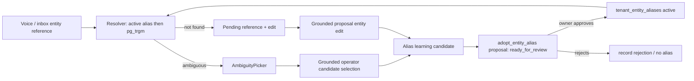

# feat: Build an approved tenant learning loop for voice references and habits

**Created:** 2026-07-21  
**Depth:** Deep  
**Status:** plan

## Summary
Build a tenant-scoped learning loop so the system improves after an operator
explicitly corrects or selects an entity reference. The system will not
fine-tune a shared model or silently change canonical behavior. Instead, it
will capture grounded learning candidates, present them in the existing proposal
inbox for one-tap owner approval, persist approved aliases/preferences with
provenance, and apply them before fuzzy entity resolution.

## Problem Frame
The top-50 voice corpus revealed that bare operational references such as
“Khan,” “the Smith invoice,” and “Carlos” often lack enough evidence for the
tenant-scoped resolver. Today those cases either escalate or require manual
editing, and the successful correction is not retained. Seeding test records
unblocks acceptance testing but is not a product learning strategy.

The product needs a safe loop:

`spoken reference → safe resolver/clarification → explicit operator selection
or correction → learning candidate → owner approval → active tenant alias →
future deterministic resolution`

## Requirements
- R1. A learned reference is strictly tenant-scoped and cannot influence
  another tenant.
- R2. Only grounded manual selections/corrections create an alias candidate;
  LLM output alone never does.
- R3. All candidates require one-tap owner approval before becoming active.
- R4. Approved aliases are reversible, auditable, bounded, and can be
  deactivated.
- R5. Entity resolution checks active aliases before pg_trgm fuzzy matching.
- R6. Ambiguous, expired, rejected, or inactive aliases never cause a silent
  entity choice.
- R7. Candidate capture is failure-soft and cannot block proposal resolution,
  approval, or execution.
- R8. Stored free-text provenance is redacted/bounded; raw unstructured
  transcripts are not sent to a global model or cross-tenant corpus.
- R9. Learning candidates integrate with the existing proposal inbox rather
  than creating an unaudited parallel approval UI.

## Key Technical Decisions
- **One-tap owner approval, not immediate activation** — A user’s correction
  creates a `ready_for_review` alias proposal. This preserves D-004
  proposal-first governance and makes every learned behavior explicit,
  reversible, and audit-visible.
- **No per-tenant model fine-tuning in V1** — Retrieve approved aliases and
  preferences at runtime. This is deterministic, inexpensive, avoids
  cross-tenant leakage, and makes rollback simple.
- **Alias lookup before fuzzy resolution** — Exact normalized aliases return
  a grounded entity ID at score 1.0; pg_trgm remains the fallback. A learned
  alias never lowers the ambiguity threshold for unrelated records.
- **Learn only from strong ground truth** — Candidate sources are
  `resolveProposalEntity` selections and manual proposal edits that replace a
  `pendingReference`. Do not learn from unresolved refs, model guesses,
  unapproved drafts, or telephony’s current raw-reference path.
- **Reuse the proposal inbox** — New `adopt_entity_alias` proposal payload,
  handler, audit events, and dedup follow correction-repetition meta-proposal
  patterns. No new independent queue.
- **Use a separate alias table** — `tenant_entity_aliases` is canonical,
  versioned learning state. It is not derived RAG text and every row has
  tenant RLS, provenance, status, and activation/deactivation audit.

## Scope Boundaries
**In scope:**
- Entity aliases (customer, job, invoice, estimate, appointment, technician).
- Learning candidates from web/mobile ambiguity picks and edit corrections.
- Owner approval, persistence, activation/deactivation, alias-first resolver.
- Tenant context retrieval for classifier/entity resolver prompts where useful.
- Audit, privacy/redaction, integration and property-based tests.

**Non-goals:**
- Training or fine-tuning an LLM on tenant transcripts.
- Cross-tenant aggregation, global alias sharing, or unapproved automatic
  behavior changes.
- Learning a price, compliance rule, or messaging policy; existing correction
  lessons, catalog proposals, and standing instructions retain those roles.
- Altering emergency safety routing.
- Learning from unverified inbound telephony references before resolver parity.

## Repository invariants touched
- **Tenant isolation/RLS:** every alias/candidate row has `tenant_id`; real DB
  integration tests prove tenant A cannot read/write tenant B.
- **Canonical truth:** only the approved alias service writes aliases; RAG and
  extraction remain derived signals with provenance.
- **Audit:** candidate capture, approval, activation, rejection, and
  deactivation emit audit events.
- **AI safety:** aliases ground entity resolution; they do not authorize
  mutation. Resulting actions remain typed proposals requiring human approval.
- **Privacy:** candidate text is normalized, bounded, and redacted before any
  derived use; no raw payload logging.

## High-Level Technical Design

## Implementation Units

### U1. Define alias data model, migration, shared contracts, and audit vocabulary
- **Goal:** Add a typed, RLS-protected canonical store for active and inactive
  tenant entity aliases plus proposal payload contracts.
- **Requirements:** R1, R3, R4, R8, R9
- **Dependencies:** none
- **Files:** `packages/api/src/db/schema.ts`,
  `packages/shared/src/contracts/entity-alias.ts`,
  `packages/shared/src/index.ts`,
  `packages/api/src/learning/entity-aliases/entity-alias.ts`,
  `packages/api/src/learning/entity-aliases/pg-entity-alias.ts`,
  `packages/api/src/proposals/contracts/adopt-entity-alias.ts`,
  `packages/api/src/proposals/contracts.ts`,
  `packages/api/test/learning/entity-aliases/entity-alias.test.ts`,
  `packages/api/test/integration/entity-alias-rsl.test.ts`
- **Approach:** Store normalized alias, entity kind/id, source reference,
  approval proposal ID, lifecycle status, actor, timestamps, and bounded
  provenance. Add unique active-alias semantics per `(tenant_id, entity_kind,
  normalized_alias)` and soft deactivation. Proposal payload validates a
  grounded entity ID/kind and cannot include arbitrary entity targets.
- **Patterns to follow:** `standing_instructions`,
  `correction_lessons`, `pg-notification-preferences-repository`,
  correction-repetition proposal contracts.
- **Test scenarios:**
  - Normalize case/whitespace safely and reject empty/control-character aliases.
  - Duplicate active alias conflicts; deactivation permits a new version.
  - Fuzz normalization with Unicode/control input using `fast-check`.
  - Real Postgres RLS: no cross-tenant reads/writes.
  - Audit emitted for every lifecycle mutation.
- **Verification:** Schema migrations apply, contracts parse only valid
  grounded data, and integration RLS tests pass.

### U2. Capture grounded candidate signals and create deduplicated review proposals
- **Goal:** Translate a manual entity selection or correction into a
  `ready_for_review` alias proposal without breaking the originating flow.
- **Requirements:** R2, R3, R7, R8, R9
- **Dependencies:** U1
- **Files:** `packages/api/src/learning/entity-aliases/candidate-service.ts`,
  `packages/api/src/proposals/resolve-entity.ts`,
  `packages/api/src/proposals/actions.ts`,
  `packages/api/src/app.ts`,
  `packages/api/test/proposals/resolve-entity.test.ts`,
  `packages/api/test/proposals/actions.test.ts`,
  `packages/api/test/integration/entity-alias-candidate.test.ts`
- **Approach:** Emit only after `resolveProposalEntity` validates a candidate
  against the supplied list, or after an entity field edit clears a documented
  `pendingReference`. Dedup by tenant/kind/normalized alias/entity ID. Make
  enqueue failure-soft; preserve existing proposal audit/approval behavior.
  Redact/bound source reference metadata before persistence.
- **Patterns to follow:** `correction-repetition.ts`,
  `recordCorrectionLessonsOnExecution`, `computeCorrections`,
  `sanitizeExtractedEntities`.
- **Test scenarios:**
  - Valid picker selection creates exactly one review proposal and audit.
  - Double tap/retry stays idempotent.
  - Ungrounded candidate ID and unapproved draft create no learning signal.
  - Candidate service failure does not fail entity resolution/edit.
  - Candidate text is bounded/redacted.
- **Verification:** Existing ambiguity resolution remains unchanged except for
  a new inbox candidate proposal; no source flow becomes auto-approved.

### U3. Execute approved alias proposals and support revoke/deactivate
- **Goal:** Make approved aliases active canonical tenant configuration and
  support reversible removal.
- **Requirements:** R3, R4, R9
- **Dependencies:** U1, U2
- **Files:** `packages/api/src/proposals/execution/entity-alias-handler.ts`,
  `packages/api/src/proposals/execution/handlers.ts`,
  `packages/api/src/routes/settings.ts` or a dedicated learning route,
  `packages/api/test/proposals/execution/entity-alias-handler.test.ts`,
  `packages/api/test/integration/entity-alias-lifecycle.test.ts`
- **Approach:** Register an `adopt_entity_alias` handler. On owner approval,
  upsert active alias using the approved proposal payload and write audit.
  Deactivation is an explicit owner action that retains provenance/history;
  it never deletes audit evidence.
- **Patterns to follow:** `standing-instruction-handler.ts`,
  `update-catalog-item-handler.ts`, proposal lifecycle/undo.
- **Test scenarios:**
  - Approved proposal creates active alias; rejected proposal does not.
  - Reapproval/idempotent execution creates one active row.
  - Deactivate blocks future alias resolution and emits audit.
  - Tenant/role permission checks deny unauthorized mutation.
- **Verification:** A proposal goes draft → review → approved → active alias
  with human approval and audit evidence.

### U4. Apply approved aliases before fuzzy resolution and expose safe tenant context
- **Goal:** Resolve an approved tenant alias deterministically before pg_trgm,
  while retaining ambiguity/not-found safety.
- **Requirements:** R1, R4, R5, R6, R8
- **Dependencies:** U1, U3
- **Files:** `packages/api/src/ai/resolution/entity-resolver.ts`,
  `packages/api/src/ai/resolution/pg-entity-resolver.ts` or
  `packages/api/src/ai/resolution/alias-first-entity-resolver.ts`,
  `packages/api/src/ai/agents/customer-calling/entity-resolution.ts`,
  `packages/api/src/workers/voice-action-router.ts`,
  `packages/api/test/ai/resolution/alias-first-entity-resolver.test.ts`,
  `packages/api/test/integration/entity-alias-resolution.test.ts`,
  `packages/api/test/ai/agents/customer-calling/inapp-entity-resolution-safety.test.ts`
- **Approach:** Prefer a decorator to preserve the current `PgEntityResolver`
  API: normalized active alias lookup → verify the target entity still belongs
  to the tenant/is active → return grounded result → otherwise delegate to
  pg_trgm. Alias results do not bypass entity type or lifecycle validation.
  Feed only active, bounded tenant aliases into classification context where
  prompt context is needed; no raw transcript history.
- **Patterns to follow:** `PendingProposalResolver`,
  `TenantGlossaryProvider`, resolver safety tests.
- **Test scenarios:**
  - Approved `Khan → customerId` resolves at score 1.0.
  - Alias target deleted/archived/wrong tenant falls through safely.
  - Ambiguous/nonexistent aliases retain existing clarification behavior.
  - Alias does not allow cross-kind or cross-tenant resolution.
  - Voice flow creates a proposal only after normal confirmation.
- **Verification:** An approved alias changes only that tenant’s resolver
  result; other tenants and unapproved aliases are unaffected.

### U5. Surface learning candidates in the existing inbox and measure outcomes
- **Goal:** Let owners approve/reject aliases with the current proposal UI and
  prove the learning loop improves an unseen reference safely.
- **Requirements:** R3, R4, R7, R9
- **Dependencies:** U2–U4
- **Files:** `packages/web/src/components/inbox/AIProposalCard.tsx`,
  `packages/web/src/components/inbox/InboxPage.tsx`,
  `packages/web/src/components/inbox/*.test.tsx`,
  `packages/mobile/src/hooks/useProposalReview.ts`,
  `packages/mobile/src/screens/proposal-review.test.ts`,
  `scripts/probe-operator-voice-50-live.mjs`,
  `docs/runbooks/tenant-learning-loop.md`,
  `docs/verification-runs/`
- **Approach:** Render alias proposal source reference, target entity, source
  event, and approve/reject/revoke affordances without exposing raw transcript
  content. Add a live probe phase: reference misses → operator selects entity
  → owner approves alias → same reference resolves on a new session. Keep the
  top-50 fixture runner separate from learning acceptance so passing tests do
  not fake a learned outcome.
- **Patterns to follow:** `AmbiguityPicker`, `AIProposalCard`,
  `useProposalReview`, correction-repetition inbox flow.
- **Test scenarios:**
  - Alias proposal appears with ≥44px tap targets and no 320px overflow.
  - Owner approve → alias works in next voice session.
  - Reject/revoke → subsequent voice call remains clarification/not-found.
  - Live acceptance records proposal/callback IDs without secrets.
- **Verification:** A tenant teaches one new nickname through explicit
  selection + owner approval, then the next voice request resolves it safely.

## Risks & Dependencies
- Migration and RLS changes require Docker-gated integration tests.
- Alias references can contain PII; only bounded normalized references and
  tenant-scoped provenance may persist, and any derived/embedding text must be
  redacted first.
- Introducing a new proposal type affects API/web/mobile contract registries;
  compile-time exhaustiveness and UI tests must cover it.
- Existing top-50 fixture seeding is an acceptance prerequisite but must not
  masquerade as the learning loop.

## Open Questions
- Whether alias candidates should appear after one manual selection (recommended
  for review) or only after repeated confirmations; this plan uses one
  selection + one-tap owner approval, with later repetition ranking as a
  product enhancement.
- Whether an approved alias expires automatically when the target is archived;
  V1 validates target activity at resolution time and leaves lifecycle audit
  intact.
