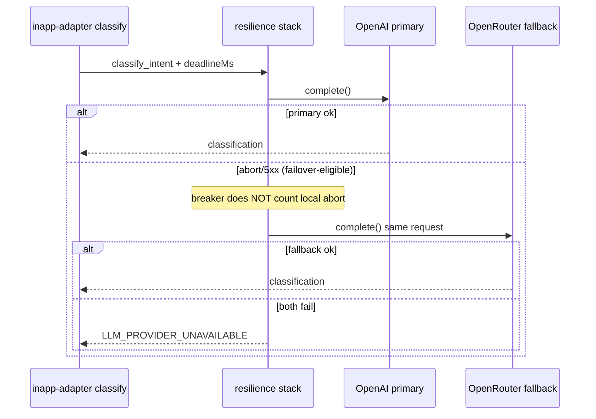

# fix: Operator voice DEGRADED → 50/50 (failover + residual product)

**Created:** 2026-07-23
**Depth:** Deep
**Status:** plan
**Supersedes residual of:** `docs/plans/2026-07-23-002-fix-voice-breaker-abort-cascade-plan.md` (FM-03 + live gap)
**Baseline evidence:** `docs/verification-runs/operator-voice-50-v3-prod-2026-07-23.md`

## Summary

Close the remaining production operator-voice top-50 gap from **30/50 → 50/50 voice PASS** on one clean `--voice-only` v3 run. #734 stopped abort→breaker cascade (breaker stays closed); residual ~20 DEGRADED cases are dominated by sole-provider `LLM_PROVIDER_UNAVAILABLE` plus a small product/fixture tail. This plan wires **real dual-provider failover** (OpenAI primary + OpenRouter fallback), locks classify-deadline ops guardrails, adds A/B failure taxonomy to the probe, then applies triage-gated product fixes only if infra-clean runs still miss 50/50.

## Problem Frame

Operators and QA cannot trust production voice until v3 corpus hits **50/50** (Dev seeded baseline already does). After #734 + restoring `AI_CLASSIFY_INTENT_DEADLINE_MS=12000`, prod voice-only reached **30/50** with breaker closed and interleaved PASSes — so the cascade is fixed, but:

1. `createLLMGateway` never populates `fallbackProviders` → `ProviderFailoverWrapper` always exhausts a **single** provider into `LLM_PROVIDER_UNAVAILABLE` (often after local abort), even while breaker stays closed.
2. Railway “Profile B” today **replaces** the primary with OpenRouter; it is **not** dual-provider failover. Prior plan text that said “code ready via env” was incorrect.
3. Empty-string `AI_CLASSIFY_INTENT_DEADLINE_MS` silently falls back to **4000ms** (regressed today; restored manually).
4. A minority of failures may be true product DEGRADED (entity/fixture/intent) — must not be fixed preemptively until infra noise is removed.

Who it affects: production QA tenant `44c63e93-33fc-4c45-8bc2-11e0a50d2973`, live voice path, go-live confidence for AI advisory proposals.

## Requirements

- R1. Wire second OpenAI-compatible provider from env into `composeResilienceStack({ fallbackProviders })` so primary abort/5xx tries OpenRouter before throwing `LLM_PROVIDER_UNAVAILABLE`.
- R2. Keep Profile A OpenAI as **primary**; OpenRouter is **fallback only** (do not wholesale swap Profile B as the sole path).
- R3. Reject empty/`0` `AI_CLASSIFY_INTENT_DEADLINE_MS` at config validation (or treat empty as unset→documented default only after explicit warn); production keeps **12000**.
- R4. Probe harness buckets each non-PASS into **infra (A)** vs **product (B)** with audit/`errorCode`/`providerPath` signals.
- R5. Hard acceptance: **50/50 voice PASS** on one clean production voice-only v3 run after deploy + ops vars, with breaker `closed` throughout.
- R6. AI remains advisory; proposals never auto-execute; no Clerk JWT lifetime extension; no `sk_test_`/`pk_test_` on Railway prod; `NODE_ENV=production` flip is out of scope.

## Key Technical Decisions

- **Dual-provider failover (OpenAI → OpenRouter), not Profile B swap** — Preserve working OpenAI primary that already delivers ~30/50; use OpenRouter only on failover-eligible primary failures. (Alternatives: OpenRouter-only Profile B — rejected: regresses primary quality/rollback; “ops-only Profile B” — rejected: factory never wires `fallbackProviders`.)
- **New env pair for fallback** — `AI_FALLBACK_PROVIDER_API_KEY`, `AI_FALLBACK_PROVIDER_BASE_URL`, optional `AI_FALLBACK_LIGHTWEIGHT_MODEL` (default OpenRouter Llama 8B). (Alternatives: reuse `SHADOW_LLM_*` — rejected: shadow is sampling/observability, not request path; hardcode OpenRouter — rejected: must be env-driven.)
- **Primary abort is failover-eligible when a fallback exists** — With two providers, advance to fallback; with one provider, keep current exhaustion behavior. Do **not** reopen FM-01 (abort still must not count toward breaker health).
- **Keep classify deadline at 12000** unless post-failover triage still shows `classifier_deadline_failure` dominance — then consider 15000 as a bounded ops tweak. (Alternative: jump to 20000 first — rejected: masks sole-provider bugs and lengthens JWT-sensitive runs.)
- **Product fixes are triage-gated (U4)** — Only after an infra-clean run with ≤5 Bucket B failures. Dev 50/50 on seeded QA is the control. (Alternative: preemptive classifier/prompt rewrite — rejected: over-scope.)
- **Acceptance uses `--voice-only`** — Matches hard gate; avoids assistant load doubling classify pressure.

## Scope Boundaries

**In scope:**
- Factory + resilience wiring for second provider
- Config validation for classify deadline empty-string regression
- Probe A/B taxonomy + pre-run gate notes
- Railway ops: set fallback vars (desktop/CLI), keep primary OpenAI + deadline 12000
- Conditional fixture/entity/intent fixes for remaining Bucket B cases
- Live voice-only 50/50 gate + verification-run doc update

**Non-goals:**
- Flipping `NODE_ENV` to `production`
- Extending Clerk `serviceos` JWT template lifetime
- Railway Clerk key flips to test keys
- Replacing OpenAI primary with OpenRouter-only Profile B
- Reviving dead `FailoverGateway` (`packages/api/src/ai/gateway/failover.ts`) — leave unused
- Full assistant+voice 50/50 (nice-to-have after voice-only gate)
- OpenRouter billing account creation (ops prerequisite; document only)

### Deferred to follow-up work
- Cosmetic sole-provider audit: throw `DEADLINE_EXCEEDED` instead of wrapping abort as `LLM_PROVIDER_UNAVAILABLE` when `fallbackProviders` is empty
- v4–v6 anti-memorization corpora as a separate gate
- `AI_COMPLETION_PROBE_TIMEOUT_MS=20000` if completion probe still flakes after failover (optional ops)

## Repository invariants touched

- **LLM gateway** — all AI calls remain through `packages/api/src/ai/gateway`; failover is inside the resilience stack, not a side-channel client.
- **Audit events** — classifier failure audits stay; failover success should leave normal `intent_classified` path; no silent guesses.
- **Human-approval gate** — voice still creates proposals only; never auto-execute.
- **Entity resolver** — product fixes (if any) keep ambiguity → `voice_clarification`, never silent entity guess.
- **Tenant isolation / RLS** — fixture seed stays QA-tenant scoped with existing guardrails.
- Money/catalog resolver — untouched.

## High-Level Technical Design

## Implementation Units

### U1. Wire second-provider failover from env (FM-03)

- **Goal:** Populate `fallbackProviders` from env so sole-provider exhaustion stops being the default production path.
- **Requirements:** R1, R2
- **Dependencies:** none
- **Files:**
  - `packages/api/src/ai/gateway/factory.ts` (modify)
  - `packages/api/src/shared/config.ts` (modify — optional Zod fields for fallback)
  - `packages/api/src/config/ai-routing.ts` (modify if fallback lightweight model helper lives here)
  - `packages/api/.env.example` / `.env.production.example` (document vars)
  - `packages/api/test/ai/gateway/factory-fallback.test.ts` (create)
  - `packages/api/test/ai/gateway-resilience.test.ts` (extend dual-provider abort→success)
  - `packages/api/test/ai/gateway/factory-shadow.test.ts` (extend chain introspection if needed)
- **Approach:** When `AI_FALLBACK_PROVIDER_API_KEY` + `AI_FALLBACK_PROVIDER_BASE_URL` are both set, construct a second `OpenAICompatibleProvider` (OpenRouter headers when host contains `openrouter.ai`). Pass `[secondary]` as `resilience.fallbackProviders` into `composeResilienceStack`. If either var missing, keep today’s single-provider behavior (no boot failure — allows staged rollout). Prefer fallback model override via `AI_FALLBACK_LIGHTWEIGHT_MODEL` defaulting to `meta-llama/llama-3.1-8b-instruct` for classify/lightweight traffic; standard/complex can reuse primary models unless separately overridden later.
- **Patterns to follow:** `compose-resilience.ts` `ProviderFailoverWrapper`; OpenRouter header branch already in `factory.ts`; tests in `gateway-resilience.test.ts`.
- **Test scenarios:**
  - Happy path: primary fails with abort → fallback succeeds → response `providerPath` includes both hosts; caller gets classification (no `LLM_PROVIDER_UNAVAILABLE`).
  - Edge: only primary configured → behavior unchanged (single path exhaustion).
  - Error: both fail with 5xx → `LLM_PROVIDER_UNAVAILABLE`; local abort on primary still **does not** open breaker (FM-01 preserved).
  - Integration: factory env wiring unit test proves `fallbackProviders.length === 1` when both fallback env vars set.
- **Verification:** Unit pack green; `tsc --project tsconfig.build.json --noEmit` clean; factory introspection shows failover wrapper with one fallback.

### U2. Deadline empty-string guard + ops profile docs

- **Goal:** Prevent the 4s classify regression and document how to set dual-provider Railway vars without swapping Profile B as sole primary.
- **Requirements:** R3, R6
- **Dependencies:** U1 (code must exist before ops expects failover)
- **Files:**
  - `packages/api/src/config/ai-routing.ts` (modify — treat `""` / whitespace as unset; optionally warn)
  - `packages/api/scripts/check-ai-provider-config.ts` (extend)
  - `packages/api/test/ai/gateway/deadline-config.test.ts` (create) or extend existing routing tests
  - `docs/runbooks/live-ai-restore.md` (add “Profile A + OpenRouter fallback” section distinct from Profile B swap)
  - `docs/runbooks/openrouter-ai-provider.md` (clarify failover vs primary-swap)
  - `docs/prod-env-checklist.md` (add fallback vars + deadline non-empty check)
  - `scripts/apply-railway-ai-profile.sh` — **do not** overload Profile B; optional new `scripts/apply-railway-ai-fallback.sh` **or** documented Railway desktop steps only (prefer small script if low risk)
- **Approach:** Config helper: empty string must not parse as `0`/invalid that falls through incorrectly — mirror `parsePositiveIntEnv` so `""` → default **or** explicit production validation error when `AI_CLASSIFY_INTENT_DEADLINE_MS` is present-but-empty. Prefer: present-but-empty → boot/config check failure in `check-ai-provider-config` + runtime treat as unset with loud log. Ops: set on prod `@serviceos/api`:
  - keep primary OpenAI Profile A + `AI_CLASSIFY_INTENT_DEADLINE_MS=12000`
  - add `AI_FALLBACK_PROVIDER_*` OpenRouter key/base
  - optional `AI_FALLBACK_LIGHTWEIGHT_MODEL=meta-llama/llama-3.1-8b-instruct`
- **Patterns to follow:** `docs/runbooks/live-ai-restore.md` Profile tables; `check-ai-provider-config.ts` host/model mismatch style.
- **Test scenarios:**
  - Happy: `AI_CLASSIFY_INTENT_DEADLINE_MS=12000` → 12000.
  - Edge: unset → code default 4000 (dev).
  - Error: env set to `""` → check script fails **or** runtime uses default and records warning (choose one; prefer check-script fail for prod checklist).
  - Pure docs/script: `Test expectation: none` for markdown-only; script changes need a dry-run assertion if added.
- **Verification:** After Railway apply + redeploy, `/api/health/ai` closed; single warm classify succeeds; completion probe not used as sole green light.

### U3. Probe failure taxonomy (infra A vs product B)

- **Goal:** Make the next live runs actionable: every non-PASS tagged A or B with evidence fields.
- **Requirements:** R4
- **Dependencies:** none (can parallel U1); must land before U4 triage
- **Files:**
  - `scripts/probe-operator-voice-50-live.mjs` (modify scoring/summary helpers)
  - `scripts/production-retest.mjs` (emit taxonomy in JSON report)
  - `scripts/__tests__/probe-operator-voice-50-live.test.mjs` (extend)
  - `scripts/__tests__/production-retest-taxonomy.test.mjs` (create if cleaner than extending JWT tests)
- **Approach:** Post-case classifier:
  - **Bucket A (infra):** `voice_classifier_provider|deadline|quota|parse`, audit `classifier_*_failure`, codes `LLM_PROVIDER_UNAVAILABLE`/`BREAKER_OPEN`/`DEADLINE_EXCEEDED`, or `providerPath` length ≥2 with failure.
  - **Bucket B (product):** proposal missing with successful classify, wrong intent family, entity ambiguity/`voice_clarification` loops on seeded fixtures, emergency scoring misses, etc.
  - Emit `probe.failureTaxonomy: { A: n, B: n, cases: [...] }` into `production-retest.json`.
- **Patterns to follow:** existing `scoreVoice` reason strings; verification-run scoreboard tables.
- **Test scenarios:**
  - Happy: synthetic sideEffects with `classifier_provider_failure` → Bucket A.
  - Happy: PASS with proposal → not in taxonomy failures.
  - Edge: `LLM_PROVIDER_UNAVAILABLE` + breaker closed → still Bucket A (not product).
  - Edge: intent classified + no proposal on seeded lookup → Bucket B.
- **Verification:** Unit tests for taxonomy; one dry local run against fixture JSON not required for merge.

### U4. Triage-gated product / fixture fixes

- **Goal:** Close only remaining Bucket B failures after failover is live.
- **Requirements:** R5 (enables)
- **Dependencies:** U1 + U2 deployed; U3 taxonomy available; **skip entirely if a post-U2 voice-only run is already 50/50**
- **Files (expected touch set — finalize from triage artifact):**
  - `fixtures/voice/operator-voice-fixture-catalog.json` (if seed gaps)
  - `packages/api/src/seed/operator-voice-fixture-plan.ts` / `operator-voice-fixture-runner.ts` (if plan gaps)
  - `packages/api/src/ai/agents/customer-calling/entity-resolution.ts` and/or `inapp-adapter.ts` (only if Bucket B proves resolver/FSM bug)
  - `packages/api/test/integration/operator-voice-fixtures.test.ts`
  - `packages/api/test/ai/agents/customer-calling/inapp-entity-resolution-safety.test.ts`
  - `packages/api/test/voice/operator-voice-golden-path.test.ts` (if behavior change)
- **Approach:** Run voice-only prod with taxonomy. Decision rule:
  - If PASS ≥45 and remaining ≤5 all Bucket B → fix those case IDs only.
  - If ≥10 Bucket A remain → **stop**; fix infra/ops, do not expand product scope.
  - Prefer fixture/seed parity with Dev QA over prompt sprawl.
- **Patterns to follow:** `docs/runbooks/operator-voice-fixture-seed.md`; integration entity-resolution column pinning.
- **Test scenarios:**
  - Happy: seeded entity resolves → proposal/`voice_clarification` as designed.
  - Edge: ambiguous names → clarification, never silent pick.
  - Integration: Docker-gated fixture seed idempotency still passes.
- **Verification:** Targeted case IDs flip to PASS on re-probe; no new Bucket A introduced.

### U5. Live acceptance gate (50/50 voice-only)

- **Goal:** Prove hard success on production and record evidence.
- **Requirements:** R5, R6
- **Dependencies:** U1–U3; U4 if needed
- **Files:**
  - `docs/verification-runs/operator-voice-50-v3-prod-2026-07-23.md` (update) or dated follow-on
  - Artifacts under `/opt/cursor/artifacts/operator-voice-50-v3-prod-<ts>/` (not committed)
- **Approach:** Pre-run gate: `/api/health/ai` available+closed; deadline non-empty; JWT 25s refresh; `--wait-closed --voice-only`. One clean run. If 48–49/50, one bounded retry only after identifying failing case IDs — no multi-run averaging.
- **Patterns to follow:** `docs/runbooks/operator-voice-top-50-production-rerun.md`.
- **Test scenarios:** `Test expectation: none — live ops gate; evidence is verification-run markdown + artifact JSON.`
- **Verification:** Report shows Voice PASS **50/50**; breaker closed end-to-end; taxonomy shows 0 unresolved Bucket A (or documented transient with second clean 50/50).

## Risks & Dependencies

| Risk | Mitigation |
|------|------------|
| OpenRouter key/billing missing | Block U2 apply until key exists; verify with 1–3 classify warms before top-50 |
| Fallback model semantic drift (Llama vs gpt-4o-mini) | Restrict fallback to lightweight/classify path; spot-check 5 hard v3 cases on Dev before prod |
| Dual-hop latency exceeds 12s | Measure after U2; only then consider 15s deadline |
| Empty deadline regression returns | U2 check + pre-run gate |
| Over-scoping U4 | Hard stop if Bucket A still dominates |
| JWT 60s expiry | Existing 25s refresh; voice-only shortens run |
| Incorrect belief that Profile B script alone fixes FM-03 | Plan explicitly requires U1 factory wiring |

**External dependency:** OpenRouter API key for production (and ideally Development) — human/ops provides; agent may apply via Railway desktop once key is available.

## Open Questions

- Exact fallback env names if existing unpublished conventions appear during implementation — prefer `AI_FALLBACK_PROVIDER_*` unless a prior contract is found in code.
- Whether fallback should apply to all tiers or only `classify_intent` / lightweight — default **all tiers share the fallback provider** with lightweight model override; narrow later if cost/quality demands.
- OpenRouter key ownership / project billing — resolve at U2 ops time.

## Sources & Research

- Live scores: `docs/verification-runs/operator-voice-50-v3-prod-2026-07-23.md` (30/50 voice-only post-deadline restore; 28/50 full)
- Cascade plan FM-03 residual: `docs/plans/2026-07-23-002-fix-voice-breaker-abort-cascade-plan.md`
- Failover wrapper exists, factory does not wire it: `packages/api/src/ai/gateway/compose-resilience.ts`, `packages/api/src/ai/gateway/factory.ts`, `discovery/01-ai-prompt-architecture.md`
- Profile B = primary swap: `docs/runbooks/live-ai-restore.md`, `scripts/apply-railway-ai-profile.sh`
- Entity/fixture patterns: `docs/runbooks/operator-voice-fixture-seed.md`, prior plans `2026-07-21-001-*`
