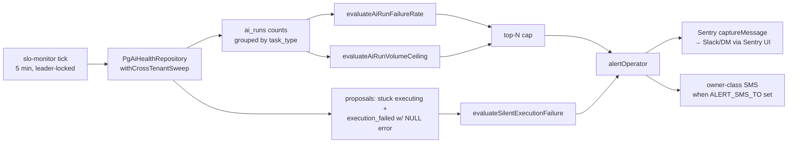

# feat: Make failure visible — ai_runs monitoring, Sentry activation, env-var CI guard

**Created:** 2026-07-28
**Depth:** Deep
**Status:** plan
**Revision:** 2 (adversarial review folded in — see Review Corrections)

## Summary

Every defect in the 2026-07 audit was silent: the annotation worker burned
27,000 calls with no alert, estimates failed with `execution_error` NULL,
spoken addresses vanished without an error. The common factor is not the
individual bugs — nothing watches. This plan closes that in three moves:
three new rules in the existing `slo-monitor` worker that page a human off
`ai_runs` health and stuck proposal executions; activating Sentry end to
end (including the one critical path documented as instrumented but never
wired); and a CI guard that makes "env var read by code, declared in no
environment" a build failure instead of archaeology.

## Problem Frame

ServiceOS already has the plumbing to page a human — `alert-operator.ts`
is an explicit "single 'page the operator' seam" wired into a
leader-elected 5-minute `slo-monitor` sweep with per-rule cooldown, Sentry
routing, and owner-class SMS. It has **four** rules, all voice/queue
oriented (`call_completion_rate`, `queue_staleness`, `sweep_lag`,
`voice_turn_latency_p95`). None of them look at AI task health, and none
look at proposal execution.

Meanwhile `ai_runs` already records exactly the signal needed —
`task_type`, `status`, `error_message`, `created_at`, and since migration
254 `cost_micro_cents` — and nothing reads it for health. Proposals reach
`execution_failed` through three code paths that never stamp
`execution_error`, which is precisely how the estimate failures stayed
invisible to the operator inbox that reads that column
(`routes/proposals.ts:265`).

Two audit claims did not survive verification and are corrected here:

1. **`SENTRY_DSN` is declared in the repo's env manifests** —
   `.env.example:78`, `.env.production.example:220`,
   `packages/api/.env.example:108` (commented), plus
   `docs/prod-env-checklist.md:122`. The gap is a Railway **dashboard**
   variable, not a missing declaration. Separately, `app.ts:743-744` reads
   raw `process.env.SENTRY_DSN` and ignores the Zod-validated
   `config.SENTRY_DSN` at `shared/config.ts:43`.
2. **`assistant-honesty-guard.ts` is not inert.**
   `routes/assistant.ts:39-46` imports six symbols and all six are called
   (`:1326`, `:1333`, `:1381`, `:1405`, `:1421`, `:1422`). Only
   `HONESTY_GUARD_MODEL:79` and `AssistantHonestReply:76` are exported
   without an external consumer. The dead-export class of problem is real;
   the cited example was not.

## Requirements

- R1. A sustained failure rate on any `ai_runs` task type pages a human
      within one evaluation window, with a volume floor so low-traffic
      task types cannot page off a single failure.
- R2. Proposals that fail silently — reaching `execution_failed` or
      stranded in `executing` with `execution_error` NULL — page a human.
- R3. Every code path that reaches `execution_failed` stamps
      `execution_error`, so R2's rule measures a genuine anomaly rather
      than a condition the code creates by design.
- R4. Sentry captures unhandled exceptions in production, verified by a
      deliberate test event arriving in the Sentry project.
- R5. All four critical paths documented as instrumented are actually
      instrumented.
- R6. Env vars that gate real features and are declared in no environment
      are identified and declared.
- R7. A newly-read env var that is declared in no environment fails CI.
- R8. Unused exports are visible in CI output (report-only).
- R9. A deliberately-broken task type raises an alert that reaches a
      person.
- **R10. A task type whose call volume runs away pages a human, even when
      every call succeeds.** The audit's headline defect — 27,000 calls
      burned by the annotation worker — is a *volume* failure, not a rate
      failure. A failure-rate rule alone would not have caught it. This
      requirement was missing from revision 1.

## Key Technical Decisions

- **Extend `workers/slo-monitor.ts` rather than add a new sweep.** The
  module already owns the exact shape needed: pure exported evaluator
  functions (unit-testable with no DB), a `SloMonitorDeps` seam, per-rule
  failure-softness, Prometheus counters, and `alertOperator` with a
  60-minute per-rule cooldown. A new sweep would need a new `SWEEP_LOCK`
  key, its own leader election, cooldown, and alert wiring — all of which
  already exist. (Alternative: a dedicated hourly sweep per the audit's
  suggested cadence. Rejected — 5 minutes is strictly better than hourly
  for a paging signal, and the cooldown already prevents storms. The
  audit's "hourly" was a cadence for a manual SQL check.)

- **Cross-tenant reads go through `withCrossTenantSweep`, in a new
  repository beside `PgPlatformSloRepository`.** `ai_runs` has
  `FORCE ROW LEVEL SECURITY` (`schema.ts:3238`) and `proposals` is
  tenant-scoped; a platform aggregate cannot use the tenant-scoped path.
  Signature is `protected async withCrossTenantSweep<T>(fn: (client:
  PoolClient) => Promise<T>): Promise<T>` (`db/pg-base.ts:115`) — it takes
  **no sweep-name argument**; attribution is per-role (`rls_cross_tenant`),
  not per-caller.

- **Cap the per-task-type rule keys at top-N breaching per tick.**
  `taskType` is typed `string` (`gateway.ts:68`) and nothing bounds the
  column. Today the real set is ~38 values (32 in `TASK_TYPES`, 5 dynamic
  `assistant.*` from `routes/assistant.ts:221-228`, plus
  `weekly_feedback_suggestions` at `app.ts:6134`), which is fine — but the
  rule key feeds three Prometheus label sets (`sloRuleValue`,
  `sloBreachTotal`, and `sloAlertsSentTotal{rule,channel}` incremented at
  `alert-operator.ts:91` and `:111`) plus an unbounded in-process cooldown
  Map. Emit at most N (default 5) breaching task types per tick, ordered
  worst-first, and log the count suppressed. Relying on the current set
  staying small is how cardinality incidents happen.

- **Stamp `execution_error` before shipping the silent-failure rule.**
  `resetStaleExecuting` (`pg-proposal.ts:542-548`) sets
  `status='execution_failed'` with no `execution_error` **by design
  today** — a rule counting NULL-error failures would fire on normal
  operation. U2 must land before U3's rule is allowed to breach.

- **`process.env.SENTRY_DSN` → `config.SENTRY_DSN`.** The Zod schema
  already declares it; reading raw `process.env` bypasses the `'' →
  undefined` coercion in `loadConfig` that exists specifically for empty
  CI/Railway secrets. An empty-string DSN read raw is truthy and would be
  handed to `Sentry.init`.

- **Env guard scoped to `packages/api/src` and `packages/mobile/src`
  only; `packages/web` is explicitly out of scope.** `packages/web/src`
  has **zero** non-test `process.env` reads — it is Vite, reading
  `import.meta.env.VITE_*` (`packages/web/src/dev/clerk-dev-shim.tsx:22-23`,
  `packages/web/src/pwa/register-sw.ts:34`) and, worse, resolving by
  **dynamic name** through `getRuntimeConfigValue(name)`
  (`packages/web/src/lib/runtimeConfig.ts:7-40`, which chains
  `window.__APP_CONFIG__?.[name]` → `import.meta.env?.[name]` →
  `process.env[name]`). No static regex can extract those — the names live
  at call sites. A web extractor is a separate piece of work, deferred.

- **`knip` report-only, not gating.** The motivating example in the audit
  was wrong. A gating dead-export check on a codebase with 3,367 known
  ESLint findings and a deliberately non-gating `eslint.config.mjs` would
  be a coin-flip on landing.

## Scope Boundaries

**In scope:** three `slo-monitor` rules and their cross-tenant reads; a
supporting composite index; stamping `execution_error` on the paths that
omit it; Sentry config-read fix, Stripe-webhook instrumentation, and a
verified production test event; classification and declaration of
feature-gating env vars; a CI guard for undeclared env vars in
`packages/api/src` and `packages/mobile/src`; `knip` as a report-only CI
step; runbook updates.

**Non-goals:**

- No Slack integration. The repo has none, and `alert-operator.ts:88` plus
  `docs/runbooks/alerting.md` establish that Slack routing is configured in
  the **Sentry UI**. Alerts reach a human via Sentry (→ Slack/DM per the
  existing runbook) and owner-class SMS when `ALERT_SMS_TO` is set.
- No fix for the underlying AI task failures the monitor will surface.
- No env-var extraction for `packages/web` (see the decision above).
- No migration of the ~318 remaining ad-hoc `process.env` reads to
  `config.*`. The guard checks declaration, not access pattern.
- No deletion of `WorkerRegistry` or other dead code `knip` finds.

### Deferred to follow-up work

- A `packages/web` env-declaration extractor handling `import.meta.env`
  and `getRuntimeConfigValue('X')` call sites.
- Flip `knip` from report-only to gating once its baseline is stable.
- Delete `packages/api/src/workers/worker-registry.ts` — but note it is
  **not** friendless: `test/workers/worker-registry.test.ts` constructs it
  five times (`:28,:37,:45,:55,:61`) and `test/decisions/decisions.test.ts:732`
  asserts the file exists. Both must be handled in the same change.
- De-export `HONESTY_GUARD_MODEL` / `AssistantHonestReply`
  (module-internal only).
- Reconcile the 162 ad-hoc `process.env` reads in `app.ts` against the
  `config` object it already holds.
- Add a self-check test for `check-fk-path-coverage.sh`, which has neither
  a positional-arg seam nor a self-test (unlike
  `check-ai-gateway-guard.sh`).
- Refresh `packages/api/docs/database-table-columns.md:44`, stale since
  migration 254 added `ai_runs.cost_micro_cents`.
- A cost-anomaly rule over `ai_runs.cost_micro_cents` — U3's volume
  ceiling is the cheap proxy; spend is the truer signal.

## Repository invariants touched

- **RLS / `tenant_id`** — both new reads are deliberate cross-tenant
  platform aggregates and must use `PgBaseRepository.withCrossTenantSweep`
  (named `rls_cross_tenant` role), never a tenant-scoped client. Same seam
  the recovery and retention sweeps use.
- **Audit events** — U2 changes only the value written to an existing
  column on an existing state transition; that transition's audit event
  already exists (`executor.ts:499`). No new mutation, no new event type.
- **Human-approval gate** — untouched. Nothing here executes proposals.
- **LLM gateway** — untouched; the monitor *reads* `ai_runs`.
- **Integer cents / UTC** — no money-rendering surface. `cost_micro_cents`
  is read only as a deferred follow-up. Window boundaries are UTC from
  `now()`, consistent with `COMPLETION_WINDOW_MS`.

## High-Level Technical Design

The three new rules slot into `runSloMonitor` as rules 5-7, each in its own
`try/catch` so a failed read skips only that rule.

## Implementation Units

### U1. Cross-tenant health reads + supporting index

- **Goal:** Give the monitor the data it needs, at a cost safe to run
  every 5 minutes.
- **Requirements:** R1, R2, R10
- **Dependencies:** none
- **Files:**
  - create `packages/api/src/monitoring/pg-ai-health.ts`
  - modify `packages/api/src/db/schema.ts` — new migration key
    `'263_ai_runs_task_type_created_at_index'`
  - create `packages/api/test/integration/ai-health-reads.test.ts`
- **Approach:** `PgAiHealthRepository extends PgBaseRepository` with two
  methods, both wrapped in `withCrossTenantSweep`. The base constructor is
  `constructor(protected readonly pool: Pool) {}` (`pg-base.ts:10`), so
  `new PgAiHealthRepository(pool)` is all that's needed.
  - `aiRunCountsByTaskType(windowStart)` — grouped over `ai_runs` where
    `created_at >= $1`, returning per `task_type`: total terminal rows and
    the count filtered to `status = 'failed'`. Return raw counts; **do
    not** compute rates or apply floors in SQL — that belongs in the pure
    evaluators so they are unit-testable without a DB, matching
    `evaluateCallCompletion`. This one read feeds both R1 and R10.
  - `silentExecutionFailureCounts(stuckOlderThan)` — over `proposals`:
    rows with `status = 'execution_failed' AND execution_error IS NULL`
    updated within the window, and rows with `status = 'executing'` whose
    `claimed_at` is older than `stuckOlderThan`.

  `ai_runs` has three single-column indexes (`schema.ts:193-195`:
  `tenant_id`, `task_type`, `prompt_version_id`) and **none on
  `created_at`** — no later migration adds one. A 5-minute window scan
  over a table that receives every gateway call needs a composite
  `(task_type, created_at)` index. Additive `CREATE INDEX IF NOT EXISTS`
  only, so the permissive `migration-discipline.test.ts` guard stays quiet.

  **Migration numbering:** the highest key is
  `'262_portal_sessions_contact_id'` and `263` is free. The 265 total
  entries exceed 262 because **six prefixes are duplicated** (070, 092,
  125, 173, 177, 221) — not because numbers were skipped. Only 55, 181 and
  235 are unused below 262.

  Status literals are fixed by a CHECK constraint (`schema.ts:183`):
  `'pending' | 'running' | 'completed' | 'failed'`. `'pending'` and
  `'running'` are non-terminal — an in-flight row must not count as a
  success. Denominator is **terminal only** (`status IN
  ('completed','failed')`) so an in-flight backlog cannot dilute the rate.
  The volume numerator (R10) is the opposite: count **all** rows in the
  window, since a runaway is a runaway whether or not it has settled.
- **Patterns to follow:** `packages/api/src/monitoring/pg-platform-slo.ts`
  end to end — its module docstring is the canonical explanation of why a
  cross-tenant read is legitimate, and `endedCallOutcomeCounts` is the
  exact `COUNT(*) FILTER (WHERE ...)` shape to mirror.
- **Test scenarios:**
  - Integration (Docker-gated, pins real columns): seed `ai_runs` across
    two tenants and three task types with mixed statuses; assert grouped
    counts include **both** tenants (proves the cross-tenant seam) and
    exclude rows older than the window.
  - Integration: seed proposals in `execution_failed` with NULL and
    non-NULL `execution_error`, and in `executing` with `claimed_at` both
    inside and outside the staleness bound; assert each count.
  - Edge: empty window returns an empty group list, not a throw.
  - Edge: a task type with only `pending`/`running` rows is absent from
    the terminal-only denominator but **present** in the volume count.
- **Verification:** Both reads return correct cross-tenant numbers against
  a real Postgres container, and `EXPLAIN` on the `ai_runs` query shows an
  index scan rather than a sequential scan.

### U2. Stamp `execution_error` on every path that reaches `execution_failed`

- **Goal:** Make `execution_error` reliable, so U3's rule measures an
  anomaly instead of normal operation.
- **Requirements:** R3
- **Dependencies:** none (must precede U3)
- **Files:**
  - modify `packages/api/src/proposals/execution/executor.ts` (~`:225-227`)
  - modify `packages/api/src/proposals/pg-proposal.ts` (`:542-548`)
  - modify `packages/api/src/proposals/proposal.ts` (`:1231`, the
    in-memory mirror — must match or tests diverge from production)
  - modify `packages/api/src/workers/execution-worker.ts` (`:89-96`)
  - modify `packages/api/test/workers/execution-worker.test.ts`
  - create `packages/api/test/proposals/execution-error-stamping.test.ts`
  - extend an existing proposal-execution integration test rather than
    adding a file, if one already covers `resetStaleExecuting`
- **Approach:** Three holes, each needing a different fix:
  1. **Chain cascade-fail** (`executor.ts:225-227`) sets
     `rejectionDetails` but not `executionError`, even though
     `cascadeResult.error = 'chain_dependency_failed'` is computed at
     `:217-218` and passed to the audit event. Pass it to the column too.
  2. **Stale-executing sweep** (`pg-proposal.ts:542-548`) omits
     `execution_error` from its SET list. Add a constant sentinel naming
     the cause — the row genuinely has no handler-supplied error, and a
     sentinel is more honest than a fabricated one; it must be
     distinguishable so an operator knows this was a reaper, not a
     rejection. **Write it as `execution_error = COALESCE(execution_error,
     '<sentinel>')`** — the reaper acts on rows still in `executing`, which
     is exactly where fix #3 has already stamped the real thrown error. A
     bare assignment would clobber it every time.
  3. **Thrown (not returned) handler errors** — `handler.execute()` is
     awaited un-caught at `executor.ts:335` and `:360`, and
     `AppError('HANDLER_NOT_FOUND')` throws at `:169-173`. The throw
     propagates to `execution-worker.ts:89-96`, which only increments
     `failed` and logs; the row stays `executing` with NULL error until
     the reaper flips it. Stamp the caught error in that catch block.

     **Exclude `CHAIN_PARENT_PENDING`** (`executor.ts:195-207`): that path
     deliberately resets the row to `'approved'` *before* throwing, and
     its message says "has not executed yet. Retrying." It is a healthy
     retry, not a failure — stamping it would mark an approved,
     retrying row as errored. The catch must skip rows the executor
     already reset.

  The executor already carries a comment at `:302-306` recording the prior
  instance of this bug ("execution_failed rows had execution_error NULL
  and were undebuggable"). The fix at `:309` covered only the
  handler-returned-failure path; these are the remainder.
- **Patterns to follow:** `executor.ts:294-310` — the existing
  `...(handlerResult.success ? {} : { executionError: ... ?? 'unknown
  execution failure' })` spread is the established shape.
- **Test scenarios:**
  - Happy path: a handler returning `{success: false, error}` still stamps
    that error (regression guard on the existing fix).
  - Chain cascade: parent fails → child transitions to `execution_failed`
    with `execution_error` naming the parent dependency, not NULL.
  - Thrown error: a handler that throws → `execution_error` contains the
    thrown message; the row does not sit in `executing` with a NULL error.
  - `HANDLER_NOT_FOUND`: the `AppError` code reaches the column.
  - `CHAIN_PARENT_PENDING`: the row returns to `'approved'` and
    `execution_error` stays NULL (negative test — this is the case the
    naive fix gets wrong).
  - Integration (Docker-gated): a stale `executing` row that **already**
    has an `execution_error` keeps it through `resetStaleExecuting`; one
    without gets the sentinel. This is the `COALESCE` proof.
  - In-memory and Pg repositories agree on all of the above.
- **Verification:** A query for `status='execution_failed' AND
  execution_error IS NULL` against a freshly-exercised test database
  returns zero rows across every failure path the suite drives.

### U3. Three new SLO rules

- **Goal:** Turn the U1 reads into pages.
- **Requirements:** R1, R2, R9, R10
- **Dependencies:** U1, U2
- **Files:**
  - modify `packages/api/src/workers/slo-monitor.ts`
  - modify `packages/api/src/shared/config.ts` (new `SLO_*` keys beside
    `:112-128`)
  - modify `packages/api/src/app.ts` (`:2438-2483`)
  - modify `packages/api/test/monitoring/slo-monitor.test.ts`
  - modify `.env.production.example`, `packages/api/.env.example`
- **Approach:** Pure exported evaluators mirroring
  `evaluateCallCompletion`'s contract — return `SloRuleResult | null` (or
  `SloRuleResult[]`), with `null` meaning "not enough data to judge",
  never a silent `false`.

  - `evaluateAiRunFailureRate(countsByTaskType, thresholds)` — skip groups
    below `SLO_AI_RUN_MIN_SAMPLE` (default 20, the audit's volume floor);
    breach above `SLO_AI_RUN_FAILURE_PCT` (default 0.10). Rule key is
    per-task-type (`ai_run_failure_rate:${taskType}`) because the
    `alert-operator` cooldown is keyed on `rule` and a shared key would
    suppress a second task type's breach for an hour — independent task
    types failing are independent incidents.
  - `evaluateAiRunVolumeCeiling(countsByTaskType, thresholds)` (R10) —
    breach when a task type's window call count exceeds
    `SLO_AI_RUN_HOURLY_CEILING` (default: set from observed baseline; see
    Open Questions). An absolute ceiling needs no historical baseline and
    would have caught the 27,000-call runaway on the first tick. Same
    per-task-type key convention.
  - `evaluateSilentExecutionFailure(counts, thresholds)` — breach when
    either count exceeds zero **after U2 lands**. Severity `critical`.

  **Top-N cap.** Both `ai_run_*` evaluators return arrays. Sort
  worst-first and emit at most `SLO_AI_RUN_MAX_ALERTS_PER_TICK` (default
  5), logging how many were suppressed — silent truncation reads as "all
  clear" when it isn't. This bounds the label space on `sloRuleValue`
  (`metrics.ts:327`), `sloBreachTotal` (`:335`), and
  `sloAlertsSentTotal{rule,channel}` (incremented at `alert-operator.ts:91`
  and `:111`), plus the in-process cooldown Map.

  **Gauge staleness.** `slo_rule_value` is a Gauge and
  `slo-monitor.ts:321` only `.set()`s rules present in *this* tick's
  results. With four fixed rules that never mattered; with dynamic keys, a
  task type that breaches once and then leaves the window keeps its breach
  value pinned in `/metrics` forever. Either call `sloRuleValue.remove({rule})`
  for dynamic keys absent this tick, or omit the gauge for these rules and
  rely on `sloBreachTotal`. Decide at implementation; do not leave stale
  series.

  **Array plumbing.** `runSloMonitor` collects `results: SloRuleResult[]`
  and iterates at `slo-monitor.ts:319-332` (the file is 338 lines).
  `results.push(...arr)` is a one-line change; `breached: string[]` and the
  alert payload need no shape change.

  Window: the monitor ticks every 5 minutes; use a trailing 60-minute
  window (matching `COMPLETION_WINDOW_MS`) so the volume floor is
  reachable for lower-traffic task types.

  Task types are not a closed set — group by whatever is in the column; do
  not validate against `TASK_TYPES` (`config/ai-routing.ts:139-188`), which
  deliberately excludes `weekly_feedback_suggestions` (`app.ts:6134`) and
  the five dynamic `assistant.*` values (`routes/assistant.ts:221-228`).

  **`app.ts` wiring:** instantiate beside `PgPlatformSloRepository` at
  `app.ts:2438` and **mirror its `pool ? new … : null` guard** — the deps
  fall back to zero counts when null (`:2447-2450`), and without that
  guard in-memory dev boots throw.
- **Patterns to follow:** `slo-monitor.ts` rules 1-4 verbatim — the
  docstring-per-rule convention at the top of the file (each rule
  documents its threshold, its sample floor, and *why* the floor exists)
  is load-bearing and should be extended, not skipped.
- **Test scenarios:**
  - Happy path: counts below threshold → `breached: false`, rule still
    listed in `evaluated`.
  - Volume floor: 1 failure out of 2 calls returns `null`, not a breach —
    the specific noise case the audit calls out.
  - Breach: 5 failures out of 20 on one task type breaches; a second
    healthy task type in the same result set does not.
  - Multi-breach: two task types over threshold produce two independent
    alerts with distinct rule keys (proves the cooldown-collision fix).
  - Top-N cap: 12 breaching task types produce 5 alerts and a log line
    naming the 7 suppressed.
  - Volume ceiling: a task type at 27,000 calls with a 100% success rate
    breaches `ai_run_volume_ceiling` and does **not** breach
    `ai_run_failure_rate` — the R10 regression case.
  - Failure-soft: a read that throws logs and skips only its own rule.
    Note the existing test's default deps use `processRole: 'worker'`
    (`test/monitoring/slo-monitor.test.ts:198`) and rule 4 is gated to
    `'all'` (`slo-monitor.ts:306`), so a worker-role tick evaluates
    **six** rules after this change, five after one throws.
  - Existing assertions at `test/monitoring/slo-monitor.test.ts:211` and
    `:249` use `expect(result.evaluated).toEqual([...])` — exact array
    equality. They **will** break and must be updated, not worked around.
  - Silent-execution rule: zero counts → no breach; one NULL-error failure
    → critical breach.
  - Config: defaults load when env vars are absent; out-of-range values
    are rejected by Zod.
- **Verification:** R9 — deliberately break one task type in a staging
  tenant (point it at an invalid model so the gateway records `failed`),
  drive it past the volume floor, and confirm a Sentry event arrives and
  routes to a human within two evaluation windows.

**Known limitation to document in the runbook, not fix here:** the
`ai_runs` row is created at `gateway.ts:481` on a best-effort basis
(`:486` sets `aiRun = undefined` on failure), and the failure write at
`:625` is guarded by `if (this.aiRunRepo && aiRun)`. Failures thrown
*before* the row exists — `validateLLMRequest` (`:380-382`),
`enforceTopLevelTenantId` (`:385`), `PROVIDER_NOT_FOUND` (`:389-391`), and
the tenant-scope guard at `:222` — never produce a `status='failed'` row
and are invisible to these rules. `gatewayRequestsTotal{outcome='error'}`
*is* incremented on that path (`:594-600`) and is the right companion
signal; a Prometheus rule over it belongs in the follow-up.

### U4. Activate Sentry end to end

- **Goal:** Crash reporting actually exists in production, and the fourth
  documented critical path is actually instrumented.
- **Requirements:** R4, R5
- **Dependencies:** none (U3's verification depends on this working)
- **Files:**
  - modify `packages/api/src/app.ts` (`:743-744`)
  - modify `packages/api/src/webhooks/routes.ts` (`:880`)
  - modify `packages/api/test/monitoring/` — extend existing Sentry tests
  - create `packages/api/test/webhooks/stripe-instrumentation.test.ts`
  - modify `docs/prod-env-checklist.md`, `docs/runbooks/alerting.md`
- **Approach:** Three parts.
  1. **Config read.** `app.ts:743-744` passes raw `process.env.SENTRY_DSN`
     and `process.env.NODE_ENV`, bypassing the Zod-validated `config`
     object already in scope. Switch to `config.SENTRY_DSN`. This matters
     beyond tidiness: `loadConfig` coerces `''` → `undefined` for empty
     CI/Railway secrets, and an empty-string DSN read raw is truthy.
  2. **Stripe webhook instrumentation.** `instrumentation.ts:15-17` and
     `app.ts:740` both claim four instrumented critical paths. Only three
     are wired — `instrument` is imported at
     `twilio-mediastream-server.ts:26`, `voice-action-router.ts:78`, and
     `execution-worker.ts:28`, and nowhere under `webhooks/`, `payments/`,
     or `routes/`. `docs/runbooks/alerting.md` already defines a P1 rule
     keyed on `tags["path"] = "stripe-webhook"` that has never been able
     to fire.

     **The handler is an inline anonymous route handler** —
     `router.post('/stripe', async (req, res) => {…})` at
     `webhooks/routes.ts:880`, inside the `createWebhookRouter` closure
     (`:222`). Nothing is exported, so the `*Inner`-export pattern used by
     `execution-worker.ts` does not transfer directly. Extract the body
     into a named `handleStripeWebhookInner(req, res)` **inside** the
     closure and wrap that.

     `instrument`'s `extractTags` receives only the handler args
     (`instrumentation.ts:5-7`), i.e. `(req, res)`. `tenantId` is derived
     deep inside the handler from the Stripe session, and the first
     correlation id on this route is `paymentIntentRef` at `:1187` —
     **neither is extractable at entry**. Tag `path` only; set `tenant_id`
     via `withScope` once resolved, or drop the claim.

     **Express 4 caveat:** `packages/api/package.json:49` pins
     `express@^4.18.0`, where an async handler that rejects is *not*
     routed to error middleware — it becomes an unhandled rejection and
     Stripe gets no response, so it cannot retry. `instrument` rethrows by
     design. The wrapper must catch-and-500 after capture.
  3. **Dashboard variable + verification.** `SENTRY_DSN` is declared in
     every relevant manifest; the gap is the Railway service variable
     (config-as-code cannot set service env vars — stated in
     `railway.worker.toml`). Set it on **each** service — `web`, `worker`,
     and `voice` are separate Railway services sharing one entrypoint
     differentiated by `PROCESS_ROLE`, so a DSN set only on `web` leaves
     the worker (where every sweep and the SLO monitor run) dark. Fire a
     test event per service and confirm arrival.
     `assertSentryRedactionProcessors(environment)` (`sentry.ts:89`)
     already exists to prove the PII scrubbers are installed — assert it in
     the verification path, not just at boot.
- **Patterns to follow:** `packages/api/src/workers/execution-worker.ts:28`
  + `:109` for the `*Inner` naming; adapt for a closure-scoped function.
- **Test scenarios:**
  - Unit: `initSentry` with an empty-string DSN returns the no-op client
    (proves the config coercion fix).
  - Unit: a thrown error inside the Stripe handler reaches
    `captureException` with `path: 'stripe-webhook'` set, **and the route
    still responds 500** (the Express 4 case).
  - Unit: `res` is not double-sent when the handler both responds and
    throws afterwards.
  - Regression: a test asserting all four documented paths import
    `instrument` — cheap, and it is what would have caught this.
  - Integration: none — Sentry delivery is an external service.
- **Verification:** R4 — a deliberate test event fired against each Railway
  service appears in the Sentry project with correct `environment` and
  `release` tags, and `docs/runbooks/alerting.md`'s Slack routing delivers
  it. Record the result in the runbook.

### U5. Classify and declare feature-gating env vars

- **Goal:** Shrink the undeclared set to zero within the guard's scope, so
  U6 can land as a hard gate with no allowlist.
- **Requirements:** R6
- **Dependencies:** none
- **Files:**
  - modify `.env.production.example`, `.env.example`,
    `packages/api/.env.example`, **`packages/mobile/.env.example`**
  - modify `docs/prod-env-checklist.md`
  - create `docs/decisions/env-var-declaration-policy.md`
- **Approach:** Scoped to `packages/api/src` + `packages/mobile/src`
  (excluding `*.test.*` and `__tests__/`), diffed against every
  `.env*.example` (**seven** files: root, `.env.production.example`,
  `.env.qa.example`, `deploy/`, `packages/api/`, `packages/web/`,
  `packages/mobile/`) plus `.github/workflows/**` `env:` / `secrets.` /
  `vars.` references: **61 undeclared of 115 read**.

  > Revision-1 quoted 70 and 85 in different places. Both were wrong —
  > 70 came from an unscoped sweep including `scripts/` and `loadtest/`,
  > and 85 was carried over from the audit prose. 61 is the scoped number
  > and is what U6 must drive to zero. **`railway*.toml` is not a
  > declaration site** — the three files contain only `[build]`/`[deploy]`
  > keys, and `railway.worker.toml` says so itself.

  Classify into four buckets:

  - **Feature-gating, must be declared** — `QUICKBOOKS_CLIENT_ID`,
    `QUICKBOOKS_CLIENT_SECRET`, `QUICKBOOKS_REDIRECT_URI`,
    `QUICKBOOKS_ENVIRONMENT`, `WISETACK_API_KEY`, `WISETACK_API_BASE`,
    `WISETACK_WEBHOOK_SECRET`, `VAPI_API_KEY`, `VAPI_BASE_URL`,
    `ONE_TAP_APPROVE_SECRET`, **`CLERK_DEV_HMAC_TOKENS`** (an auth path —
    missed entirely in revision 1), `TWILIO_MESSAGING_SERVICE_SID`,
    `TWILIO_BUSINESS_NAME`, `SENDGRID_REPLY_TO_EMAIL`,
    `ELEVENLABS_VOICE_ID`, `STORAGE_BUCKET`, `APP_PUBLIC_URL`,
    `PUBLIC_WEB_URL`, `VOICE_PUBLIC_URL`, `SUPPORT_EMAIL`,
    `POSTHOG_API_KEY`, `POSTHOG_HOST`, `EXPO_ACCESS_TOKEN`,
    `EAS_PROJECT_ID`, `EXPO_PUBLIC_TERMINAL_SIMULATED`,
    `SHADOW_LLM_API_KEY`, `SHADOW_LLM_BASE_URL`.
  - **Tuning knobs with safe defaults** — declare commented-out with the
    default noted: the `AI_*_DEADLINE_MS` family,
    `AI_COMPLETION_PROBE_TIMEOUT_MS`, `AI_MODEL_PRICING_JSON`,
    `AI_VISION_CAPABLE_MODELS`, `SUPERVISOR_DEFAULT_*`,
    `TRAVEL_TIME_CACHE_*`, `CUSTOMER_MMS_RATE_*`, `*_SWEEP_INTERVAL_MS`,
    `DRAIN_TIMEOUT_MS`, `SHUTDOWN_FORCE_EXIT_MS`,
    `PAYMENT_LINK_EXPIRY_HOURS`, `VOICE_MIN_STT_CONFIDENCE`,
    `VOICE_STREAM_TOKEN_MINTS_PER_MIN`, `SHADOW_LLM_SAMPLING_RATE`.
  - **Feature flags** — declare with the safe default stated explicitly:
    `AI_CACHE_ENABLED`, `RAG_RETRIEVAL_ENABLED`, `DISPATCH_FANOUT_ENABLED`,
    `CLIENT_WS_GATEWAY_ENABLED`, `SHADOW_LLM_ENABLED`,
    `SUPERVISOR_REVIEW_MODE`, `AUTO_DEPROVISION_ON_CANCEL`,
    `AI_GATEWAY_STRICT_TENANT_ID`, `WORKER_DEBUG_BOUNDED`
    (`queues/queue.ts`), `VOICE_QUALITY_ALLOW_CASSETTE_FALLBACK`
    (`ai/voice-quality/cassette-gateway.ts`), and
    `ALLOW_MISSING_CRITICAL_CONSTRAINTS` — which reads like something that
    must never be true in production and may itself be a finding.
  - **Platform-injected, exempted in U6's list (not declared)** —
    `NODE_ENV`, `PORT`, `GIT_SHA`, `RAILWAY_*` (`app.ts:745`), `TZ`.

  > Revision 1 put `WORKER_DEBUG_BOUNDED`,
  > `VOICE_QUALITY_ALLOW_CASSETTE_FALLBACK`, `GIT_SHA` and
  > `RAILWAY_GIT_COMMIT_SHA` in an "excluded by path" bucket. They are all
  > read inside `packages/*/src` and path scoping does **not** remove
  > them — the first two need declaring, the last two need exempting.

  Write the policy doc first (what "declared" means, which files count,
  why platform-injected vars are exempt) because U6 encodes it.
- **Patterns to follow:** `.env.production.example`'s Tier 1/2/3 headers;
  `docs/prod-env-checklist.md` is its narrative companion.
- **Test scenarios:** `Test expectation: none — configuration and
  documentation only.` The behavioral proof is U6's guard passing.
- **Verification:** Running U6's script against the tree before it is wired
  into CI reports zero violations.

### U6. `check:env-declared` CI guard

- **Goal:** R7 — the class of defect cannot recur quietly.
- **Requirements:** R7
- **Dependencies:** U5
- **Files:**
  - create `packages/api/scripts/check-env-declared.sh`
  - modify `packages/api/package.json` (alias `check:env-declared`)
  - modify `.github/workflows/pr-checks.yml` (step in the `test` job,
    beside `check:ai-gateway-guard` at `:76-77`)
  - create `packages/api/test/scripts/env-declared-guard.test.ts`
  - modify `docs/launch/ci-gating.md`
- **Approach:** Follow the `check-ai-gateway-guard.sh` convention — a long
  "WHY THIS EXISTS" header naming the production defect it prevents (61
  env vars read by code and declared in no environment, with `SENTRY_DSN`
  on the Railway dashboard as the one that mattered), a "HOW TO SATISFY A
  FAILURE" section, `set -euo pipefail`, `SCRIPT_DIR`-relative paths,
  documented exit codes (`0` clean / `1` violations), and **positional
  extra directories via `"$@"`** so the self-check test can plant a
  violation in a temp dir (`check-ai-gateway-guard.sh:46-50`).

  > Note: `check-fk-path-coverage.sh` has **no** `$@`/`$1`/`$*` seam and no
  > self-check test. Revision 1 called this a two-script convention; it is
  > a one-script convention worth extending.

  **Scan scope:** `packages/api/src` and `packages/mobile/src`, excluding
  `*.test.*`, `*.spec.*` and `__tests__/` — colocated tests read env
  legitimately (`packages/mobile/src/lib/format.test.ts:63` reads `TZ`).
  `packages/web` is out of scope (see Key Technical Decisions).

  Extract both `process.env.NAME` and `process.env['NAME']` forms.
  **Declaration sites:** the seven `.env*.example` files including
  commented-out lines, and `.github/workflows/**` `env:` blocks. Exempt an
  explicitly-listed set of platform-injected vars with a comment naming the
  injector.
- **Patterns to follow:**
  `packages/api/scripts/check-ai-gateway-guard.sh` for the script;
  `packages/api/test/ai/gateway-ci-guard.test.ts` for the self-check test.
- **Test scenarios:**
  - Self-check: script exists and is executable.
  - Happy path: exits 0 against the real tree (this is the U5 gate).
  - Failure path: a temp dir containing `process.env.TOTALLY_MADE_UP`,
    passed as `$1`, causes a non-zero exit naming the variable.
  - Edge: a var declared only as a commented-out line in
    `packages/api/.env.example` counts as declared (how optional vars are
    declared today at `:108`).
  - Edge: a var declared only in a workflow `env:` block counts.
  - Edge: `process.env['BRACKET_FORM']` is detected.
  - Edge: a read inside `foo.test.ts` under `src/` does **not** violate.
  - Edge: an exempt platform var (`RAILWAY_GIT_COMMIT_SHA`) does not
    violate.
- **Verification:** R7 — a PR adding one new undeclared `process.env.X`
  read turns `pr-checks` red, and the message names the file to edit.

### U7. `knip` as a report-only CI step

- **Goal:** R8 — unused exports and files are visible without a
  build-breaking flag day.
- **Requirements:** R8
- **Dependencies:** none
- **Files:**
  - modify root `package.json` (devDependency + `check:dead-code`)
  - create `knip.json`
  - modify `.github/workflows/pr-checks.yml`
  - create `docs/dead-code-baseline.md`
- **Approach:** `knip` and `ts-prune` are absent from all **four**
  `package-lock.json` files (`/`, `packages/api`, `packages/web`,
  `packages/mobile`). Add `knip` as a root devDependency with a config
  that understands the layout — only `packages/{api,web,shared}` are npm
  workspaces; `packages/mobile` and `packages/voice-eval` are not and need
  explicit entry points or knip reports their entire surface as unused.

  Entry points that otherwise produce false positives:
  `packages/api/src/index.ts`, the nine vitest configs, the Playwright
  config, and everything under `scripts/` and `loadtest/` invoked via
  `tsx` from `package.json` scripts.

  **Configure knip to treat `test/**` as non-consuming** (or the report is
  near-empty). This is the difference between the tool finding anything and
  finding nothing: `WorkerRegistry` has zero *production* call sites but
  `test/workers/worker-registry.test.ts` constructs it five times
  (`:28,:37,:45,:55,:61`) and `test/decisions/decisions.test.ts:732`
  asserts the file exists. Under a default config those count as
  consumers.

  Run report-only: emit JSON, upload as an artifact, and set
  `continue-on-error: true`. Note this is **not** identical to
  `quality:metrics` (`pr-checks.yml:60-62`), which uses `if: always()` and
  *would* fail the job on non-zero exit — the artifact-upload shape is the
  part to mirror, not the failure semantics.

  Capture the first run as a baseline doc so a future gating flip has a
  reference point.
- **Patterns to follow:** `pr-checks.yml:60-70` for the artifact shape;
  `scripts/collect-quality-metrics.ts` and its self-test
  `packages/api/test/scripts/collect-quality-metrics.test.ts` for the
  convention that even advisory tooling gets a test.
- **Test scenarios:** `Test expectation: none — tooling configuration,
  report-only.` One assertion is worth making: `npm run check:dead-code`
  exits 0, so a future gating flip is a one-line change.
- **Verification:** The CI artifact contains a dead-code report, and the
  step does not fail the build. If the config correctly discounts `test/**`,
  `WorkerRegistry` and the two `assistant-honesty-guard.ts`
  module-internal exports appear in it — that is the sanity check that the
  tool is configured usefully rather than reporting nothing.

### U8. Runbook and gating-policy updates

- **Goal:** The new alerts have a documented response, and the new CI
  checks are recorded in the policy table of record.
- **Requirements:** R9 (documentation half)
- **Dependencies:** U3, U4, U6, U7
- **Files:**
  - modify `docs/runbooks/slo-alerts.md`, `docs/runbooks/alerting.md`,
    `docs/launch/ci-gating.md`, `docs/prod-env-checklist.md`
- **Approach:** `docs/runbooks/slo-alerts.md` documents each rule with its
  threshold, its sample floor, and — critically — how to read the signal
  without misdiagnosing it (the `no_intent`-in-the-denominator note is the
  model). Add the same for all three new rules: what
  `ai_run_failure_rate:<task_type>` means, why the volume floor exists, the
  first three things to check (`ai_runs.error_message`, the provider status
  page, a recent prompt-version change), **and the gateway blind spot
  documented at the end of U3** — an operator who sees no `ai_runs` alert
  must know that pre-row gateway failures exist and live in
  `gatewayRequestsTotal{outcome='error'}`.

  `docs/launch/ci-gating.md` is the gating-vs-advisory matrix; add
  `check:env-declared` as gating (rows 13 and 19 are the existing guard
  entries to mirror) and `check:dead-code` as advisory.

  `docs/runbooks/alerting.md` needs the Sentry-side rules for the new
  paths and a note that the `stripe-webhook` P1 rule it already documents
  became functional in U4.
- **Test scenarios:** `Test expectation: none — documentation.`
- **Verification:** A reader who has never seen the code can take an
  `ai_run_failure_rate` page at 3am and know what to check first.

## Risks & Dependencies

- **Alert fatigue on first light.** The `ai_runs` failure rate has never
  been measured; it may be well above 10% for several task types on day
  one. Before enabling, run U1's query manually against production for a
  24-hour window, set the initial threshold above the observed baseline,
  then ratchet down. A rule that pages continuously is functionally
  identical to no rule. The same applies to R10's ceiling.
- **U2 ordering is load-bearing.** If U3's silent-failure rule ships before
  U2, `resetStaleExecuting` alone breaches it on every stale proposal.
- **Cooldown collision.** `alert-operator`'s cooldown Map is keyed on
  `rule` and is **in-process** (`alert-operator.ts:63`). It is
  leader-locked, so normally one replica pages — but a leader change inside
  the cooldown window resets it. Pre-existing for all four current rules;
  noted so it is not mistaken for a new defect. Per-task-type keys also
  grow this Map unboundedly over process lifetime — the top-N cap bounds
  the growth rate but not the ceiling.
- **`sweepLastSuccessMs` is in-process too** (`sweep-heartbeats.ts` is a
  module-level Map, explicitly not a table). Same caveat class; already
  documented in `slo-monitor.ts`'s rule-3 docstring.
- **Index cost on a hot table.** `ai_runs` receives a row per gateway
  call; a composite `(task_type, created_at)` index adds write cost.
  Acceptable — the alternative is a sequential scan every 5 minutes — but
  confirm table size before applying.
- **`node_modules` is not installed in the audit clone**, so the lazy
  `require('@sentry/node')` at `sentry.ts:51-58` returns `null` there. A
  checkout artifact, not a defect; `@sentry/node@^10.45.0` is a real
  dependency (`packages/api/package.json:46`). Do not "fix" it.
- **`PROCESS_ROLE` topology.** The SLO monitor runs only when
  `PROCESS_ROLE` is `worker` or `all` (`app.ts:2286-2287`). In a split
  deploy, `web` and `voice` never evaluate these rules — correct, but it
  means the DSN and the monitor live in different services, which is why
  U4 sets the DSN per-service.
- **~120 open branches on the remote.** Several (`chore/remove-dead-code`,
  `chore/codebase-cleanup`) plausibly touch U7's surface. Check for
  in-flight conflicts before starting U7.

## Open Questions

*(Deferred to implementation — these need runtime data or a look at code
this plan did not open.)*

- What is the actual 24-hour failure rate and call volume per `task_type`
  in production? These set `SLO_AI_RUN_FAILURE_PCT` and
  `SLO_AI_RUN_HOURLY_CEILING`, and cannot be known from the repo.
- For the gauge-staleness problem in U3: `sloRuleValue.remove({rule})` per
  absent key, or omit the gauge for dynamic rules? Depends on whether any
  dashboard already graphs `slo_rule_value` by rule.
- Whether `ALLOW_MISSING_CRITICAL_CONSTRAINTS` (U5, flag bucket) is safe to
  declare with a documented default, or whether its existence warrants a
  separate ticket.
- Whether the Stripe handler's `res` is already sent before every throw
  path — determines whether U4's catch-and-500 needs a `res.headersSent`
  guard.

## Review Corrections (revision 1 → 2)

An adversarial pass against the repo found 21 issues in revision 1. The
material ones, folded in above:

| # | Was | Now |
|---|---|---|
| 1 | R10 absent — the 27,000-call runaway would not have been caught | R10 + `ai_run_volume_ceiling` rule added |
| 2 | Reaper sentinel assigned directly | `COALESCE(execution_error, …)` — a bare assignment clobbers the worker-stamped error |
| 3 | `CHAIN_PARENT_PENDING` stamped as an error | Excluded — `executor.ts:195-207` resets to `approved` and retries |
| 4 | Stripe handler treated as an exported function | It is inline anonymous at `webhooks/routes.ts:880`; `extractTags` cannot see `tenant_id`/`correlation_id` at entry |
| 5 | `instrument` rethrow assumed safe | Express 4 (`package.json:49`) does not route async rejections; needs catch-and-500 or Stripe never retries |
| 6 | Web included in the env guard | `packages/web` uses `import.meta.env` + dynamic `getRuntimeConfigValue(name)`; no static regex works — out of scope |
| 7 | `railway*.toml` listed as a declaration site | It cannot contain env vars; removed |
| 8 | Counts of 70 and 85 in different sections | 61 undeclared of 115 read, scoped; `CLERK_DEV_HMAC_TOKENS` and ~14 others added |
| 9 | Six `.env*.example` files, three modified | Seven files; `packages/mobile/.env.example` added (mobile-only vars can only be declared there) |
| 10 | Path scoping assumed to exclude test reads | Colocated `*.test.*` under `src/` must be excluded explicitly |
| 11 | Migration key `266`, "numbering has gaps" | `263`; the count exceeds the max because six prefixes are **duplicated** |
| 12 | Open question about a sweep-name argument | `withCrossTenantSweep` takes none (`pg-base.ts:115`); question removed |
| 13 | `WorkerRegistry` "zero call sites" | Zero *production* sites; a unit test and `decisions.test.ts:732` reference it — knip must discount `test/**` or report nothing |
| 14 | Two rule-labeled metrics named | Three — `sloAlertsSentTotal` was missed |
| 15 | Gauge staleness unconsidered | Dynamic keys leave permanently stale `slo_rule_value` series |
| 16 | "the other five still evaluate" | Worker-role ticks evaluate six after this change (rule 4 is `'all'`-gated); existing `toEqual` assertions at `:211`/`:249` will break |
| 17 | `$@` seam "in both existing guards" | Only `check-ai-gateway-guard.sh:46-50` |
| 18 | knip mirrors `quality:metrics` | That step uses `if: always()`, not `continue-on-error` |
| 19 | Gateway failures assumed captured | Pre-row failures (`gateway.ts:380-391`, `:222`) never write `ai_runs`; documented as a known limitation |
| 20 | `app.ts:2436`, no null guard mentioned | `:2438`, and the `pool ? … : null` guard must be mirrored |
| 21 | `executor.ts:222-226`, `:334` | `:169-173`, `:335` |
