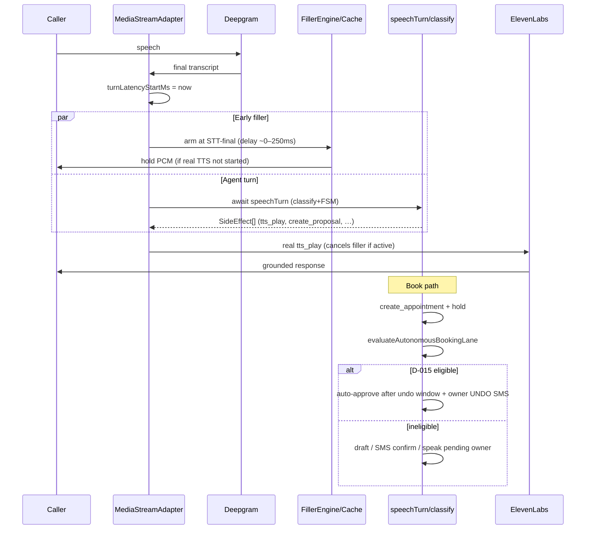

# feat: Voice latency (filler-before-LLM) + in-call book completion

**Created:** 2026-08-03  
**Depth:** Standard  
**Status:** plan

## Summary

Make live Media Streams calls feel responsive by arming filler audio at STT-final (before the LLM `speechTurn`), then make the inbound book path complete a confirmed appointment for ordinary shops without waiting for an owner mid-call — using the existing D-015 autonomous booking lane and slot-hold machinery, not a new runtime. Together these close the two highest-leverage gaps between “voice is speakable” and “Mike keeps driving while the AI books.”

## Problem Frame

**Who:** Owner-operators and their callers on Rivet’s Twilio + Deepgram + ElevenLabs path.

**Latency:** End-of-speech → first agent audio is typically ~1.5–2.9s because `mediastream-adapter` awaits full `speechTurn` (classify + FSM) before `runTurnWithFiller`. Filler only masks TTS TTFB, not the LLM gap. Callers hang up or talk over the agent.

**Booking:** Day-in-the-life promises “I offered Thu 2pm or Fri 10am. He picked Thu — confirmed.” D-015 autonomous booking exists (default **OFF**, strict gates, 5s undo + owner one-tap UNDO), and create_appointment holds exist — but for most tenants the caller still leaves with a draft waiting for human approve, not a confirmed slot. Competitive AI receptionists convert on-call; Rivet’s flagship demo still feels soft.

## Requirements

- R1. On Media Streams, first audible agent audio (filler or real TTS) begins within the filler delay after STT-final **without waiting for classify to finish**, when filler engine + cache are configured.
- R2. Filler armed early never counts as recording disclosure / consent audio (existing consent ordering remains fail-closed).
- R3. Barge-in / mid-stream cancel still cancels early-armed filler the same way as post-speechTurn filler.
- R4. Turn-latency metrics (`turnLatencyStartMs` / TTFA) remain correct and preferably improve (first-audio earlier than speechTurn end).
- R5. Inbound receptionist path can complete a **confirmed** appointment when D-015 gates pass (hold + confidence + customer + hours + no flags), with owner UNDO SMS — without loosening money/comms/irreversible auto-approve.
- R6. When D-015 is OFF or ineligible, the caller still gets a clear spoken outcome (slot held pending owner / SMS confirm path), never a silent drop.
- R7. New tenants (or onboarding) can opt into autonomous booking with a single explicit setting; product path documents how a shop becomes “book-on-call.”
- R8. Automated tests prove R1–R6; path-smoke/graph inventory already maps `book` — extend if booking completion semantics change.

## Key Technical Decisions

- **Arm filler at STT-final, cancel when real TTS starts** — Minimal change to `MediaStreamAdapter.onTranscriptEvent`: stamp `turnLatencyStartMs`, start filler timer (or immediate hold clip) in parallel with `await speechTurn`, then let existing `runTurnWithFiller` / barge-in cancel semantics own preemption. (Alternatives: speculative classify on interim — higher risk, deferred; stream LLM tokens — larger rewrite, deferred.)
- **Do not change D-015 gate math** — Book completion uses existing `evaluateAutonomousBookingLane` + hold + 5s undo + one-tap UNDO. No widening to money/comms. (Rejected: global auto-approve or treating supervisorPresent=true.)
- **Default-OFF stays for autonomous booking; improve reachability** — Default ON would change trust posture for all existing tenants. Plan: (a) ensure eligible path is actually wired on inbound FSM end-to-end, (b) onboarding/settings UX so opt-in is one toggle, (c) optional “new tenant trial default ON” only if product signs off in Open Questions. (Rejected: silent default-ON for all tenants without opt-in UI.)
- **Gather path out of R1** — Gather uses Twilio Polly and has no ElevenLabs filler path; latency work is Media Streams first. Gather still benefits from booking completion (shared FSM/task).
- **Canonical booking proof is Twilio FSM, not VAPI** — Per `docs/solutions/architecture-patterns/voice-appointment-paths-vapi-vs-twilio-gather.md`.

## Scope Boundaries

**In scope:**

- Media Streams early filler arming + tests + metric behavior
- End-to-end inbound book completion through D-015 / hold / spoken confirm
- Settings/onboarding surface for autonomous booking opt-in clarity
- Tests (unit + existing integration appointment proof extended if needed)

**Non-goals:**

- Speculative interim classify / streaming classifier responses
- VAPI booking chain
- Autonomous close (D-018) or post-quote “yes book it” (already WS18 — only touch if book path shares bugs)
- Redis multi-replica voice session store
- Spanish money surfaces, filler latency on Gather
- Changing auto-approve for money/comms/irreversible

### Deferred to follow-up work

- Speculative classification on stable interims
- Tuning Deepgram `endpointingMs` (separate experiment; interacts with R1)
- Full TTFA SLO dashboard / PostHog cohort proof of conversion lift

## Repository invariants touched

| Invariant | How this plan honors it |
|-----------|-------------------------|
| Integer cents | Unchanged; booking has no money payload |
| tenant_id + RLS | Existing appointment/proposal tables only |
| Audit events | Autonomous lane stamps `sourceContext.autonomousLaneEvaluation`; UNDO already audited |
| LLM gateway | Classify still only via gateway; filler is non-LLM PCM |
| Zod proposals | `create_appointment` / `create_booking` contracts unchanged |
| Catalog resolver | N/A for pure book |
| Entity resolver | Ambiguity still blocks D-015 (`pendingReferenceCount`) |
| Human-approval gate | D-015 is the existing scoped exception; money/comms remain human-approved |

## High-Level Technical Design

## Implementation Units

### U1. Early filler arm at STT-final (Media Streams)

- **Goal:** First audio can play before classify finishes when filler is configured.
- **Requirements:** R1, R2, R3, R4
- **Dependencies:** none
- **Files:**
  - `packages/api/src/telephony/media-streams/mediastream-adapter.ts` (modify — `onTranscriptEvent` / filler arming vs `runTurnWithFiller`)
  - `packages/api/src/ai/agents/customer-calling/filler-engine.ts` (read; touch only if selection API needs “thinking” context)
  - `packages/api/test/telephony/media-streams/mediastream-adapter.test.ts` (extend)
  - Optional small helper extract: `packages/api/src/telephony/media-streams/early-filler.ts` if adapter method growth warrants it
- **Approach:**
  1. At STT-final (where `turnLatencyStartMs` is set), if `fillerEngine` + `fillerCache` present, start the same delay/cancel machinery used by `runTurnWithFiller` **before** `await speechTurn`.
  2. When `emitSideEffects` / real TTS starts, cancel early filler (existing `cancelActiveFiller` / turnId bump).
  3. If `speechTurn` throws, recovery path must not double-play conflicting fillers; reuse VOX-35c recovery.
  4. Consent: early filler must set `fillerActive` so disclosure/consent gates treat it as non-disclosure (mirror integration consent tests).
  5. Avoid arming filler when session is already escalating/terminated or agent already speaking.
- **Patterns to follow:** Existing `runTurnWithFiller` (lines ~2522+), consent-ordering tests in `packages/api/test/integration/conversation-consent-ordering.test.ts`, barge-in clear path.
- **Test scenarios:**
  - Happy path: speechTurn delayed > fillerDelayMs → filler PCM frames emitted before speechTurn resolves; real TTS cancels filler.
  - Edge: speechTurn faster than delay → no filler (or cancelled before play); no double audio.
  - Edge: barge-in during early filler → clear + no residual filler frames.
  - Error: speechTurn throws after filler armed → recovery apology, no stuck fillerActive.
  - Consent: early-filler-only mark must not open capture / satisfy disclosure (align with Path 3c filler-only recovery).
- **Verification:** Unit tests green; a delayed-speechTurn harness shows first outbound media before speechTurn promise settles.

### U2. Latency observability for early filler

- **Goal:** Prove R1 in metrics without relying on ear tests alone.
- **Requirements:** R4
- **Dependencies:** U1
- **Files:**
  - `packages/api/src/telephony/media-streams/mediastream-adapter.ts` (emit first-audio vs speechTurn-end timestamps if not already sufficient)
  - `packages/api/src/ai/voice-quality/events.ts` / audio timing helpers if TTFA events need a `filler_early` source tag
  - `packages/api/test/telephony/media-streams/mediastream-adapter.test.ts` or `packages/api/test/ai/voice-quality/*` timing test
- **Approach:** Tag first `audio_frame_emitted` / TTFA with whether source was early filler vs real TTS. Keep `voice_turn_latency_ms` histogram meaningful (document: first audible vs first real answer may differ).
- **Patterns to follow:** WS26 `turnLatencyStartMs`, VQ2-004 TTFA events.
- **Test scenarios:**
  - Happy: with early filler, time-to-first-frame < speechTurn duration in fake timers.
  - Happy: without filler deps, behavior equals pre-U1 (no regression).
- **Verification:** Test asserts ordering/timing invariant with fake timers; no production dashboard required.

### U3. Inbound book path: wire-through audit + spoken completion

- **Goal:** Create_appointment on inbound FSM always produces hold + spoken next step; D-015 eligible proposals complete without mid-call owner tap.
- **Requirements:** R5, R6
- **Dependencies:** none (can parallel U1)
- **Files:**
  - `packages/api/src/ai/tasks/create-appointment-task.ts`
  - `packages/api/src/ai/scheduling/place-hold.ts`
  - `packages/api/src/proposals/autonomous-lane.ts` (read; only change if a pure bug blocks eligibility incorrectly)
  - `packages/api/src/ai/voice-turn/create-voice-turn-processor.ts` / proposal create path for autonomousLane input threading
  - `packages/api/src/proposals/proposal.ts` (`decideInitialStatus` / autonomousLane input)
  - `packages/api/test/proposals/autonomous-lane.test.ts` (extend if gate stamps change)
  - `packages/api/test/integration/voice-inbound-appointment.test.ts` (extend — real columns)
  - Possibly `packages/api/test/ai/tasks/create-appointment*.test.ts` if present
- **Approach:**
  1. Trace inbound create_appointment from FSM `create_proposal` → task handler → hold → `evaluateAutonomousBookingLane` inputs. Fix any missing wiring (e.g. `inboundReceptionistSource`, `holdPlaced`, business hours, confidence meta).
  2. Eligible path: customer hears confirmed time; owner gets UNDO SMS (existing).
  3. Ineligible path: speak honest “I’ve reserved that for you pending confirmation / owner will confirm” — no silent drop; proposal remains draft with audit reason stamp.
  4. Do **not** change AUTONOMOUS_LANE_PROPOSAL_TYPES or action classes.
- **Patterns to follow:** `docs/decisions.md` D-015; `docs/solutions/architecture-patterns/voice-appointment-paths-vapi-vs-twilio-gather.md`; `packages/api/src/proposals/one-tap-undo.ts`.
- **Test scenarios:**
  - Happy: all D-015 inputs pass → eligible true + stamp on sourceContext; initial status auto-approve path (existing undo window).
  - Edge: missing hold → not eligible, reason `hold_*` (existing reasons); spoken draft path.
  - Edge: negotiation/emergency/vulnerability flag → not eligible.
  - Error: hold placement fails soft → no throw; ineligible with auditable reason.
  - Integration: Docker-gated inbound appointment test proves row + audit for create path (extend existing file rather than mock-only).
- **Verification:** Integration + unit gates green; eligible fixture books without owner approve proposal status stuck in draft solely due to wiring bugs.

### U4. Opt-in surface for “book on the phone”

- **Goal:** Shops can turn on D-015 without hunting; product path for “default happy path” is explicit opt-in (or documented trial default if product chooses).
- **Requirements:** R7
- **Dependencies:** U3
- **Files:**
  - `packages/api/src/settings/settings.ts` / routes for tenant settings (autonomousBookingEnabled already exists)
  - `packages/web` settings UI if a toggle is missing — locate existing voice/AI settings page under `packages/web/src/`
  - `docs/strategy/ADMIN_VOICE_COVERAGE.md` or short runbook note under `docs/runbooks/` (operator-facing: how booking on-call works)
  - Tests: settings API contract if new endpoint; otherwise web component test if UI added
- **Approach:**
  1. Confirm API already exposes `autonomousBookingEnabled` / threshold.
  2. If UI missing, add owner-facing toggle with copy: confidence threshold, undo SMS, not money.
  3. Onboarding: optional checkbox “Let Rivet confirm appointments on the call when confident.”
  4. Document: default remains OFF for existing tenants unless product Open Question resolves trial default ON.
- **Patterns to follow:** Existing tenant settings forms; kill switch env `AUTONOMOUS_BOOKING_DISABLED`.
- **Test scenarios:**
  - Happy: PATCH settings enables flag; subsequent evaluation sees `enabled: true`.
  - Edge: platform kill switch still forces `platform_disabled` even when tenant ON.
  - Pure UI: class-contract for toggle if web change (tap target ≥44px if interactive control).
- **Verification:** Owner can enable lane via product surface; tests pin API or UI contract.

### U5. Path-smoke / inventory alignment for book completion

- **Goal:** Graph/path-smoke and admin inventory still describe book as completable; add a case if completion semantics need intent-level proof.
- **Requirements:** R8
- **Dependencies:** U3
- **Files:**
  - `packages/api/src/ai/voice-quality/path-smoke/cases.ts` (book case already exists — ensure utterance remains valid)
  - `packages/api/src/ai/voice-quality/graph/paths.ts` (book path notes)
  - `packages/api/src/ai/voice-quality/admin-tasks/inventory.ts` (book tasks already speakable — update notes if needed)
  - `packages/api/test/voice-quality/path-smoke.test.ts` / `graph-coverage.test.ts` if catalog changes
- **Approach:** Documentation + smoke case only; no second taxonomy. Optional second book turn for “Thursday at 2 works” if multi-turn completion is the product claim.
- **Patterns to follow:** Existing path-smoke case list; keep cost under suite cap.
- **Test scenarios:**
  - Offline: path-smoke catalog still ≤15 turns; graph coverage gate still 100% required.
  - Unit: book path remains pathSmokeRequired.
- **Verification:** `npm run agent:graph-coverage --workspace=packages/api -- --gate` passes; path-smoke unit tests pass.

## Risks & Dependencies

| Risk | Mitigation |
|------|------------|
| Early filler increases barge-in false cancels | Same barge-in rules; don’t lower confidence thresholds in this plan |
| Early filler confuses consent | Explicit test parity with filler-only recovery fail-closed |
| D-015 still rarely eligible after U3 | U4 opt-in + document residual gates; don’t fake eligibility |
| Cassette / prompt hash churn | U1–U2 do not change classifier prompts |
| Latency still >1s after filler | Filler is first-audio only; real answer still LLM-bound — deferred speculative classify |

## Open Questions

1. **Trial default ON for autonomous booking on new tenants?** Product call. Engineering default in this plan: keep OFF, max discoverability via U4.
2. **Filler delay default:** keep 250ms or lower to 0–100ms when arming at STT-final? Implementer can A/B via `fillerDelayMs` dep; recommend 100ms for early-arm path.
3. **Gather-mode latency** follow-up? Out of scope here.

## Sources & Research

- Code: `mediastream-adapter.ts` speechTurn-before-filler order; `autonomous-lane.ts` D-015; `place-hold.ts`; integration `voice-inbound-appointment.test.ts`
- Decisions: `docs/decisions.md` D-015 (+ 2026-07-11 kill switch amendment)
- Solutions: `docs/solutions/architecture-patterns/voice-appointment-paths-vapi-vs-twilio-gather.md`
- Discovery: latency budget T2-F02 (filler placement) — historical; verify against current HEAD during ce-work
- No external research required — solid in-repo patterns
