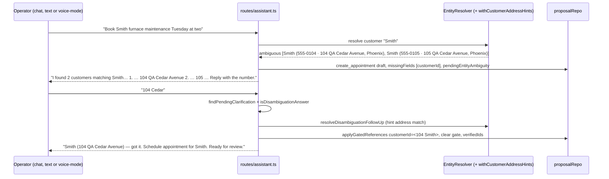

# fix: Chat ambiguous-reference follow-up loop and owner-command parity

**Created:** 2026-09-09
**Depth:** Standard
**Status:** plan
**Register cases pinned:** `book-03`, `inv-05` on surfaces `chat` and `chat-voice` (`fixtures/voice/inapp-50-cases.json`)
**Builds on:** the in-flight chat-surface work on branch `claude/50-cases-orchestration-m7c5yq` (`applyContractGate`, `GatedReferenceOutcome.notFound`, `isImmediateRepeat` / `findReplaceableDraft` in `packages/api/src/routes/assistant.ts`) — do not re-implement those; this plan closes what they leave open.

## Summary

On the assistant chat route an operator request that names an ambiguous customer ("Book Smith furnace maintenance Tuesday at two" with two Smiths on file; "Text Smith the invoice link") must ask ONE which-one question and complete the ORIGINAL proposal from the next turn's answer ("104 Cedar"). The pending-question mechanism already exists on chat (`sourceContext.pendingEntityAmbiguity` on the gated draft, recalled by `findPendingClarification` → `applyDisambiguationAnswer`, matched by the voice matcher `resolveDisambiguationFollowUp`). Two things stop it from working against real Postgres: chat candidates carry **phone-only hints** (no address), so the question never shows "104 Cedar" and the answer cannot match; and chat never sets `ownerSession` on the classify context, so the deterministic owner-command matchers that voice enjoys never fire on chat. This plan adds a shared customer-address hint enrichment applied on both in-app surfaces through one decorator, makes the hermetic harness production-shaped so it can no longer pass by fixture accident, and wires owner-session parity.

## Problem Frame

The web assistant page sends typed input and mic transcripts (`inputMode: 'voice'`) to `POST /api/assistant/chat`; the live-voice panel uses `POST /api/voice/sessions`. The 50-case register runs on all three surfaces and is green on the voice session (50/50) but two chat cases fail identically in both input modes. Both are the same defect class: an ambiguous customer name. Today chat either mints a `voice_clarification` card (a dead end for a drafting flow that discards the extracted day/time/job) or drafts the real type without `customerId` and asks a question the next turn cannot answer. The operator loses the request and has to restate it.

Who it affects: every operator who has two customers with the same surname (a normal state for a service business) and uses the chat panel or the mic button.

## Requirements

- R1. On `POST /api/assistant/chat`, an ambiguous customer/job/technician reference on a mutation turn asks ONE which-one question in the reply, listing each candidate with a distinguishing hint (address for customers), and persists a gated draft of the REAL proposal type — never a `voice_clarification` card.
- R2. The next turn's answer ("104 Cedar", "the second one", a phone fragment, a fuller name) resolves the candidate and completes that draft (verified id written, gate cleared, `verifiedIds` stamped) so the card is approvable; bounded by `MAX_DISAMBIGUATION_ATTEMPTS`.
- R3. Identical behaviour for `inputMode: 'text'` and `inputMode: 'voice'`.
- R4. The address hint reaches the question and the matcher on BOTH in-app surfaces (voice session and chat) from one shared implementation; the hermetic harness proves it with production-shaped (phone-only) resolver output rather than a pre-enriched fixture.
- R5. An owner on chat gets the same deterministic owner-command classification the voice session gives an owner (`matchOwnerOperatorCommand`), keyed on the DB-authoritative role, never on `extendedIntents`.
- R6. Register cases `book-03` and `inv-05` pass on `voice`, `chat`, `chat-voice` with NO per-surface `chat` override added for them; gate stays 50/50 on every surface. Telephony and recorded-memo paths are untouched.

## Key Technical Decisions

- **Keep the pending question on the gated draft's `sourceContext` (`pendingEntityAmbiguity`)** — it is already committed, tenant- and conversation-scoped, filtered to reviewable statuses on recall, and needs no new store. (Alternative: a conversation-scoped pending record — rejected: duplicates persistence, adds a second place to go stale when the card is approved from the UI.)
- **Enrich customer candidate hints with the service address through ONE `EntityResolver` decorator, applied at composition time on both in-app surfaces** — `withCustomerAddressHints(resolver, locationRepo)` in a new `packages/api/src/ai/resolution/customer-address-hint.ts`, wired in `createAssistantRouter` and in the in-app voice adapter (replacing its private pool-backed `enrichCandidatesForDisambiguation`). Every call site that reads `deps.entityResolver` (pre-draft `resolveVerifiedIdsForDraft`, post-draft `resolveGatedReferencesForChat`, the answer turn's re-resolve fallback) gets it for free. (Alternative: enrich inside `gated-reference-resolution.ts` — rejected: that module is mid-change on the branch and is the shared core; the hint is a surface concern. Alternative: leave voice's raw-SQL enrichment and add a chat-only copy — rejected: two implementations of the `"phone · street, city"` shape that `hintAddressPortion` parses would drift.)
- **The `' · '` separator is load-bearing** — `matchDisambiguationFollowUp`'s `hintAddressPortion` splits on it and only uses the segments after the first; the pure `mergeHint(existing, address)` helper owns that format so both surfaces cannot diverge.
- **Owner-session parity keyed on `callerRole === 'owner'`** (already threaded into `generateAssistantReply` as the DB-authoritative role) added to the single `classifyContext` literal, which both the single-intent and chain-segment classify calls reuse. (Alternative: key on `extendedIntents` — rejected: it is unconditionally true for every chat caller and would turn owner commands on for technicians.)
- **Make the harness fixture resolver production-shaped** — `FixtureEntityResolver.resolveCustomer` returns `hint: primaryPhone` only, like `PgEntityResolver`; the seeded `InMemoryLocationRepository` feeds the decorator on both surfaces. A green register then proves the shipped enrichment, not the fixture. (This is the CLAUDE.md "a fixture arranged to pass proves nothing" rule applied to the harness itself.)
- **Reuse the voice matcher unchanged** (`resolveDisambiguationFollowUp`, `MAX_DISAMBIGUATION_ATTEMPTS`) — it never returns an id outside the offered candidate set and is cassette-pinned.

## Scope Boundaries

**In scope:** customer address hint enrichment (both in-app surfaces), owner-session classify parity on chat, harness fixture realism, tests, register verification on all three surfaces.

**Non-goals:** a tap-to-pick candidate control in the chat panel (`AIProposalCard`) — the Inbox picker for `voice_clarification` cards stays as is; telephony / recorded-memo ambiguity handling (they mint `voice_clarification` with `entityCandidates` by design); read-only lookup ambiguity recall (the `ambiguousReply` one-shot in `lookup-dispatch.ts` has no next-turn state — see deferred).

### Deferred to follow-up work
- Lookup which-one recall on chat: `dispatchAssistantLookup` answers an ambiguous name with a one-shot question and forgets it; a follow-up needs proposal-adjacent or conversation-scoped pending state because no card exists to carry it.
- Candidate picker on the chat card so the question can be answered by tap as well as text.
- Job / technician / lead candidates could carry richer hints (job title + customer; technician role) the same way — same decorator, more kinds.

## Repository invariants touched

- **Entity resolver / never a silent guess** — ambiguity always becomes ONE question; the answer is matched against the offered candidate set only (`resolveDisambiguationFollowUp` intersects), never a fresh guess.
- **Human-approval gate** — completing the draft writes the id and clears the gate; status is untouched, the operator still taps approve.
- **Tenant isolation / RLS** — `LocationRepository.findByCustomer(tenantId, customerId)` re-asserts the tenant for every candidate id; the enrichment only changes display/matching text, never which id may be written (`applyGatedReferences`'s "known gated field AND currently gated" guard stays the write boundary).
- **LLM gateway** — no new AI calls; owner-command parity removes an LLM call for the matched phrasings.
- Money / catalog resolver — untouched.

## High-Level Technical Design

## Implementation Units

### U1. Shared customer-address hint helper + resolver decorator
- **Goal:** One production implementation of the `"phone · street1, city"` candidate hint, usable by any surface that holds a `LocationRepository`.
- **Requirements:** R1, R4
- **Dependencies:** none
- **Files:**
  - `packages/api/src/ai/resolution/customer-address-hint.ts` (create): `mergeHint(existing, address)` (pure; `' · '` join, empty parts dropped, never doubles an address already present) and `withCustomerAddressHints(resolver, locationRepo): EntityResolver` (decorates `resolve`; only for `kind: 'customer'` and result kinds `ambiguous` / `low_confidence`; looks up each candidate's location via `locationRepo.findByCustomer(tenantId, id)` preferring primary, non-archived; returns NEW candidate objects; failure-soft — a throwing or empty lookup leaves the original hint).
  - `packages/api/test/ai/resolution/customer-address-hint.test.ts` (create)
- **Approach:** Read the exact string shape from `packages/api/src/ai/agents/customer-calling/inapp-adapter.ts` `enrichCandidatesForDisambiguation` (~line 1038) and from `matchDisambiguationFollowUp` / `hintAddressPortion` in `packages/api/src/ai/agents/customer-calling/entity-resolution.ts` so the parser and the producer agree by construction. Decorator wraps, never mutates, the underlying resolver; `resolved` / `not_found` / `skipped` and non-customer kinds pass through untouched. Bound the per-call lookups to the candidate cap the resolver already applies.
- **Patterns to follow:** `packages/api/src/ai/resolution/alias-first-entity-resolver.ts` (an `EntityResolver` decorator), `packages/api/src/ai/orchestration/lookup-reference.ts` `ambiguousReferenceLine` (hint rendering just landed).
- **Test scenarios:**
  - Happy path: ambiguous customer result with phone-only hints + two seeded locations → hints become `"555-0104 · 104 QA Cedar Avenue, Phoenix"` and `"555-0105 · 105 …"`; `matchDisambiguationFollowUp('104 Cedar', pending)` on those candidates resolves the first.
  - Edge: candidate with no location → hint unchanged; candidate with archived-only location → unchanged; existing hint already containing the address → not duplicated; `low_confidence` single candidate enriched too.
  - Error: `findByCustomer` throws → original result returned unchanged, no throw.
  - Pass-through: `kind: 'job'` ambiguous, `resolved`, `not_found`, `skipped` → byte-identical results, underlying resolver called once.
- **Verification:** unit suite green; `mergeHint` output parses back through `hintAddressPortion`.

### U2. Wire the decorator into the chat surface
- **Goal:** Chat questions show addresses and address answers match, with no per-call-site changes.
- **Requirements:** R1, R2, R3
- **Dependencies:** U1
- **Files:**
  - `packages/api/src/routes/assistant.ts` (modify: in `createAssistantRouter`, when `deps.locationRepo` and `deps.entityResolver` are both present, substitute a shallow-copied `deps` whose `entityResolver` is `withCustomerAddressHints(...)`; nothing else changes)
  - `packages/api/src/app.ts` (verify `locationRepo` is already passed to the assistant router — it is wired for the bookability check; add it if the audit shows otherwise)
  - `packages/api/test/routes/assistant-disambiguation-address-hint.test.ts` (create)
- **Approach:** Keep `resolveVerifiedIdsForDraft`, `resolveGatedReferencesForChat` and `applyDisambiguationAnswer` reading `deps.entityResolver` as today. The test's resolver stub MUST return phone-only hints (mirroring `PgEntityResolver.resolveCustomer`, `packages/api/src/ai/resolution/pg-entity-resolver.ts` ~line 619) — deliberately not the harness fixture's pre-enriched shape.
- **Patterns to follow:** `packages/api/test/routes/assistant-entity-resolution.test.ts` "#909 — an ambiguous reference asks one question and the next turn answers it" (lead case) and `packages/api/test/routes/assistant-chat-parity.test.ts` `buildApp` / resolver stubs.
- **Test scenarios:**
  - Happy path (`book-03` shape): two Smiths → reply is one numbered question containing both street addresses; persisted proposal is `create_appointment`, `missingFields: ['customerId']`, `pendingEntityAmbiguity` stamped; NO `voice_clarification` row. Turn 2 "104 Cedar" → the same proposal now has the 104 Smith's `customerId`, empty `missingFields`, `verifiedIds.customerId`; reply names the pick and the card title; approve succeeds through `approveProposal`.
  - Happy path (`inv-05` shape): "Text Smith the invoice link" → `send_invoice` draft gated on `customerId` (and `invoiceId` if unresolved) → "104 Cedar" fills `customerId`; a second gate, if any, is asked next — not silently dropped.
  - Same two flows with `inputMode: 'voice'` → identical rows and replies.
  - Edge: answer "the second one" (ordinal) and a phone fragment "0105" both resolve; an answer matching neither → re-ask with `attemptCount` 1; third miss → gate stays, turn falls through to ordinary classification (existing bound).
  - Edge: operator answers, then repeats the original booking sentence verbatim → exactly one proposal (interaction with the in-flight `isImmediateRepeat` / `findReplaceableDraft`); approve from the card UI first, then an unrelated chat message → `findPendingClarification` ignores the decided proposal.
  - Error: `locationRepo` absent (in-memory boot without one) → behaviour identical to today (phone-only question), no throw.
- **Verification:** the two flows pass with the phone-only stub; the existing lead-case suite stays green.

### U3. Apply the same decorator to the in-app voice session; delete the private pool-backed enrichment
- **Goal:** One enrichment path for both in-app surfaces; no raw SQL copy left in the adapter.
- **Requirements:** R4
- **Dependencies:** U1
- **Files:**
  - `packages/api/src/ai/agents/customer-calling/inapp-adapter.ts` (modify: `InAppAdapterDeps` gains `locationRepo?: LocationRepository`; `getEntityResolver()` wraps the resolver with `withCustomerAddressHints` when a `locationRepo` is present; remove `enrichCandidatesForDisambiguation` and the pool query it carried — re-grep for other callers first)
  - `packages/api/src/app.ts` (modify: pass `locationRepo` to the in-app adapter)
  - `packages/api/test/ai/agents/customer-calling/inapp-entity-resolution-safety.test.ts`, `packages/api/test/ai/agents/customer-calling/inapp-adapter.test.ts` (modify the ambiguity tests to seed an `InMemoryLocationRepository` instead of a mocked pool)
- **Approach:** The FSM's `entity_ambiguous` question and `resolveDisambiguationFollowUp` already consume `candidate.hint`; the decorator feeds the same shape the removed method produced. Telephony (`create-voice-turn-processor.ts`) does not use this method — confirm by grep before deleting.
- **Patterns to follow:** U1's decorator; the existing `getEntityResolver()` self-construction from `pool`.
- **Test scenarios:**
  - Happy path: two Smiths via a phone-only mock resolver + seeded locations → spoken disambiguation names both addresses; "104 Cedar" → `entity_resolved` with the 104 id → readback → "yes" → proposal with that `customerId`.
  - Edge: no `locationRepo` → phone-only question (today's behaviour with no pool).
  - Integration (Docker): `packages/api/test/integration/customer-address-hint.integration.test.ts` (create) — seed two customers with locations through the real repos, run `withCustomerAddressHints(new PgEntityResolver(pool), new PgLocationRepository(pool))` and pin the real `service_locations` columns the hint reads (`street1`, `city`, `is_primary`, `archived_at`/deleted marker — whichever the schema carries).
- **Verification:** `voice-reschedule` / `voice-cancel` / `inapp-clarification-contract` suites green; no `enrichCandidatesForDisambiguation` references remain.

### U4. Harness realism: production-shaped fixture resolver on every surface
- **Goal:** The register can only go green if the shipped enrichment works on the surface under test.
- **Requirements:** R4, R6
- **Dependencies:** U2, U3
- **Files:**
  - `packages/api/src/ai/voice-quality/inapp-50/world.ts` (modify: `FixtureEntityResolver.resolveCustomer` returns `hint: primaryPhone` only; seed an `InMemoryLocationRepository` from the fixture catalog's `locations`; expose it on the world and pass it to BOTH the voice adapter (`locationRepo`) and the chat router deps)
  - `packages/api/src/ai/voice-quality/inapp-50/chat-driver.ts`, `runner.ts` (modify: wire `locationRepo`)
  - `packages/api/test/ai/voice-quality/inapp-50/score.test.ts` (extend if the which-one detection regex in the chat driver needs the address form)
- **Approach:** Remove the "mirrors what production hands the matcher" comment and the pre-baked `"phone · street, city"` shape from the fixture resolver — that shape now comes from the decorator. If `book-03` / `inv-05` regress on any surface after this change, the regression is real and belongs in U2/U3, not in the fixture.
- **Patterns to follow:** the world's existing repo seeding; `docs/solutions/test-failures/a-fixture-arranged-to-pass-proves-nothing.md`.
- **Test scenarios:**
  - `npx tsx packages/api/scripts/run-inapp-50.ts --only book-03,inv-05` → PASS on `voice`, `chat`, `chat-voice` with `requireClarificationTurn` satisfied and `payloadContains.customerId` = the 104 Smith.
  - Full run → 50/50 on all three surfaces; `fixtures/voice/inapp-50-cases.json` carries no new `chat` override for these two keys.
- **Verification:** `npx vitest run test/voice/inapp-50-register.test.ts` green; a run artifact written with `--write`.

### U5. Owner-command parity on chat
- **Goal:** An owner typing or dictating a canonical owner command gets the deterministic classification the voice session already gives.
- **Requirements:** R5, R6
- **Dependencies:** none (independent of U1–U4; sequence last so the register audit sees the final entity path)
- **Files:**
  - `packages/api/src/routes/assistant.ts` (modify: `ownerSession: callerRole === 'owner'` on the single `classifyContext` literal in `generateAssistantReply`)
  - `packages/api/test/routes/assistant-owner-command-parity.test.ts` (create)
  - `fixtures/voice/inapp-50-cases.json` (verify only — see audit)
- **Approach:** `matchOwnerOperatorCommand` (`packages/api/src/ai/orchestration/intent-classifier.ts` ~line 1421) is gated on `context.ownerSession === true` alone. The five register utterances that match its patterns (`est-01`, `inv-05`, `cust-01`, `cust-03`, `job-01`) will now short-circuit the LLM on chat exactly as on voice: audit each pattern's `extract()` output against the register's scripted entities and the case's `expect`; `inv-05` loses `sendChannel` from the deterministic extract — confirm the send handler defaults to `sms` (it does on the voice surface today) rather than editing the register. If any pattern's extraction is poorer than the scripted LLM entities, fix the pattern's `extract()`, not the register.
- **Patterns to follow:** the in-app adapter's `ownerSession = role === 'owner'` at `startSession`; `packages/api/test/ai/orchestration/intent-classifier.test.ts` owner-command table.
- **Test scenarios:**
  - Happy path: owner chat turn "New customer Elena Ruiz, phone 480-555-7711" → `create_customer` card with name + phone and the gateway's `complete` never called; the same text from a technician → gateway called once.
  - Edge: an owner turn that matches no pattern → gateway called exactly once (no double classification).
  - Register: `--only est-01,inv-05,cust-01,cust-03,job-01 --surface chat,chat-voice` all PASS.
- **Verification:** assistant route suites green; register 50/50 on all surfaces; `npx tsc --project packages/api/tsconfig.build.json --noEmit` clean.

## Risks & Dependencies
- **In-flight branch edits** — `routes/assistant.ts` and `gated-reference-resolution.ts` are being changed on this branch; land this plan after those commit, and rebase U2 onto the committed `applyContractGate` / `notFound` shape.
- **Cassette-pinned classifier** — U5 changes only the classify CONTEXT for chat, not the prompt; no cassette refresh expected. If a prompt-hash-bearing string is touched by mistake, follow `docs/solutions/workflow-issues/adding-a-voice-intent-requires-four-coordinated-updates.md`.
- **Adapter surgery (U3)** — deleting the pool-backed enrichment touches a 3,000-line file with FSM pins; keep the change to `getEntityResolver()` and the deleted method, and run the whole `test/ai/agents/customer-calling` directory.
- **False confidence** — until U4 lands, a green chat register for `book-03` / `inv-05` is fixture luck, not proof; U2's phone-only stub test is the real pin.

## Open Questions (deferred to implementation)
- Whether `LocationRepository.findByCustomer` returns archived rows and how "primary" is flagged in the current schema (read `packages/api/src/locations/*` when writing U1).
- Whether the chat-driver's which-one detection regex (`chat-driver.ts` `asksGatedQuestion`) needs the address form or already matches on "Which one?".
- Exact reply copy for the completed turn — keep the in-flight `"<pick> — got it. <title>. <status>"` unless review prefers otherwise.
