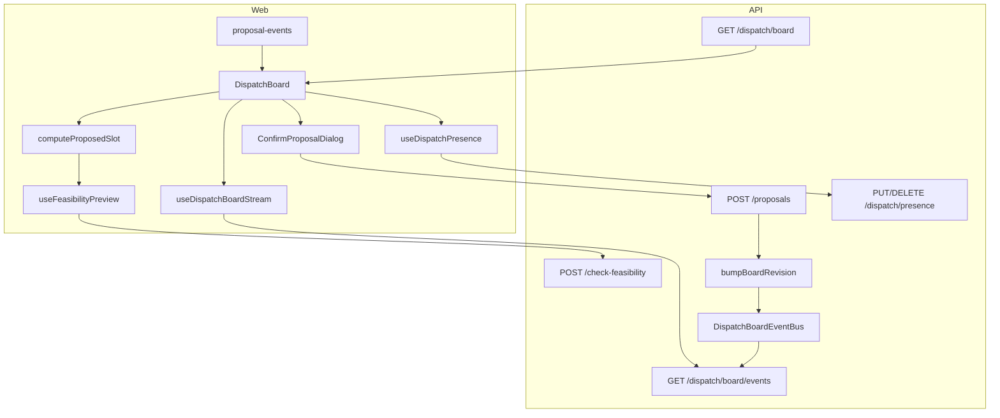

# Dispatch Board — Dispatcher-Grade Design Spec

**Date:** 2026-05-20  
**Status:** Approved (brainstorming)  
**Scope:** Waves A–C — slot-aware drag-and-drop, live board sync, dispatcher presence. Builds on shipped dispatch feasibility (`2026-05-17-dispatch-feasibility-design.md`).

---

## 1. Problem

The dispatch board correctly uses **proposals** instead of silent mutation, and server-side **feasibility** + **If-Match** are live. Dispatchers still report poor follow-through:

| Pain | Root cause |
|------|------------|
| Drag feels useless | Same-lane drop creates a reschedule with **unchanged** times; no insert-between-slots |
| Can't reorder a tech's day | P6-020 ↑/↓ UI exists but `DispatchBoard` does not wire `onReorderWithinLane` |
| Board stale after approve | Refetch only on tab focus (P6-027), not when inbox approves in the same session |
| Conflicts easy to miss | Per-card badges only; Schedule page has a day-level banner |
| Two dispatchers collide | No live updates or "who is editing" hints |
| Confirm dialog is thin | Feasibility visible on lane colors during drag only |

---

## 2. Goals & non-goals

### Goals

- **Wave A:** Slot-aware drops with computed times, within-lane reorder, rich confirm dialog, conflict banner, cross-route refresh events.
- **Wave B:** `boardRevision` token + SSE `board_updated` + polling fallback; revision bump on scheduling mutations.
- **Wave C:** Presence heartbeats + soft-lock UX ("Alex is moving this job"); presence on SSE + board payload.

### Non-goals

- Hard pessimistic locks (block drag when another user is editing).
- Cascade reschedule (auto-bump all neighbors when one card moves).
- Technician skill data model.
- Week view / map / route optimization UI.
- Tenant-level travel-time overrides.

### Invariants (unchanged)

- All schedule writes go through **proposals** + human approval (or existing auto-approve rules).
- Money in integer cents; tenant isolation; `If-Match` on `appointment.updatedAt`.
- Creation- and execution-time feasibility use the same `checkFeasibility` composer.

---

## 3. Architecture overview



---

## 4. Wave A — Slot insertion & drag loop

### 4.1 Drop targets

Each `TechnicianLane` renders **gap drop zones** between sorted appointment cards plus leading/trailing gaps:

- `data-drop-index={0}` — before first card  
- `data-drop-index={i}` — after card `i-1` / before card `i`  
- `data-drop-index={n}` — after last card (`n = appointments.length`)

`DispatchBoard` tracks `dropTarget: { technicianId, insertIndex }` during drag-over (not just `technicianId`).

### 4.2 `computeProposedSlot()` (web, pure)

**File:** `packages/web/src/components/dispatch/compute-proposed-slot.ts`

**Inputs:** `sortedAppointments` (excluding dragged id), `insertIndex`, `dragged` `{ scheduledStart, scheduledEnd }`, `workingHours?: { start, end }`.

**Duration:** `D = end - start` (ms), preserved.

| Case | Start | End |
|------|-------|-----|
| Empty lane | `workingHours.start` or 08:00 local | start + D |
| Insert index 0, `first.start - dayStart >= D` | `start = first.start - D` | start + D |
| Insert index 0, gap too small | — | `overflow` |
| Insert between A and B | If `B.start - A.end >= D`: `start = A.end` | start + D |
| Insert after last | `start = last.end` | start + D |

**Returns:**

```typescript
type SlotPlacement = 'gap' | 'tight' | 'overflow';

interface ProposedSlot {
  proposedScheduledStart: string; // ISO
  proposedScheduledEnd: string;
  placement: SlotPlacement;
}
```

- `gap`: fits in available window without overlapping neighbors.  
- `tight`: fits but may trigger travel-time warnings.  
- `overflow`: no contiguous window ≥ D → confirm dialog **requires manual time edit**.

### 4.3 Drop → proposal mapping

| Action | `proposalType` | Times |
|--------|----------------|-------|
| Queue → lane @ index | `reassign_appointment` | `computeProposedSlot` |
| Lane → other lane @ index | `reassign_appointment` | `computeProposedSlot` |
| Lane → same lane, **different** index | `reschedule_appointment` | `computeProposedSlot` |
| Lane → same index | No-op | Toast: use ↑/↓ or another lane |
| Lane → unassigned | `cancel_appointment` | unchanged |
| ↑/↓ reorder | `reschedule_appointment` | **Swap** `scheduledStart`/`scheduledEnd` with immediate neighbor |

### 4.4 Confirm dialog

**Extend** `ConfirmProposalDialog`:

- Props: `feasibility: FeasibilityResult | null`, `timeRange?: { from: string; to: string }`, `presenceWarning?: string`, `allowTimeEdit?: boolean`, `onTimeChange?`.
- Render `ConflictDisplay` when feasibility present.
- Confirm disabled when `blocking.length > 0`.
- Warnings: require acknowledge button (reuse `ConflictDisplay` pattern).
- `overflow` / `allowTimeEdit`: datetime-local or time inputs (tenant TZ); debounced re-preview via `useFeasibilityPreview`.

### 4.5 Conflict banner

Below board title when `conflictIds.size > 0`:

> ⚠ {n} scheduling conflict(s) on this day

Reuse existing client-side overlap set (technician lanes only).

### 4.6 Cross-route events

**File:** `packages/web/src/lib/proposal-events.ts`

```typescript
export const PROPOSALS_CHANGED = 'serviceos:proposals-changed';
export function emitProposalsChanged(): void {
  window.dispatchEvent(new CustomEvent(PROPOSALS_CHANGED));
}
```

Emit from: `InboxPage` (approve/reject), `DispatchBoard` (successful proposal create).  
Subscribe in `DispatchBoard` → `refetch()`.

---

## 5. Wave B — Live board sync

### 5.1 Board revision

**Response extension** (`DispatchBoardData`):

```typescript
boardRevision: string; // UUID v4 per bump
```

**Module:** `packages/api/src/dispatch/board-revision.ts`

- `bumpDispatchBoardRevision(tenantId: string, date: string): string`  
- Storage: in-memory `Map<tenantId:date, revision>`; optional Redis `SET` when `REDIS_URL` configured for multi-instance.

**Call sites:**

- `RescheduleAppointmentExecutionHandler` after successful write  
- `ReassignAppointmentExecutionHandler` after successful write  
- Cancel-assignment execution handler (if applicable)  
- Any direct appointment update affecting board date (grep at implementation time)

### 5.2 SSE endpoint

**`GET /api/dispatch/board/events?date=YYYY-MM-DD`**

- Auth: `requireAuth`, `requireTenant`  
- Content-Type: `text/event-stream`  
- Heartbeat: `: hb\n\n` every 25s (match escalations route)  
- Events:
  - `board_updated` → `{ date, boardRevision }`  
  - `presence_updated` → `{ date }` (Wave C)

**Bus:** `packages/api/src/dispatch/board-event-bus.ts`

- `subscribe(tenantId, date, listener): unsubscribe`  
- `publishBoardUpdated(tenantId, date, boardRevision)`  
- Redis: `PUBLISH dispatch:{tenantId}:{date}` when configured; each instance forwards to local SSE clients.

### 5.3 Web hook

**`useDispatchBoardStream(date)`** — mirror `useEscalationStream.ts`:

- Fetch SSE with Clerk bearer token  
- On `board_updated`, if `revision !== lastSeen`, call `onBoardStale()`  
- Reconnect backoff (1s, 2s, 4s, cap 30s)  
- If SSE fails for 60s, fall back to polling `GET /board` every 15s comparing `boardRevision`

`DispatchBoard` passes `onBoardStale = refetch`.

---

## 6. Wave C — Presence & soft-lock

### 6.1 Presence API

**`PUT /api/dispatch/presence`**

```typescript
{ date: string; appointmentId: string | null; mode: 'viewing' | 'dragging' }
```

**`DELETE /api/dispatch/presence`** — clear on unmount.

**Store:** `packages/api/src/dispatch/presence-store.ts`

- Key: `tenantId:date` → `Map<userId, { displayName, appointmentId, mode, expiresAt }>`  
- TTL: 15s without heartbeat  
- Heartbeat interval on client: 5s while board mounted

### 6.2 Board enrichment

Each `BoardAppointment` may include:

```typescript
editing?: { userId: string; displayName: string; mode: 'dragging' } | null;
```

Computed server-side from presence store (exclude requesting user's own `viewing` entry from `editing` on their own drag is optional; show others only).

### 6.3 UI

- `AppointmentCard`: chip " {name} is moving this " when `editing` set and `userId !== me`.  
- Confirm dialog: soft warning if another user `dragging` same `appointmentId`.  
- Drag **not** blocked (correctness via `If-Match`).

### 6.4 SSE

`presence_updated` event triggers lightweight presence refetch or full board refetch (implementation choice: include presence in board GET only on refetch; SSE triggers refetch).

---

## 7. API summary

| Method | Path | Purpose |
|--------|------|---------|
| GET | `/api/dispatch/board?date=` | Existing + `boardRevision` + `editing?` |
| GET | `/api/dispatch/board/events?date=` | SSE stream |
| POST | `/api/dispatch/check-feasibility` | Existing preview |
| POST | `/api/proposals` | Existing create |
| PUT | `/api/dispatch/presence` | Heartbeat |
| DELETE | `/api/dispatch/presence` | Clear |

---

## 8. Testing

| Layer | Coverage |
|-------|----------|
| `compute-proposed-slot.test.ts` | Empty lane, between gap, after last, overflow |
| `DispatchBoard.test.tsx` | Drop index → payload times; reorder swap; banner; same-index toast |
| `ConfirmProposalDialog.test.tsx` | Blocking disables confirm; acknowledge warnings |
| `board-revision.test.ts` | Bump changes revision |
| `board-events-route.test.ts` | SSE receives bump after execution |
| `presence-store.test.ts` | TTL expiry |
| API build | `cd packages/api && npx tsc --project tsconfig.build.json --noEmit` |

---

## 9. Rollout

| Wave | Stories (suggested) | Ships |
|------|---------------------|-------|
| A | P6-028 | Usable drag + reorder |
| B | P6-029 | Multi-dispatcher freshness |
| C | P6-030 | Collision awareness |

Deploy B before C in production so revision stream exists before presence traffic.

---

## 10. Risks & mitigations

| Risk | Mitigation |
|------|------------|
| SSE connection limits on Railway | Heartbeat + reconnect; 15s polling fallback |
| Multi-instance without Redis | Document best-effort; wire Redis pub/sub when `REDIS_URL` set |
| Slot math wrong for DST | Use board `date` + tenant TZ from auth context for day boundaries |
| Overflow time editor complexity | Start with `type="time"` + date from board header |

---

## 11. Related docs

- `docs/superpowers/specs/2026-05-17-dispatch-feasibility-design.md`  
- `docs/superpowers/plans/2026-05-17-dispatch-feasibility.md`  
- `docs/stories/phase-6-stories.md` (P6-020, P6-025–027)
