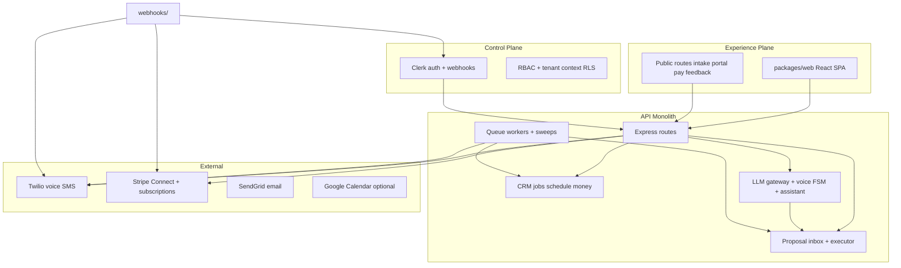

# AI Service OS — Platform Assessment & E2E QA Plan (50 Workflows)

**Date:** 2026-05-24  
**Status:** Draft for review  
**Audience:** Engineering, QA operators, release managers  

---

## 1. Executive summary

**AI Service OS (ServiceOS / Fieldly)** is a multi-tenant, voice-first field-service operating system: an Express/Postgres API, React web app, Clerk auth, Stripe money movement, Twilio telephony/SMS, and a proposal-gated AI layer (no autonomous writes to canonical entities).

| Dimension | Assessment |
|-----------|------------|
| **Code volume** | ~760 API source files, ~44k lines web; monorepo `infra/`, `packages/api`, `packages/web`, `packages/shared` |
| **Automated tests** | ~734 unit/integration test files (API + web); **19** Playwright E2E spec files |
| **Product completeness** | **~85% built** per [codebase-readiness-assessment.md](../../codebase-readiness-assessment.md); **~70% launch-ready** when weighted by held-slots, unified inbox gaps, comms wiring, and E2E coverage depth |
| **Web surface** | **~35 routed paths**, mode-aware nav (supervisor / tech / both), public customer flows |
| **API surface** | **49 route modules**, 21+ proposal types, 8 queue workers + interval sweeps, 5 external webhook families |
| **E2E maturity** | **Smoke always runs**; **QA matrix** (~30 matrix rows, API+UI+DB evidence); **coverage sweep** (~30 routes, opt-in); **4 journey specs** mostly skipped pending Clerk test DB + Stripe |

**Primary risk:** Thousands of unit tests pass while user-visible flows break (documented in `qa/reports/2026-05-11/OPERATOR-CHECKLIST.md` after PR #339). The fix path is layered E2E: route sweep → matrix → full journeys → voice/Twilio soak.

**Launch GTM (decision #1):** E2E gates target the **solo owner-operator** — one person runs phone, schedule, and money. Multi-tech **dispatch board** and dedicated **field-tech** surfaces are built in code but are **P1** for release QA (not launch blockers). See §4.0 and §8.

---

## 2. What has been built (by layer)

### 2.1 Architecture

### 2.2 Web application (`packages/web`)

| Area | Built | Gaps / partial |
|------|-------|----------------|
| **Auth** | Clerk login/signup, protected shell | — |
| **Onboarding** | v1 9-step + v2 flag-gated wizard (identity, pack, phone, billing, test call) | Trial gate not enforced everywhere; resumable checklist incomplete per launch spec |
| **Home / ops** | Dashboard, assistant chat, voice bar, proposal toasts | Assistant uses static context chips; time-given-back widget not built |
| **CRM** | Customers, leads kanban, jobs CRUD, tech job view | `JobSheets` estimate/invoice sheets still touch mock-data |
| **Schedule / dispatch** | Calendar, dispatch board drag-drop, feasibility, appointment edit | Conflict badges; held-slot UI not first-class |
| **Money** | Estimates, invoices, Stripe Elements pay page, money report, tax export | Job rollup `money_state` partial; some list routes in backlog |
| **Inbox / AI** | Unified `/inbox`, interactions log, escalation overlay | `/interactions/dispatch` unrouted in nav; scattered approve UIs elsewhere |
| **Field** | `/technician/day` | Tech ID defaults to `tech-1` without localStorage |
| **Public** | `/intake`, `/portal/:token`, `/e/:id`, `/pay/:id`, feedback | Intake header uses hardcoded tenant branding |
| **Settings** | Profile, team, Stripe, packs, templates, price book, feedback dashboard | Roles, reminders, Zapier → "Coming soon" |
| **Integrations** | Google Calendar OAuth + push on appointment create/assign (`CalendarSyncSheet` in Settings) | Update/delete sync deferred (PR 3); not launch-critical path per readiness spec but **built** |
| **Hidden routes** | Maintenance contracts, revenue-by-source | Not in primary nav; contracts **removed from top-50** per product decision |

**Parallel implementation:** `pages/*` list/detail components exist with API wiring but are **not** in `routes.ts` (superseded by `components/*`).

### 2.3 API (`packages/api`)

| Domain | Key capabilities |
|--------|------------------|
| **Tenancy** | Clerk JWT, RLS via `app.current_tenant_id`, audit on mutations |
| **CRM** | Customers, leads (6-stage), locations, notes |
| **Field ops** | Jobs, appointments, dispatch, time entries, technician GPS |
| **Money** | Estimates, invoices, billing engine (integer cents), Stripe Connect, deposits |
| **Proposals** | Typed Zod payloads, approve/reject/edit, idempotent executor, auto-execution worker |
| **AI** | LLM gateway (required), customer-calling FSM, 22 skills, orchestration, assistant chat |
| **Voice** | Twilio Gather + Media Streams (gated), in-app sessions, transcription pipeline |
| **Notifications** | SMS/email send, delay notices, feedback send; partial event→message matrix |
| **Portal / public** | Token-scoped estimate/invoice/payment/intake |
| **Workers** | Transcription, voice router, proposal correction, Twilio provision, overdue sweep, agreements, reminders |
| **Webhooks** | Clerk, Stripe, Twilio, SendGrid (P0-014 base) |

**Known gaps (launch-readiness cross-check):**

- Held-slot / `CreateBooking` lifecycle (Section 1, 5)
- Unified inbox was scattered — **web now has `/inbox`**; push/queue urgency routing still partial
- STOP/opt-out SMS handler (Section 7)
- Expense subsystem + full money dashboard rollup (Section 8) — reports exist; expenses net-new
- Executor concurrency hardening (Section 11)
- `dropped-call-worker` implemented but **not wired** in `app.ts`

### 2.4 Story / phase completion (snapshot)

From [codebase-readiness-assessment.md](../../codebase-readiness-assessment.md) (2026-05-06; still directionally accurate):

| Phase | Wired & working (approx.) |
|-------|---------------------------|
| P0 Platform | 17/18 |
| P1 Core entities | 22/24 |
| P2 Proposals + AI safety | 25/27 |
| P3 Conversation + voice | 12/15 |
| P4 Vertical packs | 26/26 |
| P5 Invoices + payments | 26/29 |
| P6 Dispatch + scheduling | 20/27 |
| P7 Integrations / beta | 5/18 |
| P8 Calling agent | 12/14 |

### 2.5 Existing QA infrastructure

| Asset | Location | Role |
|-------|----------|------|
| Smoke | `e2e/smoke.spec.ts` | Login/signup/redirect/health — **runs in CI** |
| QA matrix | `e2e/qa-matrix/*.spec.ts` + `matrix.ts` | API + UI screenshot + DB SQL evidence; `npm run e2e:qa-matrix` |
| Coverage sweep | `e2e/coverage-sweep.spec.ts` | All SPA routes, console errors, button wiring — `COVERAGE_SWEEP=1` |
| Journeys | `e2e/journeys/*.spec.ts` | Signup→estimate, approval execution, invoice→payment, onboarding v2 — **mostly skipped** |
| QA backlog | `qa/backlog/*.md` | Per-row failure writeups (legacy EST/INV/AST + matrix rows) |
| QA runner config | `qa-runner/config/test-plan.json` | Declarative API/UI/DB checks (1700+ lines, infrastructure-heavy) |
| Agent test plans | `docs/superpowers/agents/*/test-plan.md` | Voice, estimate, invoice, follow-up depth |
| Operator runbooks | `qa/reports/2026-05-11/*.md` | Clerk tokens, ephemeral PG, matrix live run |

---

## 3. E2E QA strategy (target state)

### 3.1 Four layers (bottom → top)

| Layer | Tool | Catches | Gate |
|-------|------|---------|------|
| **L0 Smoke** | `e2e/smoke.spec.ts` | Stack up, auth shell | Every PR |
| **L1 Route sweep** | `COVERAGE_SWEEP=1` | Unwired buttons, blank routes, 5xx fetches | Release candidate |
| **L2 QA matrix** | `e2e:qa-matrix` | Cross-layer truth (API/UI/DB drift) | Weekly + pre-release on Railway dev |
| **L3 Journeys** | `e2e/journeys/*` | Multi-step business loops | Green before launch |
| **L4 Voice soak** | Manual + `voice-quality` corpus | Twilio Media Streams, real STT/TTS latency | Pre-launch bar (Section 11) |

### 3.2 Environments

| Env | Use |
|-----|-----|
| **Ephemeral PG + local dev** | PR CI with `E2E_USE_TEST_DB=1` (testcontainers) |
| **Railway dev** | Matrix live run (`E2E_BASE_URL`, `E2E_API_URL`, `E2E_CLERK_HMAC_SECRET` = deployed `CLERK_SECRET_KEY`) |
| **Stripe CLI** | Forward webhooks for PAY rows (`stripe listen`) |

### 3.3 Evidence standard

A workflow is **verified** only when:

1. Playwright (or matrix harness) produces artifacts (screenshot + API JSON + optional SQL), **or**
2. Operator checklist row signed with screenshot + report link.

Green unit tests alone are **not** evidence (per `docs/qa-strategy.md` on QA branch).

---

## 4. The 50 most important user workflows

Priority: **P0** = launch blocker for **solo owner-operator** GTM (phone, money, schedule-as-owner, inbox); **P1** = core loop or **multi-tech / dispatch** (built, not launch-gated); **P2** = deferrable.

### 4.0 Solo launch scope

Per [launch-readiness spec](./2026-05-14-serviceos-launch-readiness-design.md), launch exposes the owner as the only operator at the product surface. The codebase still has dispatch lanes, technician day view, and mode toggles — they are **out of the P0 release gate** until multi-tech GTM.

| In scope (P0 E2E gate) | Out of P0 gate (P1, still in top-50) |
|------------------------|--------------------------------------|
| Voice inbound + inbox approve + schedule as owner | WF-23–27 dispatch & field-tech UX |
| Lead → job → estimate → pay | Drag-assign feasibility board |
| Onboarding + Twilio + Stripe | Tech `/technician/day`, `?view=tech` |

**P0 workflow count for solo launch gate: 25** (50 total catalog; WF-23–27 plus 20 other P1 rows).

Columns:

- **Matrix** = existing `e2e/qa-matrix` row ID (if any)
- **Auto** = none | matrix | journey | sweep | manual

### 4.1 Foundation & access (WF-01 – WF-05)

| ID | Workflow | Actor | Priority | Auto | Pass criteria (summary) |
|----|----------|-------|----------|------|-------------------------|
| WF-01 | Sign up → Clerk webhook bootstraps tenant | New owner | P0 | journey | Tenant + settings rows; `/api/me` returns tenantId |
| WF-02 | Sign in → land on home (or onboarding guard) | Owner | P0 | smoke + sweep | Authenticated shell loads; no console errors |
| WF-03 | Unauthenticated `/` redirects to login | Visitor | P0 | smoke | 302 to `/login` |
| WF-04 | Cross-tenant API isolation | Attacker token | P0 | ISO-01 | Tenant B cannot read Tenant A entities (403/404) |
| WF-05 | API health + readiness | Monitor | P0 | smoke | `/health` and `/ready` 200 |

### 4.2 Onboarding & go-live (WF-06 – WF-10)

| ID | Workflow | Actor | Priority | Auto | Pass criteria |
|----|----------|-------|----------|------|-----------------|
| WF-06 | Onboarding v2: identity → pack → phone → billing | New owner | P0 | journey (onboarding-v2) | Checklist advances; pack active in `/api/verticals` |
| WF-07 | Twilio subaccount provision (async worker) | System | P0 | manual / PROV | Phone number assigned; voice endpoint reachable |
| WF-08 | Test call step confirms agent answers | Owner | P0 | manual | Inbound test call completes FSM greeting |
| WF-09 | Stripe subscription / trial start | Owner | P1 | BILL / manual | Subscription row; billing portal session |
| WF-10 | Onboarding guard blocks app until complete (v2 flag) | Owner | P1 | sweep | Incomplete tenant redirected to `/onboarding` |

### 4.3 CRM — customers & leads (WF-11 – WF-16)

| ID | Workflow | Actor | Priority | Auto | Pass criteria |
|----|----------|-------|----------|------|-----------------|
| WF-11 | Create customer (UI + API) | Owner | P0 | CUS-01 | Customer in list + DB under tenant |
| WF-12 | Edit customer + service location | Owner | P1 | CUS-02 | Updated fields persist; dedupe holds |
| WF-13 | Search / open customer timeline | Owner | P1 | sweep `/customers/:id` | Timeline loads comms + jobs |
| WF-14 | Create lead + move kanban stage | Owner | P1 | sweep `/leads` | Stage change persists |
| WF-15 | Convert lead → customer | Owner | P1 | manual | Customer linked; lead marked won |
| WF-16 | Public intake form submit → lead/customer | Prospect | P0 | manual | `POST /public/intake` + row visible in leads |

### 4.4 Jobs & scheduling (WF-17 – WF-22)

| ID | Workflow | Actor | Priority | Auto | Pass criteria |
|----|----------|-------|----------|------|-----------------|
| WF-17 | Create job from customer | Owner | P0 | SCH-01 / sweep | Job row + appears on `/jobs` |
| WF-18 | Job lifecycle: scheduled → in progress → complete | Owner (solo) | P0 | sweep | Status transitions audit-logged |
| WF-19 | Create appointment on schedule calendar | Owner | P0 | SCH-01 | Appointment visible week view |
| WF-20 | Reschedule appointment (UI + API) | Owner | P0 | SCH-02 | Window + version update; single assignment |
| WF-21 | Cancel appointment | Owner | P1 | SCH-03 / voice | Status canceled; dispatch event |
| WF-22 | Clock in / out time entry on job | Tech | P1 | sweep tech view | Time entry rows; weekly hours API |

### 4.5 Dispatch & field (WF-23 – WF-27) — **P1 for solo launch**

Multi-tech / dispatcher flows. Required for shops with crews; **not** in the solo owner-operator release gate.

| ID | Workflow | Actor | Priority | Auto | Pass criteria |
|----|----------|-------|----------|------|-----------------|
| WF-23 | Dispatch: drag unassigned → technician lane | Dispatcher | P1 | manual + sweep `/dispatch` | Assignment proposal or direct assign per product rules |
| WF-24 | Feasibility preview before confirm | Dispatcher | P1 | manual | Overlap/travel warnings surface |
| WF-25 | Approve schedule proposal from dispatch | Owner | P1 | inbox | Proposal executed; calendar updates |
| WF-26 | Technician day view: arrival + status SMS | Tech | P1 | sweep `/technician/day` | Status update + optional customer notify |
| WF-27 | Tech job view `?view=tech` status CTAs | Tech | P1 | sweep | Mobile CTAs change job state |

### 4.6 Money loop (WF-28 – WF-35)

| ID | Workflow | Actor | Priority | Auto | Pass criteria |
|----|----------|-------|----------|------|-----------------|
| WF-28 | Draft estimate with line items (billing engine totals) | Owner | P0 | EST-01, JRN-01 | Integer cents correct in API + DB |
| WF-29 | Send estimate to customer (SMS/email) | Owner | P0 | JRN-01 | Status sent; dispatch log row |
| WF-30 | Customer approves estimate on `/e/:token` | Customer | P0 | PORT-01 | Status accepted; deposit if configured |
| WF-31 | Convert estimate → invoice (no re-key) | Owner | P0 | BILL-01 | `estimate_id` link; line items preserved |
| WF-32 | Issue invoice + delivery | Owner | P0 | BILL-02 | Issued timestamp; customer receives link |
| WF-33 | Customer pays on `/pay/:id` (Stripe) | Customer | P0 | PORT-02, journey | `checkout.session.completed` → invoice paid |
| WF-34 | Partial payment → full pay + overpay guard | Customer | P1 | PAY-01 | `partially_paid` → `paid`; overpay rejected |
| WF-35 | Money dashboard + overdue state | Owner | P1 | PAY-03, PAY-04 | Revenue reflects payments; overdue job state |

### 4.7 AI proposals & operator assistant (WF-36 – WF-41)

| ID | Workflow | Actor | Priority | Auto | Pass criteria |
|----|----------|-------|----------|------|-----------------|
| WF-36 | Inbox: approve booking proposal | Owner | P0 | manual / AST | Executor runs; appointment exists |
| WF-37 | Inbox: reject proposal (no side effect) | Owner | P0 | manual | Status rejected; no duplicate entity |
| WF-38 | Inbox: edit proposal payload before approve | Owner | P1 | manual | Edited fields in execution result |
| WF-39 | Assistant chat → create estimate proposal | Owner | P1 | AST-02 | Proposal card → approve → estimate row |
| WF-40 | Voice bar command → proposal or navigation | Owner | P1 | sweep + manual | Transcript routed; no silent failure |
| WF-41 | Proposal toast → review in inbox | Owner | P1 | sweep | Toast navigates to `/inbox` |

### 4.8 Inbound voice & interactions (WF-42 – WF-46)

| ID | Workflow | Actor | Priority | Auto | Pass criteria |
|----|----------|-------|----------|------|-----------------|
| WF-42 | Inbound call: identify → book appointment proposal | Caller | P0 | SCH-02, CUST-02 | Session + proposal; approve → appointment |
| WF-43 | Emergency utterance → escalation path | Caller | P0 | VOX-01 | Escalation state; human handoff context |
| WF-44 | Recording webhook → transcript → interaction log | System | P1 | VOICE-01 | Interaction visible on `/interactions` |
| WF-45 | In-app voice session (WebSocket) | Owner | P1 | manual | Session completes; proposals optional |
| WF-46 | View call transcript drawer | Owner | P1 | sweep `/interactions` | Transcript loads without 5xx |

### 4.9 Public & customer self-service (WF-47 – WF-49)

| ID | Workflow | Actor | Priority | Auto | Pass criteria |
|----|----------|-------|----------|------|-----------------|
| WF-47 | Customer portal token: view jobs/estimates/invoices | Customer | P0 | PORTAL-01 | Tabs load token-scoped data only |
| WF-48 | Portal request service → creates lead/job proposal | Customer | P1 | manual | Request recorded; operator notified |
| WF-49 | Post-job feedback `/public/feedback/:token` | Customer | P1 | sweep | Rating persisted; dashboard chart updates |

### 4.10 Integrations (WF-50)

| ID | Workflow | Actor | Priority | Auto | Pass criteria |
|----|----------|-------|----------|------|-----------------|
| WF-50 | **Google Calendar connect → appointment push → verify event** | Owner | P1 | manual + API tests | `POST /api/calendar-integrations/google/connect` returns auth URL; OAuth callback stores integration; creating/assigning an appointment writes `appointment_calendar_events.status='synced'` with `external_event_id`; optional `POST .../google/test-push` succeeds; disconnect clears integration |

**Replaces (deferred from top-50):** maintenance contracts (`/contracts`) — still routed and API-backed, but out of launch E2E scope unless promoted later.

---

## 5. Workflow → automation mapping

### 5.1 Coverage heatmap

| Auto level | Count (of 50) | Workflow IDs |
|------------|---------------|--------------|
| **Matrix row exists** | 22 | WF-04,11,17-21,28-35,42-44,47,33,30,31… (see Matrix column above) |
| **Journey spec** | 6 | WF-01,06,28-33 chain,06 |
| **Coverage sweep only** | 12 | WF-02,10,13,14,18,26,27,40,46,49, parts of 22 |
| **API route tests (no E2E yet)** | 1 | WF-50 (`calendar-integrations.route.test.ts`) |
| **Manual / Twilio** | 10 | WF-07,08,23,24,36-38,42 live call,45,48 |
| **P1 only (solo launch gate)** | 25 | WF-09,10,12–15,21,23–27,34,35,38–41,44–46,48,49,50 |

### 5.2 Recommended implementation phases

**Phase A — Unblock automation (1–2 engineering iterations)**

1. Wire Clerk testing tokens + ephemeral PG (`qa/reports/2026-05-11/*-runbook.md`).
2. Unskip `signup-to-first-estimate`, `invoice-to-payment`, `onboarding-v2`.
3. Enforce `COVERAGE_SWEEP=1` on release PRs against preview deploy.

**Phase B — Map 50 workflows to Playwright (2–3 iterations)**

1. Add `e2e/workflows/` spec files grouped by section (5 specs × ~10 tests).
2. Reuse matrix helpers (`api-verifier`, `db-verifier`, `report-builder`).
3. Each WF-ID tagged in test title: `test('WF-28: draft estimate', ...)`.
4. Add matrix row **`CAL-01`** for WF-50 (OAuth mocked or staging Google test account; assert `appointment_calendar_events` after WF-19).

**Phase C — Close matrix backlog**

1. Run `npm run e2e:qa-matrix` on Railway dev; triage `qa/reports/<date>/QA-REPORT.md`.
2. Close rows in `qa/backlog/` (INV-02, INV-04, VOICE-02, legacy AST gaps).
3. Wire `dropped-call-worker` or document WF-42 exclusion in VOX-04.

**Phase D — Launch bar (Section 11)**

1. Voice load test + inbound smoke on staging Twilio.
2. Critical path journey: **WF-42 → WF-36 → WF-29 → WF-30 → WF-31 → WF-33** as single `@critical` spec.
3. Executor lock/transaction hardening + alert rules on webhook/executor failures.

---

## 6. Test data & fixtures

| Fixture | Purpose | Location |
|---------|---------|----------|
| QA Tenant A/B | Isolation + matrix | `e2e/qa-matrix/fixtures/seed.ts` |
| Journey tenant | Signup flow | `e2e/fixtures/seed-journey-fixtures.ts` |
| HMAC tokens | API auth without Clerk UI | `e2e/qa-matrix/fixtures/tokens.ts` |
| Stripe `evt_qa_*` | Idempotent webhook | Matrix INV/PAY rows |

---

## 7. Roles & execution checklist

| Role | Action |
|------|--------|
| **Developer** | Tag PRs with WF-IDs fixed; add regression test per `qa-strategy` |
| **QA operator** | Weekly matrix run + archive report under `qa/reports/` |
| **Release manager** | Gate on: smoke + coverage sweep + **all P0 workflows** (25 solo) + critical journey green |
| **On-call** | Manual WF-07,08,42 on staging before prod promote |

---

## 8. Decisions

| # | Topic | Status |
|---|--------|--------|
| 1 | **Launch persona** — solo vs dispatch/tech P0 | **Resolved (2026-05-24):** **Solo owner-operator** GTM; WF-23–27 demoted to **P1**; P0 release gate = **25 workflows** (§4.0) |
| 2 | **Environment of record** — Railway dev vs CI ephemeral | **Open** |
| 3 | **WF-50 slot** — contracts vs Google Calendar | **Resolved (2026-05-24):** WF-50 = **Google Calendar sync**; maintenance contracts deferred |
| 4 | **Held-slot workflows** | **Open** — add WF-51+ when `CreateBooking` ships, or tighten WF-36/42 now |

---

## 9. References

- [CLAUDE.md](../../../CLAUDE.md) — build verification, skill routing  
- [codebase-readiness-assessment.md](../../codebase-readiness-assessment.md)  
- [2026-05-14-serviceos-launch-readiness-design.md](./2026-05-14-serviceos-launch-readiness-design.md)  
- [qa/README.md](../../../qa/README.md)  
- [e2e/README.md](../../../e2e/README.md)  
- [e2e/qa-matrix/matrix.ts](../../../e2e/qa-matrix/matrix.ts)  

---

## 10. Appendix — Matrix row index (current catalog)

For alignment with automation already written:

`PROV-01`, `PROV-02`, `CUS-01`, `CUS-02`, `EST-01`–`03`, `BILL-01`–`03`, `SCH-01`–`03`, `SMS-01`–`02`, `PAY-01`–`04`, `VOICE-01`–`02`, `ISO-01`–`02`, `PORTAL-01`–`02`, `JRN-01`–`02`, `PORT-01`–`02`, `VOX-01`–`04`, legacy `EST-01`–`06`, `INV-01`–`07`, `AST-01`–`07` (estimates/invoices/assistant specs still run; catalog marks legacy baseline deprecated).

Legacy backlog docs: `qa/backlog/*.md`.

**Proposed matrix row (not yet in `matrix.ts`):**

- **`CAL-01`** — Google Calendar OAuth connect + appointment push (`WF-50`). Depends on `SCH-01` / WF-19; use mocked Google in CI or dedicated staging OAuth client.
