# ServiceOS — UI Screen Flow

> Generated by `npm run ui-flow:doc` (`scripts/build-ui-flow-doc.ts`).
> Screenshots captured: **51 / 54**. To (re)capture, see "Capturing screenshots" below.

A map of every UI screen and how users move between them, across the mobile
operator app, the web back office, and the public customer-facing pages.

## Flow map

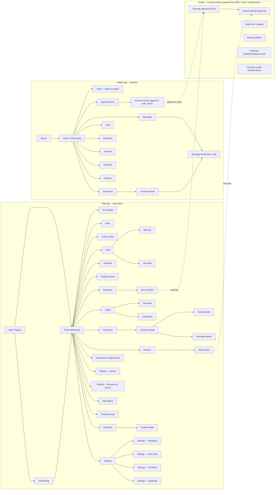

## Mobile app — operator

### Sign in


- → Home / Today (hub)

### Home / Today (hub)


- → Voice — speak an action, Approval inbox, Messages, Customers, Jobs, Estimates, Invoices, Schedule, Settings

### Voice — speak an action


### Approval inbox


- → Proposal review (approve / edit / reject)

### Proposal review (approve / edit / reject)

> _Screenshot not captured yet — run `npm run ui-flow:capture` (`captures/mobile/proposal.png`)._

- Also opened from a push notification

### Messages


- → Message thread (text / call)

### Message thread (text / call)

> _Screenshot not captured yet — run `npm run ui-flow:capture` (`captures/mobile/thread.png`)._


### Customers


- → Customer detail

### Customer detail

> _Screenshot not captured yet — run `npm run ui-flow:capture` (`captures/mobile/customer.png`)._

- → Message thread (text / call)

### Jobs


### Estimates


### Invoices


### Schedule

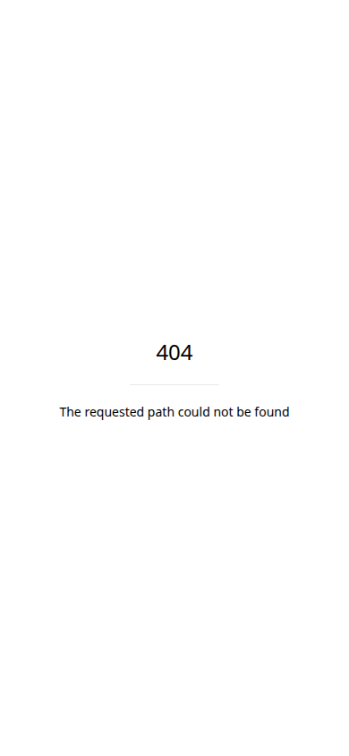


### Settings


## Web app — back office

### Login / Signup


- → Onboarding, Home dashboard

### Onboarding

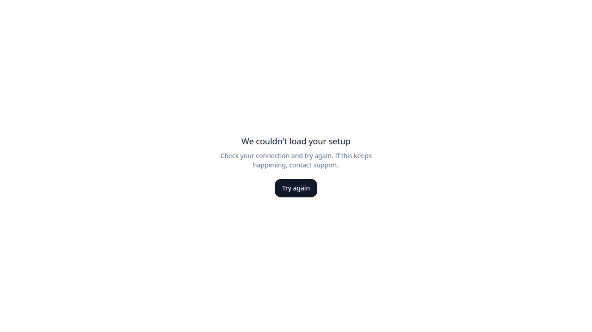

- → Home dashboard

### Home dashboard

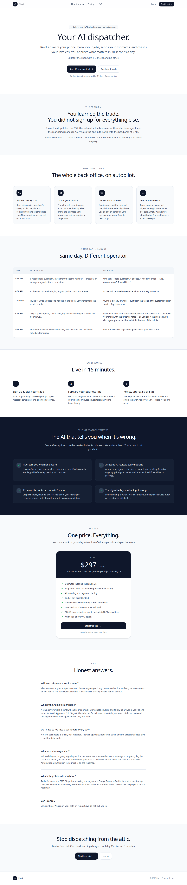

- → AI Assistant, Inbox, Comms inbox, Jobs, Schedule, Dispatch board, Customers, Leads, Estimates, Invoices, Contracts, Interactions / Dispatch log, Reports — Money, Reports — Revenue by source, Daily digest, Technician day, Settings

### AI Assistant


### Inbox


### Comms inbox


### Jobs


- → New job, Job detail

### New job


### Job detail


### Schedule


### Dispatch board


### Customers


- → Customer detail

### Customer detail


- → Edit customer, Edit appointment

### Edit customer


### Edit appointment


### Leads


- → New lead, Lead detail

### New lead


### Lead detail


### Estimates


- → New estimate

### New estimate


### Invoices

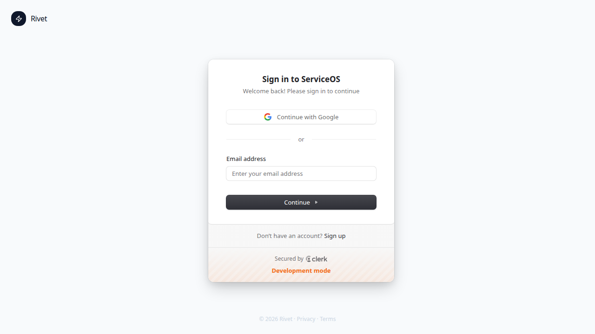

- → New invoice

### New invoice


### Contracts


- → Contract detail

### Contract detail


### Interactions / Dispatch log


### Reports — Money


### Reports — Revenue by source


### Daily digest


### Technician day


### Settings


- → Settings — Templates, Settings — Price book, Settings — Feedback, Settings — Language

### Settings — Templates


### Settings — Price book


### Settings — Feedback


### Settings — Language


## Public — customer-facing (opened from SMS / email / website links)

### Estimate approval (/e/:id)

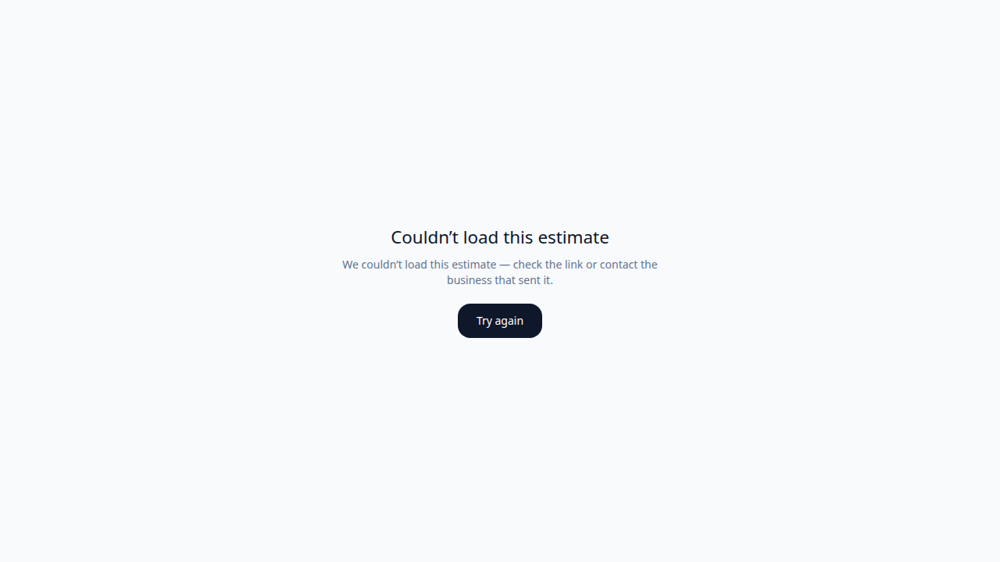

- Link sent from an estimate
- → Invoice payment (/pay/:id)

### Invoice payment (/pay/:id)

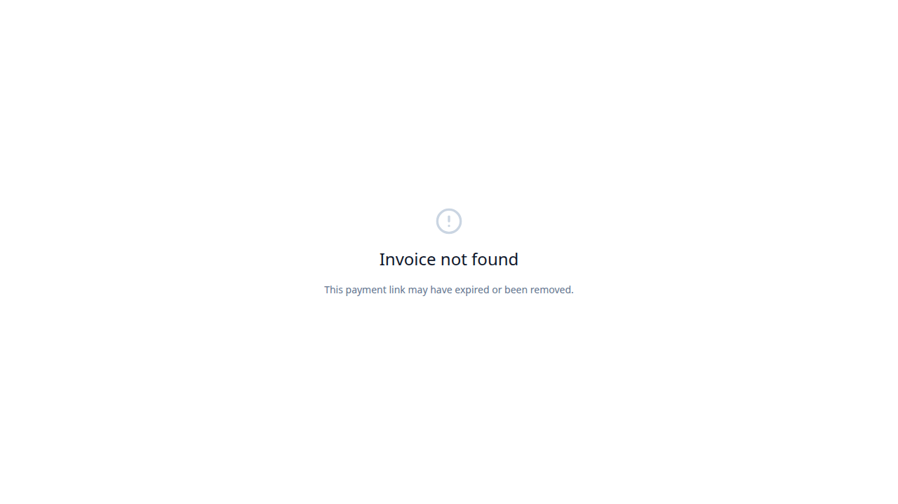

- Link sent from an invoice

### Intake form (/intake)

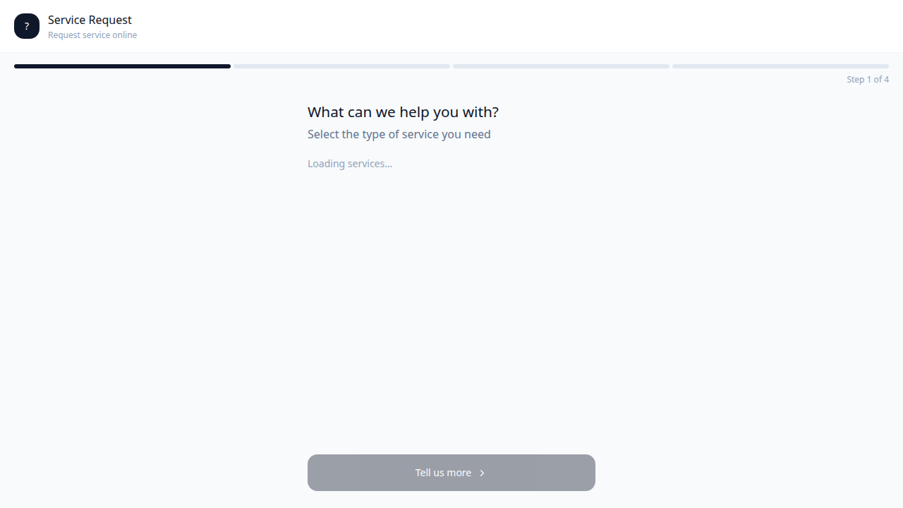

- Website / SMS link

### Booking (/book)

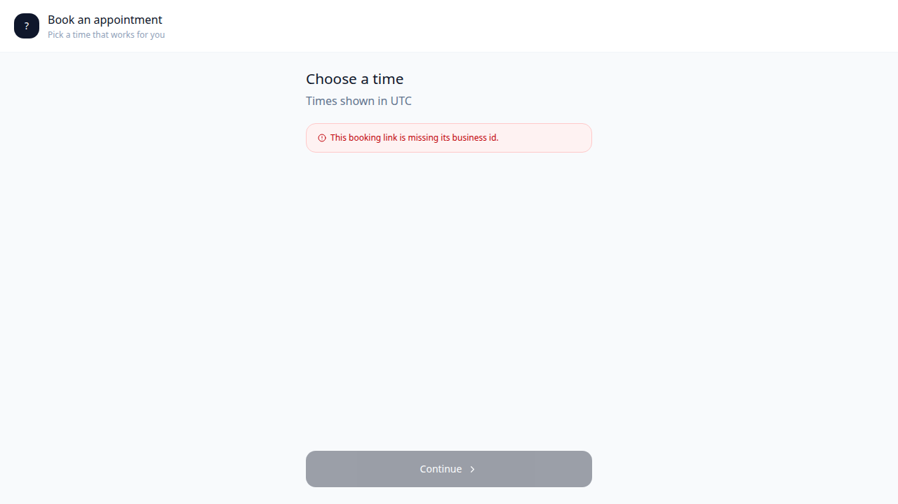

- Website / SMS link

### Feedback (/public/feedback/:token)

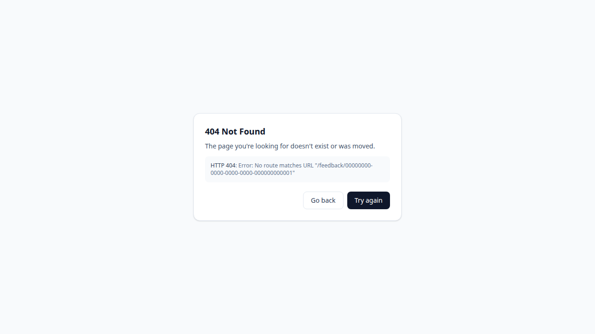

- Sent after a completed job

### Customer portal (/portal/:token)

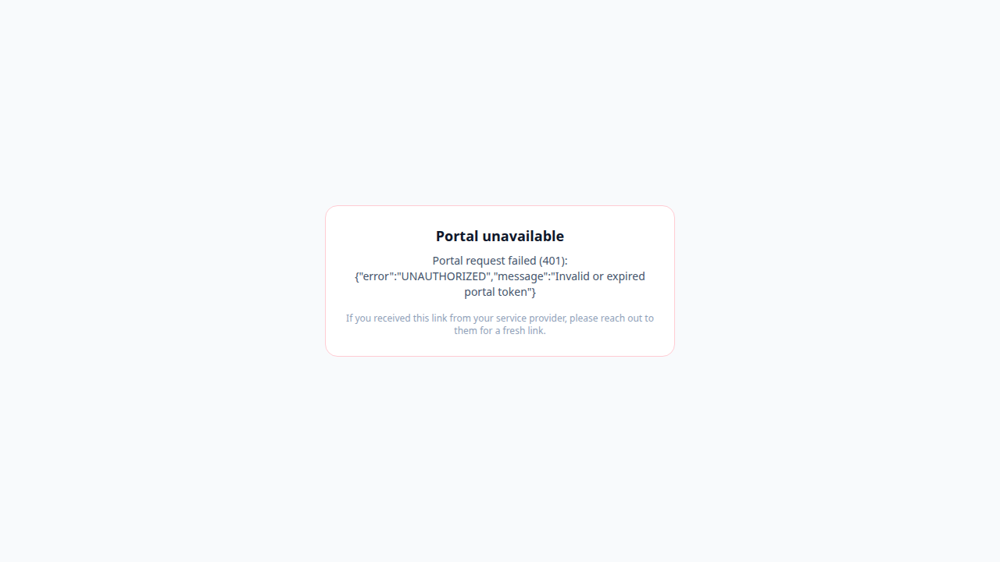

- Customer self-serve link

## Capturing screenshots

Screens render only against a running app with auth + data, so capture runs
where that exists (CI, a dev machine, or a deployed env), not in a bare
container. Then re-run the assembler to embed the images.

```bash
# Web (Vite SPA) — local stack OR a deployed URL that has Clerk wired:
UI_FLOW=1 VITE_CLERK_PUBLISHABLE_KEY=pk_test_... E2E_CLERK_SECRET_KEY=sk_test_... \
  npm run ui-flow:capture
#   …or against a deployed env (no local stack):
UI_FLOW=1 E2E_BASE_URL=https://your-web-env.example.com npm run ui-flow:capture

# Mobile (Expo operator app) — export to web, serve it, then capture:
cd packages/mobile && npm run export:web && cd ../..
npx serve packages/mobile/.e2e-web -l 8081 &
UI_FLOW=1 E2E_MOBILE_URL=http://localhost:8081 \
  npx playwright test e2e/ui-flow-capture-mobile.spec.ts --project=ui-flow

# Rebuild this doc with the new screenshots embedded:
npm run ui-flow:doc
```

Without Clerk creds the web tour runs anonymously (authed routes redirect to
login); set `E2E_CLERK_*` for the real authenticated screens.
